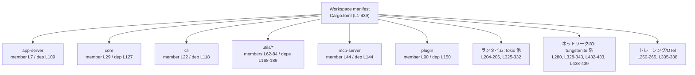
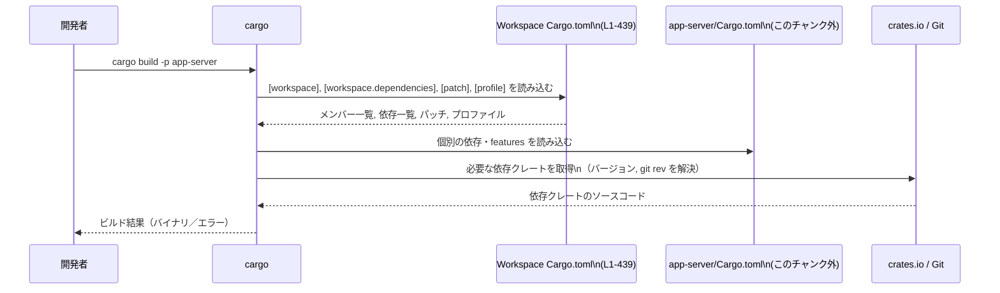

# Cargo.toml コード解説

## 0. ざっくり一言

この `Cargo.toml` は、Rust ワークスペース全体のメンバークレート、共通の依存関係、Lint 方針、ビルドプロファイル、パッチ設定などをまとめて定義するルートマニフェストです（Cargo.toml:L1-439）。

---

## 1. このモジュールの役割

### 1.1 概要

- このファイルは、複数の内部クレートを一つの **Cargo ワークスペース** として管理するための設定を提供します（Cargo.toml:L1-92）。
- 内部クレート同士、および外部クレートとの依存関係のバージョンを **ワークスペース単位で一元管理** します（Cargo.toml:L103-193, L195-361）。
- Clippy Lint やビルドプロファイル、依存クレートのパッチ設定をワークスペース全体に適用することで、**コード品質とビルド特性を統一** します（Cargo.toml:L363-420, L427-439）。

### 1.2 アーキテクチャ内での位置づけ

このファイルは、すべてのメンバークレートの上位にあり、Cargo に対して「どのクレートがワークスペースに属し、どの依存関係をどのバージョン／ソースで使うか」を伝える役割を持ちます。



- `root` ノードがこの `Cargo.toml` を表し、各メンバークレートや代表的な外部依存クレートに対して設定を提供しています。
- `runtime_tokio`, `net_stack`, `telemetry` は、それぞれ非同期処理・ネットワーク I/O・トレーシング関連の依存グループを表す概念ノードです（依存宣言自体は Cargo.toml:L204-207, L260-265, L280, L325-343 に分散）。

### 1.3 設計上のポイント

- **モノレポ構成のワークスペース**  
  多数の内部クレート（`analytics`, `app-server`, `core`, `utils/*` など）を `members` に列挙し、一つのリポジトリで管理する構成になっています（Cargo.toml:L2-91）。

- **内部クレートの別名（codex-*）管理**  
  多くの内部クレートは `codex-*` という名前で `workspace.dependencies` にも登録されており、ワークスペース各クレートから共通の名前で参照できるようにしています（例: `codex-core = { path = "core" }`（Cargo.toml:L127））。

- **外部依存の一元管理**  
  `age`, `tokio`, `axum`, `sqlx`, `rustls`, `tracing`, `opentelemetry` などの外部クレートが、ワークスペース依存として一括で宣言されています（Cargo.toml:L195-361）。

- **安全性とエラー処理を意識した Lint 方針**  
  Clippy の `unwrap_used`, `expect_used` など多くの Lint が `deny` に設定されており、パターン的に危険なコードの利用をワークスペース全体で禁止しています（Cargo.toml:L367-399）。

- **ビルド最適化とサイズ削減**  
  `release` プロファイルで LTO を `fat` に設定し（Cargo.toml:L412）、`strip = "symbols"` によりバイナリサイズ削減を行っています（Cargo.toml:L417）。さらに `codegen-units = 1` により最適化の質を重視しています（Cargo.toml:L419-420）。

- **依存クレートのフォーク／パッチ利用**  
  `crossterm`, `ratatui`, `tokio-tungstenite`, `tungstenite` については、crates.io のデフォルトではなく特定の Git リポジトリ／リビジョンを `patch` 経由で使用するよう上書きしています（Cargo.toml:L427-433, L438-439）。

---

## 2. 主要な機能一覧

この `Cargo.toml` が提供する主な「機能」を列挙します。

- **ワークスペースメンバーの定義**  
  `[workspace]` セクションで、約 80 個の内部クレートを `members` に列挙します（Cargo.toml:L1-91）。

- **ワークスペース共通の内部依存（path）の宣言**  
  多数の `codex-*` およびテスト用サポートクレートを、`path` 付きで `workspace.dependencies` として定義します（Cargo.toml:L103-193）。

- **ワークスペース共通の外部依存の宣言**  
  `# External` 以降で、HTTP/DB/非同期/トレーシング/暗号化など多様な外部クレートをバージョン指定で定義します（Cargo.toml:L195-361）。

- **Rust/Clippy Lint のワークスペース設定**  
  `[workspace.lints]` と `[workspace.lints.clippy]` により、Rust コンパイラと Clippy の Lint ポリシーをワークスペース全体に適用します（Cargo.toml:L363-399）。

- **cargo-shear 用メタデータ**  
  未使用依存解析ツール `cargo-shear` に対して、見かけ上未使用に見えるが実際には必要な依存を `ignored` としてホワイトリスト登録します（Cargo.toml:L401-410）。

- **ビルドプロファイルの共通設定**  
  `release` と CI 用テストプロファイル `ci-test` の最適化レベル・デバッグ情報・コード生成ユニット数などを指定します（Cargo.toml:L412-420, L422-425）。

- **依存クレートのパッチ設定**  
  `[patch.crates-io]` と特定 Git URL に対する `[patch."ssh://…"]` で、一部依存クレートのソースをフォーク版に差し替えます（Cargo.toml:L427-433, L438-439）。

---

## 3. 公開 API と詳細解説

このファイルは **設定ファイル** であり、Rust の関数や構造体などの API は定義していません。そのため、ここでは「セクション」と「コンポーネント（クレート）」を中心に整理します。

### 3.1 型一覧（構造体・列挙体など）相当: マニフェストセクション一覧

| 名前 | 種別 | 役割 / 用途 | 根拠 |
|------|------|-------------|------|
| `[workspace]` | セクション | ワークスペースメンバーとリゾルババージョンを定義する | Cargo.toml:L1-2, L92 |
| `members` | 配列 | 参加する内部クレートのパス一覧 | Cargo.toml:L2-91 |
| `resolver = "2"` | キー | 依存解決アルゴリズムとして Resolver 2 を選択 | Cargo.toml:L92 |
| `[workspace.package]` | セクション | ワークスペース共通の `version`, `edition`, `license` を設定 | Cargo.toml:L94-101 |
| `[workspace.dependencies]` | セクション | 内部/外部の依存クレートをワークスペースレベルで宣言 | Cargo.toml:L103-193, L195-361 |
| `[workspace.lints]` | セクション | Rust コンパイラ Lint の共通設定（ここでは空） | Cargo.toml:L363-364 |
| `[workspace.lints.clippy]` | セクション | Clippy の個別 Lint レベルを `deny` などで指定 | Cargo.toml:L366-399 |
| `[workspace.metadata.cargo-shear]` | セクション | cargo-shear 用のメタデータ。無視する依存クレートのリスト | Cargo.toml:L401-410 |
| `[profile.release]` | セクション | Release ビルドの最適化・LTO・デバッグ情報・ストリップ設定 | Cargo.toml:L412-420 |
| `[profile.ci-test]` | セクション | CI テスト用ビルドプロファイル | Cargo.toml:L422-425 |
| `[patch.crates-io]` | セクション | crates.io の依存解決を特定 Git リポジトリに差し替え | Cargo.toml:L427-433 |
| `[patch."ssh://git@github.com/openai-oss-forks/tungstenite-rs.git"]` | セクション | 特定 Git URL から取得される `tungstenite` を、別 Git リポジトリの同 rev に差し替え | Cargo.toml:L438-439 |

#### 3.1.2 ワークスペースメンバー一覧（コンポーネントインベントリー）

ワークスペースに含まれる内部クレート（`[workspace].members`）の一覧です。

| メンバークレートパス | 説明（コードから分かる範囲） | 定義行 |
|----------------------|------------------------------|--------|
| `analytics` | ローカルクレート。`codex-analytics` として依存登録あり | Cargo.toml:L3, L106 |
| `backend-client` | ローカルクレート。`codex-backend-client` として依存登録あり | Cargo.toml:L4, L116 |
| `ansi-escape` | ローカルクレート。`codex-ansi-escape` として依存登録あり | Cargo.toml:L5, L107 |
| `async-utils` | ローカルクレート。`codex-async-utils` として依存登録あり | Cargo.toml:L6, L115 |
| `app-server` | ローカルクレート。`codex-app-server` として依存登録あり | Cargo.toml:L7, L109 |
| `app-server-client` | ローカルクレート。`codex-app-server-client` として依存登録あり | Cargo.toml:L8, L110 |
| `app-server-protocol` | ローカルクレート。`codex-app-server-protocol` として依存登録あり | Cargo.toml:L9, L111 |
| `app-server-test-client` | ローカルクレート。`codex-app-server-test-client` として依存登録あり | Cargo.toml:L10, L112 |
| `debug-client` | ローカルクレート（依存セクションに同名の別名はなし） | Cargo.toml:L11 |
| `apply-patch` | ローカルクレート。`codex-apply-patch` として依存登録あり | Cargo.toml:L12, L113 |
| `arg0` | ローカルクレート。`codex-arg0` として依存登録あり | Cargo.toml:L13, L114 |
| `feedback` | ローカルクレート。`codex-feedback` として依存登録あり | Cargo.toml:L14, L134 |
| `features` | ローカルクレート。`codex-features` として依存登録あり | Cargo.toml:L15, L133 |
| `codex-backend-openapi-models` | ローカルクレート。workspace.dependencies には同名キーなし | Cargo.toml:L16 |
| `code-mode` | ローカルクレート。`codex-code-mode` として依存登録あり | Cargo.toml:L17, L124 |
| `cloud-requirements` | ローカルクレート。`codex-cloud-requirements` として依存登録あり | Cargo.toml:L18, L121 |
| `cloud-tasks` | ローカルクレート（依存セクションに同名の別名はなし） | Cargo.toml:L19 |
| `cloud-tasks-client` | ローカルクレート。`codex-cloud-tasks-client` として依存登録あり | Cargo.toml:L20, L122 |
| `cloud-tasks-mock-client` | ローカルクレート。`codex-cloud-tasks-mock-client` として依存登録あり | Cargo.toml:L21, L123 |
| `cli` | ローカルクレート。`codex-cli` として依存登録あり | Cargo.toml:L22, L118 |
| `collaboration-mode-templates` | ローカルクレート。`codex-collaboration-mode-templates` として依存登録あり | Cargo.toml:L23, L120 |
| `connectors` | ローカルクレート。`codex-connectors` として依存登録あり | Cargo.toml:L24, L126 |
| `config` | ローカルクレート。`codex-config` として依存登録あり | Cargo.toml:L25, L125 |
| `shell-command` | ローカルクレート。`codex-shell-command` として依存登録あり | Cargo.toml:L26, L160 |
| `shell-escalation` | ローカルクレート。`codex-shell-escalation` として依存登録あり | Cargo.toml:L27, L161 |
| `skills` | ローカルクレート。`codex-skills` として依存登録あり | Cargo.toml:L28, L162 |
| `core` | ローカルクレート。`codex-core` として依存登録あり | Cargo.toml:L29, L127 |
| `core-skills` | ローカルクレート。`codex-core-skills` として依存登録あり | Cargo.toml:L30, L128 |
| `hooks` | ローカルクレート。`codex-hooks` として依存登録あり | Cargo.toml:L31, L137 |
| `instructions` | ローカルクレート。`codex-instructions` として依存登録あり | Cargo.toml:L32, L138 |
| `secrets` | ローカルクレート。`codex-secrets` として依存登録あり | Cargo.toml:L33, L159 |
| `exec` | ローカルクレート。`codex-exec` として依存登録あり | Cargo.toml:L34, L129 |
| `exec-server` | ローカルクレート。`codex-exec-server` として依存登録あり | Cargo.toml:L35, L130 |
| `execpolicy` | ローカルクレート。`codex-execpolicy` として依存登録あり | Cargo.toml:L36, L131 |
| `execpolicy-legacy` | ローカルクレート（依存セクションに同名の別名はなし） | Cargo.toml:L37 |
| `keyring-store` | ローカルクレート。`codex-keyring-store` として依存登録あり | Cargo.toml:L38, L139 |
| `file-search` | ローカルクレート。`codex-file-search` として依存登録あり | Cargo.toml:L39, L135 |
| `linux-sandbox` | ローカルクレート。`codex-linux-sandbox` として依存登録あり | Cargo.toml:L40, L140 |
| `lmstudio` | ローカルクレート。`codex-lmstudio` として依存登録あり | Cargo.toml:L41, L141 |
| `login` | ローカルクレート。`codex-login` として依存登録あり | Cargo.toml:L42, L142 |
| `codex-mcp` | ローカルクレート。`codex-mcp` として依存登録あり | Cargo.toml:L43, L143 |
| `mcp-server` | ローカルクレート。`codex-mcp-server` として依存登録あり | Cargo.toml:L44, L144 |
| `model-provider-info` | ローカルクレート。`codex-model-provider-info` として依存登録あり | Cargo.toml:L45, L145 |
| `models-manager` | ローカルクレート。`codex-models-manager` として依存登録あり | Cargo.toml:L46, L146 |
| `network-proxy` | ローカルクレート。`codex-network-proxy` として依存登録あり | Cargo.toml:L47, L147 |
| `ollama` | ローカルクレート。`codex-ollama` として依存登録あり | Cargo.toml:L48, L148 |
| `process-hardening` | ローカルクレート。`codex-process-hardening` として依存登録あり | Cargo.toml:L49, L151 |
| `protocol` | ローカルクレート。`codex-protocol` として依存登録あり | Cargo.toml:L50, L152 |
| `realtime-webrtc` | ローカルクレート。`codex-realtime-webrtc` として依存登録あり | Cargo.toml:L51, L153 |
| `rollout` | ローカルクレート。`codex-rollout` として依存登録あり | Cargo.toml:L52, L157 |
| `rmcp-client` | ローカルクレート。`codex-rmcp-client` として依存登録あり | Cargo.toml:L53, L156 |
| `responses-api-proxy` | ローカルクレート。`codex-responses-api-proxy` として依存登録あり | Cargo.toml:L54, L154 |
| `response-debug-context` | ローカルクレート。`codex-response-debug-context` として依存登録あり | Cargo.toml:L55, L155 |
| `sandboxing` | ローカルクレート。`codex-sandboxing` として依存登録あり | Cargo.toml:L56, L158 |
| `stdio-to-uds` | ローカルクレート。`codex-stdio-to-uds` として依存登録あり | Cargo.toml:L57, L164 |
| `otel` | ローカルクレート。`codex-otel` として依存登録あり | Cargo.toml:L58, L149 |
| `tui` | ローカルクレート。`codex-tui` として依存登録あり | Cargo.toml:L59, L167 |
| `tools` | ローカルクレート。`codex-tools` として依存登録あり | Cargo.toml:L60, L166 |
| `v8-poc` | ローカルクレート。`codex-v8-poc` として依存登録あり | Cargo.toml:L61, L190 |
| `utils/absolute-path` | ローカルクレート。`codex-utils-absolute-path` として依存登録あり | Cargo.toml:L62, L168 |
| `utils/cargo-bin` | ローカルクレート。`codex-utils-cargo-bin` として依存登録あり | Cargo.toml:L63, L171 |
| `git-utils` | ローカルクレート。`codex-git-utils` として依存登録あり | Cargo.toml:L64, L136 |
| `utils/cache` | ローカルクレート。`codex-utils-cache` として依存登録あり | Cargo.toml:L65, L170 |
| `utils/image` | ローカルクレート。`codex-utils-image` として依存登録あり | Cargo.toml:L66, L176 |
| `utils/json-to-toml` | ローカルクレート。`codex-utils-json-to-toml` として依存登録あり | Cargo.toml:L67, L177 |
| `utils/home-dir` | ローカルクレート。`codex-utils-home-dir` として依存登録あり | Cargo.toml:L68, L175 |
| `utils/pty` | ローカルクレート。`codex-utils-pty` として依存登録あり | Cargo.toml:L69, L182 |
| `utils/readiness` | ローカルクレート。`codex-utils-readiness` として依存登録あり | Cargo.toml:L70, L183 |
| `utils/rustls-provider` | ローカルクレート。`codex-utils-rustls-provider` として依存登録あり | Cargo.toml:L71, L184 |
| `utils/string` | ローカルクレート。`codex-utils-string` として依存登録あり | Cargo.toml:L72, L188 |
| `utils/cli` | ローカルクレート。`codex-utils-cli` として依存登録あり | Cargo.toml:L73, L172 |
| `utils/elapsed` | ローカルクレート。`codex-utils-elapsed` として依存登録あり | Cargo.toml:L74, L173 |
| `utils/sandbox-summary` | ローカルクレート。`codex-utils-sandbox-summary` として依存登録あり | Cargo.toml:L75, L185 |
| `utils/sleep-inhibitor` | ローカルクレート。`codex-utils-sleep-inhibitor` として依存登録あり | Cargo.toml:L76, L186 |
| `utils/approval-presets` | ローカルクレート。`codex-utils-approval-presets` として依存登録あり | Cargo.toml:L77, L169 |
| `utils/oss` | ローカルクレート。`codex-utils-oss` として依存登録あり | Cargo.toml:L78, L178 |
| `utils/output-truncation` | ローカルクレート。`codex-utils-output-truncation` として依存登録あり | Cargo.toml:L79, L179 |
| `utils/path-utils` | ローカルクレート。`codex-utils-path` として依存登録あり | Cargo.toml:L80, L180 |
| `utils/plugins` | ローカルクレート。`codex-utils-plugins` として依存登録あり | Cargo.toml:L81, L181 |
| `utils/fuzzy-match` | ローカルクレート。`codex-utils-fuzzy-match` として依存登録あり | Cargo.toml:L82, L174 |
| `utils/stream-parser` | ローカルクレート。`codex-utils-stream-parser` として依存登録あり | Cargo.toml:L83, L187 |
| `utils/template` | ローカルクレート。`codex-utils-template` として依存登録あり | Cargo.toml:L84, L189 |
| `codex-client` | ローカルクレート。`codex-client` として依存登録あり | Cargo.toml:L85, L119 |
| `codex-api` | ローカルクレート。`codex-api` として依存登録あり | Cargo.toml:L86, L108 |
| `state` | ローカルクレート。`codex-state` として依存登録あり | Cargo.toml:L87, L163 |
| `terminal-detection` | ローカルクレート。`codex-terminal-detection` として依存登録あり | Cargo.toml:L88, L165 |
| `codex-experimental-api-macros` | ローカルクレート。`codex-experimental-api-macros` として依存登録あり | Cargo.toml:L89, L132 |
| `plugin` | ローカルクレート。`codex-plugin` として依存登録あり | Cargo.toml:L90, L150 |

#### 3.1.3 内部 path 依存関係（代表）

`[workspace.dependencies]` のうち、ローカルパスを指すが `members` には含まれていないものもあります。

| 依存名 | パス | members への登録有無 | 定義行 |
|--------|------|---------------------|--------|
| `app_test_support` | `app-server/tests/common` | `members` に同パスなし | Cargo.toml:L105 |
| `core_test_support` | `core/tests/common` | `members` に同パスなし | Cargo.toml:L192 |
| `mcp_test_support` | `mcp-server/tests/common` | `members` に同パスなし | Cargo.toml:L193 |
| `codex-windows-sandbox` | `windows-sandbox-rs` | `members` に同パスなし | Cargo.toml:L191 |
| その他の `codex-*` | 多くは `members` の各クレートと 1:1 で対応 | 対応一覧は上表参照 | Cargo.toml:L106-190 |

### 3.2 関数詳細

このファイルは Rust のソースコードではなく TOML 設定ファイルであり、**関数・メソッド・構造体の定義は一切含まれていません**（Cargo.toml:L1-439）。  
したがって、「関数詳細」テンプレートに該当する対象はありません。

### 3.3 その他の関数

- 該当なし（関数定義が存在しません）。

---

## 4. データフロー

ここでは、「`app-server` クレートをビルドするとき、Cargo がこの `Cargo.toml` をどのように参照するか」という典型的なフローを示します。

### 4.1 ビルド時のデータフロー概要

1. 開発者が `cargo build -p app-server` のようなコマンドを実行します。
2. Cargo はルート `Cargo.toml` の `[workspace]` セクションからメンバーと依存設定を読み込みます（Cargo.toml:L1-2, L103-193, L195-361）。
3. `app-server/Cargo.toml` の個別設定とマージし、依存解決（バージョン、パッチ、features など）を行います。
4. `[patch.*]` セクションに基づき、一部の依存ソースがフォーク版に差し替えられます（Cargo.toml:L427-433, L438-439）。
5. `[profile.*]` の設定に従い、ビルドの最適化レベルや LTO、デバッグ情報などが決まります（Cargo.toml:L412-420, L422-425）。

### 4.2 シーケンス図



この図は、**設定情報の流れ** を表しています。ビルド対象クレートのロジックや API は、このチャンクには現れません。

---

## 5. 使い方（How to Use）

### 5.1 基本的な使用方法

この `Cargo.toml` は開発者が直接「呼び出す」ものではなく、以下のように Cargo コマンドを通じて間接的に利用されます。

1. ワークスペース全体をビルド・テストする:

```bash
# ワークスペース全体ビルド
cargo build

# ワークスペース全体テスト
cargo test
```

1. 個別クレートをビルドする:

```bash
# app-server クレートのみビルド
cargo build -p app-server

# cli クレートのみテスト
cargo test -p cli
```

1. 個別クレートからワークスペース依存を使う典型例（このチャンクには現れませんが、Cargo の仕様として想定される書き方）:

```toml
# 例: core/Cargo.toml 側の依存宣言（概念例）
[dependencies]
codex-utils-string = { workspace = true }  # Cargo.toml:L188 のエントリを参照
tokio = { workspace = true }               # Cargo.toml:L325 のエントリを参照
```

`[workspace.dependencies]` に登録された依存は、各クレート側で `workspace = true` を指定することで共通バージョンを利用できます。

### 5.2 よくある使用パターン

1. **新しい内部クレートの追加**

   - `members` に新クレートのパスを追加（Cargo.toml:L2-91 と同様）。
   - `workspace.dependencies` に `codex-... = { path = "<パス>" }` を追加して、他クレートから参照しやすくする。

   ```toml
   [workspace]
   members = [
       "analytics",
       "new-crate",      # 新規クレートの追加
       # ...
   ]

   [workspace.dependencies]
   codex-new-crate = { path = "new-crate" }  # 新規クレートへのエイリアス
   ```

2. **外部依存のバージョン統一**

   - すべてのクレートで同じバージョンを使いたいライブラリ（例: `tokio`, `serde`）を `[workspace.dependencies]` に置く（Cargo.toml:L292-296, L325）。
   - 個別クレート側は `workspace = true` で参照する、というパターンが一般的です。

3. **フォーク版ライブラリの利用**

   - `crossterm` や `tungstenite` のように、crates.io のオリジナル版ではなくフォーク版／特定 rev を使いたい場合、`[patch.crates-io]` で差し替えます（Cargo.toml:L430-433）。

   ```toml
   [patch.crates-io]
   my-dep = { git = "ssh://git@example.com/my-fork.git", rev = "abcdef123456" }
   ```

### 5.3 よくある間違い

このファイルの構造から想定される誤用例と、その修正例です。

```toml
# 誤り例: 新しい内部クレートを path 依存としては追加したが、members に含めていない
[workspace.dependencies]
codex-new = { path = "new" }   # Cargo は new/ を依存としては使えるが…

# [workspace].members に "new" が無い場合、`cargo build` でワークスペース対象外になる
```

```toml
# 正しい例: members にも追加する
[workspace]
members = [
    "analytics",
    "new",          # 新クレートをワークスペースメンバーに追加
]

[workspace.dependencies]
codex-new = { path = "new" }
```

```toml
# 誤り例: 個別クレート側で workspace.dependencies と異なるバージョンを指定
[dependencies]
tokio = "0.2"   # Workspace では "1" が指定されている（Cargo.toml:L325）

# → バージョン競合やビルドエラーの原因になり得る
```

```toml
# より望ましい例: workspace = true を使って統一
[dependencies]
tokio = { workspace = true }   # Cargo.toml:L325 に従う
```

### 5.4 使用上の注意点（まとめ）

- **Lint 方針の影響**  
  `unwrap_used = "deny"`, `expect_used = "deny"` などが設定されているため（Cargo.toml:L367, L399）、ワークスペース内のコードはパニックを伴う `unwrap` / `expect` を使えません。エラー処理は `Result` や `anyhow`（Cargo.toml:L199）などで明示的に行う必要があります。

- **バージョン指定の粒度**  
  多くの外部依存は明示的なバージョンで固定されていますが、`openssl-sys = "*"` はワイルドカード指定です（Cargo.toml:L259）。一般論として、ワイルドカード指定は将来の非互換やセキュリティ修正版の取り込み方針に影響するため、変更時は影響範囲の確認が必要です。

- **パッチの影響範囲**  
  `crossterm`, `ratatui`, `tokio-tungstenite`, `tungstenite` に対する `[patch.*]` は、ワークスペース内の **すべてのクレート** に影響します（Cargo.toml:L430-433, L438-439）。パッチ先リポジトリの rev を変更するときは、関連する全クレートのビルド・テストが必要になります。

- **プロファイルと CI**  
  `ci-test` プロファイルは `inherits = "test"` のうえで `debug = 1`, `opt-level = 0` を設定しており（Cargo.toml:L422-425）、CI ではデバッグ容易性を保ちつつ最適化を無効化したビルド形態をとる前提になっています。

---

## 6. 変更の仕方（How to Modify）

### 6.1 新しい機能を追加する場合（例: 新規クレート追加）

1. **クレートディレクトリを作成**  
   例: `my-feature` ディレクトリを作成し、その中に個別の `Cargo.toml` と `src` を用意します。  
   （このチャンクには個別 `Cargo.toml` の内容は現れません）

2. **`[workspace].members` に追加**（Cargo.toml:L2-91 を参考）

   ```toml
   [workspace]
   members = [
       "analytics",
       "my-feature",     # 新クレートを追加
       # ...
   ]
   ```

3. **`[workspace.dependencies]` にエイリアスを追加（任意）**  
   既存の `codex-*` パターンに合わせるなら:

   ```toml
   [workspace.dependencies]
   codex-my-feature = { path = "my-feature" }
   ```

4. **他クレートから利用**  
   他のクレート側で、`codex-my-feature = { workspace = true }` のように依存を追加することで、共通バージョン／パスを利用できます。

5. **Lint とビルドプロファイルの前提**  
   新クレートにも `[workspace.lints]` と `[profile.*]` の設定が適用されるため、`unwrap` 等の禁止や release 時の LTO などを前提として実装する必要があります（Cargo.toml:L363-420）。

### 6.2 既存の機能を変更する場合（依存・パッチ・プロファイル）

- **依存クレートのバージョンを変更する場合**

  - 変更対象: `[workspace.dependencies]` 内の該当エントリ（Cargo.toml:L195-361）。
  - 注意点:
    - その依存を利用しているすべての内部クレートに影響します。
    - `sqlx`, `tokio-tungstenite`, `tungstenite`, `rustls` など、ネットワーク・DB・TLS に関わるクレートは、API の互換性やセキュリティ修正の有無を確認する必要があります。
    - `openssl-sys = "*"` のようなワイルドカード指定を固定バージョンに変更する場合、再現性と脆弱性対応のバランスを考えることが一般的です（Cargo.toml:L259）。

- **Clippy Lint ポリシーを変更する場合**

  - 変更対象: `[workspace.lints.clippy]`（Cargo.toml:L366-399）。
  - 注意点:
    - `deny` → `warn` に変えるとビルドが通るようになりますが、ワークスペース全体でコードスタイル／安全性の前提が変わります。
    - `unwrap_used`, `expect_used` を緩める場合は、エラー処理ポリシーにも影響します。

- **パッチ設定を変更する場合**

  - 変更対象: `[patch.crates-io]` および `[patch."ssh://git@github.com/openai-oss-forks/tungstenite-rs.git"]`（Cargo.toml:L427-433, L438-439）。
  - 注意点:
    - rev の変更は、その依存を transitively に利用しているすべてのクレートに影響します。
    - フォーク先リポジトリの信頼性や、オリジナルとの差分（バグ修正・セキュリティパッチなど）を確認する必要があります。

- **ビルドプロファイルの変更**

  - 変更対象: `[profile.release]`, `[profile.ci-test]`（Cargo.toml:L412-420, L422-425）。
  - 注意点:
    - `codegen-units`・`lto`・`opt-level` の変更は、ビルド時間と実行時性能のトレードオフに影響します。
    - `strip = "symbols"` を変更する場合、バイナリサイズとデバッグ容易性のバランスを考慮する必要があります（Cargo.toml:L417）。

---

## 7. 関連ファイル

この `Cargo.toml` と密接に関係する、他のファイル・ディレクトリを整理します。

| パス | 役割 / 関係 |
|------|------------|
| `analytics/Cargo.toml` | `analytics` クレートの個別マニフェスト。ワークスペースメンバーとして登録されています（Cargo.toml:L3）。内容は本チャンクには現れません。 |
| `app-server/Cargo.toml` | `app-server` クレートのマニフェスト。`codex-app-server` として他クレートから参照される内部サーバー関連クレートであることが名前から推測されますが、実際の内容はこのチャンクにはありません（Cargo.toml:L7, L109）。 |
| `core/Cargo.toml` | `core` クレートのマニフェスト。`codex-core` として依存登録されており、中心的な機能を持つ可能性がありますが、コードからは断定できません（Cargo.toml:L29, L127）。 |
| `cli/Cargo.toml` | CLI 実行バイナリと推測される `cli` クレートのマニフェスト。`codex-cli` として依存登録されています（Cargo.toml:L22, L118）。 |
| `utils/*/Cargo.toml` | `utils/` 配下の各種ユーティリティクレートのマニフェスト。`codex-utils-*` として依存登録されています（Cargo.toml:L62-84, L168-189）。 |
| `mcp-server/Cargo.toml` | `mcp-server` クレートのマニフェスト。`codex-mcp-server` として依存登録されています（Cargo.toml:L44, L144）。 |
| `plugin/Cargo.toml` | `plugin` クレートのマニフェスト。`codex-plugin` として依存登録されています（Cargo.toml:L90, L150）。 |
| 各クレート配下の `src/` | 実際の Rust コード（構造体・関数・並行処理ロジックなど）が定義される場所ですが、このチャンクには内容が含まれていません。 |
| `.cargo/config.toml`（存在する場合） | Cargo の追加設定（ターゲット、環境変数など）を記述するファイル。存在有無・内容はこのチャンクからは分かりません。 |

この `Cargo.toml` は、これら各クレートのビルドと依存関係解決に対する **共通の契約** を定める中心的な設定ファイルになっています。
