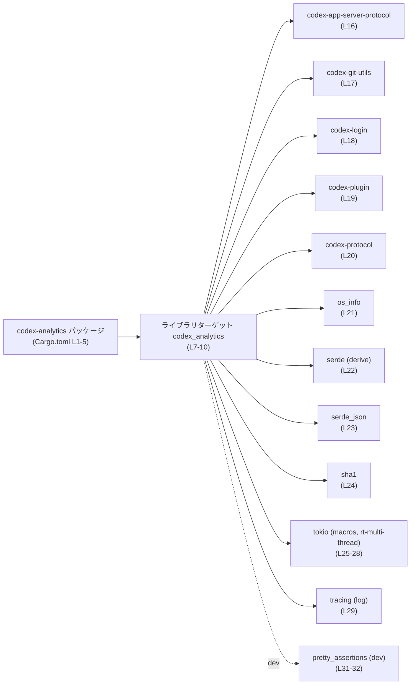
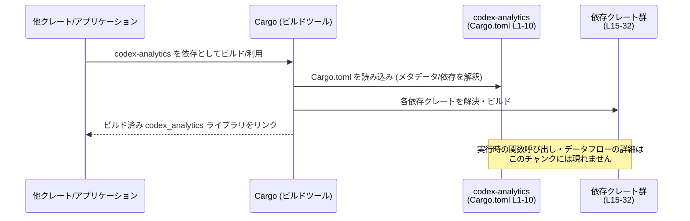

# analytics/Cargo.toml コード解説

## 0. ざっくり一言

`codex-analytics` というライブラリクレートの **Cargo マニフェスト** であり、パッケージ情報、ライブラリターゲット、ワークスペース由来のメタデータ、および依存クレートを定義するファイルです（analytics/Cargo.toml:L1-5, L7-10, L15-32）。

---

## 1. このモジュールの役割

### 1.1 概要

- Rust のビルドツール Cargo が参照する設定ファイルで、`codex-analytics` クレートの **名前・バージョン・ライセンスなど（いずれもワークスペースから継承）** を定義しています（L1-5）。
- ライブラリターゲット `codex_analytics` と、そのエントリポイント `src/lib.rs` を指定しています（L7-10）。
- このクレートがどの外部クレートに依存してビルドされるか（Tokio, tracing, serde など）を列挙しています（L15-29）。

このファイル自体には **関数や構造体などの Rust コードは含まれていません**。公開 API やコアロジックは `src/lib.rs` などのソース側に存在します。

### 1.2 アーキテクチャ内での位置づけ（コンポーネントインベントリー）

このセクションでは、Cargo.toml から分かるコンポーネント（クレート・依存）を一覧化します。

#### コンポーネント一覧

| コンポーネント | 種別 | 説明 | 定義位置 |
|----------------|------|------|----------|
| `codex-analytics` | パッケージ名 | ワークスペース内のパッケージ名。公開クレート名と一致（ハイフン表記）します。 | analytics/Cargo.toml:L1-5 |
| `codex_analytics` | ライブラリターゲット名 | 実際に `use codex_analytics::...` として利用されるライブラリクレート名です。 | analytics/Cargo.toml:L7-10 |
| `src/lib.rs` | ライブラリのエントリポイント | ライブラリクレートのルートモジュール。公開 API やコアロジックはここに定義されます。 | analytics/Cargo.toml:L10 |
| `codex-app-server-protocol` | 依存クレート | アプリサーバーとのプロトコル関連機能を提供するワークスペースクレート（名称からの推測。具体的 API はこのチャンクには現れません）。 | analytics/Cargo.toml:L16 |
| `codex-git-utils` | 依存クレート | Git 関連ユーティリティを提供するワークスペースクレートと考えられます（用途は名称からの推測）。 | analytics/Cargo.toml:L17 |
| `codex-login` | 依存クレート | ログイン/認証周りの機能を提供するワークスペースクレートと考えられます（名称からの推測）。 | analytics/Cargo.toml:L18 |
| `codex-plugin` | 依存クレート | プラグイン仕組みを扱うワークスペースクレートと考えられます（名称からの推測）。 | analytics/Cargo.toml:L19 |
| `codex-protocol` | 依存クレート | 共通プロトコル実装を提供するワークスペースクレートと考えられます（名称からの推測）。 | analytics/Cargo.toml:L20 |
| `os_info` | 依存クレート | OS 情報取得用クレート（一般的な crates.io の `os_info` の機能）。 | analytics/Cargo.toml:L21 |
| `serde` | 依存クレート（`derive` 機能付き） | シリアライズ/デシリアライズ用。`derive` 機能により `#[derive(Serialize, Deserialize)]` が利用可能な状態です。 | analytics/Cargo.toml:L22 |
| `serde_json` | 依存クレート | JSON 形式でのシリアライズ/デシリアライズを行うために利用可能な状態です。 | analytics/Cargo.toml:L23 |
| `sha1` | 依存クレート | SHA-1 ハッシュ計算を行うクレートです。暗号学的には衝突耐性に問題があるハッシュである点に注意が必要です（一般的知識）。 | analytics/Cargo.toml:L24 |
| `tokio`（`macros`, `rt-multi-thread`） | 依存クレート（非同期ランタイム） | Tokio のマルチスレッドランタイムとマクロ（`#[tokio::main]` など）が利用可能な状態です。並行実行の基盤になります。 | analytics/Cargo.toml:L25-28 |
| `tracing`（`log` 機能） | 依存クレート（ロギング/トレース） | 構造化ログやトレースを行うためのクレート。`log` 機能により `log` クレート互換のインターフェースとの連携が可能です。 | analytics/Cargo.toml:L29 |
| `pretty_assertions` | 開発時依存クレート | テストコード向けの `assert_eq!` 出力改善クレート。開発・テスト専用です。 | analytics/Cargo.toml:L31-32 |

> 「用途」について `codex-*` クレートは名称からの推測であり、**具体的な API はこのチャンクには現れません**。

#### 依存関係図（Cargo レベル）

Cargo.toml から読み取れる依存関係（ビルド時のコンポーネント関係）を示します。



この図は **ビルド時の依存関係** を示しており、実行時にどの関数がどのクレートを呼び出すかといった詳細な呼び出し関係は、このファイルからは分かりません。

### 1.3 設計上のポイント（この Cargo 設定から分かること）

- **ワークスペース一元管理**  
  - `edition.workspace = true`、`license.workspace = true`、`version.workspace = true` により、エディション・ライセンス・バージョンはワークスペースルートの設定に委ねられています（L2-5）。  
    → 個々のクレートではなくワークスペース全体で一貫性を保つ設計です。
- **ライブラリクレート専用**  
  - `[lib]` セクションだけが定義されており、`[[bin]]` などバイナリターゲットは定義されていません（L7-10）。  
    → `codex_analytics` は **ライブラリとして利用されることが前提** のクレートです。
- **ドキュメントテスト無効化**  
  - `doctest = false` により、ドキュメントコメント中のコードブロックをテストとして実行しない設定になっています（L8）。  
    → ドキュメント例と実装の乖離をテストでは検出しない方針です。
- **非同期・並行実行の基盤として Tokio を利用可能**  
  - `tokio` に `rt-multi-thread` 機能が有効になっているため、マルチスレッドな非同期ランタイム上での実行が可能な構成になっています（L25-28）。  
    → **並行性（concurrency）** は Tokio ランタイム上で実現される可能性がありますが、具体的なタスク生成・共有状態の扱いなどはこのファイルからは分かりません。
- **構造化ログ/トレースの利用可能性**  
  - `tracing` が `log` 機能付きで依存に含まれており、`log` クレートとの互換性を保ったままトレースを出力できる構成になっています（L29）。  
    → 観測性（ログ/トレース）を重視した設計である可能性があります。
- **テストの視認性向上**  
  - 開発時依存として `pretty_assertions` が追加されており、テスト失敗時の差分出力を見やすくする意図が読み取れます（L31-32）。

---

## 2. 主要な機能一覧（Cargo.toml から推定できる機能レベル）

このファイルには具体的な関数や型の実装はありませんが、依存クレートから「どのような機能を利用できる状態か」を整理します。**実際に利用しているかどうかは、このチャンクには現れません**。

- アプリサーバープロトコル連携（`codex-app-server-protocol`、L16）
- Git リポジトリ関連のユーティリティ（`codex-git-utils`、L17）
- ログイン・認証周辺の機能（`codex-login`、L18）
- プラグインシステムとの統合（`codex-plugin`、L19）
- 共通プロトコル定義・処理（`codex-protocol`、L20）
- OS 情報取得（`os_info`、L21）
- データのシリアライズ/デシリアライズ（`serde` + `serde_json`、L22-23）
- SHA-1 によるハッシュ値計算（`sha1`、L24）
- Tokio によるマルチスレッド非同期実行・`async`/`await`・マクロベースのエントリポイント（`tokio`、L25-28）
- `tracing` による構造化ロギング・トレース、`log` 互換のログ出力（L29）
- テスト時の見やすいアサーション出力（`pretty_assertions`、L31-32）

---

## 3. 公開 API と詳細解説

このファイルは **Cargo マニフェスト** であり、Rust の型や関数定義は含みません。したがって、以下のセクションでは「該当なし」であることを明示します。

### 3.1 型一覧（構造体・列挙体など）

このチャンクには Rust コードが含まれていないため、**公開されている型（構造体・列挙体など）は列挙できません**。  
型の定義は `path = "src/lib.rs"` で指定されているファイルおよびそのモジュール配下に存在します（analytics/Cargo.toml:L10）。

### 3.2 関数詳細（最大 7 件）

このチャンクには **関数定義が 1 つも現れません**。  
したがって、関数詳細テンプレートに従って説明できる対象はありません。

> 公開 API やコアロジックを確認する場合は、`src/lib.rs` および関連モジュールの Rust ソースコードを参照する必要があります（L10）。

### 3.3 その他の関数

同様に、このファイルには補助的な関数やラッパー関数も一切含まれていません。

---

## 4. データフロー（Cargo レベルの依存解決フロー）

実行時の具体的なデータの流れはこのファイルからは分かりませんが、**Cargo による依存解決という観点でのフロー**を示します。



この図は「他のクレートが `codex-analytics` を依存に追加したとき、Cargo がどのようにこの Cargo.toml を利用するか」の流れを表現しています。

---

## 5. 使い方（How to Use）

### 5.1 基本的な使用方法（他クレートからの依存）

別のクレートから `codex-analytics` を利用する場合、一般にはそのクレートの `Cargo.toml` に依存として記述します。  
実際にはワークスペース設定により異なりますが、典型例は次の通りです。

```toml
# 他クレート側の Cargo.toml の例

[dependencies]
codex-analytics = { path = "analytics" }  # ワークスペース内の analytics ディレクトリへのパス例
```

- この設定を行うと、他クレート側の Rust コードでは次のようにライブラリを利用できる状態になります（Rust コード例は参考です）。

```rust
// 他クレート側からの利用例（概念的な例）
// 実際のモジュール・関数名は src/lib.rs 側の実装に依存し、このチャンクには現れません。

use codex_analytics::*; // ライブラリターゲット名は analytics/Cargo.toml:L7-10 より

fn main() {
    // codex_analytics が提供する API を呼び出す
}
```

### 5.2 よくある使用パターン（Tokio/トレース前提の可能性）

Cargo.toml から読み取れる前提として、以下のような使い方が想定されます（あくまで **可能性** であり、このチャンクには具体的実装はありません）。

- **Tokio ランタイム上での非同期処理**  
  - `tokio` の `macros` 機能が有効なため、`#[tokio::main]` や `#[tokio::test]` といったマクロを利用したエントリポイントやテストが書ける状態です（L25-28）。
- **tracing によるロギング/トレース**  
  - `tracing` + `log` 機能により、従来の `log` ベースのコードとの互換性を保ちつつ、よりリッチなトレースが可能な構成になっています（L29）。

### 5.3 よくある間違い（Cargo 設定まわり）

このファイルに関して起こり得る典型的な誤りを挙げます。

```toml
# 誤り例: ワークスペース側に edition が定義されていないのに
# edition.workspace = true のみを設定している
[package]
edition.workspace = true
# ... ルートの Cargo.toml に edition がないとビルドエラーになる
```

```toml
# 正しい例: ルートの Cargo.toml 側に edition を定義した上で
# 各メンバーでは .workspace = true とする
[workspace]
members = ["analytics", "other-crate"]

[workspace.package]
edition = "2021"
license = "MIT"
version = "0.1.0"
```

analytics/Cargo.toml は後者のような構成を前提としていることが、`*.workspace = true` の記述から分かります（L2-5, L12-13）。

### 5.4 使用上の注意点（まとめ）

- **ワークスペース設定への依存**  
  - `edition`, `license`, `version`, `lints` がすべてワークスペース側に委譲されているため（L2-5, L12-13）、ルートの Cargo.toml 側で適切に定義されていないとビルドに失敗します。
- **SHA-1 利用時のセキュリティ注意**  
  - `sha1` クレートは SHA-1 ハッシュを扱いますが、一般に暗号学的用途には推奨されません（衝突攻撃が実用的であるため）。  
    セキュリティクリティカルな用途で利用する場合は、`sha2` などより安全なハッシュに切り替える必要がある可能性があります（analytics/Cargo.toml:L24）。
- **Tokio のマルチスレッドランタイム前提**  
  - `rt-multi-thread` 機能が有効なため、非同期コードを実装する際には **スレッド間共有状態の安全性（`Send`, `Sync` の実装）** を意識する必要がありますが、その実装がどうなっているかは `src/lib.rs` 側を確認する必要があります（L25-28）。
- **ドキュメントテストが走らない**  
  - `doctest = false` により、ドキュメントコメントのコード例はビルド時にテストされません（L8）。  
    ドキュメント中のサンプルコードが実装と乖離しても CI で検出されない点に注意が必要です。

---

## 6. 変更の仕方（How to Modify）

### 6.1 新しい機能を追加する場合（依存クレートを増やす）

新たな機能を実装する際に追加のクレートが必要な場合、この Cargo.toml に対して以下のように変更します。

1. **依存クレートを追加**  
   - `[dependencies]` セクションに新しい依存を追加します（L15-29 参照）。

   ```toml
   [dependencies]
   # 既存
   codex-app-server-protocol = { workspace = true }
   # 追加例
   anyhow = "1"  # エラーハンドリング強化用クレートの例
   ```

2. **必要なら features を指定**  
   - `tokio` のように、必要な機能を features 配列で指定します（L25-28 を参考）。

3. **Rust コード側に実装追加**  
   - 実際のロジックは `src/lib.rs` 以下に実装する必要があります（L10）。  
     Cargo.toml だけ変更しても、機能自体は増えません。

### 6.2 既存の機能を変更する場合（Cargo 設定視点）

- **Tokio のランタイム変更**  
  - シングルスレッドランタイムに切り替えたい場合は、`rt-multi-thread` 機能を外し、代わりに他のランタイム機能を指定する必要があります（L25-28）。
- **シリアライズ方式の変更**  
  - JSON 以外のフォーマット（例: MessagePack）を使いたい場合は、`serde_json` に加えて別クレートを依存に追加する、あるいは `serde_json` を削除するなどの変更が考えられます（L22-23）。
- **ライセンス・バージョンポリシーの変更**  
  - これらはワークスペース側（`*.workspace = true`）に委譲されているため、analytics/Cargo.toml ではなくルートの Cargo.toml を変更することになります（L2-5）。

変更時の注意点:

- **影響範囲**  
  - 依存クレートを削除・バージョン変更した場合、そのクレートを利用している全ての関数・モジュール（`src/lib.rs` 以下）に影響します。
- **Contracts / API 互換性**  
  - 依存クレートのメジャーバージョン変更は、そのクレートの API 互換性を壊す可能性があるため注意が必要です（一般的な注意点）。
- **並行性関連の変更**  
  - Tokio の機能セットを変えると、非同期/並行処理の挙動や利用可能な API が変わる可能性があります。具体的な影響は Rust コード側の実装を確認する必要があります。

---

## 7. 関連ファイル

Cargo.toml から直接わかる、関連性の高いファイル・設定をまとめます。

| パス / 設定 | 役割 / 関係 | 根拠 |
|-------------|-------------|------|
| `analytics/src/lib.rs` | `codex_analytics` ライブラリクレートのルートモジュール。公開 API やコアロジックはここに定義されます。 | `path = "src/lib.rs"`（analytics/Cargo.toml:L10） |
| ワークスペースルートの `Cargo.toml` | `edition`, `license`, `version`, `lints`, 各種 `workspace = true` で委譲されている設定の実体。`[workspace]` などが定義されているはずです。 | `*.workspace = true` の指定（analytics/Cargo.toml:L2-5, L12-13, L16-22, L23-24, L25-29, L31-32） |
| テストコード（`tests/` や `src/` 内の `#[cfg(test)]` モジュールなど） | `pretty_assertions` を利用したテストが書かれている可能性が高い場所です。具体的なファイル名や内容はこのチャンクには現れません。 | `pretty_assertions = { workspace = true }`（analytics/Cargo.toml:L31-32） |

---

### このチャンクで分からないこと

最後に、この Cargo.toml からは **分からない** ことも明示します。

- `codex_analytics` が公開する具体的な関数・構造体・モジュール構成  
  → Rust ソースコード（`src/lib.rs` など）が必要です。
- Tokio/serde/tracing といった依存クレートを **どのように組み合わせているか**  
  → 実装とテストコードを確認する必要があります。
- 実行時のエラー処理ポリシー（`Result` の扱い・`panic!` の方針など）  
  → このチャンクには現れません。

Cargo.toml はあくまで **ビルドと依存関係の定義** を行うファイルであり、公開 API やコアロジックの詳細は別ファイルに存在する、という前提を押さえると理解しやすくなります。
