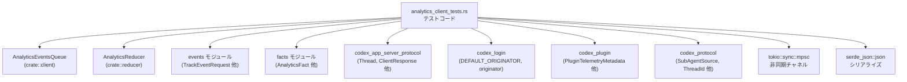
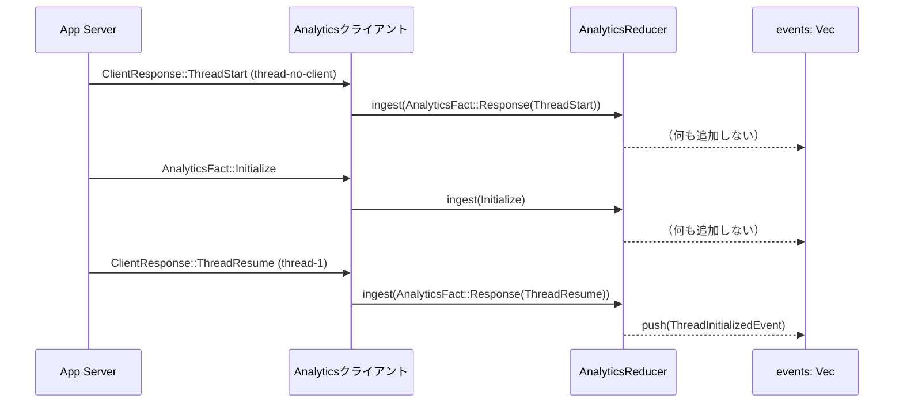
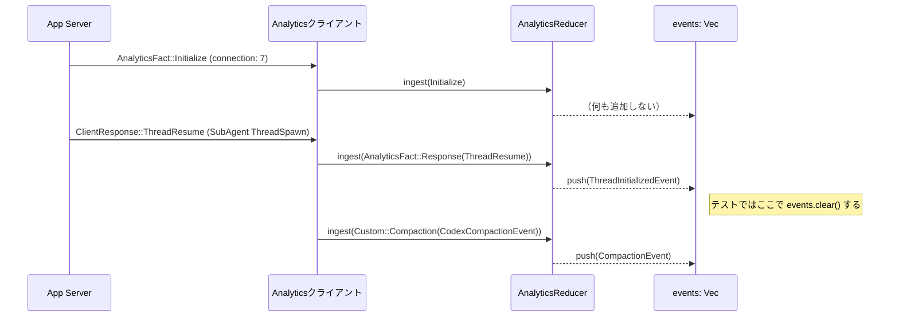

# analytics/src/analytics_client_tests.rs コード解説

> 注記: 提供されたコードには行番号が含まれていないため、  
> 「根拠行番号」はファイル単位のみを示し、具体的な `L開始–終了` は記載できません。  
>（誤った行番号を推測で書くことを避けるためです）

---

## 0. ざっくり一言

このファイルは、`analytics` クレートの **イベント生成まわりの振る舞い** を検証するテスト群です。  
アプリ・プラグイン・スキル・スレッド初期化・コンパクションなどの各種 `AnalyticsFact` が、  
`AnalyticsReducer` / `AnalyticsEventsQueue` を通じてどのようなトラッキングイベント JSON に変換されるかを確認します。

---

## 1. このモジュールの役割

### 1.1 概要

- このモジュールは **分析・テレメトリ用のイベント生成ロジックが仕様どおりか** を検証するために存在します。
- 主に次の点をテストしています。
  - スキル ID 用のパス正規化 (`normalize_path_for_skill_id` / `skill_id_for_local_skill`)
  - アプリ / プラグイン / スキル / スレッド / コンパクション などのイベント JSON 形状
  - `AnalyticsEventsQueue` による「一度だけ送信」用の **重複排除ロジック**
  - `AnalyticsReducer::ingest` による **非同期イベント生成フロー**

### 1.2 アーキテクチャ内での位置づけ

このテストファイルは、`analytics` クレート内部および周辺クレートとの関係を次のように持っています。



- **このファイル自身はライブラリ API を公開していません**。  
  代わりに、`AnalyticsReducer` や `AnalyticsEventsQueue` など **本体モジュールの公開 API を利用してテスト** しています。
- テストから読み取れる振る舞いを通じて、これら外部コンポーネントの契約（Contract）が明らかになります。

### 1.3 設計上のポイント

コードから読み取れる設計上の特徴は次のとおりです。

- **責務の分離**
  - テスト用ヘルパー関数（例: `sample_thread`, `sample_thread_start_response`）でテストデータ生成を共通化。
  - `AnalyticsReducer` と `AnalyticsEventsQueue` の責務を
    - 「事実 (`AnalyticsFact`) → イベント (`TrackEventRequest`) への変換」
    - 「同一ターン内でのイベント重複排除」
    に分けてテストしています。
- **状態管理**
  - `AnalyticsReducer` は内部に **接続ごとのクライアント情報やスレッド情報をキャッシュ** していることがテストから分かります（`Initialize` → `Response` の順序依存）。
  - `AnalyticsEventsQueue` は `Arc<Mutex<HashSet<...>>>` を使って、**アプリ / プラグインごとの「すでに送ったキー」を保持** します。
- **エラーハンドリング**
  - テストコード自身では `expect(...)` や `unwrap_or_else(...)` を多用しており、**前提条件違反時にはパニック** します。
  - これは「ライブラリの使用方法が正しければパニックしない」という前提で、仕様を簡潔に検証するためのスタイルです。
- **非同期・並行性**
  - `AnalyticsReducer::ingest` は `async` 関数として使われており、`#[tokio::test]` を使った非同期テストがいくつかあります。
  - `AnalyticsEventsQueue` は `tokio::sync::mpsc::channel` と `Arc<Mutex<...>>` を使うことで、**複数タスクから共有されることを前提にした設計**であると読み取れます。

---

## 2. 主要な機能一覧

このテストファイルが検証している主な機能を列挙します。

- スキルパス正規化とスキル ID 生成
  - `normalize_path_for_skill_id`: リポジトリスコープ/ユーザスコープ/管理者スコープでのパス表現の違い。
  - `skill_id_for_local_skill`: ローカルスキルの ID 生成（パス正規化とスキル名を組み合わせ）。
- アプリ関連イベント
  - `codex_app_metadata` + `TrackEventRequest::AppMentioned`
  - `codex_app_metadata` + `TrackEventRequest::AppUsed`
- コンパクションイベント
  - `codex_compaction_event_params` + `TrackEventRequest::Compaction`
  - `CustomAnalyticsFact::Compaction` と `AnalyticsReducer::ingest` の組み合わせ。
- スレッド初期化イベント
  - `ThreadInitializedEvent` / `ThreadInitializedEventParams`
  - `AnalyticsReducer::ingest` 経由のスレッドライフサイクルイベント生成。
  - `subagent_thread_started_event_request` によるサブエージェントスレッド開始イベント。
- アプリ / プラグインの使用イベント
  - `AnalyticsEventsQueue::should_enqueue_app_used` による **ターン＋コネクタ単位の重複排除**。
  - `AnalyticsEventsQueue::should_enqueue_plugin_used` による **ターン＋プラグイン単位の重複排除**。
  - `codex_plugin_used_metadata` + `TrackEventRequest::PluginUsed`
  - `codex_plugin_metadata` + `TrackEventRequest::PluginInstalled` / `TrackEventRequest::PluginStateChanged`。
- スキル呼び出しイベント
  - `CustomAnalyticsFact::SkillInvoked` を `AnalyticsReducer::ingest` で処理して `skill_invocation` イベントを生成。
- 汎用的なトラッキングコンテキスト
  - `TrackEventsContext` による `model_slug`/`thread_id`/`turn_id` 共有。

---

## 3. 公開 API と詳細解説

### 3.1 型一覧（構造体・列挙体など）

このファイル内で **定義されている新しい型はありません**。  
ただし、多くの外部型がテスト対象として使われています。主要なものを整理します。

| 名前 | 種別 | 所属 | 役割 / 用途 |
|------|------|------|-------------|
| `AnalyticsReducer` | 構造体 | `crate::reducer` | `AnalyticsFact` を受け取り、1つ以上のトラッキングイベント（おそらく `TrackEventRequest`）を生成する非同期リデューサです。テストでは `ingest` メソッドの挙動を検証しています。 |
| `AnalyticsEventsQueue` | 構造体 | `crate::client` | 内部に `mpsc::Sender` と「送信済みキーの `HashSet`」を持つイベントキューです。`should_enqueue_app_used` / `should_enqueue_plugin_used` による重複排除がテストされています。 |
| `AnalyticsFact` | 列挙体 | `crate::facts` | `Initialize`, `Response`, `Custom(...)` など、アナリティクスに関する事実を表すイベント入力です。`AnalyticsReducer::ingest` の入力として使われます。 |
| `CustomAnalyticsFact` | 列挙体 | `crate::facts` | `Compaction`, `SubAgentThreadStarted`, `SkillInvoked`, `AppMentioned`, `AppUsed`, `PluginUsed`, `PluginStateChanged` など、アプリ固有の分析イベント入力です。 |
| `TrackEventsContext` | 構造体 | `crate::facts` | `model_slug`, `thread_id`, `turn_id` をまとめた共通コンテキストです。アプリ／プラグイン／スキルイベントで利用されます。 |
| `AppInvocation` | 構造体 | `crate::facts` | `connector_id`, `app_name`, `invocation_type` を持つアプリ呼び出し情報です。`AppMentioned`, `AppUsed` などで使用されます。 |
| `PluginTelemetryMetadata` | 構造体 | `codex_plugin` | プラグイン ID や表示名、コネクタ ID 群、スキル有無などのテレメトリ用メタデータです。 |
| `SubAgentThreadStartedInput` | 構造体 | `crate::facts` | サブエージェントスレッド開始時の入力情報（thread_id, parent_thread_id, model, subagent_source など）です。 |
| `SubAgentSource` | 列挙体 | `codex_protocol::protocol` | サブエージェントの起動元（`Review`, `ThreadSpawn`, `MemoryConsolidation`, `Other(String)` など）を表現します。 |
| `CodexCompactionEvent` | 構造体 | `crate::facts` | コンパクション処理のトラッキング用情報（トークン数、フェーズ、ステータスなど）です。 |
| `ThreadInitializedEvent` / `ThreadInitializedEventParams` | 構造体 | `crate::events` | `codex_thread_initialized` イベントのペイロードを表す型です。 |

> これらの型の正確なフィールド構造は、このファイルでは定義されていません。  
> テストでアクセスされたフィールド・JSON出力から分かる範囲のみを記述しています。

### 3.2 関数詳細（代表的な API / 振る舞い）

このセクションでは、本ファイルから分かる範囲で **外部 API の振る舞い** を整理します。  
実装は他ファイルにありますが、テストの期待値から仕様を読み解きます。

---

#### `normalize_path_for_skill_id(repo_url: Option<&str>, repo_root: Option<&Path>, skill_path: &Path) -> String`  

（定義は `crate::reducer`。本ファイルの冒頭近くで使用）

**概要**

- ローカルスキルファイルのパスから、スキル ID 用の安定した文字列表現を生成するヘルパー関数です。
- リポジトリスコープ（Git リポジトリ内の `.codex/skills/...`）とユーザ／管理者スコープで **戻り値の形式が異なる** ことがテストされています。

**引数**

| 引数名 | 型 | 説明（テストから分かる範囲） |
|--------|----|------------------------------|
| `repo_url` | `Option<&str>` | Git リポジトリ URL。`Some` のときは「リポジトリスコープのスキル」と見なされます（テスト名より）。 |
| `repo_root` | `Option<&Path>` | リポジトリのルートパス。`skill_path` がこの直下であれば相対パスに変換されます。 |
| `skill_path` | `&Path` | 実際のスキルファイルのパス（例: `/repo/root/.codex/skills/doc/SKILL.md`）。 |

**戻り値**

- スキル ID 用のパス文字列と考えられます（`String` と `String` の比較が行われているため）。
- 形式はテストから次のように分かります。
  - **リポジトリスコープ**: `repo_root` 配下なら **リポジトリルートからの相対パス** （例: `.codex/skills/doc/SKILL.md`）。
  - それ以外: **絶対パス（canonicalize 済み＋スラッシュ正規化）**。

**内部処理の流れ（テストから推測できる範囲）**

1. `repo_url` が `Some(..)` かつ `repo_root` が `Some(root)` の場合:
   - `skill_path` が `root` の配下なら `root` からの相対パスを計算。
   - 例:  
     - `repo_root = "/repo/root"`  
     - `skill_path = "/repo/root/.codex/skills/doc/SKILL.md"`  
     → 戻り値: `.codex/skills/doc/SKILL.md`（`normalize_path_for_skill_id_repo_scoped_uses_relative_path` テストより）。
2. 上記条件を満たさない場合:
   - `skill_path` を `std::fs::canonicalize` して絶対パス化し、失敗した場合は元のパスを使う。
   - そのうえで `to_string_lossy()` → `replace('\\', "/")` により **プラットフォームに依存しないスラッシュ形式**の文字列にする。  
     （これはテスト側の `expected_absolute_path` ヘルパーから読み取れる期待値です）

**Examples（使用例）**

テストの利用例を簡略化して示します。

```rust
use std::path::PathBuf;
use crate::reducer::normalize_path_for_skill_id;

// リポジトリスコープ: 相対パス化される例
let repo_root = PathBuf::from("/repo/root");
let skill_path = PathBuf::from("/repo/root/.codex/skills/doc/SKILL.md");

let id = normalize_path_for_skill_id(
    Some("https://example.com/repo.git"),  // リポジトリ URL
    Some(repo_root.as_path()),             // リポジトリルート
    skill_path.as_path(),                  // スキルファイルパス
);

assert_eq!(id, ".codex/skills/doc/SKILL.md");

// ユーザスコープ: 絶対パス（canonicalize）になる例
let skill_path = PathBuf::from("/Users/abc/.codex/skills/doc/SKILL.md");
let id = normalize_path_for_skill_id(None, None, skill_path.as_path());
// 期待値は canonicalize + "/" 正規化後の絶対パス
```

**Errors / Panics**

- テストからは、この関数自身が `Result` を返しているかどうかは分かりません。
- テスト側では `expected_absolute_path` が `canonicalize(...).unwrap_or_else(...)` を使っているため、  
  **`normalize_path_for_skill_id` 側でパニックしない前提**でテストが組まれています。

**Edge cases（エッジケース）**

テストでカバーされているケース:

- `repo_url`/`repo_root` がともに `None` でユーザスコープ / 管理者スコープのパス  
  → 絶対パスを返す。
- `repo_root` が指定されているが、`skill_path` がその配下でない  
  → 絶対パスを返す。
- パスの canonicalize に失敗する場合  
  → テスト側の期待値は「元のパスを使う」なので、同様の挙動が想定されます。

カバーされていない（不明な）ケース:

- `repo_url` は `Some` だが `repo_root` が `None` の場合。
- Windows などでドライブレターを含むパスの扱い（`replace('\\', "/")` で一応統一されるはずですが、詳細は不明）。

**使用上の注意点**

- **リポジトリスコープで相対パスを使いたい場合**は、`repo_url` と `repo_root` の両方を必ず指定する必要があります。
- テストからは、`skill_path` が `repo_root` 直下にない場合は絶対パスにフォールバックすることが読み取れます。
- スキル ID を永続化する場合、**同じルールで常に ID を生成すること**が前提になります（そうしないと ID がぶれてしまいます）。

---

#### `AnalyticsEventsQueue::should_enqueue_app_used(&self, ctx: &TrackEventsContext, app: &AppInvocation) -> bool`

**概要**

- 「このターン・このコネクタに対する `AppUsed` イベントを送るべきか？」を判定し、  
  **重複するイベント送信を抑止するための関数**です。
- テスト `app_used_dedupe_is_keyed_by_turn_and_connector` では、「ターン＋コネクタ」で一意に決まることが示唆されています。

**引数**

| 引数名 | 型 | 説明 |
|--------|----|------|
| `ctx` | `&TrackEventsContext` | 現在のターンのコンテキスト（`thread_id`, `turn_id`, `model_slug`）。重複判定で少なくとも `turn_id` が使われます。 |
| `app` | `&AppInvocation` | `connector_id`, `app_name`, `invocation_type` を含むアプリ呼び出し情報。重複判定では `connector_id` がキーに含まれているとテスト名から読み取れます。 |

**戻り値**

- `true`: この呼び出しに対応する `AppUsed` イベントを新たにキューに入れるべき。
- `false`: 同一キー（ターン＋コネクタ）に対してすでにイベントが送信済み（またはキュー済み）なので、送るべきでない。

**内部処理の流れ（テストから推測できる範囲）**

1. 内部に `Arc<Mutex<HashSet<...>>>` な `app_used_emitted_keys` を持っていることがテストから分かります。
2. `ctx.turn_id` と `app.connector_id` を組み合わせたキーを生成していると考えられます。  
   （テスト名: *app_used_dedupe_is_keyed_by_turn_and_connector* が根拠）
3. そのキーが `HashSet` に存在しなければ `true` を返し、セットに追加。
4. すでに存在する場合は `false` を返す。

**Examples（使用例）**

テストコードから簡略化した例です。

```rust
use std::collections::HashSet;
use std::sync::{Arc, Mutex};
use tokio::sync::mpsc;
use crate::client::AnalyticsEventsQueue;
use crate::facts::{TrackEventsContext, AppInvocation, InvocationType};

let (sender, _receiver) = mpsc::channel(100);               // 非同期送信用チャネルを作成
let queue = AnalyticsEventsQueue {                          // キュー構造体を生成
    sender,                                                 // イベント送信に使う Sender
    app_used_emitted_keys: Arc::new(Mutex::new(HashSet::new())), // すでに送信したアプリ使用キー
    plugin_used_emitted_keys: Arc::new(Mutex::new(HashSet::new())), // プラグイン用キー
};

let app = AppInvocation {
    connector_id: Some("calendar".to_string()),             // コネクタ ID
    app_name: Some("Calendar".to_string()),                 // アプリ名
    invocation_type: Some(InvocationType::Implicit),        // 暗黙的な利用
};

let turn_1 = TrackEventsContext {
    model_slug: "gpt-5".to_string(),
    thread_id: "thread-1".to_string(),
    turn_id: "turn-1".to_string(),
};

assert!(queue.should_enqueue_app_used(&turn_1, &app));      // 初回: true
assert!(!queue.should_enqueue_app_used(&turn_1, &app));     // 同一ターン＋コネクタ: false

let turn_2 = TrackEventsContext { turn_id: "turn-2".into(), ..turn_1 };
assert!(queue.should_enqueue_app_used(&turn_2, &app));      // 別ターン: 再び true
```

**Errors / Panics**

- テストでは `Mutex::new(HashSet::new())` を単一スレッドで使っており、ロックエラーやパニックは発生していません。
- 実装で `lock().unwrap()` のような書き方をしている場合、**ポイズンロック** が起こるとパニックする可能性がありますが、このファイルからは確認できません。

**Edge cases（エッジケース）**

- `app.connector_id` が `None` の場合にどう扱われるかは、このファイルではテストされていません。
- `thread_id` が異なり `turn_id` が同じ場合にキーがどうなるかも不明です（テストは同じ thread_id のみ使用）。

**使用上の注意点**

- 「同一ターン＋同一コネクタで一度だけイベントを送る」という前提で使う必要があります。
- 並行環境で使う場合、`Arc<Mutex<...>>` によるロックがボトルネックになりうるため、高頻度で呼ぶ箇所では注意が必要です。

---

#### `AnalyticsEventsQueue::should_enqueue_plugin_used(&self, ctx: &TrackEventsContext, plugin: &PluginTelemetryMetadata) -> bool`

**概要**

- `should_enqueue_app_used` のプラグイン版で、特定ターンでの特定プラグインの `PluginUsed` イベントの重複を防ぎます。

**引数 / 戻り値**

- 引数・戻り値の意味は `should_enqueue_app_used` と同様で、判定キーに **プラグイン ID** を使う点のみが異なると考えられます。
  - テスト名: `plugin_used_dedupe_is_keyed_by_turn_and_plugin` より。

**Examples**

```rust
let (sender, _receiver) = mpsc::channel(1);
let queue = AnalyticsEventsQueue { /* 省略: HashSet 初期化 */ };
let plugin = sample_plugin_metadata();                      // このファイル末尾のヘルパーで作成

let turn_1 = TrackEventsContext { /* turn-1 ... */ };
let turn_2 = TrackEventsContext { /* turn-2 ... */ };

assert!(queue.should_enqueue_plugin_used(&turn_1, &plugin)); // 初回: true
assert!(!queue.should_enqueue_plugin_used(&turn_1, &plugin)); // 同一ターン＋プラグイン: false
assert!(queue.should_enqueue_plugin_used(&turn_2, &plugin));  // 別ターン: true
```

**その他**

- エラー・エッジケース・注意点は `should_enqueue_app_used` とほぼ同様です。

---

#### `AnalyticsReducer::ingest(&mut self, fact: AnalyticsFact, events: &mut Vec<TrackEventRequest>) -> impl Future<Output = ()>`

> 正確なシグネチャは他ファイルにありますが、テストから **async 関数であること** と、  
> `events` ベクタにトラッキングイベントを追加することが読み取れます。

**概要**

- 様々な `AnalyticsFact`（アプリ使用、コンパクション、スレッド開始、サブエージェント開始など）を受け取り、  
  内部状態（クライアント情報・スレッド情報）を更新しつつ、必要なトラッキングイベントを `events` ベクタに追加します。
- テストでは主に以下の挙動が検証されています。
  - `Initialize` → `Response(ThreadStart/ThreadResume)` → `ThreadInitializedEvent`
  - `Custom::Compaction` → `codex_compaction_event` の生成
  - `Custom::SubAgentThreadStarted` → `codex_thread_initialized` の生成（Initialize 不要）
  - `Custom::SkillInvoked` → `skill_invocation` イベント
  - `Custom::AppMentioned` / `AppUsed` / `PluginUsed` → 各イベント
  - `Custom::PluginStateChanged` → `codex_plugin_disabled` など

**引数**

| 引数名 | 型 | 説明 |
|--------|----|------|
| `fact` | `AnalyticsFact` | 入力となる分析用事実。`Initialize`, `Response`, `Custom(...)` が含まれる列挙体です。 |
| `events` | `&mut Vec<TrackEventRequest>` 相当 | 生成されたトラッキングイベントが追加されるバッファ。テストでは JSON 変換して検証されています。 |

**内部処理の流れ（テストから読み取れるパターン）**

1. **Initialize → Thread lifecycle**
   - `AnalyticsFact::Response`（`ClientResponse::ThreadStart`）だけを ingest しても、`events` は空のまま。  
     → スレッドイベントには `Initialize` の情報が必要。
   - 続けて `AnalyticsFact::Initialize` を ingest しても、まだイベントは出ない。
   - その後 `AnalyticsFact::Response`（`ClientResponse::ThreadResume`）を ingest すると、  
     `codex_thread_initialized` イベントが1件生成される。
     - `app_server_client` 部分には `Initialize` の `client_info` と `rpc_transport`、`capabilities.experimental_api` が反映される。
     - `runtime` 部分には `Initialize` の `CodexRuntimeMetadata` が反映される。
     - `initialization_mode` は `ThreadInitializationMode::New` or `Resumed` に応じて `"new"` / `"resumed"` となる（テストでは `resumed` を確認）。
     - `thread_source`, `subagent_source`, `parent_thread_id` もスレッド情報に基づいて設定される。

2. **Initialize + サブエージェント ThreadResume + Compaction**
   - `Initialize` → `Response(ThreadResume with SubAgentSource::ThreadSpawn)` を ingest すると、  
     サブエージェントスレッドのメタデータが内部に保存されます（テストではその後 `events.clear()`）。
   - 続いて `CustomAnalyticsFact::Compaction(Box<CodexCompactionEvent>)` を ingest すると、  
     `codex_compaction_event` が1件生成され、以下の情報が含まれます。
     - `thread_id`, `turn_id`（CompactionEvent から）
     - `app_server_client`, `runtime`（Initialize から）
     - `thread_source = "subagent"`, `subagent_source = "thread_spawn"`, `parent_thread_id`（サブエージェントスレッド由来）
     - compaction 固有フィールド: `trigger`, `reason`, `implementation`, `phase`, `strategy`, `status`, `error`, トークン数など。

3. **SubAgentThreadStarted（Initialize 不要）**
   - `AnalyticsFact::Custom(CustomAnalyticsFact::SubAgentThreadStarted(...))` を ingest すると、  
     それ単体で `codex_thread_initialized` イベントが生成される。
   - `app_server_client` は `SubAgentThreadStartedInput` の `product_client_id`, `client_name`, `client_version` 等から構成され、  
     `rpc_transport` は `"in_process"` という固定値がセットされる（テストから読み取れる）。
   - `thread_source` は `"subagent"`、`subagent_source` は `SubAgentSource` の variant に応じた文字列になります。

4. **SkillInvoked**
   - `CustomAnalyticsFact::SkillInvoked(SkillInvokedInput { tracking, invocations })` を ingest すると、  
     `invocations` 内の各 `SkillInvocation` について `skill_invocation` イベントが生成されます。
   - ペイロードには以下が含まれます。
     - トップレベル: `event_type = "skill_invocation"`, `skill_id`, `skill_name`
     - `event_params`: `product_client_id`, `skill_scope`, `repo_url`, `thread_id`, `invoke_type`, `model_slug`

5. **AppMentioned / AppUsed / PluginUsed / PluginStateChanged**
   - 各 `CustomAnalyticsFact` から対応する `TrackEventRequest::AppMentioned` / `AppUsed` / `PluginUsed` / `PluginInstalled` / `PluginStateChanged` などが生成され、  
     テストどおりの JSON 形状になることが確認されています。

**Examples（使用例）**

テスト `initialize_caches_client_and_thread_lifecycle_publishes_once_initialized` をもとにした典型的な利用例です。

```rust
use crate::reducer::AnalyticsReducer;
use crate::facts::{AnalyticsFact};
use crate::events::AppServerRpcTransport;
use codex_app_server_protocol::{ClientInfo, InitializeParams, InitializeCapabilities};
use serde_json::to_value;

#[tokio::main]
async fn example() {
    let mut reducer = AnalyticsReducer::default();          // リデューサを初期化
    let mut events = Vec::new();                            // イベント出力バッファ

    // 1. スレッド開始レスポンスだけではイベントは出ない
    reducer.ingest(
        AnalyticsFact::Response {                           // App Server からのレスポンス
            connection_id: 7,
            response: Box::new(sample_thread_start_response(
                "thread-no-client",
                false,
                "gpt-5",
            )),
        },
        &mut events,
    ).await;
    assert!(events.is_empty());

    // 2. Initialize でクライアント情報・ランタイム情報をキャッシュ
    reducer.ingest(
        AnalyticsFact::Initialize {
            connection_id: 7,
            params: InitializeParams {
                client_info: ClientInfo {
                    name: "codex-tui".into(),
                    title: None,
                    version: "1.0.0".into(),
                },
                capabilities: Some(InitializeCapabilities {
                    experimental_api: false,
                    opt_out_notification_methods: None,
                }),
            },
            product_client_id: DEFAULT_ORIGINATOR.to_string(),
            runtime: sample_runtime_metadata(),
            rpc_transport: AppServerRpcTransport::Websocket,
        },
        &mut events,
    ).await;
    assert!(events.is_empty());

    // 3. ThreadResume を受けて初めて ThreadInitialized イベントが出る
    reducer.ingest(
        AnalyticsFact::Response {
            connection_id: 7,
            response: Box::new(sample_thread_resume_response(
                "thread-1",
                true,
                "gpt-5",
            )),
        },
        &mut events,
    ).await;

    let payload = to_value(&events).unwrap();
    // payload[0]["event_type"] == "codex_thread_initialized" 等を検証
}
```

**Errors / Panics**

- テストコードでは `ingest(...).await` の結果を `Result` として扱っていないため、  
  `ingest` は `Result` ではなく `()` を返している、あるいは `Result` を `unwrap` 済みで使っている可能性があります。
- 実際のエラー条件（無効な `AnalyticsFact` など）や panic の有無は、このファイルからは判断できません。

**Edge cases（エッジケース）**

- `Response` が `Initialize` より先に来た場合
  - スレッド初期化イベントは発生せず、内部的に一時保存されるか破棄されるか、このファイルからは不明です。
  - テストでは「イベントは出ない」ことのみ確認しています。
- `CustomAnalyticsFact::SubAgentThreadStarted` の場合
  - `Initialize` がなくてもイベントが生成されることが明示されています。
- `SkillInvoked` の `invocations` が空の場合の挙動は不明です（イベント 0 件になるのが自然ですが、テストはありません）。

**使用上の注意点**

- `AnalyticsReducer` を使うコードでは、**Initialize などの前提となる Fact を適切な順序で渡すこと**が重要です。
- `events` ベクタは呼び出し側で用意し、`ingest` 呼び出しごとに蓄積されるので、必要に応じて `events.clear()` する必要があります（テストの `compaction_event_ingests_custom_fact` など）。

---

#### `subagent_thread_started_event_request(input: SubAgentThreadStartedInput) -> ThreadInitializedEvent`

**概要**

- サブエージェントスレッド開始の入力 (`SubAgentThreadStartedInput`) から、  
  `codex_thread_initialized` イベント用の `ThreadInitializedEvent` を組み立てるヘルパー関数です。
- サブエージェント専用の `thread_source`, `subagent_source`, `parent_thread_id` などを設定します。

**引数**

| 引数名 | 型 | 説明 |
|--------|----|------|
| `input` | `SubAgentThreadStartedInput` | thread_id, parent_thread_id, product_client_id, client_name, client_version, model, ephemeral, subagent_source, created_at などを含みます。 |

**戻り値**

- `ThreadInitializedEvent`（`TrackEventRequest::ThreadInitialized` の内部で使われる型）。

**内部処理の流れ（テストから分かること）**

1. 共通フィールドの設定:
   - `event_type` は `"codex_thread_initialized"` 固定。
   - `event_params.thread_id` = `input.thread_id`
   - `event_params.model` = `input.model`
   - `event_params.ephemeral` = `input.ephemeral`
   - `event_params.created_at` = `input.created_at`
   - `event_params.initialization_mode` = `"new"`（サブエージェントは常に新規スレッドとして扱われるようです）
   - `event_params.thread_source` = `"subagent"`
2. `app_server_client`:
   - `product_client_id` = `input.product_client_id`
   - `client_name` = `input.client_name`
   - `client_version` = `input.client_version`
   - `rpc_transport` = `"in_process"`（テスト `subagent_thread_started_review_serializes_expected_shape` より）
   - `experimental_api_enabled` はテストからは不明（含まれていません）。
3. `subagent_source` のマッピング:
   - `SubAgentSource::Review` → `"review"`
   - `SubAgentSource::ThreadSpawn { .. }` → `"thread_spawn"`
   - `SubAgentSource::MemoryConsolidation` → `"memory_consolidation"`
   - `SubAgentSource::Other(s)` → `s`（例: `"guardian"`）
4. `parent_thread_id` の設定:
   - `SubAgentSource::ThreadSpawn { parent_thread_id, .. }` の場合 → その UUID 文字列。
   - それ以外は `input.parent_thread_id` の値（`Some(String)` or `None`）。
   - 上記の組み合わせによる優先順位はコードからは不明ですが、テストからは
     - ThreadSpawn では `ThreadId` が優先。
     - Other + `Some("parent-thread-guardian")` ではその文字列が使われる。
     ことが確認できます。

**Examples**

```rust
use crate::events::subagent_thread_started_event_request;
use crate::facts::SubAgentThreadStartedInput;
use codex_protocol::protocol::SubAgentSource;

let event = subagent_thread_started_event_request(SubAgentThreadStartedInput {
    thread_id: "thread-review".to_string(),
    parent_thread_id: None,
    product_client_id: "codex-tui".to_string(),
    client_name: "codex-tui".to_string(),
    client_version: "1.0.0".to_string(),
    model: "gpt-5".to_string(),
    ephemeral: false,
    subagent_source: SubAgentSource::Review,
    created_at: 123,
});

// シリアライズ後の JSON では
// thread_source == "subagent"
// subagent_source == "review"
// parent_thread_id == null
// rpc_transport == "in_process"
```

**Errors / Panics**

- この関数がエラーを返すケースはテストからは読み取れません。
- `SubAgentThreadStartedInput` のフィールドが `None` である場合のチェックなどもテストされていないため、不明です。

**Edge cases**

- `SubAgentSource::Other` で空文字列を渡した場合の扱いは不明です。
- `SubAgentSource::ThreadSpawn` と同時に `parent_thread_id: Some(String)` を与えるケースはテストにありません（優先順位は不明）。

**使用上の注意点**

- サブエージェント由来のスレッド初期化イベントを生成するときにのみ使われる前提です。
- `product_client_id` などは **呼び出し元で正しい値をセットする必要** があり、`AnalyticsReducer` のように別の Initialize から補完はされません。

---

#### `skill_id_for_local_skill(repo_url: Option<&str>, repo_root: Option<&Path>, skill_path: &Path, skill_name: &str) -> String`

**概要**

- ローカルスキルの **一意なスキル ID** を生成する関数です。
- テスト `reducer_ingests_skill_invoked_fact` では、この関数の戻り値が `skill_invocation` イベントの `skill_id` として使われることが確認されています。

**引数・戻り値**

- 引数の前3つは `normalize_path_for_skill_id` と同様で、最後に `skill_name` が追加されていると考えられます。
- 戻り値はスキル ID 用の文字列です。

**内部処理（推測の範囲）**

- `normalize_path_for_skill_id` を使ってスキルパスを正規化し、`skill_name` と組み合わせて ID を生成している可能性が高いですが、  
  実際のフォーマット（区切り文字等）はこのファイルからは分かりません。

**使用上の注意点**

- 一度決めた ID フォーマットは変更しづらいため、この関数を介して ID を生成するのが前提になっていると考えられます。

---

### 3.3 このファイル内の関数一覧（テスト・ヘルパー）

このファイルで **定義されている関数** をまとめます（行番号は省略）。

| 関数名 | 種別 | 役割（1 行） |
|--------|------|--------------|
| `sample_thread` | ヘルパー | `codex_app_server_protocol::Thread` のダミー値を生成します。 |
| `sample_thread_with_source` | ヘルパー | `Thread` の `source` を指定可能にしたバージョンです。 |
| `sample_thread_start_response` | ヘルパー | `ClientResponse::ThreadStart` を組み立てます。 |
| `sample_app_server_client_metadata` | ヘルパー | `CodexAppServerClientMetadata` のサンプル値を生成します。 |
| `sample_runtime_metadata` | ヘルパー | `CodexRuntimeMetadata` のサンプル値を生成します。 |
| `sample_thread_resume_response` | ヘルパー | `ClientResponse::ThreadResume` を組み立てます。 |
| `sample_thread_resume_response_with_source` | ヘルパー | `source` を指定可能な ThreadResume レスポンスを生成します。 |
| `expected_absolute_path` | ヘルパー | canonicalize + `/` 正規化した絶対パス文字列を生成します。 |
| `normalize_path_for_skill_id_*` 系テスト | テスト | リポジトリ／ユーザ／管理者スコープでのパス正規化挙動を検証します。 |
| `app_mentioned_event_serializes_expected_shape` | テスト | `AppMentioned` イベント JSON の形状を検証します。 |
| `app_used_event_serializes_expected_shape` | テスト | `AppUsed` イベント JSON の形状を検証します。 |
| `compaction_event_serializes_expected_shape` | テスト | `codex_compaction_event` JSON の形状を検証します。 |
| `app_used_dedupe_is_keyed_by_turn_and_connector` | テスト | `should_enqueue_app_used` の重複排除キーを検証します。 |
| `thread_initialized_event_serializes_expected_shape` | テスト | `ThreadInitializedEvent` の JSON 形状を検証します。 |
| `initialize_caches_client_and_thread_lifecycle_publishes_once_initialized` | 非同期テスト | Initialize → Response → イベント生成のフローを検証します。 |
| `compaction_event_ingests_custom_fact` | 非同期テスト | `Custom::Compaction` を ingest したときのイベント生成を検証します。 |
| `subagent_thread_started_*` 系テスト | テスト | サブエージェント起動イベントの JSON 形状と parent_thread_id の扱いを検証します。 |
| `subagent_thread_started_publishes_without_initialize` | 非同期テスト | SubAgentThreadStarted が単独でイベントを生成することを検証します。 |
| `plugin_used_event_serializes_expected_shape` | テスト | `PluginUsed` イベント JSON の形状を検証します。 |
| `plugin_management_event_serializes_expected_shape` | テスト | プラグインインストールイベント JSON を検証します。 |
| `plugin_used_dedupe_is_keyed_by_turn_and_plugin` | テスト | `should_enqueue_plugin_used` の重複排除キーを検証します。 |
| `reducer_ingests_skill_invoked_fact` | 非同期テスト | `SkillInvoked` から `skill_invocation` イベントが生成されることを検証します。 |
| `reducer_ingests_app_and_plugin_facts` | 非同期テスト | AppMentioned / AppUsed / PluginUsed の ingest を検証します。 |
| `reducer_ingests_plugin_state_changed_fact` | 非同期テスト | `PluginStateChanged` から `codex_plugin_disabled` が生成されることを検証します。 |
| `sample_plugin_metadata` | ヘルパー | テスト用の `PluginTelemetryMetadata` を生成します。 |

---

## 4. データフロー

### 4.1 スレッドライフサイクルのイベント生成フロー

テスト `initialize_caches_client_and_thread_lifecycle_publishes_once_initialized` から読み取れる、  
**スレッド初期化イベント生成のデータフロー**をシーケンス図で示します。



この図から分かるポイント:

- `ThreadStart` だけでは `ThreadInitializedEvent` は出ません。  
  **Initialize との組み合わせが必須**です。
- `Initialize` があることで、後続の `ThreadResume` に対して
  - クライアントメタデータ（`product_client_id`, `client_name`, `client_version`, `rpc_transport`, `experimental_api_enabled`）
  - ランタイムメタデータ（`codex_rs_version` 等）
  を付与した `codex_thread_initialized` イベントを 1 回だけ生成します。

### 4.2 コンパクションイベントの生成フロー（サブエージェント）

テスト `compaction_event_ingests_custom_fact` から読み取れる流れです。



ポイント:

- サブエージェントスレッドの情報（`thread_source = "subagent"`, `subagent_source = "thread_spawn"`, `parent_thread_id`）は  
  **ThreadResume ingest 時にキャッシュされ、後続の Compaction イベント生成時に利用**されます。
- Compaction イベントには、Initialize 由来の `app_server_client` / `runtime` 情報も含まれます。

---

## 5. 使い方（How to Use）

このファイル自体はテストモジュールですが、ここで使われているパターンは実際のコードでもほぼ同じです。

### 5.1 基本的な使用方法（AnalyticsReducer）

```rust
use crate::reducer::AnalyticsReducer;
use crate::facts::{AnalyticsFact, CustomAnalyticsFact, AppMentionedInput, AppInvocation, TrackEventsContext};
use crate::events::AppServerRpcTransport;
use codex_app_server_protocol::{ClientInfo, InitializeParams, InitializeCapabilities};
use serde_json::to_value;

#[tokio::main]
async fn main() -> anyhow::Result<()> {
    // 1. リデューサとイベントバッファを用意
    let mut reducer = AnalyticsReducer::default();          // 内部状態を持つリデューサ
    let mut events = Vec::new();                            // 出力イベントの格納先

    // 2. 初期化情報（Initialize Fact）を渡す
    reducer.ingest(
        AnalyticsFact::Initialize {
            connection_id: 1,
            params: InitializeParams {
                client_info: ClientInfo {
                    name: "codex-tui".into(),
                    title: None,
                    version: "1.0.0".into(),
                },
                capabilities: Some(InitializeCapabilities {
                    experimental_api: true,
                    opt_out_notification_methods: None,
                }),
            },
            product_client_id: "codex-tui".into(),
            runtime: sample_runtime_metadata(),              // このファイルのヘルパーを流用可能
            rpc_transport: AppServerRpcTransport::Websocket,
        },
        &mut events,
    ).await;

    // 3. アプリに関するカスタム Fact を渡す
    let tracking = TrackEventsContext {
        model_slug: "gpt-5".into(),
        thread_id: "thread-1".into(),
        turn_id: "turn-1".into(),
    };
    reducer.ingest(
        AnalyticsFact::Custom(CustomAnalyticsFact::AppMentioned(
            AppMentionedInput {
                tracking,
                mentions: vec![AppInvocation {
                    connector_id: Some("calendar".into()),
                    app_name: Some("Calendar".into()),
                    invocation_type: Some(crate::facts::InvocationType::Explicit),
                }],
            }
        )),
        &mut events,
    ).await;

    // 4. events に追加された TrackEventRequest を JSON として送信するなど
    let json = to_value(&events)?;                           // serde_json でシリアライズ
    println!("{}", json);
    Ok(())
}
```

### 5.2 AnalyticsEventsQueue による重複排除の使用パターン

```rust
use crate::client::AnalyticsEventsQueue;
use crate::facts::{TrackEventsContext, AppInvocation, InvocationType};
use tokio::sync::mpsc;
use std::collections::HashSet;
use std::sync::{Arc, Mutex};

async fn send_app_used(queue: &AnalyticsEventsQueue, ctx: &TrackEventsContext, app: &AppInvocation) {
    if queue.should_enqueue_app_used(ctx, app) {            // まだ送っていなければ
        // 実際の送信ロジック（例: queue.sender.send(...)）
        // ここではテストコードには出てこないため、省略
    }
}

fn setup_queue() -> AnalyticsEventsQueue {
    let (sender, _receiver) = mpsc::channel(100);
    AnalyticsEventsQueue {
        sender,
        app_used_emitted_keys: Arc::new(Mutex::new(HashSet::new())),
        plugin_used_emitted_keys: Arc::new(Mutex::new(HashSet::new())),
    }
}
```

### 5.3 よくある間違い（テストから推測できるもの）

```rust
// NG例: Initialize を入れずに ThreadResume を ingest しても
// ThreadInitializedEvent にクライアント情報が含まれない、またはイベント自体が出ない可能性がある
reducer.ingest(
    AnalyticsFact::Response { /* ThreadResume */ },
    &mut events,
).await;

// OK例: Initialize → Response の順で ingest することで、期待どおりの ThreadInitialized イベントを得る
reducer.ingest(AnalyticsFact::Initialize { /* ... */ }, &mut events).await;
reducer.ingest(AnalyticsFact::Response { /* ThreadResume */ }, &mut events).await;
```

### 5.4 使用上の注意点（まとめ）

- `AnalyticsReducer` は **内部状態を持つ** ため、同じ接続（`connection_id`）に対する Fact は同じインスタンスに渡す必要があります。
- イベント出力ベクタ `events` は呼び出し元側で管理されるため、用途に応じて `clear` や送信処理を行う必要があります。
- `AnalyticsEventsQueue` の重複排除は `Arc<Mutex<HashSet<...>>>` に基づくため、  
  高スループットが必要な場合はロック競合に注意が必要です。
- サブエージェントスレッドのイベントは `SubAgentThreadStartedInput` から直接生成されるため、  
  `Initialize` に依存しない形でメタデータを渡すことになります。

---

## 6. 変更の仕方（How to Modify）

### 6.1 新しい分析イベント機能を追加する場合

このテストファイルから見える変更手順は次のとおりです。

1. **新しい Fact の追加**
   - `crate::facts::CustomAnalyticsFact` に新しい variant を追加する（例: `CustomAnalyticsFact::NewEventType(...)`）。
   - 必要に応じて専用の入力構造体（`NewEventInput` 等）を定義する。

2. **Reducer の対応**
   - `AnalyticsReducer::ingest` 内で、新しい CustomAnalyticsFact variant を処理する分岐を追加し、  
     適切な `TrackEventRequest` を `events` ベクタに push する。

3. **イベントペイロード構築用ヘルパー**
   - `crate::events` モジュールに、新しいイベント種別用のヘルパー（例: `codex_new_event_metadata`）を追加し、  
     JSON ペイロードの形状を一元管理する。

4. **テストの追加（本ファイル）**
   - このファイルに、新しい Fact の ingest やシリアライズ結果を検証するテストを追加する。
   - 他のテストと同様に、`serde_json::to_value` + `json!` マクロで期待される JSON を比較する。

### 6.2 既存の機能を変更する場合

- `normalize_path_for_skill_id` や `skill_id_for_local_skill` の仕様を変更したい場合:
  - このファイルの該当テスト（`normalize_path_for_skill_id_*` 系、`reducer_ingests_skill_invoked_fact`）の期待値も必ず更新する必要があります。
  - スキル ID の互換性が失われる場合は、既存データへの影響確認が重要です。
- `AnalyticsEventsQueue` の重複排除キーを変更したい場合:
  - `app_used_dedupe_is_keyed_by_turn_and_connector` / `plugin_used_dedupe_is_keyed_by_turn_and_plugin` のテストを更新し、  
    新しいキー設計を明示します。
- `AnalyticsReducer::ingest` の振る舞いを変える場合:
  - どの Fact がどのイベントを出すか、契約を整理し、対応するテスト（`reducer_ingests_*` 系）を更新または追加します。

---

## 7. 関連ファイル

このテストファイルと密接に関係するモジュール・ファイルを整理します。

| パス（推定） | 役割 / 関係 |
|-------------|------------|
| `analytics/src/client.rs` | `AnalyticsEventsQueue` の定義。アプリ/プラグイン使用イベントのキューイングと重複排除ロジックを提供します。 |
| `analytics/src/events.rs` | `TrackEventRequest`, `CodexAppMentionedEventRequest`, `CodexPluginUsedEventRequest`, `CodexCompactionEventRequest`, `ThreadInitializedEvent` など、トラッキングイベント用の型・ヘルパー関数（`codex_app_metadata`, `codex_plugin_metadata`, `codex_compaction_event_params`, `subagent_thread_started_event_request`）を提供します。 |
| `analytics/src/facts.rs` | `AnalyticsFact`, `CustomAnalyticsFact`, `TrackEventsContext`, `AppInvocation`, `SkillInvocation`, `SubAgentThreadStartedInput` など、入力となる「事実」データ型を定義します。 |
| `analytics/src/reducer.rs` | `AnalyticsReducer`, `normalize_path_for_skill_id`, `skill_id_for_local_skill` などを定義し、Fact → Event の変換ロジックを実装します。 |
| `codex_app_server_protocol` クレート | `Thread`, `ClientResponse`, `ThreadStartResponse`, `ThreadResumeResponse`, `InitializeParams`, `ClientInfo`, `AppServerSessionSource` など、App Server プロトコルの型定義を提供します。 |
| `codex_plugin` クレート | `PluginTelemetryMetadata`, `PluginCapabilitySummary`, `PluginId`, `AppConnectorId` など、プラグイン関連メタデータ型を提供します。 |
| `codex_protocol` クレート | `SubAgentSource`, `ThreadId` などのプロトコル定義を提供します。 |
| `codex_login` クレート | `DEFAULT_ORIGINATOR`, `originator()` など、`product_client_id` のデフォルト値を提供します。 |

これらのモジュールを合わせて読むことで、  
`analytics_client_tests.rs` が検証している **Analytics サブシステム全体のデータフローと契約** をより詳細に理解できます。
