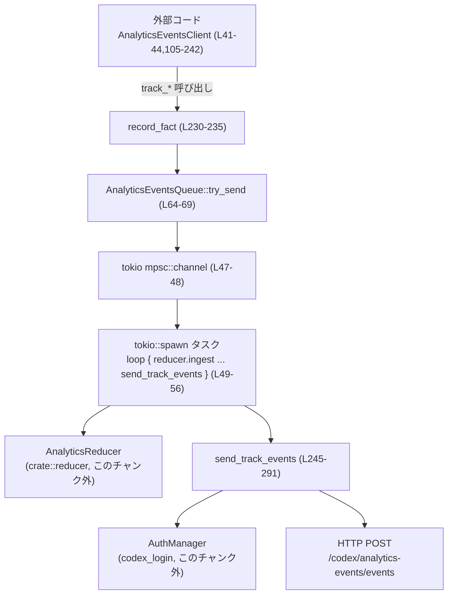
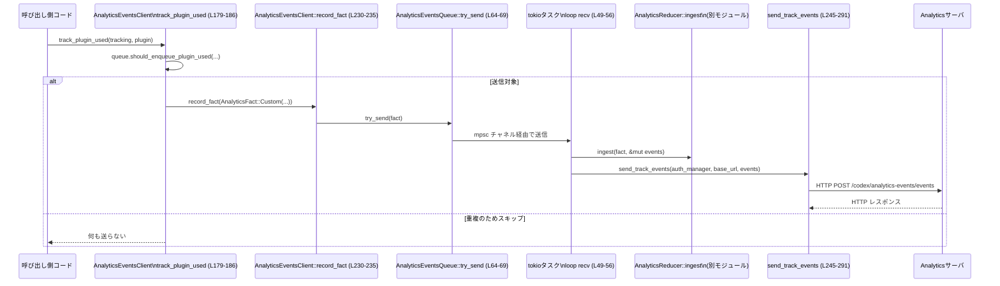

# analytics/src/client.rs コード解説

## 0. ざっくり一言

`AnalyticsEventsClient` を通じてアプリケーション内のさまざまなイベントを非同期キューに投入し、バックグラウンドタスクで集約 (`AnalyticsReducer`)・HTTP 送信するためのクライアントモジュールです（client.rs:L34-44, L46-56, L105-243）。

---

## 1. このモジュールの役割

### 1.1 概要

- このモジュールは **アプリ内で発生する分析イベント（analytics events）を収集し、非同期に送信する問題** を解決するために存在します。
- イベントは `AnalyticsEventsClient` の各 `track_*` メソッドから記録され、内部の `AnalyticsEventsQueue` を経由して送信処理タスクに渡されます（client.rs:L41-44, L105-242）。
- 送信タスクでは `AnalyticsReducer` によるイベント集約と、`send_track_events` による HTTP POST が行われます（client.rs:L49-56, L245-291）。

### 1.2 アーキテクチャ内での位置づけ

`AnalyticsEventsClient` を入口として、キュー・Reducer・HTTP クライアント・認証管理が連携します。



- 呼び出し側コードは `AnalyticsEventsClient` を生成し、各種 `track_*` メソッドを通じてイベントを送信します（client.rs:L105-242）。
- `record_fact` → `AnalyticsEventsQueue::try_send` が即時に呼ばれ、Tokio の `mpsc::channel` にイベントが投入されます（client.rs:L64-69, L230-235）。
- 別スレッド（Tokio タスク）で起動された無限ループがチャネルからイベントを取り出し、`AnalyticsReducer::ingest` で集約し、`send_track_events` で HTTP 送信します（client.rs:L49-56, L245-291）。
- 認証情報の取得・トークン/アカウント ID の解決は `AuthManager` に依存します（client.rs:L245-265）。

### 1.3 設計上のポイント

- **非同期キュー + ワーカー方式**  
  - `AnalyticsEventsQueue::new` 内で `tokio::spawn` されたタスクが `mpsc::Receiver` を監視し続けます（client.rs:L47-56）。
  - `track_*` 呼び出し側はブロッキングせず、`try_send` で即座にキュー投入／ドロップ判定を行います（client.rs:L64-69）。
- **重複イベント抑制（dedupe）**  
  - `AppUsed` と `PluginUsed` については、`(turn_id, connector_id)` / `(turn_id, plugin_id)` 単位で一度だけ送るよう、`HashSet` + `Mutex` で管理しています（client.rs:L71-87, L89-101）。
  - 記録済みキーが一定数（4096）を超えるとセットをクリアし、それ以降のイベントも再度送れるようにしています（client.rs:L83-85, L98-100）。
- **ベストエフォートな送信**  
  - キューがいっぱい／閉じている場合の送信失敗は単に警告ログを出し、イベントはドロップされます（client.rs:L64-69）。
  - 認証がない・ChatGPT 認証でない・トークン取得失敗・アカウント ID 不明の場合も、何も送らず即 return します（client.rs:L253-265）。
- **分析機能のオン／オフ切り替え**  
  - `AnalyticsEventsClient` のフィールド `analytics_enabled: Option<bool>` により、`Some(false)` の場合のみ一切キューに積まない実装になっています（client.rs:L41-44, L230-233）。
- **安全性と同期**  
  - 重複検出用セットは `Arc<Mutex<HashSet<...>>>` で保護され、`PoisonError` の場合も `into_inner` で中身を取り出す実装です（client.rs:L79-82, L94-97）。
  - イベント送信タスクは Tokio ランタイム上で動く前提です（client.rs:L49）。

---

## 2. 主要な機能一覧

このモジュールが提供する主な機能は次の通りです。

- イベントキュー生成と送信タスク起動: `AnalyticsEventsQueue::new` でチャネルとバックグラウンドタスクを構成（client.rs:L47-56）。
- イベントの非同期投入: `AnalyticsEventsClient::record_fact` → `AnalyticsEventsQueue::try_send` により、即時に mpsc キューへ投入（client.rs:L64-69, L230-235）。
- アプリ・プラグイン利用イベントの重複抑制: `should_enqueue_app_used` / `should_enqueue_plugin_used` による dedupe（client.rs:L71-87, L89-101）。
- 初期化イベントの記録: `track_initialize`（client.rs:L133-147）。
- スキル／サブエージェント／ガーディアンレビュー等のカスタムイベント記録: 各 `track_*` メソッド（client.rs:L117-131, L149-159, L161-168, L188-192）。
- アプリ言及・利用・プラグイン利用イベント記録: `track_app_mentioned` / `track_app_used` / `track_plugin_used`（client.rs:L161-177, L179-186）。
- プラグイン状態変化イベント記録: `track_plugin_installed` / `track_plugin_uninstalled` / `track_plugin_enabled` / `track_plugin_disabled`（client.rs:L194-228）。
- レスポンスイベント記録: `track_response`（client.rs:L237-242）。
- HTTP 送信処理: `send_track_events` による `TrackEventsRequest` POST（client.rs:L245-291）。

---

## 3. 公開 API と詳細解説

### 3.1 型一覧（構造体・列挙体）

| 名前 | 種別 | 公開範囲 | 行 | 役割 / 用途 |
|------|------|----------|----|-------------|
| `AnalyticsEventsQueue` | 構造体 | `pub(crate)` | client.rs:L34-38 | イベント送信用 mpsc::Sender と、「アプリ使用」「プラグイン使用」イベントの重複検出状態を保持する内部キューラッパーです。 |
| `AnalyticsEventsClient` | 構造体 | `pub` | client.rs:L41-44 | 外部から利用されるメインのクライアント。さまざまな `track_*` メソッドを通じて `AnalyticsFact` を記録し、内部のキューに渡します。 |

※ このチャンクには `AnalyticsFact`, `CustomAnalyticsFact`, `TrackEventsContext`, `SkillInvocation` などの定義は含まれていません。それらは `crate::facts` や `crate::events` モジュール側に存在します（client.rs:L6-16）。

---

### 3.2 関数詳細（重要なもの 7 件）

#### `AnalyticsEventsClient::new(auth_manager: Arc<AuthManager>, base_url: String, analytics_enabled: Option<bool>) -> Self`  （client.rs:L105-115）

**概要**

- 認証管理 (`AuthManager`) と送信先のベース URL、分析の有効／無効設定を受け取り、`AnalyticsEventsClient` を初期化します。
- 内部で `AnalyticsEventsQueue::new` を呼び出し、Tokio タスクを起動してバックグラウンド送信ループを開始します（client.rs:L47-56, L112）。

**引数**

| 引数名 | 型 | 説明 |
|--------|----|------|
| `auth_manager` | `Arc<AuthManager>` | 認証情報（トークン・アカウント ID など）を取得するための共有ハンドルです。バックグラウンドタスクにもクローンして渡されます（client.rs:L47, L112）。 |
| `base_url` | `String` | Analytics サービスのベース URL。`/codex/analytics-events/events` が付加されて送信先となります（client.rs:L47, L268）。 |
| `analytics_enabled` | `Option<bool>` | 分析機能のオン／オフフラグ。`Some(false)` のときのみイベント送信を完全に無効化します（client.rs:L41-44, L230-233）。 |

**戻り値**

- `AnalyticsEventsClient` インスタンス。内部にキュー・送信タスクの構成が含まれます（client.rs:L111-114）。

**内部処理の流れ**

1. `AnalyticsEventsQueue::new(Arc::clone(&auth_manager), base_url)` を呼び出し、mpsc チャネルと送信タスクを構築します（client.rs:L111-113）。
2. 生成された `AnalyticsEventsQueue` と `analytics_enabled` をフィールドに詰めて `Self` を返却します（client.rs:L111-114）。

**Examples（使用例）**

```rust
use std::sync::Arc;
use analytics::client::AnalyticsEventsClient; // 実際のパスは crate 構成に依存
use codex_login::AuthManager;

async fn create_client_example() {
    let auth_manager = Arc::new(AuthManager::new(/* ... */)); // 認証マネージャの初期化（詳細はこのチャンク外）
    let base_url = "https://analytics.example.com".to_string(); // 送信先ベースURL
    let analytics_enabled = Some(true); // 分析を有効にする

    // Tokio ランタイム上で呼び出す必要がある（内部で tokio::spawn を実行するため）
    let client = AnalyticsEventsClient::new(auth_manager, base_url, analytics_enabled);

    // 以降、client.track_* を呼ぶことでイベントを送信できる
}
```

**Errors / Panics**

- この関数自体は `Result` を返さず、明示的なエラー値はありません。
- ただし内部で `AnalyticsEventsQueue::new` が `tokio::spawn` を呼ぶため、Tokio ランタイム外で実行するとパニックする可能性があります（Tokio の仕様に依存。コード上では明示されていませんが `tokio::spawn` 呼び出しは client.rs:L49 にあります）。

**Edge cases（エッジケース）**

- `analytics_enabled` が `None` の場合は、`record_fact` 内の判定により「無効化されていない」とみなされ、イベントは送信対象になります（client.rs:L230-233）。
- `base_url` は空文字列も渡せますが、その場合の送信先 URL は `"/codex/analytics-events/events"` となり、実行時に HTTP エラーになる可能性があります（client.rs:L268）。

**使用上の注意点**

- この関数は Tokio ランタイム内で呼び出すことが前提です（内部で `tokio::spawn` を使用、client.rs:L49）。
- `auth_manager` は `Arc` で共有されるため、呼び出し側でライフタイムを十分に長く保つ必要があります（送信タスクが auth_manager の参照を使うため、client.rs:L47-55）。
- `analytics_enabled = Some(false)` とすると、以降の `track_*` 呼び出しはすべて無視されます（client.rs:L230-233）。

---

#### `AnalyticsEventsClient::track_initialize(&self, connection_id: u64, params: InitializeParams, product_client_id: String, rpc_transport: AppServerRpcTransport)` （client.rs:L133-147）

**概要**

- アプリケーションサーバとの初期化処理に関するイベントを記録し、送信キューに積みます。
- `AnalyticsFact::Initialize` バリアントを生成し、現在のランタイムメタデータや RPC トランスポート種別も含めて記録します（client.rs:L140-146）。

**引数**

| 引数名 | 型 | 説明 |
|--------|----|------|
| `connection_id` | `u64` | 接続を識別する ID（client.rs:L135, L141）。 |
| `params` | `InitializeParams` | 初期化 RPC のパラメータ（`codex_app_server_protocol` より、client.rs:L136, L142）。 |
| `product_client_id` | `String` | プロダクト側クライアントの識別子（client.rs:L137, L143）。 |
| `rpc_transport` | `AppServerRpcTransport` | RPC トランスポート種別（例: WebSocket / HTTP2 など。定義はこのチャンク外、client.rs:L138, L145）。 |

**戻り値**

- なし（`()`）。処理は `record_fact` 内で非同期キューに積むだけです（client.rs:L140-146, L230-235）。

**内部処理の流れ**

1. `AnalyticsFact::Initialize { ... }` 構造体を生成し、次のフィールドを設定します（client.rs:L140-146）。
   - `connection_id`
   - `params`
   - `product_client_id`
   - `runtime: current_runtime_metadata()`（client.rs:L5, L144）
   - `rpc_transport`
2. 生成した `AnalyticsFact` を `self.record_fact(...)` に渡します（client.rs:L140）。
3. `record_fact` が分析無効フラグを確認し、キューへ投入するかどうかを決定します（client.rs:L230-233）。

**Examples（使用例）**

```rust
use analytics::client::AnalyticsEventsClient;
use codex_app_server_protocol::InitializeParams;
use crate::events::AppServerRpcTransport;

fn on_initialize(client: &AnalyticsEventsClient,
                 connection_id: u64,
                 params: InitializeParams,
                 product_client_id: String,
                 transport: AppServerRpcTransport) {
    // 初期化が完了したタイミングで呼び出す
    client.track_initialize(connection_id, params, product_client_id, transport);
}
```

**Errors / Panics**

- 本メソッド自体はエラーを返しません。
- 内部での失敗要因:
  - `analytics_enabled == Some(false)` の場合、単に何もせずリターンします（client.rs:L230-233）。
  - バックグラウンドキューが一杯または閉じている場合、`try_send` がエラーを返し、イベントはドロップされます。その際に警告ログが出力されます（client.rs:L64-69）。

**Edge cases（エッジケース）**

- `params` や `product_client_id` にどのような値を入れるべきかは、このチャンクでは定義されていません（`InitializeParams` の仕様による）。
- `connection_id` の重複などはこの関数側では一切チェックしていません。

**使用上の注意点**

- 初期化 RPC が複数回行われる場合、そのたびに `track_initialize` を呼び出すと、その分のイベントが送信されます。重複抑制は行っていません。
- イベントの送信は非同期で行われるため、この関数が戻った時点ではまだサーバに送信されていない可能性があります（client.rs:L49-56, L245-291）。

---

#### `AnalyticsEventsClient::track_app_used(&self, tracking: TrackEventsContext, app: AppInvocation)` （client.rs:L170-177）

**概要**

- 「アプリが実際に使用された」ことを表すイベントを記録し、必要な場合のみキューに積みます。
- `AnalyticsEventsQueue::should_enqueue_app_used` により `(turn_id, connector_id)` 単位での重複送信を抑制します（client.rs:L170-176, L71-87）。

**引数**

| 引数名 | 型 | 説明 |
|--------|----|------|
| `tracking` | `TrackEventsContext` | ターン ID など、トラッキングに必要なメタデータ（client.rs:L170, L86）。 |
| `app` | `AppInvocation` | 使用されたアプリの情報。`connector_id` を持つ場合に dedupe キーとして利用されます（client.rs:L170, L76）。 |

**戻り値**

- なし。必要に応じて `AnalyticsFact::Custom(CustomAnalyticsFact::AppUsed(...))` をキューへ投入します（client.rs:L174-176）。

**内部処理の流れ**

1. `self.queue.should_enqueue_app_used(&tracking, &app)` を呼び出し、重複送信すべきでない場合は `false` が返り、即 return します（client.rs:L170-173, L71-87）。
2. `true` の場合、`AnalyticsFact::Custom(CustomAnalyticsFact::AppUsed(AppUsedInput { tracking, app }))` を生成し、`record_fact` に渡します（client.rs:L174-176）。

**Examples（使用例）**

```rust
use analytics::client::AnalyticsEventsClient;
use crate::facts::{TrackEventsContext, AppInvocation};

fn on_app_used(client: &AnalyticsEventsClient,
               tracking: TrackEventsContext,
               app: AppInvocation) {
    // アプリが実際に実行されたタイミングで呼び出す
    client.track_app_used(tracking, app);
}
```

**Errors / Panics**

- 本メソッド自体はエラーを返しません。
- 内部で `AnalyticsEventsQueue::should_enqueue_app_used` が `Mutex` ロックを取得しますが、`PoisonError` の場合でも `into_inner` により中身を取得して処理を続行します（client.rs:L79-82）。これによりパニックは回避されます。

**Edge cases（エッジケース）**

- `app.connector_id` が `None` の場合、`should_enqueue_app_used` は常に `true` を返し、重複抑制は行われません（client.rs:L76-78）。
- 同じ `(turn_id, connector_id)` の組み合わせで複数回呼び出された場合、最初の 1 回のみイベントが送信されます。2 回目以降は `HashSet::insert` が `false` を返すため、キューに積まれません（client.rs:L83-87）。
- 重複検出用セットのサイズが `ANALYTICS_EVENT_DEDUPE_MAX_KEYS`（4096）以上になると、セットはクリアされ、それ以降最初の呼び出しは再び送信されます（client.rs:L83-85）。

**使用上の注意点**

- 重複抑制のキーは `(tracking.turn_id.clone(), connector_id.clone())` のみであり、他の情報（ユーザー ID 等）は考慮されません（client.rs:L86）。
- 「同じターン内で同じコネクターのアプリ使用イベントは 1 回にしたい」という前提で設計されていると解釈できますが、その前提が変わる場合は `should_enqueue_app_used` の実装変更が必要です（client.rs:L71-87）。

---

#### `AnalyticsEventsClient::track_plugin_used(&self, tracking: TrackEventsContext, plugin: PluginTelemetryMetadata)` （client.rs:L179-186）

**概要**

- 「プラグインが実際に使用された」ことを表すイベントを記録し、必要な場合のみキューに積みます。
- `AnalyticsEventsQueue::should_enqueue_plugin_used` により `(turn_id, plugin_id)` 単位での重複送信を抑制します（client.rs:L179-185, L89-101）。

**引数**

| 引数名 | 型 | 説明 |
|--------|----|------|
| `tracking` | `TrackEventsContext` | トラッキング用メタデータ（client.rs:L179, L91）。 |
| `plugin` | `PluginTelemetryMetadata` | 利用されたプラグインのテレメトリ情報。`plugin.plugin_id.as_key()` が dedupe キーに使われます（client.rs:L179, L101）。 |

**戻り値**

- なし。必要に応じて `AnalyticsFact::Custom(CustomAnalyticsFact::PluginUsed(...))` をキューへ投入します（client.rs:L183-185）。

**内部処理の流れ**

1. `self.queue.should_enqueue_plugin_used(&tracking, &plugin)` を呼び出します（client.rs:L179-181）。
2. `false` が返ってきた場合はイベントを送らずに return します（client.rs:L180-181）。
3. `true` の場合、`crate::facts::PluginUsedInput { tracking, plugin }` をラップした `CustomAnalyticsFact::PluginUsed` を `record_fact` に渡します（client.rs:L183-185）。

**Examples（使用例）**

```rust
use analytics::client::AnalyticsEventsClient;
use crate::facts::TrackEventsContext;
use codex_plugin::PluginTelemetryMetadata;

fn on_plugin_used(client: &AnalyticsEventsClient,
                  tracking: TrackEventsContext,
                  plugin_meta: PluginTelemetryMetadata) {
    client.track_plugin_used(tracking, plugin_meta);
}
```

**Errors / Panics**

- エラー値は返しません。
- `Mutex` ロックの `PoisonError` は無視し、中身をそのまま利用します（client.rs:L94-97）。

**Edge cases（エッジケース）**

- `(tracking.turn_id.clone(), plugin.plugin_id.as_key())` がすでにセットに存在する場合、イベントは送信されません（client.rs:L101）。
- キー数が 4096 を超えるとセットをクリアし、以降再度送信対象になります（client.rs:L98-100）。

**使用上の注意点**

- プラグイン使用イベントをターン内で 1 回だけに抑えたい場合には有効ですが、別の単位（セッションなど）で dedupe したい場合は `TrackEventsContext` やキーの構造を変更する必要があります。
- プラグイン ID 文字列の生成は `plugin.plugin_id.as_key()` に依存しており、その実装はこのチャンクには含まれていません（client.rs:L101）。

---

#### `AnalyticsEventsClient::track_response(&self, connection_id: u64, response: ClientResponse)` （client.rs:L237-242）

**概要**

- アプリケーションサーバからのレスポンスを分析イベントとして記録します。
- `AnalyticsFact::Response` として `connection_id` と `response` をキューに積みます（client.rs:L238-241）。

**引数**

| 引数名 | 型 | 説明 |
|--------|----|------|
| `connection_id` | `u64` | このレスポンスに対応する接続 ID（client.rs:L237, L239）。 |
| `response` | `ClientResponse` | サーバからのレスポンスオブジェクト。`Box` に包んでイベントに含めます（client.rs:L237, L240）。 |

**戻り値**

- なし。

**内部処理の流れ**

1. `AnalyticsFact::Response { connection_id, response: Box::new(response) }` を生成します（client.rs:L238-241）。
2. 生成したイベントを `record_fact` に渡します（client.rs:L238）。

**Examples（使用例）**

```rust
use analytics::client::AnalyticsEventsClient;
use codex_app_server_protocol::ClientResponse;

fn on_response(client: &AnalyticsEventsClient,
               connection_id: u64,
               resp: ClientResponse) {
    client.track_response(connection_id, resp);
}
```

**Errors / Panics**

- 本メソッド自体はエラーを返しません。
- キューが満杯／閉じている場合、`try_send` でイベントがドロップされる可能性があります（client.rs:L64-69）。

**Edge cases（エッジケース）**

- レスポンスが非常に大きい場合でも、`Box::new(response)` によりヒープ上に格納されるだけで、特別な扱いはありません（client.rs:L240）。

**使用上の注意点**

- 多数のレスポンスを高頻度で記録すると、mpsc キュー（サイズ 256）の上限に達しやすくなり、イベントドロップが増える可能性があります（client.rs:L29, L64-69）。

---

#### `AnalyticsEventsQueue::new(auth_manager: Arc<AuthManager>, base_url: String) -> Self` （client.rs:L47-62）

**概要**

- イベント送信用 mpsc チャネルと、バックグラウンド送信タスクを生成する内部コンストラクタです。
- `AnalyticsReducer` を1つ生成し、チャネルから受信した `AnalyticsFact` を順次 `send_track_events` に渡します（client.rs:L49-55）。

**引数**

| 引数名 | 型 | 説明 |
|--------|----|------|
| `auth_manager` | `Arc<AuthManager>` | 認証情報をバックグラウンドタスクでも利用するための共有ハンドル（client.rs:L47, L54）。 |
| `base_url` | `String` | 送信先サービスのベース URL（client.rs:L47, L54）。 |

**戻り値**

- `AnalyticsEventsQueue`。`sender` 、`app_used_emitted_keys` 、`plugin_used_emitted_keys` を初期化して返します（client.rs:L57-61）。

**内部処理の流れ（アルゴリズム）**

1. `mpsc::channel(ANALYTICS_EVENTS_QUEUE_SIZE)` で `(sender, receiver)` を生成します（client.rs:L47-48）。
2. `tokio::spawn(async move { ... })` でバックグラウンドタスクを起動します（client.rs:L49）。
   - `AnalyticsReducer::default()` で reducer を 1 つ生成（client.rs:L50）。
   - ループ: `while let Some(input) = receiver.recv().await` でイベントを受信（client.rs:L51）。
   - 各イベントごとに新しい `Vec::new()` を作り、`reducer.ingest(input, &mut events).await` で変換／集約（client.rs:L52-53）。
   - 得られた `events` を `send_track_events(&auth_manager, &base_url, events).await` で送信（client.rs:L54）。
3. `AnalyticsEventsQueue { sender, app_used_emitted_keys: ..., plugin_used_emitted_keys: ... }` を構築し返します（client.rs:L57-61）。

**Examples（使用例）**

通常は `AnalyticsEventsClient::new` 経由で利用されるため、直接呼び出すことは少ないと考えられます。

```rust
use std::sync::Arc;
use codex_login::AuthManager;
use analytics::client::AnalyticsEventsQueue;

fn create_queue(auth: Arc<AuthManager>, base_url: String) -> AnalyticsEventsQueue {
    AnalyticsEventsQueue::new(auth, base_url)
}
```

**Errors / Panics**

- 関数としては `Result` を返さずエラー処理は行っていません。
- ただし、`tokio::spawn` は、Tokio ランタイム外から呼び出すとパニックする可能性があります（Tokio の仕様）。コード上ではそのチェックはありません（client.rs:L49）。
- `mpsc::channel` の生成が失敗する可能性は通常考慮されていません（標準的な Tokio 実装ではパニックしません）。

**Edge cases（エッジケース）**

- `AnalyticsEventsQueue` が全ての `sender` をドロップすると、バックグラウンドタスクは `receiver.recv().await` が `None` を返すようになり、`while let` ループが終了してタスクが自然に終了します（Tokio `mpsc` の仕様。コード上では明示していませんがループ条件から読み取れます、client.rs:L51）。
- `base_url` や `auth_manager` は move されタスク内に所有されるため、`AnalyticsEventsQueue` インスタンスをドロップしてもタスク自体は存続し続けます（チャネルが閉じるまでは）。

**使用上の注意点**

- `AnalyticsEventsQueue::new` は `pub(crate)` であり、通常は同一クレート内から `AnalyticsEventsClient::new` を通じて利用されます（client.rs:L34, L105-115）。
- バックグラウンドタスクがどの程度の頻度で `send_track_events` を呼ぶかは `AnalyticsReducer::ingest` の実装に依存しており、このチャンクからは分かりません。

---

#### `send_track_events(auth_manager: &AuthManager, base_url: &str, events: Vec<TrackEventRequest>)` （client.rs:L245-291）

**概要**

- `TrackEventRequest` のベクタを受け取り、認証情報を使って HTTP POST で送信する非公開の非同期関数です。
- 認証情報が揃っていない／ChatGPT 認証でない／HTTP エラーなどの場合、警告ログを残すだけで呼び出し元にはエラーを返しません（client.rs:L253-291）。

**引数**

| 引数名 | 型 | 説明 |
|--------|----|------|
| `auth_manager` | `&AuthManager` | 認証情報を非同期に取得するための参照（client.rs:L246, L253-265）。 |
| `base_url` | `&str` | ベース URL。末尾の `/` はトリムされます（client.rs:L247, L267-268）。 |
| `events` | `Vec<TrackEventRequest>` | 送信対象のイベント群。空の場合は送信せずに return します（client.rs:L248-252）。 |

**戻り値**

- 戻り値型は `()` の `async fn` であり、送信の成否は呼び出し元には伝えられません（client.rs:L245-249）。

**内部処理の流れ（アルゴリズム）**

1. `events.is_empty()` なら即 return（client.rs:L250-252）。
2. `auth_manager.auth().await` で認証情報をオプションで取得。`None` の場合は return（client.rs:L253-255）。
3. `auth.is_chatgpt_auth()` が `false` の場合も return（client.rs:L256-258）。
4. `auth.get_token()` でアクセストークンを取得。`Err(_)` の場合は return（client.rs:L259-262）。
5. `auth.get_account_id()` でアカウント ID を取得。`None` の場合は return（client.rs:L263-265）。
6. `base_url.trim_end_matches('/')` で末尾のスラッシュを削除し、`{base_url}/codex/analytics-events/events` を組み立てる（client.rs:L267-268）。
7. `TrackEventsRequest { events }` を JSON として POST する HTTP リクエストを構築（client.rs:L269-278）。
   - `timeout(ANALYTICS_EVENTS_TIMEOUT)`（10 秒）を設定（client.rs:L30, L273）。
   - `bearer_auth(&access_token)` をヘッダーに設定（client.rs:L274）。
   - `chatgpt-account-id` と `Content-Type: application/json` ヘッダーを追加（client.rs:L275-276）。
8. `.send().await` の結果に応じてログ出力（client.rs:L281-290）。
   - 成功ステータス (`is_success()`) の場合は何もしない（client.rs:L282）。
   - 非成功ステータスの場合はステータスとレスポンスボディを warn ログに出力（client.rs:L283-287）。
   - リクエストレベルのエラーの場合も warn ログを出力（client.rs:L288-290）。

**Examples（使用例）**

通常は `AnalyticsEventsQueue` のバックグラウンドタスクからのみ呼び出され、外部から直接使われません。

```rust
// 疑似例: crate 内部で直接利用する場合
async fn flush_events(auth: &AuthManager, base_url: &str, events: Vec<TrackEventRequest>) {
    send_track_events(auth, base_url, events).await;
}
```

**Errors / Panics**

- 関数はエラーを返さず、すべての失敗ケースで早期 return または warn ログのみです（client.rs:L250-265, L281-290）。
- `response.text().await.unwrap_or_default()` により、レスポンス本文の取得時にエラーが発生した場合でもパニックせず、空文字列にフォールバックします（client.rs:L285）。

**Edge cases（エッジケース）**

- 認証が取得できない／ChatGPT 認証でない／トークン取得失敗／アカウント ID 不明のいずれかの場合、イベントは送信されずに silently drop（ログも出ません）されます（client.rs:L253-265）。
- `base_url` にすでに `/codex/analytics-events/events` が含まれているような値を渡した場合、パスが重複してしまいますが、そのようなケースを検証する処理はありません（client.rs:L268）。
- `events` が大きなベクタでも分割せず一括送信します。サイズ制限などはこの関数内にはありません。

**使用上の注意点**

- エラーが呼び出し元に返されないため、イベント送信の成功／失敗をアプリ側で厳密に把握することはできません。
- `base_url` が外部入力に依存する場合、想定外のエンドポイントにトークン付きリクエストを送ってしまうリスクがあるため、呼び出し側で検証が必要になります（この関数内では検証していません）。
- 送信タイムアウトは固定で 10 秒です（client.rs:L30）。高レイテンシ／不安定なネットワーク環境での挙動はこの値に依存します。

---

#### `AnalyticsEventsClient::record_fact(&self, input: AnalyticsFact)` （client.rs:L230-235）

（7 件に追加で、このモジュールの中核なので簡潔に記載します）

**概要**

- `AnalyticsEventsClient` の全ての `track_*` メソッドから利用される内部ヘルパーです。
- 分析が無効化 (`analytics_enabled == Some(false)`) されていない限り、`AnalyticsEventsQueue::try_send` にイベントを渡します（client.rs:L230-235）。

**引数**

| 引数名 | 型 | 説明 |
|--------|----|------|
| `input` | `AnalyticsFact` | 送信対象の分析イベント（client.rs:L230）。 |

**戻り値**

- なし。

**内部処理**

1. `if self.analytics_enabled == Some(false) { return; }` で明示的な無効化フラグをチェック（client.rs:L231-233）。
2. `self.queue.try_send(input);` で mpsc キューに非同期（ノンブロッキング）送信を試みます（client.rs:L234-235）。

---

### 3.3 その他の関数一覧

| 関数名 | シグネチャ | 行 | 役割（1 行） |
|--------|------------|----|--------------|
| `AnalyticsEventsQueue::try_send` | `fn try_send(&self, input: AnalyticsFact)` | client.rs:L64-69 | mpsc チャネルに非同期イベントを `try_send` し、失敗時には warn ログを出してイベントをドロップします。 |
| `AnalyticsEventsQueue::should_enqueue_app_used` | `fn should_enqueue_app_used(&self, tracking: &TrackEventsContext, app: &AppInvocation) -> bool` | client.rs:L71-87 | `(turn_id, connector_id)` に基づき `AppUsed` イベントを送るべきか判定します。 |
| `AnalyticsEventsQueue::should_enqueue_plugin_used` | `fn should_enqueue_plugin_used(&self, tracking: &TrackEventsContext, plugin: &PluginTelemetryMetadata) -> bool` | client.rs:L89-101 | `(turn_id, plugin_id)` ベースで `PluginUsed` イベントの重複送信を防ぎます。 |
| `AnalyticsEventsClient::track_skill_invocations` | `pub fn track_skill_invocations(&self, tracking: TrackEventsContext, invocations: Vec<SkillInvocation>)` | client.rs:L117-131 | スキル呼び出し群を `CustomAnalyticsFact::SkillInvoked` として記録します（空ベクタなら送信しません）。 |
| `AnalyticsEventsClient::track_subagent_thread_started` | `pub fn track_subagent_thread_started(&self, input: SubAgentThreadStartedInput)` | client.rs:L149-153 | サブエージェントスレッド開始イベントを `CustomAnalyticsFact::SubAgentThreadStarted` として記録します。 |
| `AnalyticsEventsClient::track_guardian_review` | `pub fn track_guardian_review(&self, input: GuardianReviewEventParams)` | client.rs:L155-159 | ガーディアンレビューイベントを `CustomAnalyticsFact::GuardianReview` として Box 包装し記録します。 |
| `AnalyticsEventsClient::track_app_mentioned` | `pub fn track_app_mentioned(&self, tracking: TrackEventsContext, mentions: Vec<AppInvocation>)` | client.rs:L161-168 | アプリがプロンプト等で言及されたイベントを `AppMentionedInput` として記録します（空なら送信しません）。 |
| `AnalyticsEventsClient::track_compaction` | `pub fn track_compaction(&self, event: crate::facts::CodexCompactionEvent)` | client.rs:L188-192 | コンパクションイベントを `CustomAnalyticsFact::Compaction` として記録します。 |
| `AnalyticsEventsClient::track_plugin_installed` | `pub fn track_plugin_installed(&self, plugin: PluginTelemetryMetadata)` | client.rs:L194-201 | プラグインインストールを `PluginStateChanged(Installed)` イベントとして記録します。 |
| `AnalyticsEventsClient::track_plugin_uninstalled` | `pub fn track_plugin_uninstalled(&self, plugin: PluginTelemetryMetadata)` | client.rs:L203-210 | プラグインアンインストールを `PluginStateChanged(Uninstalled)` として記録します。 |
| `AnalyticsEventsClient::track_plugin_enabled` | `pub fn track_plugin_enabled(&self, plugin: PluginTelemetryMetadata)` | client.rs:L212-219 | プラグイン有効化を `PluginStateChanged(Enabled)` として記録します。 |
| `AnalyticsEventsClient::track_plugin_disabled` | `pub fn track_plugin_disabled(&self, plugin: PluginTelemetryMetadata)` | client.rs:L221-227 | プラグイン無効化を `PluginStateChanged(Disabled)` として記録します。 |

---

## 4. データフロー

ここでは代表的なシナリオとして、「プラグインが使用されたイベント」が送信されるまでのフローを示します。

### 処理の要点

1. 呼び出し側コードが `AnalyticsEventsClient::track_plugin_used` を呼ぶ（client.rs:L179-186）。
2. `record_fact` → `AnalyticsEventsQueue::try_send` を通じて、イベントは mpsc チャネルに非同期に投入される（client.rs:L230-235, L64-69）。
3. バックグラウンドタスクがチャネルからイベントを取り出し、`AnalyticsReducer::ingest` で `TrackEventRequest` に変換する（client.rs:L49-53）。
4. `send_track_events` が認証情報を解決し、HTTP で送信する（client.rs:L245-291）。



---

## 5. 使い方（How to Use）

### 5.1 基本的な使用方法

`AnalyticsEventsClient` を初期化し、アプリ内の各ポイントで `track_*` メソッドを呼び出すのが基本的なパターンです。

```rust
use std::sync::Arc;
use analytics::client::AnalyticsEventsClient;          // このモジュールの公開クライアント
use codex_login::AuthManager;
use crate::facts::{TrackEventsContext, AppInvocation}; // 実際のパスは crate 構成による

#[tokio::main]                                         // Tokio ランタイムを起動
async fn main() {
    // 1. AuthManager と AnalyticsEventsClient の初期化
    let auth_manager = Arc::new(AuthManager::new(/* 認証設定 */)); // 認証マネージャ
    let base_url = "https://analytics.example.com".to_string();    // 送信先ベースURL
    let analytics_enabled = Some(true);                            // 分析を有効化

    let client = AnalyticsEventsClient::new(
        auth_manager,
        base_url,
        analytics_enabled,
    );                                                              // 内部で送信タスクが起動される

    // 2. 何らかのトラッキングコンテキストとイベントを準備
    let tracking = TrackEventsContext {
        // フィールドはこのチャンク外
        // 例: turn_id など
        /* ... */
    };
    let app_invocation = AppInvocation {
        // 実際に呼び出したアプリ情報
        /* ... */
    };

    // 3. アプリ使用イベントを記録
    client.track_app_used(tracking, app_invocation);               // 非同期にキューへ投入
    // バックグラウンドで HTTP 送信が行われる
}
```

### 5.2 よくある使用パターン

- **分析機能を設定でオン／オフする**

```rust
fn make_client(auth: Arc<AuthManager>, base_url: String, enable_analytics: bool)
    -> AnalyticsEventsClient
{
    let analytics_enabled = if enable_analytics {
        Some(true)   // 明示的に有効
    } else {
        Some(false)  // 明示的に無効
    };

    AnalyticsEventsClient::new(auth, base_url, analytics_enabled)
}
```

- **イベントが存在する場合のみ送る**

  `track_skill_invocations` や `track_app_mentioned` は、渡されたベクタが空の場合は何もしない設計になっています（client.rs:L122-124, L162-164）。「イベントが一件もないが API 的には呼び出したい」という場合に便利です。

### 5.3 よくある間違い

```rust
// 間違い例: Tokio ランタイム外で new を呼ぶ
fn main() {
    let auth = Arc::new(AuthManager::new(/* ... */));
    let client = AnalyticsEventsClient::new(auth, "https://...".into(), Some(true));
    // tokio::spawn が内部で呼ばれるため、環境によってはここでパニックし得る
}

// 正しい例: Tokio ランタイム内で new を呼ぶ
#[tokio::main]
async fn main() {
    let auth = Arc::new(AuthManager::new(/* ... */));
    let client = AnalyticsEventsClient::new(auth, "https://...".into(), Some(true));
}
```

```rust
// 間違い例: Analytics を無効化しているのにイベントが来ないと驚く
let client = AnalyticsEventsClient::new(auth, base_url, Some(false));
client.track_response(connection_id, response); // 何も送られない（record_fact で return）

// 正しい例: None か Some(true) で有効化
let client = AnalyticsEventsClient::new(auth, base_url, None);      // デフォルト有効
// または
let client = AnalyticsEventsClient::new(auth, base_url, Some(true));
```

### 5.4 使用上の注意点（まとめ）

- **Tokio ランタイム必須**  
  - `AnalyticsEventsQueue::new` が `tokio::spawn` を使用するため、Tokio ランタイムが動作しているスレッドで生成する必要があります（client.rs:L49）。
- **キュー上限とイベントドロップ**  
  - チャネルのバッファサイズは 256 で固定です（client.rs:L29）。
  - バッファが満杯／閉じていると `try_send` がエラーとなり、イベントは「dropping analytics events: queue is full」としてログ出力のみで破棄されます（client.rs:L64-69）。
- **認証条件を満たさない場合のサイレントドロップ**  
  - `send_track_events` 内で、認証情報が取れない／ChatGPT 認証でない／トークン無し／アカウント ID 無し、のいずれかの場合は何もログを出さず return しています（client.rs:L253-265）。  
    このため、環境設定ミスがあっても気付きづらい可能性があります。
- **dedupe の前提**  
  - `track_app_used` / `track_plugin_used` の重複抑制は `(turn_id, connector_id)` / `(turn_id, plugin_id)` のみをキーにしており、他の要素に依存しません（client.rs:L86, L101）。  
    違う粒度での dedupe が必要な場合は、実装を変更する必要があります。
- **テストについて**  
  - このファイルにはテストコードは含まれていません。テストが別ファイルに存在するかどうかは、このチャンクからは分かりません。

---

## 6. 変更の仕方（How to Modify）

### 6.1 新しい機能を追加する場合

新しい種類の分析イベントを追加したい場合の典型的な手順です。

1. **新しい入力型／`CustomAnalyticsFact` バリアントの追加**  
   - `crate::facts` モジュール側に新しい入力構造体や `CustomAnalyticsFact` のバリアントを定義します（このチャンクには定義はありませんが、既存の `SkillInvoked`, `AppMentioned` などが参考になります、client.rs:L125-130, L165-167）。
2. **`AnalyticsEventsClient` に `track_*` メソッドを追加**  
   - 既存の `track_skill_invocations` や `track_compaction` と同じパターンで、`self.record_fact(AnalyticsFact::Custom(CustomAnalyticsFact::...))` を呼ぶメソッドを追加します（client.rs:L117-131, L188-192）。
3. **`AnalyticsReducer::ingest` での扱いを追加**  
   - 新しい `AnalyticsFact` / `CustomAnalyticsFact` バリアントを `TrackEventRequest` に変換するロジックを `AnalyticsReducer` に追加します（`AnalyticsReducer` の定義はこのチャンクにはありません、client.rs:L50, L53）。
4. **必要であれば dedupe ロジックを追加**  
   - 「特定のイベントは一度だけ送りたい」場合、`AnalyticsEventsQueue` に `HashSet` と `should_enqueue_*` 関数を追加し、`track_*` 側から呼び出します（client.rs:L71-87, L89-101, L170-177, L179-186）。

### 6.2 既存の機能を変更する場合

- **キューサイズやタイムアウトを変更したい場合**
  - `ANALYTICS_EVENTS_QUEUE_SIZE` と `ANALYTICS_EVENTS_TIMEOUT` の定数を変更します（client.rs:L29-30）。
  - キューサイズを小さくするとドロップが増え、大きくするとメモリ使用量が増える点に注意が必要です。
- **dedupe の単位を変えたい場合**
  - `should_enqueue_app_used` / `should_enqueue_plugin_used` のキー生成部分を修正します（client.rs:L83-87, L98-101）。
  - 同時に、それらを呼び出す `track_app_used` / `track_plugin_used` の仕様も確認します（client.rs:L170-177, L179-186）。
- **失敗時の挙動（ログ／リトライ）を変えたい場合**
  - `send_track_events` の `match response` ブロックにロジックを追加し、リトライやメトリクス送信などを行います（client.rs:L281-290）。
  - `AnalyticsEventsQueue::try_send` のエラー処理も、現状は warn ログのみに留まっているため、メトリクスやバックプレッシャー制御を追加する余地があります（client.rs:L64-69）。
- **契約（前提条件）の確認**
  - 変更前後で `AnalyticsEventsClient` の公開メソッドシグネチャ（引数・戻り値）が変わる場合、呼び出し元コードのコンパイルエラーで影響範囲を確認できます。
  - `AnalyticsReducer` とのインターフェース（`ingest` の引数型・意味）は特に重要であり、この契約を変更する場合は双方の実装とテストの更新が必要です（client.rs:L50, L53）。

---

## 7. 関連ファイル

このモジュールと密接に関係するファイル・モジュールは次の通りです（いずれもこのチャンクには定義がなく、 `use` から推測されます）。

| パス / モジュール | 役割 / 関係 |
|-------------------|------------|
| `crate::events` | `AppServerRpcTransport`, `GuardianReviewEventParams`, `TrackEventRequest`, `TrackEventsRequest`, `current_runtime_metadata` を提供し、イベントのワイヤフォーマットやランタイム情報の取得を担うと考えられます（client.rs:L1-5）。 |
| `crate::facts` | `AnalyticsFact`, `CustomAnalyticsFact`, `TrackEventsContext`, 各種 `*Input` 型、`PluginState` 等、ドメインレベルの「事実」を表現する型群を提供します（client.rs:L6-16, L11-12）。 |
| `crate::reducer::AnalyticsReducer` | `AnalyticsFact` を `TrackEventRequest` に変換・集約するコンポーネントで、バックグラウンドタスク内で利用されています（client.rs:L17, L50, L53）。 |
| `codex_app_server_protocol` | `ClientResponse`, `InitializeParams` など、アプリケーションサーバとの通信モデルを定義する外部クレートです（client.rs:L18-19）。 |
| `codex_login` | `AuthManager` と `default_client::create_client` を提供し、認証情報の取得と HTTP クライアント生成を担います（client.rs:L20-21, L245-279）。 |
| `codex_plugin::PluginTelemetryMetadata` | プラグインの ID やメタデータを含むテレメトリ情報を提供します（client.rs:L22, L89-93, L179-186, L194-228）。 |
| `tokio::sync::mpsc` | 非同期チャネル実装。イベントのバッファリングとバックグラウンドタスクへの受け渡しに利用されています（client.rs:L27, L47-48, L51）。 |

このファイル自体にはテストコードは含まれていません。テストは別モジュール（例えば `analytics/src/client_test.rs` など）に存在する可能性がありますが、このチャンクからは特定できません。
