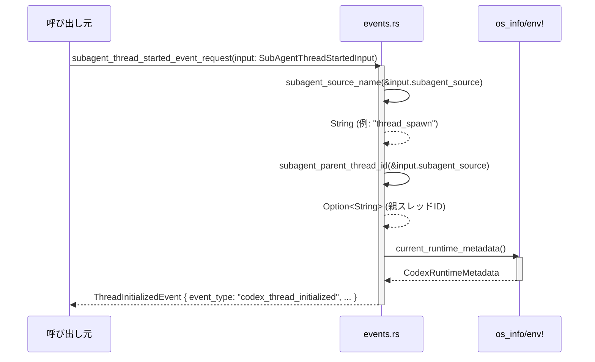

# analytics/src/events.rs コード解説

## 0. ざっくり一言

`analytics/src/events.rs` は、Codex の各種テレメトリイベント（アプリ利用、プラグイン利用、ガーディアンレビュー、コンパクション、スレッド初期化など）の **シリアライズ用データ型** と、元データからそれらを構築する **ヘルパー関数群** を定義するモジュールです（`analytics/src/events.rs:L16-519`）。

---

## 1. このモジュールの役割

### 1.1 概要

- このモジュールは、Codex クライアントやサブエージェントで発生する出来事を **追跡イベントとして送信するためのペイロード** を表現します（`TrackEventsRequest`, `TrackEventRequest` など, `analytics/src/events.rs:L32-51`）。
- ガーディアンレビュー（安全性確認プロセス）のアクション・結果を表す公開型 (`GuardianReviewedAction` など) を提供し、他のモジュールから安全に利用できるようにします（`analytics/src/events.rs:L114-183,185-236,238-271`）。
- `codex_app_metadata`, `codex_plugin_metadata`, `subagent_thread_started_event_request` などの関数で、ドメイン型（`AppInvocation`, `PluginTelemetryMetadata`, `SubAgentThreadStartedInput` など）からイベント用メタデータ構造体を組み立てます（`analytics/src/events.rs:L374-387,L389-410,L473-500`）。

### 1.2 アーキテクチャ内での位置づけ

このモジュールは、主に次のコンポーネント／クレートに依存しています。

- `crate::facts` 内のドメインイベント・コンテキスト  
  （`AppInvocation`, `CodexCompactionEvent`, `TrackEventsContext`, `SubAgentThreadStartedInput` など, `analytics/src/events.rs:L1-6,412-418,473-475`）
- 認証情報から「originator」を取得する `codex_login::default_client::originator`（`analytics/src/events.rs:L7`）
- プラグイン情報 `codex_plugin::PluginTelemetryMetadata`（`analytics/src/events.rs:L8,L389-410,L443-452`）
- Codex プロトコル型 (`SessionSource`, `SubAgentSource`, `NetworkApprovalProtocol`, `SandboxPermissions`, `PermissionProfile`)（`analytics/src/events.rs:L9-13,L185-229,L233-236,L455-460,L502-518`）
- 環境／OS 情報を取得する `os_info` と `std::env`（`analytics/src/events.rs:L463-471`）

依存関係のイメージです。

```mermaid
graph TD
    %% モジュール依存関係 (analytics/src/events.rs:L1-519, chunk 1/1)
    subgraph Analytics
        E[events.rs]
    end

    F[crate::facts\n(AppInvocation,\nCodexCompactionEvent,\nTrackEventsContext,\nSubAgentThreadStartedInput)] --> E
    L[codex_login::originator] --> E
    P[codex_plugin::\nPluginTelemetryMetadata] --> E
    CP[codex_protocol::\nSessionSource,\nSubAgentSource,\nNetworkApprovalProtocol,\nSandboxPermissions,\nPermissionProfile] --> E
    OS[os_info,\nstd::env] --> E
    Serde[serde::Serialize] --> E
```

このファイルからは、「どこで `TrackEventsRequest` が実際に送信されるか」は分かりません（送信処理はこのチャンクには現れない）。

### 1.3 設計上のポイント

- **イベントスキーマ中心の設計**  
  ほぼすべてが `#[derive(Serialize)]` を持つ構造体／列挙体で、JSON 等へのシリアライズ前提の設計です（`analytics/src/events.rs:L16-22,L32-51,L53-69,L71-86,L88-106,L108-112,L238-271,L273-363`）。
- **serde 属性によるフォーマット固定**
  - `#[serde(rename_all = "snake_case")]` や `#[serde(rename_all = "lowercase")]` で enum の文字列表現を安定化（`AppServerRpcTransport`, `GuardianReview*` 系など, `analytics/src/events.rs:L16-22,L114-177,L185-236`）。
  - `#[serde(tag = "type")]` + `rename_all` で `GuardianReviewedAction` のバリアント名を `type` フィールドに出す（`analytics/src/events.rs:L185-187`）。
  - `#[serde(untagged)]` で `TrackEventRequest` のバリアントに外部タグ無しの形式を採用（`analytics/src/events.rs:L37-51`）。
  - `#[serde(flatten)]` で `GuardianReviewEventPayload` / `CodexPluginUsedMetadata` 内部のフィールドを 1 階層に平坦化（`analytics/src/events.rs:L273-279,L344-347`）。
- **状態を持たないヘルパー関数**  
  すべて `pub(crate) fn` であり、内部状態を持たず、与えられた入力から新しい構造体を組み立てて返すだけです（`analytics/src/events.rs:L365-372,L374-387,L389-410,L412-441,L443-452,L455-460,L463-471,L473-500,L502-518`）。
- **安全性とエラーハンドリング**
  - `unsafe` ブロックは存在せず、すべて安全な Rust で書かれています（`analytics/src/events.rs:L1-519` 全体に `unsafe` なし）。
  - 関数は `Result` を返さず、基本的に **失敗しない構造体組み立て** です。潜在的な失敗要因は `os_info::get()` や環境マクロ `env!` などの外部クレート／マクロに依存します（`analytics/src/events.rs:L463-471`）。
- **並行性**
  - `async`, `std::thread`, `Send`/`Sync` 等はこのファイル内には登場せず、並行処理は行っていません。
- **イベント名の文字列定数化**  
  `event_type: &'static str` や `plugin_state_event_type` の返り値など、イベント名は文字列リテラルとして固定されています（`analytics/src/events.rs:L53-59,L88-106,L108-112,L292-302,L327-331,L353-363,L365-372,L473-500`）。外部の集計基盤がこれらの文字列に依存している可能性が高く、変更時の影響に注意が必要です（利用箇所はこのチャンクには現れない）。

---

## 2. 主要な機能一覧（コンポーネントインベントリー・要約）

このモジュールが提供する主なコンポーネントです（関数と主要型）。

### 関数（10 件）

| 関数名 | 役割（1 行） | 根拠 |
|--------|-------------|------|
| `plugin_state_event_type` | `PluginState` からプラグイン状態イベントの型文字列を返す | `analytics/src/events.rs:L365-372` |
| `codex_app_metadata` | `TrackEventsContext` と `AppInvocation` からアプリ利用メタデータを組み立てる | `analytics/src/events.rs:L374-387` |
| `codex_plugin_metadata` | `PluginTelemetryMetadata` からプラグインの能力情報を含むメタデータを組み立てる | `analytics/src/events.rs:L389-410` |
| `codex_compaction_event_params` | `CodexCompactionEvent` 等からコンテキスト圧縮イベントのパラメータを組み立てる | `analytics/src/events.rs:L412-441` |
| `codex_plugin_used_metadata` | トラッキング情報とプラグイン情報から「プラグイン利用」メタデータを組み立てる | `analytics/src/events.rs:L443-452` |
| `thread_source_name` | `SessionSource` からスレッドの起点を表す文字列（user/subagent）を返す | `analytics/src/events.rs:L455-460` |
| `current_runtime_metadata` | 実行環境（OS, アーキテクチャ, codex_rs バージョン）情報を収集する | `analytics/src/events.rs:L463-471` |
| `subagent_thread_started_event_request` | サブエージェントスレッド開始情報から `ThreadInitializedEvent` を構築する | `analytics/src/events.rs:L473-500` |
| `subagent_source_name` | `SubAgentSource` を文字列表現に変換する（review/compact 等） | `analytics/src/events.rs:L502-509` |
| `subagent_parent_thread_id` | `SubAgentSource::ThreadSpawn` から親スレッド ID を抽出する | `analytics/src/events.rs:L512-518` |

### 主な公開型（外部 API, 12 件）

| 名前 | 種別 | 役割 / 用途 | 根拠 |
|------|------|------------|------|
| `AppServerRpcTransport` | enum | アプリサーバーとの通信方式（stdio/websocket/in_process） | `analytics/src/events.rs:L16-22` |
| `GuardianReviewDecision` | enum | レビュー時点の決定（Approved / Denied / Aborted） | `analytics/src/events.rs:L114-120` |
| `GuardianReviewTerminalStatus` | enum | レビューセッションの最終状態（TimedOut 等を含む） | `analytics/src/events.rs:L122-130` |
| `GuardianReviewFailureReason` | enum | レビュー失敗理由（Timeout / SessionError など） | `analytics/src/events.rs:L132-140` |
| `GuardianReviewSessionKind` | enum | ガーディアンセッションの種別（TrunkNew 等） | `analytics/src/events.rs:L142-148` |
| `GuardianReviewRiskLevel` | enum | リクエストのリスクレベル（low〜critical） | `analytics/src/events.rs:L150-157` |
| `GuardianReviewUserAuthorization` | enum | ユーザーの権限レベル（unknown〜high） | `analytics/src/events.rs:L159-166` |
| `GuardianReviewOutcome` | enum | 最終的な許可／不許可（allow/deny） | `analytics/src/events.rs:L168-173` |
| `GuardianApprovalRequestSource` | enum | 承認要求の発生源（メインターン / デリゲートされたサブエージェント） | `analytics/src/events.rs:L175-183` |
| `GuardianReviewedAction` | enum | レビュー対象のアクション（Shell 実行、ネットワークアクセス等の詳細情報を保持） | `analytics/src/events.rs:L185-229` |
| `GuardianCommandSource` | enum | コマンド実行元（シェル / UnifiedExec） | `analytics/src/events.rs:L231-236` |
| `GuardianReviewEventParams` | struct | 上記メタ情報を含む、ガーディアンレビューイベントの詳細パラメータ | `analytics/src/events.rs:L238-271` |

### 主要な内部型（モジュール内で重要）

| 名前 | 種別 | 役割 / 用途 | 根拠 |
|------|------|------------|------|
| `TrackEventsRequest` | struct | 複数の `TrackEventRequest` をまとめて送るためのルートオブジェクト | `analytics/src/events.rs:L32-35` |
| `TrackEventRequest` | enum (untagged) | 個々のイベント（スキル実行、スレッド初期化等）を表すユニオン型 | `analytics/src/events.rs:L37-51` |
| `SkillInvocationEventRequest` / `SkillInvocationEventParams` | struct | スキル呼び出しイベントのタイプとパラメータ（リポジトリ URL 等） | `analytics/src/events.rs:L53-69` |
| `CodexAppServerClientMetadata` | struct | クライアント ID や RPC トランスポートなどアプリサーバークライアント情報 | `analytics/src/events.rs:L71-78` |
| `CodexRuntimeMetadata` | struct | codex_rs バージョン・OS・アーキテクチャなど実行環境情報 | `analytics/src/events.rs:L80-86` |
| `ThreadInitializedEventParams` / `ThreadInitializedEvent` | struct | 新規スレッド（サブエージェントを含む）の初期化イベント | `analytics/src/events.rs:L88-106` |
| `GuardianReviewEventRequest` / `GuardianReviewEventPayload` | struct | ガーディアンレビューイベントを送信するためのトップレベル構造体 | `analytics/src/events.rs:L108-112,L273-279` |
| `CodexAppMetadata` / `CodexAppMentionedEventRequest` / `CodexAppUsedEventRequest` | struct | Codex アプリの言及・利用イベントのメタデータとリクエスト | `analytics/src/events.rs:L281-302` |
| `CodexCompactionEventParams` / `CodexCompactionEventRequest` | struct | コンテキストコンパクションの詳細（トリガー、戦略、トークン数など） | `analytics/src/events.rs:L304-331` |
| `CodexPluginMetadata` / `CodexPluginUsedMetadata` / `CodexPluginEventRequest` / `CodexPluginUsedEventRequest` | struct | プラグインのインストール／有効化／利用時のメタデータ | `analytics/src/events.rs:L333-363` |

---

## 3. 公開 API と詳細解説

### 3.1 型一覧（概要）

公開型は上の表を参照してください。ここでは代表的なものの特徴（serde 属性等）を補足します。

- `AppServerRpcTransport`（`analytics/src/events.rs:L16-22`）
  - `#[serde(rename_all = "snake_case")]` により `"stdio"`, `"websocket"`, `"in_process"` としてシリアライズされます。
- `GuardianReviewedAction`（`analytics/src/events.rs:L185-229`）
  - `#[serde(tag = "type", rename_all = "snake_case")]` なので、JSON では `{"type": "shell", ...}` のように `type` フィールドでバリアントを区別します。
  - 各バリアントにはコマンド実行、パッチ適用、ネットワークアクセス、MCP ツール呼び出しなどの詳細情報を保持するフィールドがあります。
- `GuardianReviewEventParams`（`analytics/src/events.rs:L238-271`）
  - 多数の `Option<...>` フィールドを持ち、レビューの状況に応じて存在しないデータは欠落したまま送信できる設計です（例: `failure_reason`, `risk_level`, `guardian_model` など）。

### 3.2 重要な関数詳細（7 件）

#### `plugin_state_event_type(state: PluginState) -> &'static str`  

**根拠:** `analytics/src/events.rs:L365-372`

**概要**

`PluginState`（インストール／アンインストール／有効／無効）に対応するイベントタイプ文字列を返します。イベント種別を組み立てるときに利用されます。

**引数**

| 引数名 | 型 | 説明 |
|--------|----|------|
| `state` | `PluginState` (`crate::facts`) | プラグインの状態（Installed/Uninstalled/Enabled/Disabled） |

**戻り値**

- `&'static str` — `"codex_plugin_installed"` などの固定文字列。

**内部処理の流れ**

1. `match state` で 4 つのバリアントを判定します（`analytics/src/events.rs:L366-371`）。
2. 各バリアントに対応する文字列リテラルを返します。

**Examples（使用例）**

```rust
// PluginState からイベントタイプを取得して、イベント構造体を組み立てる例
use crate::facts::PluginState;
use crate::analytics::events::{plugin_state_event_type, CodexPluginEventRequest, CodexPluginMetadata};

fn build_plugin_state_event(state: PluginState, metadata: CodexPluginMetadata) -> CodexPluginEventRequest {
    CodexPluginEventRequest {                   // analytics/src/events.rs:L353-357
        event_type: plugin_state_event_type(state),
        event_params: metadata,
    }
}
```

**Errors / Panics**

- `match` はすべてのバリアントを網羅しており、パニックやエラーを起こすコードはありません。

**Edge cases（エッジケース）**

- 現在の 4 バリアント以外は存在しないため、エッジケースはありません。  
  新しい `PluginState` バリアントを追加する場合、この関数も拡張が必要です（そうしないとコンパイルエラーになります）。

**使用上の注意点**

- 文字列は **外部の集計基盤が識別子として使用している可能性** が高く、変更すると互換性問題を起こす可能性があります（どこで利用されているかはこのチャンクには現れない）。

---

#### `codex_app_metadata(tracking: &TrackEventsContext, app: AppInvocation) -> CodexAppMetadata`  

**根拠:** `analytics/src/events.rs:L374-387`

**概要**

アプリ呼び出し (`AppInvocation`) とトラッキングコンテキスト (`TrackEventsContext`) から、アプリイベント用メタデータ (`CodexAppMetadata`) を構築します。

**引数**

| 引数名 | 型 | 説明 |
|--------|----|------|
| `tracking` | `&TrackEventsContext` | スレッド ID, ターン ID, モデルスラグなどを含むトラッキング情報 |
| `app` | `AppInvocation` | コネクタ ID やアプリ名、呼び出し種別を含むアプリ呼び出し情報 |

**戻り値**

- `CodexAppMetadata` — アプリのコネクタ ID やスレッド ID などをまとめた構造体（`analytics/src/events.rs:L281-290`）。

**内部処理の流れ**

1. `connector_id` と `app_name` を `app` からそのままコピー（`analytics/src/events.rs:L379,382`）。
2. `thread_id`, `turn_id`, `model_slug` を `tracking` から `clone()` して `Some(...)` でラップ（`analytics/src/events.rs:L380-381,L385`）。
3. `product_client_id` は `originator().value` から取得し `Some(...)`（`analytics/src/events.rs:L383`）。
4. `invoke_type` は `app.invocation_type` をそのまま設定（`analytics/src/events.rs:L384`）。

**Examples（使用例）**

```rust
use crate::facts::{TrackEventsContext, AppInvocation};
use crate::analytics::events::{codex_app_metadata, CodexAppUsedEventRequest};

fn build_app_used_event(ctx: &TrackEventsContext, app: AppInvocation) -> CodexAppUsedEventRequest {
    let metadata = codex_app_metadata(ctx, app);       // analytics/src/events.rs:L374-387
    CodexAppUsedEventRequest {                         // analytics/src/events.rs:L298-302
        event_type: "codex_app_used",
        event_params: metadata,
    }
}
```

**Errors / Panics**

- `originator()` の実装次第ですが、このファイル内ではエラー処理は行われておらず、関数自体は `Result` を返しません。
- `clone()` するだけなので、通常はパニックしません。

**Edge cases（エッジケース）**

- `app.connector_id` や `app.app_name` が `None` の場合、そのまま `None` として送信されます（`CodexAppMetadata` のフィールドが `Option` であるため, `analytics/src/events.rs:L283-289`）。
- `tracking.thread_id` 等が空文字列でも特別な処理はなく、そのまま送信されます。

**使用上の注意点**

- `AppInvocation` と `TrackEventsContext` のフィールドが（文字列として）大きすぎる場合、イベントサイズが増大しうる点には注意が必要です（制限値などはこのチャンクには現れない）。

---

#### `codex_plugin_metadata(plugin: PluginTelemetryMetadata) -> CodexPluginMetadata`  

**根拠:** `analytics/src/events.rs:L389-410`

**概要**

`PluginTelemetryMetadata` から、プラグインの ID・名称・マーケットプレイス名・機能サマリなどをまとめた `CodexPluginMetadata` を構築します。

**引数**

| 引数名 | 型 | 説明 |
|--------|----|------|
| `plugin` | `PluginTelemetryMetadata` | プラグイン ID と能力サマリ (`capability_summary: Option<_>`) を持つ構造体 |

**戻り値**

- `CodexPluginMetadata` — プラグインのテレメトリ用メタ情報（`analytics/src/events.rs:L333-342`）。

**内部処理の流れ**

1. `let capability_summary = plugin.capability_summary;` で一旦取り出し（`Option` をムーブ, `analytics/src/events.rs:L390`）。
2. `plugin_id`, `plugin_name`, `marketplace_name` を `plugin.plugin_id` から取得（`analytics/src/events.rs:L392-394`）。
3. `has_skills`, `mcp_server_count` を `capability_summary.as_ref().map(...)` で取り出し（`analytics/src/events.rs:L395-400`）。
4. `connector_ids` は `capability_summary.map(|summary| {...})` で `app_connector_ids` を `Vec<String>` に変換（`analytics/src/events.rs:L401-407`）。
5. `product_client_id` は `originator().value` からセット（`analytics/src/events.rs:L408`）。

**Examples（使用例）**

```rust
use codex_plugin::PluginTelemetryMetadata;
use crate::analytics::events::{codex_plugin_metadata, CodexPluginEventRequest};

fn build_plugin_installed_event(plugin_meta: PluginTelemetryMetadata) -> CodexPluginEventRequest {
    let params = codex_plugin_metadata(plugin_meta);   // analytics/src/events.rs:L389-410
    CodexPluginEventRequest {                         // analytics/src/events.rs:L353-357
        event_type: "codex_plugin_installed",
        event_params: params,
    }
}
```

**Errors / Panics**

- `Option::map` や `as_ref` の利用のみで、ロジック上のパニック要因はありません。
- `originator()` による取得に失敗した場合の扱いは、このファイルからは分かりません。

**Edge cases**

- `plugin.capability_summary == None` の場合、
  - `has_skills`, `mcp_server_count`, `connector_ids` は `None` のまま送信されます（`analytics/src/events.rs:L395-407`）。
- `app_connector_ids` が空のときでも、`connector_ids` は空 `Vec` を含んだ `Some(vec![])` になります。

**使用上の注意点**

- `PluginTelemetryMetadata` の所有権をムーブするため、この関数呼び出し後は元の `plugin` を再利用できません（所有権の観点）。
- `connector_ids` に格納される文字列（コネクタ ID）には機密情報が含まれる可能性があるため、送信先ポリシーに注意が必要です。

---

#### `codex_compaction_event_params(...) -> CodexCompactionEventParams`  

**根拠:** `analytics/src/events.rs:L412-441`

**概要**

`CodexCompactionEvent`（コンテキストコンパクションの結果）とクライアント・ランタイム情報を使って、テレメトリ用の `CodexCompactionEventParams` を構築します。

**引数**

| 引数名 | 型 | 説明 |
|--------|----|------|
| `input` | `CodexCompactionEvent` | コンパクション処理の結果とメトリクスを含むドメインイベント |
| `app_server_client` | `CodexAppServerClientMetadata` | クライアント情報 |
| `runtime` | `CodexRuntimeMetadata` | 実行環境情報 |
| `thread_source` | `Option<&'static str>` | スレッド起点（例: `"user"`, `"subagent"`） |
| `subagent_source` | `Option<String>` | サブエージェントの種類（review/compact 等） |
| `parent_thread_id` | `Option<String>` | 親スレッド ID |

**戻り値**

- `CodexCompactionEventParams` — コンパクションイベントのパラメータ（`analytics/src/events.rs:L304-325`）。

**内部処理の流れ**

1. `thread_id`, `turn_id` などを `input` からコピー（`analytics/src/events.rs:L421-423`）。
2. `app_server_client`, `runtime`, `thread_source`, `subagent_source`, `parent_thread_id` をそれぞれ引数からそのまま代入（`analytics/src/events.rs:L423-427`）。
3. コンパクションの詳細（`trigger`, `reason`, `implementation`, `phase`, `strategy`, `status`, `error`）を `input` からコピー（`analytics/src/events.rs:L428-435`）。
4. トークン数・タイムスタンプなどのメトリクスをコピー（`analytics/src/events.rs:L435-439`）。

**Examples（使用例）**

```rust
use crate::facts::CodexCompactionEvent;
use crate::analytics::events::{
    codex_compaction_event_params, CodexCompactionEventRequest,
    CodexAppServerClientMetadata, CodexRuntimeMetadata,
};

fn build_compaction_event(
    input: CodexCompactionEvent,
    client: CodexAppServerClientMetadata,
    runtime: CodexRuntimeMetadata,
) -> CodexCompactionEventRequest {
    let params = codex_compaction_event_params(
        input,
        client,
        runtime,
        None,             // thread_source は不明な場合 None
        None,             // subagent_source も任意
        None,
    );
    CodexCompactionEventRequest {           // analytics/src/events.rs:L327-331
        event_type: "codex_compaction",
        event_params: params,
    }
}
```

**Errors / Panics**

- 単純なフィールドコピーのみで、エラーやパニック要因は見当たりません。

**Edge cases**

- `input.error` が `None` の場合、エラーのない成功コンパクションとして送信されます（`analytics/src/events.rs:L434`）。
- `thread_source` や `subagent_source` が `None` の場合でも、`CodexCompactionEventParams` のフィールドが `Option` のため、そのまま送信可能です（`analytics/src/events.rs:L310-312`）。

**使用上の注意点**

- `thread_source` には `thread_source_name` の結果（"user"/"subagent"/None）を渡すのが一貫した使い方です（`analytics/src/events.rs:L455-460`）。

---

#### `codex_plugin_used_metadata(tracking: &TrackEventsContext, plugin: PluginTelemetryMetadata) -> CodexPluginUsedMetadata`  

**根拠:** `analytics/src/events.rs:L443-452`

**概要**

アナリティクストラッキング情報とプラグイン情報から、「どのスレッド・ターンでどのプラグインがどのモデルから利用されたか」を表すメタデータを構築します。

**引数**

| 引数名 | 型 | 説明 |
|--------|----|------|
| `tracking` | `&TrackEventsContext` | スレッド ID, ターン ID, モデルスラグ |
| `plugin` | `PluginTelemetryMetadata` | プラグイン情報（`codex_plugin`） |

**戻り値**

- `CodexPluginUsedMetadata` — `plugin` メタデータとスレッド／モデル情報の組み合わせ（`analytics/src/events.rs:L344-351`）。

**内部処理の流れ**

1. `plugin` フィールドに `codex_plugin_metadata(plugin)` をそのまま設定（`analytics/src/events.rs:L447-448`）。
2. `thread_id`, `turn_id`, `model_slug` に `tracking` から `clone()` を行い `Some(...)` でラップ（`analytics/src/events.rs:L449-451`）。

**Examples（使用例）**

```rust
use crate::facts::TrackEventsContext;
use codex_plugin::PluginTelemetryMetadata;
use crate::analytics::events::{codex_plugin_used_metadata, CodexPluginUsedEventRequest};

fn build_plugin_used_event(
    ctx: &TrackEventsContext,
    plugin_meta: PluginTelemetryMetadata,
) -> CodexPluginUsedEventRequest {
    let meta = codex_plugin_used_metadata(ctx, plugin_meta);     // analytics/src/events.rs:L443-452
    CodexPluginUsedEventRequest {                                // analytics/src/events.rs:L359-363
        event_type: "codex_plugin_used",
        event_params: meta,
    }
}
```

**Errors / Panics**

- `codex_plugin_metadata` と同じく、明示的なエラー処理はありません。

**Edge cases**

- `tracking.thread_id` などが空文字列でも、そのまま `Some("")` として利用されます。

**使用上の注意点**

- 大量のプラグイン利用イベントを高頻度で送信する場合、`clone()` や `Vec` の構築コストは軽微ではありますが蓄積する可能性があります。

---

#### `current_runtime_metadata() -> CodexRuntimeMetadata`  

**根拠:** `analytics/src/events.rs:L463-471`

**概要**

実行時の codex_rs バージョン、OS 名、OS バージョン、アーキテクチャを収集し、`CodexRuntimeMetadata` として返します。

**引数**

- なし。

**戻り値**

- `CodexRuntimeMetadata` — `codex_rs_version`, `runtime_os`, `runtime_os_version`, `runtime_arch` を含む構造体（`analytics/src/events.rs:L80-86`）。

**内部処理の流れ**

1. `let os_info = os_info::get();` で OS 情報を取得（`analytics/src/events.rs:L464`）。
2. `env!("CARGO_PKG_VERSION")` でビルド時のパッケージバージョンを取得し、`String` に変換（`analytics/src/events.rs:L466`）。
3. `std::env::consts::OS`, `ARCH` をそれぞれ `to_string()` で文字列化（`analytics/src/events.rs:L467,469`）。
4. `os_info.version().to_string()` で OS バージョンを文字列化（`analytics/src/events.rs:L468`）。

**Examples（使用例）**

```rust
use crate::analytics::events::{current_runtime_metadata, CodexRuntimeMetadata};

fn build_runtime() -> CodexRuntimeMetadata {
    current_runtime_metadata()   // analytics/src/events.rs:L463-471
}
```

**Errors / Panics**

- `env!("CARGO_PKG_VERSION")` はコンパイル時に展開されるため、通常の Cargo ビルドでは値が存在し、パニックは発生しません。
- `os_info::get()` のエラー挙動は `os_info` クレートに依存しますが、このコードでは `Result` ではなく値を直接受け取っているため、ここではエラー処理をしていません。

**Edge cases**

- OS バージョンが取得できなかった場合の表現（空文字列や `"Unknown"`）は `os_info` クレートの実装に依存し、このファイルからは分かりません。

**使用上の注意点**

- 実行環境の情報は潜在的に指紋情報となり得るため、送信先のプライバシーポリシーに注意する必要があります（送信先はこのチャンクには現れない）。

---

#### `subagent_thread_started_event_request(input: SubAgentThreadStartedInput) -> ThreadInitializedEvent`  

**根拠:** `analytics/src/events.rs:L473-500`

**概要**

サブエージェントスレッドの開始情報から、`ThreadInitializedEvent` を構築します。アプリサーバークライアント情報・ランタイム情報・スレッドソース等をまとめてイベントにします。

**引数**

| 引数名 | 型 | 説明 |
|--------|----|------|
| `input` | `SubAgentThreadStartedInput` (`crate::facts`) | サブエージェントスレッド開始時のコンテキスト（スレッド ID, モデル名, ソース等） |

**戻り値**

- `ThreadInitializedEvent` — イベントタイプ `"codex_thread_initialized"` とパラメータを持つ構造体（`analytics/src/events.rs:L102-106`）。

**内部処理の流れ**

1. `ThreadInitializedEventParams` を組み立てる（`analytics/src/events.rs:L476-495`）。
   - `thread_id` に `input.thread_id` をセット（`L477`）。
   - `app_server_client` に `CodexAppServerClientMetadata` を新規作成し、`product_client_id`, `client_name`, `client_version` を `input` から取得、`rpc_transport` を `AppServerRpcTransport::InProcess` に固定、`experimental_api_enabled` は `None`（`L478-484`）。
   - `runtime` に `current_runtime_metadata()` の結果を設定（`L485`）。
   - `model`, `ephemeral` を `input` からコピー（`L486-487`）。
   - `thread_source` を `Some("subagent")` に固定（`L488`）。
   - `initialization_mode` を `ThreadInitializationMode::New` に固定（`L489`）。
   - `subagent_source` を `Some(subagent_source_name(&input.subagent_source))` として、人間可読な文字列に変換（`L490`）。
   - `parent_thread_id` を `input.parent_thread_id.or_else(|| subagent_parent_thread_id(&input.subagent_source))` で決定（`L491-493`）。
   - `created_at` を `input.created_at` からコピー（`L494`）。
2. 上記 `event_params` と `event_type: "codex_thread_initialized"` をセットして `ThreadInitializedEvent` を返す（`L496-499`）。

**Examples（使用例）**

```rust
use crate::facts::SubAgentThreadStartedInput;
use crate::analytics::events::{
    subagent_thread_started_event_request, TrackEventsRequest, TrackEventRequest,
};

fn track_subagent_thread_started(input: SubAgentThreadStartedInput) -> TrackEventsRequest {
    let event = subagent_thread_started_event_request(input);   // analytics/src/events.rs:L473-500

    TrackEventsRequest {                                       // analytics/src/events.rs:L32-35
        events: vec![TrackEventRequest::ThreadInitialized(event)],   // analytics/src/events.rs:L41
    }
}
```

**Errors / Panics**

- `current_runtime_metadata()` に依存しますが、通常はパニック要因はありません。
- `subagent_source_name` と `subagent_parent_thread_id` は `match` で網羅的に処理されており、パニックはありません（`analytics/src/events.rs:L502-509,L512-518`）。

**Edge cases**

- `input.parent_thread_id` が `None` かつ `input.subagent_source` が `ThreadSpawn` 以外のとき、`parent_thread_id` は `None` になります（`analytics/src/events.rs:L491-493,L512-518`）。
- `SubAgentSource::Other(other)` の場合、`subagent_source` には `other.clone()` がそのまま入ります（`analytics/src/events.rs:L508`）。

**使用上の注意点**

- `SubAgentThreadStartedInput` のフィールドはこのチャンクには現れないため、`client_name` などにどの程度の情報（例: フルパス、ユーザー名）を入れるかは別途検討が必要です。
- `thread_source` が `"subagent"` に固定されているため、サブエージェント以外にこの関数を使うのは不適切です。

---

### 3.3 その他の関数

| 関数名 | 役割（1 行） | 根拠 |
|--------|--------------|------|
| `thread_source_name(thread_source: &SessionSource) -> Option<&'static str>` | セッション起源に応じて `"user"` / `"subagent"` / `None` を返す | `analytics/src/events.rs:L455-460` |
| `subagent_source_name(subagent_source: &SubAgentSource) -> String` | サブエージェント起源を `"review"` / `"compact"` / `"thread_spawn"` 等の文字列に変換する | `analytics/src/events.rs:L502-509` |
| `subagent_parent_thread_id(subagent_source: &SubAgentSource) -> Option<String>` | `SubAgentSource::ThreadSpawn` から親スレッド ID を取り出し、その他では `None` を返す | `analytics/src/events.rs:L512-518` |

---

## 4. データフロー

ここでは、サブエージェントスレッドの開始時にイベントがどのように組み立てられるかを例に、データフローを示します。

### サブエージェントスレッド開始イベントのフロー

1. 呼び出し元が `SubAgentThreadStartedInput` を構築し、`subagent_thread_started_event_request` を呼び出す（`analytics/src/events.rs:L473-475`）。
2. 関数内で `CodexAppServerClientMetadata` と `CodexRuntimeMetadata` が生成される（`analytics/src/events.rs:L478-485`）。
3. `subagent_source_name` と `subagent_parent_thread_id` が呼ばれ、サブエージェントの種類と親スレッド ID の補完が行われる（`analytics/src/events.rs:L490-493,L502-518`）。
4. 最終的に `ThreadInitializedEvent` が返され、`TrackEventRequest::ThreadInitialized` などを通じて送信キューに載せられます（送信部分はこのチャンクには現れない）。



---

## 5. 使い方（How to Use）

### 5.1 基本的な使用方法

このモジュールの典型的な使い方は、「ドメインイベント → テレメトリ構造体 → 送信」という流れで利用することです。

```rust
// 擬似コード: アプリ使用イベントを送信する例（送信処理はこのチャンクには現れない）
use crate::facts::{TrackEventsContext, AppInvocation};
use crate::analytics::events::{
    TrackEventsRequest, TrackEventRequest,
    codex_app_metadata, CodexAppUsedEventRequest,
};

fn track_app_used(ctx: &TrackEventsContext, app: AppInvocation) {
    // 1. メタデータを構築
    let app_meta = codex_app_metadata(ctx, app);      // analytics/src/events.rs:L374-387

    // 2. イベントリクエストを組み立て
    let event = TrackEventRequest::AppUsed(          // analytics/src/events.rs:L44
        CodexAppUsedEventRequest {                   // analytics/src/events.rs:L298-302
            event_type: "codex_app_used",
            event_params: app_meta,
        },
    );

    // 3. まとめて送信するリクエストに詰める
    let request = TrackEventsRequest {               // analytics/src/events.rs:L32-35
        events: vec![event],
    };

    // 4. 実際の送信処理
    // send_to_analytics_backend(request);
    // ↑ 送信関数はこのチャンクには現れないため、ここでは擬似コードです
}
```

### 5.2 よくある使用パターン

1. **プラグイン状態イベント**

```rust
use crate::facts::PluginState;
use crate::analytics::events::{
    codex_plugin_metadata, plugin_state_event_type,
    CodexPluginEventRequest, CodexPluginMetadata,
};
use codex_plugin::PluginTelemetryMetadata;

fn track_plugin_state_change(
    plugin_meta: PluginTelemetryMetadata,
    state: PluginState,
) -> CodexPluginEventRequest {
    let params: CodexPluginMetadata = codex_plugin_metadata(plugin_meta); // L389-410
    CodexPluginEventRequest {
        event_type: plugin_state_event_type(state),                       // L365-372
        event_params: params,
    }
}
```

1. **ガーディアンレビューイベント**

```rust
use crate::analytics::events::{
    GuardianReviewEventParams, GuardianReviewEventPayload,
    GuardianReviewEventRequest, CodexAppServerClientMetadata,
    CodexRuntimeMetadata,
};

fn build_guardian_review_event(
    app_client: CodexAppServerClientMetadata,
    runtime: CodexRuntimeMetadata,
    review: GuardianReviewEventParams,
) -> GuardianReviewEventRequest {
    let payload = GuardianReviewEventPayload {          // analytics/src/events.rs:L273-279
        app_server_client: app_client,
        runtime,
        guardian_review: review,
    };
    GuardianReviewEventRequest {                        // analytics/src/events.rs:L108-112
        event_type: "codex_guardian_review",
        event_params: payload,
    }
}
```

### 5.3 よくある間違いと注意点（推測できる範囲）

実装から推測できる範囲での注意点です。

```rust
// 間違い例: SubAgentThreadStartedInput を想定せずに使う
// "subagent" 以外のスレッド初期化に subagent_thread_started_event_request を流用してしまう
let event = subagent_thread_started_event_request(non_subagent_input);
// → thread_source が "subagent" に固定される（L488）ため、意味的に不正確

// 正しい例: サブエージェント以外のスレッドには別のコンストラクタを用意する
// (このファイルには現れないが、設計として分けるのが自然です)
```

```rust
// 間違い例（潜在的）: GuardianReviewedAction のバリアントを追加したが、
// 集計側が新しい type を知らない
#[derive(Clone, Debug, Serialize)]
#[serde(tag = "type", rename_all = "snake_case")]
pub enum GuardianReviewedAction {
    Shell { /* ... */ },
    // 新しいバリアントを追加
    NewAction { /* ... */ },
}

// → このモジュール自体はコンパイルされるが、
//   下流の集計基盤が "new_action" を扱えない可能性がある（利用箇所はこのチャンクには現れない）
```

### 5.4 モジュール全体の使用上の注意点（まとめ）

- **イベント名の互換性**  
  `event_type` フィールドや `GuardianReviewedAction` の `type` 文字列は外部システムとの契約として機能していると考えられます。変更や削除は後方互換性に影響しうるため慎重に行う必要があります。
- **個人情報・機密情報の扱い**  
  `cwd`, `command`, `host`, `target` など、ファイルパスやホスト名などがテレメトリに含まれます（`analytics/src/events.rs:L188-221`）。送信先や保存ポリシーはこのチャンクからは分かりませんが、取り扱いには注意が必要です。
- **serde の `untagged` 利用**  
  `TrackEventRequest` が `#[serde(untagged)]` で定義されているため、逆シリアライズ時に JSON 形状が曖昧だと問題になり得ます（`analytics/src/events.rs:L37-51`）。このファイルからは逆シリアライズしている箇所は確認できません。

---

## 6. 変更の仕方（How to Modify）

### 6.1 新しいイベント機能を追加する場合

新しいテレメトリイベント型を追加する一般的な手順は次のようになります（設計パターンからの推測であり、このチャンクに具体例は現れません）。

1. **イベントメタデータ構造体を定義**
   - `CodexXxxEventParams` と `CodexXxxEventRequest` に倣い、新しい params / request 構造体を追加（例: `CodexNewFeatureEventParams`, `CodexNewFeatureEventRequest`）。
   - `#[derive(Serialize)]` と必要な `serde` 属性を付与（`analytics/src/events.rs:L304-331,L333-363` を参考）。
2. **`TrackEventRequest` にバリアントを追加**
   - `TrackEventRequest` に `NewFeature(CodexNewFeatureEventRequest)` のようなバリアントを追加（`analytics/src/events.rs:L37-51`）。
3. **構築ヘルパー関数を追加**
   - ドメインイベントから新しい metadata/params を組み立てる `pub(crate) fn` を追加（`codex_app_metadata`, `codex_compaction_event_params` 等を参考に, `analytics/src/events.rs:L374-387,L412-441`）。
4. **イベント送信側で新バリアントを利用**
   - 実際の送信ロジック（このチャンクには現れない）で、新しい `TrackEventRequest` バリアントを生成して送信。

### 6.2 既存の機能を変更する場合の注意点

- **互換性確認**
  - `event_type` や `GuardianReviewedAction` のバリアント名（`serde(rename_all)` の結果）は、外部に公開されたイベントスキーマです。変更前に影響範囲を確認する必要があります。
- **契約（前提条件）の維持**
  - 例えば `subagent_thread_started_event_request` は `thread_source: "subagent"` を前提とする設計になっているため（`analytics/src/events.rs:L488`）、他の種別を混ぜ込む変更は避けるのが安全です。
- **テスト**
  - このチャンクにはテストコードは現れません。イベントスキーマ変更時は、別ファイルのテスト（あるいは新しいテスト）でシリアライズ結果（JSON 形状）が期待通りかを確認することが推奨されます。

---

## 7. 関連ファイル・モジュール

このモジュールと密接に関係する他のモジュール（コードから読み取れる範囲）です。

| パス/モジュール | 役割 / 関係 | 根拠 |
|-----------------|------------|------|
| `crate::facts` | `AppInvocation`, `CodexCompactionEvent`, `TrackEventsContext`, `PluginState`, `SubAgentThreadStartedInput` など、ドメインイベント・トラッキング情報を提供 | `analytics/src/events.rs:L1-6,L412-418,L365-372,L473-475` |
| `codex_login::default_client::originator` | `product_client_id` を取得するためのクライアント情報ソース | `analytics/src/events.rs:L7,L383,L408` |
| `codex_plugin::PluginTelemetryMetadata` | プラグインの ID・機能サマリの元データ | `analytics/src/events.rs:L8,L389-410,L443-452` |
| `codex_protocol::protocol::SessionSource` | スレッドの起点種別（CLI/VSCode/Exec/SubAgent/Mcp/Custom/Unknown） | `analytics/src/events.rs:L12,L455-460` |
| `codex_protocol::protocol::SubAgentSource` | サブエージェントの起源（Review/Compact/ThreadSpawn/MemoryConsolidation/Other） | `analytics/src/events.rs:L13,L502-518` |
| `codex_protocol::models::{SandboxPermissions, PermissionProfile}` | コマンド・ネットワークアクセス時の権限情報 | `analytics/src/events.rs:L10-11,L188-220,L205-211` |
| `codex_protocol::approvals::NetworkApprovalProtocol` | ネットワークアクセス時のプロトコル表現 | `analytics/src/events.rs:L9,L217-220` |
| `os_info` / `std::env` | ランタイム環境の OS 情報・アーキテクチャ情報を提供 | `analytics/src/events.rs:L463-471` |

---

## Bugs / Security / Edge Cases / パフォーマンスについての補足

- **明確なバグは、このチャンクからは確認できません。**  
  フィールドコピーと `Option` の扱いは一貫しており、`match` も網羅的です。
- **serde `untagged` の注意点**  
  `TrackEventRequest` の逆シリアライズが行われる場合、JSON 形状の曖昧さが潜在的な問題となり得ます（`analytics/src/events.rs:L37-51`）。ただし、このチャンクでは逆シリアライズは確認できません。
- **セキュリティ・プライバシー**  
  - `GuardianReviewedAction::Shell` 等では `cwd`, `command`, `host`, `target` など、環境依存かつ機密性の高い情報をテレメトリとして送る設計です（`analytics/src/events.rs:L188-221`）。テレメトリ送信先・保存期間などのポリシーは別途確認が必要です。
- **パフォーマンス**  
  - 構造体の生成と軽微な `clone()`、`Vec` 構築のみで、計算量は小さいです。`app_connector_ids` のマッピングなどは O(n) ですが、通常のプラグインで n は小さいと推測されます（`analytics/src/events.rs:L401-407`）。

以上が、このチャンクから読み取れる `analytics/src/events.rs` の構造と振る舞いです。
