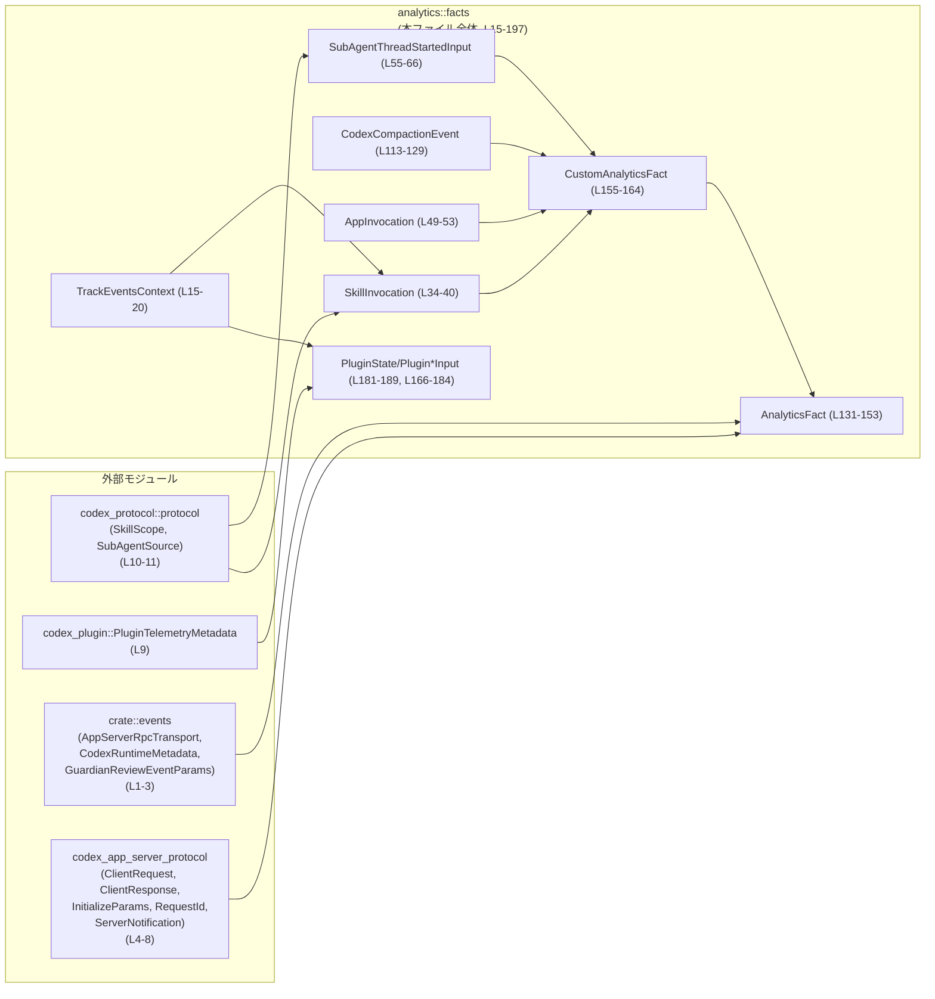
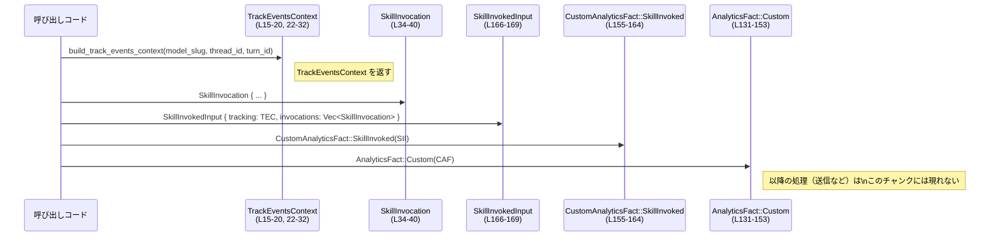
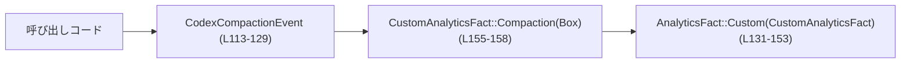

# analytics/src/facts.rs

## 0. ざっくり一言

Codex のアプリサーバ周辺で発生する各種イベント（リクエスト/レスポンス、サブエージェント開始、コンパクション、プラグイン利用など）を **構造化された「ファクト（事実）」として表現するためのデータ型群** を定義するモジュールです（`analytics/src/facts.rs:L15-197`）。

---

## 1. このモジュールの役割

### 1.1 概要

- このモジュールは、アプリサーバのプロトコルや内部状態に関する出来事を、**分析・テレメトリ向けのイベント型（AnalyticsFact）** としてまとめるために存在します（`AnalyticsFact` 定義, `analytics/src/facts.rs:L131-153`）。
- 個々のイベントごとに専用の入力構造体（例: `SubAgentThreadStartedInput`, `CodexCompactionEvent`）を用意し、`AnalyticsFact` → `CustomAnalyticsFact` → 各入力型という階層でデータを組み立てる構造になっています（`analytics/src/facts.rs:L155-189`）。
- 直列化（シリアライズ）を意識した enum/struct 定義があり、特にコンパクション関連とスキル/アプリ/プラグインのテレメトリ情報を詳細に保持します（`analytics/src/facts.rs:L68-111`, `L113-129`, `L166-189`）。

### 1.2 アーキテクチャ内での位置づけ

このモジュールは、アプリケーションサーバプロトコル、プラグインメタデータ、サブエージェント情報を束ねて **分析レイヤに渡す手前の「イベント表現層」** に位置していると解釈できます（型とコメントが根拠です）。

依存関係の概要は次の通りです。



（ラベル内の `Lxx-yy` は `analytics/src/facts.rs` の行番号です）

### 1.3 設計上のポイント

- **イベントの集約 enum**  
  - すべての分析イベントを `AnalyticsFact`（プロトコル由来 + Custom）と `CustomAnalyticsFact`（アプリ固有の拡張）でまとめています（`analytics/src/facts.rs:L131-164`）。
- **共通コンテキストの再利用**  
  - `TrackEventsContext` を複数の入力構造体で共有し、モデルやスレッド/ターン ID を一貫して渡せるようにしています（`analytics/src/facts.rs:L15-20`, `L166-183`）。
- **シリアライズ前提の enum**  
  - コンパクション関連の enum や `InvocationType` には `Serialize` と `#[serde(rename_all = "...")]` が付与され、JSON などに出力するときの文字列表現が明確に固定されています（`analytics/src/facts.rs:L42-47`, `L68-111`）。
- **状態遷移の表現**  
  - `PluginState` や `CompactionStatus` など状態を enum で表現し、状態名はコード上で限定された値に管理されています（`analytics/src/facts.rs:L105-111`, `L191-196`）。
- **エラーハンドリング / 安全性**  
  - このファイルには関数ロジックはほぼなく、`Result` や `panic!` を使ったエラーハンドリングは登場しません。
  - すべて所有型（`String`, `PathBuf`, `Box<T>` など）で構成されたデータコンテナであり、`unsafe` ブロックもありません（`analytics/src/facts.rs:L1-197`）。

---

## 2. 主要な機能一覧

このモジュールが提供する主な機能は、すべてデータ構造の形で表れています。

- `TrackEventsContext`: モデルとスレッド/ターンをまたいで共有する共通トラッキングコンテキスト（`analytics/src/facts.rs:L15-20`）。
- `build_track_events_context`: 上記コンテキストを組み立てるヘルパー関数（`analytics/src/facts.rs:L22-32`）。
- `AnalyticsFact`: アプリサーバプロトコル上のイベント＋カスタム分析イベントの総称 enum（`analytics/src/facts.rs:L131-153`）。
- `CustomAnalyticsFact`: サブエージェント開始、コンパクション、ガーディアンレビュー、スキル/アプリ/プラグイン利用などのカスタム分析イベントを表現する enum（`analytics/src/facts.rs:L155-164`）。
- `SkillInvocation` と `InvocationType`: スキル呼び出しの詳細と、明示/暗黙の区別（`analytics/src/facts.rs:L34-47`）。
- `AppInvocation`: コネクタ ID やアプリ名など、アプリ呼び出しの情報（`analytics/src/facts.rs:L49-53`）。
- `SubAgentThreadStartedInput`: サブエージェントスレッドの開始イベント情報（`analytics/src/facts.rs:L55-66`）。
- `CodexCompactionEvent` と各種 Compaction enum 群: コンテキストコンパクション処理のトリガー・理由・戦略・状態など（`analytics/src/facts.rs:L68-111`, `L113-129`）。
- `PluginUsedInput`, `PluginStateChangedInput`, `PluginState`: プラグインの利用・状態変化の分析イベント（`analytics/src/facts.rs:L181-189`, `L191-196`）。
- `SkillInvokedInput`, `AppMentionedInput`, `AppUsedInput`: スキル/アプリに関連するイベントの入力構造体（`analytics/src/facts.rs:L166-179`）。

---

## 3. 公開 API と詳細解説

### 3.1 型一覧（構造体・列挙体など）

**構造体・enum のインベントリー（このチャンク全体）**

| 名前 | 種別 | 公開範囲 | 概要 / 用途 | 根拠 |
|------|------|----------|-------------|------|
| `TrackEventsContext` | 構造体 | `pub` | モデルスラグ・スレッド ID・ターン ID をまとめた共通トラッキング情報 | `analytics/src/facts.rs:L15-20` |
| `SkillInvocation` | 構造体 | `pub` | スキル名・スコープ・パス・明示/暗黙の別を含むスキル呼び出し情報 | `analytics/src/facts.rs:L34-40` |
| `InvocationType` | 列挙体 | `pub` | スキルやアプリの呼び出しが明示的 (`Explicit`) か暗黙的 (`Implicit`) かを区別 | `analytics/src/facts.rs:L42-47` |
| `AppInvocation` | 構造体 | `pub` | コネクタ ID・アプリ名・呼び出し種別（任意）を持つアプリ利用情報 | `analytics/src/facts.rs:L49-53` |
| `SubAgentThreadStartedInput` | 構造体 | `pub` | サブエージェントのスレッド開始イベントの詳細（クライアント情報・モデル・起動元など） | `analytics/src/facts.rs:L55-66` |
| `CompactionTrigger` | 列挙体 | `pub` | コンパクションのトリガー（手動か自動か） | `analytics/src/facts.rs:L68-73` |
| `CompactionReason` | 列挙体 | `pub` | コンパクションを行う理由（ユーザ要求・コンテキスト制限・モデルダウンシフト） | `analytics/src/facts.rs:L75-81` |
| `CompactionImplementation` | 列挙体 | `pub` | コンパクション実装種別（`Responses` / `ResponsesCompact`） | `analytics/src/facts.rs:L83-88` |
| `CompactionPhase` | 列挙体 | `pub` | コンパクションを実行したフェーズ（スタンドアロンターン/ターン前/ターン中） | `analytics/src/facts.rs:L90-96` |
| `CompactionStrategy` | 列挙体 | `pub` | コンパクション戦略（`Memento`, `PrefixCompaction`） | `analytics/src/facts.rs:L98-103` |
| `CompactionStatus` | 列挙体 | `pub` | コンパクションの結果状態（完了/失敗/中断） | `analytics/src/facts.rs:L105-111` |
| `CodexCompactionEvent` | 構造体 | `pub` | 上記コンパクション関連情報とトークン数・タイムスタンプをまとめたイベント | `analytics/src/facts.rs:L113-129` |
| `AnalyticsFact` | 列挙体 | `pub(crate)` | プロトコルイベント（Initialize/Request/Response/Notification）とカスタム分析イベントの総称 | `analytics/src/facts.rs:L131-153` |
| `CustomAnalyticsFact` | 列挙体 | `pub(crate)` | サブエージェント開始、コンパクション、ガーディアンレビュー、スキル/アプリ/プラグイン関連のイベント | `analytics/src/facts.rs:L155-164` |
| `SkillInvokedInput` | 構造体 | `pub(crate)` | スキル呼び出しイベントの入力情報（トラッキング + スキル呼び出しのリスト） | `analytics/src/facts.rs:L166-169` |
| `AppMentionedInput` | 構造体 | `pub(crate)` | ユーザメッセージなどでアプリが言及されたときの入力情報 | `analytics/src/facts.rs:L171-174` |
| `AppUsedInput` | 構造体 | `pub(crate)` | 実際にアプリを使用したときの入力情報（トラッキング + 単一アプリ呼び出し） | `analytics/src/facts.rs:L176-179` |
| `PluginUsedInput` | 構造体 | `pub(crate)` | プラグインが利用されたときの入力情報（トラッキング + プラグインメタデータ） | `analytics/src/facts.rs:L181-183` |
| `PluginStateChangedInput` | 構造体 | `pub(crate)` | プラグインの状態変化イベント（メタデータ + 新しい状態） | `analytics/src/facts.rs:L186-188` |
| `PluginState` | 列挙体 | `pub(crate)` | プラグインの状態（インストール済/アンインストール/有効/無効） | `analytics/src/facts.rs:L191-196` |

### 3.2 関数詳細

このファイルに登場する関数は `build_track_events_context` の 1 つだけです（`analytics/src/facts.rs:L22-32`）。

#### `build_track_events_context(model_slug: String, thread_id: String, turn_id: String) -> TrackEventsContext`

**概要**

- モデルスラグ・スレッド ID・ターン ID の 3 つの `String` を受け取り、`TrackEventsContext` 構造体にまとめて返す単純なコンストラクタヘルパーです（`analytics/src/facts.rs:L22-32`）。

**引数**

| 引数名 | 型 | 説明 | 根拠 |
|--------|----|------|------|
| `model_slug` | `String` | 利用中のモデルを識別するスラグ（文字列）。所有権は関数に移動する | `analytics/src/facts.rs:L22-24` |
| `thread_id` | `String` | 会話スレッドを一意に識別する ID 文字列 | `analytics/src/facts.rs:L22-25` |
| `turn_id` | `String` | スレッド内のターン（1 回のユーザ発話＋応答など）を識別する ID 文字列 | `analytics/src/facts.rs:L22-26` |

**戻り値**

- `TrackEventsContext`  
  - 引数で受け取った 3 つの文字列をそれぞれフィールド `model_slug`, `thread_id`, `turn_id` に格納した構造体を返します（`analytics/src/facts.rs:L27-31`）。

**内部処理の流れ（アルゴリズム）**

1. `TrackEventsContext` リテラルを構築し、フィールドに対応する引数をそのまま移動代入する（`analytics/src/facts.rs:L27-31`）。
2. 構築した `TrackEventsContext` を呼び出し元へ返す。

条件分岐やループはなく、単純なフィールド初期化だけです。

**Examples（使用例）**

この関数の使用例を示します（このファイル内には使用例はありませんが、型定義から構築したサンプルです）。

```rust
use analytics::facts::{build_track_events_context, TrackEventsContext};

fn main() {
    // それぞれの ID を所有権ごと渡す
    let ctx: TrackEventsContext = build_track_events_context(
        "gpt-4.1-mini".to_string(), // モデルスラグ
        "thread-123".to_string(),   // スレッド ID
        "turn-1".to_string(),       // ターン ID
    );

    // 以降、ctx をスキル/アプリ/プラグインの分析イベント入力に埋め込んで利用できる
    println!("model: {}, thread: {}, turn: {}",
        ctx.model_slug, ctx.thread_id, ctx.turn_id);
}
```

**Errors / Panics**

- この関数内にはエラーを返したり `panic!` を呼び出したりするコードはありません（`analytics/src/facts.rs:L22-32`）。
- `String` の移動と構造体初期化のみで、メモリ確保や I/O も行いません。

**Edge cases（エッジケース）**

- 引数に空文字列や非常に長い文字列が渡された場合でも、そのまま `TrackEventsContext` に格納されます。バリデーションは行いません（`analytics/src/facts.rs:L27-31`）。
- `model_slug`, `thread_id`, `turn_id` のいずれかが特定の形式であること（UUID 形式など）は、型レベルでは表現されていません。

**使用上の注意点**

- ID としての妥当性チェック（未設定でないか、形式は正しいか等）は呼び出し側で行う必要があります。この関数は検証せずにラップするだけです。
- 引数は所有権を移動するため、呼び出し元ではこれらの `String` を以後利用できません。必要に応じて事前にクローンするか、最初からこの関数のために文字列を生成する設計にする必要があります。

### 3.3 その他の関数

- このファイルには上記以外の関数は定義されていません（`analytics/src/facts.rs:L1-197`）。

---

## 4. データフロー

### 4.1 代表的なデータの流れ

このファイルにはロジックを持つ関数はほとんどありませんが、**イベントデータがどのような型の入れ子になっていくか** という観点でデータフローを整理できます。

例として「スキルが呼び出された」ケースのデータの流れを示します。

1. 呼び出し元で `TrackEventsContext` を作成し（`build_track_events_context`、`analytics/src/facts.rs:L22-32`）、現在のモデル/スレッド/ターン情報を保持する。
2. スキルごとに `SkillInvocation` を構築する（`analytics/src/facts.rs:L34-40`）。
3. それらを `SkillInvokedInput` に詰める（`analytics/src/facts.rs:L166-169`）。
4. `CustomAnalyticsFact::SkillInvoked(SkillInvokedInput)` としてカスタムイベント enum に包む（`analytics/src/facts.rs:L155-160`）。
5. 最後に `AnalyticsFact::Custom(CustomAnalyticsFact)` として全体の分析イベントにまとめる（`analytics/src/facts.rs:L131-153`）。
6. この `AnalyticsFact` が、どこか別モジュールのキューや送信処理に渡されると推測できますが、このチャンク内にはそのコードは存在しません（不明）。

これをシーケンス図的に表すと、次のようになります。



同様に、コンパクションイベントの場合は次のように組み立てられます。



---

## 5. 使い方（How to Use）

### 5.1 基本的な使用方法

典型的な利用パターンは「アプリケーションコード側で必要なフィールドを埋めて `AnalyticsFact` を構築し、分析/ロギングのためのキューや送信関数に渡す」という流れになります。このファイルには送信処理はないため、イベントオブジェクトの生成までを例示します。

```rust
use analytics::facts::{
    build_track_events_context,
    AnalyticsFact,
    CustomAnalyticsFact,
    SkillInvocation,
    InvocationType,
    TrackEventsContext,
};
use codex_protocol::protocol::SkillScope;

// 設定や依存オブジェクトを用意する
let tracking: TrackEventsContext = build_track_events_context(
    "gpt-4.1-mini".to_string(),
    "thread-123".to_string(),
    "turn-1".to_string(),
);

// スキル呼び出し情報を構築する
let skill_invocation = SkillInvocation {
    skill_name: "calendar.create_event".to_string(),
    skill_scope: SkillScope::User, // 実際の enum は codex_protocol 側で定義
    skill_path: std::path::PathBuf::from("/skills/calendar/create_event"),
    invocation_type: InvocationType::Explicit,
};

// CustomAnalyticsFact を構築する
let skill_input = crate::analytics::facts::SkillInvokedInput {
    tracking,
    invocations: vec![skill_invocation],
};

let custom_fact = CustomAnalyticsFact::SkillInvoked(skill_input);

// 最終的な AnalyticsFact に包む
let analytics_fact = AnalyticsFact::Custom(custom_fact);

// ここで analytics_fact を、別モジュールの送信ロジックに渡す想定
// send_analytics(analytics_fact); // このチャンクには定義されていない（不明）
```

（`SkillInvokedInput` や `AnalyticsFact` のコンストラクション API はこのファイルにだけ定義されているため、そのままフィールド初期化で利用します。`analytics/src/facts.rs:L131-153`, `L155-169`）

### 5.2 よくある使用パターン

1. **サブエージェントスレッド開始イベント**

```rust
use analytics::facts::{
    AnalyticsFact,
    CustomAnalyticsFact,
    SubAgentThreadStartedInput,
};
use codex_protocol::protocol::SubAgentSource;

let input = SubAgentThreadStartedInput {
    thread_id: "sub-thread-1".to_string(),
    parent_thread_id: Some("parent-thread-1".to_string()),
    product_client_id: "client-xyz".to_string(),
    client_name: "my-app".to_string(),
    client_version: "1.0.0".to_string(),
    model: "gpt-4.1-mini".to_string(),
    ephemeral: false,
    subagent_source: SubAgentSource::SomeVariant, // 実際の variant 名は不明
    created_at: 1_725_000_000, // タイムスタンプの単位はこのチャンクからは不明
};

let fact = AnalyticsFact::Custom(
    CustomAnalyticsFact::SubAgentThreadStarted(input)
);
```

1. **コンパクションイベント**

```rust
use analytics::facts::{
    AnalyticsFact,
    CustomAnalyticsFact,
    CodexCompactionEvent,
    CompactionTrigger,
    CompactionReason,
    CompactionImplementation,
    CompactionPhase,
    CompactionStrategy,
    CompactionStatus,
};

let compaction = CodexCompactionEvent {
    thread_id: "thread-123".to_string(),
    turn_id: "turn-5".to_string(),
    trigger: CompactionTrigger::Auto,
    reason: CompactionReason::ContextLimit,
    implementation: CompactionImplementation::ResponsesCompact,
    phase: CompactionPhase::MidTurn,
    strategy: CompactionStrategy::Memento,
    status: CompactionStatus::Completed,
    error: None,
    active_context_tokens_before: 8000,
    active_context_tokens_after: 4000,
    started_at: 1_725_000_000,
    completed_at: 1_725_000_100,
    duration_ms: Some(100),
};

let fact = AnalyticsFact::Custom(
    CustomAnalyticsFact::Compaction(Box::new(compaction))
);
```

### 5.3 よくある間違い

コードから直接は読み取れませんが、型定義から想定される誤用例と正しい例を対比します。

```rust
use analytics::facts::{
    TrackEventsContext,
    SkillInvokedInput,
    SkillInvocation,
    InvocationType,
};
use codex_protocol::protocol::SkillScope;

// 誤り例: 追跡コンテキストを適当に空文字で埋めてしまう
let tracking = TrackEventsContext {
    model_slug: "".to_string(),
    thread_id: "".to_string(),
    turn_id: "".to_string(),
};

// 追跡情報が分析側で意味をなさない可能性が高い

// 正しい例: 実際のモデル/スレッド/ターン情報を渡す
let tracking = build_track_events_context(
    "gpt-4.1-mini".to_string(),
    "thread-123".to_string(),
    "turn-1".to_string(),
);
```

```rust
// 誤り例: Option フィールドを使わずに None 固定にしてしまう
use analytics::facts::AppInvocation;

let app = AppInvocation {
    connector_id: None,
    app_name: None,
    invocation_type: None,
};
// これではどのアプリが使われたか分析できない

// 正しい例: 実際の利用情報を埋める
let app = AppInvocation {
    connector_id: Some("slack".to_string()),
    app_name: Some("Slack".to_string()),
    invocation_type: Some(InvocationType::Explicit),
};
```

これらの前提は型から推測される意図であり、このチャンク内にバリデーションロジックは存在しないことに注意が必要です（`analytics/src/facts.rs:L49-53`, `L15-20`）。

### 5.4 使用上の注意点（まとめ）

- **前提条件**  
  - ID や名前などの文字列フィールドは、型レベルでは空や無効値を禁止していません。意味のある値を入れるかどうかは呼び出し側の責任です（`analytics/src/facts.rs:L15-20`, `L55-66`, `L113-129`）。
- **禁止事項**  
  - 本ファイルだけでは禁止事項は定義されていませんが、`Option` フィールドを常に `None` にするなど、分析上意味のないデータを詰めるとテレメトリの品質が下がる可能性があります。
- **エラー・パニック条件**  
  - このファイル内の構造体初期化は、通常の範囲の値であればパニックしません。`i64` や `u64` がオーバーフローするような演算はここでは行っていません（`analytics/src/facts.rs:L113-129`）。
- **並行性**  
  - 型定義のみであり、スレッド間共有や同期はこのファイルでは扱っていません。`Clone` が付いている型（例: `TrackEventsContext`, `SubAgentThreadStartedInput`, コンパクション系 enum など）はスレッド間でコピーしやすい設計ですが、`Send`/`Sync` かどうかはここからは断定できません（派生 trait の一覧に記載されていません, `analytics/src/facts.rs:L15-20`, `L55-66`, `L68-111`）。
- **シリアライズ**  
  - `InvocationType` とコンパクション関連の enum は `Serialize` + `rename_all` を持ちますが、`CodexCompactionEvent` そのものには `Serialize` が付いていません（`analytics/src/facts.rs:L42-47`, `L68-111`, `L113-129`）。分析パイプラインが serde に依存する場合、別途 `Serialize` 実装がどこかに必要です。このチャンク内にはそれは現れません。

---

## 6. 変更の仕方（How to Modify）

### 6.1 新しい機能を追加する場合

**新しいカスタム分析イベントを追加する** 場合の自然な変更手順を、コードから読み取れる範囲で整理します。

1. **入力データ構造体の追加**  
   - 本ファイルの末尾付近にある Input 構造体（`SkillInvokedInput`, `AppMentionedInput` など）に倣い、新しいイベントの入力型を `pub(crate) struct` として追加します（`analytics/src/facts.rs:L166-189` を参考）。
2. **`CustomAnalyticsFact` へのバリアント追加**  
   - `CustomAnalyticsFact` enum に新しいバリアントを追加し、そのペイロードとして 1. の構造体（または `Box<...>` で包んだ型）を指定します（`analytics/src/facts.rs:L155-164`）。
3. **`AnalyticsFact` の構造**  
   - カスタムイベントは `AnalyticsFact::Custom(CustomAnalyticsFact)` の形で包む設計になっているため、`AnalyticsFact` enum に新しいバリアントを追加する必要は通常ありません（`analytics/src/facts.rs:L131-153`）。
4. **シリアライズを考慮する場合**  
   - JSON 等へのシリアライズが必要であれば、既存の enum のように `#[derive(Serialize)]` や `#[serde(rename_all = "...")]` を付ける必要があります。このファイルにはその実装例が複数あります（`analytics/src/facts.rs:L42-47`, `L68-111`）。

### 6.2 既存の機能を変更する場合

- **影響範囲の確認**  
  - どのイベント型がどこから利用されているかは、このモジュール単独では分かりません。他ファイルの `use analytics::facts::...` などを検索して影響範囲を特定する必要があります（このチャンクには使用箇所は現れません）。
- **契約の維持**  
  - `Serialize` の `rename_all` 設定を変更すると、下流の分析システムが期待するフィールド値や文字列との互換性が壊れる可能性があります（`analytics/src/facts.rs:L42-47`, `L68-111`）。
  - enum のバリアント名や struct のフィールド名を変更すると、シリアライズ形式やマッチングロジックが破壊されるため、既存利用コードをすべて確認する必要があります。
- **数値フィールドの意味**  
  - `CodexCompactionEvent` の `active_context_tokens_before/after` は `i64` であり、負値を許すかどうかはこのチャンクからは分かりません（`analytics/src/facts.rs:L124-125`）。もし「常に非負である」ことを前提にするなら、その前提をコメントや型（`u64` など）で明示する変更も検討できます。

---

## 7. 関連ファイル

このモジュールと密接に関係する外部モジュール/型は `use` 文から読み取れます。

| パス / モジュール | 役割 / 関係 | 根拠 |
|-------------------|------------|------|
| `crate::events::AppServerRpcTransport` | `AnalyticsFact::Initialize` の一部として RPC トランスポート情報を保持するために利用される型 | `analytics/src/facts.rs:L1`, `L133-139` |
| `crate::events::CodexRuntimeMetadata` | 初期化イベントの実行時メタデータとして `Initialize` バリアントに含められる | `analytics/src/facts.rs:L2`, `L133-139` |
| `crate::events::GuardianReviewEventParams` | カスタム分析イベント `GuardianReview` のペイロード | `analytics/src/facts.rs:L3`, `L155-159` |
| `codex_app_server_protocol`（`ClientRequest`, `ClientResponse`, `InitializeParams`, `RequestId`, `ServerNotification`） | アプリサーバプロトコル上のリクエスト/レスポンス/通知/初期化パラメータの型。`AnalyticsFact` の各バリアントで利用 | `analytics/src/facts.rs:L4-8`, `L133-149` |
| `codex_plugin::PluginTelemetryMetadata` | プラグインに関するテレメトリメタデータ。プラグイン利用/状態変化イベント入力の構造体で利用 | `analytics/src/facts.rs:L9`, `L181-188` |
| `codex_protocol::protocol::SkillScope` | スキルのスコープ（例: ユーザスコープ/システムスコープなど）を表す型。`SkillInvocation` で利用 | `analytics/src/facts.rs:L10`, `L34-40` |
| `codex_protocol::protocol::SubAgentSource` | サブエージェントスレッドの起動元を表す型。`SubAgentThreadStartedInput` で利用 | `analytics/src/facts.rs:L11`, `L55-66` |

これらの外部型の具体的な中身や振る舞いは、**このチャンクには現れない** ため不明です。
