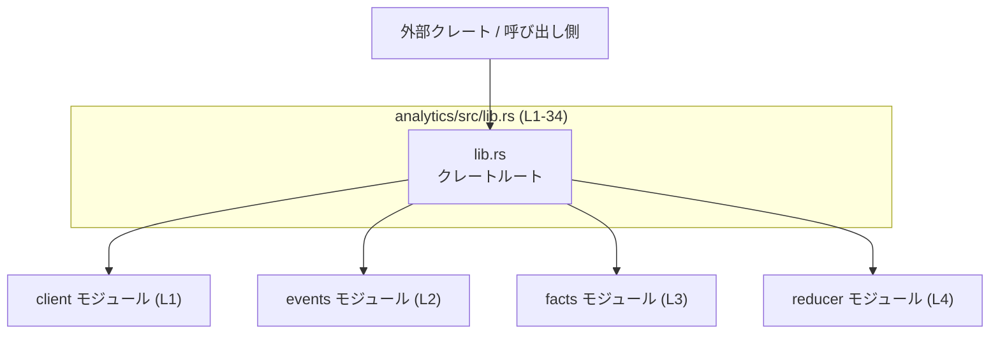
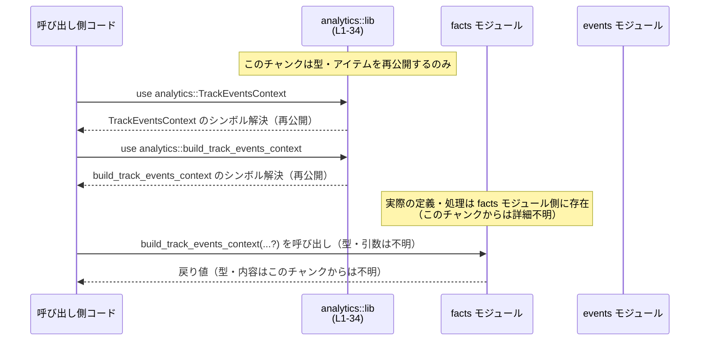

# analytics/src/lib.rs コード解説

## 0. ざっくり一言

`analytics` クレートのルート（エントリポイント）であり、内部モジュール `client` / `events` / `facts` / `reducer` に定義された各種型・アイテムを外部向けに再公開するハブとなっているファイルです（`analytics/src/lib.rs:L1-31`）。

---

## 1. このモジュールの役割

### 1.1 概要

- このモジュールは **内部実装モジュールをまとめて外部に見せるための公開インターフェース** を提供します。
- 実際のロジック（イベント送信、事象の表現、Reducer 処理など）は `client`, `events`, `facts`, `reducer` 各モジュール側にあり、このファイルは **モジュール宣言と `pub use` による再公開** のみを行います（`analytics/src/lib.rs:L1-4, L6-31`）。
- テスト用モジュール `analytics_client_tests` も `#[cfg(test)]` で条件付きコンパイルされており、クライアント周りのテストが存在することが分かります（`analytics/src/lib.rs:L33-34`）。

### 1.2 アーキテクチャ内での位置づけ

このファイルはクレートのルートとして、外部コードと内部モジュール群の間に位置します。依存関係を簡略化した図は次のとおりです。



- 外部コードは基本的に `analytics` クレートのルートから型・アイテムをインポートします。
- 内部モジュールは `mod client;` のように非公開で宣言されており（`analytics/src/lib.rs:L1-4`）、外部コードからは **直接 `analytics::client::...` のようには参照できません**。  
  公開が必要なものだけが `pub use` でルートに再公開されています（`analytics/src/lib.rs:L6-31`）。

### 1.3 設計上のポイント

コードから読み取れる特徴は次のとおりです。

- **責務の分割**
  - 実装は `client`, `events`, `facts`, `reducer` の 4 モジュールに分割されており、lib.rs はそれらの集約と公開のみを担当しています（`analytics/src/lib.rs:L1-4`）。
- **再公開によるフラットな API**
  - 多数の型・アイテムを `pub use` で再公開し、利用側からは `analytics::TypeName` のようにフラットにアクセスできるようになっています（`analytics/src/lib.rs:L6-31`）。
- **テストの分離**
  - `#[cfg(test)] mod analytics_client_tests;` により、テストコードは通常ビルドには含まれず、テスト時のみコンパイルされます（`analytics/src/lib.rs:L33-34`）。
- **安全性・エラー・並行性に関する情報**
  - このファイルには **関数本体や実行時ロジックが一切含まれていない** ため、エラーハンドリングや並行処理、`unsafe` ブロックなどに関する情報はこのチャンクからは分かりません。
  - 少なくとも lib.rs 内に `unsafe` やスレッド／async 関連の記述は存在しません（`analytics/src/lib.rs` 全体）。

---

## 2. 主要な機能一覧

このファイル自体はロジックを持ちませんが、外部から見える「機能」は、他モジュールのアイテムをどのように公開しているか、という形で表れます。

- `AnalyticsEventsClient` の再公開（`client` モジュール由来）  
  - 実際の役割は `client` モジュール側に定義されており、このチャンクからは詳細不明です（`analytics/src/lib.rs:L6`）。
- `AppServerRpcTransport` および複数の `Guardian*` 系アイテムの再公開（`events` モジュール由来）  
  - 各種イベントやレビュー関連の概念を表す型（またはその他のアイテム）と考えられますが、具体的な中身はこのチャンクには現れません（`analytics/src/lib.rs:L7-18`）。
- `AppInvocation`, `CodexCompactionEvent`, `Compaction*`, `InvocationType`, `SkillInvocation`, `SubAgentThreadStartedInput` などの再公開（`facts` モジュール由来）  
  - 分析対象となる「事実（facts）」を記録するための型群と推測されますが、実装は見えません（`analytics/src/lib.rs:L19-29`）。
- `TrackEventsContext` と `build_track_events_context` の再公開（`facts` モジュール由来）  
  - 名称から、イベントトラッキングのコンテキストと、その生成ヘルパーである可能性が高いですが、シグネチャや処理の詳細はこのチャンクからは分かりません（`analytics/src/lib.rs:L30-31`）。

> 上記のうち、**具体的なフィールド構成・メソッド・エラーハンドリング・スレッド安全性などの詳細は、すべて `client`, `events`, `facts`, `reducer` 各モジュール側のコードを参照しないと分かりません。**

---

## 3. 公開 API と詳細解説

### 3.1 コンポーネント一覧（コンポーネントインベントリー）

#### モジュール一覧

| 名前 | 種別 | 公開状態 | 説明（このチャンクから分かること） | 根拠 |
|------|------|----------|--------------------------------------|------|
| `client` | モジュール | クレート外には非公開 | `mod client;` により内部モジュールとして宣言されている。`AnalyticsEventsClient` などを定義していると分かるが詳細は不明。 | `analytics/src/lib.rs:L1, L6` |
| `events` | モジュール | クレート外には非公開 | `mod events;`。`AppServerRpcTransport` や複数の `Guardian*` アイテムを定義していることが分かる。 | `analytics/src/lib.rs:L2, L7-18` |
| `facts` | モジュール | クレート外には非公開 | `mod facts;`。`AppInvocation`, `CodexCompactionEvent` など多くのアイテムを定義している。 | `analytics/src/lib.rs:L3, L19-31` |
| `reducer` | モジュール | クレート外には非公開 | `mod reducer;`。このチャンクでは再公開されるアイテムはなく、内部実装のみと推測される。 | `analytics/src/lib.rs:L4` |
| `analytics_client_tests` | モジュール | テスト時のみ有効 | `#[cfg(test)] mod analytics_client_tests;` によりテスト用モジュールとして宣言。通常ビルドではコンパイルされない。 | `analytics/src/lib.rs:L33-34` |

#### 再公開されているアイテム一覧（型・その他）

この表では、どのアイテムがどのモジュールから再公開されているかのみを整理します。**種別（構造体・列挙体・関数など）は、このチャンクからは判別できません。**

| 名前 | 種別（このチャンクから判別可能な範囲） | 定義モジュール | 公開形態 | 説明（このチャンクから分かること） | 根拠 |
|------|----------------------------------------|----------------|----------|--------------------------------------|------|
| `AnalyticsEventsClient` | アイテム（種別不明） | `client` | `pub use client::AnalyticsEventsClient;` | クライアント関連の公開アイテム。利用側は `analytics::AnalyticsEventsClient` で参照可能。 | `analytics/src/lib.rs:L6` |
| `AppServerRpcTransport` | アイテム（種別不明） | `events` | 再公開 | App サーバ RPC トランスポートに関するアイテム。 | `analytics/src/lib.rs:L7` |
| `GuardianApprovalRequestSource` | アイテム（種別不明） | `events` | 再公開 | Guardian の approval request の「source」に対応するアイテム。 | `analytics/src/lib.rs:L8` |
| `GuardianCommandSource` | アイテム（種別不明） | `events` | 再公開 | Guardian のコマンドの「source」に対応するアイテム。 | `analytics/src/lib.rs:L9` |
| `GuardianReviewDecision` | アイテム（種別不明） | `events` | 再公開 | Guardian のレビュー決定を表すアイテム。 | `analytics/src/lib.rs:L10` |
| `GuardianReviewEventParams` | アイテム（種別不明） | `events` | 再公開 | レビューイベントのパラメータを表すアイテム。 | `analytics/src/lib.rs:L11` |
| `GuardianReviewFailureReason` | アイテム（種別不明） | `events` | 再公開 | レビュー失敗理由に関連するアイテム。 | `analytics/src/lib.rs:L12` |
| `GuardianReviewOutcome` | アイテム（種別不明） | `events` | 再公開 | レビュー結果（アウトカム）に関連するアイテム。 | `analytics/src/lib.rs:L13` |
| `GuardianReviewRiskLevel` | アイテム（種別不明） | `events` | 再公開 | リスクレベルに関連するアイテム。 | `analytics/src/lib.rs:L14` |
| `GuardianReviewSessionKind` | アイテム（種別不明） | `events` | 再公開 | セッション種別に関連するアイテム。 | `analytics/src/lib.rs:L15` |
| `GuardianReviewTerminalStatus` | アイテム（種別不明） | `events` | 再公開 | 終了ステータスに関連するアイテム。 | `analytics/src/lib.rs:L16` |
| `GuardianReviewUserAuthorization` | アイテム（種別不明） | `events` | 再公開 | ユーザー認可に関連するアイテム。 | `analytics/src/lib.rs:L17` |
| `GuardianReviewedAction` | アイテム（種別不明） | `events` | 再公開 | レビュー対象のアクションを表すアイテム。 | `analytics/src/lib.rs:L18` |
| `AppInvocation` | アイテム（種別不明） | `facts` | 再公開 | アプリ呼び出しに関する fact。 | `analytics/src/lib.rs:L19` |
| `CodexCompactionEvent` | アイテム（種別不明） | `facts` | 再公開 | compaction に関連するイベント fact。 | `analytics/src/lib.rs:L20` |
| `CompactionImplementation` | アイテム（種別不明） | `facts` | 再公開 | compaction の実装方式に関するアイテム。 | `analytics/src/lib.rs:L21` |
| `CompactionPhase` | アイテム（種別不明） | `facts` | 再公開 | compaction のフェーズに関するアイテム。 | `analytics/src/lib.rs:L22` |
| `CompactionReason` | アイテム（種別不明） | `facts` | 再公開 | compaction 実施理由に関するアイテム。 | `analytics/src/lib.rs:L23` |
| `CompactionStatus` | アイテム（種別不明） | `facts` | 再公開 | compaction の状態に関するアイテム。 | `analytics/src/lib.rs:L24` |
| `CompactionStrategy` | アイテム（種別不明） | `facts` | 再公開 | compaction 戦略に関連するアイテム。 | `analytics/src/lib.rs:L25` |
| `CompactionTrigger` | アイテム（種別不明） | `facts` | 再公開 | compaction を引き起こすトリガーに関連するアイテム。 | `analytics/src/lib.rs:L26` |
| `InvocationType` | アイテム（種別不明） | `facts` | 再公開 | 呼び出し種別に関するアイテム。 | `analytics/src/lib.rs:L27` |
| `SkillInvocation` | アイテム（種別不明） | `facts` | 再公開 | スキル呼び出しに関する fact。 | `analytics/src/lib.rs:L28` |
| `SubAgentThreadStartedInput` | アイテム（種別不明） | `facts` | 再公開 | サブエージェントスレッド開始時の入力を表すアイテム。 | `analytics/src/lib.rs:L29` |
| `TrackEventsContext` | アイテム（種別不明） | `facts` | 再公開 | イベントトラッキングのコンテキストに関するアイテムと考えられるが、詳細不明。 | `analytics/src/lib.rs:L30` |
| `build_track_events_context` | アイテム（種別不明） | `facts` | 再公開 | `build_` という名前から何らかの生成処理であると推測されるが、関数かどうかも含め種別はこのチャンクからは断定できない。 | `analytics/src/lib.rs:L31` |

> 種別が「アイテム（種別不明）」となっているものについては、**構造体／列挙体／関数／定数などかどうかは、このチャンクだけでは識別できません**。詳細は各モジュールの定義を確認する必要があります。

### 3.2 関数詳細（このチャンクに関数シグネチャは現れない）

- `analytics/src/lib.rs` には **関数定義が存在せず**、また `pub use` によって再公開されているアイテムについても、このチャンクだけではそれが関数なのかどうか判別できません（`analytics/src/lib.rs` 全体）。
- そのため、テンプレート形式で詳細を説明できる「関数」は **このファイル単体からは特定できません**。

### 3.3 その他の関数

- 上記のとおり、このファイルには関数定義が無いため、「補助的な関数」「単純なラッパー関数」も存在しません。
- 実際の関数ロジック（エラーハンドリング、並行処理、安全性に関する配慮など）は、`client`, `events`, `facts`, `reducer` 各モジュールで実装されていると考えられますが、このチャンクには現れません。

---

## 4. データフロー

このファイルには実行時処理がないため、**データフローは「型やアイテムの公開経路」に限られます**。代表的な利用シナリオとして、「外部コードが `pub use` 再公開を通じてアイテムを参照する流れ」を示します。



ポイント:

- データそのものが流れる場面は、このファイルからは確認できません。
- ただし、**シンボル解決（コンパイル時の名前解決）** という意味で、呼び出し側 → `lib.rs` → 各モジュール、という流れが存在します。
- ランタイムのエラー処理や並行処理の流れは、このチャンクには現れません。

---

## 5. 使い方（How to Use）

### 5.1 基本的な使用方法

`analytics` クレートを利用する側のコードからは、再公開されたアイテムをクレートルートから直接インポートできます。

```rust
// analytics クレートの公開アイテムをインポートする例
use analytics::{
    AnalyticsEventsClient,   // client モジュール由来（詳細は client 側）
    TrackEventsContext,      // facts モジュール由来（詳細は facts 側）
    // 他にも必要に応じて Guardian* や Compaction* などを列挙
};

fn main() {
    // ここで AnalyticsEventsClient や TrackEventsContext の具体的な使い方は、
    // client / facts モジュールの定義内容に依存するため、
    // この lib.rs チャンクからは分かりません。
}
```

- **ポイント**: 外部からは `analytics::client::AnalyticsEventsClient` のように内部モジュールを直接参照するのではなく、**`analytics::AnalyticsEventsClient` のようにルートから参照**します（`mod client;` は非公開なので、`analytics::client` は外部からは見えません）。

### 5.2 よくある使用パターン（このチャンクから分かる範囲）

このファイルから分かるのは **「ルートからインポートする」というパターンだけ**です。

- Guardian 関連のイベント／レビュー情報を扱う場合:  
  `use analytics::{ GuardianReviewOutcome, GuardianReviewRiskLevel, ... };`
- compaction 関連の fact を扱う場合:  
  `use analytics::{ CodexCompactionEvent, CompactionReason, CompactionStatus, ... };`
- アプリやスキルの呼び出し情報を扱う場合:  
  `use analytics::{ AppInvocation, SkillInvocation, InvocationType, ... };`

具体的なメソッド呼び出しやエラーハンドリングなどは、各型の定義を確認する必要があります。

### 5.3 よくある間違い

**内部モジュールを直接参照しようとしてしまうケース**が、このファイルの構造から想定されます。

```rust
// 誤りの例: 内部モジュール client を直接参照しようとしている
// use analytics::client::AnalyticsEventsClient;
// これはコンパイルエラーになる（`client` モジュールは pub ではなく、クレート外からは見えない）。

// 正しい例: lib.rs で再公開されたシンボルをクレートルートから参照する
use analytics::AnalyticsEventsClient;  // OK
```

- これは `mod client;` が `pub mod client;` ではないこと（`analytics/src/lib.rs:L1`）と、`pub use client::AnalyticsEventsClient;` によってルートから再公開されていること（`analytics/src/lib.rs:L6`）から分かります。

### 5.4 使用上の注意点（まとめ）

- **公開 API の入口は lib.rs 経由**  
  - 外部コードから利用可能なのは、ここで `pub use` されたアイテムと、他にクレート内で `pub` として公開されているもののみです。
- **エラー・並行性・安全性について**  
  - このファイルにはロジックがないため、ここだけを見てもエラーハンドリングや並行処理、安全性（`Send` / `Sync` / `unsafe` 等）については判断できません。
  - それらの性質を把握するには、各アイテムの定義元モジュール（`client`, `events`, `facts`, `reducer`）の実装を確認する必要があります。
- **パフォーマンス**  
  - `pub use` による再公開にはランタイムコストはなく、パフォーマンス上の影響はありません（名前解決のみの問題です）。

---

## 6. 変更の仕方（How to Modify）

### 6.1 新しい機能を追加する場合

このファイルが主に担っているのは「公開アイテムの一覧管理」です。そのため、機能追加時には次のような手順になります。

1. **内部モジュールに実装を追加**
   - 例: 新しい fact 型を `facts` モジュールに追加する。
   - 実際のファイルパスはこのチャンクからは分かりませんが、通常は `analytics/src/facts.rs` または `analytics/src/facts/mod.rs` のどちらかに存在します。
2. **必要ならば lib.rs から再公開**
   - その新しい型や関数をクレートの公開 API に含めたい場合、このファイルに `pub use facts::NewFactType;` のような行を追加します。
3. **テストの追加**
   - 公開 API の変更に応じて、`analytics_client_tests` などのテストモジュールにテストを追加することが想定されます（`analytics/src/lib.rs:L33-34`）。

### 6.2 既存の機能を変更する場合

- **名前変更（リネーム）**
  - 内部モジュール側でアイテム名を変更した場合、lib.rs の `pub use` 行も合わせて更新する必要があります。更新しないとコンパイルエラーになります。
- **公開範囲の変更**
  - 外部から見せたくないアイテムは `pub use` を削除するか、内部モジュール側で `pub` を外すことにより非公開にできます。
  - 逆に、新しく公開したい既存アイテムがある場合は、対応する `pub use` を追加します。
- **影響範囲の確認**
  - 公開 API を変更すると、`analytics` クレートを利用している外部コードに影響します。そのため、外部・内部双方の使用箇所を確認する必要があります。
- **契約（前提条件）の保持**
  - このファイルからはアイテムの契約（前提条件・返り値の意味など）は分かりませんが、公開・非公開の切り替えにより「どの契約が外部に対して有効か」が変わる点に注意が必要です。

---

## 7. 関連ファイル

このモジュールと密接に関係する論理モジュールは次のとおりです。実際のファイルパスは Rust のモジュール規約に依存し、このチャンクからは特定できません。

| パス / モジュール名 | 役割 / 関係 |
|---------------------|-------------|
| `client` モジュール | `AnalyticsEventsClient` など、クライアント関連アイテムを定義し、本ファイルから再公開されます（`analytics/src/lib.rs:L1, L6`）。 |
| `events` モジュール | `AppServerRpcTransport` や各種 `Guardian*` アイテムを定義し、本ファイルから再公開されます（`analytics/src/lib.rs:L2, L7-18`）。 |
| `facts` モジュール | `AppInvocation`, `CodexCompactionEvent`, `Compaction*`, `InvocationType`, `SkillInvocation`, `SubAgentThreadStartedInput`, `TrackEventsContext`, `build_track_events_context` などを定義し、本ファイルから再公開されます（`analytics/src/lib.rs:L3, L19-31`）。 |
| `reducer` モジュール | `mod reducer;` により内部モジュールとして宣言されていますが、このチャンクではアイテムの再公開はなく、内部処理専用であると考えられます（`analytics/src/lib.rs:L4`）。 |
| `analytics_client_tests` モジュール | `#[cfg(test)]` 付きで定義されたテストモジュールであり、主に `client` 関連の機能をテストしていると推測されます（`analytics/src/lib.rs:L33-34`）。 |

> これらのモジュールの中身（構造体・列挙体・関数のシグネチャや実装、エラー処理、並行性など）は、この lib.rs チャンクには現れないため、詳細を知るにはそれぞれのモジュールファイルを参照する必要があります。
