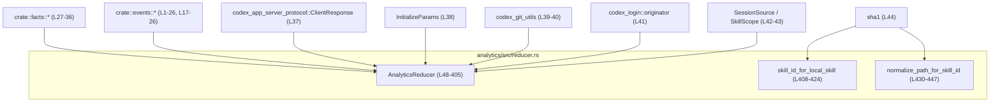
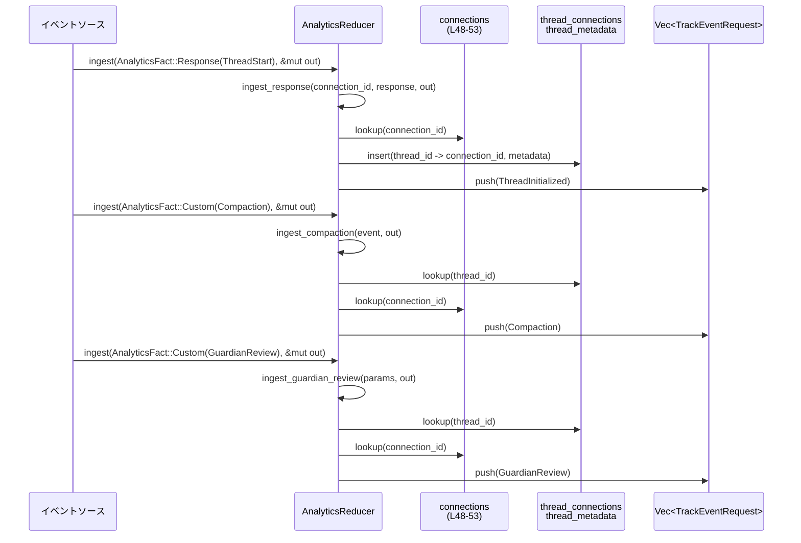
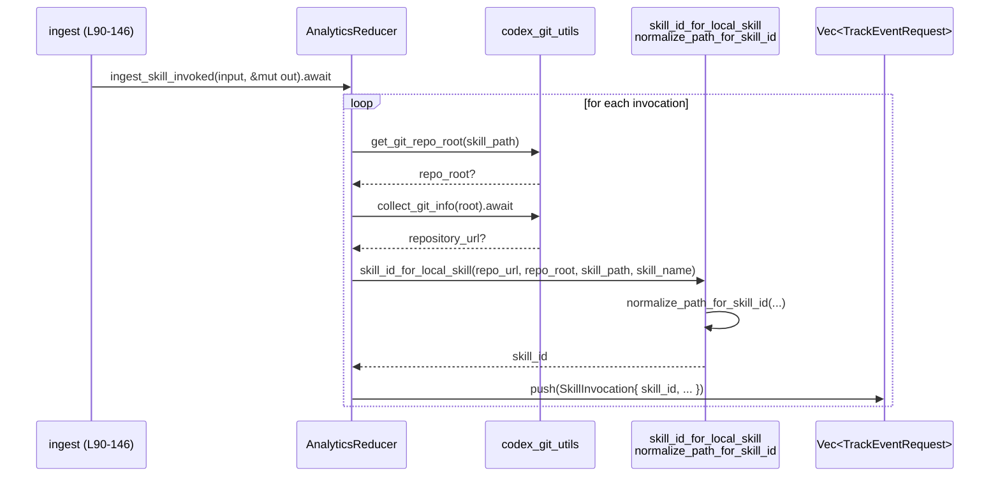

# analytics/src/reducer.rs コード解説

## 0. ざっくり一言

`AnalyticsReducer` は、アプリ内で発生したさまざまな「分析用事実（AnalyticsFact）」を受け取り、接続・スレッドの状態を管理しながら、外部送信可能な `TrackEventRequest` 群に変換するステートフルなリデューサです（`analytics/src/reducer.rs:L48-53, L90-146`）。  
また、ローカルスキル向けの一意な `skill_id` を生成するユーティリティ関数も提供します（`analytics/src/reducer.rs:L408-424, L430-447`）。

---

## 1. このモジュールの役割

### 1.1 概要

このモジュールは、**アプリ内イベントから分析用イベントを構築するための集約ポイント**として機能します。

- 入力: `AnalyticsFact`（初期化、レスポンス、カスタムイベントなど）を受け取る（`L90-146`）。
- 状態: 接続ごとのクライアント情報、スレッド ID と接続 ID の対応、スレッドのメタデータを保持する（`L48-53`）。
- 出力: 追跡用の `TrackEventRequest`（スレッド初期化、スキル呼び出し、アプリ/プラグイン利用、コンパクション、ガーディアンレビュー等）を生成する（各 `ingest_*` 関数群）。

### 1.2 アーキテクチャ内での位置づけ

`AnalyticsReducer` は、facts 層と events/transport 層の間に位置します。



この図は、`AnalyticsReducer` 周辺の主要な依存関係を示しています（本ファイル `analytics/src/reducer.rs` の範囲）。

### 1.3 設計上のポイント

コードから読み取れる特徴は次の通りです。

- **ステートフルなリデューサ**  
  - 接続 ID → 接続状態 (`ConnectionState`) を `HashMap` で保持（`L48-53, L55-58`）。
  - スレッド ID → 接続 ID / スレッドメタデータを別 `HashMap` で管理（`L48-53`）。
- **イベントタイプごとの専用ハンドラ**  
  - `ingest` が入口で、`AnalyticsFact` のバリアントごとに `ingest_*` 関数に委譲（`L90-146`）。
- **非同期 I/O を含む処理**  
  - スキル呼び出しイベント処理では Git 情報の取得 (`collect_git_info`) を `await` しており、非同期ファイル/プロセス I/O を含みます（`L219-265`）。
- **エラーハンドリング方針**  
  - メタデータが見つからない場合は `tracing::warn!` を出し、イベントをドロップする（`ingest_guardian_review`, `ingest_compaction` の `let Some(..) = .. else { .. }` パターン, `L188-206, L366-391`）。
  - 型変換失敗時は安全側にフォールバック（`u64::try_from(thread.created_at).unwrap_or_default()` で 0 にフォールバック, `L360`）。
  - ファイルパス正規化では `canonicalize` エラー時にオリジナルパスへフォールバック（`L435-436`）。
- **スレッド安全性**  
  - すべてのメソッドが `&mut self` を受け取り、内部に `Mutex` 等はないため、呼び出し側で排他的に扱う前提です（`L90, L148, L173, L183, L219, L267, L278, L287, L295, L313, L366`）。
  - Rust の所有権・借用制御により、同時に複数タスクから `&mut AnalyticsReducer` を共有する誤用はコンパイル時に防止されます。

---

## 2. 主要な機能一覧

このモジュールが提供する主な機能は次の通りです。

- `AnalyticsReducer::ingest`: `AnalyticsFact` を受け取り、対応する `TrackEventRequest` を生成するメイン入口（`L90-146`）。
- 接続初期化の集約 (`ingest_initialize`): `InitializeParams` から接続別クライアント/ランタイム情報を登録（`L148-171`）。
- スレッド開始/再開/フォークレスポンスの処理 (`ingest_response`): スレッドと接続・メタデータの対応付けと `ThreadInitializedEvent` の送出（`L313-364`）。
- サブエージェントスレッド開始イベントの処理 (`ingest_subagent_thread_started`): `TrackEventRequest::ThreadInitialized` の作成（`L173-181`）。
- ガーディアンレビューイベントの処理 (`ingest_guardian_review`): 接続メタデータを付与して `GuardianReviewEventRequest` を生成（`L183-217`）。
- スキル呼び出しイベントの処理 (`ingest_skill_invoked`): Git 情報・スコープに基づく `skill_id` とメタデータ生成（`L219-265`）。
- アプリ/プラグインの言及・利用・状態変更イベント処理 (`ingest_app_mentioned`, `ingest_app_used`, `ingest_plugin_used`, `ingest_plugin_state_changed`, `L267-293, L295-311`）。
- コンパクションイベント処理 (`ingest_compaction`): スレッド・接続・メタデータ情報を付与した `CodexCompactionEventRequest` を構築（`L366-405`）。
- ローカルスキル ID の生成 (`skill_id_for_local_skill`): リポジトリ URL・ルート・パス・スキル名から SHA‑1 ハッシュで安定 ID を生成（`L408-424`）。
- スキルパスの正規化 (`normalize_path_for_skill_id`): リポジトリ有無に応じてパスを相対/絶対に正規化し、スラッシュ形式に統一（`L430-447`）。

---

## 3. 公開 API と詳細解説

### 3.1 型一覧（構造体・列挙体など）

| 名前 | 種別 | 可視性 | 定義箇所 | 役割 / 用途 |
|------|------|--------|----------|-------------|
| `AnalyticsReducer` | 構造体 | `pub(crate)` | `analytics/src/reducer.rs:L48-53` | 接続・スレッド関連の状態を保持し、`AnalyticsFact` を `TrackEventRequest` に変換する中心的コンポーネント |
| `ConnectionState` | 構造体 | モジュール内 | `L55-58` | 1 接続あたりのクライアントメタデータとランタイム情報を保持 |
| `ThreadMetadataState` | 構造体 | モジュール内 | `L60-65` | スレッドソース種別・サブエージェントソース・親スレッド ID を保持 |
| `ThreadMetadataState::from_session_source` | 関連関数 | モジュール内 | `L67-86` | `SessionSource` から `ThreadMetadataState` を構築するユーティリティ |

### 3.1.1 コンポーネントインベントリー（関数）

| 名前 | 種別 | 可視性 | 定義箇所 | 概要 |
|------|------|--------|----------|------|
| `AnalyticsReducer::ingest` | メソッド (`async`) | `pub(crate)` | `L89-146` | `AnalyticsFact` を受け取り、適切な `ingest_*` ハンドラに振り分ける入口 |
| `AnalyticsReducer::ingest_initialize` | メソッド | モジュール内 | `L148-171` | 接続 ID と初期化パラメータから `ConnectionState` を登録 |
| `AnalyticsReducer::ingest_subagent_thread_started` | メソッド | モジュール内 | `L173-181` | サブエージェントスレッド開始入力から `ThreadInitialized` イベントを生成 |
| `AnalyticsReducer::ingest_guardian_review` | メソッド | モジュール内 | `L183-217` | ガーディアンレビューイベントに接続/ランタイム情報を付与して送出 |
| `AnalyticsReducer::ingest_skill_invoked` | メソッド (`async`) | モジュール内 | `L219-265` | スキル呼び出しごとに Git 情報・`skill_id` を解決しイベント送出 |
| `AnalyticsReducer::ingest_app_mentioned` | メソッド | モジュール内 | `L267-276` | メンションされたアプリごとに `AppMentioned` イベントを生成 |
| `AnalyticsReducer::ingest_app_used` | メソッド | モジュール内 | `L278-285` | 利用されたアプリに対する `AppUsed` イベントを生成 |
| `AnalyticsReducer::ingest_plugin_used` | メソッド | モジュール内 | `L287-293` | プラグイン利用イベントを生成 |
| `AnalyticsReducer::ingest_plugin_state_changed` | メソッド | モジュール内 | `L295-311` | プラグインのインストール/アンインストール/有効/無効イベントを生成 |
| `AnalyticsReducer::ingest_response` | メソッド | モジュール内 | `L313-364` | スレッド開始/再開/フォークレスポンスからスレッドと接続の関連付けと初期化イベント生成 |
| `AnalyticsReducer::ingest_compaction` | メソッド | モジュール内 | `L366-405` | コンパクションイベントに接続・スレッドメタデータを付与して送出 |
| `skill_id_for_local_skill` | 関数 | `pub(crate)` | `L408-424` | ローカルスキル向けの安定 ID を生成（SHA‑1） |
| `normalize_path_for_skill_id` | 関数 | `pub(crate)` | `L430-447` | スキルファイルパスをリポジトリに応じて正規化 |

---

### 3.2 関数詳細（重要な 7 件）

#### 3.2.1 `AnalyticsReducer::ingest(&mut self, input: AnalyticsFact, out: &mut Vec<TrackEventRequest>)`

**定義箇所**: `analytics/src/reducer.rs:L89-146`

**概要**

- すべての分析入力 (`AnalyticsFact`) を受け付けるメイン入口です。
- 入力のバリアントに応じて、専用の `ingest_*` メソッドを呼び出し、必要に応じて `out` ベクタに `TrackEventRequest` を追加します。

**引数**

| 引数名 | 型 | 説明 |
|--------|----|------|
| `self` | `&mut AnalyticsReducer` | 内部状態（接続・スレッドマップ）を更新するためのミュータブル参照 |
| `input` | `AnalyticsFact` | 初期化・リクエスト・レスポンス・通知・カスタムイベントを表す列挙体 |
| `out` | `&mut Vec<TrackEventRequest>` | 生成された分析イベントを蓄積する出力バッファ |

**戻り値**

- 戻り値はありません。副作用として `self` の状態更新と `out` へのイベント追加を行います。

**内部処理の流れ**

1. `match input` で `AnalyticsFact` のバリアントを判定（`L91-145`）。
2. `Initialize` の場合は `ingest_initialize` に委譲（`L92-106, L148-171`）。
3. `Request` の場合は現状何もしません（空ブロック, `L107-111`）。
4. `Response` の場合は `ingest_response` に委譲（`L112-117, L313-364`）。
5. `Notification` の場合も現状何もしません（`L118`）。
6. `Custom` の場合は、更に `CustomAnalyticsFact` のバリアントに応じて以下に振り分け（`L119-144`）:
   - `SubAgentThreadStarted` → `ingest_subagent_thread_started`
   - `Compaction` → `ingest_compaction`
   - `GuardianReview` → `ingest_guardian_review`
   - `SkillInvoked` → `ingest_skill_invoked`（`await` 付き）
   - `AppMentioned` → `ingest_app_mentioned`
   - `AppUsed` → `ingest_app_used`
   - `PluginUsed` → `ingest_plugin_used`
   - `PluginStateChanged` → `ingest_plugin_state_changed`

**Examples（使用例・概念的）**

```rust
use analytics::reducer::AnalyticsReducer;
use analytics::facts::AnalyticsFact;
use analytics::events::TrackEventRequest;

async fn handle_fact(mut reducer: AnalyticsReducer, fact: AnalyticsFact) {
    let mut out: Vec<TrackEventRequest> = Vec::new(); // 出力バッファ
    reducer.ingest(fact, &mut out).await;             // 事実を処理し、追跡イベントを蓄積

    // out に溜まった TrackEventRequest を実際の送信キューなどに流す
    for event in out {
        // send_event(event).await;
    }
}
```

※ `analytics::facts` や `analytics::events` モジュールの実体は本チャンクには現れないため、名前のみを使用しています。

**Errors / Panics**

- 関数自体は `Result` を返さず、パニックを明示的に発生させるコードもありません（`L90-146`）。
- 各 `ingest_*` 内でのエラーは、警告ログ出力とイベントドロップという形で扱われます（例: `ingest_guardian_review` の `tracing::warn!`, `L188-206`）。

**Edge cases（エッジケース）**

- `Initialize` が呼ばれないまま `Response` が来た場合: `ingest_response` 内で `connections` から `connection_id` が見つからず、イベントは生成されません（`L339-341`）。
- `Custom` の新しいバリアントが追加された場合: `match` が網羅的でないとコンパイルエラーになりますが、本ファイルでは現在すべての既知バリアントを明示的に処理しています（`L119-144`）。

**使用上の注意点**

- `AnalyticsReducer` は内部に状態を持つため、複数スレッド/タスクから同時に扱う場合は **同時に複数の `&mut AnalyticsReducer` を持たない** ことが前提です（Rust の借用規則によりコンパイル時に守られます）。
- 入力イベントの順序（特に Initialize → Response → Custom 系）が意味を持ち、順序を誤るとメタデータ不足でイベントがドロップされます。

---

#### 3.2.2 `AnalyticsReducer::ingest_response(&mut self, connection_id: u64, response: ClientResponse, out: &mut Vec<TrackEventRequest>)`

**定義箇所**: `analytics/src/reducer.rs:L313-364`

**概要**

- アプリサーバからの `ClientResponse`（スレッド開始/再開/フォーク）を処理し、
  - 内部マップにスレッドと接続の対応、およびスレッドメタデータを保存し、
  - `ThreadInitializedEvent` を `TrackEventRequest::ThreadInitialized` として出力します。

**引数**

| 引数名 | 型 | 説明 |
|--------|----|------|
| `connection_id` | `u64` | 応答が紐づく接続 ID |
| `response` | `ClientResponse` | スレッド開始/再開/フォーク等のレスポンス |
| `out` | `&mut Vec<TrackEventRequest>` | 初期化イベントを追加する出力バッファ |

**戻り値**

- なし。副作用として内部マップ更新と `out` へのイベント追加を行います。

**内部処理の流れ**

1. `match response` で 3 種類のレスポンスタイプを扱う（`L319-335`）:
   - `ThreadStart` → モード: `ThreadInitializationMode::New`
   - `ThreadResume` → モード: `ThreadInitializationMode::Resumed`
   - `ThreadFork` → モード: `ThreadInitializationMode::Forked`
   - それ以外の `ClientResponse` は何もせず `return`。
2. `thread.source.into()` でスレッドソースを `SessionSource` に変換（`L337`）。
3. `connections` マップから `connection_id` に対応する `ConnectionState` を取得。見つからない場合はそのまま `return`（`L339-341`）。
4. `ThreadMetadataState::from_session_source` でスレッドメタデータを構築（`L342, L67-86`）。
5. `thread_connections` と `thread_metadata` マップを更新（`L343-346`）。
6. `TrackEventRequest::ThreadInitialized` を生成し、`ThreadInitializedEventParams` に必要な情報を詰めて `out` に push（`L347-363`）。

**Examples（概念的）**

```rust
use analytics::reducer::AnalyticsReducer;
use codex_app_server_protocol::ClientResponse;
use analytics::events::TrackEventRequest;

fn handle_thread_start(
    reducer: &mut AnalyticsReducer,
    conn_id: u64,
    resp: ClientResponse,
    out: &mut Vec<TrackEventRequest>,
) {
    reducer.ingest_response(conn_id, resp, out);
    // out に ThreadInitialized イベントが含まれる可能性がある
}
```

**Errors / Panics**

- `connections` に `connection_id` が存在しない場合、静かに `return` され、イベントは生成されません（`L339-341`）。
- `u64::try_from(thread.created_at).unwrap_or_default()` により、`created_at` が `u64` に収まらない場合は `0` にフォールバックし、パニックは発生しません（`L360`）。

**Edge cases**

- 未初期化の接続 ID でレスポンスが来た場合、スレッドマッピングとイベント生成がスキップされるため、その後のガーディアンレビュー/コンパクションイベントがメタデータ不足になります。
- `thread.created_at` が異常値の場合、`created_at` が `0` として記録されるため、後段でタイムスタンプを使う処理では注意が必要です。

**使用上の注意点**

- `Initialize` イベントで `connections` を埋めておくことが前提です。
- 他の `ClientResponse` バリアント（Thread 以外）を処理したい場合は、この `match` に追加する必要があります。

---

#### 3.2.3 `AnalyticsReducer::ingest_guardian_review(&mut self, input: GuardianReviewEventParams, out: &mut Vec<TrackEventRequest>)`

**定義箇所**: `analytics/src/reducer.rs:L183-217`

**概要**

- ガーディアンレビュー（レビュー ID 付きのモデレーション結果などと推測される）イベントに、接続メタデータ・ランタイム情報を付与して分析イベントとして送出します。

**引数**

| 引数名 | 型 | 説明 |
|--------|----|------|
| `input` | `GuardianReviewEventParams` | レビュー対象スレッド・ターン・レビュー ID などのパラメータ |
| `out` | `&mut Vec<TrackEventRequest>` | 生成された `GuardianReview` イベントを蓄積するバッファ |

**戻り値**

- なし。

**内部処理の流れ**

1. `thread_connections` から `input.thread_id` に対応する `connection_id` を取得（`L188`）。
   - 見つからなければ `tracing::warn!` を出力し、イベントをドロップ（`L189-195`）。
2. `connections` から `connection_id` に対応する `ConnectionState` を取得（`L197`）。
   - 見つからなければ `tracing::warn!` を出力し、イベントをドロップ（`L198-205`）。
3. `GuardianReviewEventRequest` を構築し、`app_server_client` と `runtime` を `connection_state` から複製して詰める（`L207-215`）。
4. `TrackEventRequest::GuardianReview` として `out` に push（`L207-216`）。

**Errors / Panics**

- `thread_connections`・`connections` での Lookup 失敗はすべてログ & ドロップで扱われ、パニックは発生しません（`L188-206`）。

**Edge cases**

- スレッドが `ingest_response` で登録されていない場合、ガーディアンイベントは必ずドロップされます。
- 接続情報がガーベジになっている（`connections` から削除されている）場合も同様にドロップされます。

**使用上の注意点**

- ガーディアンイベントを確実に送出したい場合は、スレッド生成レスポンスを `ingest_response` で確実に処理し、`connections` キーを適切に維持しておく必要があります。

---

#### 3.2.4 `AnalyticsReducer::ingest_compaction(&mut self, input: CodexCompactionEvent, out: &mut Vec<TrackEventRequest>)`

**定義箇所**: `analytics/src/reducer.rs:L366-405`

**概要**

- コンパクション（会話履歴の圧縮などに相当すると考えられる）イベントに対し、接続メタデータ及びスレッドメタデータを付与して `CodexCompactionEventRequest` を送出します。

**引数**

| 引数名 | 型 | 説明 |
|--------|----|------|
| `input` | `CodexCompactionEvent` | 対象スレッド ID、ターン ID などを含むイベント情報 |
| `out` | `&mut Vec<TrackEventRequest>` | 生成された `Compaction` イベントを蓄積するバッファ |

**内部処理の流れ**

1. `thread_connections` から `thread_id` に対応する `connection_id` を取得（`L367`）。
   - 見つからない場合は warn ログを出し、リターン（`L368-373`）。
2. `connections` から `connection_state` を取得（`L375`）。
   - 無い場合も warn ログ & リターン（`L376-382`）。
3. `thread_metadata` からスレッドのメタデータを取得（`L384`）。
   - 無い場合も warn ログ & リターン（`L385-390`）。
4. 取得した情報を `codex_compaction_event_params` に渡し、`CodexCompactionEventRequest` を構築（`L393-402`）。
5. `TrackEventRequest::Compaction` として `out` に push（`L392-404`）。

**Errors / Panics**

- 3 段階の Lookup いずれかが失敗した時点でログ出力とドロップが行われ、パニックはありません（`L367-390`）。

**Edge cases**

- スレッド生成時に `thread_metadata` を登録し忘れていると、コンパクションイベントはログ警告とともにドロップされます。
- いずれかのマップがガーベジコレクションされるような変更（現状は存在しない）が導入されると、この関数の前提が崩れます。

**使用上の注意点**

- `ingest_response` で `thread_connections` と `thread_metadata` を必ず更新しているため、コンパクションイベントを扱うには、`ClientResponse` を漏れなく処理することが前提条件になります。

---

#### 3.2.5 `AnalyticsReducer::ingest_skill_invoked(&mut self, input: SkillInvokedInput, out: &mut Vec<TrackEventRequest>)`

**定義箇所**: `analytics/src/reducer.rs:L219-265`

**概要**

- スキル呼び出しの情報を受け取り、各スキル呼び出しごとに Git リポジトリ情報・スコープ・ `skill_id` を解決し、`SkillInvocationEventRequest` を生成します。
- 非同期関数であり、Git 情報の取得に `await` を伴う点が特徴です。

**引数**

| 引数名 | 型 | 説明 |
|--------|----|------|
| `input` | `SkillInvokedInput` | トラッキング情報 (`tracking`) と、複数のスキル呼び出し (`invocations`) を含む |
| `out` | `&mut Vec<TrackEventRequest>` | 生成された `SkillInvocation` イベントを蓄積するバッファ |

**内部処理の流れ**

1. パターンマッチで `SkillInvokedInput { tracking, invocations }` を分解（`L224-227`）。
2. `invocations` をループし、各 `invocation` について以下を行う（`L228-264`）。
3. `SkillScope` を `"user"`, `"repo"`, `"system"`, `"admin"` の文字列に変換（`L229-234`）。
4. `get_git_repo_root(invocation.skill_path.as_path())` でリポジトリルートを取得（`L235`）。
5. ルートが存在する場合は、`collect_git_info(root).await` でリポジトリ URL を取得し、`info.repository_url` に `and_then` でアクセス（`L236-240`）。
6. `skill_id_for_local_skill` を呼び出し、`repo_url`、`repo_root`、`skill_path`、`skill_name` に基づくスキル ID を生成（`L243-248`）。
7. `TrackEventRequest::SkillInvocation` を構築し、`thread_id`、`invoke_type`、`model_slug`、`product_client_id`（`originator().value`）、`repo_url`、`skill_scope` などを設定して `out.push`（`L249-263`）。

**Errors / Panics**

- `get_git_repo_root` や `collect_git_info` が失敗した場合、`repo_root` / `repo_url` は `None` となりますが、そのまま `skill_id_for_local_skill` に渡されます（`L235-242`）。
- 非同期 I/O の失敗は `Option` を通じて無視される形であり、パニックではなく「情報不足」として扱われます。
- 関数シグネチャは `async fn` ですが `Result` を返していないため、呼び出し側は個々の失敗を区別できません。

**Edge cases**

- Git リポジトリ外のスキルパス: `get_git_repo_root` が `None` を返した場合、`repo_url` も `None` のまま、スキル ID には絶対パスが使われます（`skill_id_for_local_skill` の仕様, `L243-248, L430-447`）。
- `invocations` が空の場合: ループが実行されず、イベントは一切生成されません。

**使用上の注意点**

- この関数は、`&mut self` を保持したまま `collect_git_info(...).await` を行うため、Git 情報取得中は `AnalyticsReducer` に対する他の処理は待たされます。ただし Rust の所有権ルールにより、同時に他から `&mut AnalyticsReducer` を借用することはできません。
- リポジトリ情報取得に失敗してもイベント自体は生成されるため、`repo_url` が `None` になり得ることを後段で考慮する必要があります。

---

#### 3.2.6 `skill_id_for_local_skill(repo_url: Option<&str>, repo_root: Option<&Path>, skill_path: &Path, skill_name: &str) -> String`

**定義箇所**: `analytics/src/reducer.rs:L408-424`

**概要**

- ローカルファイルとして存在するスキルに対し、リポジトリ情報とファイルパス・スキル名を組み合わせて安定的な ID を生成します。
- ID はプレフィックスと正規化パス・スキル名を連結し、SHA‑1 ハッシュを 16 進文字列にしたものです。

**引数**

| 引数名 | 型 | 説明 |
|--------|----|------|
| `repo_url` | `Option<&str>` | スキルが属するリポジトリの URL。リポジトリ外のスキルの場合は `None` |
| `repo_root` | `Option<&Path>` | リポジトリのルートディレクトリパス。`None` の場合は絶対パス扱い |
| `skill_path` | `&Path` | スキルファイルのパス |
| `skill_name` | `&str` | スキルの論理名 |

**戻り値**

- `String`: スキル ID（SHA‑1 ハッシュの 16 進文字列）。

**内部処理の流れ**

1. `normalize_path_for_skill_id` で `skill_path` を正規化し、`path` 文字列を得る（`L414`）。
2. `repo_url` が `Some(url)` の場合は `"repo_{url}"` をプレフィックスとし、`None` の場合は `"personal"` を使用（`L415-419`）。
3. `raw_id = format!("{prefix}_{path}_{skill_name}")` で生 ID 文字列を組み立て（`L420`）。
4. `sha1::Sha1` ハッシュ計算器を作成し、`raw_id.as_bytes()` を `update`（`L421-422`）。
5. `finalize` したハッシュ値を `{:x}` で 16 進文字列へフォーマットして返却（`L423`）。

**Examples**

```rust
use std::path::Path;
use analytics::reducer::skill_id_for_local_skill;

fn example_skill_id() {
    let repo_url = Some("https://github.com/example/repo.git");
    let repo_root = Some(Path::new("/home/user/repo"));
    let skill_path = Path::new("/home/user/repo/skills/my_skill.rs");
    let skill_name = "my_skill";

    let skill_id = skill_id_for_local_skill(repo_url, repo_root, skill_path, skill_name);
    println!("skill_id = {}", skill_id); // SHA-1 の 16進文字列
}
```

**Errors / Panics**

- 本関数内にパニックを引き起こすコードはありません。`normalize_path_for_skill_id` はエラーをフォールバックで処理します（`L430-447`）。

**Edge cases**

- `repo_url` が `None` の場合、プレフィックスは `"personal"` となります（`L415-419`）。
- `skill_path` が存在しない場合でも `normalize_path_for_skill_id` が `canonicalize` 失敗時に元パスを返すため、ID は常に生成されます（`L435-436`）。

**使用上の注意点**

- SHA‑1 は暗号学的ハッシュとしては現在推奨されないアルゴリズムですが、本コードでは一意な識別子生成用に使用されており、セキュリティ用途ではありません。  
  ただし、**ハッシュ化が匿名化を保証するものではない** ため、原情報（リポジトリ URL やパス）が機密である前提で安全性を期待するべきではありません。

---

#### 3.2.7 `normalize_path_for_skill_id(repo_url: Option<&str>, repo_root: Option<&Path>, skill_path: &Path) -> String`

**定義箇所**: `analytics/src/reducer.rs:L430-447`

**概要**

- スキル ID 生成のために、スキルファイルのパスを正規化します。
- リポジトリ URL とルートが両方存在する場合はルートからの相対パス、そうでない場合は絶対パスを使います。
- パス表記は `\` を `/` に置換して統一します。

**引数**

| 引数名 | 型 | 説明 |
|--------|----|------|
| `repo_url` | `Option<&str>` | リポジトリ URL の有無 |
| `repo_root` | `Option<&Path>` | リポジトリルートディレクトリ |
| `skill_path` | `&Path` | スキルファイルパス |

**戻り値**

- `String`: 正規化済みのパス文字列。

**内部処理の流れ**

1. `std::fs::canonicalize(skill_path)` を試み、失敗時は元の `skill_path` をクローン（`L435-436`）。
2. `(repo_url, repo_root)` の組み合わせに応じて `match`（`L437-446`）:
   - `(Some(_), Some(root))` の場合:
     - `canonicalize(root)` でルートパスを正規化（失敗時は元の `root` を使用, `L439`）。
     - `resolved_path.strip_prefix(&resolved_root)` で相対パスを取得し、失敗時はフルパス（`L441-442`）。
     - `to_string_lossy().replace('\\', "/")` で文字列化 & セパレータ統一（`L443-444`）。
   - それ以外の場合:
     - `resolved_path.to_string_lossy().replace('\\', "/")` を返す（`L446`）。

**Examples**

```rust
use std::path::Path;
use analytics::reducer::normalize_path_for_skill_id;

fn example_normalize() {
    let repo_root = Some(Path::new("/home/user/repo"));
    let repo_url = Some("https://github.com/example/repo.git");
    let skill_path = Path::new("/home/user/repo/skills/my_skill.rs");

    let norm = normalize_path_for_skill_id(repo_url, repo_root, skill_path);
    // norm は "skills/my_skill.rs" のような相対パスになる想定
}
```

**Errors / Panics**

- `canonicalize` 失敗時は `unwrap_or_else` で元パスを使用するため、パニックは発生しません（`L435-436, L439`）。
- `strip_prefix` の失敗も `unwrap_or` でフルパスにフォールバックされます（`L441-442`）。

**Edge cases**

- `skill_path` が `repo_root` の外にある場合: `strip_prefix` が失敗し、絶対パスが使われます（`L441-442`）。
- Windows パス区切り（`\`）は `/` に置き換えられるため、OS に依存しない文字列表現になります（`L443-444, L446`）。

**使用上の注意点**

- リポジトリ内スキルと個人スキルで同じファイル名でも、`repo_url` とルートの有無によりパス表現が異なり、それがそのまま `skill_id` の入力になります。

---

### 3.3 その他の関数・メソッド一覧

| 関数名 | 定義箇所 | 役割（1 行） |
|--------|----------|--------------|
| `ThreadMetadataState::from_session_source` | `L67-86` | `SessionSource` からスレッドソース文字列・サブエージェント情報・親スレッド ID を抽出して `ThreadMetadataState` を構築 |
| `AnalyticsReducer::ingest_initialize` | `L148-171` | 接続 ID に対応する `ConnectionState` を初期化し `connections` マップに登録 |
| `AnalyticsReducer::ingest_subagent_thread_started` | `L173-181` | サブエージェントスレッド開始入力を `ThreadInitialized` イベントに変換 |
| `AnalyticsReducer::ingest_app_mentioned` | `L267-276` | アプリがメンションされたイベントを `codex_app_metadata` を用いて `AppMentioned` イベントに変換 |
| `AnalyticsReducer::ingest_app_used` | `L278-285` | アプリ利用イベントを `AppUsed` イベントとして出力 |
| `AnalyticsReducer::ingest_plugin_used` | `L287-293` | プラグイン利用イベントを `PluginUsed` として出力 |
| `AnalyticsReducer::ingest_plugin_state_changed` | `L295-311` | プラグイン状態変化をインストール/アンインストール/有効/無効のいずれかのイベントとして出力 |

---

## 4. データフロー

ここでは代表的な 2 つのフローを説明します。

### 4.1 スレッド生成 → 初期化イベント → コンパクション/ガーディアンレビュー

1. アプリサーバからスレッド開始レスポンス (`ClientResponse::ThreadStart`) が届き、`AnalyticsReducer::ingest` 経由で `ingest_response` が呼ばれる（`L90-117, L313-335`）。
2. `ingest_response` がスレッド ID と接続 ID を `thread_connections` に保存し、`thread_metadata` も構築する（`L343-346`）。
3. 同時に `TrackEventRequest::ThreadInitialized` が `out` に追加される（`L347-363`）。
4. 後続で、同じスレッド ID に対する `CodexCompactionEvent` や `GuardianReviewEventParams` が `AnalyticsFact::Custom` を通じて流れてくる。
5. これらは `ingest_compaction` / `ingest_guardian_review` によって処理され、`thread_connections` / `connections` / `thread_metadata` から必要なメタデータを引き出してイベントを生成する（`L183-217, L366-405`）。



### 4.2 スキル呼び出し → Git 情報 → skill_id 生成

1. `AnalyticsFact::Custom(CustomAnalyticsFact::SkillInvoked(input))` が `ingest` に渡される（`L119, L129-131`）。
2. `ingest_skill_invoked` が呼ばれ、各 `invocation` ごとに:
   - `get_git_repo_root` → `collect_git_info` を通じて Git 情報を取得（`L235-240`）。
   - `skill_id_for_local_skill` でスキル ID を生成（`L243-248, L408-424`）。
   - `TrackEventRequest::SkillInvocation` を `out` に push（`L249-263`）。



---

## 5. 使い方（How to Use）

### 5.1 基本的な使用方法

典型的な利用は、「1 プロセス内に 1 つの `AnalyticsReducer` を持ち、イベントストリームから順次 `AnalyticsFact` を流し込む」形が想定されます。

```rust
use analytics::reducer::AnalyticsReducer;
use analytics::facts::AnalyticsFact;
use analytics::events::TrackEventRequest;

async fn process_stream(stream: impl futures::Stream<Item = AnalyticsFact>) {
    let mut reducer = AnalyticsReducer::default();       // 状態を初期化 (L48-53, #[derive(Default)]
    let mut out: Vec<TrackEventRequest> = Vec::new();    // 送出キュー

    futures::pin_mut!(stream);
    while let Some(fact) = stream.next().await {
        reducer.ingest(fact, &mut out).await;

        // out にたまったイベントを実際の転送先に送るなど
        for event in out.drain(..) {
            // send_to_analytics_backend(event).await;
        }
    }
}
```

※ `AnalyticsFact` や `TrackEventRequest` の詳細定義は本チャンクには含まれていないため、実際の型は別モジュールを参照する必要があります。

### 5.2 よくある使用パターン

- **LSP/サーバプロセス内の一元的な集計**  
  - LSP サーバのメインループで、クライアントからの JSON-RPC を処理するたびに、対応する `AnalyticsFact` を生成して `AnalyticsReducer::ingest` に渡す。
- **バッチ処理**  
  - ログから `AnalyticsFact` を再構築し、`AnalyticsReducer` を使って `TrackEventRequest` に変換した後、まとめて外部分析基盤に送る。

### 5.3 よくある間違い

```rust
// 間違い例: Initialize を送らずに Response だけ処理する
let mut reducer = AnalyticsReducer::default();
let mut out = Vec::new();

// connection_id に対応する ConnectionState が登録されていない
reducer.ingest(
    AnalyticsFact::Response { connection_id: 1, response: Box::new(resp) },
    &mut out,
).await;

// → ingest_response 内で connections.get(&1) が None となり、何も起きない (L339-341)
```

```rust
// 正しい例: 必ず Initialize から処理を始める
reducer.ingest(
    AnalyticsFact::Initialize { connection_id: 1, params, product_client_id, runtime, rpc_transport },
    &mut out,
).await;

reducer.ingest(
    AnalyticsFact::Response { connection_id: 1, response: Box::new(resp) },
    &mut out,
).await;

// この順序により ThreadInitialized イベントが生成され、
// 以降の Compaction/GuardianReview でメタデータが利用できる
```

### 5.4 使用上の注意点（まとめ）

- **順序の前提**  
  - `ingest_initialize` → `ingest_response` → （各種 `Custom` イベント）の順に処理する前提です。順序が崩れると、メタデータ Lookup が失敗しイベントがドロップされます（`L188-206, L367-391`）。
- **スレッド安全性**  
  - `AnalyticsReducer` は内部に `HashMap` を持ちますが、同期原語（`Mutex` 等）は使っていません。`&mut self` を要求するため、**単一タスクまたは明示的な同期を行う環境で使用する想定**です。
- **パフォーマンス**  
  - `ingest_skill_invoked` で Git 情報の取得 (`collect_git_info`) を毎回行うため、大量のスキル呼び出しがあると性能への影響があります（`L235-240`）。キャッシュ戦略を導入する場合はここが入口になります。
- **エラーとロギング**  
  - メタデータ不足などのエラーは `tracing::warn!` によるログとイベントドロップで扱われます。監視システム側でこれらのログを収集すると、設定ミスの検知に役立ちます。

---

## 6. 変更の仕方（How to Modify）

### 6.1 新しい機能を追加する場合

例: 新しいカスタム分析イベント `CustomAnalyticsFact::NewEvent` を追加したい場合。

1. **facts モジュールの拡張**  
   - `crate::facts::CustomAnalyticsFact` に新しいバリアントと対応する入力型を追加します（このファイルには定義がないため、該当モジュールを参照）。
2. **`AnalyticsReducer::ingest` の `match` に分岐を追加**（`L119-144`）  
   - 新バリアントを処理する `ingest_new_event` のようなメソッドを定義し、それを呼び出します。
3. **専用の `ingest_*` メソッドを定義**  
   - 本ファイル内に `fn ingest_new_event(&mut self, ... , out: &mut Vec<TrackEventRequest>)` を追加し、必要なメタデータ Lookup（`connections`, `thread_connections`, `thread_metadata`）を行います。
4. **events モジュールの拡張**  
   - 必要であれば、`crate::events` に新しい `TrackEventRequest` バリアントやイベントペイロード型を追加します。

### 6.2 既存の機能を変更する場合

- **契約の確認**  
  - 例えば `ingest_compaction` の挙動を変える場合、`thread_connections` / `connections` / `thread_metadata` の三段階 Lookup が前提になっていることを確認します（`L367-391`）。
  - ここで返される `TrackEventRequest::Compaction` を消費する側が期待するフィールド（例えば `thread_source` が `Option<&'static str>` であることなど）を確認する必要があります（`L392-402`）。
- **テスト・使用箇所の再確認**  
  - `AnalyticsReducer::ingest` 経由で各 `ingest_*` が呼ばれるため、変更後は `AnalyticsFact` の生成箇所（多くは別モジュール）と、`TrackEventRequest` の消費側を合わせてテストする必要があります。

---

## 7. 関連ファイル

このモジュールと密接に関係するファイル・モジュールは、`use` 宣言から次のように読み取れます（`analytics/src/reducer.rs:L1-46`）。

| パス / モジュール | 役割 / 関係 |
|-------------------|------------|
| `crate::events` | `TrackEventRequest` や各種 `*EventRequest` 型、および `codex_app_metadata`, `codex_compaction_event_params`, `codex_plugin_metadata`, `plugin_state_event_type` などのヘルパー関数を提供し、本モジュールからイベント構築のために呼び出されます。 |
| `crate::facts` | `AnalyticsFact` とそのサブタイプ（`AppMentionedInput`, `AppUsedInput`, `SkillInvokedInput`, `SubAgentThreadStartedInput`, `CodexCompactionEvent`, `PluginStateChangedInput`, `PluginUsedInput` など）を定義し、本モジュールの入力データを提供します。 |
| `codex_app_server_protocol` | `ClientResponse`, `InitializeParams` を定義し、接続初期化およびスレッド生成レスポンスの情報源となります。 |
| `codex_git_utils` | `get_git_repo_root`, `collect_git_info` を提供し、ローカルスキルの Git リポジトリ情報取得に使用されます（`L39-40, L235-240`）。 |
| `codex_login::default_client::originator` | `product_client_id` の取得に使用され、スキル呼び出しイベントにクライアント識別情報を付与します（`L41, L258`）。 |
| `codex_protocol::protocol` | `SessionSource`, `SkillScope` を提供し、スレッドの起源やスキルスコープ（user/repo/system/admin）の判定に使用されます（`L42-43, L229-234, L337`）。 |

---

## Bugs / Security / Contracts / Edge Cases（まとめ）

ここでは、特に重要な安全性・エッジケース・契約上の注意点のみを簡潔にまとめます。

- **潜在的なバグ/仕様上の注意**
  - `AnalyticsReducer::ingest_response` は `connections` に `connection_id` がない場合、ログも出さずに単に `return` します（`L339-341`）。他のメソッド（`ingest_guardian_review`, `ingest_compaction`）が warn ログを出すのと対照的であり、デバッグ性の観点で挙動が統一されていません。
- **セキュリティ・プライバシー**
  - `skill_id_for_local_skill` はリポジトリ URL とパス、スキル名から SHA‑1 ハッシュを生成しますが、これは匿名化の保証ではありません（`L415-423`）。  
    同一入力からは同一 ID が生成され、元の情報空間が小さい場合は総当たりで逆算可能です。
- **Contracts（前提条件）**
  - `ingest_guardian_review` / `ingest_compaction` は、対象スレッドが事前に `ingest_response` で登録されていることを前提とします（`L188-206, L367-391`）。
  - `normalize_path_for_skill_id` は、パスが存在しない可能性を考慮しており、`canonicalize` 失敗時に元パスへフォールバックする契約です（`L435-436`）。
- **Edge Cases**
  - Git リポジトリ外のスキル、または Git 情報取得に失敗した場合でも、`SkillInvocation` イベントは生成され、`repo_url` が `None` になるだけです（`L235-242`）。
  - `thread.created_at` の変換に失敗すると `0` になるため、後続の処理が「0 を特別な値」と見なしている場合は注意が必要です（`L360`）。

---

## Tests / Performance / Observability（簡易メモ）

- **テスト観点**
  - イベント順序（Initialize → Response → Custom）の違いによる挙動（イベントが生成されるかドロップされるか）をテストすると、状態管理の検証に役立ちます。
  - `normalize_path_for_skill_id` について、Windows/Unix 両方のパス形式と、リポジトリ内外パスの組み合わせをテストすることが重要です（`L430-447`）。
- **パフォーマンス**
  - `ingest_skill_invoked` は Git 情報取得を `invocations` の件数だけ繰り返すため、大量のスキル呼び出しがあるケースではボトルネックになり得ます（`L219-265`）。
- **オブザーバビリティ**
  - メタデータ不足に起因するイベントドロップはすべて `tracing::warn!` で記録されており（`L189-195, L198-205, L368-373, L376-382, L385-390`）、これを集計することで設定不整合を検知できます。
