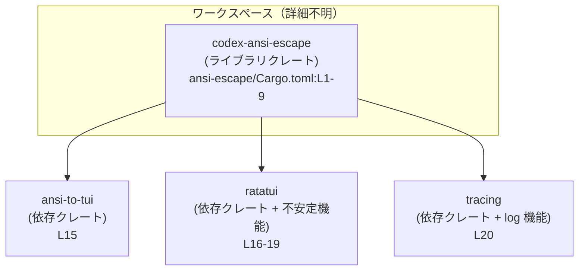
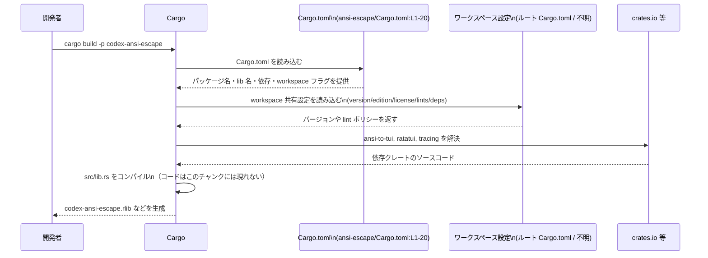

# ansi-escape/Cargo.toml コード解説

## 0. ざっくり一言

`ansi-escape/Cargo.toml` は、Rust ライブラリクレート `codex-ansi-escape` のパッケージ情報、ライブラリターゲット、ワークスペース連携された lint 設定、および依存クレート（`ansi-to-tui`, `ratatui`, `tracing`）を定義するマニフェストファイルです（ansi-escape/Cargo.toml:L1-5,L7-12,L14-20）。

---

## 1. このモジュールの役割

### 1.1 概要

- このファイルは Cargo（Rust のビルドツール）が読み取る **マニフェスト** であり、`codex-ansi-escape` というパッケージ名のライブラリクレートを定義しています（ansi-escape/Cargo.toml:L1-2,L7-9）。
- バージョン・エディション・ライセンス・lint 設定は、すべてワークスペース共通設定から継承されるようになっています（ansi-escape/Cargo.toml:L3-5,L11-12）。
- 依存関係として、`ansi-to-tui`, `ratatui`（不安定な機能を有効化）, `tracing`（`log` 機能を有効化）をワークスペース経由で使用することを指定しています（ansi-escape/Cargo.toml:L14-20）。

### 1.2 アーキテクチャ内での位置づけ

このファイルから分かる範囲では、`codex-ansi-escape` はワークスペースの一パッケージであり、ライブラリだけを提供するクレートとして構成されています（バイナリターゲットの定義はありません）（ansi-escape/Cargo.toml:L1-9,L11-12）。

依存関係の構造は次のようになります。



- ワークスペースルートの `Cargo.toml` や他パッケージとの関係は、このチャンクには現れません（不明）。

### 1.3 設計上のポイント

コードから読み取れる設計上の特徴は次のとおりです。

- **ワークスペース中心の管理**  
  - バージョン・エディション・ライセンスは `*.workspace = true` によりワークスペースから継承されています（ansi-escape/Cargo.toml:L3-5）。  
  - lint 設定もワークスペース側に委譲されています（ansi-escape/Cargo.toml:L11-12）。
- **ライブラリ専用クレート**  
  - `[lib]` セクションのみが定義されており、バイナリターゲット（`[[bin]]`）は登場しません（ansi-escape/Cargo.toml:L7-9）。
- **依存クレートと機能フラグの明示**  
  - 依存クレートはすべて `workspace = true` でバージョン管理されており、`ratatui` の不安定機能や `tracing` の `log` 機能が明示されています（ansi-escape/Cargo.toml:L14-20）。
- **安全性・エラー処理・並行性に関する情報**  
  - このファイルには Rust コードは含まれておらず、実際の API やロジックは `src/lib.rs` 側に存在すると推測されますが、その内容はこのチャンクには現れません（ansi-escape/Cargo.toml:L7-9）。  
  - したがって、このファイル単体からは安全性（`unsafe` の有無）、エラー処理、並行性（スレッド安全性など）の詳細は分かりません。

---

## 2. 主要な機能一覧

このファイル自体は設定ファイルであり、実行時の「機能」ではなく、ビルド時のメタ情報を提供します。Cargo.toml から **確実に分かる範囲** の役割を列挙します。

- パッケージ定義:  
  - パッケージ名 `codex-ansi-escape` を定義し（ansi-escape/Cargo.toml:L1-2）、バージョン・エディション・ライセンスをワークスペースから継承します（ansi-escape/Cargo.toml:L3-5）。
- ライブラリターゲットの定義:  
  - ライブラリ名 `codex_ansi_escape` およびエントリーポイント `src/lib.rs` を指定します（ansi-escape/Cargo.toml:L7-9）。
- lint 設定のワークスペース連携:  
  - `[lints]` セクションにより、本クレートの lint ポリシーがワークスペース共通設定に従うようになっています（ansi-escape/Cargo.toml:L11-12）。
- 依存関係の宣言:  
  - `ansi-to-tui` をワークスペース管理のバージョンで利用（ansi-escape/Cargo.toml:L15）。  
  - `ratatui` をワークスペース管理のバージョンで利用し、`unstable-rendered-line-info` と `unstable-widget-ref` 機能を有効化（ansi-escape/Cargo.toml:L16-19）。  
  - `tracing` をワークスペース管理のバージョンで利用し、`log` 機能を有効化（ansi-escape/Cargo.toml:L20）。

### コンポーネントインベントリー

#### 関数・構造体インベントリー

このファイルは TOML のマニフェストであり、Rust の関数・構造体定義は含まれていません。

| 種別 | 名前 | 定義状況 | 根拠 |
|------|------|----------|------|
| 関数 | なし | このファイル内に関数定義は現れません | ansi-escape/Cargo.toml:L1-20 |
| 構造体/列挙体等 | なし | このファイル内に型定義は現れません | ansi-escape/Cargo.toml:L1-20 |

#### クレート構成要素インベントリー

Cargo.toml から分かるクレートレベルの構成要素です。

| 区分 | 名前 | 内容 | 根拠 |
|------|------|------|------|
| パッケージ | `codex-ansi-escape` | ライブラリクレートのパッケージ名 | ansi-escape/Cargo.toml:L1-2 |
| ライブラリ名 | `codex_ansi_escape` | Rust コード側で `use codex_ansi_escape::...` という形で参照されると考えられるライブラリ名 | ansi-escape/Cargo.toml:L7-8 |
| ライブラリパス | `src/lib.rs` | ライブラリのエントリーとなるソースファイル | ansi-escape/Cargo.toml:L9 |
| lint 設定 | `workspace = true` | lint 設定をワークスペースから継承 | ansi-escape/Cargo.toml:L11-12 |
| 依存クレート | `ansi-to-tui` | ANSI → TUI 関連の機能を提供する依存（具体的な用途はこのチャンクには現れません） | ansi-escape/Cargo.toml:L15 |
| 依存クレート | `ratatui` | TUI ライブラリ。`unstable-*` 機能を有効化 | ansi-escape/Cargo.toml:L16-19 |
| 依存クレート | `tracing` | ロギング/トレース基盤。`log` 機能を有効化 | ansi-escape/Cargo.toml:L20 |

---

## 3. 公開 API と詳細解説

### 3.1 型一覧（構造体・列挙体など）

このファイルには Rust の型定義は一切含まれていません。公開 API の型は `src/lib.rs` などのソースファイル内に定義されていると推測されますが、このチャンクには現れず、特定はできません。

| 名前 | 種別 | 役割 / 用途 | 根拠 |
|------|------|-------------|------|
| 不明 | 不明 | 公開型は `src/lib.rs` 側に定義されていると考えられますが、このファイルからは内容を特定できません | ライブラリパスが `src/lib.rs` であることのみ分かる（ansi-escape/Cargo.toml:L7-9） |

### 3.2 関数詳細（最大 7 件）

このファイルには関数・メソッド・モジュールの定義が存在しないため、**公開関数の詳細解説はできません**。  
公開 API の内容（関数名・引数・戻り値・エラー型・並行性など）は、`src/lib.rs` および配下の `.rs` ファイルを参照する必要があります（ansi-escape/Cargo.toml:L7-9）。

- 安全性 (`unsafe` の有無)  
- エラー処理（`Result` の扱いなど）  
- 並行性（`Send` / `Sync`、スレッドプールなど）

といった情報も、本チャンクには現れません。

### 3.3 その他の関数

補助関数やラッパー関数に関しても、この Cargo.toml からは一切分かりません。

| 関数名 | 役割 | 備考 |
|--------|------|------|
| なし | - | このファイルには Rust コードが含まれません |

---

## 4. データフロー

このファイルは実行時データではなく **ビルド設定** を扱うため、実行時のデータフローは不明です。ここでは、Cargo によるビルド時の情報フローを整理します。

### Cargo ビルド時のフロー

以下は `cargo build -p codex-ansi-escape` を実行した際に起こる、マニフェストベースの情報フローのイメージです（対象コード範囲: ansi-escape/Cargo.toml:L1-20）。



この図から分かるのは：

- `*.workspace = true` により、本クレートの設定はワークスペースルートの `Cargo.toml` に依存していること（ansi-escape/Cargo.toml:L3-5,L11-12,L14-20）。
- 実際のビルド結果（生成バイナリ・ライブラリ）や API の中身は `src/lib.rs` の実装に依存し、このチャンクからは確認できないこと（ansi-escape/Cargo.toml:L7-9）。

---

## 5. 使い方（How to Use）

### 5.1 基本的な使用方法（クレートの利用）

このクレートを別クレートから利用する場合の、**Cargo.toml 側での依存追加例**です。

```toml
# 他のクレートの Cargo.toml の例
[dependencies]
codex-ansi-escape = { path = "../ansi-escape" }  # ローカルパスはプロジェクト構成に応じて調整する
```

- パッケージ名は `codex-ansi-escape` なので、それを `dependencies` に指定します（ansi-escape/Cargo.toml:L1-2）。
- バージョンを crates.io から取得する場合は、`path` の代わりに `version = "..."` を使います（バージョン番号自体はワークスペース側にあり、このチャンクには現れません）。

Rust コード側では、ライブラリ名 `codex_ansi_escape` を使って `use` することになりますが、具体的にどのシンボルを公開しているかは不明です。

```rust
// 例: ライブラリ名に基づく use 文の雰囲気だけを示す例
// 実際にどの型 / 関数が存在するかは、このチャンクには現れません。
use codex_ansi_escape::*; // または特定の型・関数に絞る

fn main() {
    // ここで codex_ansi_escape が提供する API を呼び出す
    // 具体的な呼び出し例は src/lib.rs の実装に依存するため、このファイルからは示せません。
}
```

### 5.2 よくある使用パターン（この Cargo.toml の観点）

本ファイルに対して想定される典型的な操作は、**依存クレートや機能フラグの調整**です。

1. 依存クレートの追加

```toml
[dependencies]
ansi-to-tui = { workspace = true }
ratatui = { workspace = true, features = [
    "unstable-rendered-line-info",
    "unstable-widget-ref",
] }
tracing = { workspace = true, features = ["log"] }
# 新しい依存クレートを追加する例
serde = { workspace = true }  # ルート側に serde が定義されていることが前提
```

1. 機能フラグの変更（例: `ratatui` の不安定機能を減らす）

```toml
[dependencies]
ratatui = { workspace = true, features = [
    # "unstable-rendered-line-info",   # 不要になったらコメントアウト or 削除
    "unstable-widget-ref",
] }
```

- これらの変更は **ビルド構成にのみ影響** し、具体的な挙動は Rust コード側の利用方法に依存します。

### 5.3 よくある間違い

Cargo.toml の構造から、起こり得る誤用例を挙げます。

```toml
# 間違い例: workspace に依存が定義されていないのに workspace = true にしている
[dependencies]
ansi-to-tui = { workspace = true }  # ルート Cargo.toml に ansi-to-tui が無いと解決エラーになる
```

```toml
# 正しい例: ルート Cargo.toml 側に依存を定義した上で workspace = true を使う想定
# (ルート側の記述はこのチャンクには現れません)
[dependencies]
ansi-to-tui = { workspace = true }
```

```toml
# 間違い例: lib 名とパッケージ名を混同する
[dependencies]
codex_ansi_escape = { path = "../ansi-escape" }  # ライブラリ名をパッケージ名として書いてしまう
```

```toml
# 正しい例: パッケージ名で依存を指定する
[dependencies]
codex-ansi-escape = { path = "../ansi-escape" }  # パッケージ名（L1-2）を使う
```

### 5.4 使用上の注意点（まとめ）

- **ワークスペース依存の前提**  
  - `version.workspace = true` などの指定により、ワークスペースルートで対応する設定が定義されていることが前提です（ansi-escape/Cargo.toml:L3-5,L11-12,L14-20）。  
  - ルート側に `ansi-to-tui`, `ratatui`, `tracing` が未定義の場合、依存解決時にエラーになります。
- **不安定機能の利用**  
  - `ratatui` で `unstable-rendered-line-info`, `unstable-widget-ref` 機能を有効化しているため（ansi-escape/Cargo.toml:L16-19）、ライブラリの将来的なバージョンアップ時に破壊的変更やビルドエラーが発生しやすい可能性があります。  
  - これらの機能に依存したコードの有無はこのチャンクからは分かりません。
- **安全性・エラー処理・並行性について**  
  - これらはすべて Rust コード（`src/lib.rs` など）で決まる事項であり、この Cargo.toml からは情報が得られません。  
  - したがって、ライブラリを利用・変更する際は、マニフェストとあわせてソースコードを確認する必要があります。

---

## 6. 変更の仕方（How to Modify）

### 6.1 新しい機能を追加する場合

ここでは「機能」を、ライブラリに新しい能力を持たせることと広く解釈します。

1. **Rust コード側の追加**  
   - 新しい機能や API は `src/lib.rs` やその配下のモジュールに追加されることが想定されます（エントリーパスのみが判明：ansi-escape/Cargo.toml:L7-9）。
2. **必要な依存の追加**  
   - 新しい機能に外部クレートが必要な場合、この `Cargo.toml` の `[dependencies]` セクションに追加します（ansi-escape/Cargo.toml:L14-20）。  
   - ワークスペースでバージョン管理したい場合は、ルート Cargo.toml で依存を定義したうえで `workspace = true` を指定します。
3. **機能フラグの見直し**  
   - `ratatui` や `tracing` の機能フラグが増減する場合、このファイル内の `features = [...]` を調整します（ansi-escape/Cargo.toml:L16-20）。
4. **lint 設定との整合性**  
   - ワークスペース側の lint 方針により、新しいコードがコンパイルエラー/警告になる可能性があります（`[lints] workspace = true`、ansi-escape/Cargo.toml:L11-12）。  
   - 追加コードと lint 方針が合うように実装する必要があります。

### 6.2 既存の機能を変更する場合

既存挙動の変更やリファクタリングに際しては、次の点に注意する必要があります。

- **パッケージ名・ライブラリ名の変更**  
  - `[package].name` や `[lib].name` を変更すると（ansi-escape/Cargo.toml:L1-2,L7-8）、  
    - 他クレートの `Cargo.toml` における依存名  
    - `use codex_ansi_escape::...` のようなコード側の参照  
    に影響が出ます。  
  - 変更時は、ワークスペース内のすべての参照箇所を検索して更新する必要があります。
- **依存クレートや機能の削除・変更**  
  - 例えば `ratatui` の不安定機能を外す場合（ansi-escape/Cargo.toml:L16-19）、その機能に依存したコードがないか確認する必要があります。  
  - 依存クレートの削除・バージョン変更は、ビルドエラーや動作変更の原因となります。
- **Contracts / Edge Cases（契約とエッジケース）**  
  - ライブラリとしての「契約」（入力に対してどのような振る舞いを保証するか）は Rust コード側にあり、このファイルからは分かりません。  
  - そのため API の意味を変える変更（シグネチャ変更、戻り値の意味変更など）を行う際は、利用側コードとテストコードを全体的に確認する必要があります。
- **Tests**  
  - テストの有無・内容はこのファイルには現れませんが、依存クレートの変更や機能フラグの変更後は、ワークスペース全体のテスト実行が必要です。

---

## 7. 関連ファイル

この Cargo.toml と密接に関係するファイル・設定をまとめます。

| パス / 区分 | 役割 / 関係 | 根拠 |
|-------------|------------|------|
| `src/lib.rs` | ライブラリクレート `codex_ansi_escape` のエントリーポイント。公開 API やコアロジックはこのファイルとその配下に存在するはずですが、このチャンクには内容が現れません。 | ライブラリパス指定（ansi-escape/Cargo.toml:L7-9） |
| ワークスペースルートの `Cargo.toml`（パス不明） | `version.workspace = true` や `[lints]\nworkspace = true`、依存クレートの `workspace = true` の設定により、本クレートのバージョン・エディション・ライセンス・lint・依存バージョンを決定する中心的な設定ファイルです。 | workspace 指定（ansi-escape/Cargo.toml:L3-5,L11-12,L14-20） |
| 依存クレート `ansi-to-tui` の Cargo.toml / ソース | このクレートに ANSI → TUI 関連の機能を提供する依存ですが、具体的な API や挙動はこのチャンクには現れません。 | 依存宣言（ansi-escape/Cargo.toml:L15） |
| 依存クレート `ratatui` の Cargo.toml / ソース | TUI 描画関連の機能を提供し、不安定な機能フラグが有効化されています。具体的な API は本ファイルからは不明です。 | 依存宣言と features（ansi-escape/Cargo.toml:L16-19） |
| 依存クレート `tracing` の Cargo.toml / ソース | ロギング・トレース基盤を提供し、`log` 機能が有効化されています。ログの扱いなどはコード側に依存します。 | 依存宣言と features（ansi-escape/Cargo.toml:L20） |

---

### Bugs / Security に関する補足（このファイルから分かる範囲）

- **ビルド時エラーのリスク**  
  - ワークスペース側に対応する依存や設定が存在しない場合、`workspace = true` が原因で依存解決エラーや設定不足エラーが発生する可能性があります（ansi-escape/Cargo.toml:L3-5,L11-12,L14-20）。
- **不安定機能による将来の破綻リスク**  
  - `ratatui` の `unstable-*` 機能を利用しているため、将来の ratatui のバージョンアップ時に非互換が生じる可能性があります（ansi-escape/Cargo.toml:L16-19）。
- **実行時のセキュリティ・バグ**  
  - 実行時のバグやセキュリティ上の問題（入力検証、パニック、スレッド安全性など）は、`src/lib.rs` などの実装に依存し、このファイルからは評価できません。
