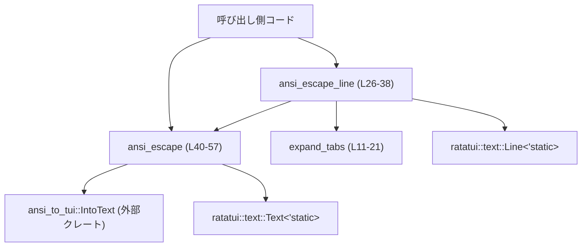
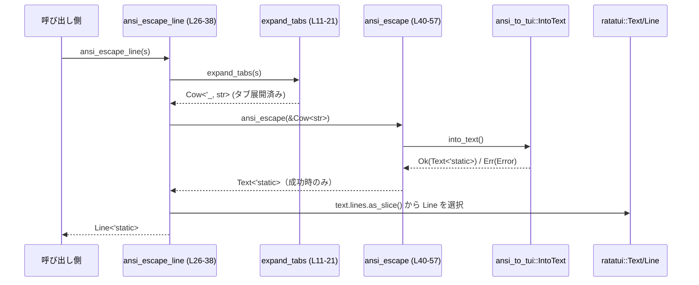

# ansi-escape/src/lib.rs

## 0. ざっくり一言

ANSI エスケープシーケンスを含む文字列を、`ratatui` の `Text<'static>` および `Line<'static>` に変換するユーティリティ関数を提供するモジュールです。  
タブ文字の展開や、1 行専用のヘルパーも含まれます。

---

## 1. このモジュールの役割

### 1.1 概要

- このモジュールは **ANSI エスケープを解釈して TUI 用のテキスト型に変換する** 問題を解決するために存在し、以下の機能を提供します。
  - `&str` を `ratatui::text::Text<'static>` に変換する関数 `ansi_escape`（公開）  
    （`ansi-escape/src/lib.rs:L40-57`）
  - 1 行用の `ratatui::text::Line<'static>` を返す関数 `ansi_escape_line`（公開）  
    （`ansi-escape/src/lib.rs:L26-38`）
  - タブ文字をスペースに展開する内部ヘルパー `expand_tabs`（非公開）  
    （`ansi-escape/src/lib.rs:L11-21`）

いずれも安全な Rust のみで実装されており、`ansi_to_tui` と `ratatui` に依存しています。

### 1.2 アーキテクチャ内での位置づけ

このモジュールは、呼び出し側（TUI/CLI ログ表示など）と外部クレート `ansi_to_tui` / `ratatui` の仲介役になっています。



- 呼び出し側は通常、`ansi_escape` か `ansi_escape_line` のどちらかのみを直接呼び出します。
- `ansi_escape` は `ansi_to_tui::IntoText` トレイトの `into_text` を使い、ANSI 文字列をパースして `Text<'static>` を構築します（`ansi-escape/src/lib.rs:L40-45`）。
- `ansi_escape_line` は `ansi_escape` の結果から 1 行だけを取り出します（`ansi-escape/src/lib.rs:L29-37`）。

### 1.3 設計上のポイント

- **責務の分割**
  - タブ展開（視覚的な整形）を `expand_tabs` に切り出しています（`ansi-escape/src/lib.rs:L11-21`）。
  - ANSI パースと `Text` 構築はすべて `ansi_escape` に集約されています（`ansi-escape/src/lib.rs:L40-57`）。
  - 「1 行だけ欲しい」ケース用のロジックは `ansi_escape_line` に分離されています（`ansi-escape/src/lib.rs:L26-38`）。
- **状態を持たない**
  - グローバル状態や内部の可変状態は持たず、どの関数も入力 `&str` に対して出力を返す純粋関数（ロギングとパニックを除く）になっています。
- **エラーハンドリング方針**
  - `ansi_to_tui::IntoText::into_text` が返すエラーはログに出力した上で `panic!()` しています（`ansi-escape/src/lib.rs:L45-55`）。  
    利用側からは `Result` ではなく「失敗したらパニックする API」として見えます。
- **ライフタイム設計**
  - 戻り値は `Text<'static>` / `Line<'static>` であり、入力文字列のライフタイムから独立して使える所有データを返します。

---

## 2. 主要な機能一覧

| 機能 | 説明 | 実装位置 |
|------|------|----------|
| ANSI 文字列 → `Text<'static>` 変換 | `ansi_to_tui` を用いて ANSI エスケープをパースし、`ratatui::text::Text<'static>` を生成する | `ansi_escape`（`ansi-escape/src/lib.rs:L40-57`） |
| ANSI 文字列（1 行想定） → `Line<'static>` 変換 | 1 行だけを想定した入力から `ratatui::text::Line<'static>` を返す。複数行なら警告ログを出し先頭行のみ返す | `ansi_escape_line`（`ansi-escape/src/lib.rs:L26-38`） |
| タブ展開 | 文字列中の `'\t'` を 4 つのスペースに置き換える | `expand_tabs`（`ansi-escape/src/lib.rs:L11-21`） |

---

## 3. 公開 API と詳細解説

### 3.1 型一覧（構造体・列挙体など）

本モジュール内で新たに定義されている型はありません。外部クレートの型を返り値・エラーとして利用します。

| 名前 | 種別 | 役割 / 用途 | 使用位置 |
|------|------|-------------|----------|
| `ratatui::text::Text<'static>` | 構造体（外部クレート） | ANSI パース済みの複数行テキストを表現 | `ansi_escape` の戻り値（`ansi-escape/src/lib.rs:L40`） |
| `ratatui::text::Line<'static>` | 構造体（外部クレート） | 1 行分のテキストを表現 | `ansi_escape_line` の戻り値（`ansi-escape/src/lib.rs:L26`） |
| `ansi_to_tui::Error` | 列挙体（外部クレート） | ANSI パース時のエラー種別（`NomError` / `Utf8Error`） | `ansi_escape` 内のマッチ対象（`ansi-escape/src/lib.rs:L45-55`） |

---

### 3.2 関数詳細

#### `pub fn ansi_escape(s: &str) -> Text<'static>`

**概要**

- ANSI エスケープシーケンスを含む UTF-8 文字列 `s` を、`ansi_to_tui::IntoText` を用いて `ratatui::text::Text<'static>` に変換します（`ansi-escape/src/lib.rs:L40-45`）。
- 変換に失敗した場合は、ログを出力して `panic!()` します（`ansi-escape/src/lib.rs:L45-55`）。

**引数**

| 引数名 | 型 | 説明 |
|--------|----|------|
| `s` | `&str` | ANSI エスケープシーケンスを含む UTF-8 文字列。`IntoText` トレイトが実装されている想定です。 |

**戻り値**

- 型: `ratatui::text::Text<'static>`  
- 意味: ANSI エスケープシーケンスが解釈されたテキスト。ANSI による色やスタイルは `Text` 内部のスパン情報として反映されます（挙動は `ansi_to_tui` と `ratatui` に依存）。

**内部処理の流れ（アルゴリズム）**

1. `s.into_text()` を呼び出し、`ansi_to_tui` によるパースと `Text<'static>` への変換を試みます（`ansi-escape/src/lib.rs:L43`）。
2. `Ok(text)` の場合は、その `text` をそのまま返します（`ansi-escape/src/lib.rs:L44`）。
3. `Err(err)` の場合は、`Error` のバリアントごとに分岐します（`ansi-escape/src/lib.rs:L45`）。
   - `Error::NomError(message)` の場合  
     - `tracing::error!` でエラーメッセージをログ出力します（`ansi-escape/src/lib.rs:L47-49`）。  
       ログメッセージには元の入力 `s` と `message` が含まれます。
     - その後 `panic!()` を呼びます（`ansi-escape/src/lib.rs:L50`）。
   - `Error::Utf8Error(utf8error)` の場合  
     - `tracing::error!` で UTF-8 エラーの内容をログ出力します（`ansi-escape/src/lib.rs:L52-53`）。
     - その後 `panic!()` を呼びます（`ansi-escape/src/lib.rs:L54`）。

**Examples（使用例）**

ANSI 付き文字列を `Text<'static>` に変換する基本例です。

```rust
use ansi_escape::ansi_escape;                    // 本モジュールの関数をインポートする
use ratatui::text::Text;                         // 戻り値の型

fn main() {
    // 赤色の "Error" を表す ANSI 文字列
    let input = "\x1b[31mError\x1b[0m";         // "\x1b[31m" は赤色開始、"\x1b[0m" はリセット

    // ANSI を解釈して Text<'static> に変換
    let text: Text<'static> = ansi_escape(input); // 失敗した場合は panic する

    // ここで `text` を ratatui の描画処理に渡して利用できる想定
    // （例: パラグラフやスパンへの埋め込みなど。詳細は ratatui の API に依存）
}
```

**Errors / Panics**

- 関数シグネチャとしては `Result` を返さず、常に `Text<'static>` を返します。
- ただし内部で以下の場合に **必ず `panic!()`** します。
  - `s.into_text()` が `Error::NomError(message)` を返した場合（`ansi-escape/src/lib.rs:L46-50`）
  - `s.into_text()` が `Error::Utf8Error(utf8error)` を返した場合（`ansi-escape/src/lib.rs:L52-54`）
- ログは `tracing::error!` によって出力されます（`ansi-escape/src/lib.rs:L47-48`, `L52-53`）。

**Edge cases（エッジケース）**

- **空文字列 `""`**  
  - `into_text` の挙動は `ansi_to_tui` に依存しますが、本関数内で特別扱いはありません。  
    成功すれば空の（または 1 行だけの）`Text` が返ると考えられます。  
    ※具体的なライン数やスパン構造は、このチャンクからは分かりません。
- **ANSI エスケープが壊れている文字列**  
  - `ansi_to_tui` のパーサが `Error::NomError` を返す可能性があります。その場合はログ出力後に `panic!()` します。
- **UTF-8 でないデータ**  
  - 関数の引数は `&str` であり、呼び出し時点で UTF-8 として正当性が保証されています。  
    それでも `Error::Utf8Error` が返される場合は、`ansi_to_tui` 内部処理によるものです。  
    この場合もログ出力後に `panic!()` します（`ansi-escape/src/lib.rs:L52-54`）。

**使用上の注意点**

- **パニックの扱い**
  - ユーザー入力や外部環境からの不正な文字列をそのまま渡すと、`ansi_to_tui` の仕様次第で `panic!()` に到達する可能性があります。  
    アプリケーション全体を落としたくない場合は、呼び出しの前段で入力を制限するか、別途ラッパー関数（`Result` を返すなど）を用意する必要があります。
- **スレッド安全性**
  - 関数は共有可変状態を持たず、`tracing` のロギング以外は純粋計算であるため、複数スレッドから同時に呼び出してもデータ競合は発生しません（Rust の安全な API のみを使用しているため）。
- **パフォーマンス**
  - パフォーマンスの支配要因は `ansi_to_tui::IntoText::into_text` の実装です。  
  - コメントによれば、より高速とされる `to_text()` をあえて使っておらず、「複雑なライフタイム問題を避ける」設計になっています（`ansi-escape/src/lib.rs:L41-42`）。

---

#### `pub fn ansi_escape_line(s: &str) -> Line<'static>`

**概要**

- 文字列 `s` を 1 行分の `Line<'static>` に変換するヘルパーです（`ansi-escape/src/lib.rs:L26`）。
- 入力は「単一行であること」を前提としていますが、実際に複数行になった場合も安全に動作し、警告ログを出して先頭行だけを返します（`ansi-escape/src/lib.rs:L31-37`）。
- タブ文字は固定幅 4 スペースに展開されます（`ansi-escape/src/lib.rs:L27-28`）。

**引数**

| 引数名 | 型 | 説明 |
|--------|----|------|
| `s` | `&str` | ANSI エスケープを含む 1 行想定の UTF-8 文字列。内部でタブ展開が行われます。 |

**戻り値**

- 型: `ratatui::text::Line<'static>`  
- 意味: ANSI エスケープが解釈された 1 行分のテキスト。  
  実際には `ansi_escape` の結果 (`Text<'static>`) から適切な行を抜き出したものです。

**内部処理の流れ（アルゴリズム）**

1. `expand_tabs(s)` を呼び出し、タブ文字 `'\t'` を 4 つのスペースに置き換えた `Cow<'_, str>` を取得します（`ansi-escape/src/lib.rs:L27-28`）。
2. `ansi_escape(&s)` を呼び出し、ANSI パース済みの `Text<'static>` を得ます（`ansi-escape/src/lib.rs:L29`）。
3. `text.lines.as_slice()` に対してパターンマッチを行い、行数に応じて分岐します（`ansi-escape/src/lib.rs:L30-36`）。
   - `[]`（行が 0 件）の場合:  
     - `""` から `Line<'static>` を生成して返します（`ansi-escape/src/lib.rs:L31`）。
   - `[only]`（行が 1 件だけ）の場合:  
     - その `only` を `clone()` して返します（`ansi-escape/src/lib.rs:L32`）。
   - `[first, rest @ ..]`（2 行以上）の場合:  
     - `tracing::warn!` で、先頭行 `first` と残りの行 `rest` を含む警告ログを出力します（`ansi-escape/src/lib.rs:L34`）。
     - 先頭行 `first` を `clone()` して返します（`ansi-escape/src/lib.rs:L35`）。

**Examples（使用例）**

1 行のログメッセージとして利用する例です。

```rust
use ansi_escape::ansi_escape_line;              // 本モジュールの関数をインポートする
use ratatui::text::Line;                        // 戻り値の型

fn main() {
    // タブと ANSI 色付きの 1 行メッセージ
    let input = "\t\x1b[32mOK\x1b[0m";         // 先頭にタブがあり、"OK" が緑色になる ANSI 文字列

    // タブ展開 + ANSI パース → Line<'static>
    let line: Line<'static> = ansi_escape_line(input);

    // `line` をステータスバーなど 1 行だけを表示する箇所で利用できる想定
}
```

複数行になった場合の挙動イメージです（警告が出て先頭行のみ返されます）。

```rust
use ansi_escape::ansi_escape_line;

fn main() {
    // 2 行の ANSI 文字列
    let input = "first line\nsecond line";

    // 複数行だが、関数は先頭行だけを返す
    let line = ansi_escape_line(input);

    // `line` は "first line" に対応する Line<'static> になる想定
    // このとき、tracing::warn! で「複数行だった」という警告がログに出る
}
```

**Errors / Panics**

- この関数自身は `Result` を返さず、戻り値として必ず `Line<'static>` を返します。
- ただし内部で呼ぶ `ansi_escape` がエラー時に `panic!()` を起こすため、結果として本関数の呼び出しもパニックになる可能性があります（`ansi-escape/src/lib.rs:L29`, `L40-55`）。

**Edge cases（エッジケース）**

- **空文字列 `""`**
  - `ansi_escape` が `Text` をどのように構築するかは `ansi_to_tui` に依存しますが、`text.lines` が空ベクタの場合は `""` から `Line<'static>` が生成されて返ります（`ansi-escape/src/lib.rs:L31`）。
- **タブ文字を含む入力**
  - すべての `'\t'` は 4 つのスペース `"    "` に置き換えられます（`ansi-escape/src/lib.rs:L12-19`, `L27-28`）。
  - タブ幅やタブ位置に応じた整列（いわゆるタブストップ）は行われません（コメントより、`ansi-escape/src/lib.rs:L13-16`）。
- **改行を含む入力（複数行）**
  - `Text` 内の行数が 2 行以上になった場合、先頭行だけを返しつつ警告ログが出力されます（`ansi-escape/src/lib.rs:L33-35`）。
  - 残りの行は破棄され、戻り値からはアクセスできません。
- **行が 0 件の `Text`**
  - 通常は発生しにくいケースですが、`text.lines` が空の場合を明示的にハンドリングし、空行を返します（`ansi-escape/src/lib.rs:L31`）。

**使用上の注意点**

- **1 行専用 API**
  - 複数行の入力を与えると先頭行以外が無視されるため、ログ／ステータスバーなど「1 行だけ表示したい」用途に限定されます。
- **ログノイズの可能性**
  - 入力が複数行になることが頻繁にある場合、`tracing::warn!` により大量の警告ログが出力される可能性があります（`ansi-escape/src/lib.rs:L34`）。
- **スレッド安全性**
  - `ansi_escape` と同様、関数自体は純粋であり、複数スレッドから同時に呼び出しても問題ありません。  
    ただし `tracing` のログ設定はアプリケーション全体で共有されます。

---

### 3.3 その他の関数

| 関数名 | シグネチャ | 役割（1 行） | 実装位置 |
|--------|------------|--------------|----------|
| `expand_tabs` | `fn expand_tabs(s: &str) -> std::borrow::Cow<'_, str>` | 文字列内のタブ文字を 4 つのスペースへと単純置換するヘルパー。内部でのみ使用。 | `ansi-escape/src/lib.rs:L11-21` |

`expand_tabs` の動作要点:

- `s` に `'\t'` が含まれている場合
  - `s.replace('\t', "    ")` を実行し、その結果を `Cow::Owned` として返します（`ansi-escape/src/lib.rs:L12-17`）。
- `s` に `'\t'` が含まれていない場合
  - 元の `&str` を `Cow::Borrowed` として返します（`ansi-escape/src/lib.rs:L18-19`）。

この設計により、「タブがない場合はコピーを避ける」「タブがある場合だけ新しい `String` を確保する」という最適化が行われています。

---

## 4. データフロー

ここでは、`ansi_escape_line` を用いて 1 行のテキストを生成する代表的なフローを説明します。

1. 呼び出し側が `ansi_escape_line(input)` を呼ぶ（`ansi-escape/src/lib.rs:L26`）。
2. `expand_tabs(input)` によってタブがスペースに展開される（`ansi-escape/src/lib.rs:L27-28`, `L11-21`）。
3. 展開後の文字列が `ansi_escape(&s)` に渡され、`Text<'static>` に変換される（`ansi-escape/src/lib.rs:L29`, `L40-45`）。
4. `text.lines` から必要な 1 行が選択される（`ansi-escape/src/lib.rs:L30-36`）。
5. 選択された `Line<'static>` が呼び出し側に返却される。



- エラーが発生した場合は `A` (`ansi_escape`) の内部でログ出力と `panic!()` が行われ、戻り値は返りません。
- このファイルにはテストコードやモジュール境界に関する追加情報は含まれていません（`ansi-escape/src/lib.rs:L1-58`）。

---

## 5. 使い方（How to Use）

### 5.1 基本的な使用方法

ANSI 付きの 1 行メッセージを TUI で表示することを想定した基本的な流れの例です。

```rust
use ansi_escape::{ansi_escape, ansi_escape_line};   // 本モジュールの公開関数をインポートする
use ratatui::text::{Text, Line};                    // 戻り値の型

fn main() {
    // 1. 入力文字列を用意する（ANSI エスケープ付き）
    let msg = "\t\x1b[33mWarning\x1b[0m: something happened";

    // 2. 1 行用の Line<'static> が欲しい場合
    let line: Line<'static> = ansi_escape_line(msg); // タブ展開 + ANSI パース + 1 行抽出

    // 3. 複数行を考慮した Text<'static> が欲しい場合
    let text: Text<'static> = ansi_escape(msg);      // ANSI パースのみ（複数行も保持）

    // 4. これらの値を ratatui の描画に渡して利用することができる
    //    （具体的なウィジェットの組み立てはこのファイルからは分かりません）
}
```

### 5.2 よくある使用パターン

- **ログ行・ステータス表示に使う**
  - 入力が 1 行であることが分かっている（あるいは想定している）場合は `ansi_escape_line` を利用し、`Line<'static>` として扱うと、1 行表示のウィジェットに渡しやすくなります。
- **複数行の出力を TUI で描画する**
  - シェルコマンドの出力など、複数行をそのまま描画したい場合は `ansi_escape` を用いて `Text<'static>` を取得し、それを行単位で利用します。

### 5.3 よくある間違い

```rust
use ansi_escape::ansi_escape_line;

// 間違い例: 複数行の文字列を 1 行専用関数に渡している
fn wrong() {
    let multi = "line1\nline2\nline3";
    let line = ansi_escape_line(multi);       // 実行は成功するが、先頭行しか残らない
    // line2, line3 は破棄される。さらに tracing::warn! で警告ログが出る。
}

// 正しい例: 複数行を扱いたい場合は Text<'static> を使う
use ansi_escape::ansi_escape;
use ratatui::text::Text;

fn correct() {
    let multi = "line1\nline2\nline3";
    let text: Text<'static> = ansi_escape(multi);   // 複数行を保持する
    // text.lines を使って行ごとの描画を行うなどの使い方が想定される
}
```

### 5.4 使用上の注意点（まとめ）

- **パニックの可能性**
  - `ansi_escape` / `ansi_escape_line` は内部で `panic!()` を呼びうるため、信頼できない入力に直接適用するとアプリケーション停止のリスクがあります。
- **タブ幅固定**
  - タブ文字は常に 4 スペースに置き換えられます。実際のターミナルのタブ幅やレイアウトとは一致しない場合があります。
- **複数行入力の扱い**
  - `ansi_escape_line` は複数行入力を許容しますが、先頭行以外は破棄されるため、「必ず 1 行だけになる」ことを期待する場所で使用する前提が暗黙の契約になっています。
- **スレッドセーフ**
  - 関数はどれも内部状態を持たず、`unsafe` も使用していないため、並行呼び出しに伴うメモリ安全性の問題はありません。

---

## 6. 変更の仕方（How to Modify）

### 6.1 新しい機能を追加する場合

例: タブ幅をカスタマイズできる API を追加したい場合。

1. **ヘルパーの追加**
   - `expand_tabs` と同じファイルに、新しいヘルパー（例: `expand_tabs_with_width(s: &str, width: usize)`）を追加するのが自然です。
2. **公開 API の設計**
   - 既存の `ansi_escape_line` / `ansi_escape` のシグネチャはそのままに、新しい関数（例: `ansi_escape_line_with_tabs(s: &str, width: usize)`）を公開する形が、後方互換性の観点で安全です。
3. **既存処理の再利用**
   - 可能であれば、新関数からは `ansi_escape` を再利用する形にし、タブ展開部分のみ新ヘルパーに差し替えると、パースロジックを一元化できます。

### 6.2 既存の機能を変更する場合

- **`ansi_escape` のエラー処理を変更する**
  - `panic!()` ではなく `Result<Text<'static>, Error>` を返すように変更すると、呼び出し側の全てでシグネチャの変更に追随する必要があります。
  - 既存の呼び出し側が「パニック前提」で書かれている場合、その前提が崩れることになるので注意が必要です。
- **`ansi_escape_line` の複数行処理の変更**
  - 現在は「警告ログを出しつつ先頭行だけを返す」挙動です（`ansi-escape/src/lib.rs:L33-35`）。
  - 「複数行ならエラーにする」「結合して 1 行にする」などの挙動に変更すると、既存コードが黙って挙動変更の影響を受ける可能性があります。
- **テストの追加**
  - このチャンクにはテストコードが含まれていません（`ansi-escape/src/lib.rs:L1-58`）。  
    変更を行う場合は、別ファイル（例: `tests/` ディレクトリや `src/lib.rs` 内の `#[cfg(test)]` モジュール）に対して、以下のケースのテストを追加することが有効です。
    - タブを含む／含まない入力
    - 空文字列
    - 複数行入力（`ansi_escape_line` の挙動確認）
    - `ansi_to_tui` によるエラーが起こり得るケース（再現可能であれば）

---

## 7. 関連ファイル

このチャンクには同一クレート内の他ファイルへの直接の参照は現れませんが、外部クレートへの依存が確認できます。

| パス / クレート | 役割 / 関係 |
|-----------------|------------|
| `ansi_to_tui` | `IntoText` トレイトと `Error` 型を提供し、ANSI 文字列から `ratatui::Text` への変換ロジックを担います（`ansi-escape/src/lib.rs:L1-2`, `L43-45`）。 |
| `ratatui::text` | `Text<'static>` と `Line<'static>` 型を提供し、本モジュールの戻り値として使用されます（`ansi-escape/src/lib.rs:L3-4`, `L26`, `L40`）。 |
| `tracing` | ロギングマクロ `tracing::warn!` / `tracing::error!` を提供し、異常系の観測性を高めています（`ansi-escape/src/lib.rs:L34`, `L47-48`, `L52-53`）。 |

その他、このファイルからはテストコードやモジュール階層構造に関する情報は読み取れません。
