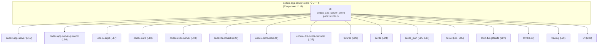
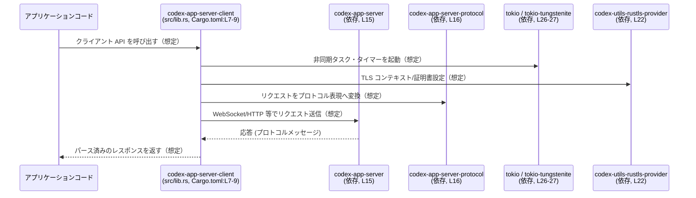

# app-server-client/Cargo.toml コード解説

## 0. ざっくり一言

`app-server-client/Cargo.toml` は、ライブラリクレート `codex-app-server-client` の **パッケージ情報・ライブラリターゲット・依存クレート** を定義する設定ファイルです (Cargo.toml:L1-5, L7-9, L14-35)。

---

## 1. このモジュールの役割

### 1.1 概要

- このファイルは、Rust プロジェクトのパッケージマネージャーである Cargo 用の設定ファイルです。
- `codex-app-server-client` というクレートの名前・ライブラリターゲット・依存関係を定義しています (Cargo.toml:L1-5, L7-9, L14-35)。
- バージョン・edition・license はワークスペース共通設定を再利用しています (Cargo.toml:L3-5)。

### 1.2 アーキテクチャ内での位置づけ

このファイルは **実行ロジックではなくビルド設定** を定義します。  
ただし、依存関係の一覧から、このクレートがどのコンポーネントに依存しているかを把握できます (Cargo.toml:L14-35)。

以下は、このクレートと依存クレートの関係を表す概念図です。



※ どのような関数・メソッドからこれらのクレートが呼ばれているかは、このファイルからは分かりません。実際の呼び出しは `src/lib.rs` など Rust ソース側にあります (Cargo.toml:L9)。

### 1.3 設計上のポイント

コードではなく設定から読み取れる設計上の特徴は次のとおりです。

- **ワークスペース統合**
  - バージョン・edition・license をワークスペースから継承しています (Cargo.toml:L3-5)。
  - lints（コンパイラ警告ポリシー）もワークスペース設定に従います (Cargo.toml:L11-12)。
- **ライブラリクレートとしての提供**
  - `[lib]` セクションにより、`codex_app_server_client` というライブラリターゲットを `src/lib.rs` で定義しています (Cargo.toml:L7-9)。
- **依存の多くをワークスペース管理**
  - すべての依存が `{ workspace = true }` とされており (Cargo.toml:L14-30, L32-35)、バージョン管理はワークスペースルートで一元化されています。
- **非同期・ネットワーク指向のスタック**
  - `tokio`、`tokio-tungstenite`、`codex-utils-rustls-provider` などの依存から、非同期 I/O・WebSocket・TLS を用いるコードがこのクレート内に存在する可能性が高いと推測されます (Cargo.toml:L22, L26-27)。
  - ただし、具体的にどの API を使っているかは、このチャンクからは分かりません。
- **観測性のための基盤**
  - `tracing` 依存が追加されており、このクレート内で構造化ログなどの計測が行われている可能性があります (Cargo.toml:L29)。

### 1.4 コンポーネントインベントリー（本チャンク）

このファイルから直接読み取れるコンポーネント（クレート・ターゲット・依存）の一覧です。

| 種別 | 名前 | 説明 | 定義行 |
|------|------|------|--------|
| パッケージ | `codex-app-server-client` | Cargo パッケージ名 | Cargo.toml:L1-2 |
| ライブラリターゲット | `codex_app_server_client` | `src/lib.rs` をエントリポイントとするライブラリクレート | Cargo.toml:L7-9 |
| 依存クレート | `codex-app-server` | アプリケーションサーバー側ロジックに関するクレート（用途は名前からの推測） | Cargo.toml:L15 |
| 依存クレート | `codex-app-server-protocol` | サーバープロトコル定義クレートと推測 | Cargo.toml:L16 |
| 依存クレート | `codex-arg0` | 詳細不明（名前のみ） | Cargo.toml:L17 |
| 依存クレート | `codex-core` | Codex のコア機能クレートと推測 | Cargo.toml:L18 |
| 依存クレート | `codex-exec-server` | 実行サーバー関連クレートと推測 | Cargo.toml:L19 |
| 依存クレート | `codex-feedback` | フィードバック関連クレートと推測 | Cargo.toml:L20 |
| 依存クレート | `codex-protocol` | 共通プロトコルクレートと推測 | Cargo.toml:L21 |
| 依存クレート | `codex-utils-rustls-provider` | Rustls ベースの TLS 機能を提供するユーティリティクレートと推測 | Cargo.toml:L22 |
| 依存クレート | `futures` | 非同期処理のための共通トレイト群 | Cargo.toml:L23 |
| 依存クレート | `serde` | シリアライズ/デシリアライズ用フレームワーク | Cargo.toml:L24 |
| 依存クレート | `serde_json` | JSON シリアライズ/デシリアライズ | Cargo.toml:L25, L34 |
| 依存クレート | `tokio` | 非同期ランタイム (`sync`, `time`, `rt` 機能を使用) | Cargo.toml:L26 |
| 依存クレート | `tokio-tungstenite` | Tokio 上の WebSocket 実装 | Cargo.toml:L27 |
| 依存クレート | `toml` | TOML パーサー | Cargo.toml:L28 |
| 依存クレート | `tracing` | 構造化ログ・トレース | Cargo.toml:L29 |
| 依存クレート | `url` | URL パース・操作 | Cargo.toml:L30 |
| 開発用依存 | `pretty_assertions` | テスト時のアサーション比較表示改善用 | Cargo.toml:L33 |
| 開発用依存 | `tokio` | テスト用に `macros`, `rt-multi-thread` を有効化 | Cargo.toml:L35 |

※ 役割が「推測」とあるものは、名前からの一般的な推測であり、このチャンクだけからは断定できません。

---

## 2. 主要な機能一覧

この Cargo.toml 自体は機能を実装しませんが、**クレート名と依存関係から想定される役割**を整理します。  
※ 以下は推測であり、実際の公開 API・挙動は `src/lib.rs` などの実装を確認する必要があります。

- アプリケーションサーバークライアント機能:  
  - `codex-app-server` / `codex-app-server-protocol` に依存していることから、アプリケーションサーバーと通信するクライアントロジックを含む可能性があります (Cargo.toml:L15-16)。
- 非同期・WebSocket ベースの通信:  
  - `tokio` と `tokio-tungstenite` に依存しているため、Tokio ランタイム上で WebSocket 通信を行う処理が存在する可能性があります (Cargo.toml:L26-27)。
- TLS を用いた安全な接続:  
  - `codex-utils-rustls-provider` 依存から、Rustls による TLS 設定や接続を扱うコードが含まれると推測されます (Cargo.toml:L22)。
- シリアライズ/設定読み書き:  
  - `serde`, `serde_json`, `toml`, `url` から、JSON や TOML 設定、URL パラメータなどのパースを行う処理があると考えられます (Cargo.toml:L24-25, L28, L30)。
- ロギング / トレース:  
  - `tracing` 依存により、実装内でトレースログの出力が行われている可能性があります (Cargo.toml:L29)。

**重要:**  
このチャンクには Rust のソースコードが含まれていないため、具体的な関数名・メソッド名・API は不明です。

---

## 3. 公開 API と詳細解説

### 3.1 型一覧（構造体・列挙体など）

このファイルは **Cargo 設定ファイル** であり、Rust の構造体・列挙体などの型定義は一切含まれていません。  
したがって、このチャンクだけからは公開型の一覧を作成できません。

- 公開 API や型は、`[lib]` で指定された `src/lib.rs` などの Rust ソースファイルに存在します (Cargo.toml:L7-9)。

#### 3.1.1 関数・構造体インベントリー（本チャンク）

| 種別 | 名前 | 定義位置 | 根拠 |
|------|------|----------|------|
| なし | なし | なし | このファイルは TOML 設定であり、Rust の関数・構造体定義を含みません (Cargo.toml:L1-35 全体)。 |

### 3.2 関数詳細（最大 7 件）

- このチャンクには Rust 関数の定義がないため、**公開関数の詳細解説は行えません**。
- 実際のコアロジックや公開 API は `src/lib.rs` などに定義されていますが、その内容はこのチャンクには現れません (Cargo.toml:L9)。

### 3.3 その他の関数

- 同様に、このファイル単体からは補助的な関数やラッパー関数の存在も分かりません。

---

## 4. データフロー

### 4.1 このファイルから分かるレベルのデータフロー

Cargo.toml 自体は実行時のデータを扱いませんが、依存関係から **クレート間の概念的なデータフロー**を推測できます。

以下は、「アプリケーションコード → 本クレート → サーバー関連クレート」という想定上のシーケンス図です。  
※ すべて「想定」であり、このファイルから直接確定できるわけではありません。



**注意点**

- 実際のデータ型（構造体・列挙体）やメソッド呼び出しは、このチャンクには現れていません。
- したがって、上記フローは依存クレート名からの一般的な推測に過ぎません。

---

## 5. 使い方（How to Use）

### 5.1 基本的な使用方法（Cargo 観点）

このファイル自体はライブラリ側の設定です。  
このクレートを **利用する側** の典型的な流れは次のようになります（一般的な Cargo の使い方）。

1. 他のクレートの `Cargo.toml` に依存として追加する（例）:

   ```toml
   [dependencies]
   codex-app-server-client = { path = "../app-server-client" } # 例: 同一ワークスペース内の場合
   ```

2. Rust コード側でクレートをインポートする:

   ```rust
   // クレートを bring into scope する
   use codex_app_server_client; // 実際にどの型/関数を使うかはソースを要確認

   fn main() {
       // ここで codex_app_server_client 内の公開 API を呼び出す
       // 具体的な関数・型名はこの Cargo.toml からは分かりません
   }
   ```

3. （多くの場合）Tokio ランタイム上で実行する  
   - 本クレートが `tokio` を依存に持ち (`rt` 機能を有効化) しているため (Cargo.toml:L26)、非同期 API が存在する可能性が高く、その場合は `#[tokio::main]` などでランタイムを起動する必要があります。
   - ただし、実際にどの程度 Tokio に依存した API になっているかは、このチャンクからは分かりません。

### 5.2 よくある使用パターン（想定）

このチャンクだけでは API 形状は分かりませんが、依存関係から典型的なパターンを推測できます。

- **非同期クライアントとして使用**
  - アプリケーション側が `tokio` のマルチスレッドランタイムを起動し (一般的には `rt-multi-thread`、テストでは dev-deps で有効化、Cargo.toml:L35)、`codex_app_server_client` の非同期関数を `await` する形。
- **設定ファイル＋シリアライズ**
  - `toml` と `serde` を使ってクライアント設定を読み込み、`serde_json` を通じてサーバーと JSON 形式でデータをやりとりするようなパターンが想定されます (Cargo.toml:L24-25, L28)。

これらはあくまで典型例であり、実クレートの API 確認が必要です。

### 5.3 よくある間違い（Cargo 設定・ランタイム）

この Cargo 設定から推測される、利用時に起きやすいミスを挙げます。

- **Tokio ランタイムを起動せずに非同期 API を使おうとする**
  - 本クレートが `tokio` に依存している (Cargo.toml:L26, L35) ため、内部で非同期 I/O を行っている場合、ランタイムが初期化されていないと実行時エラーとなる可能性があります。
  - ただし、実際に非同期 API を公開しているかは、このチャンクからは不明です。
- **Traces/Logs を収集しない**
  - `tracing` が依存に含まれている (Cargo.toml:L29) ものの、アプリケーション側で `tracing-subscriber` などを設定していないとログが可視化されない場合があります。
  - `tracing-subscriber` の依存はこのファイルには見えないため、どのようにロギングしているかは不明です。

#### 間違い例（概念的）

```rust
// （想定）非同期 API を同期 main から直接呼ぶ
fn main() {
    // let client = codex_app_server_client::Client::new(); // 仮の API 名（実在は不明）
    // let resp = client.request(...).await; // コンパイルエラー or ランタイムエラー
}
```

#### 正しい例（概念的）

```rust
// 実際には src/lib.rs 内の API 定義に合わせる必要があります
#[tokio::main] // マルチスレッドランタイムを起動する例（依存からの一般的な利用）
async fn main() {
    // let client = codex_app_server_client::Client::new();
    // let resp = client.request(...).await;
}
```

※ 上記コードの型名・メソッド名は説明用の仮名です。この Cargo.toml からは実際の API は分かりません。

### 5.4 使用上の注意点（まとめ）

**Cargo / ビルド設定上の注意**

- 依存はすべて `{ workspace = true }` になっているため、ワークスペースルートの `Cargo.toml` でバージョンや features を変更すると、このクレートにも影響します (Cargo.toml:L3-5, L14-30, L32-35)。
- ライブラリ名 (`codex_app_server_client`) を変更すると、利用側の `use` パスや依存指定がすべて変更を要します (Cargo.toml:L7-8)。

**並行性・ランタイムに関する注意（推測を含む）**

- `tokio` の `rt` 機能が有効になっているため (Cargo.toml:L26)、Tokio ランタイムと `Send + 'static` 制約を前提にした API が存在する可能性があります。
- dev-dependencies では `rt-multi-thread` が有効化されている (Cargo.toml:L35) ため、テストコードはマルチスレッドランタイム前提になっている可能性があります。

**セキュリティ・TLS に関する注意（推測を含む）**

- `codex-utils-rustls-provider` 依存 (Cargo.toml:L22) から、TLS / Rustls を用いた通信を行うと推測されます。
  - 実装側では証明書の検証や CA 設定をどのように行っているかが重要ですが、このチャンクからは不明です。
- ネットワーククライアントとして利用する場合、証明書検証を無効化するような API が存在する場合は慎重に扱う必要がありますが、その有無はこのファイルからは読み取れません。

---

## 6. 変更の仕方（How to Modify）

### 6.1 新しい機能を追加する場合

**1. Rust コード側の追加**

- 新しい機能のコアロジックや公開 API は `src/lib.rs` もしくはサブモジュールに実装します (Cargo.toml:L9)。
- この Cargo.toml だけではコード構造は分かりませんが、標準的なレイアウトでは `src/` 配下にモジュールを追加します。

**2. 依存クレートの追加**

- 新機能で外部クレートが必要な場合は `[dependencies]` に追記します (Cargo.toml:L14-30)。
- ワークスペース全体でバージョンを統一したい場合は、他の依存と同様に `{ workspace = true }` パターンを使い、ワークスペースルート側でバージョンを定義します。

**3. テスト用の依存**

- テスト専用のライブラリ（モック、アサーション補助など）は `[dev-dependencies]` に追加します (Cargo.toml:L32-35)。

### 6.2 既存の機能を変更する場合

**依存の変更に関する注意**

- `tokio` の features を変更すると、非同期処理の前提が変わり、既存コードがコンパイルエラーになる可能性があります (Cargo.toml:L26, L35)。
- `serde_json` を削除した場合、JSON シリアライズ/デシリアライズに依存するコードがコンパイルできなくなります (Cargo.toml:L25, L34)。

**クレート名・ターゲットの変更**

- `[lib]` の `name` を変更すると、利用側の `use codex_app_server_client::...` のようなパスがすべて変更を要します (Cargo.toml:L7-8)。
- `path` (`src/lib.rs`) を変更すると、エントリポイントファイルの場所も変わるため、ディレクトリ構成の変更と合わせて慎重に行う必要があります (Cargo.toml:L9)。

**Contracts / Edge Cases（ビルド設定レベル）**

- ワークスペース設定依存:  
  - `version.workspace = true` などにより、ワークスペースルート側の設定変更がこのクレートの公開バージョン・ライセンスに直接影響します (Cargo.toml:L3-5)。
- features のエッジケース:  
  - ここでは features の個別定義は見られませんが、ワークスペースルートで features を条件コンパイルに使っている場合、このクレートのビルドパスが条件によって変わる可能性があります（このチャンクには現れません）。

---

## 7. 関連ファイル

この Cargo.toml と密接に関係すると思われるファイルやディレクトリをまとめます。

| パス | 役割 / 関係 |
|------|------------|
| `app-server-client/src/lib.rs` | `[lib]` で指定されたライブラリのエントリポイント。公開 API やコアロジックが定義されていると考えられます (Cargo.toml:L7-9)。 |
| ワークスペースルートの `Cargo.toml` | `version.workspace = true` や依存の `{ workspace = true }` の実体を定義するファイル。全クレート共通のバージョン・features・lints 設定を持つと推測されます (Cargo.toml:L3-5, L14-30, L32-35)。 |
| 依存クレート（例: `codex-app-server`, `codex-app-server-protocol` など） | 実際のサーバーロジック・プロトコル定義・TLS ユーティリティなどを提供し、本クレート内のコードから利用されます (Cargo.toml:L15-22)。 |
| テストコード（`tests/` や `src/lib.rs` 内の `#[cfg(test)]`） | `pretty_assertions`、`serde_json`、`tokio`（`macros`, `rt-multi-thread`）といった dev-dependencies を利用していると推測されるテスト群 (Cargo.toml:L32-35)。このチャンクには具体的なテストコードは含まれません。 |

---

### Bugs / Security / Tests / Observability について（このファイルから分かる範囲）

- **Bugs**:  
  - Cargo.toml の記述として明らかな構文エラーや矛盾は見当たりません (Cargo.toml:L1-35)。
- **Security**:  
  - TLS 関連の依存 (`codex-utils-rustls-provider`) が追加されている点は、暗号化通信を意図している可能性を示しますが、検証ポリシーなどの詳細は不明です (Cargo.toml:L22)。
- **Tests**:  
  - `pretty_assertions` や `tokio`（`macros`, `rt-multi-thread`）が dev-dependencies にあるため、非同期テストが存在する可能性が高いと推測されます (Cargo.toml:L33, L35)。
- **Observability**:  
  - `tracing` 依存により、構造化ログ/トレースを用いた観測性が実装されている可能性があります (Cargo.toml:L29)。  
  - ただし、実際にどのイベントを記録しているかはソースコード側を確認する必要があります。

このチャンクは設定情報のみを含むため、公開 API・コアロジック・具体的なエラー処理や並行性制御についての詳細は、`src/lib.rs` などの Rust ソースコードを確認しないと分かりません。
