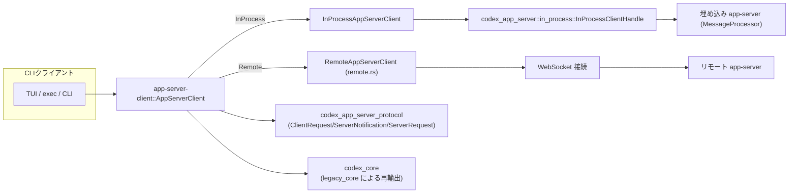
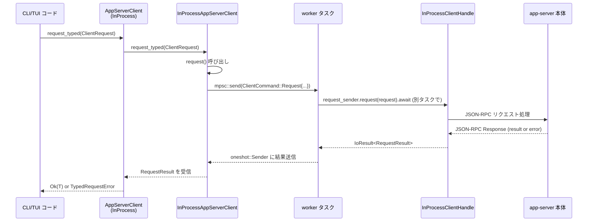
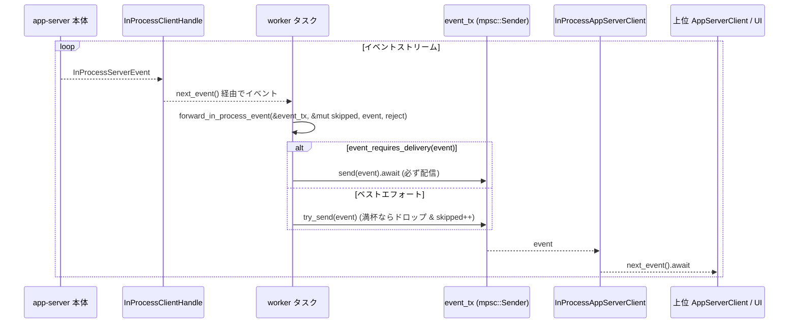

app-server-client/src/lib.rs

---

## 0. ざっくり一言

CLI/TUI などのクライアント用に、アプリケーションサーバー（`codex_app_server`）への **インプロセス／リモート共通の非同期クライアントファサード**を提供するモジュールです。  
JSON-RPC ベースのリクエスト／通知／イベントを、Tokio のチャネルとタスクを使って安全に扱います。

> 注: 指定形式の「行番号 (`Lxx-yy`)」は、このインターフェイスから元ファイルの正確な行番号を取得できないため付与していません。その代わり、コード断片の内容を直接引用して根拠を示します。

---

## 1. このモジュールの役割

### 1.1 概要

このモジュールは **CLI/TUI からアプリケーションサーバーへのやり取り**を一元化するために存在し、次の機能を提供します。

- インプロセスな app-server ランタイムの起動と初期化 (`InProcessAppServerClient`)
- WebSocket 経由のリモート app-server への接続 (`RemoteAppServerClient` の再輸出)
- JSON-RPC ベースの **型付きリクエスト／通知 API**（`request_typed`, `notify`）
- サーバーからクライアントへの **イベントストリームとバックプレッシャ制御**
- サーバーからクライアントへの **request（ユーザー入力等）の解決／拒否**のラウンドトリップ
- `codex_core` への直接依存を減らすためのレガシー API 再輸出（`legacy_core`）

### 1.2 アーキテクチャ内での位置づけ

高レベルでは、次のような位置づけになっています。



- `AppServerClient` が **共通のフロント** で、内部的には InProcess / Remote のどちらかを保持します。
- InProcess 経路では `InProcessAppServerClient` が `InProcessClientHandle` と mpsc チャネルで接続されます。
- Remote 経路では `RemoteAppServerClient`（`mod remote`）が WebSocket 上で JSON-RPC をやり取りします。
- どちらの経路でも、アプリケーションレベルの型は `codex_app_server_protocol` で定義されるものをそのまま利用します。

### 1.3 設計上のポイント

コードから読み取れる主な設計上の特徴は次のとおりです。

- **責務の分離**
  - 起動・初期化パラメータ: `InProcessClientStartArgs`
  - コマンド送信（リクエスト／通知／シャットダウン）: `ClientCommand` + `command_tx`
  - イベント配信・バックプレッシャ処理: `forward_in_process_event`, `event_requires_delivery`
  - InProcess / Remote の多態性: `AppServerClient`, `AppServerRequestHandle`, `AppServerEvent`
- **状態と並行性**
  - `InProcessAppServerClient` は内部に **worker タスク**を持ち、Tokio の `mpsc` と `oneshot` を使って非同期に app-server とやり取りします。
  - イベントキューは **有限長** で、溢れた場合は一部イベントをドロップしつつ `Lagged` マーカーで遅延を通知します。
- **エラーハンドリング**
  - I/O レベルのエラーは `std::io::Error` として扱い、破損したチャネルは `ErrorKind::BrokenPipe` で表現します。
  - JSON-RPC のサーバーエラーとデシリアライズエラーは `TypedRequestError` によって区別されます。
  - リモート接続では WebSocket URL と auth token の組み合わせに対して **明示的なポリシー**（テストで検証）があります。
- **安全性**
  - バックプレッシャ下でも、**会話テキストや完了通知など重要なイベントは決してドロップしない**ように設計されています（`server_notification_requires_delivery`）。

---

## 2. 主要な機能一覧

このモジュールが提供する主な機能を列挙します。

- インプロセス app-server の起動とクライアント生成: `InProcessAppServerClient::start`
- リモート app-server クライアントの再輸出: `RemoteAppServerClient`, `RemoteAppServerConnectArgs`
- 型付きリクエスト API:
  - `InProcessAppServerClient::request_typed`
  - `InProcessAppServerRequestHandle::request_typed`
  - `AppServerClient::request_typed`
  - エラーは `TypedRequestError` で分類
- 生の JSON-RPC 結果を扱うリクエスト API: `request` / `RequestResult`
- クライアント通知送信: `notify`
- サーバーからの要求を解決／拒否:
  - `resolve_server_request`
  - `reject_server_request`
- イベントストリームの購読:
  - InProcess: `InProcessAppServerClient::next_event` → `InProcessServerEvent`
  - 共通: `AppServerClient::next_event` → `AppServerEvent`
- バックプレッシャ制御とロスレスイベントの分類:
  - `server_notification_requires_delivery`
  - `event_requires_delivery`
  - `forward_in_process_event`
- レガシー `codex_core` API の再輸出: `legacy_core` モジュール
- JSON-RPC メソッド名抽出ユーティリティ: `request_method_name`

---

## 3. 公開 API と詳細解説

### 3.1 型一覧（構造体・列挙体など）

主要な公開型の一覧です（`pub(crate)` など内部用も含めています）。

| 名前 | 種別 | 公開範囲 | 役割 / 用途 |
|------|------|----------|-------------|
| `RequestResult` | 型エイリアス | `pub` | `Result<JsonRpcResult, JSONRPCErrorError>`。JSON-RPC の結果を I/O レベルのエラーから分離して扱うための基本型。 |
| `AppServerEvent` | enum | `pub` | クライアント側が観測するイベント（遅延マーカー、サーバー通知、サーバー要求、切断）を表す。 |
| `TypedRequestError` | enum | `pub` | 型付きリクエスト (`request_typed`) の失敗理由を Transport / Server / Deserialize に分類する。 |
| `InProcessClientStartArgs` | struct | `pub` | インプロセス app-server 起動に必要な設定・依存（Config, EnvironmentManager, セッション情報など）をまとめた引数。 |
| `InProcessAppServerClient` | struct | `pub` | インプロセス app-server への非同期クライアント。worker タスクとコマンド／イベントチャネルを所有。 |
| `InProcessAppServerRequestHandle` | struct | `pub` | `InProcessAppServerClient` から派生する軽量ハンドル。リクエスト送信専用で `Clone` 可能。 |
| `AppServerRequestHandle` | enum | `pub` | InProcess / Remote 双方を抽象化したリクエストハンドル。 |
| `AppServerClient` | enum | `pub` | InProcess / Remote のクライアントを統一的に扱うためのファサード型。 |
| `ForwardEventResult` | enum | private | イベント転送の結果（継続 / ストリーム無効化）を表す内部状態。 |
| `ClientCommand` | enum | private | worker タスクへのコマンド（request/notify/resolve/reject/shutdown）を表す内部メッセージ型。 |
| `legacy_core` | mod | `pub` | `codex_core` のさまざまな型・関数を再輸出する互換レイヤー。 |
| `RemoteAppServerClient` | struct | `pub` (re-export) | WebSocket 経由のリモート app-server クライアント（実装は `remote.rs`）。 |
| `RemoteAppServerConnectArgs` | struct | `pub` (re-export) | リモート接続パラメータ（WebSocket URL・auth token 等）。 |

内部ユーティリティ:

- `event_requires_delivery(&InProcessServerEvent) -> bool`
- `server_notification_requires_delivery(&ServerNotification) -> bool`
- `forward_in_process_event(...) -> ForwardEventResult`
- `request_method_name(&ClientRequest) -> String`

### 3.2 関数詳細（最大 7 件）

#### 1. `InProcessAppServerClient::start(args: InProcessClientStartArgs) -> IoResult<Self>`

**概要**

インプロセス app-server ランタイムを起動し、クライアント用 worker タスクとチャネル（コマンド／イベント）を初期化して `InProcessAppServerClient` を返します。

**引数**

| 引数名 | 型 | 説明 |
|--------|----|------|
| `args` | `InProcessClientStartArgs` | ランタイム起動に必要なすべての構成情報・依存オブジェクト（Config, EnvironmentManager, セッション情報など） |

`InProcessClientStartArgs` の主なフィールド:

- `arg0_paths: Arg0DispatchPaths`
- `config: Arc<Config>`
- `cli_overrides: Vec<(String, TomlValue)>`
- `loader_overrides: LoaderOverrides`
- `cloud_requirements: CloudRequirementsLoader`
- `feedback: CodexFeedback`
- `environment_manager: Arc<EnvironmentManager>`
- `config_warnings: Vec<ConfigWarningNotification>`
- `session_source: SessionSource`
- `enable_codex_api_key_env: bool`
- `client_name: String`
- `client_version: String`
- `experimental_api: bool`
- `opt_out_notification_methods: Vec<String>`
- `channel_capacity: usize` — コマンド／イベントチャネルの容量（最低 1 に切り上げ）

**戻り値**

- `Ok(InProcessAppServerClient)` : app-server ランタイムと worker タスクが正常に起動した場合
- `Err(std::io::Error)` : `codex_app_server::in_process::start` の I/O エラーなどにより起動に失敗した場合

**内部処理の流れ**

1. `channel_capacity` を `max(1, args.channel_capacity)` で下限 1 に補正。
2. `args.into_runtime_start_args()` で `InProcessStartArgs` に変換し、`codex_app_server::in_process::start(...).await?` を呼び出して app-server ランタイムを起動。
3. 戻り値の `handle` から
   - `request_sender = handle.sender()`
   - イベントストリーム取得用の `handle.next_event()` を使う準備を行う。
4. `mpsc::channel::<ClientCommand>(channel_capacity)` でコマンド送信用チャネル `command_tx/command_rx` を作成。
5. `mpsc::channel::<InProcessServerEvent>(channel_capacity)` でイベント送信用チャネル `event_tx/event_rx` を作成。
6. `tokio::spawn` で worker タスクを起動し、`tokio::select!` で以下の 2 つを同時に処理:
   - `command_rx.recv()` からのコマンドを解釈 (`ClientCommand::Request`, `Notify`, `ResolveServerRequest`, `RejectServerRequest`, `Shutdown`, `None`)
   - `handle.next_event()` で app-server 側からのイベントを受信し、`forward_in_process_event` で `event_tx` に転送
   - 特例: `ServerRequest::ChatgptAuthTokensRefresh` はインプロセスでは非サポートとして即座に JSON-RPC エラー(-32000)で拒否
7. 正常にタスクとチャネルをセットアップしたら `InProcessAppServerClient { command_tx, event_rx, worker_handle }` を返す。

**Examples（使用例）**

```rust
use std::sync::Arc;
use app_server_client::{
    InProcessAppServerClient, InProcessClientStartArgs,
    EnvironmentManager, DEFAULT_IN_PROCESS_CHANNEL_CAPACITY,
};
use codex_core::config::Config;
use codex_core::config_loader::{CloudRequirementsLoader, LoaderOverrides};
use codex_arg0::Arg0DispatchPaths;
use codex_feedback::CodexFeedback;
use codex_protocol::protocol::SessionSource;
use toml::Value as TomlValue;

async fn start_client_example() -> std::io::Result<InProcessAppServerClient> {
    let config = Arc::new(Config::load_default_with_cli_overrides(Vec::<(String, TomlValue)>::new())
        .expect("default config should load"));

    let args = InProcessClientStartArgs {
        arg0_paths: Arg0DispatchPaths::default(),
        config,
        cli_overrides: Vec::new(),
        loader_overrides: LoaderOverrides::default(),
        cloud_requirements: CloudRequirementsLoader::default(),
        feedback: CodexFeedback::new(),
        environment_manager: Arc::new(EnvironmentManager::new(None)),
        config_warnings: Vec::new(),
        session_source: SessionSource::Cli,
        enable_codex_api_key_env: false,
        client_name: "my-cli".to_string(),
        client_version: "0.1.0".to_string(),
        experimental_api: true,
        opt_out_notification_methods: Vec::new(),
        channel_capacity: DEFAULT_IN_PROCESS_CHANNEL_CAPACITY,
    };

    InProcessAppServerClient::start(args).await
}
```

**Errors / Panics**

- 起動時に `codex_app_server::in_process::start` が `Err` を返すと、そのまま `Err(std::io::Error)` として伝播します。
- `tokio::spawn` 自体は `!Send` な値が無い限りパニックしません。コード上はパニックを起こすような `unwrap` は使用していません。
- worker タスク内部の app-server 側 I/O エラーは `handle.next_event()` 側で `None` が返るなどによりループを終了させ、以後イベントは流れません。

**Edge cases（エッジケース）**

- `channel_capacity` に 0 を渡した場合でも、`max(1, ...)` によってチャネル容量は 1 に補正されます。
- app-server 側が即座に終了し `handle.next_event()` が `None` を返した場合、イベントループは終了し、それ以後 `next_event()` は `None`（InProcessClient）を返します。

**使用上の注意点**

- `InProcessAppServerClient::start` は **非同期関数**なので、Tokio ランタイム内で `.await` する必要があります。
- 起動後は、`next_event` を適切な頻度で呼んでイベントを **早めに消費することが前提** です（消費が遅いとラグやリクエスト拒否が発生します）。
- `session_source`, `client_name`, `client_version` などは app-server 側のログ／メタデータに反映されるため、識別しやすい値を与えると運用がしやすくなります。

---

#### 2. `forward_in_process_event(event_tx, skipped_events, event, reject_server_request) -> ForwardEventResult`

**概要**

`InProcessServerEvent` をクライアント側イベントチャネルに転送する内部関数です。  
**ロスレスすべきイベント**（会話テキストや完了通知）と **ベストエフォートイベント** を区別し、チャネルが満杯のときの挙動を制御します。

**引数**

| 引数名 | 型 | 説明 |
|--------|----|------|
| `event_tx` | `&mpsc::Sender<InProcessServerEvent>` | クライアント側へイベントを送るチャネル送信側 |
| `skipped_events` | `&mut usize` | バックプレッシャによりこれまでにドロップしたイベント数 |
| `event` | `InProcessServerEvent` | 転送対象のイベント |
| `reject_server_request` | `F: FnMut(ServerRequest)` | ドロップされたイベントが `ServerRequest` の場合にサーバー側へ拒否を送るコールバック |

**戻り値**

- `ForwardEventResult::Continue` : ストリームは有効で、worker はループを継続すべき。
- `ForwardEventResult::DisableStream` : `event_tx` が閉じられたため、以後 `handle.next_event()` を読まないようにするべき。

**内部処理の流れ**

1. `skipped_events > 0` の場合（過去にイベントをドロップ済み）:
   - 今回の `event` がロスレス（`event_requires_delivery == true`）なら：
     - まず `Lagged { skipped: *skipped_events }` を **`send`（await）で送信**（ここはブロッキング）し、確実にクライアントへ遅延通知を届ける。
     - 送信に失敗した場合（チャネルクローズ）は `DisableStream` を返す。
     - `skipped_events` を 0 にリセット。
   - ロスレスでない場合：
     - `try_send(Lagged { skipped })` を試みる（非ブロッキング）。
     - 成功: `skipped_events = 0`.
     - `Full`: ラグイベントも送れなかったので、さらに `skipped_events` をインクリメントし、今回の `event` をドロップ。必要なら `reject_server_request` を呼ぶ。
     - `Closed`: `DisableStream` を返す。
2. 次に、今回の `event` 自体を扱う:
   - ロスレスイベントなら:
     - `event_tx.send(event).await` でブロッキング送信。失敗時は `DisableStream`。
   - ベストエフォートイベントなら:
     - `try_send(event)` を行い、
       - `Ok` → `Continue`
       - `Full` → `*skipped_events += 1` し、必要なら `reject_server_request` を呼ぶ。`Continue` を返す。
       - `Closed` → `DisableStream` を返す。

**Examples（使用例）**

直接呼び出すのはテストまたは内部コードのみです。テストからの利用例:

```rust
let (event_tx, mut event_rx) = mpsc::channel(1);
event_tx
    .send(InProcessServerEvent::ServerNotification(
        command_execution_output_delta_notification("stdout-1"),
    ))
    .await
    .expect("initial event should enqueue");

let mut skipped_events = 0usize;
let result = forward_in_process_event(
    &event_tx,
    &mut skipped_events,
    InProcessServerEvent::ServerNotification(
        command_execution_output_delta_notification("stdout-2"),
    ),
    |_| {}, // ドロップ時のリクエスト拒否処理（今回は何もしない）
)
.await;
assert_eq!(result, ForwardEventResult::Continue);
assert_eq!(skipped_events, 1);
```

**Errors / Panics**

- `event_tx.send` や `try_send` が `Closed` を返した場合、`ForwardEventResult::DisableStream` を返すだけで、パニックはしません。
- `reject_server_request` クロージャの中でパニックが起きれば、そのタスクはパニックしますが、ここではそれを捕捉していません。

**Edge cases**

- **イベントチャネルが満杯**のとき：
  - ベストエフォートの `ServerNotification::CommandExecutionOutputDelta` などはドロップされます。
  - ドロップされた `ServerRequest` に対しては、サーバー側へ JSON-RPC エラーを返すことで「無応答」状態にならないようにしています。
- `skipped_events` が `usize::MAX` 近くまで増えても `saturating_add(1)` でオーバーフローしないようにしています。

**使用上の注意点**

- この関数は **内部実装用** であり、外部から直接利用することは想定されていません。
- ロスレスイベントの定義（`server_notification_requires_delivery`）を変更する場合、本関数の挙動とテスト（`forward_in_process_event_preserves_transcript_notifications_under_backpressure` 等）が影響を受けます。

---

#### 3. `server_notification_requires_delivery(notification: &ServerNotification) -> bool`

**概要**

どの `ServerNotification` が「絶対にドロップしてはいけないロスレスイベント」に分類されるかを判定します。  
in-process と remote 双方の transport で共有されるロジックです。

**判定ルール**

次の通知は **必ず配信されるべきロスレス通知** とされています。

- `TurnCompleted`
- `ItemCompleted`
- `AgentMessageDelta`
- `PlanDelta`
- `ReasoningSummaryTextDelta`
- `ReasoningTextDelta`

これらは会話の transcript や思考過程のテキスト、完了信号などであり、ドロップすると UI 側が

- 永久に「完了待ち」になる
- メッセージ内容が欠落した状態で表示される

といった不整合を起こすためです。

逆に、次のような通知は **ベストエフォート** とみなされます（ドロップされても致命的ではない）。

- `CommandExecutionOutputDelta`（標準出力のストリーミングなど）
- 進捗、メーターなどのコスメティックな情報

**Examples（使用例）**

```rust
use codex_app_server_protocol::ServerNotification;

fn is_lossless(notification: &ServerNotification) -> bool {
    server_notification_requires_delivery(notification)
}
```

**使用上の注意点**

- ロスレスイベントの定義は **UI の期待と整合する必要がある** ため、新しい通知種別を追加する場合は、ここに含めるかどうかを慎重に判断する必要があります。
- Remote 側のテスト（`remote_backpressure_preserves_transcript_notifications`）もこの関数の挙動に依存しています。

---

#### 4. `InProcessAppServerClient::request_typed<T>(request: ClientRequest) -> Result<T, TypedRequestError>`

**概要**

型付きのクライアントリクエストを送り、成功時には JSON-RPC の `result` フィールドを `T` にデシリアライズして返します。  
I/O エラー、JSON-RPC エラー、デシリアライズエラーを `TypedRequestError` に分類して返します。

**引数**

| 引数名 | 型 | 説明 |
|--------|----|------|
| `request` | `ClientRequest` | プロトコルで定義されたリクエスト（例: `ClientRequest::ThreadStart { .. }`） |

**戻り値**

- `Ok(T)` : リクエスト成功かつ `result` の JSON を `T` に正常にデシリアライズできた場合。
- `Err(TypedRequestError)` :
  - `Transport` : `InProcessAppServerClient::request` が `std::io::Error` を返した場合。
  - `Server` : `RequestResult` が `Err(JSONRPCErrorError)` を返した場合（JSON-RPC エラー）。
  - `Deserialize` : JSON 値を `T` に変換できなかった場合。

**内部処理の流れ**

1. `request_method_name(&request)` でメソッド名文字列を抽出（ログやエラーメッセージ用）。
2. `self.request(request).await` で生の `RequestResult` を取得。
   - `Err(io_err)` の場合 → `TypedRequestError::Transport { method, source: io_err }` に変換。
3. `RequestResult` を `map_err` でラップ:
   - `Err(jsonrpc_err)` → `TypedRequestError::Server { method, source: jsonrpc_err }`
   - `Ok(json_value)` → 次へ。
4. `serde_json::from_value::<T>(json_value)` を呼び出し、失敗したら `TypedRequestError::Deserialize { method, source }`。

**Examples（使用例）**

```rust
use app_server_client::InProcessAppServerClient;
use codex_app_server_protocol::{ClientRequest, RequestId, ConfigRequirementsReadResponse};

async fn read_config_requirements(
    client: &InProcessAppServerClient,
) -> Result<ConfigRequirementsReadResponse, app_server_client::TypedRequestError> {
    client
        .request_typed(ClientRequest::ConfigRequirementsRead {
            request_id: RequestId::Integer(1),
            params: None,
        })
        .await
}
```

**Errors / Panics**

- `Transport` エラー例:
  - worker タスクが終了して `command_tx` がクローズしているとき、内部の I/O エラーとして `BrokenPipe` が発生し、それが `Transport` にラップされます。
- `Server` エラー例:
  - 存在しないスレッドを `ThreadRead` した場合など。テスト (`typed_request_reports_json_rpc_errors`) では `"thread/read failed: ..."` というメッセージを確認しています。
- `Deserialize` エラー例:
  - サーバーの `result` の JSON 形状と、呼び出し側の `T` の型が一致していない場合。

**Edge cases**

- `request_method_name` が `<unknown>` を返すケース（リクエストに `method` フィールドが含まれないなど）でも、メソッド名はエラーメッセージに `<unknown>` として表示されます。
- `T` の型を間違うと `Deserialize` エラーとなり、**サーバーとクライアント間の API スキーマの不一致**として扱うことができます（ネットワークの問題とは区別される）。

**使用上の注意点**

- `TypedRequestError` をマッチして扱うことで、リトライポリシーなどを柔軟に実装できます。
  - 例: `Transport` のみリトライ、`Server` はユーザー向けエラーメッセージ、`Deserialize` はバグとしてログ出力。
- `request_id` は呼び出し側が一意に管理する必要があります（Remote 経路では重複 ID がエラーになるテストがあります）。

---

#### 5. `InProcessAppServerClient::shutdown(self) -> IoResult<()>`

**概要**

worker タスクとインプロセス app-server ランタイムを **時間制限付きでクリーンにシャットダウン**します。  
一定時間内に停止しない場合は worker タスクを `abort` してリークを防ぎます。

**引数／戻り値**

- `self` を消費（所有権を移動）し、`IoResult<()>` を返します。
  - 成功: `Ok(())`
  - 失敗: シャットダウンチャネルが閉じていた場合などに `ErrorKind::BrokenPipe` を含む `std::io::Error`

**内部処理の流れ**

1. `self` を分解して `command_tx`, `event_rx`, `worker_handle` を取り出す。
2. `drop(event_rx)` でクライアント側のイベント受信を先に閉じる。
   - これにより、worker タスク内の `event_tx.send(...)` がブロック解除され、シャットダウン処理に進めるようになります。
3. `oneshot::channel()` を作り、`ClientCommand::Shutdown { response_tx }` を `command_tx.send(..).await` で送信。
4. `timeout(SHUTDOWN_TIMEOUT, response_rx).await` で、app-server 側のシャットダウン完了待ち（デフォルト 5 秒）。
5. 上記が成功した場合は、さらに `timeout(SHUTDOWN_TIMEOUT, &mut worker_handle).await` で worker タスクの終了を待つ。
   - タイムアウトした場合は `worker_handle.abort()` を呼び、`await` して中断完了を待つ。
6. 最終的に `Ok(())` を返す。

**Examples（使用例）**

```rust
let client = start_client_example().await.expect("client should start");
// ... リクエストやイベント処理 ...
client.shutdown().await.expect("shutdown should complete");
```

**Errors / Panics**

- `command_tx.send(ClientCommand::Shutdown { .. })` が失敗した場合（worker タスクが既に死んでいるなど）、シャットダウンチャネルが閉じているとして `BrokenPipe` エラーを返します。
- `response_rx` の待機中に `timeout` した場合は、そのまま worker タスクの終了に進みます（その後もさらに 5 秒の待機 → abort）。

**Edge cases**

- worker タスクがすでに終了している場合でも、`shutdown` は 2 回目の `timeout` で即座に解放されます。
- テスト `shutdown_completes_promptly_without_retained_managers` で、マネージャーに余計な参照が残っていてもシャットダウンが 1 秒以内に完了することが検証されています。

**使用上の注意点**

- `shutdown` は `self` を消費するため、呼び出し後にクライアントを利用することはできません。
- 上位の `AppServerClient::shutdown` 経由で呼ぶことで、InProcess / Remote 双方を意識せず統一的にクリーンアップできます。

---

#### 6. `AppServerClient::next_event(&mut self) -> Option<AppServerEvent>`

**概要**

InProcess / Remote いずれのクライアントからも **共通のイベント型 `AppServerEvent`** を取得するためのファサードです。

**引数**

| 引数名 | 型 | 説明 |
|--------|----|------|
| `&mut self` | `&mut AppServerClient` | イベントストリームを読むための可変参照（内部の `Receiver` が消費的なため） |

**戻り値**

- `Some(AppServerEvent)` : 次のイベントが存在する場合。
- `None` : イベントストリームが終了した場合（サーバー終了・切断）。

**内部処理の流れ**

1. `match self` で InProcess / Remote どちらかを判定。
2. InProcess の場合
   - `client.next_event().await.map(Into::into)` を呼び、`InProcessServerEvent` を `AppServerEvent` に変換。
3. Remote の場合
   - `client.next_event().await` を呼び、そのまま `AppServerEvent` を返す（Remote 側は最初から `AppServerEvent` を使う設計）。

**Examples（使用例）**

```rust
async fn event_loop(mut client: app_server_client::AppServerClient) -> std::io::Result<()> {
    while let Some(event) = client.next_event().await {
        match event {
            app_server_client::AppServerEvent::ServerNotification(notification) => {
                // 通知に応じた UI 更新など
            }
            app_server_client::AppServerEvent::ServerRequest(request) => {
                // ユーザー入力ダイアログ表示 → resolve_server_request など
            }
            app_server_client::AppServerEvent::Lagged { skipped } => {
                eprintln!("イベントが {skipped} 件ドロップされました");
            }
            app_server_client::AppServerEvent::Disconnected { message } => {
                eprintln!("サーバー切断: {message}");
                break;
            }
        }
    }
    client.shutdown().await
}
```

**Edge cases**

- InProcess / Remote どちらでも、イベントが存在しなければ `None` が返ります。
- Remote 経路では WebSocket の切断が `AppServerEvent::Disconnected` として流れ、その後 `None` になります（テスト `remote_disconnect_surfaces_as_event` 参照）。

**使用上の注意点**

- イベントストリームは **消費的** です。一度 `next_event` で読み出したイベントは再度取得できません。
- バックプレッシャ制御の都合上、イベントはできる限り **早めに処理** することが前提です。

---

#### 7. `request_method_name(request: &ClientRequest) -> String`

**概要**

`ClientRequest` から JSON-RPC の `method` 名を抽出し、**プロトコル crate に in-process 専用のヘルパーを追加せず**に診断用の文字列を得るためのユーティリティです。

**引数**

| 引数名 | 型 | 説明 |
|--------|----|------|
| `request` | `&ClientRequest` | JSON-RPC リクエスト相当の列挙体 |

**戻り値**

- 成功: `request` を JSON にシリアライズした結果から `"method"` フィールドを文字列として抜き出したもの。
- 失敗: `<unknown>` という文字列。

**内部処理の流れ**

1. `serde_json::to_value(request)` を試みる。
2. 成功した場合、`value.get("method").and_then(as_str)` で参照。
3. 文字列が取得できれば `to_owned()` して返す。
4. どこかで失敗した場合（シリアライズ失敗・`method` 欠如など）は `<unknown>` を返す。

**Examples（使用例）**

```rust
let request = ClientRequest::ThreadRead {
    request_id: RequestId::Integer(1),
    params: codex_app_server_protocol::ThreadReadParams {
        thread_id: "id".to_string(),
        include_turns: false,
    },
};
let method_name = request_method_name(&request);
// 期待値: "thread/read"
```

**使用上の注意点**

- デバッグ／ログ用の補助関数であり、パフォーマンスクリティカルなパスで多用すると余計な JSON シリアライズが増えます。
- プロトコル型側の構造が変わり、`method` フィールドを持たなくなった場合は `<unknown>` になります。

---

### 3.3 その他の関数・メソッド一覧

主な補助関数とメソッドを一覧で示します（詳細説明は省略）。

| 関数 / メソッド名 | 役割（1 行） |
|-------------------|--------------|
| `event_requires_delivery(&InProcessServerEvent)` | `ServerNotification` の一部をロスレスとみなし、それ以外はベストエフォートとする判定。 |
| `InProcessClientStartArgs::initialize_params` | `InitializeParams` を構築し、クライアント情報・能力・オプトアウト通知をまとめる。 |
| `InProcessClientStartArgs::into_runtime_start_args` | app-server ランタイム起動用の `InProcessStartArgs` に変換する。 |
| `InProcessAppServerClient::request` | 生の `RequestResult` を取得するリクエスト送信。 |
| `InProcessAppServerClient::notify` | クライアント通知を送信する。 |
| `InProcessAppServerClient::resolve_server_request` | サーバーからの `ServerRequest` に対する成功結果を返す。 |
| `InProcessAppServerClient::reject_server_request` | サーバーからの `ServerRequest` に対する JSON-RPC エラーを返す。 |
| `InProcessAppServerClient::next_event` | `InProcessServerEvent` を 1 件受信する。 |
| `InProcessAppServerRequestHandle::request` | InProcess 経路での軽量ハンドルからのリクエスト送信。 |
| `InProcessAppServerRequestHandle::request_typed` | 上記の型付き版。 |
| `AppServerRequestHandle::request` | InProcess / Remote 双方で共通のリクエスト送信。 |
| `AppServerRequestHandle::request_typed` | 上記の型付き版。 |
| `AppServerClient::request` | 共通クライアントからの生リクエスト送信。 |
| `AppServerClient::request_typed` | 共通クライアントからの型付きリクエスト送信。 |
| `AppServerClient::notify` | 共通クライアントからの通知送信。 |
| `AppServerClient::resolve_server_request` | 共通クライアントからのサーバー要求解決。 |
| `AppServerClient::reject_server_request` | 共通クライアントからのサーバー要求拒否。 |
| `AppServerClient::shutdown` | 共通クライアントからのシャットダウン。 |
| `AppServerClient::request_handle` | InProcess / Remote 適切な `AppServerRequestHandle` を返す。 |

---

## 4. データフロー

### 4.1 代表的なシナリオ: InProcess クライアントの型付きリクエスト

ユーザーが CLI から app-server にリクエストを送り、レスポンスを得るまでの流れです（InProcess 経路）。



ポイント:

- `worker` は `tokio::select!` で **イベント処理とコマンド処理を同時にさばく**ため、長時間ブロックするリクエスト待ちがあってもイベントは流れ続けます。
- リクエスト自体はさらに別タスク (`tokio::spawn`) で `request_sender.request` を呼ぶことにより、worker 本体のループを塞ぎません。

### 4.2 イベント・バックプレッシャの流れ

イベントが app-server からクライアントへ届く流れです（InProcess 経路）。



- UI が `next_event` を適切に回していないと `event_tx` が満杯になり、ベストエフォートイベントがドロップされます。
- 一定数ドロップされた後の最初のロスレスイベント前には `Lagged { skipped }` が送られ、遅延が通知されます。

---

## 5. 使い方（How to Use）

### 5.1 基本的な使用方法（InProcess 経路）

1. `InProcessClientStartArgs` を構築。
2. `InProcessAppServerClient::start` でクライアントを起動。
3. `AppServerClient::InProcess` に包むか、直接メソッドを呼ぶ。
4. `request_typed` / `notify` でリクエスト・通知を送る。
5. 別タスクで `next_event` をループし、イベントを処理。
6. 終了時に `shutdown` を呼ぶ。

```rust
use std::sync::Arc;
use app_server_client::{
    InProcessClientStartArgs, InProcessAppServerClient, AppServerClient,
    EnvironmentManager, DEFAULT_IN_PROCESS_CHANNEL_CAPACITY,
};
use codex_core::config::Config;
use codex_core::config_loader::{CloudRequirementsLoader, LoaderOverrides};
use codex_arg0::Arg0DispatchPaths;
use codex_feedback::CodexFeedback;
use codex_protocol::protocol::SessionSource;
use codex_app_server_protocol::{ClientRequest, RequestId};

#[tokio::main]
async fn main() -> std::io::Result<()> {
    let config = Arc::new(
        Config::load_default_with_cli_overrides(Vec::new())
            .expect("default config should load"),
    );

    let args = InProcessClientStartArgs {
        arg0_paths: Arg0DispatchPaths::default(),
        config,
        cli_overrides: Vec::new(),
        loader_overrides: LoaderOverrides::default(),
        cloud_requirements: CloudRequirementsLoader::default(),
        feedback: CodexFeedback::new(),
        environment_manager: Arc::new(EnvironmentManager::new(None)),
        config_warnings: Vec::new(),
        session_source: SessionSource::Cli,
        enable_codex_api_key_env: false,
        client_name: "my-cli".to_string(),
        client_version: "0.1.0".to_string(),
        experimental_api: true,
        opt_out_notification_methods: Vec::new(),
        channel_capacity: DEFAULT_IN_PROCESS_CHANNEL_CAPACITY,
    };

    let inproc = InProcessAppServerClient::start(args).await?;
    let mut client = AppServerClient::InProcess(inproc);

    // 型付きリクエスト例
    let _resp: codex_app_server_protocol::ConfigRequirementsReadResponse =
        client.request_typed(ClientRequest::ConfigRequirementsRead {
            request_id: RequestId::Integer(1),
            params: None,
        })
        .await
        .map_err(|err| std::io::Error::new(std::io::ErrorKind::Other, err.to_string()))?;

    client.shutdown().await
}
```

### 5.2 よくある使用パターン

#### パターン A: リクエスト専用ハンドルを複数タスクで共有

`request_handle()` を使うと、イベントループとは別に複数タスクからリクエストだけを投げる構成が取れます（Remote でも同様）。

```rust
let client = /* AppServerClient を構築 */;
let request_handle = client.request_handle();

let h1 = tokio::spawn({
    let rh = request_handle.clone();
    async move {
        let resp: SomeResponse = rh.request_typed(/* ... */).await?;
        Ok::<_, app_server_client::TypedRequestError>(resp)
    }
});

let h2 = tokio::spawn({
    let rh = request_handle.clone();
    async move {
        // 別のリクエスト
        Ok::<_, app_server_client::TypedRequestError>(())
    }
});
```

#### パターン B: Remote 経路での接続

```rust
use app_server_client::{RemoteAppServerClient, RemoteAppServerConnectArgs};

let client = RemoteAppServerClient::connect(RemoteAppServerConnectArgs {
    websocket_url: "wss://example.com:4500".to_string(),
    auth_token: Some("my-token".to_string()),
    client_name: "my-cli".to_string(),
    client_version: "0.1.0".to_string(),
    experimental_api: true,
    opt_out_notification_methods: Vec::new(),
    channel_capacity: 8,
}).await?;
```

auth token と URL の組み合わせにはポリシーがあります（後述）。

### 5.3 よくある間違い

```rust
// 間違い例: イベントを全く読まない
let client = /* InProcessAppServerClient */;
let resp = client.request_typed(/* ... */).await?;
// next_event を呼ばないまま長時間放置 → イベントキューが詰まり、
// 一部のイベントがドロップされる可能性がある。
```

```rust
// 正しい例: 別タスクでイベントを常に読み続ける
let mut client = /* AppServerClient */;
let mut event_client = client; // 例としてそのまま使う

tokio::spawn(async move {
    while let Some(event) = event_client.next_event().await {
        // イベント処理
    }
});

// 必要なときに別タスクから request_handle でリクエストを送る
```

もう一つの典型的な誤用は **リクエスト ID の重複**です（Remote 経路）。

```rust
// 間違い例: 同じ request_id を使い回す
let handle = client.request_handle();
let req1 = handle.request_typed::<GetAccountResponse>(ClientRequest::GetAccount {
    request_id: RequestId::Integer(1),
    params: /* ... */,
});
let req2 = handle.request_typed::<GetAccountResponse>(ClientRequest::GetAccount {
    request_id: RequestId::Integer(1), // ★ 同じ ID
    params: /* ... */,
});
```

テスト `remote_duplicate_request_id_keeps_original_waiter` にあるように、2 つ目のリクエストは

> `"account/read transport error: duplicate remote app-server request id \`1\`"`

というエラーになり、最初のリクエストだけが有効になります。

### 5.4 使用上の注意点（まとめ）

- **イベントのドレインが必須**
  - 特に InProcess 経路では、イベントチャネルの容量は有限（デフォルト `DEFAULT_IN_PROCESS_CHANNEL_CAPACITY`）であり、消費が遅いとベストエフォートイベントがドロップされます。
- **ロスレスイベントの保証**
  - `AgentMessageDelta`, `ItemCompleted`, `TurnCompleted` などはバックプレッシャ下でもドロップされません。
- **リモート auth token の安全ポリシー**
  - テストより、auth token を付与できる WebSocket URL は
    - `wss://` （TLS） か
    - `ws://127.0.0.1` などの **ループバックアドレス**
    に限られます（`remote_auth_token_transport_policy_allows_wss_and_loopback_ws`）。
  - それ以外の `ws://` で auth token を指定すると `InvalidInput` エラーとなります。
- **TypedRequestError の扱い**
  - `Transport` はネットワーク／チャネル問題
  - `Server` はアプリケーションレベルの JSON-RPC エラー
  - `Deserialize` はスキーマ不整合やバグ  
  として扱うとよいです。

---

## 6. 変更の仕方（How to Modify）

### 6.1 新しい機能を追加する場合

**例: 新しい通知種別をロスレス扱いにしたい**

1. `codex_app_server_protocol::ServerNotification` に新しいバリアントが追加されたと仮定。
2. 「必ず UI に届けたい」性質なら、`server_notification_requires_delivery` の `matches!` 式にそのバリアントを追加する。
3. InProcess / Remote 両方でバックプレッシャの挙動が変わるため、既存のテスト（特に backpressure 系）を参考に、新テストを追加する。

**例: 新しい ClientRequest / Response を型付き API で使いたい**

1. `codex_app_server_protocol` に `ClientRequest` バリアントとレスポンス型 `NewResponse` を追加。
2. 本モジュール側で特別な対応は不要です。`request_typed::<NewResponse>` がそのまま利用できます。
3. 呼び出し側のコードで `T` を適切な型にすること、および `request_id` の一意性管理に注意します。

### 6.2 既存の機能を変更する場合の注意点

- **バックプレッシャ関連ロジック**
  - `forward_in_process_event` や `event_requires_delivery` を変更する場合、
    - InProcess 用テスト: `forward_in_process_event_preserves_transcript_notifications_under_backpressure`
    - Remote 用テスト: `remote_backpressure_preserves_transcript_notifications`
    を確認し、必要に応じて更新する必要があります。
- **シャットダウン挙動**
  - `SHUTDOWN_TIMEOUT` や `shutdown` の挙動を変えると、`shutdown_completes_promptly_without_retained_managers` などのテストが影響を受けます。
- **エラー文言**
  - JSON-RPC エラーコードやメッセージを変更する場合、テストが `to_string()` を直接比較している箇所（例: `remote_unknown_server_request_is_rejected`）があるため注意が必要です。
- **セキュリティポリシー**
  - Remote 経路の auth token ポリシーはセキュリティ上の重要な性質です。URL 判定ロジックを変える場合は、対応するテストを必ず更新してください。

---

## 7. 関連ファイル

このモジュールと密接に関係するファイル・外部クレートです。

| パス / クレート | 役割 / 関係 |
|-----------------|------------|
| `src/remote.rs`（`mod remote;`） | `RemoteAppServerClient`, `RemoteAppServerConnectArgs` を定義するリモートクライアント実装。WebSocket ベースの JSON-RPC transport と backpressure ロジックを提供。 |
| `codex_app_server::in_process` | インプロセス app-server ランタイムと `InProcessClientHandle`, `InProcessServerEvent`, `start` 関数などを提供。 |
| `codex_app_server_protocol` | `ClientRequest`, `ClientNotification`, `ServerNotification`, `ServerRequest`, `InitializeParams`, JSON-RPC 型 (`JSONRPCErrorError`, `JSONRPCMessage` 等) を定義するプロトコル crate。 |
| `codex_core` | アプリケーションのコアロジック。`legacy_core` モジュールを通じて多くの型・関数が再輸出され、直接の依存を減らしつつ既存コードの移行を支援。 |
| `codex_exec_server::EnvironmentManager` | コマンド実行やファイルシステム操作に関する環境管理。`InProcessClientStartArgs` 経由でランタイムに渡される。 |
| `codex_feedback::CodexFeedback` | ログやテレメトリの出力先を抽象化するフィードバックチャネル。 |
| `tests`（本ファイル内 `mod tests`） | InProcess / Remote 双方の挙動、backpressure、auth ポリシー、リクエスト ID の扱い、シャットダウンなどを網羅的に検証する非公開テスト群。 |

このファイルは、CLI/TUI などの「サーフェス」から app-server を安全に呼び出すための中心的なファサードとなっており、インプロセス／リモート双方の transport を統一された API とエラーモデルで隠蔽する役割を担っています。
