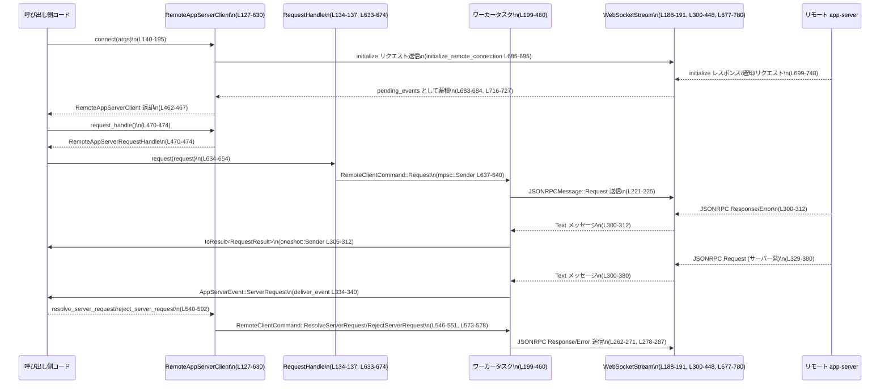

# app-server-client/src/remote.rs コード解説

---

## 0. ざっくり一言

- WebSocket 越しにリモート app-server と JSON-RPC で通信するクライアントトランスポート実装です。接続〜initialize ハンドシェイク、リクエスト送受信、サーバーからのリクエストや通知を `AppServerEvent` としてストリームする役割を持ちます（remote.rs:L1-8）。

---

## 1. このモジュールの役割

### 1.1 概要

- このモジュールは **WebSocket バックエンドの app-server クライアント**を実装し、次を担います。
  - WebSocket 接続と TLS 設定、認証トークンの付与（remote.rs:L140-188, L93-101）
  - `initialize` / `initialized` JSON-RPC ハンドシェイク（remote.rs:L677-800）
  - クライアント発リクエスト / 通知の送信とレスポンス待ち（remote.rs:L103-125, L199-272, L476-516）
  - サーバー発通知・リクエストを `AppServerEvent` として配信（remote.rs:L300-380, L809-871, L895-902）
- 上位レイヤー（TUI 等）は、インプロセス版と同じ `AppServerEvent` インターフェースで扱えるように設計されています（remote.rs:L1-8）。

### 1.2 アーキテクチャ内での位置づけ

- 呼び出し側コードは `RemoteAppServerClient` を通じて接続・イベント購読を行い、非同期ワーカータスクが WebSocket と JSON-RPC の詳細を隠蔽します。
- リクエスト送信は `mpsc::Sender<RemoteClientCommand>` によってワーカーに渡され、レスポンスは `oneshot::Sender` 経由で個々の呼び出し元に返却されます（remote.rs:L103-107, L199-272, L476-495）。

```mermaid
%% remote.rs 全体 (L1-984) の構造イメージ
graph TD
  Caller["呼び出し側コード\n(TUI など)"]
  Client["RemoteAppServerClient\n(remote.rs:L127-132, L139-630)"]
  Handle["RemoteAppServerRequestHandle\n(remote.rs:L134-137, L633-674)"]
  Worker["ワーカータスク\n(tokio::spawn, remote.rs:L199-460)"]
  CmdCh["mpsc::Sender<RemoteClientCommand>\n(remote.rs:L127-137, L197-199)"]
  EvCh["mpsc::Sender/AppServerEvent\n(remote.rs:L198-199, L809-871)"]
  WS["WebSocketStream\n(remote.rs:L188-191, L300-448, L677-780)"]
  Server["リモート app-server"]

  Caller -->|connect(args)| Client
  Caller -->|request/notify等| Handle
  Client --> CmdCh
  Handle --> CmdCh
  CmdCh --> Worker
  Worker --> WS
  WS --> Server

  Worker --> EvCh
  EvCh -->|recv()| Client
  Client -->|next_event()| Caller
```

### 1.3 設計上のポイント

- **責務分割**
  - `RemoteAppServerClient` は API 面（接続・リクエスト・イベント購読・シャットダウン）を提供（remote.rs:L139-630）。
  - ワーカータスク（`tokio::spawn` 内）は WebSocket I/O と JSON-RPC メッセージのルーティングを担当（remote.rs:L199-460）。
  - JSON-RPC 変換は専用ヘルパー（`jsonrpc_*` 系関数）に分離（remote.rs:L909-930）。
- **状態管理**
  - 未処理リクエストは `HashMap<RequestId, oneshot::Sender<_>>` で管理し、レスポンス到着時に対応する送信者へ返却（remote.rs:L200-201, L305-312）。
  - イベントキューあふれを表すカウンタ `skipped_events` を持ち、`Lagged` イベントで通知（remote.rs:L202-203, L809-871）。
- **エラーハンドリング方針**
  - 通信系エラーは `std::io::Error`（`IoError`）でラップ（remote.rs:L13-15, L140-188, L421-432）。
  - JSON-RPC レベルの失敗は `JSONRPCErrorError` / `RequestResult` / `TypedRequestError` に分けて扱う（remote.rs:L29-31, L36, L498-516）。
  - 初期化・接続・シャットダウンには明示的な `timeout` を設け、ハングを防止（remote.rs:L57-58, L173-181, L697-788, L615-627）。
- **並行性**
  - リクエスト送信は非同期 `mpsc` + `oneshot` で多重送信に対応（remote.rs:L103-107, L476-495）。
  - WebSocket 読み書きは単一のワーカータスクで直列化され、同時書き込みによる競合を防止（remote.rs:L199-460）。
- **バックプレッシャ**
  - イベントキュー満杯時に低優先度イベントをスキップし、その個数を `Lagged` イベントで報告しつつ、サーバーからのリクエストをドロップした場合は JSON-RPC エラーで明示的に拒否（remote.rs:L809-871, L873-893）。

---

## 2. 主要な機能一覧

- WebSocket 接続と TLS 設定、認証トークン付与（remote.rs:L140-188, L93-101）
- JSON-RPC `initialize` / `initialized` ハンドシェイクと初期イベントの収集（remote.rs:L677-800）
- クライアント発 JSON-RPC リクエストの送信とレスポンスの待ち合わせ（remote.rs:L103-107, L199-272, L476-516）
- クライアント発通知の送信（remote.rs:L108-111, L246-256, L518-537）
- サーバー発リクエストを `AppServerEvent::ServerRequest` として配信し、クライアント側からの resolve/reject を JSON-RPC レスポンス / エラーに変換（remote.rs:L330-380, L540-592, L873-893）
- サーバー発通知を `AppServerEvent::ServerNotification` として配信（remote.rs:L314-328, L802-807, L895-902）
- イベントキュー満杯時に `Lagged` イベントを挿入し、必要に応じてサーバーリクエストをエラーで拒否（remote.rs:L809-871）
- 安全な認証トークン使用条件のチェック（`wss` またはループバック `ws` のみ許可）（remote.rs:L93-101）

---

## 3. 公開 API と詳細解説

### 3.1 型一覧（構造体・列挙体など）

| 名前 | 種別 | 公開範囲 | 役割 / 用途 | 根拠 |
|------|------|----------|-------------|------|
| `RemoteAppServerConnectArgs` | 構造体 | `pub` | 接続時に必要な WebSocket URL・認証トークン・クライアント情報・チャネル容量などをまとめる引数オブジェクト | remote.rs:L60-69 |
| `RemoteAppServerClient` | 構造体 | `pub` | WebSocket ベースの app-server クライアント。イベント受信とリクエスト送信の両方を提供するメイン API | remote.rs:L127-132, L139-630 |
| `RemoteAppServerRequestHandle` | 構造体 | `pub` | リクエスト送信用の軽量ハンドル。`RemoteAppServerClient` とは独立にクローンして使える（イベント受信は持たない） | remote.rs:L134-137, L633-674 |
| `RemoteClientCommand` | 列挙体 | モジュール内 | ワーカータスクに送るコマンド種別（リクエスト/通知/サーバーリクエスト解決/拒否/シャットダウン） | remote.rs:L103-125 |
| `AppServerEvent` | 列挙体 | 別モジュール | サーバー通知・サーバーリクエスト・接続断・Lagged を表すイベント。ここではパターンマッチで利用される | remote.rs:L18, L315-338, L383-390, L404-412, L439-442, L802-807, L809-871, L895-902, L955-982 |

> `AppServerEvent` の定義本体や他のバリアントはこのチャンクには現れません。ここでは `ServerNotification` / `ServerRequest` / `Disconnected` / `Lagged` バリアントのみ確認できます（remote.rs:L895-902, L955-982）。

---

### 3.2 関数詳細（主要 7 件）

#### `RemoteAppServerClient::connect(args: RemoteAppServerConnectArgs) -> IoResult<Self>`  *(remote.rs:L140-468)*

**概要**

- WebSocket URL・認証情報・クライアント情報などを元にリモート app-server へ接続し、JSON-RPC `initialize` ハンドシェイクを完了させた `RemoteAppServerClient` を生成します。
- さらにバックグラウンドのワーカータスクを起動し、以降のリクエスト/イベント処理を担わせます。

**引数**

| 引数名 | 型 | 説明 |
|--------|----|------|
| `args` | `RemoteAppServerConnectArgs` | 接続設定一式（URL、auth token、client name/version、実験 API フラグ、通知オプトアウト、チャネル容量） |

（接続設定の詳細は struct フィールド定義を参照: remote.rs:L60-69）

**戻り値**

- `IoResult<RemoteAppServerClient>`  
  - `Ok(client)` : 接続・ハンドシェイクおよびワーカー起動に成功。
  - `Err(IoError)` : URL 不正、接続失敗、ハンドシェイク失敗など I/O 由来のエラー。

**内部処理の流れ**

1. `channel_capacity` を `max(1)` で下限 1 に補正（remote.rs:L141）。
2. WebSocket URL 文字列を `Url::parse` でパースし、失敗したら `InvalidInput` エラーを返す（remote.rs:L142-148）。
3. `auth_token` が指定されている場合：
   - `websocket_url_supports_auth_token(&url)` で `wss://` またはループバック `ws://` 以外ならエラーで拒否（remote.rs:L149-155, L93-101）。
4. `IntoClientRequest` で HTTP リクエストを構築し、失敗した場合は `InvalidInput` エラー（remote.rs:L157-162）。
5. `auth_token` がある場合は `Authorization: Bearer …` ヘッダを追加。ヘッダ値が無効な場合は `InvalidInput` エラー（remote.rs:L163-172）。
6. `ensure_rustls_crypto_provider()` を呼び、Rustls の暗号プロバイダを有効化（remote.rs:L173）。
7. `timeout(CONNECT_TIMEOUT, connect_async(request))` で WebSocket 接続を試みる（remote.rs:L174-181）。
   - タイムアウト時は `TimedOut` エラー。
   - プロトコル/ハンドシェイクエラー時は `IoError::other` でラップ（remote.rs:L182-187）。
8. 接続済み `WebSocketStream` に対し `initialize_remote_connection` を実行し、`initialize` 応答待ち・初期イベント収集・`initialized` 通知送信を行う（remote.rs:L188-195, L677-800）。
9. リクエスト用・イベント用の `mpsc::channel` を作成（remote.rs:L197-199）。
10. `tokio::spawn` でワーカータスクを起動し、ループ内で
    - `command_rx.recv()` から `RemoteClientCommand` を受信して WebSocket 書き込み処理、
    - `stream.next()` で JSON-RPC メッセージを読み取り、レスポンス/通知/リクエストを適切に処理  
    を `tokio::select!` で multiplex（remote.rs:L199-451）。
11. 生成した `RemoteAppServerClient` を `Ok(Self { .. })` として返す（remote.rs:L462-467）。

**Examples（使用例）**

```rust
use app_server_client::{RemoteAppServerClient, RemoteAppServerConnectArgs};
use std::io::Result as IoResult;

#[tokio::main]
async fn main() -> IoResult<()> {
    // 接続引数の作成
    let args = RemoteAppServerConnectArgs {
        websocket_url: "wss://example.com/app".to_string(),
        auth_token: Some("your-token".to_string()),
        client_name: "my-client".to_string(),
        client_version: "0.1.0".to_string(),
        experimental_api: false,
        opt_out_notification_methods: Vec::new(),
        channel_capacity: 32,
    };

    // 接続＆バックグラウンドワーカー起動
    let mut client = RemoteAppServerClient::connect(args).await?;

    // 以降、request()/next_event()/shutdown() を利用できる
    // ...
    client.shutdown().await
}
```

**Errors / Panics**

- 主なエラー条件（`Err(IoError)`）:
  - URL パース失敗（`InvalidInput`）: remote.rs:L142-148
  - 認証トークンを `wss://` 以外または非ループバック `ws://` で使用しようとした場合（`InvalidInput`）（remote.rs:L149-155, L93-101）
  - WebSocket リクエスト構築失敗（`InvalidInput`）（remote.rs:L157-162）
  - Authorization ヘッダ値が無効（`InvalidInput`）（remote.rs:L163-171）
  - WebSocket 接続タイムアウト（`TimedOut`）（remote.rs:L174-181）
  - WebSocket ハンドシェイクエラー（`IoError::other`）（remote.rs:L182-187）
  - `initialize_remote_connection` 内の各種エラー（JSON パース失敗・初期化拒否・タイムアウトなど、詳細は後述）（remote.rs:L188-195, L677-800）
- panic:
  - 本関数自体には `panic!` 呼び出しはありませんが、内部で使う `jsonrpc_request_from_client_request` がシリアライズ失敗時に panic します（remote.rs:L909-917）。ただし `ClientRequest::Initialize` が正しくシリアライズできることを前提とした設計です。

**Edge cases（エッジケース）**

- `channel_capacity` が 0 の場合も、`max(1)` により 1 に補正されます（remote.rs:L141）。
- サーバーが `initialize` 以外の JSON-RPC メッセージを先に送ってきた場合でも、それらは `pending_events` に一時的に蓄積され、`connect` の戻り値で `RemoteAppServerClient` に渡されます（remote.rs:L683-799, L462-466）。
- サーバーが `initialize` 中に接続を閉じた場合やエラーを返した場合、`IoError` で失敗します（remote.rs:L710-777）。

**使用上の注意点**

- 認証トークン付きで接続する際は、必ず `wss://` またはループバック `ws://` を用いる必要があります。そうでないと `connect` 自体がエラーになります（remote.rs:L93-101, L149-155）。
- `connect` に成功した段階でバックグラウンドワーカーが起動しているため、必ず最後に `shutdown()` を呼び出して WebSocket をクリーンに閉じることが推奨されます（remote.rs:L601-629）。
- 呼び出し側が `next_event()` を消費しないとイベントキューがあふれ、`Lagged` イベントやサーバーリクエストのエラー応答が発生しうる点に注意が必要です（remote.rs:L809-871）。

---

#### `RemoteAppServerClient::request(&self, request: ClientRequest) -> IoResult<RequestResult>`  *(remote.rs:L476-495)*

**概要**

- クライアント側から JSON-RPC リクエストを送信し、対応するレスポンス（成功/JSON-RPC エラー）を待つ非同期関数です。
- 実際の送信はワーカータスクが行い、本関数は `oneshot` チャネル経由で結果を受け取ります。

**引数**

| 引数名 | 型 | 説明 |
|--------|----|------|
| `request` | `ClientRequest` | 送信したい JSON-RPC クライアントリクエスト |

**戻り値**

- `IoResult<RequestResult>`  
  - `Ok(request_result)` : 通信レベルでは成功。`request_result` の中身は JSON-RPC レベルの成功値またはサーバーエラー。
  - `Err(IoError)` : ワーカータスク終了や WebSocket 書き込み失敗など、トランスポートレイヤーのエラー。

> `RequestResult` は、このモジュール内で `Ok(Ok(response.result))` / `Ok(Err(error.error))` の形で生成されているため（remote.rs:L305-312）、  
> 成功時には JSON 値（`serde_json::Value` 相当）、失敗時には `JSONRPCErrorError` を持つ `Result` であると解釈できます（remote.rs:L510-515）。

**内部処理の流れ**

1. `oneshot::channel()` を作成し、レスポンス受信用の `response_tx/response_rx` を用意（remote.rs:L477-477）。
2. `RemoteClientCommand::Request { request: Box::new(request), response_tx }` を `command_tx.send(..).await` でワーカーに送信（remote.rs:L478-482）。
3. `command_tx.send` が `Err` の場合（ワーカータスク終了など）、`BrokenPipe` エラーを返す（remote.rs:L483-489）。
4. `response_rx.await` でワーカーからの結果を待機（remote.rs:L490-495）。
   - 送信側がドロップされていた場合は `BrokenPipe` エラーに変換（remote.rs:L490-495）。
   - 正常なら `IoResult<RequestResult>` がそのまま返される。

ワーカー側の処理（remote.rs:L211-244, L300-312）:

- リクエスト受信時に `request_id_from_client_request` から ID を取得し、`pending_requests` に `response_tx` を格納（remote.rs:L211-221）。
- WebSocket 書き込み失敗時には
  - 該当 `response_tx` へ `Err(IoError)` を返す（remote.rs:L228-231）。
  - `AppServerEvent::Disconnected` をイベントストリームへ送信してループを終了（remote.rs:L232-243）。
- サーバーから JSON-RPC レスポンスを受け取った際に `pending_requests.remove` で対応する `response_tx` を取得し、成功時は `Ok(Ok(result))`、エラー時は `Ok(Err(error.error))` を送る（remote.rs:L304-312）。

**Examples（使用例）**

```rust
use app_server_client::RemoteAppServerClient;
use codex_app_server_protocol::ClientRequest;
use std::io::Result as IoResult;

async fn send_request(client: &RemoteAppServerClient) -> IoResult<()> {
    // 具体的なリクエストの作り方はプロトコル定義に依存する
    let request: ClientRequest = /* 適切な ClientRequest バリアントを構築 */;

    // 通信レベルのエラーは IoError として返る
    let request_result = client.request(request).await?;

    // JSON-RPC レベルの成功/失敗を判定
    match request_result {
        Ok(json_value) => {
            // 成功時: json_value はサーバーからの JSON レスポンスボディ
            println!("Response JSON = {}", json_value);
        }
        Err(json_rpc_error) => {
            // サーバー側でのエラー
            eprintln!("Server returned error: code={} msg={}",
                json_rpc_error.code, json_rpc_error.message);
        }
    }

    Ok(())
}
```

**Errors / Panics**

- `BrokenPipe`:
  - `command_tx.send(..)` が失敗した場合（ワーカータスクが終了し、送信チャネルが閉じている）（remote.rs:L483-489）。
  - `response_rx.await` が `Err`（`oneshot` 送信側がドロップ）だった場合（remote.rs:L490-495）。
- その他のエラーはワーカータスクから伝搬する `IoResult`（WebSocket 書き込み失敗など）です（remote.rs:L221-244, L305-312）。
- 本関数自身には panic はありません。

**Edge cases**

- 同一 `RequestId` のリクエストを同時に送ると、ワーカー側で `duplicate remote app-server request id` エラーとなり、当該リクエストは送信されません（remote.rs:L212-219）。
- サーバーからレスポンスが送られず接続が閉じた場合、ワーカータスクが `Disconnected` イベントを送信して終了し、その後の `request` 呼び出しは `BrokenPipe` になります（remote.rs:L435-447, L453-459）。

**使用上の注意点**

- `ClientRequest` の `RequestId` は呼び出し側で一意になるよう管理する必要があります。同じ ID を再利用すると送信自体が拒否されます（remote.rs:L212-219）。
- JSON-RPC レベルのエラー（`RequestResult::Err`）とトランスポートレベルのエラー（`IoError`）を区別して扱う前提で設計されています。

---

#### `RemoteAppServerClient::request_typed<T>(&self, request: ClientRequest) -> Result<T, TypedRequestError>`  *(remote.rs:L498-516)*

**概要**

- `request()` による JSON ベースのレスポンスを、呼び出し側指定の型 `T` にデシリアライズした上で返すユーティリティです。
- トランスポートエラー / サーバーエラー / デシリアライズエラーを `TypedRequestError` のバリアントで区別します。

**引数**

| 引数名 | 型 | 説明 |
|--------|----|------|
| `request` | `ClientRequest` | 送信する JSON-RPC リクエスト |

**戻り値**

- `Result<T, TypedRequestError>`  
  - `Ok(T)` : 通信成功かつサーバー側成功、レスポンス JSON を `T` に正常デシリアライズできた場合。
  - `Err(TypedRequestError)` : トランスポートエラー、サーバーエラー、デシリアライズエラーのいずれか。

`TypedRequestError` の利用箇所から、少なくとも以下のバリアントが存在することが分かります（remote.rs:L506-515）:

- `TypedRequestError::Transport { method, source }`
- `TypedRequestError::Server { method, source }`
- `TypedRequestError::Deserialize { method, source }`

**内部処理の流れ**

1. `request_method_name(&request)` でメソッド名文字列を取得（remote.rs:L502）。
2. `self.request(request).await` を呼び出し、`IoError` が出た場合には `TypedRequestError::Transport { method, source }` に変換（remote.rs:L503-509）。
3. `RequestResult`（`Result<serde_json::Value, JSONRPCErrorError>` 相当）を `map_err` で変換し、サーバーエラー時には `TypedRequestError::Server { method, source }` に変換（remote.rs:L510-513）。
4. 成功時の JSON 値を `serde_json::from_value::<T>` でデシリアライズし、失敗時には `TypedRequestError::Deserialize { method, source }` を返す（remote.rs:L514-515）。

**Examples（使用例）**

```rust
use app_server_client::RemoteAppServerClient;
use codex_app_server_protocol::ClientRequest;
use serde::Deserialize;

#[derive(Deserialize, Debug)]
struct MyResponse {
    // サーバー側が返す JSON 構造に合わせる
    value: String,
}

async fn typed_example(client: &RemoteAppServerClient) {
    let request: ClientRequest = /* 適切なリクエスト */;

    match client.request_typed::<MyResponse>(request).await {
        Ok(resp) => println!("Typed response: {:?}", resp),
        Err(err) => {
            // どの段階で失敗したかを分けて処理できる
            eprintln!("Typed request error: {:?}", err);
        }
    }
}
```

**Errors / Panics**

- `TypedRequestError::Transport`: `request()` が `IoError` を返した場合（remote.rs:L503-509）。
- `TypedRequestError::Server`: JSON-RPC レベルでサーバーエラーが返された場合（remote.rs:L510-513）。
- `TypedRequestError::Deserialize`: レスポンス JSON を型 `T` にデシリアライズできなかった場合（remote.rs:L514-515）。
- 本関数自身には panic はありません。

**Edge cases**

- 型 `T` のフィールド名や構造がサーバーからの JSON と合わない場合、必ず `Deserialize` エラーになります。サーバー側の JSON スキーマと `T` を同期させる必要があります。
- サーバーから返る JSON が `null` のような単純な値でも、`T` がそれを受け取れる型であれば成功します（例: `Option<T>` など）。

**使用上の注意点**

- デシリアライズに失敗した場合は、サーバーとの通信自体は成功していても `Err` になるため、ログなどで `Transport` / `Server` / `Deserialize` を区別しておくとトラブルシュートが容易です。
- `request_typed` は `T: DeserializeOwned` を要求するため、値の所有権を持つ構造体を用意する必要があります（remote.rs:L500-501）。

---

#### `RemoteAppServerClient::next_event(&mut self) -> Option<AppServerEvent>`  *(remote.rs:L594-599)*

**概要**

- pending の初期イベントがあればそれを先に返し、なければ内部の `mpsc::Receiver<AppServerEvent>` から次のイベントを非同期に受信する関数です。
- `connect()` 時に `initialize` 中に到着した通知/サーバーリクエストを取りこぼさないようにするための仕組みを含みます（remote.rs:L462-466, L683-799）。

**引数**

| 引数名 | 型 | 説明 |
|--------|----|------|
| `&mut self` | `&mut RemoteAppServerClient` | イベントキュー（`pending_events`）を消費するため、可変参照が必要 |

**戻り値**

- `Option<AppServerEvent>`  
  - `Some(event)` : 何らかのイベントを受信。
  - `None` : イベントチャネルが閉じられ、今後イベントが来ない状態。

**内部処理の流れ**

1. `pending_events.pop_front()` で初期化中に蓄積されたイベントがあればそれを返す（remote.rs:L595-597）。
2. なければ `self.event_rx.recv().await` を返し、バックグラウンドワーカーが送信するイベントを待つ（remote.rs:L598-599）。

**Examples（使用例）**

```rust
use app_server_client::RemoteAppServerClient;
use crate::AppServerEvent; // 実際のパスはこのチャンクからは不明

async fn event_loop(mut client: RemoteAppServerClient) {
    while let Some(event) = client.next_event().await {
        match event {
            AppServerEvent::ServerNotification(notification) => {
                // 通知の内容に応じた処理
                println!("Notification: {:?}", notification);
            }
            AppServerEvent::ServerRequest(request) => {
                // サーバーからの要求に応じて Resolve/Reject を呼び出す
                println!("ServerRequest: {:?}", request);
            }
            AppServerEvent::Disconnected { message } => {
                eprintln!("Disconnected: {}", message);
                break;
            }
            AppServerEvent::Lagged { skipped } => {
                eprintln!("Lagged: skipped {} events", skipped);
            }
        }
    }
}
```

**Errors / Panics**

- 本関数自体は `Option` を返すだけで、直接の `IoError` や panic はありません。
- `event_rx.recv().await` はチャネルが閉じていれば `None` を返します（remote.rs:L598-599）。

**Edge cases**

- `connect()` 直後は `pending_events` に初期イベントが入っている可能性があるため、最初の数回の `next_event()` は即座に `Some` を返すことがあります（remote.rs:L462-466, L683-799）。
- イベント消費を止めると、内部の `deliver_event` により非必須イベントがスキップされ、`Lagged` イベントが送られる可能性があります（remote.rs:L809-871）。

**使用上の注意点**

- `next_event()` は `&mut self` を要求するので、同時に複数タスクから同じ `RemoteAppServerClient` でイベントループを走らせることはできません。イベントの消費は 1 箇所に集中させる前提です。
- イベントを定期的に消費しないと、キューがあふれて `Lagged` やサーバーリクエストのドロップが発生します（remote.rs:L860-865, L873-893）。

---

#### `RemoteAppServerClient::shutdown(self) -> IoResult<()>`  *(remote.rs:L601-629)*

**概要**

- バックグラウンドワーカーに `Shutdown` コマンドを送り、WebSocket 接続をクリーンにクローズした後、ワーカーの終了を待つ関数です。
- 一定時間内に終了しない場合はワーカータスクを abort し、強制終了します。

**引数**

| 引数名 | 型 | 説明 |
|--------|----|------|
| `self` | `RemoteAppServerClient` | 所有権を消費してシャットダウンを実行 |

**戻り値**

- `IoResult<()>`  
  - `Ok(())` : シャットダウンが成功もしくはタイムアウト後に abort が成功。
  - `Err(IoError)` : シャットダウン用チャネルが閉じている、もしくは WebSocket クローズ時の I/O エラー。

**内部処理の流れ**

1. `self` を分解して `command_tx`, `event_rx`, `worker_handle` を取り出す（remote.rs:L602-607）。
2. `drop(event_rx)` によりイベント受信側を先にクローズ（remote.rs:L608-609）。
3. `oneshot::channel()` でシャットダウンの完了通知を受け取るためのチャネルを作成（remote.rs:L610）。
4. `RemoteClientCommand::Shutdown { response_tx }` を `command_tx.send(..).await` でワーカーへ送信（remote.rs:L611-613）。
5. `SHUTDOWN_TIMEOUT` 内で `response_rx` を `timeout` 付きで待機し、`Ok(())` またはエラーを処理（remote.rs:L615-622）。
6. ワーカー本体の終了を `timeout(SHUTDOWN_TIMEOUT, &mut worker_handle).await` で待ち、タイムアウトした場合は `worker_handle.abort()` で強制終了（remote.rs:L625-627）。
7. `Ok(())` を返す（remote.rs:L629）。

ワーカー側では `Shutdown` コマンドを受け取ると WebSocket を `close(None)` し、その結果を `response_tx` に返した後ループを抜けます（remote.rs:L289-297）。

**Examples（使用例）**

```rust
async fn run() -> std::io::Result<()> {
    let client = /* connect などで取得 */;
    // 処理...
    client.shutdown().await
}
```

**Errors / Panics**

- シャットダウンコマンド送信前に `command_tx` が閉じている場合、`send(..)` で `Err` となり、続く処理では結果待ちを行わずそのままワーカ終了待ちに進みます（remote.rs:L611-616）。
- `response_rx.await` が `Err` の場合、`BrokenPipe` エラーが返されます（remote.rs:L617-622）。
- WebSocket `close` 自体が失敗した場合は、`IoError::other` として `response_tx` に返されます（remote.rs:L289-295）。
- 本関数自身は panic を持ちません。

**Edge cases**

- ワーカーが既に終了している場合、`command_tx.send(..)` が失敗し、`response_rx` を待たずにワーカーの `JoinHandle` のみを待つ形になります。
- `SHUTDOWN_TIMEOUT` の値はこのモジュール外で定義されており（remote.rs:L20, L615, L625）、その長さに応じて優雅なシャットダウンの猶予時間が変わります。

**使用上の注意点**

- `Shutdown` 完了を待たずにプロセスを終了しても OS がソケットを閉じますが、サーバー側にとっては異常終了に見える可能性があります。リソース解放やログの安定性のためにも `shutdown()` を呼ぶことが推奨されます。
- `shutdown(self)` は所有権を消費するため、呼び出し後はクライアントを再利用できません。

---

#### `initialize_remote_connection(...) -> IoResult<Vec<AppServerEvent>>`  *(remote.rs:L677-800)*

```rust
async fn initialize_remote_connection(
    stream: &mut WebSocketStream<MaybeTlsStream<TcpStream>>,
    websocket_url: &str,
    params: InitializeParams,
    initialize_timeout: Duration,
) -> IoResult<Vec<AppServerEvent>>
```

**概要**

- 接続直後の WebSocket ストリームに対して JSON-RPC `initialize` リクエストを送り、`initialize` のレスポンスが返ってくるまでの間に届いた通知・サーバーリクエストを `AppServerEvent` として収集します。
- 正常完了後、`ClientNotification::Initialized` 通知を送り、収集したイベントを呼び出し元（`connect`）に返します。

**引数**

| 引数名 | 型 | 説明 |
|--------|----|------|
| `stream` | `&mut WebSocketStream<MaybeTlsStream<TcpStream>>` | すでに接続済みの WebSocket ストリーム |
| `websocket_url` | `&str` | ログメッセージ用の URL 文字列 |
| `params` | `InitializeParams` | `initialize` リクエストに渡すパラメータ |
| `initialize_timeout` | `Duration` | `initialize` 応答を待つ最大時間 |

**戻り値**

- `IoResult<Vec<AppServerEvent>>`  
  - `Ok(pending_events)` : 初期化に成功。`initialize` 応答までに受信した通知/サーバーリクエストが入ったベクタ。
  - `Err(IoError)` : 初期化拒否、JSON パースエラー、接続クローズ、タイムアウト等。

**内部処理の流れ**

1. `initialize_request_id` として `"initialize"` 文字列 ID を生成（remote.rs:L683）。
2. `ClientRequest::Initialize { request_id, params }` を JSON-RPC リクエストに変換し、WebSocket に送信（remote.rs:L685-695）。
3. `timeout(initialize_timeout, async { ... })` で以下のループを実行（remote.rs:L697-781）。
4. ループ内では `stream.next().await` でメッセージを読み取り、種類ごとに処理（remote.rs:L699-779）:
   - `Text`:
     - JSON パース失敗 → `IoError::other` でエラー（remote.rs:L700-705）。
     - `JSONRPCMessage::Response` かつ ID が `initialize_request_id` → `Ok(())` で初期化成功（remote.rs:L707-708）。
     - `JSONRPCMessage::Error` かつ ID が一致 → `IoError::other` で「rejected initialize」エラー（remote.rs:L710-715）。
     - `JSONRPCMessage::Notification` → `app_server_event_from_notification` で変換し、成功したものを `pending_events` に push（remote.rs:L716-719, L802-807）。
     - `JSONRPCMessage::Request` → `ServerRequest::try_from` で変換し、成功したものを `AppServerEvent::ServerRequest` として push（remote.rs:L721-727）。失敗した場合は -32601 エラーを返す JSON-RPC エラーメッセージを送信（remote.rs:L728-745）。
     - その他の `Response` / `Error` は無視（remote.rs:L748-748）。
   - `Binary`, `Ping`, `Pong`, `Frame` は無視（remote.rs:L751-754）。
   - `Close` → 理由文字列を組み立て `ConnectionAborted` エラー（remote.rs:L755-766）。
   - `Err(err)` → `IoError::other`（remote.rs:L768-771）。
   - `None`（EOF） → `UnexpectedEof` エラー（remote.rs:L773-777）。
5. 外側の `timeout` がタイムアウトした場合は `TimedOut` エラーに変換（remote.rs:L782-788）。
6. 初期化成功後、`ClientNotification::Initialized` を JSON-RPC 通知として送信（remote.rs:L790-797）。
7. 最後に `Ok(pending_events)` を返す（remote.rs:L799）。

**Examples（使用例）**

通常は `connect()` の内部でのみ利用され、外部から直接呼び出すことは想定されていません（remote.rs:L188-195）。

**Errors / Panics**

- JSON パースエラー（`serde_json::from_str`） → `IoError::other`（remote.rs:L700-705）。
- サーバーが `initialize` を明示的にエラーで返した場合 → `IoError::other`（remote.rs:L710-715）。
- 不明なサーバーリクエストを `initialize` 中に受け取った場合 → -32601 コードの JSON-RPC エラーを返しつつ続行（remote.rs:L728-745）。
- 接続クローズ・EOF・トランスポートエラーはそれぞれ `ConnectionAborted` / `UnexpectedEof` / `IoError::other` として返されます（remote.rs:L755-777）。
- `initialize_timeout` を超えた場合は `TimedOut` エラー（remote.rs:L782-788）。
- 内部で使う `jsonrpc_request_from_client_request` / `jsonrpc_notification_from_client_notification` はシリアライズ失敗時に panic します（remote.rs:L909-930）。

**Edge cases**

- `initialize` 中にサーバーから来る通知やサーバーリクエストは、接続完了後も失われずに `pending_events` として取り出せます（remote.rs:L683-684, L716-727, L799）。
- `initialize` 応答と無関係な `Response` / `Error` は無視されます（remote.rs:L748-748）。

**使用上の注意点**

- `initialize_request_id` を `"initialize"` という固定 ID にしているため、サーバー側もこれを前提としている必要があります（remote.rs:L683-683）。
- この関数は `connect()` 以外での利用を想定しておらず、ストリームの先頭以外で実行すると想定外の挙動となる可能性があります。

---

#### `deliver_event(...) -> IoResult<()>`  *(remote.rs:L809-871)*

```rust
async fn deliver_event(
    event_tx: &mpsc::Sender<AppServerEvent>,
    skipped_events: &mut usize,
    event: AppServerEvent,
    stream: &mut WebSocketStream<MaybeTlsStream<TcpStream>>,
) -> IoResult<()>
```

**概要**

- サーバーから受け取ったイベントをクライアントへ配信する際の、**バックプレッシャ制御** と **ドロップ時のサーバーへの通知** を担う関数です。
- イベントキューがあふれた場合に低優先度イベントをスキップし、`Lagged` イベントでまとめて通知します。サーバーからのリクエストをドロップした場合は JSON-RPC エラーをサーバーへ返します。

**引数**

| 引数名 | 型 | 説明 |
|--------|----|------|
| `event_tx` | `&mpsc::Sender<AppServerEvent>` | クライアント側へイベントを送る送信チャネル |
| `skipped_events` | `&mut usize` | これまでにスキップされたイベント数のカウンタ |
| `event` | `AppServerEvent` | 今回配送しようとしているイベント |
| `stream` | `&mut WebSocketStream<MaybeTlsStream<TcpStream>>` | サーバーへエラー応答を返すための WebSocket ストリーム |

**戻り値**

- `IoResult<()>`  
  - `Ok(())` : イベントが送信された、または適切にスキップ/サーバーへ拒否を送信した。
  - `Err(IoError)` : イベントコンシューマチャネルが閉じている、またはサーバーへのエラー送信に失敗したなど。

**内部処理の流れ**

1. `*skipped_events > 0` の場合（すでにスキップされたイベントがある場合）（remote.rs:L815-848）:
   - 次の `event` が「必ず配信すべき」(`event_requires_delivery`) であれば、先に `Lagged { skipped: *skipped_events }` を `send` し、`skipped_events` を 0 にリセット（remote.rs:L816-830）。
   - そうでなければ `try_send(Lagged {..})` を試みる（remote.rs:L831-847）。
     - 成功 → `skipped_events = 0`。
     - `Full` → `skipped_events` を 1 増やし、`reject_if_server_request_dropped(stream, &event)` で必要ならサーバーリクエストを拒否して終了（remote.rs:L835-839）。
     - `Closed` → `BrokenPipe` エラー（remote.rs:L840-845）。
2. 次に現在の `event` を配送（remote.rs:L850-870）:
   - `event_requires_delivery(&event)` が真の場合は `send(event).await` でブロッキング送信。失敗した場合は `BrokenPipe`（remote.rs:L850-857）。
   - そうでない場合は `try_send(event)` を試す（remote.rs:L860-866）。
     - 成功 → `Ok(())`。
     - `Full(event)` → `skipped_events` を 1 増やし、`reject_if_server_request_dropped` を呼び出す（remote.rs:L862-865）。
     - `Closed` → `BrokenPipe`（remote.rs:L866-869）。

`event_requires_delivery` の定義（remote.rs:L895-902）:

- 必須 (`true`):
  - `ServerNotification` のうち `server_notification_requires_delivery()` が `true` のもの。
  - `Disconnected`。
- 非必須 (`false`):
  - `Lagged` / `ServerRequest`。

**Examples（使用例）**

- 直接呼び出されることはなく、ワーカータスクからのみ利用されます（remote.rs:L232-242, L317-327, L335-343, L382-393, L403-412, L435-445）。

**Errors / Panics**

- `BrokenPipe`:
  - `event_tx.send(..)` / `event_tx.try_send(..)` がチャネルクローズにより失敗した場合（remote.rs:L821-827, L841-845, L852-856, L866-869）。
- その他:
  - `reject_if_server_request_dropped` 内の `write_jsonrpc_message` が失敗した場合、その `IoError` が返ります（remote.rs:L835-839, L862-865, L873-893）。
- panic はありません。

**Edge cases**

- イベントキューが継続的に満杯で `try_send(Lagged)` すら失敗する場合、`skipped_events` が増え続け、次に配信可能になったタイミングで大きな `skipped` 値を持つ `Lagged` が送られます（remote.rs:L835-839）。
- `ServerRequest` は `event_requires_delivery` 上は非必須扱いですが、キューが満杯でドロップされた場合には `reject_if_server_request_dropped` を通じてサーバーに JSON-RPC エラーが返されます（remote.rs:L877-889）。
- `ServerNotification` のうち、`server_notification_requires_delivery` が `false` を返すもの（テストから見ると履歴に残らないような通知）はキュー満杯時にドロップされる可能性があります（remote.rs:L895-899, L955-982）。

**使用上の注意点**

- イベントの安定配送は、呼び出し側が `next_event()` を十分な頻度で呼び出すことを前提とします。重い処理をイベントループ内で同期的に行うとキューがあふれます。
- `Lagged` イベントは「どれだけのイベントが処理されずスキップされたか」の指標なので、アプリケーション側でログ出力やメトリクスに活用すると過負荷検知に有用です。

---

### 3.3 その他の関数

| 関数名 | 役割（1 行） | 根拠 |
|--------|--------------|------|
| `RemoteAppServerConnectArgs::initialize_params(&self) -> InitializeParams` | `connect` から使用する `InitializeParams` を組み立てるヘルパー。オプトアウト通知の有無に応じて `capabilities` を構成 | remote.rs:L71-90 |
| `websocket_url_supports_auth_token(url: &Url) -> bool` | 認証トークンを付与してよい WebSocket URL（`wss` またはループバック `ws`）か判定する | remote.rs:L93-101 |
| `RemoteAppServerClient::request_handle(&self) -> RemoteAppServerRequestHandle` | リクエスト送信用ハンドルを生成し、上位コードに貸し出す | remote.rs:L470-474 |
| `RemoteAppServerClient::notify(&self, notification: ClientNotification) -> IoResult<()>` | JSON-RPC クライアント通知を送信し、ワーカーからの送信結果を待つ | remote.rs:L518-537 |
| `RemoteAppServerClient::resolve_server_request(&self, request_id: RequestId, result: JsonRpcResult) -> IoResult<()>` | `AppServerEvent::ServerRequest` に対する成功応答を JSON-RPC レスポンスとしてサーバーに返す | remote.rs:L540-565 |
| `RemoteAppServerClient::reject_server_request(&self, request_id: RequestId, error: JSONRPCErrorError) -> IoResult<()>` | サーバーからのリクエストを JSON-RPC エラーとして明示的に拒否する | remote.rs:L567-592 |
| `RemoteAppServerRequestHandle::request(&self, request: ClientRequest) -> IoResult<RequestResult>` | `RemoteAppServerClient::request` と同等の処理を行うが、イベント受信を必要としない軽量ハンドル用 | remote.rs:L634-654 |
| `RemoteAppServerRequestHandle::request_typed<T>(&self, request: ClientRequest) -> Result<T, TypedRequestError>` | `request_typed` のハンドル版。クライアント本体を共有せずにリクエストを発行できる | remote.rs:L656-674 |
| `app_server_event_from_notification(notification: JSONRPCNotification) -> Option<AppServerEvent>` | JSON-RPC サーバー通知を `ServerNotification` に変換し、`AppServerEvent::ServerNotification` へラップ | remote.rs:L802-807 |
| `reject_if_server_request_dropped(stream, event) -> IoResult<()>` | ドロップ対象イベントが `ServerRequest` の場合に、サーバーへ -32001 エラーで返す | remote.rs:L873-893 |
| `event_requires_delivery(event: &AppServerEvent) -> bool` | イベントが必須配送かどうかを判定 | remote.rs:L895-902 |
| `request_id_from_client_request(request: &ClientRequest) -> RequestId` | クライアントリクエストを JSON-RPC リクエストに変換し、その ID を取得 | remote.rs:L905-907 |
| `jsonrpc_request_from_client_request(request: ClientRequest) -> JSONRPCRequest` | `ClientRequest` を JSON にシリアライズし、`JSONRPCRequest` に再デシリアライズする（失敗時は panic） | remote.rs:L909-917 |
| `jsonrpc_notification_from_client_notification(notification: ClientNotification) -> JSONRPCNotification` | `ClientNotification` を JSON-RPC 通知に同様の手順で変換（失敗時は panic） | remote.rs:L920-930 |
| `write_jsonrpc_message(stream, message, websocket_url) -> IoResult<()>` | JSON-RPC メッセージを JSON 文字列にして WebSocket `Text` として送信し、失敗時は URL を含むエラーを返す | remote.rs:L933-947 |

---

## 4. データフロー

代表的なシナリオとして、「接続 → リクエスト送信 → レスポンス受信」「サーバーからのリクエスト処理」の流れを示します。



この図から分かる通り、呼び出し側コードは WebSocket ストリームを直接扱う必要はなく、`RemoteAppServerClient` および `RemoteAppServerRequestHandle` を通じて JSON-RPC レベルの操作だけを行います。

---

## 5. 使い方（How to Use）

### 5.1 基本的な使用方法

最小限の例として、接続→イベントループ→リクエスト送信→シャットダウンの流れを示します。

```rust
use app_server_client::{RemoteAppServerClient, RemoteAppServerConnectArgs};
use codex_app_server_protocol::ClientRequest;
use std::io::Result as IoResult;

#[tokio::main]
async fn main() -> IoResult<()> {
    // 1. 接続引数の用意 (remote.rs:L60-69)
    let args = RemoteAppServerConnectArgs {
        websocket_url: "wss://example.com/app".to_string(),
        auth_token: Some("your-token".to_string()),
        client_name: "my-client".to_string(),
        client_version: "0.1.0".to_string(),
        experimental_api: false,
        opt_out_notification_methods: Vec::new(),
        channel_capacity: 32,
    };

    // 2. 接続 & クライアント作成 (remote.rs:L140-195)
    let mut client = RemoteAppServerClient::connect(args).await?;

    // 3. リクエスト専用ハンドルを取得 (remote.rs:L470-474)
    let handle = client.request_handle();

    // 4. イベントループを別タスクで回す (next_event, remote.rs:L594-599)
    let mut client_for_events = client;
    let event_task = tokio::spawn(async move {
        while let Some(event) = client_for_events.next_event().await {
            // AppServerEvent の処理 (remote.rs:L895-902)
            println!("event = {:?}", event);
        }
    });

    // 5. リクエスト送信例 (request, remote.rs:L634-654)
    // 実際の ClientRequest バリアントはプロトコル定義に依存する
    let request: ClientRequest = /* 何らかのリクエストを構築 */;
    let result = handle.request(request).await?;
    println!("request result = {:?}", result);

    // 6. 終了時にシャットダウン (shutdown, remote.rs:L601-629)
    // event_task は next_event が None を返すと終了する
    // 実運用では、終了条件を決めてから shutdown を呼ぶ
    // client_for_events は event_task 内に移動している点に注意
    // （この簡略例では shutdown 呼び出しを省略している）

    // タスク終了待ち（本例では ctrl+c などでプロセス終了想定）
    let _ = event_task.await;

    Ok(())
}
```

### 5.2 よくある使用パターン

1. **単一タスクでイベントループとリクエストを順番に行う**

   - 小規模クライアント。`next_event()` と `request_typed()` を同じタスクで交互に呼ぶ。

2. **イベントループとリクエストを別タスクに分離**

   - イベントループを 1 つのタスクでずっと回し、複数のタスクから `RemoteAppServerRequestHandle` をクローンして並行にリクエストを送る（remote.rs:L134-137, L633-674）。
   - この場合、クライアント本体 (`RemoteAppServerClient`) はイベントループ専用として 1 つだけ保持する。

3. **サーバーリクエストの処理**

   - `next_event()` で `AppServerEvent::ServerRequest(request)` を受け取ったら、処理完了後に `resolve_server_request` または `reject_server_request` を呼ぶ（remote.rs:L540-592）。

### 5.3 よくある間違い

```rust
// 間違い例: 認証トークン付きで平文 ws:// を使っている
let args = RemoteAppServerConnectArgs {
    websocket_url: "ws://example.com/app".to_string(), // 平文+非ループバック
    auth_token: Some("token".to_string()),
    // ...
};
// -> connect() は InvalidInput で失敗する (remote.rs:L149-155)

// 正しい例: wss:// または loopback ws:// を使う
let args = RemoteAppServerConnectArgs {
    websocket_url: "wss://example.com/app".to_string(), // TLS
    auth_token: Some("token".to_string()),
    // ...
};
```

```rust
// 間違い例: next_event() を呼ばず、イベントを放置している
let client = RemoteAppServerClient::connect(args).await?;
// request のみ発行し続けるが、イベントは捨てている
// -> イベントキューが満杯になり、Lagged や ServerRequest の拒否が発生しうる (remote.rs:L809-871)

// 正しい例: 別タスクでイベントループを回す
let mut client = RemoteAppServerClient::connect(args).await?;
let handle = client.request_handle();
let event_task = tokio::spawn(async move {
    while let Some(event) = client.next_event().await {
        // 処理
    }
});
```

### 5.4 使用上の注意点（まとめ）

- **セキュリティ / 認証**
  - 認証トークンは暗号化された `wss://` か、ローカルホスト向け `ws://` のみに許可されています（remote.rs:L93-101, L149-155）。これにより、トークンが平文で外部ネットワークに流出することを防いでいます。
- **イベントキューとバックプレッシャ**
  - `channel_capacity` はリクエストチャネルとイベントチャネルに共通して適用されます（remote.rs:L141, L197-199）。
  - イベントキューが満杯になると、非必須イベントがドロップされ、`Lagged` イベントでスキップ数を通知します（remote.rs:L809-871）。
  - サーバーリクエストがドロップされた場合、サーバーへ -32001 エラーで返し、クライアントがリクエストを処理できなかったことを明示します（remote.rs:L873-893）。
- **panic の可能性**
  - `jsonrpc_request_from_client_request` / `jsonrpc_notification_from_client_notification` はシリアライズ失敗時に `panic!` します（remote.rs:L909-917, L920-930）。これはプロトコル定義自体が常に JSON シリアライズ可能であることを前提にした実装です。
- **並行性上の制約**
  - WebSocket の読み書きは単一ワーカータスクで順次処理されるため、書き込みの競合は発生しません（remote.rs:L199-460）。
  - 複数のリクエストは `RemoteClientCommand::Request` と `pending_requests` のマップにより安全に多重管理されます（remote.rs:L200-221, L305-312）。

---

## 6. 変更の仕方（How to Modify）

### 6.1 新しい機能を追加する場合

1. **新しいクライアントリクエスト/通知メソッドを追加したい場合**

   - `codex_app_server_protocol::ClientRequest` / `ClientNotification` に新しいバリアントを追加する必要があります（このチャンクにはその定義は現れません）。
   - このモジュールでは `serde_json::to_value` → `JSONRPCRequest/Notification` への変換を行っているだけなので、バリアントが JSON シリアライズ可能であれば追加の変更は不要です（remote.rs:L909-930）。

2. **必須配送とすべき新しいサーバー通知を追加したい場合**

   - `server_notification_requires_delivery` の実装側（別ファイル）で新しい通知を `true` にする必要があります（remote.rs:L23, L895-899）。
   - `event_requires_delivery` およびテストで確認されるのはこの関数の結果です（remote.rs:L895-902, L949-983）。

3. **接続/初期化タイムアウトやシャットダウンタイムアウトを調整したい場合**

   - `CONNECT_TIMEOUT` / `INITIALIZE_TIMEOUT` の定数値、`SHUTDOWN_TIMEOUT` の定義を変更します（remote.rs:L57-58, L615, L625）。  
     値はこのファイル内にハードコードされている秒数を変更すればよい構造です。

### 6.2 既存の機能を変更する場合

- **バックプレッシャ戦略を変更したい場合**

  - イベントドロップや `Lagged` イベントの挿入はすべて `deliver_event` / `reject_if_server_request_dropped` 内に集約されています（remote.rs:L809-871, L873-893）。
  - ここを変更する際は、以下を確認する必要があります。
    - `ServerRequest` がドロップされたときにサーバーへ適切な JSON-RPC エラーが返されるかどうか（remote.rs:L877-889）。
    - `event_requires_delivery` によって、どのイベントがブロッキング送信/非ブロッキング送信の対象になるか（remote.rs:L895-902）。

- **エラー文言やログを変更したい場合**

  - 接続・初期化・書き込み失敗・JSON パースエラー等のメッセージはそれぞれのエラーハンドリング箇所にハードコードされています（例: remote.rs:L144-147, L178-180, L703-704, L386-388, L425-427）。
  - ログレベルや文言を変更する前に、`tracing::warn` の呼び出し箇所（remote.rs:L325-326, L342-343, L729-729）も合わせて確認するとよいです。

- **リクエスト ID の扱いを変えたい場合**

  - 現在は `request_id_from_client_request` で JSON-RPC リクエストに変換してから ID を取り出しています（remote.rs:L905-907）。
  - `ClientRequest` の ID 付与方法を変更する場合は、この関数の挙動も含めた一貫性を保つように仕様を整理する必要があります。

---

## 7. 関連ファイル

| パス / モジュール名 | 役割 / 関係 |
|---------------------|-------------|
| `crate::AppServerEvent` | サーバー通知、サーバーリクエスト、接続断、Lagged などのイベント種別を定義する。`remote.rs` ではイベントストリームの表現として使用（remote.rs:L18, L895-902）。ファイルパスはこのチャンクには現れません。 |
| `crate::RequestResult` | `RemoteAppServerClient::request` が返す JSON-RPC レスポンスの結果型。コードから、成功時は JSON 値、失敗時は `JSONRPCErrorError` を持つ `Result` であることが読み取れる（remote.rs:L305-312, L510-515）。 |
| `crate::TypedRequestError` | 型付きリクエストの失敗理由（トランスポート/サーバー/デシリアライズ）を表すエラー型（remote.rs:L21, L498-516, L656-674）。 |
| `crate::request_method_name` | `ClientRequest` からメソッド名文字列を取り出すヘルパー（`TypedRequestError` 用の文脈情報）として利用（remote.rs:L22, L502, L660）。 |
| `crate::server_notification_requires_delivery` | サーバー通知が必須配送かどうかを判定する関数。`event_requires_delivery` 内で利用され、イベントドロップ戦略に影響（remote.rs:L23, L895-899）。 |
| `crate::SHUTDOWN_TIMEOUT` | シャットダウン処理におけるタイムアウト時間を決める `Duration` 定数（remote.rs:L20, L615, L625）。定義場所はこのチャンクには現れません。 |
| `codex_app_server_protocol` クレート | `ClientRequest` / `ClientNotification` / `ServerRequest` / `ServerNotification` / `JSONRPC*` / `RequestId` など、JSON-RPC ベースの app-server プロトコル型群を提供（remote.rs:L24-38）。 |
| `codex_utils_rustls_provider::ensure_rustls_crypto_provider` | Rustls の暗号プロバイダを初期化するユーティリティ。TLS ベースの WebSocket 接続で必要（remote.rs:L39, L173）。 |
| `tokio_tungstenite` | WebSocket クライアント実装。`connect_async` による接続と `WebSocketStream` を提供（remote.rs:L47-53, L174-187, L300-448, L677-780）。 |

---

## 付録: テストについて

- `#[cfg(test)] mod tests` では `event_requires_delivery` の挙動を確認するテストが 1 つ定義されています（remote.rs:L949-983）。
  - `ServerNotification::AgentMessageDelta` と `ServerNotification::ItemCompleted` が必須配送 (`true`) であること（remote.rs:L955-976）。
  - `Disconnected` が必須配送 (`true`) であること（remote.rs:L977-979）。
  - `Lagged` が非必須 (`false`) であること（remote.rs:L980-982）。
- これにより、重要な transcript イベントと接続断イベントが必ずキューに流れる設計が維持されていることが確認できます。

---
