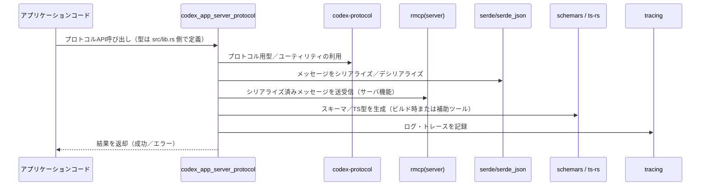

# app-server-protocol/Cargo.toml

## 0. ざっくり一言

`codex-app-server-protocol` クレートの **ビルド設定と依存関係** を定義する Cargo マニフェストです。  
このファイル自体は公開 API やロジックを含まず、ライブラリ本体（`src/lib.rs`）のコンパイル条件を決めています（根拠: app-server-protocol/Cargo.toml:L1-9）。

---

## 1. このモジュールの役割

### 1.1 概要

- このファイルは、`codex-app-server-protocol` という名前の **ライブラリクレート** を定義します（根拠: L1-2, L7-9）。
- 依存クレート（`codex-protocol`, `rmcp`, `serde`, `tracing` など）を通じて、**プロトコル定義・シリアライズ・サーバ処理・エラー処理** などの機能領域を利用可能にします（根拠: L14-37）。
- コンパイラのリンツ設定はワークスペース共通設定に委譲されており、静的解析や安全性に関する方針は上位ワークスペースで一元管理されています（根拠: L11-12）。

このファイル単体からは関数や型の中身は分からず、公開 API・コアロジックは `src/lib.rs` 側に存在します（根拠: L8-9）。

### 1.2 アーキテクチャ内での位置づけ

このマニフェストから読み取れる範囲での、クレート間依存関係を示します。

```mermaid
%% app-server-protocol/Cargo.toml (L1-44)
graph TD
    subgraph "codex-app-server-protocol crate"
        A["lib: codex_app_server_protocol\n(path = \"src/lib.rs\")"]
    end

    %% プロトコル/通信まわり
    A --> P["codex-protocol"]
    A --> R["rmcp (features: base64, macros, schemars, server)"]

    %% シリアライズ/スキーマ/TS
    A --> S["serde / serde_json / serde_with"]
    A --> SC["schemars"]
    A --> TS["ts-rs"]

    %% CLI/ユーティリティ
    A --> C["clap (derive)"]
    A --> GIT["codex-git-utils"]
    A --> SH["codex-shell-command"]
    A --> PATH["codex-utils-absolute-path"]
    A --> INV["inventory"]
    A --> UUID["uuid (serde, v7)"]

    %% エラー・トレーシング
    A --> ERR["anyhow / thiserror"]
    A --> TR["tracing"]

    %% テスト用途
    subgraph "dev-dependencies"
        DA["anyhow (dev)"]
        DCB["codex-utils-cargo-bin"]
        DPA["pretty_assertions"]
        DS["similar"]
        DT["tempfile"]
    end
    A -. uses in tests .-> DA
    A -. uses in tests .-> DCB
    A -. uses in tests .-> DPA
    A -. uses in tests .-> DS
    A -. uses in tests .-> DT
```

- 中心のノードがこのクレート（lib）であり、その周囲に機能別の依存クレートを配置しています（根拠: L7-9, L14-37）。
- 破線矢印は `dev-dependencies` を示し、主にテスト・検証用途で使われることを表します（根拠: L39-44）。

### 1.3 設計上のポイント

この Cargo.toml から読み取れる設計上の特徴です。

- **ワークスペース一元管理**
  - `version.workspace = true` / `edition.workspace = true` / `license.workspace = true` により、バージョン・エディション・ライセンスはワークスペース共通設定を使用します（根拠: L3-5）。
  - `lints.workspace = true` により、コンパイラリンツの強度や方針もワークスペースで統一されています（根拠: L11-12）。
- **ライブラリクレートとして公開**
  - `[lib]` セクションで `name = "codex_app_server_protocol"` と `path = "src/lib.rs"` が定義されており、バイナリではなくライブラリとして利用される前提です（根拠: L7-9）。
- **エラー処理方針**
  - `anyhow` と `thiserror` を依存に含めており、アプリケーションレベルでのエラーまとめ (`anyhow::Error`) と、型安全なエラー定義 (`thiserror`) の両方を利用する構成と考えられます（根拠: L15, L27）。
- **シリアライズ／スキーマ／型共有**
  - `serde`, `serde_json`, `schemars`, `ts-rs`, `rmcp` の `schemars` feature などが並んでおり、Rust 型を JSON などの形式へシリアライズしつつ、スキーマや TypeScript 型の生成も行う構成になっています（根拠: L22-24, L28-32, L34）。
- **安全性と並行性（Rust 言語固有の観点）**
  - 並行実行用ランタイム（例: `tokio`）はこのファイルには現れず、並行性の具体的なモデル（async/マルチスレッドなど）は不明です（根拠: L14-37 に該当クレートが存在しない）。
  - `tracing` を利用することで、並行環境でも扱いやすい構造化ログ／スパンを使った可観測性が想定されます（根拠: L36）。
  - このファイルからは `unsafe` コードの有無は分かりません。安全性はワークスペースの lint 設定と各依存クレートの設計に依存します。

---

## 2. 主要な機能一覧

この Cargo.toml 自体はコードを含みませんが、依存クレートから逆算して「このクレートが担う機能領域」を整理します。機能の詳細な実装は `src/lib.rs` 以降にあり、このチャンクには現れません。

- プロトコル定義・相互運用:
  - `codex-protocol` と `rmcp`（`server` feature）により、アプリケーションサーバとの通信プロトコルを表現・処理する機能が存在すると考えられます（根拠: L19, L28-32）。
- シリアライズとスキーマ生成:
  - `serde`, `serde_json`, `serde_with`, `schemars`, `rmcp` の `schemars` feature, `ts-rs` により、Rust 型のシリアライズ／デシリアライズと JSON Schema や TypeScript 型の生成を行う領域を持ちます（根拠: L22-25, L28-32, L34）。
- コマンドラインや周辺ユーティリティ連携:
  - `clap`（`derive` feature）と `codex-git-utils`, `codex-shell-command`, `codex-utils-absolute-path` により、CLI オプション定義、Git 連携、シェルコマンド実行、パス操作などのユーティリティが利用可能です（根拠: L16, L18, L20-21）。
- エラー処理・ロギング:
  - `anyhow`, `thiserror`, `tracing` により、エラーの集約・定義と構造化ログ出力が行われます（根拠: L15, L27, L36）。
- ID 管理:
  - `uuid`（`serde`, `v7` features）により、UUID をシリアライズ可能な形で扱い、時間ソート可能な v7 形式などを利用する設計です（根拠: L37）。
- テスト補助:
  - `pretty_assertions`, `similar`, `tempfile`, `codex-utils-cargo-bin` などの dev-dependencies により、テストの可読性向上・一時ファイル利用・外部バイナリ実行が想定されます（根拠: L39-44）。

---

## 3. 公開 API と詳細解説

このセクションは本来「関数・型」のためのものですが、このファイルはマニフェストのみであり、Rust コードを含みません。

### 3.1 型一覧（構造体・列挙体など）

#### このチャンクに現れる Rust 型定義について

- Rust の構造体・列挙体・型エイリアスなどは **一切定義されていません**（根拠: 全行が TOML であり、`[package]`, `[lib]`, `[dependencies]` などのセクションのみで構成されていること L1-44）。
- 実際の公開型は `path = "src/lib.rs"` で指定されたライブラリ本体に定義されており、このチャンクには現れません（根拠: L8-9）。

#### コンポーネントインベントリー（crate・依存関係）

Cargo レベルでのコンポーネント一覧をまとめます。

| コンポーネント名 | 種別 | 役割 / 用途（このファイルから分かる範囲） | 根拠 |
|------------------|------|-------------------------------------------|------|
| `codex-app-server-protocol` | ライブラリ crate | アプリケーションサーバプロトコル関連の機能を提供すると考えられるライブラリクレート。公開名と実装パスのみ判明。 | L1-2, L7-9 |
| `codex_app_server_protocol` | ライブラリ名 | 上記 crate のライブラリターゲット名。`src/lib.rs` が実装ファイル。 | L7-9 |
| `anyhow` | dependency & dev-dependency | エラーを `anyhow::Error` でまとめて扱うために利用される汎用エラークレート。 | L15, L40 |
| `clap` (features = `["derive"]`) | dependency | コマンドライン引数のパース用クレート。derive マクロを利用する設定。実際に CLI を持つかはこのチャンクからは不明。 | L16 |
| `codex-experimental-api-macros` | dependency | `codex` 系の実験的 API マクロ。用途は名前から推測されるが、挙動の詳細はこのチャンクには現れません。 | L17 |
| `codex-git-utils` | dependency | Git 関連操作のユーティリティと推測される codex 系クレート。詳細は不明。 | L18 |
| `codex-protocol` | dependency | codex プロジェクト共通のプロトコル定義クレートと考えられます。 | L19 |
| `codex-shell-command` | dependency | シェルコマンド実行を補助する codex 系クレートと推測されます。 | L20 |
| `codex-utils-absolute-path` | dependency | 絶対パス操作ユーティリティと推測されます。 | L21 |
| `schemars` | dependency | Rust 型から JSON Schema を生成するクレート。`rmcp` でも feature として有効化。 | L22, L31 |
| `serde` (features = `["derive"]`) | dependency | シリアライズ/デシリアライズ基盤クレート。derive Using を有効化。 | L23 |
| `serde_json` | dependency | JSON 用の `serde` バックエンド。 | L24 |
| `serde_with` | dependency | `serde` の拡張クレート。特殊なシリアライズ規則を扱う。 | L25 |
| `strum_macros` | dependency | 列挙体に対する便利メソッドを derive するマクロクレート。 | L26 |
| `thiserror` | dependency | カスタムエラー型に `Error` 実装を derive するクレート。 | L27 |
| `rmcp` (features = `["base64","macros","schemars","server"]`, `default-features = false`) | dependency | RPC もしくはメッセージング系のクレート（一般的には Remote Method Call/Protocol 系）。base64 エンコード、マクロ、スキーマ生成、サーバ機能を有効化しつつ、デフォルト機能を無効化。 | L28-33 |
| `ts-rs` | dependency | Rust 型から TypeScript 定義を生成するクレート。 | L34 |
| `inventory` | dependency | 静的に登録された値の集合を扱うクレート。プラグイン登録などに利用されることが多い。 | L35 |
| `tracing` | dependency | 構造化ログとトレースのためのクレート。非同期/並行環境での可観測性に使われる。 | L36 |
| `uuid` (features = `["serde","v7"]`) | dependency | UUID を扱うクレート。serde サポートと v7 形式を有効化。 | L37 |
| `codex-utils-cargo-bin` | dev-dependency | Cargo バイナリをテストなどから扱うユーティリティと推測されます。 | L41 |
| `pretty_assertions` | dev-dependency | 差分表示が見やすいアサートマクロ。テスト専用。 | L42 |
| `similar` | dev-dependency | テキスト差分を扱うクレート。`pretty_assertions` の内部などで使われることが多い。 | L43 |
| `tempfile` | dev-dependency | 安全な一時ファイルを生成するクレート。テストや一時データに利用。 | L44 |

> 「用途」の列で `〜と推測されます` としているものは、クレート名および一般的な用途に基づくものであり、この Cargo.toml だけからは挙動を断定できません。

### 3.2 関数詳細（最大 7 件）

- **この Cargo.toml には Rust の関数定義が一切含まれていないため、本セクションで詳説できる関数は存在しません。**
- 実際の公開関数やメソッドは `src/lib.rs` 以降のコードに定義されており、このチャンクには現れません（根拠: L8-9）。

### 3.3 その他の関数

- 3.2 と同様、このファイルには補助関数やラッパー関数も存在しません。
- Cargo マニフェストであるため、ここで扱うべき関数一覧は「このチャンクには現れない」となります。

---

## 4. データフロー

このファイルから関数レベルのデータフローは分かりませんが、「このクレートがどのようなコンポーネントを経由してデータを処理するか」の概念図を、依存関係から推測できる範囲で示します。

### 4.1 代表的な処理シナリオ（概念）

想定される典型シナリオの一例です（関数名などは一般的なイメージであり、このチャンクには現れません）。

1. 外部のアプリケーションコードが `codex_app_server_protocol` の API を呼び出す。
2. プロトコルメッセージが Rust の構造体として表現される（`codex-protocol` など）。
3. メッセージは `serde` を用いて JSON などにシリアライズされ、`rmcp`（サーバ機能）経由で送受信される。
4. 同時に、`schemars` や `ts-rs` を用いてクライアントサイドと共有するためのスキーマや TypeScript 型が生成される。
5. 処理中に発生したエラーは `thiserror` で定義された型として表現され、`anyhow` で集約される。
6. 実行時のログやトレースは `tracing` によって出力される。

### 4.2 シーケンス図（概念）



- この図は、依存クレートの種類と一般的な用途に基づいた「概念フロー」です。
- 実際にどのような順序・API で呼び出されるかは `src/lib.rs` 以降の実装に依存し、このチャンクには現れません。

---

## 5. 使い方（How to Use）

### 5.1 基本的な使用方法

Cargo.toml レベルでの、このクレートの利用方法です。

#### 同一ワークスペース内から利用する場合

親ワークスペースの `Cargo.toml` の一例:

```toml
[workspace]
members = [
    "app-server-protocol",
    # 他のメンバー…
]

[dependencies]
codex-app-server-protocol = { path = "app-server-protocol" }
```

- `members` に `app-server-protocol` ディレクトリが含まれていることを前提としています。
- これにより、他のクレートから `codex_app_server_protocol` ライブラリを `use` して利用できます。
- 具体的な関数・型名は `src/lib.rs` に依存するため、このチャンクからは示せません。

### 5.2 よくある使用パターン（Cargo レベル）

コードレベルではなく、この Cargo.toml をどう使うかという観点でのパターンです。

- **ワークスペース共通設定の活用**
  - バージョン・エディション・ライセンス・リンツ設定をワークスペースに一元化しているため、このファイルでは個別に指定せず `*.workspace = true` を維持することが基本パターンです（根拠: L3-5, L11-12）。
- **依存の追加・削除**
  - 新しい機能が必要になった場合は `[dependencies]` にクレートを追加し、不要になったら削除することでビルド結果と依存グラフを管理します（根拠: L14-37）。
- **テスト専用依存の分離**
  - 実行時には不要なクレートは `[dev-dependencies]` に限定し、本番バイナリへの組み込みを避けるパターンになっています（根拠: L39-44）。

### 5.3 よくある間違い（想定）

Cargo.toml 編集時に起こりやすい誤りと、その回避例です。

```toml
# ❌ よくない例: ワークスペース管理と矛盾するバージョン指定
[package]
name = "codex-app-server-protocol"
version = "0.1.0"          # ← workspace = true と矛盾

# ✅ 正しい例: ワークスペースに委譲
[package]
name = "codex-app-server-protocol"
version.workspace = true   # 親ワークスペースの設定を使用
```

- このクレートでは既に `version.workspace = true` を使用しているため（根拠: L3）、上書きするような記述は避ける必要があります。
- 同様に `edition` や `license` を個別指定すると、ワークスペース方針と食い違う可能性があります（根拠: L4-5）。

```toml
# ❌ よくない例: 本番コードでしか使わないのに dev-dependencies に入れてしまう
[dev-dependencies]
tracing = { workspace = true }

# ✅ 正しい例: 実行時に必要なら dependencies に置く
[dependencies]
tracing = { workspace = true }
```

- このチャンクでは `tracing` はすでに `[dependencies]` にあり（根拠: L36）、本番コードから利用される前提です。
- ロギングを本番でも使う場合は、`dev-dependencies` ではなく `dependencies` に置く必要があります。

### 5.4 使用上の注意点（まとめ）

- **ワークスペースへの依存**
  - `version`, `edition`, `license`, `lints` をワークスペースに委譲しているため、このクレート単体でビルドしたい場合は上位ワークスペースが必要です（根拠: L3-5, L11-12）。
- **ネットワークサーバ機能の含有**
  - `rmcp` の `server` feature が有効になっているため（根拠: L28-32）、このクレートをリンクしたバイナリにはネットワークサーバ関連コードが含まれる可能性があります。攻撃面の増加につながるため、利用プロトコルの設計や認証などの安全性を別途検討する必要があります。
- **エラー処理スタック**
  - `anyhow` と `thiserror` を併用する構成のため、公開 API のエラー型設計（`Result<T, E>` の E をどうするか）には一貫性が求められます（根拠: L15, L27）。ただし、具体的な型はこのチャンクには現れません。
- **並行性モデルの不明点**
  - このファイルには非同期ランタイムやスレッドプールに関する依存が存在せず（根拠: L14-37）、並行性の扱いは上位アプリケーションや別クレートに委ねられているか、あるいはシングルスレッド前提である可能性があります。並行性の詳細を知るには `src/lib.rs` などのコードを確認する必要があります。

---

## 6. 変更の仕方（How to Modify）

### 6.1 新しい機能を追加する場合

Cargo.toml 観点での拡張手順です。

1. **必要な機能領域を決める**
   - 例: 新たなシリアライズ形式、追加のログ出力先、別プロトコルへの対応など。
2. **適切な依存クレートを選定する**
   - たとえば追加のフォーマットに対応する `serde` バックエンドなど。
   - 依存を追加する際は、可能であればワークスペースの `[workspace.dependencies]` にも登録し、`{ workspace = true }` で参照する形に統一します（このクレートの既存依存がそのようになっているため、根拠: L15-37, L40-44）。
3. **`[dependencies]` へ追記**
   - 例:

     ```toml
     [dependencies]
     # 既存
     serde = { workspace = true, features = ["derive"] }

     # 追加
     serde_yaml = { workspace = true }
     ```

4. **コード側（src/lib.rs など）で利用**
   - 追加したクレートを `use` し、新しい API を実装します。
   - 新 API の公開方法（pub / 非公開）やエラー型の扱いは、既存設計（anyhow / thiserror）と整合させる必要があります。
5. **テスト用の依存が必要であれば `[dev-dependencies]` に追加**
   - 一時ファイルや差分比較が必要な場合は、既存の `tempfile` や `similar` などの利用パターンに合わせます（根拠: L39-44）。

### 6.2 既存の機能を変更する場合

- **依存バージョン・feature の変更**
  - `rmcp` の feature セットを変更する（例: `server` を無効にする）場合は、このクレートで利用している API がその feature に依存していないか確認する必要があります（根拠: L28-32）。
  - `default-features = false` が明示されているため（根拠: L28）、有効化したい機能はすべて feature で明示する必要があります。
- **エラー処理の設計変更**
  - もし `anyhow` を使わずにすべて `thiserror` ベースのエラーに切り替える場合など、コード側での `Result` の型や `?` 演算子の扱いが変わるため、公開 API のシグネチャを変更する前に影響範囲（他クレートからの呼び出し）を確認する必要があります。
- **並行性関連の変更**
  - 将来的に非同期ランタイム（例: `tokio`）を導入する場合、この Cargo.toml にランタイム依存を追加し、コード側の API を `async fn` ベースに変えると、全呼び出し元が影響を受けます。
  - 現時点の Cargo.toml からは、既に async に依存しているかどうかは分かりませんが、ランタイムを追加する際は公開 API の互換性を慎重に検討する必要があります。

---

## 7. 関連ファイル

Cargo.toml から直接参照されている、密接に関係するファイル・設定です。

| パス / 設定 | 役割 / 関係 | 根拠 |
|------------|------------|------|
| `src/lib.rs` | `codex_app_server_protocol` ライブラリクレートの実装本体。公開 API やコアロジックはここに定義されます。 | L7-9 (`path = "src/lib.rs"`) |
| ワークスペースルートの `Cargo.toml` | このクレートの `version`, `edition`, `license`, `lints`, および各依存クレートのバージョンを定義していると考えられます。 | L3-5, L11-12, L15-37, L40-44 (`*.workspace = true`) |
| ワークスペース共通の lint 設定ファイル（例: `rust-toolchain.toml` や `clippy.toml` 等） | `lints.workspace = true` で参照されるリンツ設定の実体。具体的なファイル名はこのチャンクには現れません。 | L11-12 |

---

### Bugs / Security 観点（このチャンクから分かる範囲）

- **潜在的な攻撃面**
  - `rmcp` の `server` feature を有効化しているため（根拠: L28-32）、ネットワーク経由での入力を処理するサーバ実装が含まれる可能性が高く、入力検証や認証・認可の欠如は脆弱性につながり得ます。実際の検証はコード側の実装確認が必要です。
- **依存クレートの脆弱性**
  - セキュリティ上は、これら依存クレートのバージョンに既知の脆弱性がないかを定期的に確認する必要がありますが、具体的なバージョンはワークスペース側に定義されており、このチャンクには現れません（根拠: `workspace = true` 指定 L15-37, L40-44）。
- **Contracts / Edge Cases（manifest 観点）**
  - `default-features = false` の `rmcp` では、想定している機能が feature として明示されていないとビルド時エラーまたはランタイムエラーにつながる可能性があります。現在は `base64`, `macros`, `schemars`, `server` を明示しているため、これらに依存するコードが存在すると考えられます（根拠: L28-32）。

このチャンクからは、関数単位の契約やエッジケース（空入力時の挙動など）は一切分かりません。実際の挙動を確認するには、`src/lib.rs` 以降のコードが必要です。
