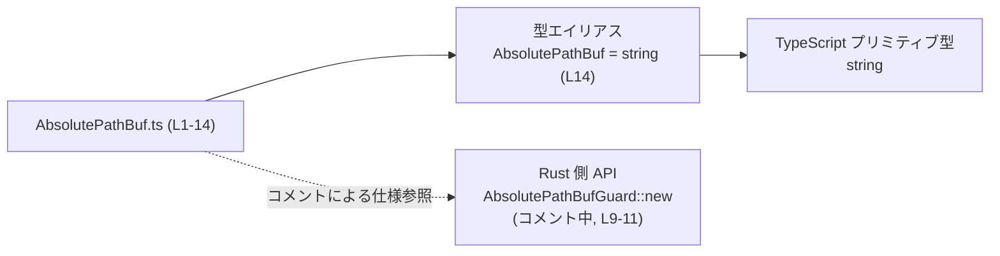
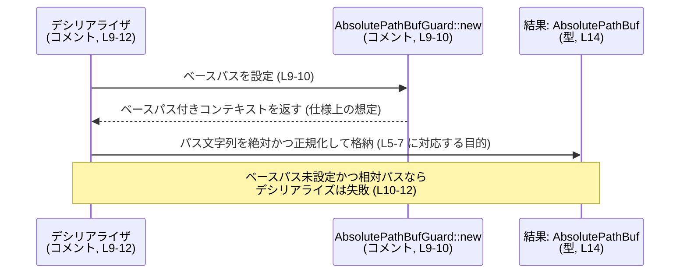

# app-server-protocol/schema/typescript/AbsolutePathBuf.ts コード解説

## 0. ざっくり一言

`AbsolutePathBuf.ts` は、**「絶対かつ正規化されたパス」を表す意味づけ付きの文字列型エイリアス `AbsolutePathBuf` を公開する、自動生成 TypeScript モジュール**です（`export type AbsolutePathBuf = string;`、AbsolutePathBuf.ts:L14）。

---

## 1. このモジュールの役割

### 1.1 概要

- このモジュールは、**絶対パスかつ正規化済みであることが保証されるべきパス**を表現するための型 `AbsolutePathBuf` を定義します（AbsolutePathBuf.ts:L5-7, L14）。
- 実体は TypeScript の `string` 型のエイリアスであり、**型レベルで意味を区別するためのラベル**として機能します（AbsolutePathBuf.ts:L14）。
- ドキュメントコメントには、デシリアライズ時に `AbsolutePathBufGuard::new` によるベースパス設定が必要であることが明示されています（AbsolutePathBuf.ts:L9-12）。

### 1.2 アーキテクチャ内での位置づけ

- ファイル先頭コメントから、このモジュールは **Rust の `ts-rs` クレートによって自動生成されている**ことが分かります（AbsolutePathBuf.ts:L1-3）。
- TypeScript 側から見ると、このファイルは **プロトコルスキーマの一部として共有されるパス型**を提供するだけで、他モジュールへの依存はありません（`string` は組み込み型のため、外部依存とはみなさない）。
- Rust 側には `AbsolutePathBufGuard::new` という API が存在し、デシリアライズ時にベースパスを設定する役割を持つことがコメントから読み取れますが、実装や所在ファイルはこのチャンクには現れません（AbsolutePathBuf.ts:L9-11）。

概念的な依存関係を Mermaid 図で示します（この図は **このチャンクの情報だけ**に基づく関係を表します）。



- 利用側（この型を import して使うアプリケーションコードなど）は、このチャンクには現れないため「不明」となります。

### 1.3 設計上のポイント

- **自動生成コード**  
  - 冒頭コメントで「GENERATED CODE! DO NOT MODIFY BY HAND!」とあり、人手で編集しない前提で設計されています（AbsolutePathBuf.ts:L1, L3）。
- **意味づけ付きプリミティブ型（semantic type）**  
  - 実体は `string` ですが、「絶対かつ正規化済みパス」という意味をドキュメントと型名で表現しています（AbsolutePathBuf.ts:L5-7, L14）。
- **型システムの役割**  
  - TypeScript の型チェックはコンパイル時のみであり、ランタイムでは `AbsolutePathBuf` も通常の `string` と同一です。そのため、「絶対で正規化済みである」という保証は **型システムだけでは強制されません**。
- **デシリアライズ時の前提条件**  
  - コメントによると、`AbsolutePathBuf` をデシリアライズする際には `AbsolutePathBufGuard::new` によってベースパスが設定されている必要があり、そうでない場合は、パスがすでに絶対でない限りデシリアライズが失敗する仕様になっています（AbsolutePathBuf.ts:L9-12）。
- **並行性・エラーハンドリング**  
  - 当該ファイルに関数や状態はなく、並行性制御やエラー処理ロジックは含まれていません。エラー条件はコメント上で「デシリアライズが失敗する」と記述されているのみで、具体的な例外型やエラー表現はこのチャンクには現れません（AbsolutePathBuf.ts:L9-12）。

---

## 2. 主要な機能一覧

このモジュールが提供する機能は 1 つです。

- `AbsolutePathBuf` 型: 絶対かつ正規化されたパスを表す `string` の型エイリアス（AbsolutePathBuf.ts:L5-7, L14）

---

## 3. 公開 API と詳細解説

### 3.1 型一覧（構造体・列挙体など）

このファイルで公開されている主要な型を一覧にします。

| 名前              | 種別       | 役割 / 用途                                                                 | 定義位置                        |
|-------------------|------------|-----------------------------------------------------------------------------|---------------------------------|
| `AbsolutePathBuf` | 型エイリアス | 絶対かつ正規化されたパスを表す意味づけ付き文字列。実体は `string` 型。      | AbsolutePathBuf.ts:L5-7, L14 |

#### `AbsolutePathBuf` の意味

- コメントより、次のように説明されています（AbsolutePathBuf.ts:L5-7, L9-12）。
  - 「絶対かつ正規化されたパス」
  - ただし、**ファイルシステム上で実在するか・正規化が「正規の絶対パス」（canonical）であるかは保証されない**。
  - デシリアライズ時には `AbsolutePathBufGuard::new` でベースパスが設定されていることが前提。

TypeScript の型システム上は `string` と互換であり、**型安全性は「他の文字列と区別できる」というレベル**にとどまります。ランタイムでの検証は、別の処理（Rust 側デシリアライザなど）に依存します。

### 3.2 関数詳細（最大 7 件）

このファイルには関数・メソッドは定義されていません（AbsolutePathBuf.ts:L1-14）。

- したがって、このセクションで詳細解説すべき関数は「該当なし」となります。
- デシリアライズ処理や `AbsolutePathBufGuard::new` は Rust 側の機能であり、この TypeScript ファイルには実装が含まれていません（AbsolutePathBuf.ts:L9-11）。

### 3.3 その他の関数

- このファイルには補助関数・ラッパー関数も一切定義されていません（AbsolutePathBuf.ts:L1-14）。
- 関数一覧は「なし」となります。

---

## 4. データフロー

このファイル自体には処理ロジックは含まれませんが、コメントから読み取れる **デシリアライズの概念的な流れ**を整理します。

- `AbsolutePathBuf` は「デシリアライズされた結果として得られるパス」であることが示唆されています（AbsolutePathBuf.ts:L9）。
- デシリアライズ時には、`AbsolutePathBufGuard::new` によりベースパスを設定する必要があります（AbsolutePathBuf.ts:L9-10）。
- ベースパス未設定の場合、パス文字列が既に絶対でなければデシリアライズは失敗すると記述されています（AbsolutePathBuf.ts:L10-12）。

この仕様をもとに、概念的なシーケンスを示します（あくまでコメントに基づく抽象化であり、実装はこのチャンクには現れません）。



この TypeScript モジュールは、上記フローの「**最終的に得られる型**」のみを定義しており、データ変換処理自体は含みません。

---

## 5. 使い方（How to Use）

### 5.1 基本的な使用方法

`AbsolutePathBuf` は `string` の型エイリアスなので、主な用途は

- 関数やメソッドの引数・戻り値
- オブジェクトのプロパティ

などで「絶対・正規化済みパス」であることを表現することです。

以下は、同一ディレクトリにこのファイルがあると仮定した例です（import パスはプロジェクト構成に依存するため、あくまで一例です）。

```typescript
// AbsolutePathBuf 型を読み込む（同じディレクトリにあると仮定した例）
import type { AbsolutePathBuf } from "./AbsolutePathBuf";

// 絶対パスを受け取って何らかの処理を行う関数
function processFile(path: AbsolutePathBuf): void {
    // path は絶対・正規化済みという前提で利用する
    console.log("Opening file at:", path);
}

// 絶対パスの例
const logPath: AbsolutePathBuf = "/var/log/app/server.log";

// 関数の呼び出し
processFile(logPath);
```

- TypeScript の型チェック上は、`logPath` に任意の文字列を代入できますが、**開発者は「絶対かつ正規化済みである」という契約を守る必要があります**。
- 実際には、Rust 側のデシリアライズ処理から渡される値をそのまま `AbsolutePathBuf` として扱う場面が想定できますが、その具体的なコードはこのチャンクには現れません。

### 5.2 よくある使用パターン

1. **API レスポンス／リクエストの型定義として使う**

```typescript
import type { AbsolutePathBuf } from "./AbsolutePathBuf";

interface FileInfo {
    path: AbsolutePathBuf;   // ファイルの絶対パス
    size: number;            // バイト数
}

// API から受け取ったデータをそのまま型付けする例
declare const file: FileInfo;
console.log(file.path);      // string として利用可能
```

1. **内部処理の前提条件を明確にする**

```typescript
import type { AbsolutePathBuf } from "./AbsolutePathBuf";

function joinWithConfigDir(configDir: AbsolutePathBuf, fileName: string): string {
    // configDir は必ず絶対パスという前提で計算できる
    return configDir + "/" + fileName;
}
```

### 5.3 よくある間違い

`AbsolutePathBuf` はコンパイル時のラベルに過ぎず、ランタイムチェックは行われません。誤用例と正しい意図の対比を示します。

```typescript
import type { AbsolutePathBuf } from "./AbsolutePathBuf";

// 誤りになりうる例: 相対パスを代入している
const relativePath: AbsolutePathBuf = "logs/server.log";
// ↑ TypeScript 上はコンパイルエラーにならないが、
//   コメント上の契約（絶対かつ正規化済み）には違反する。

// 正しい意図に沿った例: 先頭に / が付いた絶対パス
const absolutePath: AbsolutePathBuf = "/var/log/app/server.log";
```

このように、

- **型だけでは「絶対パスであること」は強制されない**
- コメントに書かれた契約を守る責任は、呼び出し側やデシリアライズ処理にある

点に注意が必要です（AbsolutePathBuf.ts:L5-7, L9-12）。

### 5.4 使用上の注意点（まとめ）

- **前提条件**
  - `AbsolutePathBuf` に代入される文字列は、「絶対かつ正規化されたパス」であることが前提です（AbsolutePathBuf.ts:L5-7）。
  - デシリアライズ時にはベースパス設定が必要であり、これが行われない場合、非絶対パスはエラーとなる仕様がコメントで示されています（AbsolutePathBuf.ts:L9-12）。
- **エラー条件**
  - TypeScript 側のこのファイルにはエラーを投げるコードはありませんが、Rust 側のデシリアライズ処理では、ベースパス未設定かつ相対パスが入力された場合、デシリアライズが失敗すると書かれています（AbsolutePathBuf.ts:L10-12）。
- **言語固有の安全性**
  - TypeScript の型チェックはコンパイル時だけであり、ランタイムでは `AbsolutePathBuf` と `string` は区別されません。
  - そのため、パスの妥当性チェックなどは **別途実装が必要**です。このファイルだけではパスの安全性（パス・トラバーサル等）を保証できません。
- **並行性**
  - このモジュールは型エイリアスだけを定義しており、状態や I/O を持ちません。したがって、並行実行やスレッドセーフティに関する懸念は直接的には存在しません。
- **セキュリティ**
  - 型エイリアスであるため、危険なパスや意図しないパスを防ぐ仕組みは含まれていません。ファイルアクセスなどに利用する際は、上位レイヤーでバリデーションやサニタイズを行う必要があります。

---

## 6. 変更の仕方（How to Modify）

### 6.1 新しい機能を追加する場合

- ファイル冒頭に「GENERATED CODE! DO NOT MODIFY BY HAND!」「Do not edit this file manually.」とあるため（AbsolutePathBuf.ts:L1, L3）、**この TypeScript ファイルを直接編集する設計にはなっていません**。
- `AbsolutePathBuf` の構造や意味を変更したい場合、
  - 生成元である Rust 側の型定義
  - `ts-rs` による生成設定
  に変更を加える必要があると考えられますが、**生成元のファイル名やパスはこのチャンクには現れません**（不明）。

このため、「新しい機能をこの TypeScript ファイルに直接追加する」という運用はコメントの方針とは整合しません。

### 6.2 既存の機能を変更する場合

`AbsolutePathBuf` の意味や型を変更する際に注意すべき点を整理します。

- **影響範囲**
  - `AbsolutePathBuf` を参照するすべての TypeScript コード（関数引数、戻り値、インターフェースのプロパティなど）に影響が出ます。
  - Rust 側のシリアライズ／デシリアライズ処理との整合性が崩れる可能性がありますが、Rust 側のコードはこのチャンクには現れないため、具体的な影響範囲は不明です。
- **契約の保持**
  - コメントで定義されている契約（絶対かつ正規化済み、デシリアライズ時のベースパス要件）を変える場合、プロトコル仕様自体が変化するため、クライアント・サーバ双方の実装見直しが必要になります（AbsolutePathBuf.ts:L5-7, L9-12）。
- **テスト**
  - 型エイリアスだけの変更であれば、TypeScript 側のコンパイルが通るかを確認することで最低限の検証は可能です。
  - 実際のパスの扱い（絶対か・正規化されているか・デシリアライズが正しく失敗／成功するか）は、Rust 側および統合テストに依存します。このチャンクにはテストコードは含まれていません。

---

## 7. 関連ファイル

このチャンクから直接分かる関連要素をまとめます。

| パス / 名前                    | 役割 / 関係                                                                                 |
|--------------------------------|----------------------------------------------------------------------------------------------|
| （不明）Rust 側 `AbsolutePathBuf` | `ts-rs` による生成元と思われる Rust の型。コメントで `AbsolutePathBuf` として言及されるが、パスは不明（AbsolutePathBuf.ts:L5-7, L9）。 |
| （不明）Rust 側 `AbsolutePathBufGuard::new` | デシリアライズ時のベースパス設定に用いる API としてコメントで言及されるが、実装位置は不明（AbsolutePathBuf.ts:L9-11）。 |
| `app-server-protocol/schema/typescript/AbsolutePathBuf.ts` | 当該ファイル。TypeScript 側で `AbsolutePathBuf` 型エイリアスを定義する自動生成コード（AbsolutePathBuf.ts:L1-14）。 |

- このチャンクには、他の TypeScript ファイル（例: インデックスモジュールや他のスキーマ定義）への import/export は現れないため、それらの具体的な関連は「不明」です。
- テストコードやサポート用ユーティリティに関する情報も、このチャンクには現れません。

---

### 付記: コンポーネントインベントリー（総括）

最後に、このファイルに現れる型コンポーネントを行番号付きで整理します。

| コンポーネント名    | 種別        | 説明                                                                                   | 定義位置                        |
|---------------------|-------------|----------------------------------------------------------------------------------------|---------------------------------|
| `AbsolutePathBuf`   | 型エイリアス | 絶対かつ正規化されたパスを表す `string` の別名。デシリアライズ時の前提条件がコメントで定義されている。 | AbsolutePathBuf.ts:L5-7, L14 |
| `AbsolutePathBufGuard::new` | Rust API 名（コメント） | デシリアライズ時にベースパスを設定するための Rust 側 API としてコメントにのみ登場する。       | AbsolutePathBuf.ts:L9-11 |

- このインベントリーに記載されている以外に、関数・クラス・列挙体などは **このチャンクには現れません**。
