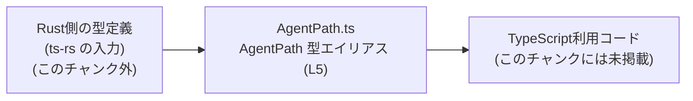
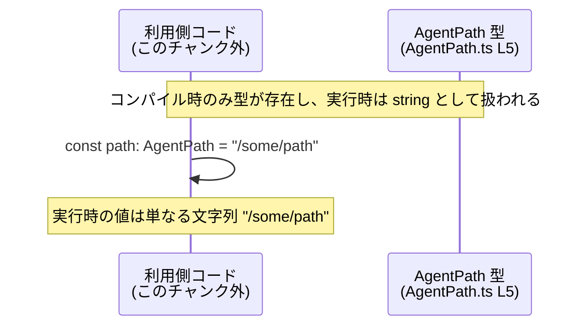

# app-server-protocol/schema/typescript/AgentPath.ts コード解説

## 0. ざっくり一言

`AgentPath` という型エイリアスを `string` として公開する、自動生成された TypeScript スキーマ定義ファイルです（`AgentPath.ts:L1-5`）。

---

## 1. このモジュールの役割

### 1.1 概要

- このモジュールは、`AgentPath` という名前の型を TypeScript 側に提供するためのファイルです（`AgentPath.ts:L5-5`）。
- 型の実体は `string` であり、**任意の文字列をとる型エイリアス**として定義されています（`AgentPath.ts:L5-5`）。
- ファイル先頭のコメントにより、Rust から TypeScript 型を生成するツール `ts-rs` によって自動生成されたものであり、手動編集しないことが明記されています（`AgentPath.ts:L1-3`）。

### 1.2 アーキテクチャ内での位置づけ

- ディレクトリ `schema/typescript` に置かれていることから、アプリケーションサーバのプロトコル定義を TypeScript へエクスポートした一部であると考えられますが、他ファイルや利用箇所はこのチャンクには現れません。
- コメントから、Rust の型定義（`ts-rs` の入力） → 自動生成された TypeScript 型 → TypeScript の利用側コード、という流れが存在すると読み取れます（`AgentPath.ts:L1-3`）。

この位置づけを概念図として示します。



> 最右の「TypeScript利用コード」の具体的なモジュール名や内容は、このチャンクからは分かりません。

### 1.3 設計上のポイント

- **自動生成コード**  
  - 冒頭コメントで「GENERATED CODE」「Do not edit this file manually」と明示されています（`AgentPath.ts:L1-3`）。
  - 変更は、直接このファイルではなく、`ts-rs` が参照する Rust 側の定義で行うことが意図されていると解釈できます（`AgentPath.ts:L1-3`）。
- **型エイリアスによるシンプルな表現**  
  - `export type AgentPath = string;` により、**ランタイム上は完全に `string` と同一の型**として扱われます（`AgentPath.ts:L5-5`）。
  - 追加のフィールドやメソッド、ブランド付け（`string & { __brand: "AgentPath" }` のような構造）は一切なく、コンパイル時の名前付けのみを提供します（`AgentPath.ts:L5-5`）。
- **バリデーションやエラーハンドリングは未提供**  
  - このファイルには関数・クラス・ユーティリティがなく、`AgentPath` の値を検証したり変換したりするロジックは存在しません（`AgentPath.ts:L1-5`）。
  - そのため、「正しい形式のパスかどうか」を判定するような仕組みは、この型単体からは提供されていません。

---

## 2. 主要な機能一覧

このモジュールが提供する機能は 1 点だけです。

- `AgentPath` 型エイリアス定義: `AgentPath` という名前で `string` 型を再定義し、他の TypeScript コードからインポート可能にする（`AgentPath.ts:L5-5`）。

---

## 3. 公開 API と詳細解説

### 3.1 型一覧（構造体・列挙体など）

このファイルに存在する型の一覧です。

| 名前        | 種別        | 役割 / 用途                                                                 | 定義位置               |
|-------------|-------------|------------------------------------------------------------------------------|------------------------|
| `AgentPath` | 型エイリアス | 任意の文字列を表す型。`AgentPath` という名前を通じて、文字列を意味づけして扱う | `AgentPath.ts:L5-5`    |

> 型定義からは、「どのような形式の文字列か（URL なのか、ファイルパスなのか等）」は読み取れません。命名から用途は推測できますが、コード上の事実としては単なる `string` です（`AgentPath.ts:L5-5`）。

### 3.2 関数詳細（最大 7 件）

このファイルには関数定義が 1 つも存在しません（`AgentPath.ts:L1-5`）。  
したがって、ここで詳説すべき公開関数 API はありません。

### 3.3 その他の関数

- 補助関数やラッパー関数も定義されていません（`AgentPath.ts:L1-5`）。

---

## 4. データフロー

### 4.1 型レベルでのデータフロー概要

`AgentPath` は単なる `string` の型エイリアスであり、**コンパイル時には型名として区別されるが、実行時の値は普通の文字列とまったく同じ**です（`AgentPath.ts:L5-5`）。

- **コンパイル時**  
  - 変数や関数の引数・戻り値に `AgentPath` を指定すると、TypeScript コンパイラはそれを `string` と等価な型として扱います。
  - 型付けにより、「ここには `AgentPath` を置く」という意図をコード上に表現できます。
- **実行時**  
  - JavaScript にトランスパイルされたコードでは、`AgentPath` という名前は消え、値は単なる文字列として扱われます。
  - 追加のメタデータやバリデーションは実行時には存在しません。

### 4.2 概念的なシーケンス図

次の図は、「利用側コード」が `AgentPath` 型の値を扱うときの概念的な流れを表します。`AgentPath` 型自体の定義はこのファイルにあり（L5）、利用側コードはこのチャンク外にあります。



> 「利用側コード」がどのモジュールか、どのように `AgentPath` を使っているかは、このチャンクには現れません。

---

## 5. 使い方（How to Use）

### 5.1 基本的な使用方法

`AgentPath` は `string` の別名として定義されているので（`AgentPath.ts:L5-5`）、通常の文字列と同じ感覚で利用できますが、型名によって意味付けができます。

```typescript
// AgentPath 型をインポートする例
// （実際の相対パスはプロジェクト構成に依存します）
import type { AgentPath } from "./AgentPath";  // AgentPath.ts から型をインポート

// AgentPath 型の変数を宣言する
const path: AgentPath = "/agents/123";  // AgentPath は string の別名なので、文字列リテラルを代入できる

// 例として AgentPath を受け取る関数を定義する
function logAgentPath(p: AgentPath): void {
    console.log("AgentPath:", p);      // 実行時には単なる string として出力される
}

logAgentPath(path);                    // AgentPath 型の値を渡す
```

この例の `logAgentPath` 関数は、**説明用にここで定義したものであり、元のリポジトリに存在するとは限りません**。

### 5.2 よくある使用パターン

1. **意味付けされた文字列としての利用**

```typescript
import type { AgentPath } from "./AgentPath";

// AgentPath を持つオブジェクトを定義する
interface AgentInfo {
    id: string;          // これは一般的な文字列ID
    path: AgentPath;     // こちらは AgentPath として意味付けされたパス
}

const agent: AgentInfo = {
    id: "agent-1",
    path: "/agents/agent-1",  // 文字列だが、型上は AgentPath
};
```

1. **関数の引数・戻り値に使用する**

```typescript
import type { AgentPath } from "./AgentPath";

// AgentPath を受け取る関数
function openAgent(path: AgentPath): void {
    // path はコンパイル時には AgentPath 型だが、
    // 実行時には string として扱われる
}

// AgentPath を返す関数
function buildAgentPath(id: string): AgentPath {
    return `/agents/${id}`;  // string をそのまま返している
}
```

いずれの例でも、コンパイル時には `AgentPath` という名前によりコードの意図が明確になり、実行時には文字列として扱われます。

### 5.3 よくある間違い

1. **AgentPath が `string` と別物のランタイム型だと誤解する**

```typescript
import type { AgentPath } from "./AgentPath";

const p: AgentPath = "/agents/1";

// 間違い: AgentPath を string に代入できないと思い込む
// const s: string = p;  // 実際にはこれはコンパイル可能

// 正しい認識:
const s: string = p;  // OK: AgentPath は string のエイリアスなので代入可能
```

`AgentPath` はブランド付き型やクラスではなく、**単なる型エイリアス**であるため、TypeScript の型システム上は `string` と同一視されます（`AgentPath.ts:L5-5`）。

1. **バリデーションが自動で行われると期待する**

```typescript
import type { AgentPath } from "./AgentPath";

// 間違い: 無効なパスを代入するとコンパイルエラーになると期待する
const p: AgentPath = "not a path";  // 型的には OK。形式チェックは行われない。
```

`AgentPath` は値の内容には関知せず、「文字列であること」しか表現しません（`AgentPath.ts:L5-5`）。  
パス形式の妥当性チェックは、別のバリデーションロジックで行う必要があります（このチャンクには存在しません）。

### 5.4 使用上の注意点（まとめ）

- **バリデーションがない**  
  - `AgentPath` は `string` であり、空文字列や不正な形式の文字列も型レベルでは禁止されません（`AgentPath.ts:L5-5`）。
  - 入力データや外部から受け取る値を `AgentPath` として扱う場合、必要に応じて別途バリデーションを行う必要があります。
- **ランタイムでは区別されない**  
  - 実行時には単なる `string` なので、ログやシリアライズ時に `AgentPath` であるかどうかを識別する情報は残りません（`AgentPath.ts:L5-5`）。
- **null / undefined の扱い**  
  - 型定義は純粋な `string` であり、`AgentPath` の許容範囲に `null` や `undefined` は含まれていません（`AgentPath.ts:L5-5`）。
  - これらを許容したい場合は、利用側で `AgentPath | null` のようなユニオン型を定義する必要があります。
- **安全性・セキュリティ**  
  - この型定義自体には、パスの正規化やディレクトリトラバーサル防止などのセキュリティ機構は含まれていません（`AgentPath.ts:L1-5`）。
  - セキュリティ上重要なパスとして用いる場合は、別途検証やサニタイズ処理を行う必要があります。

---

## 6. 変更の仕方（How to Modify）

### 6.1 新しい機能を追加する場合

このファイルは自動生成コードであり、冒頭コメントで「手動で変更しない」ことが明記されています（`AgentPath.ts:L1-3`）。  
従って、**通常はこのファイルに新しいコードを直接追加することは想定されていません**。

一般的な `ts-rs` の運用では:

1. Rust 側で新しい型やフィールドを定義し、`ts-rs` の属性（例: `#[derive(TS)]`, `#[ts(export)]`）を付与する。
2. `ts-rs` のコード生成を実行する。
3. TypeScript 側の `.ts` ファイルが再生成され、その中に新しい型が追加される。

> 元となる Rust 側の型定義やビルドフローは、このチャンクには含まれていないため、具体的な場所やコマンドは不明です。

### 6.2 既存の機能を変更する場合

`AgentPath` の定義を変更したい場合も、手順は基本的に同様です。

- **直接編集しない理由**（`AgentPath.ts:L1-3`）  
  - 手動で `AgentPath` の型を `string` 以外に書き換えても、次回の自動生成で上書きされる可能性があります。
  - そのため、恒久的な変更は Rust 側の元定義に対して行う必要があります。
- **影響範囲**  
  - `AgentPath` を `string` 以外の型に変える、あるいはブランド付き構造に変える等の変更をすると、
    - すべての `AgentPath` 利用箇所が影響を受けます。
    - 代入互換性や関数シグネチャが変わる可能性があるため、利用側 TypeScript コードでコンパイルエラーが発生することがあります。
- **契約の確認**  
  - 現状の契約は「`AgentPath` は `string` である」という一点のみです（`AgentPath.ts:L5-5`）。
  - 変更時には、この契約を前提に書かれているコード（他ファイル。具体的な場所はこのチャンクには現れません）を再確認する必要があります。

---

## 7. 関連ファイル

このチャンクには、他ファイル名やインポート・エクスポートの記述が一切ありません（`AgentPath.ts:L1-5`）。  
そのため、厳密に関連ファイルを特定することはできません。

推測を交えずに言える範囲での一覧は次のとおりです。

| パス | 役割 / 関係 |
|------|------------|
| （不明） | このチャンク内には、`AgentPath` の利用箇所や元となる Rust 型定義への参照は現れません。 |

> ただし、ディレクトリ名 `schema/typescript` やコメント中の `ts-rs` から、同じディレクトリ内に他のスキーマ定義 `.ts` ファイルや、Rust 側に対応する型定義が存在することが一般的です。これらの具体的なパスや名前は、このチャンクだけからは断定できません。
