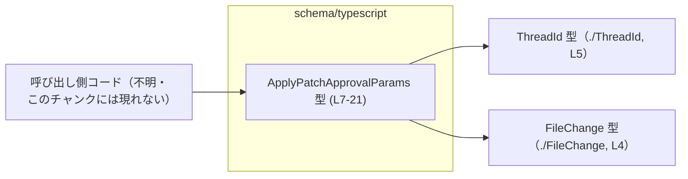
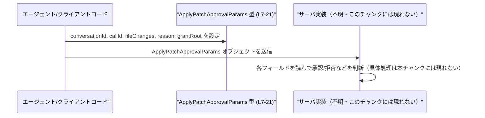

# app-server-protocol/schema/typescript/ApplyPatchApprovalParams.ts

## 0. ざっくり一言

パッチ適用の承認に関するパラメータオブジェクト `ApplyPatchApprovalParams` の TypeScript 型定義を提供するファイルです（自動生成コード）（app-server-protocol/schema/typescript/ApplyPatchApprovalParams.ts:L1-3, L7-21）。

---

## 1. このモジュールの役割

### 1.1 概要

- このモジュールは、パッチ適用処理に関する「承認要求」のパラメータを表現するための型 `ApplyPatchApprovalParams` を定義します（L7-21）。
- 型は会話スレッド ID、コール ID、ファイルごとの変更内容、オプションの理由、オプションの書き込み許可ルートを保持します（L7, L12, L16, L21）。
- ファイル冒頭のコメントから、このコードは Rust 側の型を `ts-rs` により変換した自動生成コードであり、手動で編集すべきでないことが示されています（L1-3）。

### 1.2 アーキテクチャ内での位置づけ

このモジュールは、型のみを提供し、他の処理ロジックから利用される立場にあります。

- `ApplyPatchApprovalParams` は `ThreadId` 型と `FileChange` 型に依存しています（L4-5, L7, L12）。
- どのモジュールからこの型が利用されているかは、このチャンクには現れません。

依存関係の概略を Mermaid 図で示します。



この図は、`ApplyPatchApprovalParams` が他型（`ThreadId`, `FileChange`）に依存し、さらに未特定の呼び出し側コードから利用されることを示します。

### 1.3 設計上のポイント

コードから読み取れる設計上の特徴は次のとおりです。

- **自動生成コード**  
  - 「GENERATED CODE! DO NOT MODIFY BY HAND!」と `ts-rs` による生成であることが明記されています（L1-3）。  
    → 変更は TypeScript 側ではなく、元の Rust 型定義側で行う前提です。
- **純粋なデータコンテナ**  
  - 関数やメソッドは定義されておらず、単一のオブジェクト型（type alias）のみを提供します（L7-21）。
- **外部識別子連携**  
  - `conversationId: ThreadId` により、会話スレッドを識別する型へ依存しています（L4-5, L7）。
  - `callId: string` はコメントで Rust 側の `PatchApplyBeginEvent` / `PatchApplyEndEvent` と関連づけるために用いると説明されています（L8-11, L12）。
- **柔軟なファイル変更集合表現**  
  - `fileChanges` は任意の文字列キーを持つオブジェクトとして表現され、各キーに `FileChange` が紐づきます（L12）。  
    → TypeScript 的には `{ [key: string]: FileChange | undefined }` 相当の構造です。
- **null を使った任意フィールド**  
  - `reason` と `grantRoot` は `string | null` となっており、プロパティ自体は常に存在しつつ値が `null` かどうかで有無を表します（L16, L21）。  
    → `undefined` ではなく `null` を使うことが契約に含まれます。

---

## 2. 主要な機能一覧

このモジュールは型のみを提供し、実行時機能（関数・クラス）は持ちません。そのため、「機能」はすべてデータ構造の観点になります。

- `ApplyPatchApprovalParams` 型:  
  パッチ適用承認リクエストに必要な情報（会話 ID、コール ID、ファイル変更集合、理由、書き込み許可ルート）を 1 つのオブジェクトとして保持するための型です（L7-21）。

---

## 3. 公開 API と詳細解説

### 3.1 型一覧（構造体・列挙体など）

このファイル内で公開される主な型と、その依存関係です。

#### 公開型

| 名前 | 種別 | 役割 / 用途 | 定義位置 |
|------|------|-------------|----------|
| `ApplyPatchApprovalParams` | 型エイリアス（オブジェクト型） | パッチ適用承認リクエストに必要な全フィールドをまとめたデータコンテナ | `app-server-protocol/schema/typescript/ApplyPatchApprovalParams.ts:L7-21` |

#### 依存型（このファイルでは定義されない）

| 名前 | 種別 | 役割 / 用途 | 参照位置 | 定義有無（本チャンク） |
|------|------|-------------|----------|------------------------|
| `FileChange` | 型（詳細不明） | 各ファイルに対する変更内容を表す型と考えられますが、このチャンクのコードからは構造は分かりません。 | `ApplyPatchApprovalParams.ts:L4, L12` | 定義はこのチャンクには現れません |
| `ThreadId` | 型（詳細不明） | 会話スレッドを識別する ID 型と推測されますが、構造はこのチャンクには現れません。 | `ApplyPatchApprovalParams.ts:L5, L7` | 定義はこのチャンクには現れません |

> 「〜と考えられます／推測されます」としている部分は、型名およびコメントからの推測であり、実際の構造や意味は参照先ファイルを確認する必要があります。

### 3.2 関数詳細

このファイルには関数・メソッドが一切定義されていません（L1-21）。  
そのため、「関数詳細テンプレート」に該当する公開 API は存在しません。

### 3.3 その他の関数

- 該当なし（ヘルパー関数やラッパー関数も存在しません）。

---

## 4. データフロー

このファイル自体には処理ロジックはありませんが、`ApplyPatchApprovalParams` 型がどのように利用されるかを、**想定シナリオ** として説明します（処理ロジックはこのチャンクには現れず、以下は命名とコメントに基づく推測です）。

### データフローの要点（想定）

1. パッチ適用を開始する前に、エージェントまたはクライアントが `ApplyPatchApprovalParams` オブジェクトを構築します（L7-21）。
2. `conversationId` には対象のスレッド ID (`ThreadId`) が設定されます（L7）。
3. `callId` は、そのパッチ適用処理を `PatchApplyBeginEvent` / `PatchApplyEndEvent` と相互参照するための識別子として設定されます（L8-12）。
4. `fileChanges` には、ファイル名（と推測される任意の文字列キー）から `FileChange` へのマッピングが格納されます（L12）。
5. `reason` や `grantRoot` は必要に応じて `string` または `null` が設定され、サーバ側のロジックで参照されると考えられます（L16, L21）。

### シーケンス図（概念図）



この図は、`ApplyPatchApprovalParams` がクライアントとサーバ間のプロトコル・メッセージ的な役割を果たすことを**示唆**していますが、実際のネットワーク送受信コードはこのチャンクには現れません。

---

## 5. 使い方（How to Use）

### 5.1 基本的な使用方法

`ApplyPatchApprovalParams` 型の値を生成し、どこかの関数へ渡す、またはシリアライズして送信する、といった形で利用される想定です。

```typescript
// ApplyPatchApprovalParams 型をインポートする（パスは利用側のファイル位置に応じて調整）
import type { ApplyPatchApprovalParams } from "./ApplyPatchApprovalParams"; // 型定義のみをインポート

// ThreadId 型と FileChange 型も別ファイルからインポートする想定です
import type { ThreadId } from "./ThreadId";           // 会話を識別する ID 型
import type { FileChange } from "./FileChange";       // 単一ファイルの変更内容を表す型

// ThreadId 型の値をどこかから取得したと仮定します
const threadId: ThreadId = /* どこかで取得した ThreadId */ null as any; // 実際の実装では適切な値を渡す

// FileChange 型の値を用意する（構造はこのチャンクには現れないため擬似コードとしています）
const mainTsChange: FileChange = /* main.ts に対する変更 */ null as any;

// ApplyPatchApprovalParams 型の値を構築する
const params: ApplyPatchApprovalParams = {
    conversationId: threadId,         // 対象スレッドを表す ID（L7）
    callId: "apply-12345",            // Begin/End イベントと対応づけるための識別子（L8-12）
    fileChanges: {                    // 文字列キーから FileChange へのマップ（L12）
        "src/main.ts": mainTsChange,  // キーは string 型であれば任意
    },
    reason: "追加の書き込みが必要なため", // 理由。なければ null を設定（L16）
    grantRoot: "/workspace",          // セッション中に書き込みを許可してほしいルート（L18-21）
};

// params を何らかの API に渡したり、シリアライズして送信したりすることが想定されます。
```

ポイント:

- `reason` と `grantRoot` が不要な場合は `undefined` ではなく `null` を設定します（L16, L21）。
- `fileChanges` のキーは string 型であれば任意ですが、名前からはファイルパスを想定していると解釈できます（L12）。ただしこれは命名・コメントからの推測であり、このチャンクだけでは断定できません。

### 5.2 よくある使用パターン

#### パターン 1: 最小限の情報のみ送る

理由やルートの拡張許可を使わない場合の例です。

```typescript
const paramsMinimal: ApplyPatchApprovalParams = {
    conversationId: threadId,   // 必須（L7）
    callId: "apply-12345",      // 必須（L12）
    fileChanges: {},            // 空オブジェクトも許される（L12）
    reason: null,               // 理由なしは null（L16）
    grantRoot: null,            // 追加の書き込み許可を要求しない（L21）
};
```

#### パターン 2: 特定ディレクトリ以下への書き込み許可を要求する

コメントには、`grantRoot` が「セッションの残りの間、そのルート以下の書き込みを許可してほしいという要求」であると書かれています（L17-19）。

```typescript
const paramsGrantRoot: ApplyPatchApprovalParams = {
    conversationId: threadId,
    callId: "apply-67890",
    fileChanges: {
        "src/new-feature.ts": mainTsChange,
    },
    reason: "このディレクトリ以下で複数ファイルを編集する必要があるため", // 追加権限を説明（L14-16）
    grantRoot: "/workspace/src", // セッション中の書き込みルートとして要求（L17-20）
};
```

なお、コメントには「(unclear if this is honored today)」とあり、このフラグが実際に尊重されているかは不明であることが明示されています（L19）。  
→ 安全性設計上、`grantRoot` によって必ず権限制御が行われると前提することは避け、実際のサーバ実装を確認する必要があります。

### 5.3 よくある間違い

この型の特徴（`null` とオプショナルプロパティ）から、起こりやすい誤用の例を挙げます。

#### 誤用例 1: `reason` に `undefined` を入れてしまう

```typescript
// 誤り例: reason に undefined を代入している
const badParams1: ApplyPatchApprovalParams = {
    conversationId: threadId,
    callId: "apply-1",
    fileChanges: {},
    // reason: string | null で定義されているのに undefined を指定している（L16）
    reason: undefined as any,      // 型エラー or 実質的な契約違反
    grantRoot: null,
};
```

`reason` の型は `string | null` であり（L16）、`undefined` は許可されていません。  
strictNullChecks 有効時にはコンパイルエラーになりますし、プロトコル上も `null` で「理由なし」を表現することが期待されます。

#### 誤用例 2: `fileChanges` を `Map<string, FileChange>` にしてしまう

```typescript
// 誤り例: fileChanges を Map にしてしまう（L12ではオブジェクト型として定義）
const badParams2: ApplyPatchApprovalParams = {
    conversationId: threadId,
    callId: "apply-2",
    // fileChanges: { [key: string]?: FileChange } であるところを
    // Map<string, FileChange> にしているため型が一致しない
    fileChanges: new Map<string, FileChange>() as any,
    reason: null,
    grantRoot: null,
};
```

`fileChanges` はインデックスシグネチャ付きのプレーンオブジェクトとして定義されています（L12）。  
`Map` や配列で代用すると型が一致しないため、意図したシリアライズ形式（JSON など）と異なる可能性があります。

### 5.4 使用上の注意点（まとめ）

- **このファイルを直接編集しないこと**  
  - 冒頭コメントに「GENERATED CODE! DO NOT MODIFY BY HAND!」と明記されています（L1-3）。  
    型の変更は元の Rust 側定義から行う必要があります。
- **`null` と `undefined` の区別**  
  - `reason` と `grantRoot` は `string | null` であり（L16, L21）、プロパティは必ず存在します。  
    「値なし」は `null` で表現し、`undefined` は使わない前提です。
- **`fileChanges` のキーは string**  
  - `{ [key in string]?: FileChange }` により、任意の文字列キーが利用可能です（L12）。  
    ユーザー入力をそのままキーとして使う場合、後段でプレーンオブジェクト操作を行う実装によっては `__proto__` などの特殊キーの扱いに注意が必要です（これは一般的な JavaScript/TypeScript の注意点であり、このファイルだけから具体的な影響は判断できません）。
- **並行性・エラー処理**  
  - このファイルは純粋な型定義のみであり、並行性制御やエラー処理は一切行いません。  
    これらは、この型を利用する別の層（サーバ側ロジック等）で実装されているはずですが、このチャンクには現れません。

---

## 6. 変更の仕方（How to Modify）

### 6.1 新しい機能を追加する場合

このファイルは `ts-rs` により自動生成されているため、**直接変更すべきではありません**（L1-3）。

新しいフィールドを `ApplyPatchApprovalParams` に追加したい場合の一般的な流れは次のようになります。

1. **元の Rust 側型定義を特定する**  
   - コメントに `codex_protocol::protocol::PatchApplyBeginEvent` など Rust 側の型名が登場しますが（L8-11）、`ApplyPatchApprovalParams` に対応する Rust 型の場所はこのチャンクには現れません。
2. **Rust 側の構造体にフィールドを追加する**  
   - `ts-rs` のドキュメントに従い、TypeScript への出力に反映されるよう Rust 側にフィールドや属性を追加します（この具体的な手順はこのファイルからは分かりません）。
3. **コード生成を再実行する**  
   - ビルドスクリプトや専用コマンドにより、TypeScript 側の型定義を再生成します。
4. **利用箇所の更新**  
   - 追加したフィールドを、TypeScript 側の利用箇所で適切に設定・参照します。

このファイルのみからは、Rust 側のパスやビルドフローは分かりません。そのため、実際のプロジェクトのビルド手順書やスクリプトを参照する必要があります。

### 6.2 既存の機能を変更する場合

例えば `reason` の型を `string | null` から `string | undefined` に変えたい、といった変更も同様に TypeScript 側ではなく元の定義で行う必要があります。

変更時の注意点:

- **プロトコル互換性**  
  - これはおそらくクライアントとサーバ間のプロトコルに属する型であるため、フィールド削除や型変更は互換性の問題を生む可能性があります。  
    既存のクライアント・サーバ双方を確認する必要があります。
- **null ハンドリング契約**  
  - `string | null` → `string` or `string | undefined` への変更は、既存コードの null チェックロジックを壊す可能性があります。
- **生成プロセスの把握**  
  - 自動生成ファイルを直接編集すると、次回の生成で上書きされます（L1-3）。必ず元定義と生成スクリプトの両方を確認する必要があります。

---

## 7. 関連ファイル

このモジュールと密接に関係するファイル・概念を整理します。

| パス / 名称 | 役割 / 関係 |
|-------------|------------|
| `app-server-protocol/schema/typescript/FileChange.ts` | `import type { FileChange } from "./FileChange";` で参照される型定義ファイルと推測されます（L4, L12）。各ファイルに対する変更内容を表すと考えられますが、このチャンクには定義が現れません。 |
| `app-server-protocol/schema/typescript/ThreadId.ts` | `import type { ThreadId } from "./ThreadId";` で参照される型定義ファイルと推測されます（L5, L7）。会話スレッド ID を表すと考えられますが、このチャンクには定義が現れません。 |
| `codex_protocol::protocol::PatchApplyBeginEvent`（Rust 側型名, パス不明） | コメント内で `callId` の関連先として参照されています（L8-11）。`ApplyPatchApprovalParams` と対応する Rust 側のイベント型であり、コール ID による相関付けに使用されると説明されていますが、この TypeScript コードからは定義位置や詳細は分かりません。 |
| `codex_protocol::protocol::PatchApplyEndEvent`（Rust 側型名, パス不明） | 上記と同様に `callId` と関連づけられるイベント型としてコメントに登場します（L8-11）。 |

このファイルは純粋な型定義であり、テストコードやロギングなどの補助的コンポーネントは、このチャンクには現れません。
