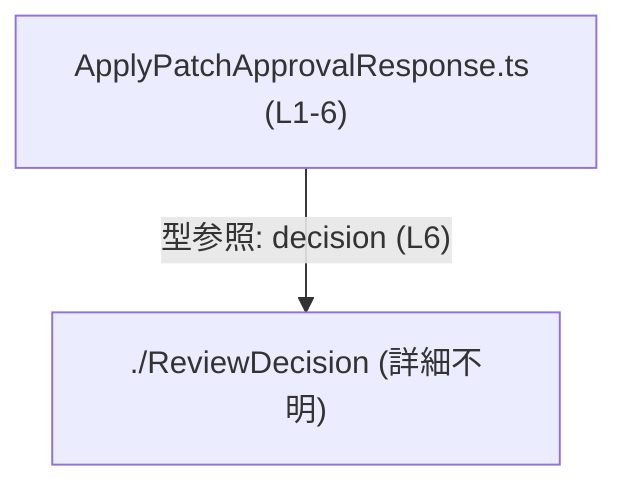
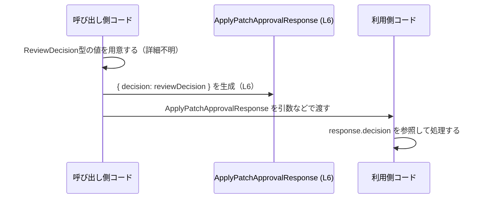

# app-server-protocol/schema/typescript/ApplyPatchApprovalResponse.ts

## 0. ざっくり一言

`ReviewDecision` 型を 1 プロパティにもつレスポンス用オブジェクト型 `ApplyPatchApprovalResponse` を定義する、自動生成された TypeScript の型定義ファイルです（`ApplyPatchApprovalResponse.ts:L1-3`, `L4-6`）。

---

## 1. このモジュールの役割

### 1.1 概要

- このモジュールは、型 `ApplyPatchApprovalResponse` をエクスポートしています（`ApplyPatchApprovalResponse.ts:L6-6`）。
- `ApplyPatchApprovalResponse` はオブジェクト型で、プロパティ `decision` に `ReviewDecision` 型の値を格納します（`ApplyPatchApprovalResponse.ts:L4-6`）。
- ファイル冒頭のコメントから、この型定義は Rust 側の構造体等から `ts-rs` によって自動生成されていることが分かります（`ApplyPatchApprovalResponse.ts:L1-3`）。

> 名称からは「パッチ適用に関する承認結果のレスポンス」を表す型であることが想定されますが、コードからは役割の詳細までは断定できません。

### 1.2 アーキテクチャ内での位置づけ

このファイルは型定義のみを提供し、他モジュールから利用されることを想定した **スキーマ定義** 的な位置づけになっています。

- 依存先
  - `"./ReviewDecision"` モジュールから `ReviewDecision` 型をインポートしています（`ApplyPatchApprovalResponse.ts:L4-4`）。
  - 実際のファイルパスや中身はこのチャンクには現れません。

依存関係を簡易的に図示すると次のようになります。



この図は、「`ApplyPatchApprovalResponse.ts` が `ReviewDecision` 型に依存している」という、型レベルの依存関係を表しています。

### 1.3 設計上のポイント

- **自動生成コード**
  - 冒頭コメントに `GENERATED CODE! DO NOT MODIFY BY HAND!` と明記されており（`ApplyPatchApprovalResponse.ts:L1-3`）、人手による編集は想定されていません。
  - Rust から TypeScript 型を生成する `ts-rs` によって生成されていることが示されています（`ApplyPatchApprovalResponse.ts:L3-3`）。
- **型専用モジュール**
  - 実行時ロジックや関数は一切含まず、型エイリアスの定義のみが存在します（`ApplyPatchApprovalResponse.ts:L4-6`）。
- **単純な構造**
  - `decision` プロパティが必須のオブジェクト型であり、構造は 1 フィールドに限定されています（`ApplyPatchApprovalResponse.ts:L6-6`）。
- **エラーハンドリング・並行性**
  - 実行時の関数・メソッドを持たないため、このファイル単体ではエラーハンドリングや並行性に関するロジックは存在しません。

---

## 2. 主要な機能一覧

このファイルで提供される「機能」は、型レベルに限定されます。

- `ApplyPatchApprovalResponse` 型定義: `decision` プロパティに `ReviewDecision` 型の値を保持するレスポンス用オブジェクト型のエイリアス（`ApplyPatchApprovalResponse.ts:L4-6`）。

---

## 3. 公開 API と詳細解説

### 3.1 型一覧（構造体・列挙体など）

このファイルで公開される主要な型は次の 1 つです。

| 名前                         | 種別       | 定義位置                                   | フィールド                     | 役割 / 用途（コードから読み取れる範囲） |
|------------------------------|------------|--------------------------------------------|--------------------------------|------------------------------------------|
| `ApplyPatchApprovalResponse` | 型エイリアス | `ApplyPatchApprovalResponse.ts:L6-6` | `decision: ReviewDecision` | `ReviewDecision` 型の値を `decision` プロパティとして保持するオブジェクト型。名称から、何らかの「承認結果」を表すレスポンスであることが想定されますが、用途の詳細はコードからは不明です。 |

関連する依存型（このファイル内では定義されないもの）:

| 名前             | 種別     | 参照位置                                 | 備考 |
|------------------|----------|------------------------------------------|------|
| `ReviewDecision` | 型（詳細不明） | `ApplyPatchApprovalResponse.ts:L4-4`, `L6-6` | `ReviewDecision` は `"./ReviewDecision"` からインポートされる型であり、`decision` プロパティの型として利用されています。中身はこのチャンクには現れません。 |

#### コンポーネント・インベントリー（このファイルの一覧）

| コンポーネント名               | 種別         | 行範囲                                   | 説明 |
|--------------------------------|--------------|------------------------------------------|------|
| コメント（自動生成の注意書き） | コメント     | `ApplyPatchApprovalResponse.ts:L1-3` | 自動生成であり手動編集禁止であること、`ts-rs` により生成されたことを示します。 |
| `ReviewDecision` インポート    | import文     | `ApplyPatchApprovalResponse.ts:L4-4` | 型専用インポート。`decision` プロパティの型として利用されます。 |
| `ApplyPatchApprovalResponse`   | 型エイリアス | `ApplyPatchApprovalResponse.ts:L6-6` | `decision: ReviewDecision` を持つオブジェクト型の公開 API です。 |

### 3.2 関数詳細（最大 7 件）

このファイルには関数・メソッドの定義が存在しません（`ApplyPatchApprovalResponse.ts:L1-6` 全体を確認しても関数宣言がないため）。

したがって、関数詳細テンプレートに該当する対象はありません。

### 3.3 その他の関数

- 該当なし（このファイルには関数・メソッド・クラス定義はありません）。

---

## 4. データフロー

このモジュールは型定義のみを提供しますが、`ApplyPatchApprovalResponse` の値がどのように生成・利用されるかという **典型的なデータの流れ** を、型レベルで説明します。

1. どこかのコードで `ReviewDecision` 型の値（承認結果など）が生成される。
2. その値を `decision` プロパティに格納したオブジェクト `{ decision: someDecision }` を作り、`ApplyPatchApprovalResponse` 型として扱う。
3. 別のコードが `ApplyPatchApprovalResponse` 型の値を受け取り、`response.decision` を参照して処理を行う。

この一般的な流れを sequence diagram として表すと、次のようになります。



この図は、`ApplyPatchApprovalResponse` が単なるコンテナ型であり、`decision` プロパティを通じて `ReviewDecision` 型の値が流通する、という構造を示しています。

---

## 5. 使い方（How to Use）

### 5.1 基本的な使用方法

`ApplyPatchApprovalResponse` 型は、`decision` プロパティを持つオブジェクトとして利用します。以下は、この型に適合する値を作成・利用する例です。

```typescript
// ReviewDecision 型をインポートする（このファイルの import 文と同じモジュール指定）
// 実際にどのような列挙/ユニオンかはこのチャンクからは分かりません。
import type { ReviewDecision } from "./ReviewDecision";                     // ApplyPatchApprovalResponse.ts:L4-4
import type { ApplyPatchApprovalResponse } from "./ApplyPatchApprovalResponse"; // 本ファイル

// ReviewDecision 型の値を用意する（ここでは例として仮の値を使う）
const decision: ReviewDecision = /* ReviewDecision型のいずれかの値 */ null as unknown as ReviewDecision;

// ApplyPatchApprovalResponse 型に適合するオブジェクトを作る
const response: ApplyPatchApprovalResponse = {                              // L6 に対応する構造
    decision,                                                                // ReviewDecision 型の値を渡す
};

// 利用側コードで decision を参照する
function handleResponse(res: ApplyPatchApprovalResponse) {                  // 型安全に受け取る
    const d: ReviewDecision = res.decision;                                 // decision は必須プロパティ
    // d に応じて何らかの処理を行う（詳細は ReviewDecision の定義次第）
}
```

この例では、TypeScript の型システムにより:

- `decision` プロパティが欠けているとコンパイルエラーになる
- `decision` の型が `ReviewDecision` 以外だとコンパイルエラーになる

という安全性が得られます。

### 5.2 よくある使用パターン

`ApplyPatchApprovalResponse` 型は「結果をまとめて返すオブジェクト」として使うのが自然です。

1. **関数の戻り値として使う**

```typescript
import type { ApplyPatchApprovalResponse } from "./ApplyPatchApprovalResponse";
import type { ReviewDecision } from "./ReviewDecision";

// 何らかの判定を行い、ReviewDecision を決定する関数（中身は例示のため省略）
function decide(): ReviewDecision {
    // ...
    return null as unknown as ReviewDecision;
}

// ApplyPatchApprovalResponse を戻り値とする
function applyPatchAndGetApproval(): ApplyPatchApprovalResponse {
    const decision = decide();
    return { decision };   // decision: decision の省略記法
}
```

1. **API レスポンスの型アノテーションとして使う**

```typescript
async function fetchApproval(): Promise<ApplyPatchApprovalResponse> {
    // 実際の通信ロジックは省略。ここでは型の使い方の例のみ。
    const responseJson = await fetch("/api/...").then(r => r.json());

    // runtime では shape を保証しないが、静的には型を付けて扱う
    const typed: ApplyPatchApprovalResponse = responseJson;
    return typed;
}
```

> 上記のような使用パターンは、型の構造から自然に導かれる一般的な例です。実際の API 名や経路は、このチャンクには現れません。

### 5.3 よくある間違い

この型に関して起こり得る典型的な誤りと、その修正例です。

```typescript
import type { ApplyPatchApprovalResponse } from "./ApplyPatchApprovalResponse";

// 間違い例: 必須プロパティ decision を省略している
// const response: ApplyPatchApprovalResponse = {};   // コンパイルエラー

// 正しい例: decision プロパティを必ず含める
const response: ApplyPatchApprovalResponse = {
    decision: null as unknown as import("./ReviewDecision").ReviewDecision,
};

// 間違い例: decision の型が誤っている
// const bad: ApplyPatchApprovalResponse = {
//     decision: "approved", // string は ReviewDecision ではない想定 → 型エラー
// };
```

TypeScript の型チェックにより、このような誤りはコンパイル時に検出されます。

### 5.4 使用上の注意点（まとめ）

- `decision` プロパティは **必須** であり、省略するとコンパイルエラーになります（`ApplyPatchApprovalResponse.ts:L6-6`）。
- `decision` の値は必ず `ReviewDecision` 型でなければならず、別の型（文字列や数値など）は許容されません（`ApplyPatchApprovalResponse.ts:L4-6`）。
- 型定義はコンパイル時の安全性を提供しますが、実行時（JavaScript）の世界では形が保証されないため、外部入力（JSON など）を `ApplyPatchApprovalResponse` に代入する場合は、別途バリデーションが必要になる可能性があります。
- ファイル先頭に「手で編集しないこと」が明記されているため（`ApplyPatchApprovalResponse.ts:L1-3`）、型の変更は生成元（Rust 側）で行う必要があります。

---

## 6. 変更の仕方（How to Modify）

### 6.1 新しい機能を追加する場合

このファイルは `ts-rs` により自動生成されているため、**直接編集することは推奨されません**（`ApplyPatchApprovalResponse.ts:L1-3`）。

新しいフィールドを追加したい場合などは、一般的に次のような流れになります（コメントから読み取れる範囲での説明です）。

1. `ts-rs` の生成元となっている Rust 側の型（構造体や enum）を変更する。
2. `ts-rs` を用いたビルド／コード生成処理を実行し、TypeScript 側の型定義を再生成する。
3. 再生成された `ApplyPatchApprovalResponse.ts` に追従して、TypeScript コードの利用箇所も必要に応じて更新する。

> 生成元の Rust 型の場所や名前は、このチャンクには現れないため不明です。

### 6.2 既存の機能を変更する場合

既存の `decision` プロパティや型名を変更する場合にも、直接編集ではなく生成元での変更が必要です。

- 影響範囲
  - `ApplyPatchApprovalResponse` 型を参照しているすべての TypeScript コード（インポートや型アノテーション）。
  - `ReviewDecision` 型の定義や利用箇所（`decision` の型を変更する場合）。
- 注意すべき契約（前提条件）
  - `ApplyPatchApprovalResponse` が外部とのインタフェース（例: API レスポンス）として使われている場合、そのスキーマの変更はクライアント側にも影響します。
  - 名前やフィールド構造の変更は後方互換性を損なう可能性があるため、生成元での変更と合わせて利用箇所を確認する必要があります。
- 実務上の注意
  - 手作業でこのファイルを編集した場合も、次回の生成時に上書きされるため、変更は失われます（`ApplyPatchApprovalResponse.ts:L1-3` の注意書き）。

---

## 7. 関連ファイル

このモジュールと密接に関係するファイル・モジュールは、コード中の import から次のように読み取れます。

| パス / モジュール指定 | 役割 / 関係 |
|-----------------------|------------|
| `"./ReviewDecision"`  | `ReviewDecision` 型をエクスポートするモジュールとして参照されています（`ApplyPatchApprovalResponse.ts:L4-4`）。`decision` プロパティの型として利用されており、`ApplyPatchApprovalResponse` の意味を理解するにはこの型の定義が重要ですが、内容はこのチャンクには現れません。 |

> それ以外の関連ファイルやテストコードなどは、このチャンクには現れないため不明です。

---

### Bugs / Security に関する補足（このファイルに限定して）

- このファイルは **型定義のみ** を含み、実行時ロジックを持たないため、ここから直接ランタイムバグやセキュリティ脆弱性が生じる可能性は低いです。
- ただし、型定義と実際のデータ構造が乖離した場合（生成元と利用側が同期していない場合）、型の誤用によるバグが発生する可能性があります。その場合も根本原因は「生成元との不整合」であり、このファイル単体のロジックではありません。

### Contracts / Edge Cases に関する補足

- コントラクト
  - `ApplyPatchApprovalResponse` オブジェクトは常に `decision` プロパティを持つことが前提です（`ApplyPatchApprovalResponse.ts:L6-6`）。
  - `decision` は `ReviewDecision` 型に適合する値である必要があります（`ApplyPatchApprovalResponse.ts:L4-6`）。
- エッジケース（型レベル）
  - `decision` を `undefined` や `null` にした場合、`ReviewDecision` がそれらを許容しない型であればコンパイルエラーになります。
  - `any` 型の値を `decision` に代入すると、TypeScript の型安全性が低下します（これは TypeScript 全般の注意点です）。

### Tests / Performance / Observability について

- このファイル単体ではロジックを持たないため、ユニットテストの対象というよりは「生成元の Rust 型」と「ts-rs のコード生成」がテスト対象になります。
- 性能・スケーラビリティ・ログ出力などに関する要素はこのファイルには存在しません。
