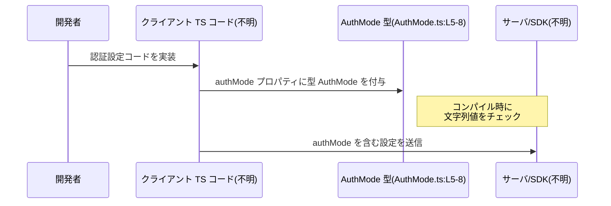

# app-server-protocol/schema/typescript/AuthMode.ts コード解説

## 0. ざっくり一言

- OpenAI をバックエンドとするプロバイダの「認証モード」を、3 つの文字列だけに限定する **TypeScript の文字列リテラル・ユニオン型** `AuthMode` を定義するファイルです（AuthMode.ts:L5-8）。

---

## 1. このモジュールの役割

### 1.1 概要

- このモジュールは、OpenAI バックエンド向けプロバイダの認証モードを表現するための型 `AuthMode` を提供します（AuthMode.ts:L5-8）。
- `AuthMode` は `"apikey" | "chatgpt" | "chatgptAuthTokens"` の 3 通りに限定された文字列リテラル型です（AuthMode.ts:L8）。
- ファイル全体が `ts-rs` による自動生成であり、**手動で編集しない前提**になっています（AuthMode.ts:L1-3）。

### 1.2 アーキテクチャ内での位置づけ

コメントとパスから、この型は「サーバープロトコルの TypeScript スキーマ」の一部であると解釈できますが、実際にどこで使われているかはこのチャンクからは分かりません。

概念的な位置づけを図にすると、次のようになります（利用側のファイルは「不明」としています）。


- `AuthMode` は他のモジュールから `import` され、関数引数・設定オブジェクト・レスポンスのプロパティなどに型として使われる可能性がありますが、**実際の依存関係はこのチャンクには現れません**。

### 1.3 設計上のポイント

- **自動生成ファイル**  
  - ファイル先頭で「GENERATED CODE」「Do not edit this file manually」と明示されています（AuthMode.ts:L1-3）。  
  - 元の定義（おそらく Rust + ts-rs 属性）はこのチャンクには含まれていません。
- **責務の明確な分離**  
  - このファイルの責務は `AuthMode` 型の宣言のみであり、関数やロジックは一切含まれていません（AuthMode.ts:L8）。
- **型による値の制約**  
  - `"apikey" | "chatgpt" | "chatgptAuthTokens"` の 3 つ以外の文字列をコンパイル時に排除することで、間違った認証モード指定を **型チェックで防ぐ**構造になっています（AuthMode.ts:L8）。
- **状態・並行性**  
  - 実行時の状態やオブジェクトを持たない純粋な型定義のみのため、スレッド安全性や並行実行に関する問題は直接的には存在しません。

---

## 2. 主要な機能一覧

このファイルが提供する機能（型レベルの「機能」）は次の 1 つです。

- `AuthMode` 型定義: OpenAI バックエンド向けプロバイダの認証モードを `"apikey" | "chatgpt" | "chatgptAuthTokens"` に限定する文字列リテラル・ユニオン型（AuthMode.ts:L5-8）。

---

## 3. 公開 API と詳細解説

### 3.1 型一覧（構造体・列挙体など）

| 名前      | 種別                 | 役割 / 用途                                                                 | 定義位置                    |
|-----------|----------------------|------------------------------------------------------------------------------|-----------------------------|
| `AuthMode` | 型エイリアス（ユニオン型） | OpenAI バックエンド向けプロバイダで利用可能な認証モード文字列を 3 種類に制限する | AuthMode.ts:L5-8 |

#### `AuthMode` の型定義

```ts
export type AuthMode = "apikey" | "chatgpt" | "chatgptAuthTokens";
```

- TypeScript の **文字列リテラル・ユニオン型**です（AuthMode.ts:L8）。
- 許される値は 3 種のみで、それ以外の文字列を `AuthMode` として扱おうとするとコンパイルエラーになります。

### 3.2 関数詳細

- このファイルには **関数・メソッドは定義されていません**（AuthMode.ts:L1-8）。
- したがって、ここで詳述すべき関数 API はありません。

### 3.3 その他の関数

- 補助関数やラッパー関数も存在しません（AuthMode.ts:L1-8）。

---

## 4. データフロー

このファイル単体には、実際の処理フローや I/O は含まれていませんが、典型的な利用シナリオとしては「他モジュールの関数・設定に `AuthMode` を型注釈として付ける」という形が想定されます。

### 想定される代表的なデータフロー（型レベル）

1. クライアントコードが、認証設定オブジェクトを構築する。
2. その設定オブジェクト内の `authMode` プロパティなどに `AuthMode` 型が付けられる。
3. TypeScript のコンパイル時に、`authMode` に与えた文字列が `"apikey" | "chatgpt" | "chatgptAuthTokens"` のいずれかかチェックされる。
4. 設定オブジェクトがサーバーや SDK に渡される。

これをシーケンス図として表現すると、次のようになります（利用側は概念的なものです）。



- 実際の `import` 元/先・サーバー実装は **このチャンクには現れないため不明** です。

---

## 5. 使い方（How to Use）

### 5.1 基本的な使用方法

`AuthMode` を設定オブジェクトのプロパティに使う例です。

```ts
// app-config.ts（仮の利用ファイル）
// AuthMode 型をインポートする
import type { AuthMode } from "./AuthMode";  // 実際のパスはプロジェクト構成による

// OpenAI バックエンドの認証設定用インターフェース
interface OpenAIAuthConfig {
    mode: AuthMode;      // 認証モードを AuthMode で型制約する
    apiKey?: string;     // "apikey" モードで利用するかもしれないキー
}

// 認証設定を作成する関数
function createConfig(): OpenAIAuthConfig {
    return {
        mode: "apikey",  // ✅ AuthMode の許可値
        apiKey: "xxx",   // 実際のキー文字列
    };
}
```

- `"apikey"` は `AuthMode` の許される値なので、問題なくコンパイルされます（AuthMode.ts:L8 に一致）。
- `"chatgpt"` や `"chatgptAuthTokens"` も同様に利用できます。

### 5.2 よくある使用パターン

1. **関数引数として利用**

```ts
// 認証モードに応じて内部処理を切り替える関数
import type { AuthMode } from "./AuthMode";

function setupAuth(mode: AuthMode) {        // 引数に AuthMode を指定
    if (mode === "apikey") {                // 3 種のみ比較すればよい
        // API キーを使った認証のセットアップ
    } else if (mode === "chatgpt") {
        // ChatGPT アカウント連携のセットアップ
    } else if (mode === "chatgptAuthTokens") {
        // ChatGPT 認証トークンを使ったセットアップ
    }
}
```

- `mode` の型が `AuthMode` であるため、`if` の比較対象も 3 値に限定されます。

1. **設定型の一部として利用**

```ts
import type { AuthMode } from "./AuthMode";

interface ProviderOptions {
    providerId: string;
    authMode: AuthMode;  // 認証モードの指定
}

const opts: ProviderOptions = {
    providerId: "openai",
    authMode: "chatgpt",  // ✅ 許可される値
};
```

### 5.3 よくある間違い

1. **許可されていない文字列を指定する**

```ts
import type { AuthMode } from "./AuthMode";

const badMode: AuthMode = "oauth"; // ❌ コンパイルエラー
// Type '"oauth"' is not assignable to type 'AuthMode'.
```

- `"oauth"` は `AuthMode` に含まれないため、TypeScript がコンパイル時にエラーとして検出します（AuthMode.ts:L8）。

1. **`string` 型のまま扱ってしまい、型安全性を失う**

```ts
// 間違い例: 型を string のままにしている
function setupAuth(mode: string) {          // ❌ AuthMode を使っていない
    // 間違った値が渡ってきてもコンパイル時に検出されない
}

// 正しい例: AuthMode を使う
import type { AuthMode } from "./AuthMode";

function setupAuthSafe(mode: AuthMode) {    // ✅ 許可されたモードに制限
    // ...
}
```

- `AuthMode` を使うことで、モード値を列挙可能な固定集合に制限できます。

### 5.4 使用上の注意点（まとめ）

- **自動生成ファイルを直接編集しない**  
  - ファイル先頭で生成コードであることと「Do not edit this file manually」と明示されています（AuthMode.ts:L1-3）。  
  - 新しいモードを追加・変更したい場合は、元になっている定義（おそらく Rust 側の ts-rs 対象）を変更し、再生成する必要があります。元ファイルの場所はこのチャンクからは分かりません。
- **型チェックはコンパイル時のみ**  
  - `AuthMode` は TypeScript の型であり、JavaScript にトランスパイルされた後は実行時に自動でチェックされません。  
  - 実行時に外部入力を検証したい場合は、別途ランタイムチェック（例えば `if (value === "apikey" || ...)`）が必要です。これは一般的な TypeScript の特性であり、このファイル特有のコードは含みません。
- **`any` や型アサーションでの無効化に注意**  
  - `as any` や `as AuthMode` といった型アサーションを乱用すると、`AuthMode` による安全性が失われます。  
  - これは TypeScript の一般的な注意点であり、このチャンクにはそうしたコードは含まれていません。

---

## 6. 変更の仕方（How to Modify）

このファイルは自動生成されるため、変更は **元定義側で行う** 必要があります。

### 6.1 新しい機能を追加する場合（認証モードの追加）

- `AuthMode` に新しい認証モード（例: `"oauth"`）を追加したい場合、通常であれば次のようにユニオン型にリテラルを追加します。

  ```ts
  // 直接編集するのは推奨されないが、例として:
  export type AuthMode =
      | "apikey"
      | "chatgpt"
      | "chatgptAuthTokens"
      | "oauth";
  ```

- しかしこのファイルは `ts-rs` により生成されるため（AuthMode.ts:L1-3）、**実際には元の Rust 側の列挙/型定義を更新し、ts-rs で再生成する必要があります**。
- 元の Rust ファイルや ts-rs 設定の場所は、このチャンクには現れないため **不明** です。

### 6.2 既存の機能を変更する場合（値のリネーム・削除など）

- 認証モードの文字列を変更・削除すると、プロジェクト内の `AuthMode` 利用箇所に影響します。
- 影響範囲の確認:
  - `AuthMode` を `import` しているファイルを全て検索する必要がありますが、このチャンクからは利用箇所は分かりません。
- 型的な「契約」:
  - 現時点では `"apikey" | "chatgpt" | "chatgptAuthTokens"` の 3 値が存在するという契約になっています（AuthMode.ts:L8）。
  - 値を削除すると、既存コードでその値を使っている箇所がコンパイルエラーになります。
- これらの変更も、直接このファイルを編集するのではなく、**元の ts-rs 対象定義を変更 → 再生成**という流れを取ることが前提と考えられます（ただし元定義はこのチャンクには現れません）。

---

## 7. 関連ファイル

このチャンクには `import` や他ファイルへの参照が全く出てこないため、直接の関連ファイルは特定できません。

推測を含まない範囲で整理すると次の通りです。

| パス | 役割 / 関係 |
|------|------------|
| （不明） | `AuthMode` の元定義（Rust + ts-rs 属性など）が存在すると考えられますが、このチャンクには現れません。 |
| （同ディレクトリ内の他 TS ファイル） | `app-server-protocol/schema/typescript` というパスから、他の型スキーマファイルが存在する可能性がありますが、実際のファイル名・内容は不明です。 |

---

### 安全性・エラー・並行性のまとめ

- **安全性（型レベル）**  
  - `AuthMode` により、認証モードの指定を 3 種類の文字列に制限し、コンパイル時に誤った値を検出できるようになっています（AuthMode.ts:L8）。
- **エラー**  
  - このファイル自身には例外やエラー処理はありません。  
  - 型に合わない値を使った場合、TypeScript のコンパイラが型エラーを報告するのみです。
- **並行性**  
  - 実行時オブジェクトや状態を持たない純粋な型定義だけなので、スレッド安全性や並行処理の問題は直接的には発生しません。
