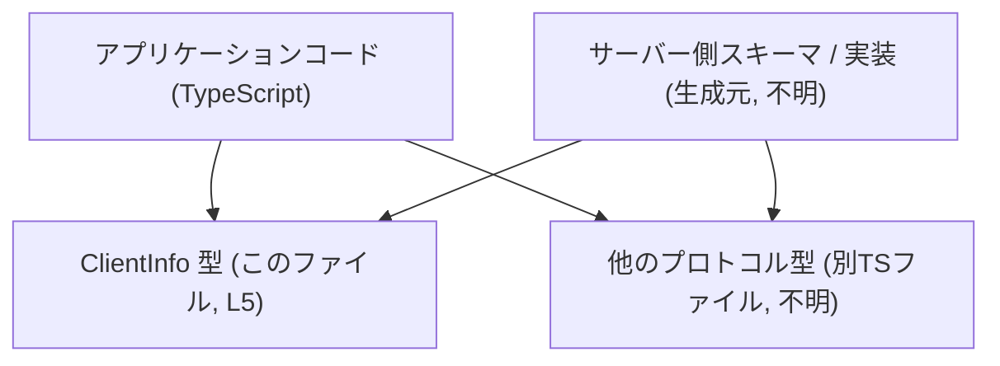
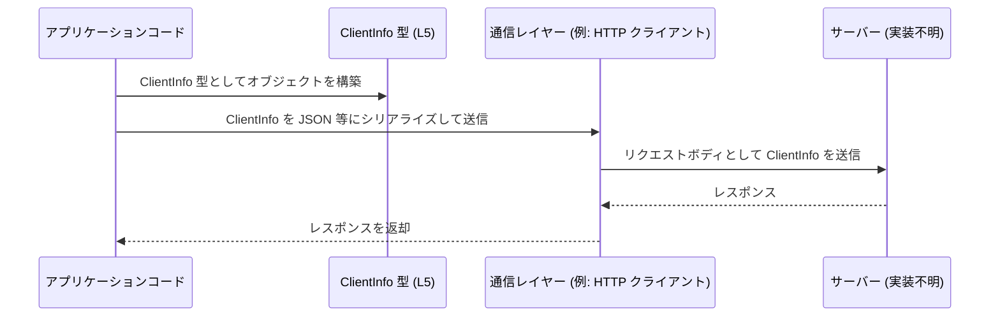

# app-server-protocol/schema/typescript/ClientInfo.ts

## 0. ざっくり一言

TypeScript で、`ClientInfo` というクライアント情報オブジェクトの型を定義するための **自動生成ファイル**です（根拠: 自動生成コメントと `export type ClientInfo` 定義、`ClientInfo.ts:L1-5`）。

---

## 1. このモジュールの役割

### 1.1 概要

- このモジュールは、`ClientInfo` という名前の **オブジェクト型（型エイリアス）**を 1 つだけエクスポートします（根拠: `ClientInfo.ts:L5`）。
- `ClientInfo` は `name`, `title`, `version` の 3 つの文字列系プロパティを持ち、`title` のみ `null` を許容する型になっています（根拠: `ClientInfo.ts:L5`）。
- ファイル先頭のコメントから、この型定義は [ts-rs](https://github.com/Aleph-Alpha/ts-rs) により自動生成されており、手動編集しないことが示されています（根拠: `ClientInfo.ts:L1-3`）。

### 1.2 アーキテクチャ内での位置づけ（推測を含む）

コードから確定できる事実は次の 2 点です。

- このファイルは TypeScript コードであり、`ClientInfo` 型を提供します（根拠: `ClientInfo.ts:L5`）。
- ファイルパスに `app-server-protocol/schema/typescript` が含まれており、「アプリ↔サーバー間プロトコルの TypeScript スキーマ」であることが想定されますが、このチャンクだけでは実際の利用箇所は分かりません。

以下の図は、「プロトコル用スキーマとして利用される」ことを想定した、**一例の位置づけ**です。実際の構成はこのチャンクからは確定できません。



### 1.3 設計上のポイント

- **自動生成コード**  
  - 冒頭コメントに「GENERATED CODE! DO NOT MODIFY BY HAND!」「ts-rs により生成」とあり、コード生成ツールから出力されたことが明示されています（根拠: `ClientInfo.ts:L1-3`）。
- **シンプルなデータキャリア**  
  - 関数やクラスはなく、1 つのオブジェクト型のみで構成されています（根拠: 他に記述がないこと、`ClientInfo.ts:L1-5`）。
- **null の明示的な扱い**  
  - `title` は `string | null` として宣言されており、「文字列か、値が存在しないことを示す null」の 2 通りのみを許容します（根拠: `ClientInfo.ts:L5`）。
- **型レベルでの制約のみ**  
  - 文字列の中身（空文字を許すか、バージョン形式をどうするか等）についての制約・検証ロジックは、このファイル内には存在しません（根拠: プロパティ型がいずれも `string` / `string | null` であり、追加のロジックがないこと、`ClientInfo.ts:L5`）。

---

## 2. 主要な機能一覧

このモジュールが提供する機能は 1 つです。

- `ClientInfo` の型定義: `name`, `title`, `version` を持つクライアント情報オブジェクトの構造を表現する（根拠: `ClientInfo.ts:L5`）

---

## 3. 公開 API と詳細解説

### 3.1 型一覧（構造体・列挙体など）

| 名前        | 種別                          | 役割 / 用途                                                                 | 定義箇所                  |
|-------------|-------------------------------|------------------------------------------------------------------------------|---------------------------|
| `ClientInfo` | 型エイリアス（オブジェクト型） | クライアントに関する 3 つの文字列系情報を 1 つのオブジェクトとして表現する | `ClientInfo.ts:L5` |

#### `ClientInfo` のフィールド

`ClientInfo` は次の 3 プロパティを持つオブジェクト型です（根拠: `ClientInfo.ts:L5`）。

| プロパティ名 | 型              | null 許容 | 説明（型レベルで言えること）                                                                       | 根拠                    |
|--------------|-----------------|-----------|----------------------------------------------------------------------------------------------------|-------------------------|
| `name`       | `string`        | 不可      | 文字列でなければならず、`null`・`undefined` は許容されません                                      | `ClientInfo.ts:L5`      |
| `title`      | `string \| null` | 可        | 文字列か `null` のどちらかです。値がない場合は `null` を使う設計になっています                   | `ClientInfo.ts:L5`      |
| `version`    | `string`        | 不可      | 文字列でなければならず、`null`・`undefined` は許容されません                                      | `ClientInfo.ts:L5`      |

> 内容（例: `version` が SemVer であるか、`name` が一意かどうか）はコードからは読み取れません。

### 3.2 関数詳細（最大 7 件）

- このファイルには関数定義（通常の関数・メソッド・arrow function など）は存在しません（根拠: `export type` 以外に関数シンタックスが現れないこと、`ClientInfo.ts:L1-5`）。
- したがって、関数詳細テンプレートを適用できる対象はありません。

### 3.3 その他の関数

- 補助関数やラッパー関数も定義されていません（根拠: `ClientInfo.ts:L1-5`）。

---

## 4. データフロー

このチャンクには `ClientInfo` の実際の利用コードは含まれていません。そのため、ここでは「`ClientInfo` を使ってクライアント情報を送受信する」という **典型的な利用シナリオの例** を示します。  
実際にこの通りのデータフローが存在するかどうかは、このファイルだけからは分かりません。

### 4.1 例: クライアント情報をサーバーに送るフロー（例示）



このような形で、

1. アプリケーションコードが `ClientInfo` 型に従ったオブジェクトを組み立て、
2. 通信レイヤーに渡してシリアライズ・送信し、
3. サーバー側がそれを受け取って利用する、

という使用が考えられますが、あくまで一般的な例です。

---

## 5. 使い方（How to Use）

### 5.1 基本的な使用方法（例）

以下は、`ClientInfo` をインポートして値を作成・利用する TypeScript コード例です。  
**このインポートパスは例であり、実際のプロジェクトのディレクトリ構成とは限りません。**

```typescript
// ClientInfo 型をインポートする例
// パスはプロジェクト構成に合わせて調整する必要があります。
import type { ClientInfo } from "./ClientInfo";

// ClientInfo 型に従ったオブジェクトを作成する
const clientInfo: ClientInfo = {
    name: "example-client",        // name は string 必須
    title: null,                   // title は string | null なので null でもよい
    version: "1.0.0",              // version は string 必須
};

// 型安全な利用例: コンパイル時にプロパティ名や型がチェックされる
console.log(clientInfo.name.toUpperCase());  // OK: name は string と分かっている
```

この例では、TypeScript の静的型チェックにより、以下が保証されます。

- `name` が存在し、`string` 型である
- `title` に `string` か `null` 以外（例えば `undefined` や数値）を代入するとコンパイルエラーになる
- `version` が存在し、`string` 型である

### 5.2 よくある使用パターン（想定例）

実際のコードはこのチャンクにはありませんが、`ClientInfo` 型を用いて次のようなパターンが考えられます。

1. **アプリケーション起動時に自分の情報を設定する**

   ```typescript
   import type { ClientInfo } from "./ClientInfo";

   const clientInfo: ClientInfo = {
       name: "my-app",
       title: "My Application",
       version: process.env.APP_VERSION ?? "dev",  // 実行環境からバージョン文字列を取得する例
   };
   ```

2. **title を持たないクライアントを表現する**

   ```typescript
   const headlessClient: ClientInfo = {
       name: "headless-worker",
       title: null,               // タイトル情報がないことを明示
       version: "2.3.1",
   };
   ```

### 5.3 よくある間違い（起こりうる誤用例）

以下は、型定義から予想される誤用例と、その修正例です。

```typescript
import type { ClientInfo } from "./ClientInfo";

// ❌ 誤り例1: 必須プロパティを省略している
const bad1: ClientInfo = {
    name: "client-without-version",
    // version が欠けているためコンパイルエラーになる
    // error TS2739: Type '{ name: string; }' is missing the following properties from type 'ClientInfo': title, version
};

// ❌ 誤り例2: title に undefined を代入している
const bad2: ClientInfo = {
    name: "client",
    title: undefined,  // 型は string | null なので undefined は不可
    // error TS2322: Type 'undefined' is not assignable to type 'string | null'.
    version: "1.0.0",
};

// ✅ 正しい例: title を null にする
const ok: ClientInfo = {
    name: "client",
    title: null,       // 値がないことを表現したい場合は null を使う
    version: "1.0.0",
};
```

### 5.4 使用上の注意点（まとめ）

1. **`null` と `undefined` の違い**
   - `title` は `string | null` であり、`undefined` は許容されません（根拠: `ClientInfo.ts:L5`）。
   - 「存在しない」ことを表現したい場合は `null` を使う必要があります。

2. **プロパティはすべて必須**
   - `name`, `title`, `version` はすべて必須プロパティであり、省略はできません（オプショナル記号 `?` がないことが根拠: `ClientInfo.ts:L5`）。

3. **内容のバリデーションは別途必要**
   - このファイルは型のみを提供し、値の妥当性（例: `version` フォーマット）を検証する処理は含みません。
   - セキュリティや整合性の観点では、別の層で入力検証を行う必要があります。

4. **並行性・共有に関する注意**
   - TypeScript のオブジェクトは基本的にミュータブル（変更可能）です。
   - `ClientInfo` 自体は状態やロックを持たない単純な型なので、「複数箇所で同じオブジェクトを共有しながら書き換える」ようなコードを書くと、予期しない状態共有が起きる可能性があります。
   - 必要に応じてコピーしてから変更するなど、一般的な JavaScript/TypeScript のオブジェクト共有に関する注意が当てはまります。

---

## 6. 変更の仕方（How to Modify）

### 6.1 新しい機能を追加する場合（フィールド追加など）

このファイルには次のコメントがあります（根拠: `ClientInfo.ts:L1-3`）。

```typescript
// GENERATED CODE! DO NOT MODIFY BY HAND!

// This file was generated by [ts-rs](https://github.com/Aleph-Alpha/ts-rs). Do not edit this file manually.
```

したがって、

- **このファイルを直接編集するべきではない** ことが明示されています。
- `ClientInfo` にプロパティを追加したい場合は、**生成元（ts-rs が参照するスキーマ定義）を変更し、再生成する**必要があります。  
  生成元が具体的にどのファイルかは、このチャンクからは分かりません。

一般的な手順の例（実際のプロジェクト構成は不明）:

1. ts-rs の生成元となる定義（多くの場合 Rust の struct など）に新しいフィールドを追加する。
2. コード生成コマンド（例: `cargo run` や専用の build スクリプト）を実行し、TypeScript 側のスキーマを再生成する。
3. 生成された `ClientInfo.ts` に新しいプロパティが反映されることを確認する。

### 6.2 既存の機能を変更する場合（型変更など）

- 既存のプロパティ名・型を変更したい場合も、同様に **生成元の定義を変更し、再生成** する必要があります。
- 変更時の注意点（一般論）:
  - 既存の利用箇所との互換性（破壊的変更かどうか）
  - サーバー側／他言語側のスキーマとの整合性
  - シリアライズ形式（JSON など）の互換性

このファイル単体では、どこから `ClientInfo` が使われているか分からないため、影響範囲の特定にはプロジェクト全体での参照検索等が必要になります。

---

## 7. 関連ファイル

このチャンクには他ファイルへの直接の参照はありません。したがって、実在が確認できる関連ファイルはありません。

ただし、コメントとパスから、次のようなファイル・コンポーネントが **存在する可能性が高い** と推測されます（実在はこのチャンクからは断定できません）。

| パス / コンポーネント             | 役割 / 関係（推測）                                                                                 | 根拠                                                |
|----------------------------------|------------------------------------------------------------------------------------------------------|-----------------------------------------------------|
| Rust 側の struct / 型定義        | ts-rs が参照する `ClientInfo` の元定義。ここを変更すると本ファイルが再生成されると考えられます。 | コメントで ts-rs 生成と明記されているため (`ClientInfo.ts:L1-3`) |
| 他の TypeScript スキーマファイル | 同じ `schema/typescript` ディレクトリにある、他のプロトコル用型定義。                              | ディレクトリ名と本ファイルの性質からの推測         |

---

## 追加: Bugs / Security / Contracts / Edge Cases / Tests / Performance などの観点

### Bugs / Security

- このファイル自体にはロジックがなく、**型定義のみ** のため、直接的なバグやセキュリティホールは記述されていません（根拠: `ClientInfo.ts:L5` の単一の型定義のみ）。
- ただし、すべてのフィールドが文字列（または `null`）であるため、
  - 長さ制限
  - フォーマット（例: バージョン文字列）
  - 内容のサニタイズ（例: ログ出力や UI 表示）
  
  といった **バリデーションは別の層で必要** になります。

### Contracts（契約） / Edge Cases（エッジケース）

**型レベルでの契約**

- `name`: 必ず存在し、`string` 型（`null`・`undefined` 不可）。
- `title`: 必ず存在し、`string` または `null` のどちらか。
- `version`: 必ず存在し、`string` 型。

**代表的なエッジケース（型レベルでの扱い）**

- **空文字列** (`""`):
  - 型としては許容されます。空かどうかの意味づけは別の層で定義されます。
- **`null`**:
  - `title` には許容されますが、`name`・`version` には許容されません。
- **`undefined`**:
  - いずれのプロパティにも型としては許容されません。
- **予想外の型（数値・オブジェクト等）**:
  - TypeScript の型チェックが有効なコンパイル環境ではコンパイルエラーになります。
  - ランタイムでは、コンパイル後の JavaScript には型情報がないため、実行時チェックは別途実装が必要です。

### Tests

- このファイルにはテストコードは含まれていません（根拠: テストらしきコードが一切ないこと、`ClientInfo.ts:L1-5`）。
- 一般には、ts-rs で生成されるコードの正当性は、生成元のテストやスナップショットテストなどで確認されることが多いですが、このプロジェクトでどのようにテストされているかは不明です。

### Performance / Scalability

- 型定義はコンパイル時のみ利用され、実行時には存在しません。  
  そのため、このファイル自体が実行時パフォーマンスやスケーラビリティに直接影響することはありません。
- ただし、`ClientInfo` オブジェクトを大量に生成・シリアライズするような処理が別にあれば、その処理のパフォーマンスが問題になる可能性はあります（このチャンクからは、その有無は分かりません）。

### Tradeoffs / Refactoring / Observability（簡潔に）

- **Tradeoffs**
  - `title` を `string | null` とすることで、「値がない」状態を型で表現できますが、`undefined` を使うコードとの互換性には注意が必要です。
- **Refactoring**
  - フィールド追加・変更は生成元の定義を変更する必要があり、TypeScript 側は再生成される設計になっています（根拠: 自動生成コメント, `ClientInfo.ts:L1-3`）。
- **Observability**
  - このファイルにはログやメトリクス出力はなく、観測性に関する実装は一切含まれません。  
    `ClientInfo` の値をログに残したい場合は、利用側でログ出力を行う必要があります。

以上が、`app-server-protocol/schema/typescript/ClientInfo.ts` に含まれる情報をもとにした、公開 API・データフロー・型安全性の観点を中心とした解説です。
