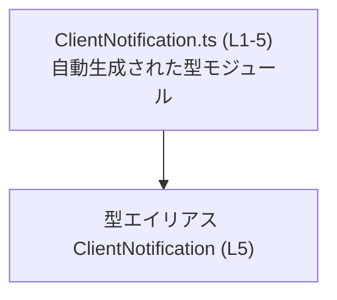
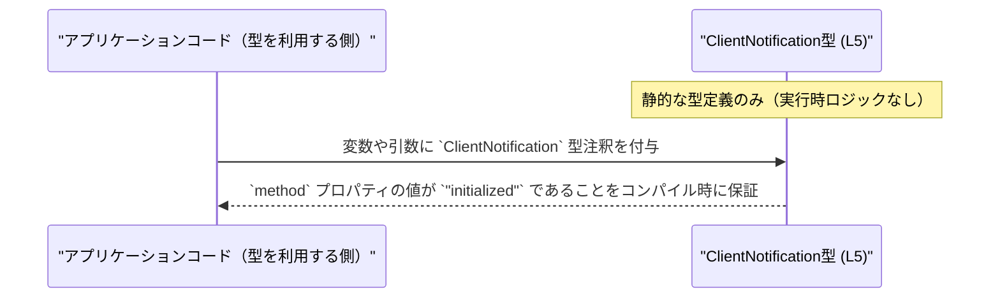

# app-server-protocol/schema/typescript/ClientNotification.ts コード解説

## 0. ざっくり一言

- クライアント通知メッセージの一種として、`method` プロパティが `"initialized"` に固定されたオブジェクト型 `ClientNotification` を定義する、自動生成された TypeScript ファイルです（`ClientNotification.ts:L1-5`）。

---

## 1. このモジュールの役割

### 1.1 概要

- このモジュールは、クライアント側で利用する通知メッセージの型のうち、「initialized」という種類の通知を表す型 `ClientNotification` を提供します（`ClientNotification.ts:L5-5`）。
- ファイル冒頭のコメントから、この定義は `ts-rs` というツールにより自動生成されており、手動での編集は想定されていません（`ClientNotification.ts:L1-3`）。

### 1.2 アーキテクチャ内での位置づけ

- このファイルは TypeScript の型定義のみを含み、他モジュールからの `import` はありません（`ClientNotification.ts:L1-5`）。
- `export type` により `ClientNotification` を公開しているため、他のモジュールからこの型が参照される前提で設計されていますが、その利用箇所はこのチャンクには現れません。

依存関係（このファイル内で完結する範囲）は次のように表現できます。



- ノード間の矢印は、「ファイルが `ClientNotification` 型を定義して公開している」という静的な関係のみを表します。

### 1.3 設計上のポイント

- **自動生成コード**  
  - 冒頭コメントに「GENERATED CODE」「Do not edit this file manually」と明記されており、生成元に合わせて再生成される前提のファイルです（`ClientNotification.ts:L1-3`）。
- **状態を持たない型定義のみ**  
  - 実行時に動く関数やクラスは存在せず、静的な型エイリアスのみが定義されています（`ClientNotification.ts:L5-5`）。  
  - そのため、このモジュール自身は状態管理や副作用、並行処理とは無関係です。
- **厳密なリテラル型による制約**  
  - `ClientNotification` はオブジェクト型で、その唯一のプロパティ `method` の型は文字列リテラル `"initialized"` に固定されています（`ClientNotification.ts:L5-5`）。  
  - これにより、TypeScript コンパイラが `method` に他の文字列が代入されることをコンパイル時に検出できます。
- **判別用フィールドの構造**  
  - `method` フィールドが固定の文字列リテラルであるため、他の通知型（このチャンクには現れません）と組み合わせた場合に「判別可能共用体（discriminated union）」の判別キーとして利用しやすい構造になっています（`ClientNotification.ts:L5-5`）。

---

## 2. 主要な機能一覧

このファイルが提供する主要な要素は 1 つだけです。

- `ClientNotification` 型:  
  `method` プロパティが `"initialized"` に固定された通知オブジェクトを表す TypeScript 型エイリアスです（`ClientNotification.ts:L5-5`）。

---

## 3. 公開 API と詳細解説

### 3.1 型一覧（構造体・列挙体など）

このファイルに定義されている公開型のインベントリです。

| 名前 | 種別 | 役割 / 用途 | 根拠（行番号） |
|------|------|-------------|----------------|
| `ClientNotification` | 型エイリアス（オブジェクト型） | プロパティ `method` を持ち、その値が `"initialized"` に限定された通知メッセージを表す型。クライアント通知の一種を表すための型として利用されます。 | `ClientNotification.ts:L5-5` |

#### `ClientNotification` の型構造

```typescript
export type ClientNotification = { "method": "initialized" };
```

- オブジェクト型 `{ "method": "initialized" }` を `ClientNotification` という名前で再利用可能な型にしています（`ClientNotification.ts:L5-5`）。
- プロパティ名 `"method"` とプロパティの型 `"initialized"` の両方が文字列リテラルです。
  - プロパティ名: `"method"`
  - プロパティの型: 文字列リテラル型 `"initialized"`

このため、次のような意味を持ちます（TypeScript の一般的な型システムの挙動による説明です）。

- `ClientNotification` 型のオブジェクトには、
  - 少なくとも `method` プロパティが存在し、
  - その値は（型として） `"initialized"` に限定されます。
- オブジェクトリテラルを直接 `ClientNotification` に代入する場合、`{ method: "other" }` のような値はコンパイルエラーになります。

### 3.2 関数詳細（最大 7 件）

- このファイルには関数・メソッドは定義されていません（`ClientNotification.ts:L1-5`）。  
  そのため、本セクションで詳細解説を行う対象となる関数はありません。

### 3.3 その他の関数

- 関数が 1 つも定義されていないため、この表は空です（`ClientNotification.ts:L1-5`）。

| 関数名 | 役割（1 行） |
|--------|--------------|
| （なし） | このファイルには関数定義が存在しません |

---

## 4. データフロー

このファイル自体には実行時ロジックが存在しないため、**型チェック時におけるデータ（型情報）の流れ**を示します。

TypeScript コンパイラと `ClientNotification` 型の関係は、概念的には次のように表現できます。



- この図は「TypeScript の型システムにおける利用イメージ」を表したものであり、実際にどのモジュールがこの型を利用しているかは、このチャンクには現れません。
- 実行時には `ClientNotification` という型情報は消去されるため、**実行時データフローへの直接的な影響はありません**。

---

## 5. 使い方（How to Use）

### 5.1 基本的な使用方法

`ClientNotification` 型を利用して、`method` プロパティが `"initialized"` のみであることを型レベルで保証する例です。

```typescript
// ClientNotification 型を定義しているモジュールからインポートする          // 別ファイルに定義された ClientNotification 型を読み込む
import type { ClientNotification } from "./ClientNotification";          // 実際のパスはプロジェクト構成に依存（このチャンクには現れない）

// 正しい例: `method` が "initialized" のオブジェクト                         // ClientNotification 型として妥当な値
const notification: ClientNotification = {                                // 変数 notification に ClientNotification 型を注釈
    method: "initialized",                                                // プロパティ method の値が "initialized" なので OK
};

// 間違い例: `method` が別の文字列になっている                              // 型定義に反する代入例（コンパイルエラー）
const invalidNotification: ClientNotification = {                         // invalidNotification にも ClientNotification 型を注釈
    // @ts-expect-error: Type '"started"' is not assignable to type '"initialized"'.
    method: "started",                                                    // "initialized" 以外の文字列は代入できない
};
```

- TypeScript の型チェックにより、`method` に `"initialized"` 以外を代入するとコンパイルエラーになります。
- これにより、「initialized 通知」であることをコード上で安全に扱えます。

### 5.2 よくある使用パターン

#### 5.2.1 関数の引数として使用する

`ClientNotification` 型を関数の引数として利用することで、関数内で扱う通知が必ず `"initialized"` タイプであることを保証できます。

```typescript
import type { ClientNotification } from "./ClientNotification";           // ClientNotification 型を読み込む

// initialized 通知専用の処理を行う関数                                       // 引数 notification は ClientNotification 型に限定
function handleInitialized(notification: ClientNotification): void {      // 戻り値は副作用のみなので void
    // notification.method は型的に "initialized" で確定している             // 条件分岐なしで "initialized" として扱える
    console.log(`Client method: ${notification.method}`);                 // 実行時には "Client method: initialized" と出力される想定
}
```

- このような関数では、`notification.method` に対する追加の型チェックや `if (notification.method === "initialized")` のような分岐は不要になります。

### 5.3 よくある間違い

#### 5.3.1 型を付けずに「似たオブジェクト」を使ってしまう

```typescript
// 間違い例: 型注釈を省略して文字列をべた書きしている                       // "initialized" を単なる文字列として扱っている
function sendInitialized() {
    const message = { method: "initialized" };                             // message は { method: string } 相当と推論されることが多い
    // ... ここで message を送信する処理                                   // 別の箇所で method に別の文字列が代入されても検出されない可能性がある
}

// 正しい例: ClientNotification 型を明示的に利用する                        // 型システムに "initialized 通知" であることを教える
import type { ClientNotification } from "./ClientNotification";            // ClientNotification 型をインポート

function sendInitializedTyped(message: ClientNotification) {               // 引数に ClientNotification 型を付与
    // message.method は "initialized" に限定される                         // 型的に安全な状態で処理できる
    // ... メッセージ送信処理                                               // 実装側は "initialized" 以外を想定しなくてよい
}
```

- 型を付けない場合は、型安全性が低下し、「initialized 以外の method を持つオブジェクト」が紛れ込んでもコンパイル時に防げないことがあります。
- `ClientNotification` 型を使うことで、こうした誤用を防ぎやすくなります。

### 5.4 使用上の注意点（まとめ）

- **前提条件**
  - `ClientNotification` は **静的な型定義のみ** であり、実行時に特別な処理は行いません（`ClientNotification.ts:L5-5`）。
  - `method` プロパティは必須であり、必ず `"initialized"` でなければなりません。
- **禁止事項 / 注意事項**
  - ファイル冒頭のコメントにある通り、**このファイルを手動で編集しないことが前提**です（`ClientNotification.ts:L1-3`）。  
    型を変更したい場合は、元の生成元（ts-rs の設定やスキーマ）側で行う必要がありますが、その詳細はこのチャンクには現れません。
- **エラー・例外**
  - 実行時の例外やエラーはこの型定義からは直接は発生しません。
  - 一方で、`ClientNotification` 型に違反するコードは **コンパイル時エラー** として検出されます。
- **並行性・パフォーマンス**
  - このファイルには実行時ロジックがないため、スレッド安全性やパフォーマンスには直接の影響を与えません。
- **セキュリティ**
  - 型定義のみのため、このファイル単体では直接的なセキュリティ上のリスクはありません。  
    実際の入力検証やデシリアライズ処理は別のコード側で行われるはずですが、その実装はこのチャンクには現れません。

---

## 6. 変更の仕方（How to Modify）

### 6.1 新しい機能を追加する場合

- ファイル冒頭に「GENERATED CODE」「Do not edit this file manually」と明記されているため（`ClientNotification.ts:L1-3`）、**この TypeScript ファイルを直接編集することは前提に反します**。
- したがって、新しい通知種別を追加したい場合などは、次のような方針が必要になります。
  1. **生成元の変更を検討する**  
     - このファイルは `ts-rs` により生成されているとコメントされています（`ClientNotification.ts:L3-3`）。  
     - 実際にどのファイル・言語から生成されているかはこのチャンクからは分かりませんが、生成元（スキーマや定義）に新しい通知を追加し、再生成することが想定されます。
  2. **再生成を実行する**  
     - 具体的なコマンドやビルド手順は、このチャンクには現れません。不明です。
- このファイル内に手作業で、例えば次のような連想配列を追加することは **推奨されません**。

```typescript
// （推奨されない）直接編集の例: 自動生成ファイルに追記してしまう            // コメントに反して手で書き足した場合のイメージ
// export type ClientNotification =
//   | { method: "initialized" }
//   | { method: "other" };
```

- 上記のような変更は、次回の自動生成で上書きされる可能性が高く、メンテナンス性の観点からも不適切です。

### 6.2 既存の機能を変更する場合

- 既存の `ClientNotification` の仕様（`method` が `"initialized"` であること）を変更したい場合も、**直接編集は避ける必要があります**（`ClientNotification.ts:L1-3`）。
- 変更時に注意すべき点:
  - **契約（contract）の確認**
    - `ClientNotification` 型は「initialized 通知であること」を前提に利用されている可能性がありますが、どこで使われているかはこのチャンクには現れません。  
      そのため、実際に変更する前には、型を利用している箇所（別ファイル）を検索して確認する必要があります（ただし、このチャンクでは使用箇所を特定できません）。
  - **影響範囲**
    - `method` のリテラル値を変更した場合、すべての利用箇所でコンパイルエラーが発生する可能性があります。  
      これは逆に言うと、TypeScript の型システムが変更漏れを教えてくれる形になります。
  - **テスト**
    - このファイルにはテストコードは含まれていません（`ClientNotification.ts:L1-5`）。  
      変更後は、別途存在する単体テストや統合テスト（このチャンクには現れません）があれば、それらを実行して影響を確認する必要があります。

---

## 7. 関連ファイル

このチャンクには `import` 文やコメントによる他ファイルへの参照がないため、**直接の関連ファイルを特定することはできません**。

| パス | 役割 / 関係 |
|------|------------|
| （不明） | このチャンクには `ClientNotification` を利用するコードや生成元のファイルへの参照は現れません。自動生成元（ts-rs 側の定義）や、この型を使用するアプリケーションコードは別ファイルに存在すると考えられますが、具体的なパスは不明です。 |

---

### コンポーネントインベントリー（このチャンクのまとめ）

最後に、このファイルに含まれる「コンポーネント」（型・関数など）の一覧と根拠行番号をまとめます。

| コンポーネント名 | 種別 | 概要 | 根拠（行番号） |
|------------------|------|------|----------------|
| `ClientNotification.ts` | モジュール（TypeScript ファイル） | `ts-rs` により自動生成された、手動編集禁止の型定義ファイル。 | `ClientNotification.ts:L1-3` |
| `ClientNotification` | 型エイリアス | `method` プロパティが `"initialized"` に固定された通知オブジェクトの型。クライアント通知の一種を表現するために利用される。 | `ClientNotification.ts:L5-5` |

- バグ・セキュリティ・並行性については、このファイル自体が型定義のみで実行時コードを含まないため、**直接的なリスクや挙動はありません**。  
  問題が発生しうるのは、この型を利用する別ファイル側の実装になりますが、それらはこのチャンクには現れません。
