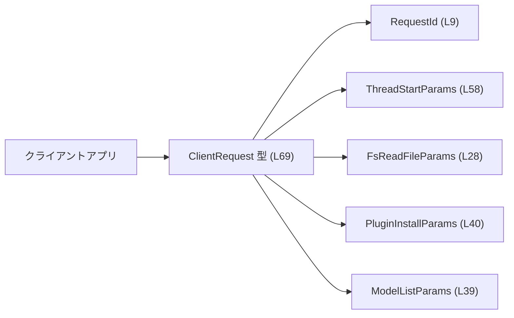
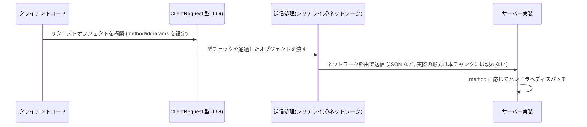

# app-server-protocol/schema/typescript/ClientRequest.ts コード解説

## 0. ざっくり一言

このファイルは、クライアントからサーバーへの「1 つのリクエスト」を表す TypeScript の判別可能ユニオン型 `ClientRequest` を定義し、利用可能な全リクエスト種別（メソッド）とそれぞれのパラメータ型を列挙するプロトコル定義です（`ClientRequest.ts:L66-69`）。

---

## 1. このモジュールの役割

### 1.1 概要

- このモジュールは、クライアントがサーバーへ送信できるリクエストを **型安全に表現するための共通型 `ClientRequest`** を提供します（`ClientRequest.ts:L66-69`）。
- 各リクエストは `"method"` プロパティの文字列と、それに対応する `"params"` 型で判別される **判別可能ユニオン型（discriminated union）** になっています（`ClientRequest.ts:L69`）。
- すべてのリクエストは `id: RequestId` を持ち、要求と応答を対応付けるための識別子として機能します（`ClientRequest.ts:L9,L69`）。

### 1.2 アーキテクチャ内での位置づけ

このファイルは、Rust 側から `ts-rs` によって自動生成された TypeScript プロトコル定義であり（`ClientRequest.ts:L1-3`）、アプリケーション全体では以下のような位置づけになります。

- **クライアントアプリケーション**:
  - リクエストを組み立てるときに `ClientRequest` 型を利用して **メソッド名とパラメータの整合性** をコンパイル時に保証します。
- **サーバー側**:
  - 同等の Rust 型から自動生成されているため、クライアントとサーバーのプロトコルを同期させる役割を持ちます（Rust 側はこのチャンクには現れません）。
- **関連モジュール**:
  - 各種 `*Params` 型（例: `ThreadStartParams`, `FsReadFileParams` など）は、それぞれのメソッドのパラメータ構造を定義するモジュールです（`ClientRequest.ts:L4-64,L69`）。

代表的な依存関係を図示すると次のようになります（図は主要なもののみを抜粋しています）。



> ※ ここでは代表的な依存型のみを図示しています。実際には `ClientRequest` は多くの `*Params` 型に依存します（`ClientRequest.ts:L4-64,L69`）。

### 1.3 設計上のポイント

- **自動生成コード**  
  - ファイル冒頭のコメントにより、このコードは `ts-rs` により自動生成され、手動編集すべきではないことが明示されています（`ClientRequest.ts:L1-3`）。
- **判別可能ユニオンによるメソッド判別**  
  - すべてのバリアントに `"method"` プロパティがあり、文字列リテラル型となっているため、`switch` や `if` で分岐する際に TypeScript の型ナローイングが利用できます（`ClientRequest.ts:L69`）。
- **共通フィールド `id` と `params`**  
  - すべてのバリアントが `id: RequestId` と `params: ...` を持つ共通構造になっています（`ClientRequest.ts:L9,L69`）。
- **引数なしメソッドでも `params: undefined`**  
  - パラメータを取らないメソッドでも `params: undefined` という形で必ず `params` プロパティが存在します（例: `"config/mcpServer/reload"` や `"account/logout"` など, `ClientRequest.ts:L69`）。
- **エラーハンドリング・並行性は型には現れない**  
  - このファイルは純粋な型定義のみであり、エラー処理・並行実行などのロジックは含まれていません。そのため、これらはアプリケーションコード側の責務となります（このチャンクには現れません）。

---

## 2. 主要な機能一覧

このモジュールが提供する主要な「機能」は、`ClientRequest` という 1 つの型に集約された **メソッドごとのリクエスト表現** です（`ClientRequest.ts:L69`）。

- スレッド管理関連リクエスト:
  - `"thread/start"`, `"thread/resume"`, `"thread/fork"`, `"thread/archive"`, `"thread/unarchive"`, `"thread/rollback"`, `"thread/list"`, `"thread/loaded/list"`, `"thread/read"`, `"thread/unsubscribe"`, `"thread/name/set"`, `"thread/metadata/update"`, `"thread/compact/start"`, `"thread/shellCommand"`（`ClientRequest.ts:L47-60,L69`）
- スキル・プラグイン関連リクエスト:
  - `"skills/list"`, `"skills/config/write"`, `"plugin/list"`, `"plugin/read"`, `"plugin/install"`, `"plugin/uninstall"`, `"app/list"`（`ClientRequest.ts:L40-46,L69`）
- ファイルシステム関連リクエスト:
  - `"fs/readFile"`, `"fs/writeFile"`, `"fs/createDirectory"`, `"fs/getMetadata"`, `"fs/readDirectory"`, `"fs/remove"`, `"fs/copy"`, `"fs/watch"`, `"fs/unwatch"`（`ClientRequest.ts:L24-32,L69`）
- 対話・ターン管理関連リクエスト:
  - `"initialize"`, `"turn/start"`, `"turn/steer"`, `"turn/interrupt"`, `"review/start"`, `"getConversationSummary"`（`ClientRequest.ts:L8,44,61-63,L69`）
- モデル・実験機能関連リクエスト:
  - `"model/list"`, `"experimentalFeature/list"`, `"experimentalFeature/enablement/set"`（`ClientRequest.ts:L19-20,39,L69`）
- MCP サーバー関連リクエスト:
  - `"mcpServer/oauth/login"`, `"config/mcpServer/reload"`, `"mcpServerStatus/list"`, `"mcpServer/resource/read"`, `"mcpServer/tool/call"`（`ClientRequest.ts:L34,37-38,L69`）
- アカウント・設定関連リクエスト:
  - `"account/login/start"`, `"account/login/cancel"`, `"account/logout"`, `"account/rateLimits/read"`, `"account/read"`, `"config/read"`, `"config/value/write"`, `"config/batchWrite"`, `"configRequirements/read"`（`ClientRequest.ts:L16-18,33,35,L69`）
- その他:
  - `"windowsSandbox/setupStart"`, `"feedback/upload"`, `"command/exec"`, `"command/exec/write"`, `"command/exec/terminate"`, `"command/exec/resize"`, `"externalAgentConfig/detect"`, `"externalAgentConfig/import"`, `"gitDiffToRemote"`, `"getAuthStatus"`, `"fuzzyFileSearch"`（`ClientRequest.ts:L7,21-23,36,40,64,L69`）

> 具体的に各メソッドがどのような振る舞いをするかは、このチャンクではパラメータ型名とメソッド名からしか分からず、詳細な仕様は不明です。

### 2.1 コンポーネントインベントリー（型・モジュール一覧）

#### 2.1.1 エクスポートされる型

| 名前           | 種別         | 役割 / 用途                                                                                     | 定義位置                   |
|----------------|--------------|--------------------------------------------------------------------------------------------------|----------------------------|
| `ClientRequest`| 型エイリアス | クライアントからサーバーへ送信される全リクエストを表す判別可能ユニオン型。`method`/`id`/`params` を持つ。 | `ClientRequest.ts:L66-69` |

#### 2.1.2 インポートされる主な型（パラメータ型）

すべて「`ClientRequest` の `params` フィールドで使用されるパラメータ型」です（`ClientRequest.ts:L4-64,L69`）。役割欄はメソッド名との対応のみを記載し、具体的な中身はこのチャンクでは不明です。

| パラメータ型                         | 対応する `method` 値                         | 備考 / 根拠 |
|--------------------------------------|----------------------------------------------|------------|
| `InitializeParams`                   | `"initialize"`                               | `ClientRequest.ts:L8,L69` |
| `ThreadStartParams`                  | `"thread/start"`                             | `ClientRequest.ts:L58,L69` |
| `ThreadResumeParams`                 | `"thread/resume"`                            | `ClientRequest.ts:L54,L69` |
| `ThreadForkParams`                   | `"thread/fork"`                              | `ClientRequest.ts:L49,L69` |
| `ThreadArchiveParams`                | `"thread/archive"`                           | `ClientRequest.ts:L47,L69` |
| `ThreadUnsubscribeParams`            | `"thread/unsubscribe"`                       | `ClientRequest.ts:L60,L69` |
| `ThreadSetNameParams`                | `"thread/name/set"`                          | `ClientRequest.ts:L56,L69` |
| `ThreadMetadataUpdateParams`         | `"thread/metadata/update"`                   | `ClientRequest.ts:L52,L69` |
| `ThreadUnarchiveParams`              | `"thread/unarchive"`                         | `ClientRequest.ts:L59,L69` |
| `ThreadCompactStartParams`           | `"thread/compact/start"`                     | `ClientRequest.ts:L48,L69` |
| `ThreadShellCommandParams`           | `"thread/shellCommand"`                      | `ClientRequest.ts:L57,L69` |
| `ThreadRollbackParams`               | `"thread/rollback"`                          | `ClientRequest.ts:L55,L69` |
| `ThreadListParams`                   | `"thread/list"`                              | `ClientRequest.ts:L50,L69` |
| `ThreadLoadedListParams`             | `"thread/loaded/list"`                       | `ClientRequest.ts:L51,L69` |
| `ThreadReadParams`                   | `"thread/read"`                              | `ClientRequest.ts:L53,L69` |
| `SkillsListParams`                   | `"skills/list"`                              | `ClientRequest.ts:L46,L69` |
| `SkillsConfigWriteParams`            | `"skills/config/write"`                      | `ClientRequest.ts:L45,L69` |
| `PluginListParams`                   | `"plugin/list"`                              | `ClientRequest.ts:L41,L69` |
| `PluginReadParams`                   | `"plugin/read"`                              | `ClientRequest.ts:L42,L69` |
| `PluginInstallParams`                | `"plugin/install"`                           | `ClientRequest.ts:L40,L69` |
| `PluginUninstallParams`              | `"plugin/uninstall"`                         | `ClientRequest.ts:L43,L69` |
| `AppsListParams`                     | `"app/list"`                                 | `ClientRequest.ts:L10,L69` |
| `FsReadFileParams`                   | `"fs/readFile"`                              | `ClientRequest.ts:L28,L69` |
| `FsWriteFileParams`                  | `"fs/writeFile"`                             | `ClientRequest.ts:L32,L69` |
| `FsCreateDirectoryParams`            | `"fs/createDirectory"`                       | `ClientRequest.ts:L25,L69` |
| `FsGetMetadataParams`                | `"fs/getMetadata"`                           | `ClientRequest.ts:L26,L69` |
| `FsReadDirectoryParams`              | `"fs/readDirectory"`                         | `ClientRequest.ts:L27,L69` |
| `FsRemoveParams`                     | `"fs/remove"`                                | `ClientRequest.ts:L29,L69` |
| `FsCopyParams`                       | `"fs/copy"`                                  | `ClientRequest.ts:L24,L69` |
| `FsWatchParams`                      | `"fs/watch"`                                 | `ClientRequest.ts:L31,L69` |
| `FsUnwatchParams`                    | `"fs/unwatch"`                               | `ClientRequest.ts:L30,L69` |
| `TurnStartParams`                    | `"turn/start"`                               | `ClientRequest.ts:L62,L69` |
| `TurnSteerParams`                    | `"turn/steer"`                               | `ClientRequest.ts:L63,L69` |
| `TurnInterruptParams`                | `"turn/interrupt"`                           | `ClientRequest.ts:L61,L69` |
| `ReviewStartParams`                  | `"review/start"`                             | `ClientRequest.ts:L44,L69` |
| `ModelListParams`                    | `"model/list"`                               | `ClientRequest.ts:L39,L69` |
| `ExperimentalFeatureListParams`      | `"experimentalFeature/list"`                 | `ClientRequest.ts:L20,L69` |
| `ExperimentalFeatureEnablementSetParams` | `"experimentalFeature/enablement/set"`   | `ClientRequest.ts:L19,L69` |
| `McpServerOauthLoginParams`          | `"mcpServer/oauth/login"`                    | `ClientRequest.ts:L37,L69` |
| `ListMcpServerStatusParams`          | `"mcpServerStatus/list"`                     | `ClientRequest.ts:L34,L69` |
| `McpResourceReadParams`              | `"mcpServer/resource/read"`                  | `ClientRequest.ts:L36,L69` |
| `McpServerToolCallParams`            | `"mcpServer/tool/call"`                      | `ClientRequest.ts:L38,L69` |
| `WindowsSandboxSetupStartParams`     | `"windowsSandbox/setupStart"`                | `ClientRequest.ts:L64,L69` |
| `LoginAccountParams`                 | `"account/login/start"`                      | `ClientRequest.ts:L35,L69` |
| `CancelLoginAccountParams`           | `"account/login/cancel"`                     | `ClientRequest.ts:L11,L69` |
| `GetAccountParams`                   | `"account/read"`                             | `ClientRequest.ts:L33,L69` |
| `FeedbackUploadParams`               | `"feedback/upload"`                          | `ClientRequest.ts:L23,L69` |
| `CommandExecParams`                  | `"command/exec"`                             | `ClientRequest.ts:L12,L69` |
| `CommandExecWriteParams`             | `"command/exec/write"`                       | `ClientRequest.ts:L15,L69` |
| `CommandExecTerminateParams`         | `"command/exec/terminate"`                   | `ClientRequest.ts:L14,L69` |
| `CommandExecResizeParams`            | `"command/exec/resize"`                      | `ClientRequest.ts:L13,L69` |
| `ConfigReadParams`                   | `"config/read"`                              | `ClientRequest.ts:L17,L69` |
| `ExternalAgentConfigDetectParams`    | `"externalAgentConfig/detect"`               | `ClientRequest.ts:L21,L69` |
| `ExternalAgentConfigImportParams`    | `"externalAgentConfig/import"`               | `ClientRequest.ts:L22,L69` |
| `ConfigValueWriteParams`             | `"config/value/write"`                       | `ClientRequest.ts:L18,L69` |
| `ConfigBatchWriteParams`             | `"config/batchWrite"`                        | `ClientRequest.ts:L16,L69` |
| `GetConversationSummaryParams`       | `"getConversationSummary"`                   | `ClientRequest.ts:L6,L69` |
| `GitDiffToRemoteParams`              | `"gitDiffToRemote"`                          | `ClientRequest.ts:L7,L69` |
| `GetAuthStatusParams`                | `"getAuthStatus"`                            | `ClientRequest.ts:L5,L69` |
| `FuzzyFileSearchParams`              | `"fuzzyFileSearch"`                          | `ClientRequest.ts:L4,L69` |

また、`RequestId` はすべてのメソッドで `id` フィールドの型として使用されます（`ClientRequest.ts:L9,L69`）。

---

## 3. 公開 API と詳細解説

### 3.1 型一覧（構造体・列挙体など）

| 名前           | 種別               | 役割 / 用途                                                                                          | 定義位置                   |
|----------------|--------------------|-------------------------------------------------------------------------------------------------------|----------------------------|
| `ClientRequest`| 判別可能ユニオン型 | クライアントがサーバーに送信できるすべてのリクエスト種別を 1 つの型として表現する。`method` により判別。 | `ClientRequest.ts:L66-69` |

### 3.2 `ClientRequest` 型の詳細

#### `ClientRequest`（判別可能ユニオン）

**概要**

- `"method"` プロパティでリクエストの種別を区別する、オブジェクトのユニオン型です（`ClientRequest.ts:L69`）。
- 各バリアントは以下の 3 つの共通フィールドを持つオブジェクトです（`ClientRequest.ts:L69`）:
  - `method`: 文字列リテラル型（例: `"fs/readFile"`）
  - `id`: `RequestId`
  - `params`: 対応する `*Params` 型、もしくは `undefined`
- TypeScript の型システム上は **完全に列挙されたプロトコル** になるため、未定義のメソッド名を使うとコンパイルエラーになります。

**構造（バリアントの一般形）**

```typescript
// 1つのバリアントの一般形（例: fs/readFile）                       // ここでは fs/readFile バリアントを例示
export type ClientRequest =
    | {
        method: "fs/readFile";                                     // メソッド種別を表す文字列リテラル
        id: RequestId;                                             // リクエストID（詳細は RequestId 定義側）
        params: FsReadFileParams;                                  // 対応するパラメータ型
      }
    // ... 他のメソッドバリアントが続く ...                         // 実際には多数のメソッドが列挙される
; // 実際のコードでは1行に連結されている（ClientRequest.ts:L69）
```

> 実際のファイルでは上記のようなバリアントが 1 行に連結された形で定義されています（`ClientRequest.ts:L69`）。

**主なバリアント例**

| `method` 値                         | `params` 型                         | 備考 / 根拠                          |
|------------------------------------|-------------------------------------|--------------------------------------|
| `"initialize"`                     | `InitializeParams`                  | `ClientRequest.ts:L8,L69`           |
| `"thread/start"`                   | `ThreadStartParams`                 | `ClientRequest.ts:L58,L69`          |
| `"fs/readFile"`                    | `FsReadFileParams`                  | `ClientRequest.ts:L28,L69`          |
| `"plugin/install"`                 | `PluginInstallParams`               | `ClientRequest.ts:L40,L69`          |
| `"model/list"`                     | `ModelListParams`                   | `ClientRequest.ts:L39,L69`          |
| `"config/mcpServer/reload"`        | `undefined`                         | `ClientRequest.ts:L69`              |
| `"account/logout"`                 | `undefined`                         | `ClientRequest.ts:L69`              |

**TypeScript による安全性（言語固有のポイント）**

- **メソッド名の安全性**  
  - `method` は文字列リテラルのユニオン型であり、`"fs/readfile"` のようなタイプミスはコンパイルエラーになります（`ClientRequest.ts:L69`）。
- **パラメータ型の安全性**  
  - `method: "fs/readFile"` のバリアントでは、`params` は必ず `FsReadFileParams` 型でなければなりません。異なるパラメータ型を渡すと型エラーになります（`ClientRequest.ts:L28,L69`）。
- **`params: undefined` の扱い**  
  - 引数なしメソッドも `params` プロパティ自体は必須で、その型が `undefined` になっています（`ClientRequest.ts:L69`）。  
    TypeScript 上は `params` を省略できず、明示的に `params: undefined` を指定する必要がある構造です。

**Examples（使用例）**

1. クライアント側でリクエストを構築する基本例（fs/readFile）

```typescript
import type { ClientRequest } from "./ClientRequest";           // ClientRequest 型をインポート
import type { FsReadFileParams } from "./FuzzyFileSearchParams"; // 実際には FsReadFileParams の定義元をインポートする（このチャンク外）

// FsReadFileParams 型の値を用意する（詳細なフィールドはこのファイルには現れない）
const params: FsReadFileParams = /* ...適切な値... */;          // 実際の構造は FsReadFileParams 側を参照

const request: ClientRequest = {                                // ClientRequest ユニオン型として宣言
    method: "fs/readFile",                                      // バリアントを指定する文字列リテラル
    id: /* RequestId 値 */ "req-1" as any,                      // RequestId 型（詳細は RequestId 定義を参照）
    params,                                                     // メソッドに対応するパラメータ型
};
```

> `params` の具体的なフィールドはこのチャンクには定義がないため、コメントで補足しています。

1. サーバー側でメソッド別に分岐する例（型ナローイング）

```typescript
function handleRequest(req: ClientRequest) {                     // ClientRequest 型の引数を受け取る
    switch (req.method) {                                        // method の値で分岐すると型がナローイングされる
        case "fs/readFile": {
            // ここでは req は { method: "fs/readFile"; params: FsReadFileParams; ... } 型に絞られる
            const params = req.params;                           // params は FsReadFileParams 型
            break;
        }
        case "config/mcpServer/reload": {
            // ここでは req.params の型は undefined
            const params = req.params;                           // 型: undefined
            break;
        }
        // ... 他のメソッドも列挙（ exhaustiveness チェックが効く ）      // すべてのメソッドを列挙すると網羅性がチェックされる
    }
}
```

> このように、`method` による分岐で TypeScript の型ナローイングと網羅性チェックを得られる構造になっています（`ClientRequest.ts:L69`）。

**Errors / Panics（エラーの観点）**

- このファイル自体には実行時コードはなく、エラー処理は含まれていません。
- TypeScript レベルで発生しうるのは **コンパイルエラー** のみです。
  - 未定義の `method` 値を指定した場合の型エラー（`ClientRequest.ts:L69`）。
  - `params` の型と `method` が対応していない場合の型エラー（`ClientRequest.ts:L4-64,L69`）。
- 実行時に、外部から受け取った任意の JSON を `ClientRequest` として扱う場合、TypeScript は構造を検証しないため、**ランタイムバリデーションが別途必要**です（このチャンクにはバリデーションロジックは現れません）。

**Edge cases（エッジケース）**

- `params` が `undefined` のメソッド:
  - `"config/mcpServer/reload"`, `"account/logout"`, `"account/rateLimits/read"`, `"configRequirements/read"` などは `params: undefined` です（`ClientRequest.ts:L69`）。
  - これらのメソッドでも `params` プロパティ自体は省略できず、`undefined` を設定する必要があります。
- 新しいメソッドを追加したい場合:
  - このファイルは自動生成のため直接編集はできません。Rust 側の定義を更新し `ts-rs` による再生成が必要です（`ClientRequest.ts:L1-3`）。
- 未知のメソッド:
  - 型レベルでは `ClientRequest` に含まれない `method` は受け取れない想定ですが、実行時には文字列値を持つ任意のオブジェクトが届く可能性があるため、サーバー実装側では防御的なチェックが必要です（チェックロジックはこのチャンクには現れません）。

**使用上の注意点**

- **手動編集禁止**  
  - 先頭コメントの通り、このファイルは自動生成されており、手動での編集はプロトコルとの不整合や再生成時の上書きの原因になります（`ClientRequest.ts:L1-3`）。
- **params の必須性**  
  - すべてのバリアントに `params` プロパティが存在するため、引数なしメソッドでも `params: undefined` を必ず指定する必要があります（`ClientRequest.ts:L69`）。
- **ランタイムの型安全性は別途担保が必要**  
  - TypeScript の型はコンパイル時のみ有効であり、ネットワーク越しに受けた JSON を直接 `ClientRequest` とみなすと、誤った構造でも通ってしまう可能性があります。ランタイムの検証は別ライブラリやコードで対応する必要があります（このチャンクには現れません）。
- **並行リクエスト時の `id` 管理**  
  - 型としては `id: RequestId` を要求するのみで、その一意性や並行実行時の衝突回避は保証していません（`ClientRequest.ts:L9,L69`）。ID 管理戦略は呼び出し側の設計によります。

### 3.3 その他の関数

- このファイルには関数定義は存在しません。すべて型定義のみです（`ClientRequest.ts:L4-69`）。

---

## 4. データフロー

ここでは、`ClientRequest` を用いてクライアントがサーバーへリクエストを送信する典型的な流れを概念的に示します。実際のトランスポート（HTTP / WebSocket など）はこのチャンクには現れないため、一般化した図になっています。



要点:

- クライアントコードは `ClientRequest` 型に従ってオブジェクトを構築します（`ClientRequest.ts:L69`）。
- TypeScript コンパイラが構築時に型整合性をチェックし、誤った `method`/`params` の組み合わせを排除します。
- 実行時にはただのオブジェクトとしてシリアライズされるため、サーバー側は `method` フィールドを読み取り、対応する処理にルーティングします（ルーティング実装はこのチャンクには現れません）。

---

## 5. 使い方（How to Use）

### 5.1 基本的な使用方法

代表的な利用は、クライアント側で `ClientRequest` 型に従ってリクエストを生成し、送信処理へ渡すという流れです。

```typescript
import type { ClientRequest } from "./ClientRequest";              // ClientRequest 型のインポート
import type { FsReadFileParams } from "./v2/FsReadFileParams";     // 対応するパラメータ型（このチャンク外）

// RequestId を生成する（実際の型・生成方法は RequestId 側に依存）
const requestId = "req-123" as any;                                // ここでは RequestId の詳細が不明なため any を利用

// パラメータを組み立てる（実際のフィールドは FsReadFileParams 側の定義に従う）
const params: FsReadFileParams = /* ... */;                        // ClientRequest.ts からは具体的な構造は分からない

const request: ClientRequest = {                                   // ClientRequest 型としてリクエストを構築
    method: "fs/readFile",                                         // 利用するメソッド
    id: requestId,                                                 // RequestId
    params,                                                        // 対応するパラメータ型
};

// 送信処理に渡す
sendToServer(request);                                             // 実際の送信処理は別モジュール
```

### 5.2 よくある使用パターン

1. **メソッドごとにヘルパー関数を定義する**

```typescript
function makeFsReadFileRequest(id: RequestId, params: FsReadFileParams): ClientRequest {
    return {
        method: "fs/readFile",                                     // method は文字列リテラルで固定
        id,                                                        // 呼び出し元で生成した RequestId
        params,                                                    // FsReadFileParams 型
    };
}
```

1. **サーバー側でのディスパッチ**

```typescript
function dispatch(req: ClientRequest) {
    switch (req.method) {
        case "account/logout":
            // req.params の型は undefined
            handleLogout(req.id);                                  // params を参照する必要がないケース
            break;
        case "plugin/install":
            // req.params は PluginInstallParams 型
            handlePluginInstall(req.id, req.params);
            break;
        // ... 他のメソッド
    }
}
```

> いずれも、`req.method` による分岐で `req.params` の型が自動でナローイングされる点がポイントです（`ClientRequest.ts:L69`）。

### 5.3 よくある間違い

```typescript
// 間違い例: method と params 型の組み合わせが不一致
const badRequest: ClientRequest = {
    method: "fs/readFile",                                         // fs/readFile 用のメソッド
    id: "req-1" as any,
    params: {} as any,                                             // 実際の FsReadFileParams 構造を満たしていない（型チェックで弾かれるべき）
};

// 間違い例: 引数なしメソッドで params を省略している
const badLogout: ClientRequest = {
    method: "account/logout",
    id: "req-2" as any,
    // params がない -> 型定義上はエラーとなる構造（ClientRequest.ts:L69）
};
```

正しい例:

```typescript
// 正しい例: 型定義に従い params: undefined を明示
const goodLogout: ClientRequest = {
    method: "account/logout",
    id: "req-2" as any,
    params: undefined,                                             // params プロパティは必須で、型が undefined
};
```

### 5.4 使用上の注意点（まとめ）

- `ClientRequest` は **型定義のみであり、実行時のバリデーションは行いません**。
- ネットワーク越しのデータを受け取って `ClientRequest` として扱う場合は、別途スキーマバリデーションなどを行う必要があります。
- 引数なしメソッドでも `params` は省略できないため、`params: undefined` を忘れるとコンパイルエラーになります（`ClientRequest.ts:L69`）。
- このファイルは自動生成されるため、変更は Rust 側の元定義に行い、`ts-rs` を再実行して反映する必要があります（`ClientRequest.ts:L1-3`）。

---

## 6. 変更の仕方（How to Modify）

### 6.1 新しい機能を追加する場合

- このファイルは `ts-rs` により生成されるため、**直接編集して新しいメソッドを追加するべきではありません**（`ClientRequest.ts:L1-3`）。
- 一般的な手順（このチャンクから推測できる範囲）:
  1. Rust 側で新しいリクエスト型（例: `NewFeatureParams`）およびそれを含む enum などを定義する。
  2. `ts-rs` の導出（`#[derive(TS)]` 等）を追加して TypeScript 側へのエクスポートを有効にする。
  3. コード生成手順を実行し、この `ClientRequest.ts` を再生成する。
- 実際の Rust 側の構造や生成コマンドはこのチャンクには現れないため、リポジトリのビルドスクリプトやドキュメントを参照する必要があります。

### 6.2 既存の機能を変更する場合

- あるメソッドのパラメータ構造を変更したい場合:
  - 対応する `*Params` 型の定義ファイル（例: `v2/FsReadFileParams.ts` など）を変更し、必要に応じて Rust 側も更新します（該当ファイルはこのチャンクには現れません）。
  - `ClientRequest` 自体の `method` 名や `params` 型はコード生成で更新されます（`ClientRequest.ts:L69`）。
- 影響範囲:
  - `ClientRequest` を利用しているあらゆる TypeScript コードで型エラーが発生することで、変更の影響箇所を検出できます。
- テスト:
  - このファイルにはテストコードは含まれていません（`ClientRequest.ts:L1-69`）。  
    E2E テストや統合テストで、新しい/変更されたメソッドがサーバーと正しく通信できるか確認する必要があります（テストの具体例はこのチャンクには現れません）。

---

## 7. 関連ファイル

このモジュールと密接に関係するファイルは、主に `ClientRequest` が依存するパラメータ型および ID 型を定義するファイルです（`ClientRequest.ts:L4-64`）。

| パス（推定）                              | 役割 / 関係                                                                                  |
|-------------------------------------------|---------------------------------------------------------------------------------------------|
| `app-server-protocol/schema/typescript/RequestId.ts` | `RequestId` 型の定義。すべてのリクエストの `id` に使用される（`ClientRequest.ts:L9,L69`）。 |
| `app-server-protocol/schema/typescript/InitializeParams.ts` | `"initialize"` 用のパラメータ定義（`ClientRequest.ts:L8,L69`）。              |
| `app-server-protocol/schema/typescript/v2/FsReadFileParams.ts` | `"fs/readFile"` 用のパラメータ定義（`ClientRequest.ts:L28,L69`）。           |
| `app-server-protocol/schema/typescript/v2/ThreadStartParams.ts` | `"thread/start"` 用のパラメータ定義（`ClientRequest.ts:L58,L69`）。          |
| `app-server-protocol/schema/typescript/v2/PluginInstallParams.ts` | `"plugin/install"` 用のパラメータ定義（`ClientRequest.ts:L40,L69`）。        |
| `app-server-protocol/schema/typescript/v2/ModelListParams.ts` | `"model/list"` 用のパラメータ定義（`ClientRequest.ts:L39,L69`）。            |
| その他の `*Params.ts` ファイル             | 各メソッドの `params` 型を定義し、`ClientRequest` から参照される（`ClientRequest.ts:L4-64,L69`）。 |

> 正確なファイルパスはこのチャンクからは完全には分かりませんが、インポート文から上記のような配置が推測されます（`ClientRequest.ts:L4-64`）。
