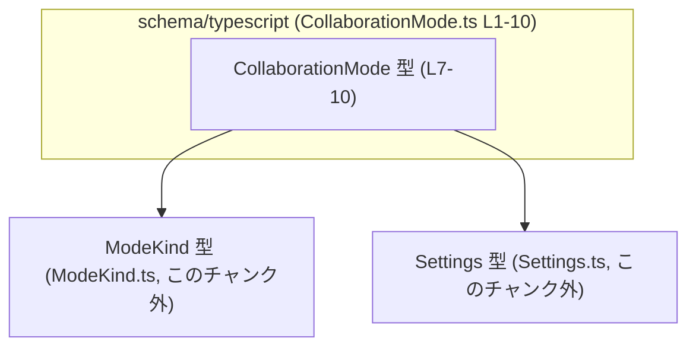
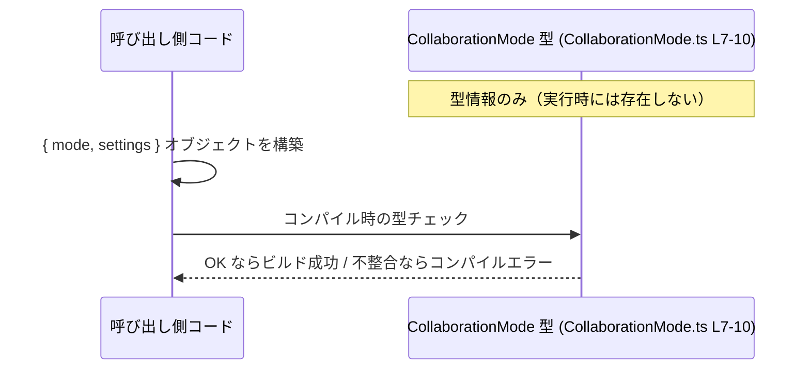

# app-server-protocol/schema/typescript/CollaborationMode.ts

## 0. ざっくり一言

Codex セッションにおける「コラボレーションモード」を表す TypeScript の型エイリアスです。  
モードの種類 (`ModeKind`) とその詳細設定 (`Settings`) を 1 つのオブジェクトとしてまとめて扱うための型定義になっています（`CollaborationMode.ts:L7-10`）。

---

## 1. このモジュールの役割

### 1.1 概要

- このモジュールは Codex セッションのコラボレーションモードを表現するための **型定義** を提供します（JSDoc コメントより、`CollaborationMode.ts:L7-9`）。
- `ModeKind`（モードの種類）と `Settings`（モードに紐づく設定）という 2 つの型を組み合わせたオブジェクト型 `CollaborationMode` をエクスポートします（`CollaborationMode.ts:L4-5,L10`）。
- 実行時のロジックや関数は含まれず、**静的型付けによる型安全性** を提供することが主な役割です。

### 1.2 アーキテクチャ内での位置づけ

このファイルは `schema/typescript` 配下にあることから、アプリケーションサーバーのプロトコル層における **型スキーマ定義の一部** とみなせます（ディレクトリ名とコメントからの推測であり、詳細な利用箇所はこのチャンクには現れません）。

依存関係は以下の通りです。

- 依存している型
  - `ModeKind`（`"./ModeKind"` からの type import, `CollaborationMode.ts:L4`）
  - `Settings`（`"./Settings"` からの type import, `CollaborationMode.ts:L5`）
- 提供している型
  - `CollaborationMode`（`export type` として公開, `CollaborationMode.ts:L10`）

これを簡単な依存関係図で表すと次のようになります。



※ `ModeKind` と `Settings` の具体的な中身は、このチャンクには現れません。

### 1.3 設計上のポイント

- **自動生成コードであることが明示されている**  
  - `// GENERATED CODE! DO NOT MODIFY BY HAND!`（`CollaborationMode.ts:L1`）  
  - `ts-rs` による生成であり手動編集禁止であるとコメントされています（`CollaborationMode.ts:L3`）。
- **型専用の import を利用**  
  - `import type { ModeKind } from "./ModeKind";`（`CollaborationMode.ts:L4`）  
  - `import type { Settings } from "./Settings";`（`CollaborationMode.ts:L5`）  
  → TypeScript 3.8 以降の `import type` 構文で、実行時には依存を発生させず、コンパイル時の型チェックのみに利用されます。  
- **シンプルなオブジェクト型エイリアス**  
  - `export type CollaborationMode = { mode: ModeKind, settings: Settings, };`（`CollaborationMode.ts:L10`）  
  - フィールド `mode` と `settings` に `?` が付いていないため、どちらも **必須プロパティ** です（TypeScript の文法上の事実）。
- **実行時状態やエラーハンドリングは持たない**  
  - このファイル内にクラス・関数・実行コードはなく、型定義のみで構成されています（`CollaborationMode.ts:L1-10` 全体から判定）。

---

## 2. 主要な機能一覧

このモジュールが提供する「機能」は、すべて型レベルのものです。

- `CollaborationMode` 型:  
  Codex セッションのコラボレーションモードを表し、`mode: ModeKind` と `settings: Settings` を 1 つのオブジェクトとして扱うための型エイリアスです（`CollaborationMode.ts:L7-10`）。

### 2.1 コンポーネント一覧（インベントリー）

#### このファイルで定義される型

| 名称               | 種別                           | 役割 / 用途                                                                 | 公開可否 | 根拠 |
|--------------------|--------------------------------|------------------------------------------------------------------------------|----------|------|
| `CollaborationMode` | 型エイリアス（オブジェクト型） | Codex セッションにおけるコラボレーションモード情報（`mode` と `settings`）をまとめる | `export` | `CollaborationMode.ts:L7-10` |

#### このファイルが参照する外部型

| 名称      | 種別       | 役割 / 用途                                                    | 定義元（推定）                                     | 根拠 |
|-----------|------------|----------------------------------------------------------------|----------------------------------------------------|------|
| `ModeKind` | 型（詳細不明） | `CollaborationMode.mode` プロパティの型。モードの種類を表すと考えられますが、詳細は不明です。 | `schema/typescript/ModeKind.ts`（`"./ModeKind"` より同ディレクトリと推定） | `CollaborationMode.ts:L4` |
| `Settings` | 型（詳細不明） | `CollaborationMode.settings` プロパティの型。モード固有の設定を表すと考えられますが、詳細は不明です。 | `schema/typescript/Settings.ts`（`"./Settings"` より同ディレクトリと推定） | `CollaborationMode.ts:L5` |

※ `ModeKind` / `Settings` の内容はこのチャンクには現れないため、「詳細不明」としています。

---

## 3. 公開 API と詳細解説

### 3.1 型一覧（構造体・列挙体など）

| 名前               | 種別                           | 役割 / 用途                                                                 | フィールド概要                                                   | 根拠 |
|--------------------|--------------------------------|------------------------------------------------------------------------------|------------------------------------------------------------------|------|
| `CollaborationMode` | 型エイリアス（オブジェクト型） | コラボレーションモードの種別と設定をまとめたデータ型                        | `mode: ModeKind` / `settings: Settings`（どちらも必須プロパティ） | `CollaborationMode.ts:L7-10` |

#### `CollaborationMode`

**概要**

- Codex セッションの「コラボレーションモード」を表現する構造を、TypeScript のオブジェクト型として定義した型エイリアスです（`CollaborationMode.ts:L7-10`）。
- 実行時には通常の JavaScript オブジェクト `{ mode: ..., settings: ... }` として扱われますが、TypeScript コンパイル時に **型チェックの枠組み** を提供します。

**フィールド**

| フィールド名 | 型        | 説明                                                                 | 必須/任意 | 根拠 |
|--------------|-----------|----------------------------------------------------------------------|-----------|------|
| `mode`       | `ModeKind` | コラボレーションモードの「種類」を表す型。詳細は別ファイルに定義。 | 必須      | `CollaborationMode.ts:L10` |
| `settings`   | `Settings` | 選択されたモードに紐づく設定全体を表す型。詳細は別ファイルに定義。 | 必須      | `CollaborationMode.ts:L10` |

**Errors / Panics**

- TypeScript 型定義のみであり、ランタイムのエラー処理は含まれていません。
- コンパイル時には、以下のような場合に **型エラー** になります。
  - `mode` または `settings` を持たないオブジェクトを `CollaborationMode` として扱おうとした場合。
  - `mode` に `ModeKind` ではない型（例: `string` や `number`）を渡した場合。
  - `settings` に `Settings` ではない型を渡した場合。

**Edge cases（エッジケース）**

TypeScript の型システムの性質に基づく代表例です。

- **プロパティの欠落**  
  - `mode` または `settings` を省略したリテラル `{}` を `CollaborationMode` 型として代入すると、コンパイルエラーになります（必須プロパティのため、`CollaborationMode.ts:L10`）。
- **余剰プロパティ**  
  - オブジェクトリテラルに `extra` のような知らないプロパティを含めると、**リテラルの代入時には excess property check の対象となり、エラーになる可能性** があります。これは TypeScript の一般仕様であり、このファイル固有のコードには現れていません。
- **`null` / `undefined`**  
  - `ModeKind` / `Settings` が `null` や `undefined` を許容しない型で定義されている場合、それらを代入するとコンパイルエラーになります（`ModeKind` / `Settings` の詳細はこのチャンクには現れません）。

**使用上の注意点**

- `CollaborationMode` は **型エイリアスでしかなく、実行時には存在しない** ため、外部から受け取った JSON をこの型に「キャスト」しても、自動的なバリデーションは行われません。
- 実行時の安全性を高めるには、別途スキーマバリデーション（例えば JSON Schema や手書きのチェック）を行ったうえで、`CollaborationMode` 型として扱う必要があります。
- ファイル先頭コメントの通り **自動生成ファイル** であり、手動編集すると次回のスキーマ生成で上書きされる可能性があります（`CollaborationMode.ts:L1-3`）。

### 3.2 関数詳細（最大 7 件）

このファイルには関数・メソッド・クラスなどの **実行時ロジックは一切定義されていません**（`CollaborationMode.ts:L1-10`）。  
そのため、関数詳細テンプレートに該当する項目はありません。

### 3.3 その他の関数

同様に、補助関数やラッパー関数も存在しません。

---

## 4. データフロー

このモジュール自体には関数やロジックがなく、**実行時の処理フローは定義されていません**。  
ただし、`CollaborationMode` 型がどのようにコンパイル時に利用されるか、概念的なデータフローを示します。



- この図は、**コンパイル時の型チェック** の流れを概念的に示したものです。
- 実際の呼び出し元コード（`Caller`）がどこにあるか、どのような処理の一部として使われるかは、このチャンクには現れません。

---

## 5. 使い方（How to Use）

### 5.1 基本的な使用方法

`CollaborationMode` 型を他のモジュールから import し、変数や関数の引数・戻り値の型として利用する典型的な例です。

```typescript
// CollaborationMode 型を型専用importとして読み込む例                        // 同じディレクトリにあると仮定して ./CollaborationMode から import する
import type { CollaborationMode } from "./CollaborationMode";             // これは型情報のみを参照し、実行時依存関係は発生しない

// ModeKind と Settings も型として読み込む                                   // 実際の定義はそれぞれのファイルに依存する
import type { ModeKind } from "./ModeKind";                               // CollaborationMode.mode に使う型
import type { Settings } from "./Settings";                               // CollaborationMode.settings に使う型

// CollaborationMode 型の値を作成する                                       // mode と settings の両方が必須
const collaborationMode: CollaborationMode = {                            // 変数に CollaborationMode 型を明示
    mode: {} as ModeKind,                                                 // ここではダミーとして as ModeKind を利用（実際は ModeKind の定義に従う）
    settings: {} as Settings,                                             // 同様に Settings の具体的な値を設定する
};

// 関数の引数として CollaborationMode を受け取る                             // コラボレーションモードを渡して処理する関数
function startSession(mode: CollaborationMode) {                          // 型を指定することで、呼び出し側に mode/settings の両方を要求できる
    console.log("mode:", mode.mode);                                      // mode プロパティに型安全にアクセス
    console.log("settings:", mode.settings);                              // settings プロパティにも型安全にアクセス
}
```

このように、`CollaborationMode` は「このオブジェクトには最低限 `mode` と `settings` が必要」という契約をコンパイル時に保証します。

### 5.2 よくある使用パターン

#### 5.2.1 設定オブジェクトの一部として利用する

より大きな設定オブジェクトの一部に `CollaborationMode` を組み込む例です。

```typescript
// CollaborationMode を含むアプリケーション設定全体の型                   // アプリ全体の設定を 1 つの型で表す
import type { CollaborationMode } from "./CollaborationMode";             // コラボレーション関連の設定部分に再利用

interface AppConfig {                                                     // アプリ全体の設定構造
    collaboration: CollaborationMode;                                     // コラボレーションモードに関する設定
    // 他の設定項目 ...                                                    // 例: database, logging など
}

// 設定オブジェクトの例                                                    // collaboration フィールドに CollaborationMode を指定
const config: AppConfig = {
    collaboration: {
        mode: {} as ModeKind,                                             // 実際の ModeKind に従って値を指定
        settings: {} as Settings,                                         // 実際の Settings に従って値を指定
    },
    // 他の設定 ...
};
```

#### 5.2.2 API パラメータとして利用する

サーバーに送信するリクエストのパラメータとして利用する場合の例です（実際の API 実装はこのチャンクにはありません）。

```typescript
import type { CollaborationMode } from "./CollaborationMode";             // リクエストボディの型として利用する

// コラボレーションモードを更新する API のリクエスト型                     // API の契約を型で表す
interface UpdateCollaborationModeRequest {
    sessionId: string;                                                    // どのセッションかを識別する ID
    mode: CollaborationMode;                                              // 新しいコラボレーションモード
}

// 関数の引数型として利用                                                  // 実際の fetch/HTTP 処理は別途実装される
async function updateCollaborationMode(req: UpdateCollaborationModeRequest) {
    // ここで req.mode.mode / req.mode.settings が型安全に扱える          // ModeKind / Settings のフィールドに補完・型チェックが効く
}
```

### 5.3 よくある間違い

`mode` / `settings` の必須性や型を間違えた場合、TypeScript のコンパイル時エラーになります。

```typescript
import type { CollaborationMode } from "./CollaborationMode";
import type { ModeKind } from "./ModeKind";
import type { Settings } from "./Settings";

// 間違い例: 必須プロパティ settings を指定していない                        // settings が抜けているためコンパイルエラー
const wrong1: CollaborationMode = {
    mode: {} as ModeKind,                                                 // mode はあるが
    // settings がない                                                     // 必須プロパティが不足
};

// 間違い例: mode の型が不正                                                // ModeKind ではなく string を代入している
const wrong2: CollaborationMode = {
    // @ts-expect-error: ModeKind ではない型を代入している例               // TypeScript に型エラーを期待するコメント
    mode: "pair-programming",                                             // ModeKind の定義が string でない場合はエラーになる
    settings: {} as Settings,
};

// 正しい例: mode / settings を両方指定し、型も一致させる                  // TypeScript の型チェックに通る
const correct: CollaborationMode = {
    mode: {} as ModeKind,                                                 // 実際には ModeKind の定義に応じた値を設定
    settings: {} as Settings,                                             // Settings の定義に応じた値を設定
};
```

### 5.4 使用上の注意点（まとめ）

- **自動生成コードであること**  
  - ファイル先頭に手動編集禁止が明記されています（`CollaborationMode.ts:L1-3`）。  
    変更が必要な場合は、`ts-rs` の元となる Rust 側の型定義を変更し、コード生成をやり直す必要があります。
- **契約（Contract）としての役割**  
  - `CollaborationMode` は「`mode: ModeKind` と `settings: Settings` を必ず持つオブジェクト」という契約を示します（`CollaborationMode.ts:L10`）。
  - この契約に違反するコードはコンパイル時に検出されますが、ランタイムでの検証は別途実装が必要です。
- **エッジケースの扱い**  
  - 外部入力（JSON など）を `as CollaborationMode` でキャストするだけでは、プロパティの欠落や型不一致を防げません。  
    セキュリティ・安定性の観点から、**必ず値の検証を行ったあと** にこの型として扱うことが望ましいです。
- **セキュリティ / バグの観点（Bugs/Security）**  
  - 不正な外部入力をそのまま `CollaborationMode` として扱うと、アプリケーションロジック側でモードや設定の存在を仮定しているため、実行時エラーや想定外の動作につながる可能性があります。  
  - 型安全性はコンパイル時のみであり、ランタイム防御にはなりません。
- **性能 / スケーラビリティの観点**  
  - このファイルが提供するのは型情報のみであり、実行時のパフォーマンスコストはありません（`import type` もランタイムには含まれません、`CollaborationMode.ts:L4-5`）。
  - 大量の `CollaborationMode` オブジェクトを生成する場合でも、本ファイル自体はオーバーヘッドを追加しません。
- **並行性（Concurrency）の観点**  
  - TypeScript の型レベル定義であり、スレッドセーフティやロックなどの概念は直接関与しません。  
  - Web Worker や別プロセス間で値を共有する場合は、シリアライズ可能なフィールドのみを持つことが重要ですが、`ModeKind` / `Settings` の具体的な内容はこのチャンクには現れません。

---

## 6. 変更の仕方（How to Modify）

### 6.1 新しい機能を追加する場合

このファイルは `ts-rs` によって生成されることが明記されているため（`CollaborationMode.ts:L1-3`）、**直接編集すべきではありません**。

新しいフィールドや機能を追加したい場合は、一般的には次のような手順になります（ts-rs の利用形態に基づく一般的な流れであり、具体的な Rust 側コードの位置はこのチャンクからは分かりません）。

1. Rust 側で `CollaborationMode` に対応する構造体/型定義を探す。  
   - 例: `struct CollaborationMode { mode: ModeKind, settings: Settings, /* ... */ }` のような定義（このチャンクには現れません）。
2. Rust 側の構造体に新しいフィールドを追加し、`ts-rs` 用の派生（`#[derive(TS)]` など）を適切に設定する。
3. `ts-rs` のコード生成コマンドを再実行し、`CollaborationMode.ts` を再生成する。
4. 生成された TypeScript 側で、`CollaborationMode` の変更内容を確認する。

この際、**`ModeKind` / `Settings` との関係が崩れないようにすること**が重要です。

### 6.2 既存の機能を変更する場合

すでに利用されている `CollaborationMode` の形を変更する場合は、以下の点に注意が必要です。

- **影響範囲の確認**
  - `CollaborationMode` を import している TypeScript ファイルをすべて検索し、`mode` / `settings` の使用箇所を確認する必要があります。  
  - 新しいフィールドを必須にした場合、既存コードの多くがコンパイルエラーになる可能性があります。
- **契約の変更**
  - `mode` / `settings` の型を変更したり、フィールド名そのものを変更した場合、クライアントとサーバー間のプロトコル契約も変わります。  
  - プロトコルのバージョニングが必要になる場合がありますが、その仕組みはこのチャンクには現れません。
- **テスト（Tests）**
  - このファイルにテストコードは含まれていません（`CollaborationMode.ts:L1-10`）。  
  - 変更時には、`CollaborationMode` を使うロジック（API ハンドラー、ビジネスロジックなど）のテストを更新・追加することが重要です。
- **生成コードの再生成**
  - 変更は必ず Rust 側の定義から行い、`ts-rs` による再生成を忘れないようにする必要があります。  
  - 手動編集と生成結果がずれると、次回生成時に意図しない差分が生じます。

---

## 7. 関連ファイル

このモジュールと密接に関係するファイル・コンポーネントは、import から次のように読み取れます。

| パス（推定）                                           | 役割 / 関係                                                                                     | 根拠 |
|--------------------------------------------------------|------------------------------------------------------------------------------------------------|------|
| `app-server-protocol/schema/typescript/ModeKind.ts`    | `ModeKind` 型を定義するファイル。`CollaborationMode.mode` の型として利用される。              | `CollaborationMode.ts:L4` |
| `app-server-protocol/schema/typescript/Settings.ts`    | `Settings` 型を定義するファイル。`CollaborationMode.settings` の型として利用される。          | `CollaborationMode.ts:L5` |
| （Rust 側の ts-rs 入力定義ファイル、パス不明）         | `ts-rs` によって本ファイルが生成される元となる Rust の型定義。直接は見えないが変更の起点となる。 | `CollaborationMode.ts:L1-3` |
| （テストコードファイル, 不明）                         | このチャンクにはテストは含まれておらず、どのファイルが `CollaborationMode` をテストしているかは不明。 | `CollaborationMode.ts:L1-10` |

このチャンクからは、`CollaborationMode` が具体的にどこで利用されているか（API レイヤー、UI レイヤーなど）は分かりません。そのため、より広い影響範囲の把握には、プロジェクト全体の import 関係を検索することが必要になります。
