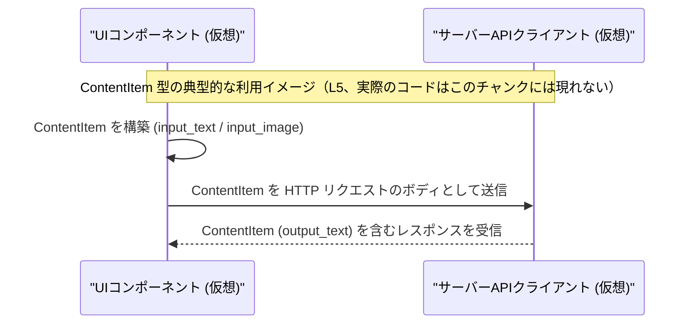

# app-server-protocol/schema/typescript/ContentItem.ts コード解説

## 0. ざっくり一言

`ContentItem` は、**テキスト入力・画像入力・テキスト出力** の 3 種類のコンテンツを表す、TypeScript の**判別共用体（discriminated union）**です  
（`app-server-protocol\schema\typescript\ContentItem.ts:L5-5`）。

---

## 1. このモジュールの役割

### 1.1 概要

- このファイルは、`ContentItem` という TypeScript 型エイリアスを 1 つだけ公開しています  
  （`export type ContentItem = ...`、`app-server-protocol\schema\typescript\ContentItem.ts:L5-5`）。
- `ContentItem` は `"type"` プロパティを判別子として持つ共用体で、次の 3 バリアントを表現します  
  （`app-server-protocol\schema\typescript\ContentItem.ts:L5-5`）。
  - `"type": "input_text"` + `text: string`
  - `"type": "input_image"` + `image_url: string`
  - `"type": "output_text"` + `text: string`
- 冒頭コメントにより、このファイルは `ts-rs` によって**自動生成**されていることが明示されています  
  （`app-server-protocol\schema\typescript\ContentItem.ts:L1-3`）。

### 1.2 アーキテクチャ内での位置づけ

コードから直接分かる事実:

- TypeScript 側では `ContentItem` 型だけが定義され、他の型・関数への参照はありません  
  （`app-server-protocol\schema\typescript\ContentItem.ts:L5-5`）。
- コメントにより、Rust 向けの `ts-rs` ツールを用いた生成物であることが示されています  
  （`app-server-protocol\schema\typescript\ContentItem.ts:L3-3`）。

```mermaid
graph TD
  A["ContentItem 型<br/>(L5)"]
  B["バリアント: input_text<br/>(type = \"input_text\")"]
  C["バリアント: input_image<br/>(type = \"input_image\")"]
  D["バリアント: output_text<br/>(type = \"output_text\")"]

  A --> B
  A --> C
  A --> D
```

この図は、**このファイル内で完結している型構造**のみを示しています（いずれも `L5` に定義）。

この型が具体的にどのモジュールから利用されるか、どの通信経路を通るかといった点は、**このチャンクには現れません**。

### 1.3 設計上のポイント

コードから読み取れる設計上の特徴は次のとおりです。

- **自動生成コード**  
  - 先頭コメントで手動編集禁止と `ts-rs` による生成であることを明示  
    （`"GENERATED CODE! DO NOT MODIFY BY HAND!"`、`app-server-protocol\schema\typescript\ContentItem.ts:L1-1`）。
- **判別共用体による安全なバリアント表現**  
  - `"type"` による判別子と、それに対応するフィールドの組み合わせを 1 つの union 型で表現  
    （`app-server-protocol\schema\typescript\ContentItem.ts:L5-5`）。
- **文字列リテラル型による型安全性**  
  - `"input_text" | "input_image" | "output_text"` のような固定文字列を `"type"` に使うことで、  
    コード補完・コンパイル時チェックが効く形になっています（`L5-5`）。
- **状態を持たない純粋なデータ型**  
  - 関数・クラス・メソッドなどは定義されず、純粋にデータ構造だけを表現しています（`L1-5`）。

---

## 2. 主要な機能一覧（コンポーネントインベントリー）

このファイルが提供する「機能」は型定義のみですが、バリアントも含めてコンポーネントとして整理します。

| コンポーネント | 種別 | 説明 | 根拠 |
|---------------|------|------|------|
| `ContentItem` | 型エイリアス（共用体） | 入力テキスト・入力画像・出力テキストのいずれかを表す判別共用体 | `app-server-protocol\schema\typescript\ContentItem.ts:L5-5` |
| `ContentItem` バリアント: `"input_text"` | 匿名オブジェクト型 | テキスト入力を表す。`{ "type": "input_text", text: string }` | `app-server-protocol\schema\typescript\ContentItem.ts:L5-5` |
| `ContentItem` バリアント: `"input_image"` | 匿名オブジェクト型 | 画像入力を表す。`{ "type": "input_image", image_url: string }` | `app-server-protocol\schema\typescript\ContentItem.ts:L5-5` |
| `ContentItem` バリアント: `"output_text"` | 匿名オブジェクト型 | テキスト出力を表す。`{ "type": "output_text", text: string }` | `app-server-protocol\schema\typescript\ContentItem.ts:L5-5` |

---

## 3. 公開 API と詳細解説

### 3.1 型一覧（構造体・列挙体など）

| 名前 | 種別 | 役割 / 用途 | 主なフィールド | 根拠 |
|------|------|-------------|----------------|------|
| `ContentItem` | 型エイリアス（共用体） | コンテンツを 3 種類の形で表現する判別共用体。プロトコル上でやり取りするメッセージ要素を表すと解釈できます（用途自体はコメントからは不明）。 | `"type"`（文字列リテラル型）、`text: string`、`image_url: string`（バリアントにより存在するフィールドが異なる） | `app-server-protocol\schema\typescript\ContentItem.ts:L5-5` |

#### `ContentItem` のバリアント詳細

`ContentItem` は次の 3 つのオブジェクト型の union です（すべて `L5-5`）。

1. **テキスト入力バリアント**

   ```ts
   { "type": "input_text", text: string }
   ```

   - `"type"`: `"input_text"` 固定
   - `text`: 入力テキスト本文

2. **画像入力バリアント**

   ```ts
   { "type": "input_image", image_url: string }
   ```

   - `"type"`: `"input_image"` 固定
   - `image_url`: 画像の URL

3. **テキスト出力バリアント**

   ```ts
   { "type": "output_text", text: string }
   ```

   - `"type"`: `"output_text"` 固定
   - `text`: 出力テキスト本文

TypeScript の文法上、これは「**判別共用体（discriminated union）」と呼ばれる典型的なパターンです。

### 3.2 関数詳細

このファイルには、関数・メソッド・クラスなどの**実行時ロジックは一切定義されていません**  
（`app-server-protocol\schema\typescript\ContentItem.ts:L1-5`）。

したがって、関数詳細テンプレートに沿って説明すべき API はありません。

### 3.3 その他の関数

- 該当なし（このチャンクには関数は現れません）。

---

## 4. データフロー

### 4.1 型内部のデータフロー（バリアント間の関係）

`ContentItem` 自体は単なる型定義であり、実行時の処理フローは持ちません。  
ここでは、**型としての構造関係**をデータフロー的に表現します。

```mermaid
graph TD
  CI["ContentItem 型<br/>(L5)"]
  IT["input_text バリアント<br/>{ type: \"input_text\", text: string }<br/>(L5)"]
  II["input_image バリアント<br/>{ type: \"input_image\", image_url: string }<br/>(L5)"]
  OT["output_text バリアント<br/>{ type: \"output_text\", text: string }<br/>(L5)"]

  CI --> IT
  CI --> II
  CI --> OT
```

- ある値が `ContentItem` 型である場合、**必ず上記 3 パターンのいずれか**になります（`L5`）。
- `"type"` の値に応じて、利用できるフィールドが変わります。

### 4.2 利用イメージとしての処理フロー（推測を含む）

このファイルから実際の呼び出し関係は分かりませんが、`ContentItem` が**クライアントとサーバー間のプロトコル要素**として使われる可能性があります（ディレクトリ名 `app-server-protocol` からの推測であり、コードからは断定できません）。

あくまで利用イメージとしてのシーケンス図を示します。



- この図は**設計イメージ**であり、**実際の実装はこのチャンクからは不明**です。

---

## 5. 使い方（How to Use）

### 5.1 基本的な使用方法

`ContentItem` 型を使って、入力／出力コンテンツを扱う例です。

```ts
// ContentItem 型をこのファイルからインポートする例（実際のパスはプロジェクト構成に依存し、このチャンクには現れません）
// import type { ContentItem } from "./schema/typescript/ContentItem";

// テキスト入力を表す ContentItem を作る例
const inputTextItem: ContentItem = {           // ContentItem 型の変数を宣言
  type: "input_text",                         // バリアントを判別する文字列リテラル
  text: "こんにちは",                          // 入力テキスト本文
};

// 画像入力を表す ContentItem を作る例
const inputImageItem: ContentItem = {         // 別の ContentItem 変数
  type: "input_image",                        // 画像入力バリアントを指定
  image_url: "https://example.com/image.png", // 画像の URL
};

// 出力テキストを表す ContentItem を作る例
const outputTextItem: ContentItem = {         // 出力用の ContentItem
  type: "output_text",                        // 出力テキストバリアント
  text: "処理結果です",                        // 出力テキスト本文
};
```

TypeScript の型システムにより、`type` やフィールド名を間違えるとコンパイル時にエラーになります。

### 5.2 よくある使用パターン

#### パターン 1: バリアントに応じた分岐処理

`ContentItem` を受け取って、`type` に応じて処理を分ける典型的なコード例です。

```ts
// ContentItem を処理する関数
function handleContentItem(item: ContentItem): void {   // 引数 item は 3 つのバリアントのいずれか
  switch (item.type) {                                  // 判別子 "type" で分岐
    case "input_text":                                  // テキスト入力バリアント
      console.log("入力テキスト:", item.text);          // text プロパティにアクセス可能
      break;
    case "input_image":                                 // 画像入力バリアント
      console.log("入力画像URL:", item.image_url);      // image_url プロパティにアクセス可能
      break;
    case "output_text":                                 // 出力テキストバリアント
      console.log("出力テキスト:", item.text);          // text プロパティにアクセス可能
      break;
    default:                                            // 型的には到達しない（never）
      const _exhaustiveCheck: never = item;             // 新バリアント追加時の検出用
      return _exhaustiveCheck;
  }
}
```

- `switch` 文で `"type"` をチェックすることで、TypeScript が **型を自動的に絞り込み（型ナローイング）** します。
- その結果、各 `case` ブロック内で存在しないフィールドにアクセスするとコンパイルエラーになります。

#### パターン 2: 配列としての利用

複数の `ContentItem` を順序付きリストとして扱うことも自然です。

```ts
// 複数の ContentItem をまとめて扱う配列
const items: ContentItem[] = [                         // ContentItem 型の配列
  { type: "input_text", text: "質問1" },               // 1つ目の要素
  { type: "input_image", image_url: "https://..." },   // 2つ目の要素
  { type: "output_text", text: "回答1" },              // 3つ目の要素
];
```

### 5.3 よくある間違いと正しい例

#### 間違い例 1: `"type"` の文字列をタイプミスする

```ts
// 間違い: "input-text" とハイフンで書いてしまっている
const badItem: ContentItem = {
  // @ts-expect-error - 型エラー: "input_text" ではない
  type: "input-text",          // 許可されていない文字列
  text: "テキスト",
};
```

- `"input-text"` は `ContentItem` の `"type"` として許可されていないため、TypeScript がコンパイルエラーにします。
- これは**型安全性の観点では望ましい動作**です。

#### 正しい例

```ts
// 正しい: "input_text" と定義通りの文字列リテラルを使う
const goodItem: ContentItem = {
  type: "input_text",          // 定義済みの文字列リテラル
  text: "テキスト",
};
```

#### 間違い例 2: 型チェック前に存在しないフィールドへアクセス

```ts
function wrongAccess(item: ContentItem): void {
  // @ts-expect-error - 型エラー: すべてのバリアントに image_url があるとは限らない
  console.log(item.image_url); // 直接アクセスするとエラー
}
```

#### 正しい例

```ts
function correctAccess(item: ContentItem): void {
  if (item.type === "input_image") {         // バリアント判定
    console.log(item.image_url);            // ここでは image_url に安全にアクセス可能
  }
}
```

### 5.4 使用上の注意点（まとめ）

- **判別子 `"type"` の値は固定**  
  - `"input_text" | "input_image" | "output_text"` 以外の文字列は許可されません（`L5`）。
- **バリアントごとに存在するフィールドが異なる**  
  - `"input_image"` でのみ `image_url` が存在し、他のバリアントではコンパイルエラーになります（`L5`）。
- **判別共用体としての利用が前提**  
  - `switch` や `if (item.type === ...)` を使った**型ナローイング**を行うことで、安全にフィールドにアクセスできます。
- **並行性・実行時エラーについて**  
  - このファイルには実行時ロジックがなく、**並行処理や実行時のエラー処理は一切含まれていません**（`L1-5`）。
  - エラーは TypeScript のコンパイル時型エラーとして発生します。

---

## 6. 変更の仕方（How to Modify）

### 6.1 新しい機能（バリアント）を追加する場合

コードコメントから、このファイルは**手動編集禁止の自動生成コード**であることが読み取れます。

- `// GENERATED CODE! DO NOT MODIFY BY HAND!`（`L1`）
- `// This file was generated by [ts-rs]... Do not edit this file manually.`（`L3`）

したがって、通常は **この TypeScript ファイルを直接編集しません**。

新しいバリアントを追加したい場合の一般的な流れ（`ts-rs` の慣習に基づく説明であり、具体的なリポジトリ構成はこのチャンクには現れません）:

1. **Rust 側の対応する型定義を変更する**（たとえば `enum` や `struct` にバリアント・フィールドを追加）。  
   - 対応する Rust ファイルのパスは、このチャンクからは不明です。
2. **`ts-rs` によるコード生成を再実行する**。  
   - これにより `ContentItem.ts` が再生成され、新しいバリアントが TypeScript 側にも反映されます。
3. **TypeScript 側の利用コードを更新する**。  
   - `switch (item.type)` などの分岐がある場合、**新しいバリアントを処理する分岐を追加**する必要があります。

### 6.2 既存の機能（バリアント・フィールド）を変更する場合

- **このファイルを直接編集しない**ことが前提です（`L1-3`）。
- Rust 側の元定義を変更してから、`ts-rs` で再生成するのが基本的な運用と考えられます（コメントからの推測）。

変更時に注意すべき点:

- **バリアント名（`"input_text"` など）を変更すると互換性に影響**  
  - 既存の TypeScript コード中の `"input_text"` を使った比較や構造体リテラルがすべて影響を受けます。
- **フィールド名を変更すると、すべての利用箇所を書き換える必要**  
  - 例: `image_url` を `url` に変更すると、`item.image_url` を参照している箇所はすべてコンパイルエラーになります。
- **削除・追加による型の契約変更**  
  - 削除されたバリアントを前提にしていた呼び出し側コードは、ロジック面でも見直しが必要になります。

---

## 7. 関連ファイル

このチャンクには `ContentItem.ts` 以外のファイルは現れませんが、コメントとディレクトリ名から、次のような関連ファイル・領域が**存在すると考えられます**。  
ファイルパスや具体的な内容は、**このチャンクからは特定できません**。

| パス / 種別 | 役割 / 関係 | 根拠 |
|------------|------------|------|
| （Rust 側の型定義ファイル・不明） | `ts-rs` によってこの `ContentItem.ts` を生成する元となる Rust 型定義と推測されます。具体的なパスや型名は、このチャンクには現れません。 | `This file was generated by [ts-rs]` コメント（`app-server-protocol\schema\typescript\ContentItem.ts:L3-3`） |
| `ContentItem` を import する TypeScript ファイル群（不明） | `ContentItem` を実際に利用するアプリケーションコード。UI やサーバークライアントなどが該当しうるが、どのファイルかはこのチャンクからは不明です。 | `export type ContentItem = ...` により外部公開されているため（`app-server-protocol\schema\typescript\ContentItem.ts:L5-5`） |

---

### 参考: このファイルに関するバグ・セキュリティ・テスト・性能の観点

- **バグの可能性**  
  - このファイル自体は型宣言のみであり、実行時バグは含まれていません。
  - バリアント定義と実際のプロトコル実装（Rust 側など）が食い違った場合に論理的なバグとなる可能性がありますが、それは別ファイル側の問題です（このチャンクには現れません）。
- **セキュリティ**  
  - 型レベルで `"type"` を文字列リテラルに制限することで、誤った値を扱うコードをコンパイル時に検出できます。
  - ただし、実行時に外部入力を `ContentItem` として扱う際のバリデーションは、このファイルには含まれていません。
- **エッジケース・契約**  
  - 文字列 `text` や `image_url` の内容（空文字列を許可するか等）は、この型定義からは分かりません。ビジネスロジック側の契約となります。
- **テスト**  
  - このファイル単体用のテストコードは存在しません（少なくともこのチャンクには現れません）。通常は Rust 側／TypeScript 側のロジックを通じて統合テストされると考えられます。
- **性能・スケーラビリティ**  
  - 単なる型定義であり、直接的な性能問題とは無関係です。
- **観測性（ログなど）**  
  - ログ出力やメトリクス計測は一切含まれていません（型定義のみのため）。
