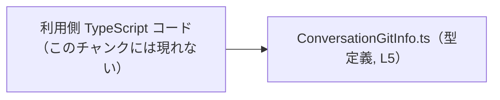
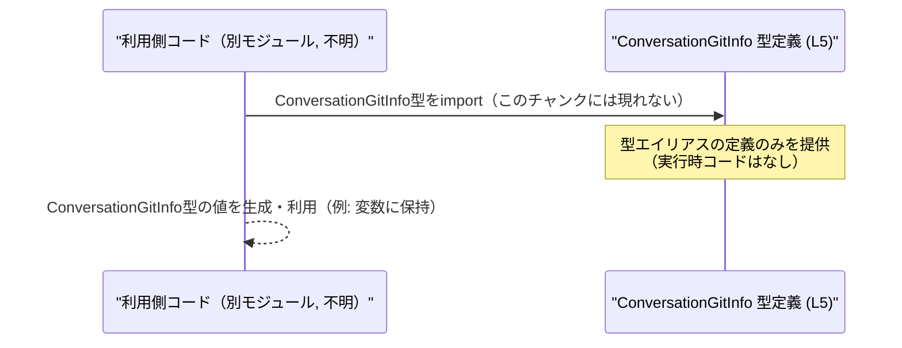

# app-server-protocol/schema/typescript/ConversationGitInfo.ts コード解説

## 0. ざっくり一言

`ConversationGitInfo` という型エイリアスを公開し、Git に関する 3 種類の文字列情報（`sha`, `branch`, `origin_url`）を `string | null` としてまとめて表現する、自動生成 TypeScript ファイルです。（根拠: ConversationGitInfo.ts:L1-5）

---

## 1. このモジュールの役割

### 1.1 概要

- このモジュールは、会話（Conversation）に紐づく Git 情報を 1 つのオブジェクト型として表すための **公開型定義** を提供します。（根拠: ConversationGitInfo.ts:L5-5）
- ファイル先頭に「GENERATED CODE」「Do not edit this file manually」と明記されており、手動編集ではなくコード生成ツール `ts-rs` によって生成された成果物です。（根拠: ConversationGitInfo.ts:L1-3）
- 実行時のロジックや関数は含まれず、**コンパイル時の型チェックにのみ関わる定義**になっています。（根拠: ConversationGitInfo.ts:L1-5）

### 1.2 アーキテクチャ内での位置づけ

- このファイルは **何も import しておらず**、他モジュールへの依存を持ちません。（根拠: ConversationGitInfo.ts:L1-5）
- `export type ConversationGitInfo = ...` として公開されているため、他の TypeScript ファイルから `ConversationGitInfo` 型として参照される **型定義モジュール** です。（根拠: ConversationGitInfo.ts:L5-5）
- 実際にどのモジュールがこの型を import しているかは、このチャンクには現れません。

代表的な依存関係イメージ（利用側は抽象的に表現し、実ファイル名は「不明」とします）:



- 矢印 `U --> T` は「利用側コードが `ConversationGitInfo` 型を import して依存している」関係を示します。
- 実際の利用モジュール名や import パスは、このチャンクからは不明です。

### 1.3 設計上のポイント

- **自動生成ファイル**  
  - `// GENERATED CODE! DO NOT MODIFY BY HAND!` と明記され、手動編集しない前提で設計されています。（根拠: ConversationGitInfo.ts:L1-1）
  - 生成元（スキーマや Rust 側の型など）はこのチャンクには現れません。
- **状態を持たない型定義のみ**  
  - 関数・クラス・変数の定義はなく、エクスポートされているのは `ConversationGitInfo` 型エイリアスだけです。（根拠: ConversationGitInfo.ts:L5-5）
- **null 許容による契約**  
  - 各フィールドが `string | null` となっており、「値が存在しない場合に `null` を入れる」という契約を明示しています。（根拠: ConversationGitInfo.ts:L5-5）
  - TypeScript の型システム上、利用側は `null` を考慮したコードを書く必要があります。

---

## 2. 主要な機能一覧

このファイルは 1 つの型定義のみを提供します。

- `ConversationGitInfo` 型: 会話に関する Git 情報（`sha`, `branch`, `origin_url`）をまとめて表すオブジェクト型。（根拠: ConversationGitInfo.ts:L5-5）

---

## 3. 公開 API と詳細解説

### 3.1 型一覧（構造体・列挙体など）

#### コンポーネントインベントリー（型）

| 名前                  | 種別                           | 役割 / 用途                                                                 | 根拠                                   |
|-----------------------|--------------------------------|------------------------------------------------------------------------------|----------------------------------------|
| `ConversationGitInfo` | 型エイリアス（オブジェクト型） | Git 情報（コミット SHA, ブランチ名, origin URL）を 1 つのオブジェクトで表現する | ConversationGitInfo.ts:L5-5           |

#### `ConversationGitInfo` のフィールド一覧

`ConversationGitInfo` は次の 3 フィールドを持つオブジェクト型です。（根拠: ConversationGitInfo.ts:L5-5）

| フィールド名  | 型              | 説明（型から読み取れる範囲）                                   | 根拠                                   |
|---------------|-----------------|------------------------------------------------------------------|----------------------------------------|
| `sha`         | `string \| null` | Git コミット ID などの SHA 文字列。未設定・不明の場合は `null` を許容。 | ConversationGitInfo.ts:L5-5           |
| `branch`      | `string \| null` | ブランチ名を表す文字列。未設定・不明の場合は `null` を許容。          | ConversationGitInfo.ts:L5-5           |
| `origin_url`  | `string \| null` | origin リモートの URL を表す文字列。未設定・不明の場合は `null` を許容。 | ConversationGitInfo.ts:L5-5           |

> 備考: フィールドの具体的な意味（どのタイミングの SHA か等）はコードからは読み取れません。

### 3.2 関数詳細（最大 7 件）

- このファイルには **関数定義が 1 つも存在しません**。  
  `function` 宣言やアロー関数（`=>`）などの構文は登場せず、型エイリアスの宣言のみです。（根拠: ConversationGitInfo.ts:L1-5）

したがって、このセクションで詳細に扱うべき関数はありません。

### 3.3 その他の関数

- 補助関数・ラッパー関数も含め、**関数は一切定義されていません**。（根拠: ConversationGitInfo.ts:L1-5）

---

## 4. データフロー

このファイルは型定義のみのため、実行時における具体的な処理フローはコードからは分かりません。  
ここでは「型としてどのように使われるか」という抽象的なデータフローを示します。

### 抽象的な利用フロー（イメージ）



- 実際の import 文や利用コードは、このチャンクには現れません。上図は TypeScript 型定義一般の利用パターンを表す抽象図です。
- `ConversationGitInfo` 自体は値を持たず、**オブジェクトの形を制約する型**として振る舞います。（根拠: ConversationGitInfo.ts:L5-5）

---

## 5. 使い方（How to Use）

### 5.1 基本的な使用方法

ここでは、`ConversationGitInfo` 型を利用する代表的な例を示します。  
※ import パスはプロジェクト構成に依存するため、ここでは仮の相対パスを使用します（実際のパスはこのチャンクからは不明）。

```typescript
// ConversationGitInfo 型を import する                           // 利用側コード（パスは例示）
import type { ConversationGitInfo } from "./ConversationGitInfo";  // ConversationGitInfo.ts:L5-5 を参照

// Git 情報がすべて揃っている場合の例                          // 3 フィールドすべてに string を設定
const fullInfo: ConversationGitInfo = {                            // ConversationGitInfo 型であることを明示
    sha: "abc123def456",                                           // sha: string
    branch: "main",                                                // branch: string
    origin_url: "https://example.com/repo.git",                    // origin_url: string
};

// 一部の情報が取得できなかった場合の例                         // null を使って「情報なし」を表現
const partialInfo: ConversationGitInfo = {
    sha: null,                                                     // SHA 不明
    branch: "feature/new-ui",                                      // ブランチ名のみ分かっている
    origin_url: null,                                              // origin URL 不明
};
```

- 3 フィールドとも `string | null` なので、**必ずプロパティ自体は存在し、その値が `string` か `null`** のどちらかになります。（根拠: ConversationGitInfo.ts:L5-5）
- `?` を用いたオプショナルプロパティではない点に注意が必要です。

### 5.2 よくある使用パターン

1. **Git 情報メタデータとしての保持**

```typescript
import type { ConversationGitInfo } from "./ConversationGitInfo";

// 会話に紐づく Git 情報をメタデータとして保持する例
const conversationMeta: { git: ConversationGitInfo } = {
    git: {
        sha: "abc123def456",
        branch: "main",
        origin_url: "https://example.com/repo.git",
    },
};
```

1. **null を考慮した表示処理**

```typescript
import type { ConversationGitInfo } from "./ConversationGitInfo";

// Git 情報を表示用の文字列に変換する例                         // null の場合は "unknown" 表示
function formatGitInfo(info: ConversationGitInfo): string {
    const sha = info.sha ?? "unknown";                             // null の場合のフォールバック
    const branch = info.branch ?? "unknown";
    const origin = info.origin_url ?? "unknown";

    return `sha=${sha}, branch=${branch}, origin=${origin}`;       // 一つの文字列にまとめて返す
}
```

- `??`（Null 合体演算子）を利用することで、`null` を安全に扱えます。
- これは `string | null` という型情報から必要になる典型的なパターンです。（根拠: ConversationGitInfo.ts:L5-5）

### 5.3 よくある間違い

**誤り例: `null` を考慮せずに文字列メソッドを呼び出す**

```typescript
import type { ConversationGitInfo } from "./ConversationGitInfo";

function toUpperSha(info: ConversationGitInfo): string {
    // return info.sha.toUpperCase();                              // ❌ 型: string | null なのでコンパイルエラー
    return (info.sha ?? "").toUpperCase();                         // ✅ null の場合は空文字にフォールバック
}
```

- `info.sha` の型は `string | null` であり、そのまま `toUpperCase()` を呼び出すと  
  TypeScript の型チェックによりコンパイルエラーになります。（根拠: ConversationGitInfo.ts:L5-5）
- 必ず `null` を除外するか、`??` / 条件分岐などでハンドリングする必要があります。

### 5.4 使用上の注意点（まとめ）

- **全フィールドが `null` を許容する**  
  - `sha`, `branch`, `origin_url` のいずれも `string | null` であり、「値がない」を `null` で表現する前提です。（根拠: ConversationGitInfo.ts:L5-5）
  - 利用側コードは `null` が返ってくる可能性を常に考慮する必要があります。
- **プロパティは常に存在する**  
  - オプショナル（`?`）ではないため、実行時オブジェクト上には常に `sha`, `branch`, `origin_url` プロパティが存在します。  
    値だけが `null` になり得ます。（根拠: ConversationGitInfo.ts:L5-5）
- **セキュリティ / バリデーション**  
  - この型は文字列か `null` かだけを制約しており、URL の正当性や SHA の形式などのバリデーションは一切行いません。（根拠: ConversationGitInfo.ts:L5-5）
  - 実際の入力検証やサニタイズは、利用側コードで行う必要があります。
- **並行性・パフォーマンス**  
  - 型定義のみであり、実行時コストや並行処理に関する問題はありません。

---

## 6. 変更の仕方（How to Modify）

### 6.1 新しい機能を追加する場合

- ファイル冒頭に `GENERATED CODE! DO NOT MODIFY BY HAND!` とあり、**直接編集すべきでない**ことが明示されています。（根拠: ConversationGitInfo.ts:L1-3）
- 新しいフィールドを追加したい場合は、次の方針が必要になります:
  - **このファイルそのものではなく、生成元（スキーマや定義）を変更する**  
    - 生成元が何か（例: 別言語の型定義など）はこのチャンクには現れないため不明ですが、`ts-rs` によって生成されていることから、生成設定・元定義側を修正する必要があります。（根拠: ConversationGitInfo.ts:L3-3）
  - 生成プロセスを再実行し、新しいフィールドを含む `ConversationGitInfo` を再生成する。

変更時に注意すべき点（契約）:

- 既存利用コードは `sha`, `branch`, `origin_url` の 3 フィールドが存在することを前提にしていると考えられるため、  
  これらを削除・型変更するとコンパイルエラーや実行時の不整合が発生する可能性があります。
- `null` を許容する契約（`string | null`）を変える場合、  
  既存コードの `null` ハンドリングロジックへの影響を確認する必要があります。

### 6.2 既存の機能を変更する場合

- 影響範囲:
  - `ConversationGitInfo` を使用している全てのモジュール（どれかはこのチャンクには現れません）が影響を受けます。
- 契約上の注意:
  - 各フィールドが `string | null` であることを利用側が前提にしているため、この型を変更する際はその前提に注意が必要です。（根拠: ConversationGitInfo.ts:L5-5）
- テスト:
  - このチャンクにはテストコードが含まれていないため、`ConversationGitInfo` に紐づくテストの有無は不明です。
  - 型変更時には、プロジェクト全体のビルドおよび型チェックを実行し、コンパイルエラーをテスト代わりに検出するのが基本的な手段になります。

---

## 7. 関連ファイル

このチャンクから分かる範囲での関連ファイルは次のとおりです。

| パス | 役割 / 関係 |
|------|------------|
| （不明） | `ConversationGitInfo` の生成元（スキーマや別言語の型など）は、コメントから `ts-rs` によって生成されていることだけ分かりますが、具体的なファイルパスはこのチャンクには現れません。（根拠: ConversationGitInfo.ts:L3-3） |
| （不明） | `ConversationGitInfo` 型を import して利用しているモジュール群。実際の利用箇所やファイル名はこのチャンクからは分かりません。 |

---

### Bugs / Security / Edge Cases まとめ（このファイルに特有の点）

- **Bugs（潜在バグ）**  
  - このファイル自体は型定義のみであり、実行時バグは発生しません。
  - 利用側で `null` を考慮しないコードを書いた場合にバグが生じる可能性があります（例: `info.sha.toUpperCase()` のようなコード）。
- **Security**  
  - URL や SHA の形式に関する安全性チェックは一切行われていません。  
    入力値の検証やエスケープは利用側に委ねられます。（根拠: ConversationGitInfo.ts:L5-5）
- **Contracts / Edge Cases**  
  - 3 フィールドすべてが `null` になっている `ConversationGitInfo` も型的には許容されます。（根拠: ConversationGitInfo.ts:L5-5）
  - プロパティ欠落（`{}`）は `ConversationGitInfo` としては不正です（`sha`, `branch`, `origin_url` は必須プロパティ）。  
    そのようなオブジェクトは TypeScript の型チェックで弾かれる前提です。
