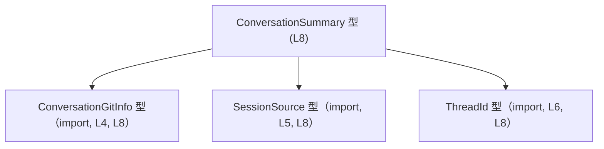
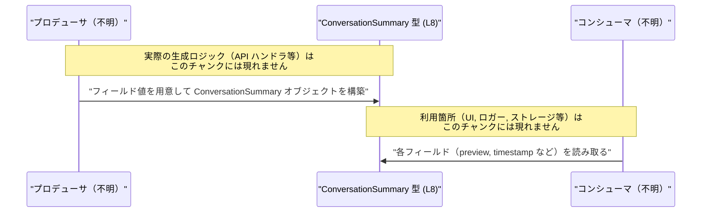

app-server-protocol/schema/typescript/ConversationSummary.ts のコード解説です。

---

## 0. ざっくり一言

- 会話セッションのメタデータ（ID・パス・プレビュー・タイムスタンプ・バージョン情報・Git 情報など）をひとまとめにした **TypeScript の型定義**です（ConversationSummary.ts:L8-8）。
- Rust 側の型定義から `ts-rs` によって **自動生成されたファイル**であり、手動で編集しないことが明示されています（ConversationSummary.ts:L1-3）。

---

## 1. このモジュールの役割

### 1.1 概要

- このモジュールは、アプリケーション内で扱う「会話」の要約情報を 1 つのオブジェクトとして表現するための **`ConversationSummary` 型エイリアス**を提供します（ConversationSummary.ts:L8-8）。
- `ThreadId`, `SessionSource`, `ConversationGitInfo` といった他の型と組み合わせることで、会話 ID やセッションの由来、Git 状態などの関連情報を型レベルで結び付けています（ConversationSummary.ts:L4-6, L8-8）。
- 実行ロジックや関数は含まれず、純粋に **データ構造を記述するためのスキーマ**として機能します。

### 1.2 アーキテクチャ内での位置づけ

このファイルは、会話要約データのスキーマを定義し、他のモジュールから参照される **中心的なデータ型**という位置づけです。  
依存関係は、3 つの外部型を import しているだけです（ConversationSummary.ts:L4-6）。



- `ConversationSummary` は `ConversationGitInfo`, `SessionSource`, `ThreadId` に依存しますが、これら外部型の具体的な定義はこのチャンクには現れません。
- 逆に、`ConversationSummary` を利用する側（API ハンドラや UI コンポーネントなど）は、このファイルからは分かりません。

### 1.3 設計上のポイント

- **自動生成コードであること**  
  - 冒頭コメントで `ts-rs` による生成であり、手作業での編集禁止が明記されています（ConversationSummary.ts:L1-3）。  
  - 型定義の単一のソース・オブ・トゥルースは Rust 側にあり、TypeScript コードはそれを反映した結果と解釈できます（コメントに基づく推測）。

- **型エイリアスによるオブジェクト表現**  
  - `export type ConversationSummary = { ... };` という形で、オブジェクト型をそのままエイリアスとして公開しています（ConversationSummary.ts:L8-8）。
  - TypeScript の `interface` ではなく `type` を使っているため、将来的にユニオン型などへの拡張も可能な表現です（一般的な TypeScript の性質）。

- **null 許容フィールドの明示**  
  - `timestamp`, `updatedAt`, `gitInfo` は `string | null`, `ConversationGitInfo | null` として定義されており、**値が存在しないケースを型で表現**しています（ConversationSummary.ts:L8-8）。
  - 呼び出し側はこれらフィールドにアクセスする際、コンパイル時に null チェックを求められる点が TypeScript の安全性に寄与します。

- **文字列によるタイムスタンプ表現**  
  - 日時を表すと考えられる `timestamp`, `updatedAt` は `string` 型であり（日付専用の型ではない）、どのフォーマットかはこのファイルからは分かりません（ConversationSummary.ts:L8-8）。

- **ロジック・エラー処理・並行処理は存在しない**  
  - 関数やメソッド定義は一切なく、例外処理や Promise などの非同期処理も登場しません（ConversationSummary.ts:L1-8）。

---

## 2. 主要な機能一覧

このモジュールは型定義のみを提供しますが、その役割を機能として整理すると次の 1 点に集約されます。

- `ConversationSummary` 型:  
  会話の ID・パス・プレビュー・タイムスタンプ・CLI バージョン・実行ディレクトリ・セッションソース・Git 情報などを 1 つのオブジェクトとして表現するためのスキーマ（ConversationSummary.ts:L8-8）。

---

## 3. 公開 API と詳細解説

### 3.1 型一覧（構造体・列挙体など）

#### 3.1.1 コンポーネントインベントリー（型）

| 名前                   | 種別                             | 役割 / 用途                                                                                   | 定義/使用 行                             |
|------------------------|----------------------------------|----------------------------------------------------------------------------------------------|------------------------------------------|
| `ConversationSummary`  | 型エイリアス（オブジェクト型）   | 会話の要約情報をまとめたデータ構造。各種メタ情報をフィールドとして保持する（フィールド名からの解釈） | ConversationSummary.ts:L8-8              |
| `ConversationGitInfo` | 外部型（import のみ）           | 会話と関連する Git 状態を表す型と解釈できるが、定義はこのチャンクには現れません               | ConversationSummary.ts:L4-4, L8-8        |
| `SessionSource`        | 外部型（import のみ）           | セッションの発生元を区別する型と解釈できるが、定義はこのチャンクには現れません               | ConversationSummary.ts:L5-5, L8-8        |
| `ThreadId`             | 外部型（import のみ）           | 会話スレッドを識別する ID 型と解釈できるが、定義はこのチャンクには現れません                 | ConversationSummary.ts:L6-6, L8-8        |

> 外部型の用途説明は名前からの推測であり、正確な仕様やフィールドはこのチャンクからは分かりません。

#### 3.1.2 `ConversationSummary` フィールド詳細

`ConversationSummary` は次のようなオブジェクト型です（ConversationSummary.ts:L8-8）。

```typescript
export type ConversationSummary = {
    conversationId: ThreadId,
    path: string,
    preview: string,
    timestamp: string | null,
    updatedAt: string | null,
    modelProvider: string,
    cwd: string,
    cliVersion: string,
    source: SessionSource,
    gitInfo: ConversationGitInfo | null,
};
```

各フィールドの型と null 許容性は次のとおりです。

| フィールド名      | 型                               | null 許容 | 説明（コードから言える範囲 / 名前からの解釈）                                             | 定義行                       |
|-------------------|----------------------------------|-----------|-------------------------------------------------------------------------------------------|------------------------------|
| `conversationId`  | `ThreadId`                       | なし      | 会話を一意に識別する ID を表す外部型。詳細は `ThreadId` の定義側に依存します             | ConversationSummary.ts:L8-8 |
| `path`            | `string`                         | なし      | 「パス」を表す文字列。ファイルパス、プロジェクト内の論理パスなどと解釈できるが詳細不明   | ConversationSummary.ts:L8-8 |
| `preview`         | `string`                         | なし      | 会話の内容の一部や概要を示すテキストと解釈できますが、形式はこのファイルからは不明       | ConversationSummary.ts:L8-8 |
| `timestamp`       | `string \| null`                | あり      | おそらく作成時刻などを表す文字列。値がない場合は `null`。フォーマットは不明             | ConversationSummary.ts:L8-8 |
| `updatedAt`       | `string \| null`                | あり      | おそらく更新時刻などを表す文字列。値がない場合は `null`。フォーマットは不明             | ConversationSummary.ts:L8-8 |
| `modelProvider`   | `string`                         | なし      | 使用したモデルプロバイダ名（例: ベンダー名）と解釈できるが、具体的な値の種類は不明       | ConversationSummary.ts:L8-8 |
| `cwd`             | `string`                         | なし      | 実行時のカレントディレクトリを表す文字列と解釈できますが、値の形式はこのファイルでは不明 | ConversationSummary.ts:L8-8 |
| `cliVersion`      | `string`                         | なし      | CLI のバージョン文字列を表すと解釈できますが、フォーマット等は不明                      | ConversationSummary.ts:L8-8 |
| `source`          | `SessionSource`                  | なし      | セッションの発生源を表す外部型。例えば手動/自動などの区別がありそうですが、詳細不明     | ConversationSummary.ts:L8-8 |
| `gitInfo`         | `ConversationGitInfo \| null`   | あり      | Git の状態に関する情報。Git コンテキストが存在しない場合には `null` と解釈できますが詳細不明 | ConversationSummary.ts:L8-8 |

> 「解釈できます」「おそらく」と記載している箇所は、フィールド名から推測できる用途であり、厳密な仕様はこのファイルからは確定できません。

### 3.2 関数詳細（最大 7 件）

- このファイルには **関数・メソッド・クラス定義は存在しません**（ConversationSummary.ts:L1-8）。
- そのため、ここで説明できる「コアロジック」「エラー処理」「並行処理」はありません。

### 3.3 その他の関数

- 補助関数やユーティリティ関数も定義されていません（ConversationSummary.ts:L1-8）。

---

## 4. データフロー

このファイル単体には、`ConversationSummary` をどこで生成し、どこで消費するかに関するコードは含まれていません。  
したがって、具体的な処理シナリオや呼び出し元/呼び出し先は **このチャンクからは不明**です。

ここでは、あくまで概念的なデータフロー（「どこかで `ConversationSummary` が構築され、どこかで利用される」）を示します。



- この図は、**`ConversationSummary` がデータの「入れ物」として振る舞う**ことのみを表しています。
- どの層（サーバ / クライアント / CLI など）で使われるかは、ディレクトリ名やフィールド名から推測はできますが、ここでは「不明」と明示しています。

---

## 5. 使い方（How to Use）

### 5.1 基本的な使用方法

ここでは、他の TypeScript コードから `ConversationSummary` 型を利用する典型的な例を示します。  
実際の import パスはプロジェクト構成に依存しますが、このファイルパスから相対的に記述します。

```typescript
// ConversationSummary 型をインポートする例
import type { ConversationSummary } from "./ConversationSummary"; // 型のみインポート

// ConversationSummary 型の値を作成する例
const summary: ConversationSummary = {                  // summary は ConversationSummary 型
    conversationId: someThreadId,                       // ThreadId 型の値（定義は別ファイル）
    path: "/path/to/project",                           // 任意のパス文字列
    preview: "最初の数メッセージがここに入ると想定されるテキスト", // プレビュー文字列
    timestamp: "2024-03-01T12:34:56Z",                  // ある時刻の文字列（フォーマットはこのファイルからは不明）
    updatedAt: null,                                    // 更新時刻が未設定の場合は null
    modelProvider: "example-provider",                  // モデル提供元を表す文字列
    cwd: "/path/to/project",                            // カレントディレクトリ
    cliVersion: "1.2.3",                                // CLI バージョン文字列
    source: someSessionSource,                          // SessionSource 型の値（定義は別ファイル）
    gitInfo: null,                                      // Git 情報がない場合は null
};

// フィールドを利用する例（null 許容フィールドへの安全なアクセス）
if (summary.timestamp !== null) {                       // timestamp は string | null なので null チェックが必要
    console.log("作成時刻:", summary.timestamp);        // ここでは string として扱える
} else {
    console.log("作成時刻は不明");
}

if (summary.gitInfo !== null) {                         // gitInfo も null を取りうる
    // gitInfo の具体的なフィールドはこのチャンクには現れないため、ここでは型レベル以上の説明はできません
    handleGitInfo(summary.gitInfo);                     // 何らかの処理に渡す
}
```

ポイント:

- `ConversationSummary` は **純粋な TypeScript 型**であり、コンパイル時に構造をチェックしますが、実行時に自動でバリデーションされるわけではありません。
- `timestamp`, `updatedAt`, `gitInfo` は `null` を取りうるため、アクセス前に必ず null チェックを行う必要があります（型 `string | null` / `ConversationGitInfo | null` から分かる事実）。

### 5.2 よくある使用パターン

#### 5.2.1 一覧表示用に配列で扱う

複数の会話要約をリスト表示するような場面を想定した、基本的な配列処理の例です（ロジックは一般的な TypeScript の使い方です）。

```typescript
import type { ConversationSummary } from "./ConversationSummary";

function printSummaries(summaries: ConversationSummary[]) {   // ConversationSummary の配列
    for (const s of summaries) {
        const updated = s.updatedAt ?? s.timestamp;           // null 合体演算子でフォールバック
        console.log(
            `ID=${String(s.conversationId)} ` +               // ThreadId の具体的な型は不明なので String() で文字列化
            `path=${s.path} ` +
            `time=${updated ?? "N/A"} ` +
            `provider=${s.modelProvider}`,
        );
    }
}
```

ここでは TypeScript の以下の特性が関わります。

- `??`（Null 合体演算子）を使うことで、`null` の場合に代替値を簡潔に指定できます。
- `conversationId` の具体的な構造は不明なため、`String()` で安全に文字列化しています（このファイルから分かる範囲での安全な扱い）。

### 5.3 よくある間違い

`null` を許容するフィールドを **そのまま文字列として扱う**と、TypeScript の型チェックでエラーになります。

```typescript
import type { ConversationSummary } from "./ConversationSummary";

function wrong(summary: ConversationSummary) {
    // 間違い例: timestamp は string | null 型なので、直接 string メソッドを呼ぶとエラー
    // console.log(summary.timestamp.toUpperCase());   // コンパイルエラー

    // 間違い例: gitInfo をそのままオブジェクトとして扱う（null の可能性がある）
    // console.log(summary.gitInfo.branch);           // コンパイルエラー（定義もこのチャンクには不明）
}

function correct(summary: ConversationSummary) {
    // 正しい例: null チェックを行ってから string として扱う
    if (summary.timestamp !== null) {
        console.log(summary.timestamp.toUpperCase());        // ここでは string として安全
    }

    // 正しい例: gitInfo も null チェック後に利用する
    if (summary.gitInfo !== null) {
        useGitInfo(summary.gitInfo);                         // 具体的なフィールドは別定義
    }
}
```

### 5.4 使用上の注意点（まとめ）

- **自動生成ファイルを直接編集しない**  
  - 冒頭コメントに「GENERATED CODE」「Do not edit this file manually」とある通り（ConversationSummary.ts:L1-3）、このファイルを直接変更すると Rust 側との同期が崩れる可能性があります。

- **null 許容フィールドの扱い**  
  - `timestamp`, `updatedAt`, `gitInfo` は `null` を取りうるため、利用側で必ず null チェックや `??` によるフォールバックを行う必要があります（ConversationSummary.ts:L8-8）。

- **型はコンパイル時のみ有効である点**  
  - TypeScript の型情報はコンパイル時に消えるため、外部から JSON を受け取って `ConversationSummary` に代入するような処理では、別途ランタイムでのバリデーションが必要です（このファイルには実装は存在しませんが、TypeScript の一般的な性質）。

- **セキュリティ・バグ観点（一般論）**  
  - `path` や `cwd` などの文字列値に対して、実際にファイル操作やプロセス実行を行うコード側では、パスインジェクションなどを防ぐための検証が必要です。  
    このファイル単体から具体的な利用方法は分かりませんが、**型としては単なる `string` である**ことに注意する必要があります（ConversationSummary.ts:L8-8）。

---

## 6. 変更の仕方（How to Modify）

### 6.1 新しい機能を追加する場合

- コメントにある通り、このファイルは `ts-rs` により **自動生成されているため、直接フィールドを追加するべきではありません**（ConversationSummary.ts:L1-3）。
- 新しいフィールドを `ConversationSummary` に追加したい場合は、次のような流れが想定されます（一般的な ts-rs の利用パターンからの推測であり、具体的な Rust ファイルはこのチャンクには現れません）。
  1. Rust 側の元となる構造体（例: `ConversationSummary` に対応する struct）にフィールドを追加する。
  2. `ts-rs` のコード生成手順を実行して、この TypeScript ファイルを再生成する。
  3. 生成後、TypeScript 側の利用コードで新フィールドを扱うように修正する。

> 元となる Rust ファイルのパスや構造は、このチャンクからは分かりません。

### 6.2 既存の機能を変更する場合

- すでに存在するフィールド名・型を変更したい場合も、**必ず Rust 側の定義を変更し、再生成する必要がある**と考えられます（自動生成コードであることからの推測）。
- 変更時に注意すべき点（契約・互換性）:
  - フィールドを削除・型変更すると、それを利用している TypeScript コードがコンパイルエラーになる可能性があります。
  - `null` 非許容のフィールドを後から `null` 許容に変更すると、呼び出し側の null チェックの有無に注意が必要です。
  - 逆に `null` 許容フィールドを非許容に変更すると、既存のデータ（永続化された JSON など）との互換性に影響が出る可能性があります。  
    ただし、そのような永続化方式が実際に使われているかどうかは、このファイルからは不明です。

---

## 7. 関連ファイル

このモジュールと直接的に関係するファイルは、import されている 3 つの型定義ファイルです（ConversationSummary.ts:L4-6）。

| パス                        | 役割 / 関係                                                                                          |
|-----------------------------|------------------------------------------------------------------------------------------------------|
| `./ConversationGitInfo`     | `ConversationGitInfo` 型の定義を提供するファイル。`gitInfo` フィールドの型として参照されています（L4, L8）。 |
| `./SessionSource`           | `SessionSource` 型の定義を提供するファイル。`source` フィールドの型として参照されています（L5, L8）。         |
| `./ThreadId`                | `ThreadId` 型の定義を提供するファイル。`conversationId` フィールドの型として参照されています（L6, L8）。    |

> これらのファイルの中身は、このチャンクには現れないため、具体的な構造や追加の依存関係は「不明」です。  
> また、コメントからは Rust 側の元定義ファイルと `ts-rs` のコード生成スクリプトが存在すると推測できますが、パスや実装の詳細はこのチャンクからは分かりません。
