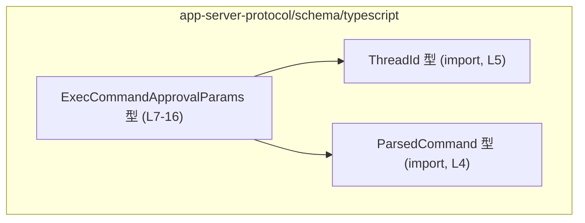
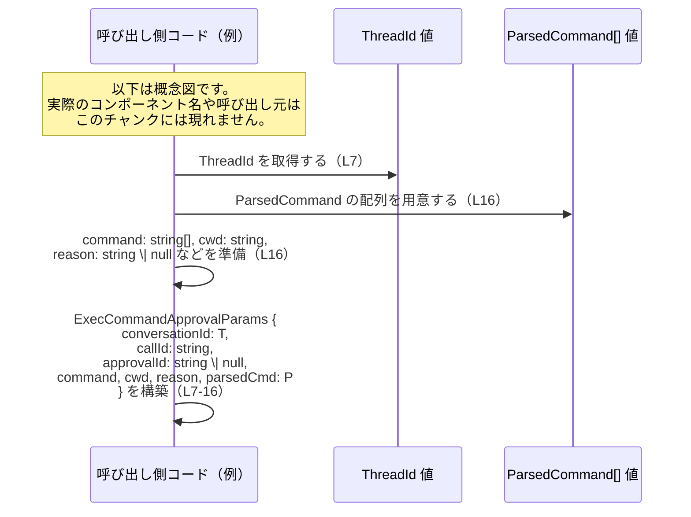

# app-server-protocol/schema/typescript/ExecCommandApprovalParams.ts コード解説

## 0. ざっくり一言

`ExecCommandApprovalParams` は、実行コマンドに対する「承認コールバック」のパラメータを表すための、`ts-rs` によって自動生成された TypeScript の型定義です（ExecCommandApprovalParams.ts:L1-3, L7-16）。

---

## 1. このモジュールの役割

### 1.1 概要

- このモジュールは、実行コマンド承認イベントに関する情報を 1 つのオブジェクトにまとめて表現するための型 `ExecCommandApprovalParams` を提供します（ExecCommandApprovalParams.ts:L7-16）。
- 含まれる情報は、会話スレッド ID、コマンド呼び出しとの相関 ID、承認コールバック ID、コマンド文字列列、作業ディレクトリ、理由、構造化されたコマンド情報です（ExecCommandApprovalParams.ts:L7-16）。
- ファイル先頭のコメントから、この型は Rust 側から `ts-rs` によって自動生成されており、手動編集しないことが強く推奨されています（ExecCommandApprovalParams.ts:L1-3）。

### 1.2 アーキテクチャ内での位置づけ

このモジュールは、TypeScript 側の「プロトコル / スキーマ定義」の一部として、ほかのコードから参照される純粋なデータコンテナ型を提供しています。

依存関係（このチャンクに現れる範囲）は次のとおりです。

- `ExecCommandApprovalParams` は `ThreadId` 型と `ParsedCommand` 型を利用します（ExecCommandApprovalParams.ts:L4-5, L7-16）。
- `ThreadId` と `ParsedCommand` の定義自体は別ファイルにあり、このチャンクには現れません（ExecCommandApprovalParams.ts:L4-5）。



> この図は、このチャンク内で確認できる型間依存のみを示しています。`ExecCommandApprovalParams` を利用する呼び出し元や下流コンポーネントは、このチャンクには現れないため不明です。

### 1.3 設計上のポイント

- **自動生成コード**  
  ファイル先頭コメントにより、`ts-rs` による自動生成コードであることが明示されています（ExecCommandApprovalParams.ts:L1-3）。
- **純粋なデータ型**  
  関数やメソッドはなく、1 つの `export type` によるオブジェクト型のみが公開されています（ExecCommandApprovalParams.ts:L7-16）。
- **オプショナル値の表現**  
  `approvalId` と `reason` は `string | null` で表現されており、「値がない」状態を `null` で明示的に表します（ExecCommandApprovalParams.ts:L16）。
- **配列による多値表現**  
  `command` は `Array<string>`, `parsedCmd` は `Array<ParsedCommand>` として定義されており、複数要素を持つ前提のデータであることが分かります（ExecCommandApprovalParams.ts:L16）。

---

## 2. 主要な機能一覧

このファイルは関数を持たないため、「機能」というより「データ構造」としての役割を列挙します。

- `ExecCommandApprovalParams` 型: 実行コマンド承認コールバックで扱うパラメータを 1 つのオブジェクトとして表現する（ExecCommandApprovalParams.ts:L7-16）。
  - 会話スレッド ID の保持
  - 実行コマンド開始・終了イベントとの相関用 ID の保持（ExecCommandApprovalParams.ts:L8-12）
  - 承認コールバック自体の識別子の保持（ExecCommandApprovalParams.ts:L13-16）
  - コマンド文字列列および解析済みコマンド情報の保持（ExecCommandApprovalParams.ts:L16）
  - 実行理由などの説明テキストの保持（ExecCommandApprovalParams.ts:L16）

---

## 3. 公開 API と詳細解説

### 3.1 型一覧（構造体・列挙体など）

#### 型インベントリー

| 名前                         | 種別       | 役割 / 用途                                                                                                   | 定義 / 参照位置                                |
|------------------------------|------------|---------------------------------------------------------------------------------------------------------------|-----------------------------------------------|
| `ExecCommandApprovalParams` | 型エイリアス（オブジェクト型） | 実行コマンド承認コールバックのパラメータ一式を表現する公開 API 型                                           | 定義: ExecCommandApprovalParams.ts:L7-16      |
| `ParsedCommand`             | インポートされた型 | `parsedCmd` プロパティの要素型。コマンドの構造化表現に使われていることが分かるが、詳細はこのチャンクにはない | import: ExecCommandApprovalParams.ts:L4       |
| `ThreadId`                  | インポートされた型 | `conversationId` の型。会話スレッドを識別する ID であると解釈できるが、詳細はこのチャンクにはない             | import: ExecCommandApprovalParams.ts:L5       |

> `ParsedCommand` / `ThreadId` の内部構造や意味の詳細は、このファイルには定義がなく不明です。

#### `ExecCommandApprovalParams` フィールド詳細

`ExecCommandApprovalParams` は次のプロパティを持つオブジェクト型です（ExecCommandApprovalParams.ts:L7-16）。

| フィールド名      | 型                         | null 可 | 説明（コードから読み取れる範囲）                                                                                                                                                 | 定義位置                              |
|-------------------|----------------------------|---------|-----------------------------------------------------------------------------------------------------------------------------------------------------------------------------------|---------------------------------------|
| `conversationId`  | `ThreadId`                 | 不可    | 会話（スレッド）を識別する ID。型が `ThreadId` であることのみが分かります。意味や内部構造はこのチャンクには現れません。                                                          | ExecCommandApprovalParams.ts:L7-7     |
| `callId`          | `string`                  | 不可    | コメントにより、`ExecCommandBeginEvent` / `ExecCommandEndEvent` との相関に用いる ID と明記されています（ExecCommandApprovalParams.ts:L8-12）。                                   | ExecCommandApprovalParams.ts:L8-12    |
| `approvalId`      | `string \| null`          | 可      | コメントにより「この特定の approval callback を識別する ID」であると記載されています（ExecCommandApprovalParams.ts:L13-15）。値がない場合は `null` で表現されます（L16）。       | ExecCommandApprovalParams.ts:L13-16   |
| `command`         | `Array<string>`           | 不可    | コマンドに関する文字列の配列です（ExecCommandApprovalParams.ts:L16）。各要素の意味（コマンド本体か引数かなど）は、このチャンクには明示されていません。                             | ExecCommandApprovalParams.ts:L16-16   |
| `cwd`             | `string`                  | 不可    | 作業ディレクトリを表すと推測される `cwd` という名前の文字列フィールドです（ExecCommandApprovalParams.ts:L16）。コメントはなく、このファイルだけから厳密な仕様は分かりません。      | ExecCommandApprovalParams.ts:L16-16   |
| `reason`          | `string \| null`          | 可      | 承認の理由などの説明テキストを格納すると考えられる文字列または `null` のフィールドです（ExecCommandApprovalParams.ts:L16）。コメントはなく、用途は名前からの推測にとどまります。 | ExecCommandApprovalParams.ts:L16-16   |
| `parsedCmd`       | `Array<ParsedCommand>`    | 不可    | `ParsedCommand` 型の配列。コマンドの構造化された解析結果を格納していると解釈できますが、`ParsedCommand` の内容自体はこのチャンクにはありません（ExecCommandApprovalParams.ts:L16）。 | ExecCommandApprovalParams.ts:L16-16   |

##### 型レベルの安全性・エラー・並行性

- **型安全性（TypeScript 観点）**  
  - 各フィールドに明示的な型が付いており、コンパイル時に不一致が検出されます（ExecCommandApprovalParams.ts:L7-16）。
  - `approvalId` / `reason` は `string | null` であり、利用側は `null` を扱う必要があります。`string` として直接使用しようとするとコンパイラが警告します。
- **エラー処理**  
  - このファイルには関数・ロジックがなく、型レベルで「許容されない状態」を禁止する以上のエラー処理はありません。
  - 実行時の検証（例えば `command` が空でないことなど）は、この型の利用側コードに委ねられます。
- **並行性（Concurrency）**  
  - 純粋なデータ型であり、スレッドセーフ／非スレッドセーフといった概念は TypeScript レベルで直接は現れません。
  - 共有や更新のパターンはすべて利用側の実装に依存し、このチャンクだけからは分かりません。

### 3.2 関数詳細（最大 7 件）

このファイルには関数・メソッド定義が一切存在しないため、詳細解説の対象となる関数はありません（ExecCommandApprovalParams.ts:全文を確認）。

- その結果：
  - **Bugs/Security（ロジック起因）**: コアロジックが存在しないため、このファイル単体からロジックバグや例外処理の問題は生じません。
  - **Performance/Scalability**: ランタイム処理がないため、このファイル自体が処理性能に与える影響は型チェックとビルド時のみです。

### 3.3 その他の関数

- 該当なし（関数が定義されていません）。

---

## 4. データフロー

このファイルには実行処理や I/O は含まれておらず、`ExecCommandApprovalParams` は静的なデータコンテナとしてのみ定義されています（ExecCommandApprovalParams.ts:L7-16）。  
ここでは、この型がどのような値から構築されるかの「概念的な」流れを、型定義に現れている情報だけを使って示します。



> この sequence diagram は、`ExecCommandApprovalParams` がどの型の値を集めて 1 つのオブジェクトを形成するかという「データの組み立て方」を表すものであり、実際の送信先や保存先などのフローは、このチャンクからは不明です。

---

## 5. 使い方（How to Use）

### 5.1 基本的な使用方法

ここでは、`ExecCommandApprovalParams` 型のインスタンスを構築する最小限の例を示します。  
`ThreadId` と `ParsedCommand` の具体的な構造はこのチャンクにはないため、型名のみを利用した例になっています。

```typescript
// ExecCommandApprovalParams 型と依存型をインポートする
import type { ExecCommandApprovalParams } from "./ExecCommandApprovalParams";  // 本ファイル
import type { ThreadId } from "./ThreadId";                                   // L5 で import されている型
import type { ParsedCommand } from "./ParsedCommand";                         // L4 で import されている型

// ここでは ThreadId / ParsedCommand の生成方法は不明なため、
// 既にどこかから受け取った値がある前提とします。
declare const threadId: ThreadId;                  // 会話スレッド ID（ExecCommandApprovalParams.ts:L7）
declare const parsedCommands: ParsedCommand[];     // 解析済みコマンド配列（L16）

const params: ExecCommandApprovalParams = {        // ExecCommandApprovalParams オブジェクトを構築（L7-16）
    conversationId: threadId,                      // ThreadId 型の値
    callId: "call-123",                            // ExecCommandBegin/EndEvent と相関させる ID（L8-12）
    approvalId: "approval-1",                      // 承認コールバックの識別子（L13-16）
    command: ["echo", "hello"],                    // コマンドに関する文字列配列（L16）
    cwd: "/workspace/project",                     // 作業ディレクトリと推測される文字列（L16）
    reason: "User approved the command",           // 承認理由の説明テキスト（L16）
    parsedCmd: parsedCommands,                     // ParsedCommand 型の配列（L16）
};

// params は、関数や RPC 呼び出しなどで ExecCommandApprovalParams 型として扱うことができます。
```

> `command` / `cwd` / `reason` の「意味」はこの型定義自体には明示されていないため、実際の用途は周辺のドキュメントや実装に依存します。

### 5.2 よくある使用パターン

#### 1. `approvalId` や `reason` が存在しないケース

`approvalId` と `reason` は `string | null` であるため、値が存在しない（または必要ない）場合に `null` を指定できます（ExecCommandApprovalParams.ts:L16）。

```typescript
const paramsWithoutOptional: ExecCommandApprovalParams = {
    conversationId: threadId,        // ThreadId
    callId: "call-456",              // 相関 ID
    approvalId: null,                // 承認 ID が存在しないことを示す（L16）
    command: ["ls", "-la"],          // 文字列配列
    cwd: "/tmp",                     // 作業ディレクトリと推測
    reason: null,                    // 理由を特に残さない場合（L16）
    parsedCmd: parsedCommands,       // ParsedCommand[]
};
```

### 5.3 よくある間違い（起こりうる誤用例）

この型定義から推測できる、起こりうる誤用例と、その修正例です。

```typescript
// 誤用例: approvalId が null の可能性を無視して string として扱っている
function logApprovalIdWrong(params: ExecCommandApprovalParams) {
    // コンパイルエラー: params.approvalId は string | null
    // console.log(params.approvalId.toUpperCase());
}

// 正しい例: null チェックを行った上で string として扱う
function logApprovalIdCorrect(params: ExecCommandApprovalParams) {
    if (params.approvalId !== null) {                     // null でないことを確認
        console.log(params.approvalId.toUpperCase());     // string として安全に使用
    } else {
        console.log("approvalId is null");
    }
}
```

### 5.4 使用上の注意点（まとめ）

- **null 許容フィールドの扱い**  
  `approvalId` と `reason` は `null` を取りうるため、利用時には必ず null チェックが必要です（ExecCommandApprovalParams.ts:L16）。
- **配列フィールドの中身の意味**  
  `command: Array<string>` / `parsedCmd: Array<ParsedCommand>` は型レベルでは配列であることのみが保証されており、要素の内容・数に関する制約はこの型定義では表現されていません（ExecCommandApprovalParams.ts:L16）。
- **バリデーションは利用側に委譲**  
  このファイルには実行時バリデーションはありません。空の `command` や空文字の `cwd` などが意味的に許容されるかどうかは、利用側の仕様によります。
- **セキュリティ観点（一般論）**  
  `command` や `cwd` はおそらく実行環境に影響する可能性がある文字列ですが、このファイルにはコマンドの実行ロジックは一切含まれません。コマンドインジェクション等の対策は、この型を受け取って実行する側で実装する必要があります。
- **自動生成ファイルであること**  
  ファイル冒頭のコメントが示す通り、手動編集は推奨されません（ExecCommandApprovalParams.ts:L1-3）。  
  仕様変更が必要な場合は、生成元（Rust 側の定義など）を変更して再生成する設計であると読み取れます。

---

## 6. 変更の仕方（How to Modify）

### 6.1 新しい機能を追加する場合

このファイルは `ts-rs` により自動生成されることが明示されており（ExecCommandApprovalParams.ts:L1-3）、直接編集すると次のような問題が生じる可能性があります。

- 再生成時に変更が上書きされる。
- 生成元（おそらく Rust 側の型定義）との不整合が生じる。
- 他言語・他プロセスと共有しているプロトコル仕様との整合性が崩れる。

そのため、新しいフィールドの追加などの変更は、一般的には次の方針になります。

1. **生成元の型定義を変更する**  
   コメントにある通り `ts-rs` を利用しているため、通常は Rust 側の型（構造体など）を修正します（ExecCommandApprovalParams.ts:L1-3 がその根拠）。
2. **コード生成を再実行する**  
   `ts-rs` によるコード生成を再度実行し、TypeScript 側の型定義を更新します。
3. **利用箇所をすべてビルド・テストする**  
   新フィールドの有無や null 可能性の変化により、呼び出し側コードがコンパイルエラーになる可能性があります。  
   このファイルにはテストコードは含まれていないため、テストの所在は不明ですが、プロジェクト全体のテストを実行する必要があります。

### 6.2 既存の機能を変更する場合

`ExecCommandApprovalParams` の既存フィールドを変更する場合に注意すべき点です。

- **フィールド名の変更**  
  - プロトコルの「キー名」が変わることになり、シリアライズ／デシリアライズの双方に影響します。
  - 呼び出し元・受信側の両方で対応が必要になります。
- **型の変更（例: `string` → `string | null`）**  
  - TypeScript 側ではコンパイル時の型チェックにより影響範囲が比較的明確になります。
  - ただし、JavaScript から直接オブジェクトが渡される場合など、実行時の互換性は別途検証が必要です。
- **契約（Contracts）とエッジケース**  
  - この型定義自体には「空配列を禁止する」「非空文字列であること」などの契約は表現されていません。
  - もしそのような制約を導入したい場合は、型レベルの表現だけでなく、利用側ロジックにバリデーションを追加する必要があります。
- **テスト**  
  - このファイルにはテストは含まれていませんが、新しい契約やフィールドを導入した場合は、それを検証するテスト（シリアライズ／デシリアライズ、API 経由での送受信など）を追加・更新する必要があります。

---

## 7. 関連ファイル

このモジュールと直接の依存関係を持つファイルは、インポートされている型定義です（ExecCommandApprovalParams.ts:L4-5）。

| パス                       | 役割 / 関係                                                                                         |
|----------------------------|----------------------------------------------------------------------------------------------------|
| `./ParsedCommand`         | `ParsedCommand` 型を定義するモジュール。`ExecCommandApprovalParams.parsedCmd` の要素型として利用されます（ExecCommandApprovalParams.ts:L4, L16）。内容はこのチャンクには現れません。 |
| `./ThreadId`              | `ThreadId` 型を定義するモジュール。`ExecCommandApprovalParams.conversationId` の型として利用されます（ExecCommandApprovalParams.ts:L5, L7）。内容はこのチャンクには現れません。 |

> テストコードや、この型を実際に利用するサービス・ハンドラなどの位置は、このチャンクには現れず不明です。

---

### まとめ（Bugs/Security / Performance / Observability の観点）

- **Bugs/Security**  
  - このファイルは型定義のみでロジックを持たないため、直接的なバグやセキュリティホールは含まれていません。
  - ただし、`command` / `cwd` などの意味的に重要な文字列をどのように利用するかによっては、利用側でセキュリティリスクが生じる可能性があります。
- **Performance/Scalability**  
  - 型レベルの定義であり、ランタイムのパフォーマンスに与える影響は極小です。主にコンパイル時の型チェックコストのみです。
- **Observability**  
  - ログ出力や計測に関するコードは一切含まれていません。  
    `ExecCommandApprovalParams` をログに出したりトレースに埋め込むかどうかは、利用側の設計に依存します。
