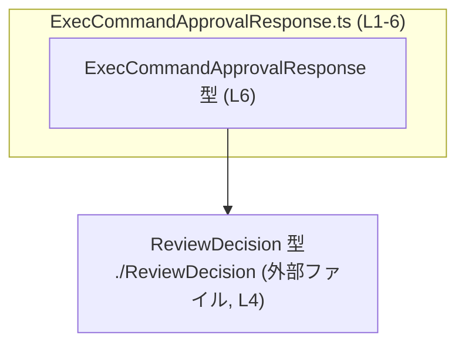
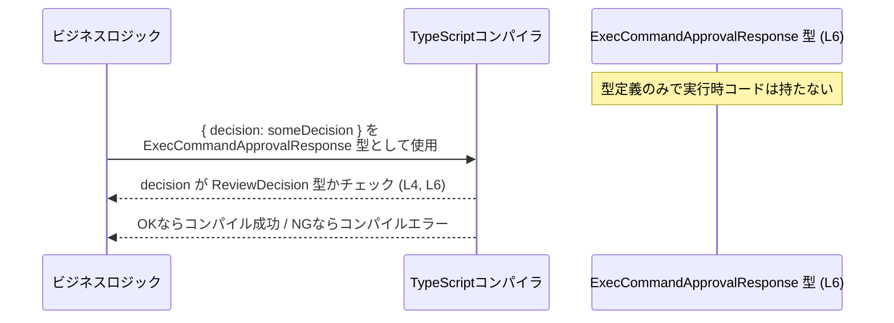

# app-server-protocol/schema/typescript/ExecCommandApprovalResponse.ts コード解説

## 0. ざっくり一言

- TypeScript で **`ExecCommandApprovalResponse`** という応答オブジェクトの型エイリアス（別名）を 1 つ定義するファイルです（根拠: `ExecCommandApprovalResponse.ts:L6-6`）。
- 中身は `decision: ReviewDecision` という 1 フィールドだけを持つ構造で、ファイル全体は `ts-rs` により自動生成されています（根拠: `ExecCommandApprovalResponse.ts:L1-3`）。

---

## 1. このモジュールの役割

### 1.1 概要

- このモジュールは、**`ExecCommandApprovalResponse` 型**を定義します（根拠: `ExecCommandApprovalResponse.ts:L6-6`）。
- `ExecCommandApprovalResponse` は、`ReviewDecision` 型の `decision` プロパティを必須で持つオブジェクト型です（根拠: `ExecCommandApprovalResponse.ts:L4-6`）。
- 実行時のロジックや関数は一切含まず、**型情報のみ**を提供します（コードに関数定義や値定義が存在しないための事実）。

> 型名とプロパティ名から、何らかの「レビュー結果」や「承認／却下の決定」を返すレスポンスを表す用途が想定されますが、具体的な意味や値のバリエーションは `ReviewDecision` の定義がこのチャンク内にないため、コードだけでは断定できません。

### 1.2 アーキテクチャ内での位置づけ

- このファイル自体は **自動生成された TypeScript のスキーマ定義**であり、`ts-rs` によって生成されたことがコメントに明記されています（根拠: `ExecCommandApprovalResponse.ts:L1-3`）。
- `ExecCommandApprovalResponse` 型は、`ReviewDecision` 型に依存しています（根拠: `ExecCommandApprovalResponse.ts:L4-6`）。
  - 依存方向: `ExecCommandApprovalResponse` → `ReviewDecision`
- `import type` を用いているため、`ReviewDecision` は**型としてのみ**利用され、実行時にはインポートされません（根拠: `ExecCommandApprovalResponse.ts:L4-4`）。

依存関係のイメージを Mermaid 図で示します。



- 上記は、このチャンクで確認できる **唯一の依存関係** です。
- `./ReviewDecision` の中身はこのチャンクには現れないため、どのような列挙・ユニオン・構造体かは不明です。

### 1.3 設計上のポイント

コードから読み取れる設計上の特徴は、次のとおりです。

- **自動生成コードであることが明示されている**  
  - 「GENERATED CODE」「Do not edit this file manually」とあり、手動編集を禁止する方針です（根拠: `ExecCommandApprovalResponse.ts:L1-3`）。
- **型定義専用モジュール**  
  - 値や関数定義がなく、`import type` と `export type` のみで構成されています（根拠: `ExecCommandApprovalResponse.ts:L4-6`）。
- **型レベルでの依存関係のみ**  
  - `import type` により、実行時の依存を発生させずに型情報だけを参照する設計です（根拠: `ExecCommandApprovalResponse.ts:L4-4`）。
- **状態・エラーハンドリング・並行性のロジックは持たない**  
  - 関数・クラス・メソッドが存在しないため、このファイル内には状態管理やエラー処理、並行処理（async/await など）の実装はありません。

---

## 2. 主要な機能一覧

このモジュールが提供する機能は、**1 つの型定義**に集約されています。

- `ExecCommandApprovalResponse` 型: `decision: ReviewDecision` を持つ応答オブジェクトの型エイリアス（根拠: `ExecCommandApprovalResponse.ts:L4-6`）

### 2.1 コンポーネントインベントリー（型・インポート一覧）

このチャンクに現れるコンポーネント（型・インポート）の一覧です。

| 種別 | 名前 | 内容 / 役割 | 定義・参照位置 |
|------|------|-------------|----------------|
| コメント | 自動生成宣言 | このファイルが `ts-rs` により自動生成されていること、および手動編集禁止の方針を示す | `ExecCommandApprovalResponse.ts:L1-3` |
| import type | `ReviewDecision` | `ExecCommandApprovalResponse` の `decision` プロパティに使用される型。型としてのみインポートされる | `ExecCommandApprovalResponse.ts:L4-4` |
| type alias | `ExecCommandApprovalResponse` | `decision: ReviewDecision` の 1 プロパティを持つオブジェクト型の別名。外部に公開される型 | `ExecCommandApprovalResponse.ts:L6-6` |

---

## 3. 公開 API と詳細解説

### 3.1 型一覧（構造体・列挙体など）

> 型の一覧自体は 2.1 のインベントリー表と重複するため、ここでは公開型のみ簡潔にまとめます。

| 名前 | 種別 | 役割 / 用途 | 定義位置 |
|------|------|-------------|----------|
| `ExecCommandApprovalResponse` | 型エイリアス（オブジェクト型） | `decision: ReviewDecision` を持つ応答オブジェクトの型。プロトコル上のレスポンス型として利用される想定 | `ExecCommandApprovalResponse.ts:L6-6` |

`ReviewDecision` 自体は他ファイルに定義されているため、このチャンクからはその詳細は分かりません（根拠: `ExecCommandApprovalResponse.ts:L4-4`）。

### 3.2 関数詳細（最大 7 件）

このファイルには **関数・メソッドは 1 つも定義されていません**。  
そのため、関数テンプレートの代わりに、本モジュールの中心である **型 `ExecCommandApprovalResponse`** の詳細をテンプレート形式で整理します。

#### 型 `ExecCommandApprovalResponse`

```typescript
export type ExecCommandApprovalResponse = { 
    decision: ReviewDecision, 
};
```

**概要**

- `ExecCommandApprovalResponse` は、単一のプロパティ `decision` を持つオブジェクト型の別名です（根拠: `ExecCommandApprovalResponse.ts:L6-6`）。
- `decision` は `ReviewDecision` 型であり、何らかのレビュー結果・承認決定を表す型であると命名から推測されますが、実際のバリエーションや詳細はこのチャンクでは不明です（根拠: `ExecCommandApprovalResponse.ts:L4-6`）。

**フィールド**

| フィールド名 | 型 | 必須/任意 | 説明 | 根拠 |
|-------------|----|-----------|------|------|
| `decision` | `ReviewDecision` | 必須（`?` が付いていない） | レスポンスに含まれる決定情報。具体的な値の種類は不明だが、`ReviewDecision` 型の値でなければならない | `ExecCommandApprovalResponse.ts:L4-6` |

**戻り値 / 実体**

- 型エイリアスであるため、**実行時の値や戻り値は存在しません**。
- TypeScript のコンパイル時に、`ExecCommandApprovalResponse` 型として宣言された値に対して型チェックが行われます。

**内部処理の流れ（アルゴリズム）**

- この型自体は **処理ロジックを持ちません**。
- 利用時の一般的な流れは、例えば次のようになります（これは TypeScript の一般仕様に基づく説明であり、このリポジトリ固有の処理フローではありません）。

  1. 呼び出し側コードで `ExecCommandApprovalResponse` 型を注釈として付ける。
  2. オブジェクトリテラル `{ decision: someValue }` を作成する。
  3. TypeScript コンパイラが `someValue` の型が `ReviewDecision` と互換かどうかをチェックする。
  4. 条件を満たさない場合、コンパイルエラーとなる。

**Examples（使用例）**

`ExecCommandApprovalResponse` 型を返す関数を定義する基本的な例です。  
`ReviewDecision` の具体的な中身は不明なので、ここでは「引数で受け取った `ReviewDecision` をそのまま詰めて返す」最小の形にとどめます。

```typescript
// ExecCommandApprovalResponse 型と ReviewDecision 型をインポートする
import type { ExecCommandApprovalResponse } from "./ExecCommandApprovalResponse";  // このファイルに対する利用側の例
import type { ReviewDecision } from "./ReviewDecision";                            // decision に使われる型

// ReviewDecision を引数に取り、ExecCommandApprovalResponse を返す関数
function buildExecCommandApprovalResponse(
    decision: ReviewDecision,                        // ReviewDecision 型の決定情報を受け取る
): ExecCommandApprovalResponse {                     // ExecCommandApprovalResponse 型を返す
    return {                                         // オブジェクトリテラルでレスポンスを生成
        decision,                                    // フィールド名と変数名が同じなので短縮記法で代入
    };
}

// 使用例（仮の ReviewDecision 値を渡す）
// const decision: ReviewDecision = ...;
// const response = buildExecCommandApprovalResponse(decision);
```

このコードでは、`response` 変数はコンパイル時に `ExecCommandApprovalResponse` 型として扱われ、  
`decision` プロパティが必須で `ReviewDecision` 型であることが保証されます。

**Errors / Panics**

- この型定義自体は **ランタイムエラーやパニックを発生させません**。
- ただし、型チェックの段階で以下のような場合に **コンパイルエラー** になります（TypeScript の一般挙動）。

  - `decision` プロパティが存在しないオブジェクトに対して `ExecCommandApprovalResponse` 型を付けた場合。
  - `decision` の型が `ReviewDecision` と互換性がない場合（例: 文字列を入れるなど）。
  - `ReviewDecision` 自体が未定義・未インポートである場合。

**Edge cases（エッジケース）**

- **`decision` プロパティが欠けている**  
  - `{}` のようなオブジェクトを `ExecCommandApprovalResponse` 型として扱うと、コンパイルエラーになります。
- **`decision` に `null` / `undefined` を入れる場合**  
  - `ReviewDecision` の定義が不明なため、このチャンクからは判定できません。
  - もし `ReviewDecision` が `null` や `undefined` を許容しない型であれば、これらを代入するとコンパイルエラーになります。
- **追加プロパティの扱い**  
  - `ExecCommandApprovalResponse` は 1 プロパティのみを要求しますが、TypeScript の構造的型システムにより、**余分なプロパティを持つオブジェクト**も状況によっては許容されます。
  - ただし、オブジェクトリテラルの直書きでは「過剰プロパティチェック」が働く場合があるため、実際の挙動はコンパイラの設定と書き方に依存します。

**使用上の注意点**

- このファイルは自動生成であり、「手動編集禁止」である点に注意が必要です（根拠: `ExecCommandApprovalResponse.ts:L1-3`）。
  - 型を変更したい場合は、元となる Rust 側の定義や `ts-rs` の設定を変更して再生成するのが前提となります。
- `decision` フィールドは必須であり、省略できません。
- `ReviewDecision` 型の定義に依存しているため、その変更（例えば列挙値の追加・削除）が `ExecCommandApprovalResponse` を利用するコードに影響を与える可能性があります。

### 3.3 その他の関数

- このファイルには補助関数・ラッパー関数を含め、一切の関数定義が存在しません。

---

## 4. データフロー

このファイル自体には実行時ロジックがないため、**型レベルでのデータフロー**を概念的に示します。

想定される典型的な利用シナリオ（あくまで一般的な TypeScript の利用形態の例）:

1. どこかのビジネスロジックで、`ReviewDecision` 型の値（例: 承認／却下など）が決定される。
2. その値を `ExecCommandApprovalResponse` 型のオブジェクトに格納する。
3. そのオブジェクトが API レスポンスやメッセージとして外部へ送信される。

これを TypeScript の型チェックを含めたシーケンスとして表すと、次のようになります。



- 上記は **型の流れ** を示す概念的な図であり、このリポジトリ固有の実装フローはこのチャンクからは分かりません。
- 実行時の並行性（複数リクエスト同時処理など）は、この型定義の外側で制御されます。

---

## 5. 使い方（How to Use）

### 5.1 基本的な使用方法

`ExecCommandApprovalResponse` 型を使って、決定情報をラップして返す関数の例です。

```typescript
// ExecCommandApprovalResponse 型と ReviewDecision 型をインポートする
import type { ExecCommandApprovalResponse } from "./ExecCommandApprovalResponse";  // このモジュールが定義する型
import type { ReviewDecision } from "./ReviewDecision";                            // decision プロパティの型

// ExecCommandApprovalResponse 型の値を生成する関数
function createApprovalResponse(
    decision: ReviewDecision,                  // 呼び出し側で決定された ReviewDecision を受け取る
): ExecCommandApprovalResponse {               // ExecCommandApprovalResponse 型のオブジェクトを返す
    return {
        decision,                              // decision プロパティに代入（短縮記法）
    };
}

// 呼び出し例（ReviewDecision の具体的な値はこのチャンクでは不明）
/*
const decision: ReviewDecision = ...;          // 何らかの方法で ReviewDecision を得る
const response = createApprovalResponse(decision);
// response は ExecCommandApprovalResponse 型として型チェックされる
*/
```

- TypeScript の型システムにより、`response.decision` にアクセスしたとき `ReviewDecision` 型であることが保証されます。

### 5.2 よくある使用パターン

1. **関数の戻り値として利用**  
   - 例: コマンド実行リクエストを処理する関数の戻り値型として `ExecCommandApprovalResponse` を指定する。
2. **API クライアント／サーバ間の契約として利用**  
   - フロントエンド・バックエンド間でこの型を共有し、レスポンスの合同な構造を保証する（`schema/typescript` というパスからそのような利用が想定されますが、実際の API 定義はこのチャンクには現れません）。

### 5.3 よくある間違い

`ExecCommandApprovalResponse` を使う際に起こりうる典型的な誤用と、その修正例です。

```typescript
import type { ExecCommandApprovalResponse } from "./ExecCommandApprovalResponse";
import type { ReviewDecision } from "./ReviewDecision";

// 間違い例: 必須プロパティ decision を指定していない
const badResponse1: ExecCommandApprovalResponse = {
    // decision が無いのでコンパイルエラーになる
};

// 間違い例: decision に異なる型を入れている
const badResponse2: ExecCommandApprovalResponse = {
    // "approved" は string 型だが、ReviewDecision ではない可能性が高い
    // 実際の ReviewDecision の定義によるが、通常はコンパイルエラーになる
    decision: "approved" as unknown as ReviewDecision,
};

// 正しい例: ReviewDecision 型の値をそのまま入れる
declare const decision: ReviewDecision; // どこかで取得した ReviewDecision
const okResponse: ExecCommandApprovalResponse = {
    decision,                            // ReviewDecision 型なので OK
};
```

### 5.4 使用上の注意点（まとめ）

- **自動生成ファイル**であるため、直接編集しないこと（根拠: `ExecCommandApprovalResponse.ts:L1-3`）。
- `decision` プロパティは **必須** であり、`?` が付いていないことから省略できません（根拠: `ExecCommandApprovalResponse.ts:L6-6`）。
- `ReviewDecision` の定義を変更すると、本型を利用するすべてのコードに影響が及ぶ可能性があります。
- この型は **型レベルの情報のみ**で、実行時のエラー・並行性・パフォーマンスには直接関与しません。

---

## 6. 変更の仕方（How to Modify）

### 6.1 新しい機能を追加する場合

このファイルは `ts-rs` による生成物であり、コメントで **「Do not edit this file manually」** と明記されています（根拠: `ExecCommandApprovalResponse.ts:L1-3`）。  
そのため、機能追加やフィールド追加を行う場合の自然な手順は次のようになります。

1. **元となる定義を特定する**  
   - Rust 側の構造体や enum（`ts-rs` の対象）を探し、`ExecCommandApprovalResponse` に対応する定義を見つけます。  
     （具体的なファイルパスや型名はこのチャンクには現れないため不明です。）
2. **Rust 側でフィールドや型を追加・変更する**  
   - 例えば Rust 側で `decision` 以外のフィールドを追加するなど。
3. **`ts-rs` を用いて TypeScript コードを再生成する**  
   - 自動生成プロセス（ビルドスクリプトやコマンド）を実行し、`ExecCommandApprovalResponse.ts` を更新する。
4. **TypeScript 側の利用コードを更新する**  
   - 新しいフィールドを使うように呼び出し側コードを変更し、コンパイルエラーを解消する。

### 6.2 既存の機能を変更する場合

`ExecCommandApprovalResponse` の構造を変更する際の注意点:

- **影響範囲の確認**  
  - この型を参照している TypeScript コード（戻り値型・引数型・変数型など）すべてに変更の影響が及びます。
- **型の契約（コントラクト）**  
  - 現状の契約は「`decision` プロパティを必須で持ち、その型は `ReviewDecision`」というものです（根拠: `ExecCommandApprovalResponse.ts:L4-6`）。
  - この契約を破る（フィールド名変更、型変更、削除など）と、利用側の前提が崩れます。
- **テストや使用箇所の再確認**  
  - このファイル自体は型定義のみなので直接のテスト対象にはなりにくいですが、この型を使う関数や API のテストを実行し、期待通りに動作しているか確認する必要があります。

---

## 7. 関連ファイル

このチャンクから直接参照が分かる関連ファイルは次のとおりです。

| パス | 役割 / 関係 | 根拠 |
|------|------------|------|
| `./ReviewDecision` | `ReviewDecision` 型をエクスポートしているモジュール。`ExecCommandApprovalResponse` の `decision` プロパティの型として利用される | `ExecCommandApprovalResponse.ts:L4-4` |

- `ReviewDecision` の具体的な定義内容（列挙型なのか、ユニオン型なのかなど）は、このチャンクには現れません。
- その他のテストコードやユーティリティとの関係は、このファイル単体からは分かりません（不明）。
