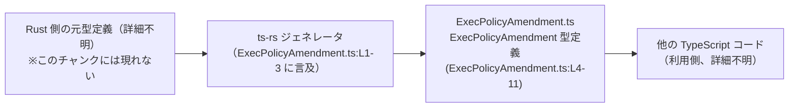
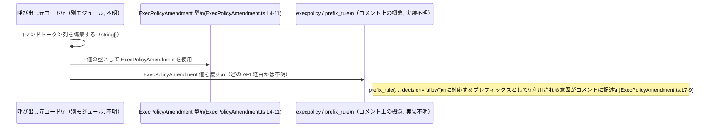

# app-server-protocol/schema/typescript/ExecPolicyAmendment.ts コード解説

## 0. ざっくり一言

`ExecPolicyAmendment` 型は、**「特定のコマンドプレフィックスを許可するための execpolicy 変更案」** を表す、`string` の配列型エイリアスです（`ExecPolicyAmendment.ts:L4-11`）。  
ファイルは `ts-rs` によって自動生成されており、手動で編集しない前提になっています（`ExecPolicyAmendment.ts:L1-3`）。

---

## 1. このモジュールの役割

### 1.1 概要

- このモジュールは、execpolicy（実行ポリシー）の変更案を表現するために、`ExecPolicyAmendment` という **TypeScript 型エイリアス** を 1 つだけ提供します（`ExecPolicyAmendment.ts:L11`）。
- コメントによると、この配列内の `command` トークンが **「allow 決定の `prefix_rule` に追加されるコマンドプレフィックス」** を構成し、エージェントがそのプレフィックスで始まるコマンドの承認をバイパスできるようにする意図があると説明されています（`ExecPolicyAmendment.ts:L5-9`）。

> 「Proposed execpolicy change to allow commands starting with this prefix. … letting the agent bypass approval for commands that start with this token sequence.」

### 1.2 アーキテクチャ内での位置づけ

- ファイル先頭のコメントから、このファイルは [`ts-rs`](https://github.com/Aleph-Alpha/ts-rs) によって **Rust 側の型定義から生成された TypeScript スキーマファイル** であることが分かります（`ExecPolicyAmendment.ts:L1-3`）。
- このチャンクにはインポートや他モジュールへの依存は無く、**純粋に型を 1 つエクスポートするだけの定義モジュール**です（`ExecPolicyAmendment.ts:L11`）。
- 実際にこの型を利用して execpolicy を適用・更新するロジックや、Rust 側の元型定義は、このチャンクには現れません（不明）。

この関係を簡略化した依存関係図を示します。



### 1.3 設計上のポイント

コードから読み取れる設計上の特徴は次のとおりです。

- **自動生成コードであることの明示**  
  - 「GENERATED CODE! DO NOT MODIFY BY HAND!」とあり、手動編集禁止を明示しています（`ExecPolicyAmendment.ts:L1-3`）。
- **型エイリアスのみを提供**  
  - 実行時ロジック・関数・クラスは存在せず、`ExecPolicyAmendment` 型の定義のみです（`ExecPolicyAmendment.ts:L11`）。
- **意味づけはコメントで付与**  
  - コマンドトークン列が execpolicy の `prefix_rule(..., decision="allow")` に対応することがコメントで説明されています（`ExecPolicyAmendment.ts:L5-9`）。
- **状態や並行性は持たない**  
  - データ型のみであり、状態管理やスレッド・並行性に関わる処理は一切ありません。

---

## 2. 主要な機能一覧（コンポーネントインベントリー）

このファイルで提供される公開コンポーネントは 1 つです。

| 名前                   | 種別        | 役割 / 用途                                                                                           | 定義位置                               |
|------------------------|-------------|--------------------------------------------------------------------------------------------------------|----------------------------------------|
| `ExecPolicyAmendment` | 型エイリアス | execpolicy の `allow` 用 `prefix_rule` に対応するコマンドトークン列を表す `string[]` スキーマ定義 | `ExecPolicyAmendment.ts:L4-11` |

> 補足: このチャンクには関数・クラス・enum など他のコンポーネントは存在しません（不在であることは `export type` 1 つのみである点から確認できます: `ExecPolicyAmendment.ts:L11`）。

---

## 3. 公開 API と詳細解説

### 3.1 型一覧（構造体・列挙体など）

| 名前                   | 種別        | 役割 / 用途                                                                                           | TypeScript 型 | 定義位置                               |
|------------------------|-------------|--------------------------------------------------------------------------------------------------------|---------------|----------------------------------------|
| `ExecPolicyAmendment` | 型エイリアス | execpolicy の `allow` 決定を行う `prefix_rule` に相当するコマンドプレフィックス（トークン列）を表す | `Array<string>` / `string[]` | `ExecPolicyAmendment.ts:L4-11` |

**意味付け（コメントに基づく）**

- 「Proposed execpolicy change to allow commands starting with this prefix.」  
  → この配列は「あるコマンドプレフィックスに対して `allow` する execpolicy 変更案」を表します（`ExecPolicyAmendment.ts:L5`）。
- 「The `command` tokens form the prefix that would be added as an execpolicy `prefix_rule(..., decision="allow")`.」  
  → 配列中の各文字列はコマンドの「トークン」であり、その並びが `prefix_rule(..., decision="allow")` のプレフィックス部分になる、と説明されています（`ExecPolicyAmendment.ts:L7-9`）。
- 「letting the agent bypass approval for commands that start with this token sequence.」  
  → このトークン列で始まるコマンドについて、エージェントが承認なしに実行できるようになる意図があることが分かります（`ExecPolicyAmendment.ts:L8-9`）。

### 3.2 関数詳細

このファイルには **関数・メソッドは定義されていません**（`export` されているのは型エイリアスのみ: `ExecPolicyAmendment.ts:L11`）。  
したがって、詳細テンプレートを適用すべき関数はありません。

### 3.3 その他の関数

- このチャンクには、補助関数やラッパー関数も含まれていません（不在）。

---

## 4. データフロー

### 4.1 コメントに基づく典型的なデータの流れ

コメントから読み取れる範囲で、`ExecPolicyAmendment` 型値の意味的な流れを整理します。

1. 他のモジュールが `ExecPolicyAmendment` 型の値（`string[]`）を生成する（利用側コード・詳細不明）。
2. 各文字列はコマンドの「トークン」として扱われ、その並びがコマンドの **先頭プレフィックス** を表す（`ExecPolicyAmendment.ts:L7-8`）。
3. そのプレフィックスは execpolicy の `prefix_rule(..., decision="allow")` として扱われ、  
   「このトークン列で始まるコマンドは承認不要で許可される」というポリシーを構成する（`ExecPolicyAmendment.ts:L7-9`）。
4. このとき、どの関数・どのモジュールが実際に `prefix_rule` を適用するかは、このチャンクには現れていません（不明）。

これをシーケンス図として表現します（`ExecPolicyAmendment` がどこで定義されているかをラベルに明記します）。



> 注意: 上図は **コメントに書かれた意味付けに基づく概念図** です。実際の実装上の関数名・モジュール構成・呼び出し経路は、このチャンクには現れず不明です。

---

## 5. 使い方（How to Use）

ここでは、TypeScript 側で `ExecPolicyAmendment` 型をどのように利用できるかを、**型レベルの使い方** に限定して示します。  
実際の execpolicy 適用処理はこのファイルには存在しないため、あくまで「型をどう使うか」の例となります。

### 5.1 基本的な使用方法

#### 例: 特定のコマンドを許可するプレフィックスを定義する

```typescript
// ExecPolicyAmendment 型をインポートする                         // このファイルの型を利用する
import type { ExecPolicyAmendment } from "./ExecPolicyAmendment";  // 実際のパスはプロジェクト構成による

// "git status" で始まるコマンドを許可するためのプレフィックス      // コメントの説明に基づき、トークン列として表現
const gitStatusPrefix: ExecPolicyAmendment = [
    "git",    // コマンド名トークン                               
    "status", // サブコマンドトークン                              
];

// TypeScript の型安全性: 以下はコンパイルエラーになる例            // 型が string[] であることを確認できる
// const invalidPrefix: ExecPolicyAmendment = [ "git", 123 ];      // number は ExecPolicyAmendment に代入不可
```

この例から分かる点:

- `ExecPolicyAmendment` は **`string` の配列**であり、**すべての要素が文字列でなければならない** ことがコンパイル時にチェックされます。
- エディタ／IDE 上では、`ExecPolicyAmendment` を参照することで、`string[]` としての補完や型チェックが効きます。

### 5.2 よくある使用パターン

#### パターン 1: 関数の引数として受け取る

`ExecPolicyAmendment` を利用する関数側の型定義例です。実際の処理内容は、このモジュール外の責務です。

```typescript
import type { ExecPolicyAmendment } from "./ExecPolicyAmendment";

// execpolicy 変更案を受け取る関数のシグネチャ例                  // 実処理は別モジュール側
function proposeExecPolicyChange(prefix: ExecPolicyAmendment) {    // prefix は string[] として扱える
    // ここで prefix を execpolicy システムに渡すなどの処理を行う   // このファイルにはその実装は存在しない
}
```

このように、**「コマンドプレフィックスを受け取るパラメータ」** に `ExecPolicyAmendment` を使うことで、  
引数が必ず `string[]` であることを保証できます。

#### パターン 2: 複数プレフィックスの一覧を保持する

複数のプレフィックスを管理する場合、`ExecPolicyAmendment[]` を利用できます。

```typescript
import type { ExecPolicyAmendment } from "./ExecPolicyAmendment";

// 複数の allow プレフィックスをまとめて保持する                        // 2 つの ExecPolicyAmendment を配列で持つ
const allowedPrefixes: ExecPolicyAmendment[] = [
    ["git", "status"],      // git status ...
    ["docker", "ps"],       // docker ps ...
];
```

### 5.3 よくある間違い

`ExecPolicyAmendment` の型（`string[]`）に反する典型的な誤用と、その修正例です。

```typescript
import type { ExecPolicyAmendment } from "./ExecPolicyAmendment";

// 間違い例: 文字列 1 つにスペース区切りで書いてしまう
const wrong1: ExecPolicyAmendment = [
    "git status",  // NG: 1 トークンとして扱われるので、コメントの意味通りのプレフィックスにならない可能性
];

// 正しい例: コメントに従い、トークンごとに分割する
const correct1: ExecPolicyAmendment = [
    "git",
    "status",
];

// 間違い例: number を混ぜる（コンパイルエラーになる）
const wrong2: ExecPolicyAmendment = [
    "git",
    // 123, // コンパイルエラー: number は ExecPolicyAmendment には代入できない
];

// 間違い例: null や undefined を含める（型レベルで弾かれる）
const wrong3: ExecPolicyAmendment = [
    "git",
    // null,       // コンパイルエラー
    // undefined,  // コンパイルエラー
];
```

> コメント中で「`command` tokens form the prefix」とあるため、  
> **「トークンごとに配列要素を分ける」ことが意図されている** と解釈できます（`ExecPolicyAmendment.ts:L7-8`）。  
> ただし、具体的にどのような文字列がトークンとして許容されるか（空文字の扱いなど）は、このチャンクには現れません。

### 5.4 使用上の注意点（まとめ）

- **配列の順序が意味を持つ**  
  - コメントにあるとおり「token sequence」として扱われるため、要素の順序がコマンドのプレフィックス順序を表します（`ExecPolicyAmendment.ts:L7-8`）。
- **配列は可変（mutable）**  
  - `Array<string>` であり、標準の JavaScript 配列と同様に `push` / `pop` / `splice` などで変更可能です。  
    他のコードと共有している場合、意図しない変更がセキュリティ上の影響を持ちうる点に注意が必要です。
- **型レベルでは文字列であることしか保証しない**  
  - 「トークンとして妥当か」「過度に広いプレフィックスになっていないか（例: 極端に短いプレフィックス）」といったポリシー上の妥当性は、この型ではチェックされません。  
  - 承認バイパスに関わる情報であることがコメントから読み取れるため（`ExecPolicyAmendment.ts:L8-9`）、**利用側でのバリデーションが重要**です。  
    ただし具体的な制約は、このチャンクからは分かりません。

---

## 6. 変更の仕方（How to Modify）

### 6.1 新しい機能を追加する場合

- ファイル先頭に「GENERATED CODE! DO NOT MODIFY BY HAND!」とあるため（`ExecPolicyAmendment.ts:L1-3`）、  
  **この TypeScript ファイルに直接機能や型を追記することは前提に反します**。
- `ExecPolicyAmendment` の構造に変更を加えたい場合は、コメント中にあるとおり `ts-rs` の生成元である **Rust 側の型定義や ts-rs の設定を変更する必要があります**。  
  ただし、このチャンクには「どの Rust ファイル・どの型から生成されているか」の情報は現れないため、**具体的な変更手順は不明**です。

### 6.2 既存の機能を変更する場合

`ExecPolicyAmendment` の型を変更する場合の注意点を、コードから読み取れる範囲で整理します。

- **型の意味（契約）**  
  - コメントにより、「execpolicy の allow 用 prefix_rule に対応する command token sequence」という意味付けがされています（`ExecPolicyAmendment.ts:L5-9`）。
  - 型を `string[]` 以外に変更したり、構造を複雑化すると、この契約に依存している外部コードへの影響が大きくなります。
- **生成コードであること**  
  - TypeScript 側で直接編集しても、次回 `ts-rs` 実行時に上書きされる可能性があります（`ExecPolicyAmendment.ts:L1-3`）。  
    そのため、**変更は必ず生成元（Rust 側 + ts-rs 設定）で行う必要があります**。
- **影響範囲**  
  - このチャンクだけでは `ExecPolicyAmendment` を使用している箇所は特定できないため、変更前にはリポジトリ全体での `ExecPolicyAmendment` の参照箇所を検索し、影響範囲を確認する必要があります（呼び出し側コードはこのチャンクには現れません）。

---

## 7. 関連ファイル

このチャンクから確実に分かる関連は「ts-rs による生成元が存在する」ことのみです。

| パス / 名称                                   | 役割 / 関係                                                                                                                |
|----------------------------------------------|----------------------------------------------------------------------------------------------------------------------------|
| Rust 側の ts-rs 元型定義ファイル（パス不明） | コメントより、このファイルが `ts-rs` によって自動生成されていることが分かります（`ExecPolicyAmendment.ts:L1-3`）。生成元となる Rust の型定義やファイルパスは、このチャンクには現れません。 |
| 他の `schema/typescript` 配下のファイル群（不明） | ディレクトリパスから、同様に ts-rs が生成した TypeScript スキーマが複数存在する可能性がありますが、具体的なファイルはこのチャンクには現れません。 |

---

## 補足: 安全性・エッジケース・セキュリティの観点（この型に関する契約）

コードとコメントから読み取れる契約・エッジケースを整理します。

- **契約（Contract）**
  - `ExecPolicyAmendment` は「コマンドトークン列で表現されるプレフィックス」を `string[]` として保持する型である（`ExecPolicyAmendment.ts:L7-8`）。
  - そのプレフィックスは execpolicy の `prefix_rule(..., decision="allow")` に対応する（`ExecPolicyAmendment.ts:L7-9`）。
- **エッジケース**
  - 空配列 `[]` や、極端に短い配列（例: 1 トークンのみ）がどう扱われるかは、このチャンクには現れません。  
    ただし、コメントから「approval bypass」に関与することが分かるため（`ExecPolicyAmendment.ts:L8-9`）、利用側のロジックではこれらを慎重に扱う必要があります。
  - トークンとして空文字や空白を含む文字列を許容するかどうかも、このチャンクからは分かりません。
- **セキュリティ**
  - コメントに「bypass approval」とあるように（`ExecPolicyAmendment.ts:L8-9`）、この型の値は **承認フローを迂回してコマンドを許可する範囲の指定** に関わる情報です。  
    したがって、利用側の実装では:
    - どのユーザー・コンポーネントが `ExecPolicyAmendment` を設定できるか
    - どのようなバリデーションを行うか
    などを慎重に設計する必要があります。  
  - ただし、それらの実装や制約はこのチャンクには現れません。

以上が、`ExecPolicyAmendment.ts` に基づき、このモジュールを安全に理解・利用するための解説です。
