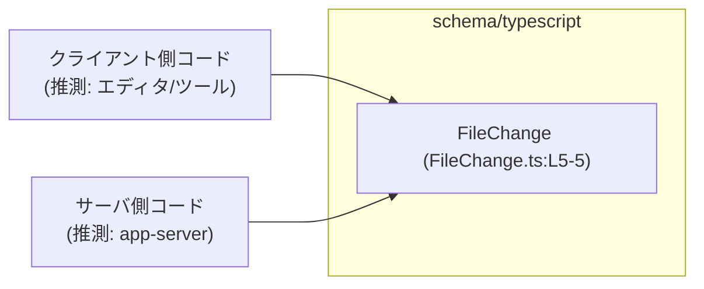
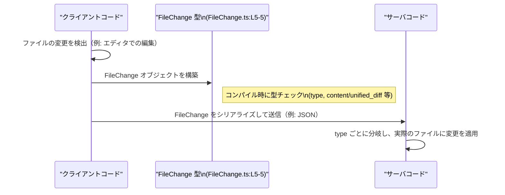

# app-server-protocol/schema/typescript/FileChange.ts

## 0. ざっくり一言

`FileChange` 型は、ファイルに対する「追加」「削除」「更新」のいずれかの変更内容を表現する TypeScript の判別ユニオン（discriminated union）型です（`FileChange.ts:L5-5`）。  
このファイル自体は `ts-rs` により自動生成されたもので、手動での編集は禁止されています（`FileChange.ts:L1-3`）。

---

## 1. このモジュールの役割

### 1.1 概要

- このモジュールは、ファイルの変更を表現するための **1 つの公開型 `FileChange`** を提供します（`FileChange.ts:L5-5`）。
- 変更種別は `"add" | "delete" | "update"` の 3 種類で、`type` プロパティで区別される判別ユニオンになっています（`FileChange.ts:L5-5`）。
- コメントにより、このファイルが `ts-rs` によって生成されたこと、手動で編集すべきでないことが明示されています（`FileChange.ts:L1-3`）。

### 1.2 アーキテクチャ内での位置づけ

このファイルには他モジュールの `import` / `export` がなく、依存関係はコード上からは読み取れません（`FileChange.ts:L1-5`）。  
ただしパス `app-server-protocol/schema/typescript` と型名 `FileChange` から、**アプリケーションサーバーとのプロトコルにおける「ファイル変更」メッセージの型**として利用されることが想定されますが、これは名前からの推測であり、このファイル単独からは断定できません。

想定される位置づけイメージを Mermaid で示します（`FileChange` 定義行の範囲を明記）。



> 上記の「クライアント」「サーバ」は、このファイル名とディレクトリ名からの一般的な想定であり、このチャンク内のコードからは存在を確認できません。

### 1.3 設計上のポイント

コードから読み取れる特徴は次の通りです。

- **自動生成コード**  
  - 冒頭コメントで `GENERATED CODE! DO NOT MODIFY BY HAND!` とあり（`FileChange.ts:L1-1`）、`ts-rs` により生成されたことが明示されています（`FileChange.ts:L3-3`）。
  - 手動編集すると、生成元と不整合になる可能性があります。
- **状態を持たないデータキャリア**  
  - 関数やメソッドはなく、単一の型エイリアスだけが定義されています（`FileChange.ts:L5-5`）。
  - 純粋なデータ構造として利用される想定です。
- **判別ユニオンによる型安全な分岐**  
  - `"type"` プロパティが `"add" | "delete" | "update"` のリテラル値をとることで、TypeScript の判別ユニオンとして振る舞います（`FileChange.ts:L5-5`）。
  - これにより、`switch (change.type)` のような分岐で各バリアントに応じたプロパティを型安全に扱えます。
- **エラーハンドリング・並行性**  
  - このファイルにはロジックや I/O がなく、エラーハンドリングや並行性・スレッド安全性に関するコードは存在しません（`FileChange.ts:L1-5`）。
  - 代わりに、TypeScript の型チェックによる「コンパイル時の安全性」が主な役割になります。

---

## 2. 主要な機能一覧

このモジュールの「機能」は 1 つの型定義に集約されています。

- `FileChange`: ファイルの **追加 / 削除 / 更新** のいずれか 1 つの変更内容を表す判別ユニオン型（`FileChange.ts:L5-5`）。

---

## 3. 公開 API と詳細解説

### 3.1 型一覧（構造体・列挙体など）

| 名前        | 種別                             | 役割 / 用途                                                                 | 定義位置                     |
|-------------|----------------------------------|------------------------------------------------------------------------------|------------------------------|
| `FileChange` | 型エイリアス（判別ユニオン型） | ファイルに対する「add / delete / update」いずれか 1 つの変更内容を表現する | `FileChange.ts:L5-5` |

### 3.2 型 `FileChange` の詳細

```ts
export type FileChange =
  { "type": "add", content: string, } |
  { "type": "delete", content: string, } |
  { "type": "update", unified_diff: string, move_path: string | null, };
```

（`FileChange.ts:L5-5`）

#### 概要

- `FileChange` は 3 通りの形のいずれかをとる **判別ユニオン型** です。
- 各バリアントは共通して `"type"` プロパティを持ち、文字列リテラル `"add"`, `"delete"`, `"update"` のいずれかで識別されます（`FileChange.ts:L5-5`）。
- バリアントごとに利用できるプロパティが異なります。

#### バリアントとフィールド

| バリアント (`type`) | フィールド名      | 型                | 説明 / 備考 |
|---------------------|-------------------|-------------------|-------------|
| `"add"`             | `content`         | `string`          | 追加されるファイル内容。意味・フォーマットの詳細はこのファイルからは不明です。（`FileChange.ts:L5-5`） |
| `"delete"`          | `content`         | `string`          | 削除対象のファイル内容。`"add"` と同名・同型ですが、意味の違いはこのファイルからは不明です。（`FileChange.ts:L5-5`） |
| `"update"`          | `unified_diff`    | `string`          | 更新内容を表現する文字列。名前からは「unified diff 形式」の差分であることが想定されますが、形式の詳細は不明です。（`FileChange.ts:L5-5`） |
| `"update"`          | `move_path`       | `string \| null`  | ファイルの移動先パスを表すと考えられる文字列または `null`。`null` がどのような意味を持つかは、このファイル単独からは読み取れません。（`FileChange.ts:L5-5`） |

> `content` が `"add"` と `"delete"` にのみ存在し、`"update"` バリアントには存在しない点が重要です。

#### TypeScript 型システム上の挙動（安全性）

- `FileChange` は **判別ユニオン** なので、`type` による分岐を行うと、TypeScript がバリアントに応じてプロパティ型を絞り込みます。
  - 例: `if (change.type === "add")` のブロック内では `change.content` は常に `string` として利用できます。
- 存在しない組み合わせ（例: `"update"` バリアントで `content` を読む）を TypeScript がコンパイル時に検出できます。
- これにより、ファイル変更処理の分岐ロジックでの取り違えを、ある程度コンパイル時に防ぐことができます。

#### Examples（使用例）

##### 例1: それぞれのバリアントを生成する

`FileChange` の各バリアントの値を生成する基本例です。

```ts
// FileChange 型をインポートする例（実際の相対パスはプロジェクト構成に依存する）
import type { FileChange } from "./FileChange";  // このファイルを指すと想定

// ファイルを新規追加する変更を表す FileChange
const addChange: FileChange = {                  // type: "add" バリアントを生成
  type: "add",                                   // 判別用の文字列リテラル
  content: "file content after adding",          // 追加されるファイル本体（文字列）
};

// ファイルを削除する変更を表す FileChange
const deleteChange: FileChange = {              // type: "delete" バリアントを生成
  type: "delete",                               // 判別用
  content: "file content before deletion",      // 削除対象内容（意味はコードからは不明）
};

// ファイルを更新する変更を表す FileChange
const updateChange: FileChange = {              // type: "update" バリアントを生成
  type: "update",                               // 判別用
  unified_diff: "@@ -1,2 +1,2 @@\n-old\n+new", // 名前から unified diff 形式と推測される文字列
  move_path: null,                              // パス移動なしを表すと考えられる null
};
```

> import パスは、このファイル以外の情報がないため例示的なものです。

##### 例2: 判別ユニオンとして安全に扱う

`type` で分岐し、バリアントごとに適切なプロパティを扱う例です。

```ts
import type { FileChange } from "./FileChange"; // FileChange 型のインポート（例）

// FileChange を受け取り、種別ごとに処理を行う関数
function applyFileChange(change: FileChange): void {    // FileChange 全体を引数に取る
  switch (change.type) {                               // 判別キーで分岐
    case "add":                                        // "add" バリアント
      // ここでは change は { type: "add"; content: string } と推論される
      console.log("Add file with content:", change.content);
      break;

    case "delete":                                     // "delete" バリアント
      // ここでは change は { type: "delete"; content: string } と推論される
      console.log("Delete file with content:", change.content);
      break;

    case "update":                                     // "update" バリアント
      // ここでは change は { type: "update"; unified_diff: string; move_path: string | null } と推論される
      console.log("Update file with diff:", change.unified_diff);
      if (change.move_path !== null) {
        console.log("Move file to:", change.move_path);
      }
      break;
  }
}
```

- `switch` 文の各ケース内で、`change` の型が自動的に絞り込まれていることがポイントです。
- case を 1 つ書き忘れると、`noImplicitReturns` や `--strict` 設定によってはコンパイラが警告・エラーを出すような書き方も可能です（これは TypeScript 全般の話で、このファイル固有の設定は不明です）。

#### Errors / Panics

このファイルには関数実装や実行時ロジックがないため、「実行時エラー」や「panic」のようなものは記述されていません（`FileChange.ts:L1-5`）。  
TypeScript の観点で起こりうるのは **コンパイル時エラー** です。

- コンパイル時エラーになりうるケース:
  - `type` に `"add" | "delete" | "update"` 以外の文字列を指定した場合（`FileChange.ts:L5-5`）。
  - `"add" / "delete"` で `content` を省略したり、`string` 以外を指定した場合（`FileChange.ts:L5-5`）。
  - `"update"` で `unified_diff` や `move_path` を欠落させた場合、または `move_path` に `string` / `null` 以外を指定した場合（`FileChange.ts:L5-5`）。
- ランタイムでは、型注釈を破って `any` 経由で不正な構造を渡した場合などに、利用側コードで `undefined` アクセス等のエラーが発生し得ますが、そのような利用例はこのファイルには現れていません。

#### Edge cases（エッジケース）

`FileChange` 型に関する代表的なエッジケースおよび注意点です。

- **バリアントごとのプロパティ差**  
  - `"update"` バリアントには `content` が存在しません（`FileChange.ts:L5-5`）。  
    `FileChange` 全体を受け取る関数で、`change.content` に直接アクセスするとコンパイルエラーになります。
- **`move_path` が `null` のケース**  
  - `move_path` は `string | null` です（`FileChange.ts:L5-5`）。
  - `null` の意味（「移動なし」等）はこのファイルからは明示されていませんが、利用側では `null` チェックを行う必要があります。
- **`content` や `unified_diff` の中身**  
  - `content` や `unified_diff` がどの文字コード / フォーマットを前提としているか（例: UTF-8 テキストかバイナリか）は、このファイルからは分かりません。
  - 利用側で長大な文字列を扱う可能性がありますが、サイズ制限等の情報も存在しません。
- **将来的なバリアント追加**  
  - この型は判別ユニオンなので、生成元（Rust 側と推測されます）で新バリアントが追加されると、TypeScript 側の `switch` 分岐がコンパイルエラーになるケースがあります（`never` チェックなどを行った場合）。  
    これは一般的な TypeScript の挙動であり、このファイルにそのようなコードは含まれていません。

#### 使用上の注意点

- **必ず `type` で分岐する**  
  - `FileChange` を扱う関数では、`change.type` による分岐でバリアントを特定してから、各プロパティにアクセスすることが前提です。
- **手動での編集禁止**  
  - 冒頭コメントに「GENERATED CODE! DO NOT MODIFY BY HAND!」と明記されており（`FileChange.ts:L1-3`）、手動編集は避ける必要があります。
  - 型の変更が必要な場合、生成元（Rust 側）を変更して `ts-rs` により再生成することが一般的です（これはコメントの `ts-rs` からの一般的な推測です）。
- **`any` での型崩しに注意**  
  - `FileChange` を `any` にキャストして扱うと、判別ユニオンによる安全性が失われます。
  - 可能な限り `FileChange` 型を維持し、TypeScript の型チェックを活用することが安全です。
- **マルチスレッド・並行性**  
  - この型自体は単なるデータ構造であり、並行性やスレッド安全性に関する制約は TypeScript レベルでは特にありません。
  - 実際の並行処理（Web Worker・Node.js の並列処理など）は、この型を使う側のコードで決まります。

### 3.3 その他の関数

- このファイルには関数やメソッド定義は存在しません（`FileChange.ts:L1-5`）。

---

## 4. データフロー

このファイルには実際のデータフローを示すコードは含まれていませんが（`FileChange.ts:L1-5`）、`FileChange` 型の典型的な利用パターンとして、「クライアントで差分を検出 → `FileChange` に変換 → サーバに送信 → サーバで適用」という流れが想定されます。  
以下は、あくまで一般的な利用イメージです。



> クライアントやサーバの具体的な実装はこのチャンクには含まれていないため、図は概念的なものです。

---

## 5. 使い方（How to Use）

### 5.1 基本的な使用方法

`FileChange` を受け取り、種別ごとに処理する基本フローの例です。

```ts
// FileChange 型をインポートする（相対パスはプロジェクト構成次第）
import type { FileChange } from "./FileChange";  // このファイルを参照する想定

// FileChange を適用する関数の例
function handleChange(change: FileChange): void {       // FileChange を 1 件受け取る
  switch (change.type) {                               // type でバリアントを判別
    case "add":                                        // ファイル追加
      // change は { type: "add"; content: string }
      console.log("Add new file:", change.content);    // 追加内容を利用
      break;

    case "delete":                                     // ファイル削除
      // change は { type: "delete"; content: string }
      console.log("Delete file:", change.content);     // 削除対象に応じた処理
      break;

    case "update":                                     // ファイル更新
      // change は { type: "update"; unified_diff: string; move_path: string | null }
      console.log("Apply diff:", change.unified_diff); // 差分情報を利用
      if (change.move_path !== null) {                 // パス移動がある場合だけ処理
        console.log("Move file to:", change.move_path);
      }
      break;
  }
}
```

このように、`FileChange` をメインの処理関数の引数として受け取り、`type` をキーに処理を分岐するのが基本的な使い方です。

### 5.2 よくある使用パターン

#### パターン1: 変更のバッチ処理

複数の `FileChange` をまとめて扱う例です。

```ts
import type { FileChange } from "./FileChange";

// FileChange の配列を順に適用する処理
function applyChanges(changes: FileChange[]): void {          // 複数変更を受け取る
  for (const change of changes) {                             // 1 件ずつ処理
    handleChange(change);                                     // 上の handleChange を再利用
  }
}
```

- `FileChange[]` のように配列で扱うことで、変更のバッチ適用などが可能になります。

#### パターン2: バリアントごとのフィルタリング

特定の種別のみをまとめて処理したい場合の例です。

```ts
import type { FileChange } from "./FileChange";

// "add" だけを抽出して処理する例
function handleOnlyAdds(changes: FileChange[]): void {
  const adds = changes.filter((c): c is Extract<FileChange, { type: "add" }> => {
    return c.type === "add";                                  // type が "add" かどうか
  });

  for (const addChange of adds) {
    // addChange は { type: "add"; content: string } と絞り込まれている
    console.log("Only add:", addChange.content);
  }
}
```

- `Extract` ユーティリティ型を使うことで、判別ユニオンから特定バリアントのみを抽出できます。

### 5.3 よくある間違い

#### 間違い例: バリアントを判別せずにプロパティへアクセス

```ts
import type { FileChange } from "./FileChange";

function incorrect(change: FileChange) {
  // 間違い例: 直接 content にアクセスしている
  // "update" バリアントには content が存在しないためコンパイルエラーになる
  console.log(change.content);              // ❌ error: Property 'content' does not exist on type 'FileChange'
}
```

#### 正しい例: `type` で絞り込んでからアクセス

```ts
import type { FileChange } from "./FileChange";

function correct(change: FileChange) {
  if (change.type === "add" || change.type === "delete") {
    // ここでは change は { type: "add" | "delete"; content: string } と推論される
    console.log(change.content);           // ✅ 安全にアクセスできる
  } else {
    // ここでは change は { type: "update"; unified_diff: string; move_path: string | null }
    console.log(change.unified_diff);      // ✅ update バリアント専用のフィールドを利用
  }
}
```

### 5.4 使用上の注意点（まとめ）

- `FileChange` は **判別ユニオン** なので、`type` による分岐と組み合わせて使うことが前提です。
- バリアントごとに存在するプロパティが異なるため、判別を行わずにプロパティへアクセスしようとするとコンパイルエラーになります。
- このファイルは `ts-rs` によって自動生成されており、手動で編集すると生成元と不整合が生じる可能性があります（`FileChange.ts:L1-3`）。
- 型定義のみで、I/O や並行処理は含まれないため、性能やスレッド安全性はこの型を利用する側のコードに依存します。

---

## 6. 変更の仕方（How to Modify）

### 6.1 新しい機能を追加する場合

このファイルは自動生成コードであるため（`FileChange.ts:L1-3`）、**直接編集して新しいプロパティやバリアントを追加することは推奨されません**。

一般的な運用として考えられる手順は次の通りです（コメントの `ts-rs` に基づく一般的な推測です）。

1. **生成元の定義を変更する**
   - `ts-rs` は通常、Rust 側の型定義（struct や enum）から TypeScript 型を生成します。
   - 新しいバリアントやフィールドを追加したい場合は、Rust 側の対応する型定義を変更します。
2. **`ts-rs` による再生成を行う**
   - ビルドスクリプトやコマンドにより、TypeScript のスキーマを再生成します。
   - その結果として、本ファイルの `FileChange` 定義が更新されます。
3. **利用側コードの更新**
   - 新しいバリアントやフィールドに対応するよう、TypeScript 側の利用コード（`switch` 分岐など）を更新します。

### 6.2 既存の機能を変更する場合

- `FileChange` の既存フィールド（例: `content`, `unified_diff`, `move_path`）の意味や型を変更する場合も、**生成元である Rust 型を変更し、再生成する必要がある**と考えられます。
- 変更時の注意点:
  - `type` の文字列リテラル値を変更すると、既存の TypeScript コードがコンパイルエラーになる可能性があります。
  - フィールドの型変更（例: `string` → `string[]`）は、全ての利用箇所を更新する必要があります。
  - 判別ユニオンとして利用している `switch (change.type)` などの分岐が期待通り動作するか確認することが重要です。

このファイルにはテストコードや利用箇所への参照が含まれていないため、**どのテスト・モジュールに影響するかは、このチャンクだけでは分かりません**。

---

## 7. 関連ファイル

このファイル内には他ファイルへの `import` / `export` が存在せず（`FileChange.ts:L1-5`）、直接の関連ファイルはコード上からは特定できません。

| パス | 役割 / 関係 |
|------|------------|
| 不明 | このチャンクには `FileChange` を利用するコードや、生成元となる Rust ファイルへのパスが現れないため、関連ファイルは特定できません。 |

---

## 付記: Bugs / Security / Tests などについて

- **Bugs（バグの可能性）**  
  - このファイルは型定義のみであり、アルゴリズムやロジックが存在しないため、挙動上のバグはここからは読み取れません。
  - 生成プロセスや生成元と不整合がある場合には問題が起こりえますが、それは別ファイル・別ツールの領域です。
- **Security（セキュリティ）**  
  - この型自体はデータ構造であり、セキュリティ問題（SQL インジェクション等）に直結する処理は含みません。
  - ただし、`content` や `unified_diff` が外部入力であれば、利用側でバリデーションやサイズ制限が必要になる可能性があります（このファイルからは外部入力かどうかは不明です）。
- **Tests（テスト）**  
  - テストコードはこのチャンクには現れておらず、`FileChange` の利用に対するテスト戦略は不明です。
  - 一般的には、`FileChange` を生成・シリアライズ・逆シリアライズしても意味が変わらないこと、全バリアントが正しく処理されることをテストすることが考えられます。
