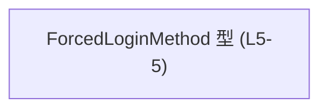
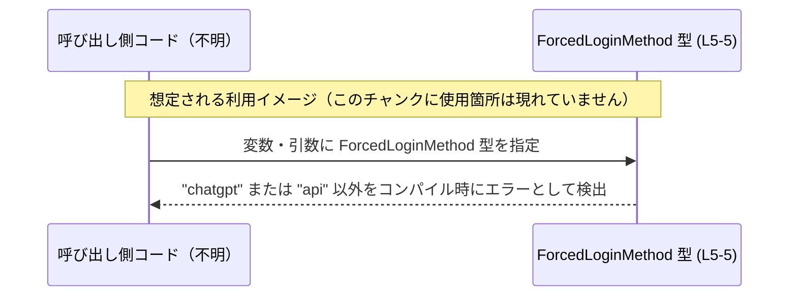

# app-server-protocol/schema/typescript/ForcedLoginMethod.ts コード解説

---

## 0. ざっくり一言

- 強制ログイン方法を表す **文字列リテラルのユニオン型** `ForcedLoginMethod` を 1 つだけ定義している、自動生成の TypeScript 型定義ファイルです（`ForcedLoginMethod.ts:L1-5`）。

---

## 1. このモジュールの役割

### 1.1 概要

- このモジュールは、`ForcedLoginMethod` という名前の **文字列リテラル型エイリアス** を提供します（`ForcedLoginMethod.ts:L5-5`）。
- コメントにより、`ts-rs` によって自動生成されたファイルであり、手動で編集しないことが明示されています（`ForcedLoginMethod.ts:L1-3`）。
- 型の定義内容から、`"chatgpt"` または `"api"` のいずれかだけを取る「列挙的な文字列型」として扱うことができます。

### 1.2 アーキテクチャ内での位置づけ

- このファイルには `import` や他モジュール参照が一切なく、**依存先モジュールは現れていません**（`ForcedLoginMethod.ts:L1-5`）。
- 一方で `export type` によって公開されているため、**他のモジュールから参照されるための型定義**であることが分かります（`ForcedLoginMethod.ts:L5-5`）。
- ファイル先頭コメントから、`ts-rs` による自動生成物として、上位のスキーマ定義（生成元）は別の場所に存在すると読み取れます（ただし、その位置はこのチャンクからは不明です）。

Mermaid による簡易依存関係図（このチャンクに現れる情報のみ）:



> この図は、「このファイル内で定義されている公開要素は `ForcedLoginMethod` 型だけである」ことを表します。他モジュールとの関係は、このチャンクには現れていません。

### 1.3 設計上のポイント

- **自動生成ファイル**  
  - 先頭コメントで `GENERATED CODE` であること、`ts-rs` により生成されたこと、手動編集禁止であることが明示されています（`ForcedLoginMethod.ts:L1-3`）。
- **閉じた値の集合を表す文字列ユニオン**  
  - `ForcedLoginMethod` は `"chatgpt" | "api"` という 2 つの文字列だけを許容する **文字列リテラルユニオン型** として定義されています（`ForcedLoginMethod.ts:L5-5`）。
- **状態やロジックを持たない**  
  - 関数・クラス・変数定義は存在せず、**実行時ロジックや状態を持たない純粋な型定義**です（`ForcedLoginMethod.ts:L1-5`）。
- **エラー・並行性の懸念がない**  
  - 実行時処理がないため、このファイル単体には **ランタイムエラーや並行性に関する挙動は存在しません**。

---

## 2. 主要な機能一覧

このファイルが提供する機能は 1 つだけです。

- `ForcedLoginMethod` 型定義: `"chatgpt"` または `"api"` のいずれかを取る文字列リテラルユニオン型。

---

## コンポーネントインベントリー（このチャンク）

このチャンク（ファイル）に現れる型・関数などの一覧です。

| 名前                | 種別                         | 役割 / 用途                                           | 定義位置                          |
|---------------------|------------------------------|--------------------------------------------------------|-----------------------------------|
| `ForcedLoginMethod` | 型エイリアス（ユニオン型）   | `"chatgpt"` または `"api"` の 2 値に限定した文字列型 | `ForcedLoginMethod.ts:L5-5`      |

> 関数・クラス・列挙体などはこのチャンクには存在しません。

---

## 3. 公開 API と詳細解説

### 3.1 型一覧（構造体・列挙体など）

| 名前                | 種別                         | 役割 / 用途                                           | 許容される値                      | 定義位置                     |
|---------------------|------------------------------|--------------------------------------------------------|-----------------------------------|------------------------------|
| `ForcedLoginMethod` | 型エイリアス（ユニオン型）   | 強制ログイン方法を示す、2 値限定の文字列型           | `"chatgpt"` \| `"api"`            | `ForcedLoginMethod.ts:L5-5` |

- **型の意味（コードから読み取れる範囲）**  
  - 名前 `ForcedLoginMethod` から、「何らかの強制ログインの方法」を表す型として設計されていると解釈できます（命名に基づく推測であり、用途はこのチャンクからは断定できません）。
  - 型定義そのものは `"chatgpt"` または `"api"` の 2 つの文字列リテラルを許容することだけを保証します（`ForcedLoginMethod.ts:L5-5`）。

#### 使用イメージ（例）

以下は、この型を利用する際の典型的なコード例です（実際のプロジェクト構成はこのチャンクからは分からないため、インポートパスは例示です）。

```typescript
// 強制ログイン方法を型安全に扱うために ForcedLoginMethod 型を使用する例

// 仮のインポート例: 実際のパスはプロジェクト構成によって異なる
import type { ForcedLoginMethod } from "./ForcedLoginMethod";

// 変数に型を付けて宣言する
const method: ForcedLoginMethod = "chatgpt";     // OK: 許容される値
// const invalid: ForcedLoginMethod = "web";     // コンパイルエラー: "web" は許容されていない
```

### 3.2 関数詳細（最大 7 件）

- **このファイルには関数が定義されていません**（`ForcedLoginMethod.ts:L1-5`）。
- したがって、関数ごとの詳細解説（引数・戻り値・内部処理・エラー・エッジケース）は対象外です。

### 3.3 その他の関数

| 関数名 | 役割（1 行） |
|--------|--------------|
| なし   | このファイルには関数定義は存在しません |

---

## 4. データフロー

このファイル単体には、関数やメソッドが存在せず、データの流れを直接表すコードはありません（`ForcedLoginMethod.ts:L1-5`）。  
そのため、**厳密な意味での「実装上のデータフロー」はこのチャンクには現れていません。**

ここでは、**型 `ForcedLoginMethod` がどのように利用されるかの概念的なイメージ**を示します。  
（※実際の呼び出し元モジュールや処理内容は、このチャンクからは分からないため、あくまで想定例であることに注意してください。）



- **要点**
  - `ForcedLoginMethod` は **コンパイル時の型チェックにのみ関与**し、実行時の処理フローはこのファイルからは読み取れません。
  - 実行時にはどちらの文字列が選ばれるか、そこからどのような処理が走るかは、すべて別ファイル側の責務です（このチャンクには現れません）。

---

## 5. 使い方（How to Use）

### 5.1 基本的な使用方法

この型の主な使い方は、「強制ログイン方法」を受け取る・格納する変数やプロパティに **静的な型制約**を与えることです。

```typescript
// 仮のインポート例
import type { ForcedLoginMethod } from "./ForcedLoginMethod";

// 1. 変数に対する型注釈
const defaultMethod: ForcedLoginMethod = "api";   // OK

// 2. 関数の引数として利用
function setForcedLogin(method: ForcedLoginMethod) {  // method は "chatgpt" か "api"
    // 実装例（このファイルには存在しない想定コード）
    console.log("Forced login method:", method);
}

// 正しい呼び出し例
setForcedLogin("chatgpt");  // OK

// 間違い例（コンパイルエラー）
// setForcedLogin("web");    // Error: Type '"web"' is not assignable to type 'ForcedLoginMethod'.
```

- TypeScript の静的型チェックにより、 `"chatgpt"` または `"api"` 以外の文字列は **コンパイル時に弾かれます**。
- 実行時には単なる文字列ですが、**IDE の補完や型チェックによる安全性向上**が期待できます。

### 5.2 よくある使用パターン

1. **設定オブジェクトのプロパティとして使う**

```typescript
import type { ForcedLoginMethod } from "./ForcedLoginMethod";

interface ForcedLoginConfig {
    method: ForcedLoginMethod;   // 設定値に型を付ける
}

const config: ForcedLoginConfig = {
    method: "chatgpt",           // OK
    // method: "other",          // コンパイルエラー
};
```

1. **分岐処理の条件に利用する**

```typescript
import type { ForcedLoginMethod } from "./ForcedLoginMethod";

function handleForcedLogin(method: ForcedLoginMethod) {
    switch (method) {
        case "chatgpt":
            // "chatgpt" 用の処理
            break;
        case "api":
            // "api" 用の処理
            break;
        default:
            // `ForcedLoginMethod` 型により、ここには到達しない想定
            const _exhaustiveCheck: never = method;
            return _exhaustiveCheck;
    }
}
```

- 上記のような `switch` + `never` チェックにより、将来 `ForcedLoginMethod` に値が追加された場合に **コンパイル時に分岐漏れが検出できる**構造を作ることができます。

### 5.3 よくある間違い

```typescript
import type { ForcedLoginMethod } from "./ForcedLoginMethod";

// 間違い例 1: 型を付けずに利用する
let method = "chatgpt";          // 型推論: string
method = "unknown";              // コンパイル OK だが、意図しない値が入る可能性がある

// 正しい例: ForcedLoginMethod 型を明示する
let safeMethod: ForcedLoginMethod = "chatgpt";
// safeMethod = "unknown";       // コンパイルエラー
```

```typescript
// 間違い例 2: 自動生成ファイルを直接編集しようとする

// ForcedLoginMethod.ts を開いて値を追加する（NG）
// export type ForcedLoginMethod = "chatgpt" | "api" | "other"; // ← コメントに反する

// 正しい方針（概念レベル）
// - このファイルは "GENERATED CODE" であり、ts-rs によって生成される（L1-3）。
// - 値を追加したい場合は、生成元のスキーマ定義側を修正し、ts-rs により再生成する必要がある。
```

### 5.4 使用上の注意点（まとめ）

- **自動生成ファイルを直接編集しない**  
  - 先頭コメントに `Do not edit this file manually.` と明記されています（`ForcedLoginMethod.ts:L1-3`）。
  - 仕様変更（値の追加・削除など）が必要な場合は、ts-rs の生成元定義を変更し、再生成する必要があります。
- **実行時の検証は別途必要**  
  - TypeScript の型はコンパイル時のみ有効であり、実行時に外部から `"chatgpt"` 以外の文字列が入ってくる可能性があります。
  - セキュリティ・堅牢性の観点では、**サーバー側やランタイムでの入力値チェック**が必須です。
- **並行性の問題は存在しない**  
  - このファイルは型定義のみであり、スレッド・イベントループ・共有状態などを扱っていないため、**並行性・スレッドセーフティに関する懸念はありません**。
- **契約（Contract）の意味**  
  - `ForcedLoginMethod` 型を引数やプロパティに付けることで、「ここには `"chatgpt"` または `"api"` のいずれかだけが入る」という契約を表現します。
  - この契約はコンパイル時に検査されますが、実行時の整合性は別途保証する必要があります。

---

## 6. 変更の仕方（How to Modify）

### 6.1 新しい機能を追加する場合

このファイルは自動生成であり、コメントにより手動編集禁止であることが明記されています（`ForcedLoginMethod.ts:L1-3`）。  
そのため、ここに「新しい機能（値）を直接追加する」ことは想定されていません。

**一般的な変更手順（概念レベル）**:

1. **生成元のスキーマ定義を特定する**  
   - コメントに `ts-rs` が示されているため、この TypeScript 型は ts-rs の生成元（おそらく別言語で書かれた型定義）に対応しています（`ForcedLoginMethod.ts:L1-3`）。
   - 生成元の型定義がどこにあるかは、このチャンクからは分かりません。

2. **生成元型に新しい値を追加・変更する**  
   - 例: 強制ログイン方法を増やしたい場合は、生成元の列挙や型定義に値を追加します。

3. **ts-rs による再生成を実行する**  
   - プロジェクト固有のビルド・コード生成手順に従い、このファイルを含む TypeScript スキーマを再生成します。

4. **利用箇所のコンパイルエラーを確認する**  
   - 新しい値が追加された結果、`switch` 文の分岐漏れなどが発生していないか確認します。

### 6.2 既存の機能を変更する場合

`ForcedLoginMethod` の値を変更・削除する場合、以下の点に注意が必要です。

- **影響範囲の確認**
  - このファイル自体からは利用箇所は分かりませんが、`ForcedLoginMethod` 型を参照している全てのコードが影響を受ける可能性があります。
  - 特に `switch` 文や条件分岐で `"chatgpt"` / `"api"` を前提にしている箇所はコンパイルエラーやロジックの変更が発生します。

- **契約の変更**
  - 型から `"api"` を削除するなどの変更は、「許容される値の集合」という契約を変更することになります。
  - 生成元スキーマとの整合性を保つことが重要です。

- **テスト**
  - このファイルにテストは含まれていませんが、利用側のテストで `ForcedLoginMethod` の値を前提にしたケースを再確認する必要があります。

---

## 7. 関連ファイル

このチャンクには、具体的な関連ファイルのパスは現れていません。  
自動生成元や利用側コードはプロジェクト内の別ファイルに存在すると考えられますが、位置は不明です。

| パス      | 役割 / 関係                                                                 |
|-----------|------------------------------------------------------------------------------|
| （不明）  | このチャンクには、`ForcedLoginMethod` を利用・生成する他ファイルの情報はありません |

---

### Bugs / Security / Contracts / Edge Cases（このファイルに関する要点）

- **Bugs**
  - ファイル自体は単純な型定義のみであり、構文上も `"chatgpt" | "api"` という定義しかないため、内部にバグとなるロジックは存在しません（`ForcedLoginMethod.ts:L5-5`）。
  - 潜在的な問題は、「生成元スキーマとこの型定義の不整合」や、「利用側がこの型の前提と異なる値を扱う」など、**外部との整合性に依存**します。

- **Security**
  - この型はコンパイル時のみ有効であり、外部からの入力（HTTP リクエストなど）に対して実行時の制約を課すものではありません。
  - セキュリティ上重要な判断をこの値に基づいて行う場合でも、**実行時のバリデーションは別途実装する必要があります**。

- **Contracts / Edge Cases**
  - 契約: `ForcedLoginMethod` 型には `"chatgpt"` または `"api"` 以外の値は入らない、という静的契約を表現します。
  - 空文字列、`null`、`undefined` などは `ForcedLoginMethod` には代入できません（代入しようとするとコンパイルエラーになります）。
  - 実行時に不正な値を受け取った場合の挙動は、このファイルでは定義されておらず、利用側のコードに依存します。

- **Performance / Scalability / Observability**
  - 型定義のみであり、実行時に CPU・メモリ・I/O などの負荷を追加しません。
  - ログ出力やメトリクスといった観測性に関する要素も、このファイルには存在しません。
