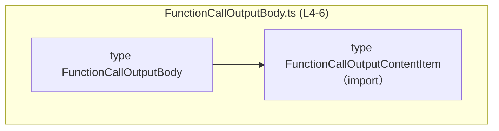
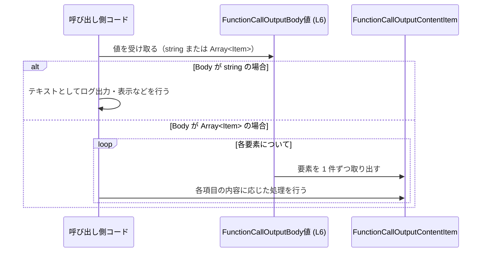

# app-server-protocol/schema/typescript/FunctionCallOutputBody.ts

## 0. ざっくり一言

`FunctionCallOutputBody` は、**関数呼び出しの出力ボディを文字列またはコンテンツ要素の配列として表現するための TypeScript 型エイリアス**です（自動生成コード）。

---

## 1. このモジュールの役割

### 1.1 概要

- このモジュールは、関数呼び出しの「出力内容」を表現する **共通の型** を提供します。
- 出力は
  - 単純なテキスト（`string`）
  - 構造化された要素の配列（`FunctionCallOutputContentItem[]`）
  のいずれかとして表されます（`FunctionCallOutputBody.ts:L6-6`）。
- ファイル先頭には「自動生成コードであり手動で編集しないこと」が明記されています（`FunctionCallOutputBody.ts:L1-3`）。

### 1.2 アーキテクチャ内での位置づけ

このファイルは、TypeScript 向けのプロトコルスキーマ群（`schema/typescript` ディレクトリ）に属し、他のコードから参照される **データ型定義レイヤ** に位置づけられます。

依存関係は次のとおりです。

- 依存先
  - `./FunctionCallOutputContentItem`
    - 型 `FunctionCallOutputContentItem` を型インポートしています（`FunctionCallOutputBody.ts:L4-4`）。



この図は、本チャンク内で確認できる **型間の依存関係** のみを示しています。`FunctionCallOutputBody` をどのモジュールが利用しているかは、このチャンクからは分かりません。

### 1.3 設計上のポイント

コードから読み取れる設計上の特徴は次のとおりです。

- **自動生成コード**
  - 冒頭コメントにより、`ts-rs` による自動生成であり手動編集禁止であることが明示されています（`FunctionCallOutputBody.ts:L1-3`）。
- **状態を持たない純粋な型定義**
  - クラスや関数はなく、**型エイリアス 1 つのみ**を定義するモジュールです（`FunctionCallOutputBody.ts:L6-6`）。
- **ユニオン型による表現**
  - `string | Array<FunctionCallOutputContentItem>` という **ユニオン型** により、「テキストのみ」と「構造化コンテンツ配列」の 2 形態を 1 つの型で表現しています（`FunctionCallOutputBody.ts:L6-6`）。
- **型レベルでの安全性**
  - 呼び出し側はこの型を利用することで、「文字列として扱うパス」と「コンテンツ配列として扱うパス」をコンパイル時に区別できます。
- **エラー・並行性**
  - このファイルには関数や実行時処理がないため、**直接的なエラー処理や並行処理** は関与しません。
  - ただし、ユニオン型であるため、利用側での型ナローイング（`typeof` など）を行わないと、TypeScript の型エラーになる可能性があります。

---

## 2. 主要な機能一覧

このモジュールが提供する主要な機能（型レベルの機能）は次のとおりです。

- `FunctionCallOutputBody` 型定義: 関数呼び出しの出力ボディを  
  - プレーンテキスト（`string`）  
  - 構造化コンテンツ配列（`FunctionCallOutputContentItem[]`）  
  のいずれかとして表現するユニオン型。

---

## 3. 公開 API と詳細解説

### 3.1 型一覧（構造体・列挙体など）

このチャンクに現れる主要な型とその定義位置（行番号）です。

| 名前                           | 種別        | 役割 / 用途                                                                 | 定義位置 |
|--------------------------------|-------------|------------------------------------------------------------------------------|----------|
| `FunctionCallOutputBody`       | 型エイリアス | 関数呼び出しの出力ボディを `string` または `FunctionCallOutputContentItem[]` として表現する | `FunctionCallOutputBody.ts:L6-6` |
| `FunctionCallOutputContentItem` | 型（詳細不明） | 出力ボディを構造化して表現する 1 要素の型。ここでは配列要素として参照のみ。       | 定義ファイル・行はこのチャンクには現れません |

#### `FunctionCallOutputBody` 型の詳細

**概要**

- `FunctionCallOutputBody` は、関数呼び出し結果の「本文」を表現するユニオン型です。
- 具体的には、次のいずれかの値を取り得ます（`FunctionCallOutputBody.ts:L6-6`）。
  - `string`
  - `Array<FunctionCallOutputContentItem>`

```typescript
// FunctionCallOutputBody.ts:L6
export type FunctionCallOutputBody = string | Array<FunctionCallOutputContentItem>;
```

**意味（契約）**

- 型レベルの契約として、「`FunctionCallOutputBody` として扱われる値は必ず `string` か `FunctionCallOutputContentItem` の配列である」ことが保証されます。
- `null` や `undefined`、オブジェクトリテラル（`{ ... }`）などはこの型には含まれません。

**構造**

- `string`: テキストのみの出力を表すと解釈できますが、用途の詳細はこのチャンクからは分かりません。
- `Array<FunctionCallOutputContentItem>`: 1 要素が `FunctionCallOutputContentItem` 型である配列です。要素の具体的な構造は別ファイル側の定義に依存します。

**エッジケース（型レベルで許される値）**

- 空文字列 `""`: `string` の一種なので許可されます。
- 空配列 `[]`: `Array<FunctionCallOutputContentItem>` の一種なので許可されます。
- 大きな配列や長大な文字列も型としては許可されます。パフォーマンス面は利用側の実装次第です。
- `null` / `undefined` / 数値など: この型には含まれないため、代入しようとするとコンパイルエラーになります。

**使用上の注意点（型エイリアスとして）**

- ユニオン型なので、利用側は **必ず型チェックや型ナローイング** を行う必要があります。
  - 例: `typeof body === "string"` で文字列かどうかを判定。
  - 例: `Array.isArray(body)` で配列かどうかを判定（実行時）。
- 自動生成コードであるため、**このファイルを直接編集しない**ことが前提です（`FunctionCallOutputBody.ts:L1-3`）。
  - 変更が必要な場合は、元になっている Rust 側の型や `ts-rs` の設定を変更する必要があります（元定義の場所はこのチャンクからは不明です）。

### 3.2 関数詳細（最大 7 件）

- このファイルには **関数定義が存在しません**（`FunctionCallOutputBody.ts:L1-6` 全体を確認しても `function` / `=>` などの宣言はありません）。
- そのため、関数詳細テンプレートを適用すべき対象はありません。

### 3.3 その他の関数

- 補助関数・ラッパー関数なども、このチャンクには一切定義されていません。

---

## 4. データフロー

このモジュール自体には処理ロジックはありませんが、`FunctionCallOutputBody` がどのようにデータフローに関わるかの典型例を示します。  
以下は **利用側の一例** であり、実際のシステム構成はこのチャンクからは分かりません。

### 4.1 代表的な処理シナリオ（想定例）

- ある関数が「関数呼び出し結果」を得て、その本文部分を `FunctionCallOutputBody` 型で受け取る。
- 受け取った本文が `string` の場合は「テキスト出力」として処理する。
- 配列の場合は、各 `FunctionCallOutputContentItem` を順に処理する。



このシーケンス図では、`FunctionCallOutputBody` が **「テキスト or コンテンツ配列」** という 2 通りのフローを持ち得ることを強調しています。

---

## 5. 使い方（How to Use）

### 5.1 基本的な使用方法

`FunctionCallOutputBody` を利用する典型的なコードフローの例です。  
`FunctionCallOutputContentItem` の中身はこのチャンクからは分からないため、ここでは単純にログ出力する形にとどめます。

```typescript
// FunctionCallOutputBody 型と FunctionCallOutputContentItem 型をインポートする例
import type { FunctionCallOutputBody } from "./FunctionCallOutputBody";            // 出力ボディのユニオン型（L6）
import type { FunctionCallOutputContentItem } from "./FunctionCallOutputContentItem"; // 要素型（定義は別ファイル）

// FunctionCallOutputBody を受け取って内容を処理する関数の例
function handleOutput(body: FunctionCallOutputBody): void {                        // 引数 body が string または配列
    if (typeof body === "string") {                                               // まず typeof で文字列かどうかを判定
        console.log("Text output:", body);                                        // 文字列として処理
    } else {                                                                      // それ以外なら Array<FunctionCallOutputContentItem> とみなせる
        body.forEach((item: FunctionCallOutputContentItem, index: number) => {    // 各コンテンツ要素を順に処理
            console.log("Item", index, item);                                     // 具体的なフィールドは不明なため、そのままログ出力
        });
    }
}

// 文字列として使う例
const textBody: FunctionCallOutputBody = "simple text output";                    // string はそのまま代入可能

// 配列として使う例（構造は不明なので any として仮にキャスト）
const items: FunctionCallOutputContentItem[] = [] as FunctionCallOutputContentItem[]; // 実際は適切な値を入れる必要がある
const listBody: FunctionCallOutputBody = items;                                   // 配列も代入可能

handleOutput(textBody);                                                           // 文字列パスで処理
handleOutput(listBody);                                                           // 配列パスで処理
```

この例から分かるポイント:

- 呼び出し側は、`FunctionCallOutputBody` を受け取ったら **型ナローイング**（`typeof` など）で分岐する必要があります。
- ユニオン型のおかげで、「文字列として扱える場面」と「配列として扱える場面」がコンパイル時にチェックされます。

### 5.2 よくある使用パターン

1. **ログ・デバッグ用途で直接出力する**

   ```typescript
   function logBody(body: FunctionCallOutputBody): void {
       console.log("Raw body:", body);               // そのままログ出力。string か配列かは実行時にわかる
   }
   ```

2. **常に配列として扱いたい場合に正規化する**

   ```typescript
   function normalizeToArray(body: FunctionCallOutputBody): FunctionCallOutputContentItem[] {
       if (typeof body === "string") {
           // 文字列を 1 つのコンテンツ要素としてラップする、などの変換は
           // 実際の構造に依存するため、ここでは実装できません（このチャンクからは不明）。
           throw new Error("string から配列への正規化方法は不明です");
       } else {
           return body;                             // すでに配列であれば、そのまま返す
       }
   }
   ```

   ※ 上記は、「配列として扱いたい」パターンのイメージを示すための例であり、実際の変換ロジックは `FunctionCallOutputContentItem` の構造に依存します。

### 5.3 よくある間違い

想定される誤用例と、その修正版です。

```typescript
import type { FunctionCallOutputBody } from "./FunctionCallOutputBody";

// 誤り例: ユニオン型をナローイングせずに配列メソッドを呼び出している
function wrongUsage(body: FunctionCallOutputBody) {
    // body.push(...) はコンパイルエラー:
    // Property 'push' does not exist on type 'string | FunctionCallOutputContentItem[]'.
    //   Property 'push' does not exist on type 'string'.
    // body.push({ ... });
}

// 正しい例: typeof または Array.isArray でナローイングしてからメソッドを使う
function correctUsage(body: FunctionCallOutputBody) {
    if (Array.isArray(body)) {                       // 配列かどうかを実行時に判定
        body.push(/* FunctionCallOutputContentItem の値 */); // ここでのみ push が安全に呼べる
    } else {
        // 文字列の場合の処理
        console.log(body.toUpperCase());             // string として安全にメソッドを使える
    }
}
```

ポイント:

- **ユニオン型をそのままメソッド呼び出しに使うとコンパイルエラー**になるため、ナローイングが必須です。
- `typeof` や `Array.isArray` などの型ガードを組み合わせるのが TypeScript での一般的なパターンです。

### 5.4 使用上の注意点（まとめ）

- **必ず型ナローイングを行う**
  - `FunctionCallOutputBody` はユニオン型なので、`string` か配列かを判定せずにメソッドを呼ぶとコンパイルエラーになります。
- **`null` / `undefined` は含まれない**
  - これらを扱いたい場合は、呼び出し側の型かプロトコル定義自体を変更する必要があります。
- **大きなデータへの配慮**
  - 型としては制約がありませんが、非常に長い文字列や巨大な配列を扱うときは、メモリ使用量やシリアライズコストを考慮する必要があります（このファイルにはパフォーマンス対策コードはありません）。
- **自動生成ファイルであること**
  - 直接編集すると、生成元と不整合になったり、再生成時に変更が失われます（`FunctionCallOutputBody.ts:L1-3`）。

---

## 6. 変更の仕方（How to Modify）

### 6.1 新しい機能を追加する場合

このファイルは `ts-rs` によって自動生成されており、冒頭で「手動で編集しないこと」が明記されています（`FunctionCallOutputBody.ts:L1-3`）。  
そのため、**新しい機能やバリアントを追加したい場合の一般的な流れ**は次のようになります（推奨される方向性であり、具体的な生成設定はこのチャンクからは分かりません）。

1. **Rust 側の元定義を変更する**
   - `FunctionCallOutputBody` に対応する Rust の型（構造体あるいは enum など）を特定し、新しいバリアント（例えば別の出力表現）を追加します。
   - 元定義のファイルパスや型名はこのチャンクからは分かりませんが、`ts-rs` を使用しているプロジェクト構成に依存します。

2. **`ts-rs` による TypeScript コード再生成**
   - プロジェクトのビルドステップやスクリプトを実行し、`ts-rs` によって TypeScript ファイルを再生成します。
   - その結果として、`FunctionCallOutputBody.ts` に新しいユニオンメンバーなどが追加されます。

3. **利用側コードの更新**
   - 新しいバリアントを扱うために、`FunctionCallOutputBody` を使用している各所の **型ナローイングロジック** を更新します。
   - ナローイングが漏れると、コンパイルエラーや実行時のハンドリング漏れにつながります。

### 6.2 既存の機能を変更する場合

既存のユニオンメンバーの意味を変えたり削除したりする場合の注意点です。

- **影響範囲の確認**
  - `FunctionCallOutputBody` を参照しているファイルを検索し、すべての利用箇所を確認する必要があります。
  - 特に、`typeof body === "string"` や `Array.isArray(body)` による分岐ロジックは、ユニオンの構成が変わると見直しが必要です。

- **契約（前提条件・返り値の意味）**
  - `FunctionCallOutputBody` のユニオン構成は、プロトコルの契約の一部とみなせます。
  - 例えば `string` を削除して配列だけにするなどの変更は、呼び出し元に対する契約変更となるため、バージョニングや後方互換性に注意する必要があります。

- **テストの必要性**
  - このファイルにはテストは含まれていません。
  - 変更後は、`FunctionCallOutputBody` の値を生成・処理する上位レイヤのテストで、新旧のケースが適切に扱われているかを確認する必要があります。

---

## 7. 関連ファイル

このモジュールと密接に関係するファイル・コンポーネントです。

| パス                                                     | 役割 / 関係 |
|----------------------------------------------------------|------------|
| `app-server-protocol/schema/typescript/FunctionCallOutputContentItem.ts` | `FunctionCallOutputBody` が配列要素として参照している型の定義ファイル（`FunctionCallOutputBody.ts:L4-4` でインポート）。具体的な構造はこのチャンクには現れません。 |
| Rust 側の対応する型定義ファイル（パス不明）             | ファイル先頭コメントにより、`ts-rs` による自動生成元であることが示唆されますが（`FunctionCallOutputBody.ts:L1-3`）、実際のパスや型名はこのチャンクからは分かりません。 |

---

### コンポーネントインベントリー（このチャンクのまとめ）

最後に、このチャンクにおけるコンポーネント一覧と定義位置を再掲します。

| コンポーネント名                 | 種別        | 説明                                                                 | 根拠行番号 |
|----------------------------------|-------------|----------------------------------------------------------------------|------------|
| `FunctionCallOutputBody`         | 型エイリアス | 関数呼び出しの出力ボディを `string` または `FunctionCallOutputContentItem[]` として表現するユニオン型 | `FunctionCallOutputBody.ts:L6-6` |
| `FunctionCallOutputContentItem`  | 型（import） | `FunctionCallOutputBody` の配列要素として利用される型。定義は別ファイルに存在。 | インポート: `FunctionCallOutputBody.ts:L4-4`（定義位置はこのチャンクには現れません） |

このチャンクには実行ロジックや関数は含まれず、**型定義レイヤの最小限の構成要素**だけが提供されています。
