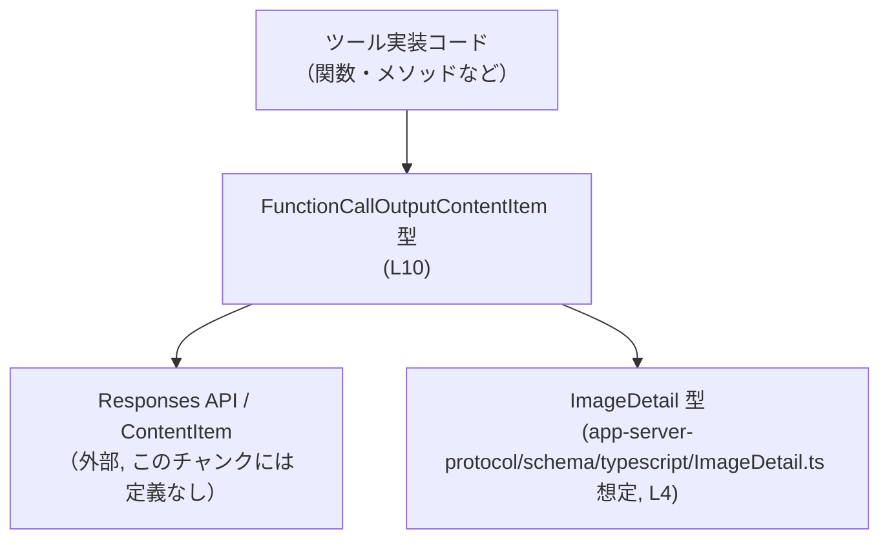
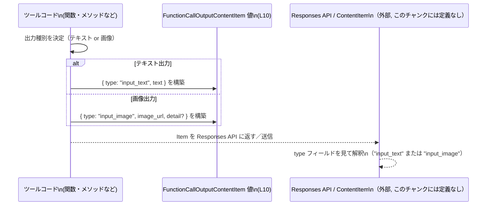

# app-server-protocol\schema\typescript\FunctionCallOutputContentItem.ts コード解説

---

## 0. ざっくり一言

`FunctionCallOutputContentItem` は、「ツール呼び出しが Responses API に返すことのできるコンテンツ」を表す **型定義（判別可能ユニオン型）** です。テキスト入力と画像入力の 2 パターンだけを許可します（`FunctionCallOutputContentItem.ts:L6-8, L10-10`）。

---

## 1. このモジュールの役割

### 1.1 概要

- このモジュールは、**ツール呼び出しが返すことのできる出力コンテンツの型** を TypeScript で表現します（コメントより `Responses API compatible ...`、`FunctionCallOutputContentItem.ts:L6-8`）。
- ContentItem 全体のうち、**ツールの関数呼び出しでサポートされる型のサブセット** のみを表します（同コメントより、`FunctionCallOutputContentItem.ts:L6-8`）。
- 実行時処理は一切含まず、**静的な型定義のみ** を提供します（型 alias のみ定義されているため、`FunctionCallOutputContentItem.ts:L10-10`）。

### 1.2 アーキテクチャ内での位置づけ

このファイルは、Responses API とツール実装の間で共有されるデータ構造を TypeScript の型として表現します。`ImageDetail` 型に依存していますが、その中身はこのチャンクには現れません（`FunctionCallOutputContentItem.ts:L4-4`）。



- `A` はツールのコードで、`FunctionCallOutputContentItem` 型の値を生成・返却します。
- `B` はこのファイルで定義されたユニオン型です（`FunctionCallOutputContentItem.ts:L10-10`）。
- `C` はコメントに現れる Responses API / ContentItem で、このチャンクには具体的な定義はありません（`FunctionCallOutputContentItem.ts:L6-8`）。
- `D` は画像詳細を表すと推測される `ImageDetail` 型で、他ファイルに定義されています（`FunctionCallOutputContentItem.ts:L4-4`）。

### 1.3 設計上のポイント

- **判別可能ユニオン（discriminated union）**  
  `type` プロパティが `"input_text"` または `"input_image"` の文字列リテラル型になっており、分岐時に型が狭まる構造です（`FunctionCallOutputContentItem.ts:L10-10`）。
- **テキストと画像の 2 形態のみを明示的に許可**  
  ユニオン型の構成要素は 2 つだけです（`FunctionCallOutputContentItem.ts:L10-10`）。
- **画像詳細はオプショナル**  
  `detail?: ImageDetail` のように `?` が付いており、存在しても存在しなくてもよい設計です（`FunctionCallOutputContentItem.ts:L10-10`）。
- **自動生成コード**  
  冒頭コメントで `GENERATED CODE! DO NOT MODIFY BY HAND!` と `ts-rs` による生成であることが明示されています（`FunctionCallOutputContentItem.ts:L1-3`）。  
  変更は手動ではなく、元スキーマ側での変更が前提になります（どこかはこのチャンクからは不明）。

---

## 2. 主要な機能一覧

このファイルは関数を持たず、**型定義のみ** を提供します。そのため「機能」はすべて型レベルの役割になります。

- `FunctionCallOutputContentItem` 型:  
  ツール呼び出しが Responses API に返すことのできる **テキストまたは画像入力コンテンツ** を表現する判別可能ユニオン型（`FunctionCallOutputContentItem.ts:L6-8, L10-10`）。
- `ImageDetail` 型への依存:  
  画像入力の詳細情報（解像度などが想定されますが、このチャンクには定義がありません）を表す型を参照します（`FunctionCallOutputContentItem.ts:L4-4`）。

---

## 3. 公開 API と詳細解説

### 3.1 型一覧（構造体・列挙体など）

| 名前 | 種別 | エクスポート | 役割 / 用途 | 定義位置 / 根拠 |
|------|------|-------------|-------------|------------------|
| `FunctionCallOutputContentItem` | 型エイリアス（判別可能ユニオン） | `export type` で公開 | ツール呼び出しが Responses API へ返すことのできるコンテンツアイテムを、「テキスト入力」または「画像入力」の 2 形態で表す | コメントと型定義より（`FunctionCallOutputContentItem.ts:L6-8, L10-10`） |
| `ImageDetail` | 型（外部定義） | このファイルからは再エクスポートされない | 画像入力の詳細情報を表す型。`FunctionCallOutputContentItem` の `detail` プロパティで使用される | `import type { ImageDetail } from "./ImageDetail";` より依存のみ確認可能（`FunctionCallOutputContentItem.ts:L4-4`） |

`FunctionCallOutputContentItem` の構造をさらに分解すると次のようになります（`FunctionCallOutputContentItem.ts:L10-10`）。

```typescript
export type FunctionCallOutputContentItem =
    { "type": "input_text",  text: string } |
    { "type": "input_image", image_url: string, detail?: ImageDetail };
```

- **`type: "input_text"` の場合**
  - `text: string` … テキスト内容。空文字も `string` 型としては許容されます。
- **`type: "input_image"` の場合**
  - `image_url: string` … 画像の URL を表す文字列。
  - `detail?: ImageDetail` … 省略可能な詳細情報。

### 3.2 関数詳細（最大 7 件）

このファイルには **関数定義が存在しません**。  
そのため、関数用テンプレートに従って詳細を解説できる対象はありません（`FunctionCallOutputContentItem.ts:L1-10` に `function` や `=>` で定義された関数が無いため）。

### 3.3 その他の関数

- このファイルには補助関数・ラッパー関数も定義されていません（`FunctionCallOutputContentItem.ts:L1-10`）。

---

## 4. データフロー

このセクションでは、ツール実装が `FunctionCallOutputContentItem` を生成し、Responses API に渡すまでの概略データフローを示します。  
実際の送信方法（HTTP / WebSocket など）はこのチャンクには現れないため、「送信」という抽象的な表現にとどめています。



要点:

- **判別キー `type` により変種が決まる**（`FunctionCallOutputContentItem.ts:L10-10`）。
- テキストか画像かにより、利用されるプロパティ（`text` / `image_url` / `detail`）が異なります。
- このファイルには、シリアライズ・I/O・非同期制御などのロジックは一切含まれていません（`FunctionCallOutputContentItem.ts:L1-10`）。  

---

## 5. 使い方（How to Use）

### 5.1 基本的な使用方法

ここでは、ツール側の TypeScript コードから `FunctionCallOutputContentItem` を生成して返す基本例を示します。  
型定義ファイルからのインポート方法と、判別可能ユニオンの使い方に着目します。

```typescript
// FunctionCallOutputContentItem 型をインポートする                        // 出力コンテンツを表す型を読み込む
import type { FunctionCallOutputContentItem } from "./FunctionCallOutputContentItem"; // 同ディレクトリを想定

// テキスト出力用の値を生成する関数                                      // ツールがテキストを返すケース
function makeTextOutput(text: string): FunctionCallOutputContentItem {     // text を受け取り、FunctionCallOutputContentItem を返す
    return {
        type: "input_text",                                                // 判別キー: テキスト出力であることを示す（L10 に対応）
        text,                                                              // テキスト本文
    };
}

// 画像出力用の値を生成する関数                                          // ツールが画像を返すケース
function makeImageOutput(imageUrl: string): FunctionCallOutputContentItem {// imageUrl を受け取り、画像用の出力型を返す
    return {
        type: "input_image",                                               // 判別キー: 画像出力であることを示す（L10）
        image_url: imageUrl,                                               // 画像の URL 文字列
        // detail は任意なので省略可能                                    // detail?: ImageDetail（L10）に対応
    };
}
```

- `type` フィールドの値が `"input_text"` / `"input_image"` のいずれかに限定されることで、TypeScript の型チェックにより誤文字列がコンパイル時に検出されます（`FunctionCallOutputContentItem.ts:L10-10`）。
- `detail` はオプショナルなので、必要なときだけ指定できます（`detail?: ImageDetail`、`FunctionCallOutputContentItem.ts:L10-10`）。

### 5.2 よくある使用パターン

#### パターン 1: `type` による分岐（判別可能ユニオンの活用）

`type` を使って `switch` / `if` で分岐すると、TypeScript が各分岐内の型を自動で絞り込みます。

```typescript
import type { FunctionCallOutputContentItem } from "./FunctionCallOutputContentItem";

// 出力コンテンツを処理する例                                             // FunctionCallOutputContentItem を引数に取る
function handleOutput(item: FunctionCallOutputContentItem): void {        // item の型はユニオン
    switch (item.type) {                                                  // 判別キーで分岐
        case "input_text":                                                // このブロックでは item は { type: "input_text"; text: string } に絞られる
            console.log("Text:", item.text);                              // text プロパティが型安全に参照できる
            break;
        case "input_image":                                               // このブロックでは item は { type: "input_image"; image_url: string; detail?: ImageDetail } に絞られる
            console.log("Image URL:", item.image_url);                    // image_url が安全に利用可能
            if (item.detail) {                                            // detail はオプショナルなので存在チェックが必要
                console.log("Has image detail");                          // 実際に何が入るかは ImageDetail 型の定義に依存（このチャンクには現れない）
            }
            break;
    }
}
```

- これは TypeScript の **判別可能ユニオン** の典型的な使い方です。
- `item.type` の値に応じてコンパイラが `item` の型を狭めるため、`"input_text"` のケースで `image_url` を参照しようとするとコンパイルエラーになります。

#### パターン 2: 配列で複数コンテンツを扱う

ツールが複数のコンテンツを返す場合、配列としてまとめることが考えられます。

```typescript
import type { FunctionCallOutputContentItem } from "./FunctionCallOutputContentItem";

// テキストと画像をまとめて返す例                                      // 配列で複数のコンテンツを返す
function makeCombinedOutput(text: string, imageUrl: string): FunctionCallOutputContentItem[] {
    return [
        { type: "input_text", text },                                     // テキスト項目
        { type: "input_image", image_url: imageUrl },                     // 画像項目（detail は省略）
    ];
}
```

- `FunctionCallOutputContentItem[]` とすることで、要素ごとにテキスト／画像のどちらかを表現できます。
- 配列処理時も `item.type` による分岐を使えば、各要素の型安全な処理が可能です。

### 5.3 よくある間違い

この型定義から推測される、起きやすい誤用例を挙げます（実際にどの程度起きているかはコードからは分かりません）。

```typescript
// 誤り例: type の文字列が定義と異なる
const wrongType: FunctionCallOutputContentItem = {
    // type: "text",                                                      // "text" は許可されていない文字列値 → コンパイルエラー
    type: "input_text",                                                   // 正: "input_text" か "input_image" のどちらか（L10）
    text: "hello",
};

// 誤り例: 画像の場合に text を指定してしまう
const wrongFields: FunctionCallOutputContentItem = {
    type: "input_image",
    // text: "this will error",                                           // "input_image" 側には text プロパティは存在しない → コンパイルエラー
    image_url: "https://example.com/image.png",
};

// 誤り例: detail を必須だと誤解する
const wrongDetail: FunctionCallOutputContentItem = {
    type: "input_image",
    image_url: "https://example.com/image.png",
    // detail: undefined,                                                 // detail はオプショナルであり、省略で十分。無理に undefined を書く必要はない
};
```

- `type` の値は `"input_text"` または `"input_image"` に **厳密一致** させる必要があります（`FunctionCallOutputContentItem.ts:L10-10`）。
- フィールドの組み合わせは、各分岐で決め打ちされています。テキスト用のオブジェクトに `image_url` を混ぜることはできません。
- `detail` は `?` の付いたオプショナルプロパティであり、省略可能です（`FunctionCallOutputContentItem.ts:L10-10`）。

### 5.4 使用上の注意点（まとめ）

- **型定義のみであり、実行時チェックは行われない**  
  このファイルには実行時バリデーションやエラー処理のコードはありません（`FunctionCallOutputContentItem.ts:L1-10`）。  
  外部から JSON 等でデータを受け取る場合は、別途 runtime チェックを行わない限り、型定義だけでは不正な値（存在しない `type` や不正な URL など）を防げません。
- **`image_url` は任意の文字列**  
  型としては単なる `string` であり、有効な URL であることは保証していません（`FunctionCallOutputContentItem.ts:L10-10`）。  
  セキュリティや外部リソースアクセスの観点から、利用側でのバリデーションが推奨されます。
- **並行性・非同期処理への影響はない**  
  このファイルは型情報だけを提供し、Promise や async 関数などは含んでいません（`FunctionCallOutputContentItem.ts:L1-10`）。  
  並行性やスレッド安全性の懸念は、実際の送受信ロジック側で評価する必要があります（このチャンクには現れません）。
- **自動生成ファイルである点**  
  冒頭コメントに「GENERATED CODE! DO NOT MODIFY BY HAND!」とあるため、直接編集すると生成元との不整合が発生する可能性があります（`FunctionCallOutputContentItem.ts:L1-3`）。  
  仕様変更は元スキーマ（Rust 側など、ts-rs の入力）で行うのが前提です（具体的な場所はこのチャンクからは不明）。

---

## 6. 変更の仕方（How to Modify）

### 6.1 新しい機能を追加する場合

ここでの「機能追加」は、新しい種類のコンテンツを `FunctionCallOutputContentItem` に追加するケースを指します。

- **直接編集は前提ではない**  
  コメントに「Do not edit this file manually」とあるため（`FunctionCallOutputContentItem.ts:L1-3`）、通常はこのファイルを直接編集するのではなく、ts-rs が参照する元定義側を修正して再生成する必要があります。  
  元定義の場所（Rust の型など）はこのチャンクには現れません。
- **ユニオン型に新 variant を追加する場合の影響**  
  もし元定義側で `"input_audio"` など新しい variant を追加した場合、`FunctionCallOutputContentItem` にも対応するオブジェクト型が追加されることになります。  
  その際、`switch (item.type)` などで `FunctionCallOutputContentItem` を網羅的に扱っているコードはすべて見直す必要があります（新しい case を追加するため）。
- **ImageDetail の変更との関係**  
  `detail?: ImageDetail` に利用される `ImageDetail` 型のフィールドを追加・変更すると、そのままここに反映されます（`FunctionCallOutputContentItem.ts:L4-4, L10-10`）。  
  画像詳細情報を利用しているコードの互換性を確認する必要があります。

### 6.2 既存の機能を変更する場合

既存の variant のプロパティ名や型を変更する場合の注意点です。

- **契約（コントラクト）の確認事項**
  - `type` フィールドの文字列値は Responses API との契約にあたると考えられます（コメントの「Responses API compatible」より、`FunctionCallOutputContentItem.ts:L6-8`）。  
    文字列を変更すると API との互換性が失われる可能性があります。
  - プロパティの必須／任意（`detail?` など）はクライアントコードの前提条件になります。任意→必須への変更は後方互換性に影響します。
- **影響範囲の確認方法**
  - エディタや IDE で `FunctionCallOutputContentItem` 型の参照箇所を検索し、`switch` 文や `if (item.type === ...)` などの分岐を重点的に確認します。
  - `ImageDetail` 型を変更する際は、その型をインポートしている全ファイルを検索対象とします（このチャンクには `import type { ImageDetail }` の一箇所のみが見えます、`FunctionCallOutputContentItem.ts:L4-4`）。
- **テストについて**
  - このチャンクにはテストコードは現れません（`FunctionCallOutputContentItem.ts:L1-10`）。  
    変更後は、Responses API との統合テストやシリアライズ／デシリアライズのテストで、新しい型定義が期待どおりに扱われるか確認する必要がありますが、具体的なテストの場所はこのチャンクからは不明です。

---

## 7. 関連ファイル

このモジュールと直接関係があるファイルは、インポート行から読み取れる範囲で次のとおりです。

| パス | 役割 / 関係 | 根拠 |
|------|------------|------|
| `app-server-protocol\schema\typescript\ImageDetail.ts`（想定） | `ImageDetail` 型を定義するファイルと考えられます。このファイルの `detail?: ImageDetail` プロパティで利用されます。実際の内容はこのチャンクには現れません。 | `import type { ImageDetail } from "./ImageDetail";` より（`FunctionCallOutputContentItem.ts:L4-4`） |
| （不明） | ts-rs の入力となる元定義（Rust など）。このファイルは `ts-rs` により自動生成されるとコメントにあるため、元定義側のファイルが存在しますが、パスや名前はこのチャンクからは特定できません。 | `// This file was generated by [ts-rs](...)` コメントより（`FunctionCallOutputContentItem.ts:L1-3`） |

---

### まとめ（安全性・エッジケース・セキュリティ観点）

- **安全性（TypeScript 特有）**
  - 判別可能ユニオンにより、`type` に基づいた安全な分岐が可能です（`FunctionCallOutputContentItem.ts:L10-10`）。
  - オプショナルプロパティ `detail?` によって、「詳細がない場合」のケースも型として表現されています。
- **エッジケース**
  - `text` および `image_url` は `string` 型であり、空文字列や非常に長い文字列も型レベルでは許容されます。制約は実装側で別途行う必要があります。
  - `detail` が存在しない (`undefined` / 未定義) 場合を常に考慮する必要があります。
- **セキュリティ**
  - `image_url` は任意の文字列であり、URL としての妥当性・アクセス先の安全性は保証されません。利用側でのバリデーション・フィルタリングが重要です。
- **並行性**
  - このファイルは型定義のみで、スレッドや async/await を扱っていないため、並行性に関する問題はここには存在しません。
