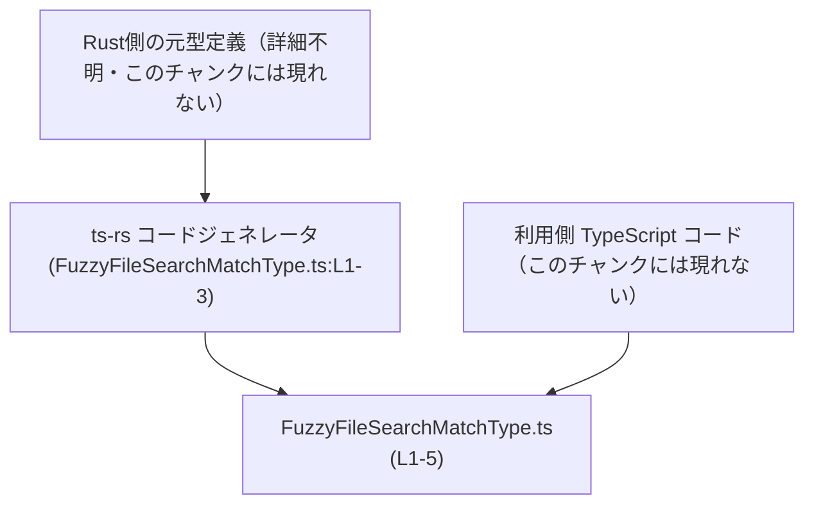
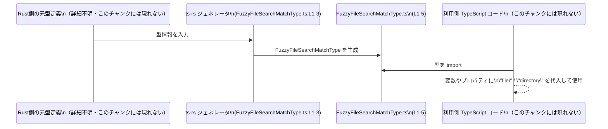

# app-server-protocol/schema/typescript/FuzzyFileSearchMatchType.ts コード解説

## 0. ざっくり一言

`FuzzyFileSearchMatchType` は、文字列リテラル `"file"` または `"directory"` のみを許可する TypeScript の型エイリアスです（`FuzzyFileSearchMatchType.ts:L5-5`）。  
あいまいファイル検索などで「結果がファイルかディレクトリか」を区別する用途に使われると考えられますが、このチャンクだけでは用途は断定できません。

---

## 1. このモジュールの役割

### 1.1 概要

- このモジュールは、TypeScript 側で **ファイル種別** を表すための文字列リテラル型を提供します（`FuzzyFileSearchMatchType.ts:L5-5`）。
- コメントにより、このファイルは `ts-rs` によって自動生成され、手動編集してはいけないことが明示されています（`FuzzyFileSearchMatchType.ts:L1-3`）。

### 1.2 アーキテクチャ内での位置づけ

- 自身では他のモジュールを `import` しておらず、単一の型エイリアスを `export` するだけのモジュールです（`FuzzyFileSearchMatchType.ts:L5-5`）。
- ファイル先頭のコメントから、この型は Rust 側の型定義から `ts-rs` によって生成されていることが分かります（`FuzzyFileSearchMatchType.ts:L1-3`）。

この関係を簡易な依存関係図で表すと次のようになります。



> Rust 側の型定義や利用側 TypeScript コードは、このチャンクには登場しないため、詳細は不明です。

### 1.3 設計上のポイント

- **自動生成コード**  
  - 「GENERATED CODE! DO NOT MODIFY BY HAND!」というコメントにより、自動生成であることと、手動編集禁止が明示されています（`FuzzyFileSearchMatchType.ts:L1-3`）。
- **実行時ロジックを持たない**  
  - 1 つの `export type` による型エイリアスのみが定義されており（`FuzzyFileSearchMatchType.ts:L5-5`）、関数やクラスは存在しません。このため実行時の挙動や副作用はなく、型チェック専用のモジュールです。
- **文字列リテラルユニオン型**  
  - 型は `"file" | "directory"` という 2 つの文字列リテラルからなるユニオン型であり、割り当て可能な値をこの 2 種類に静的に制限します（`FuzzyFileSearchMatchType.ts:L5-5`）。

---

## 2. 主要な機能一覧

このファイルが提供する機能は 1 つです。

- `FuzzyFileSearchMatchType`: `"file"` または `"directory"` のいずれかであることを表す文字列リテラルユニオン型（`FuzzyFileSearchMatchType.ts:L5-5`）

---

## 3. 公開 API と詳細解説

### 3.1 型一覧（構造体・列挙体など）

このチャンクに登場する公開型コンポーネントの一覧です。

| 名前                        | 種別                | 役割 / 用途の概要                                                                 | 定義位置                         |
|-----------------------------|---------------------|------------------------------------------------------------------------------------|----------------------------------|
| `FuzzyFileSearchMatchType` | 型エイリアス（ユニオン） | `"file"` または `"directory"` のどちらかであることを表す文字列リテラル型                  | `FuzzyFileSearchMatchType.ts:L5-5` |

> このチャンクには、他の型（インターフェース・クラス・enum など）は登場しません。

#### `FuzzyFileSearchMatchType` の詳細

**概要**

- TypeScript の型エイリアスとして、値が `"file"` か `"directory"` の 2 種類に制限されることを表現します（`FuzzyFileSearchMatchType.ts:L5-5`）。
- 実行時には何も生成されず、コンパイル時の型チェックにのみ影響します。

**定義**

```typescript
export type FuzzyFileSearchMatchType = "file" | "directory"; // FuzzyFileSearchMatchType.ts:L5
```

**意味**

- `FuzzyFileSearchMatchType` 型の変数・プロパティには、コンパイラ上は `"file"` または `"directory"` 以外の文字列を代入できません。
- `"file"` / `"directory"` のどちらにせよ `string` 型の一種ですが、より限定したドメインを表現できます。

**Examples（使用例）**

以下は、この型を利用する代表的なパターンの例です。  
（これらのコードは利用イメージであり、本リポジトリ内に存在するとは限りません）

```typescript
// FuzzyFileSearchMatchType をインポートする例
// 実際のパスはプロジェクト構成によって異なる
import type { FuzzyFileSearchMatchType } from "./FuzzyFileSearchMatchType"; // 相対パスは一例

// 検索結果 1 件分の型を定義する
interface FuzzyFileSearchResult {
    path: string;                      // マッチしたファイルまたはディレクトリのパス
    matchType: FuzzyFileSearchMatchType; // "file" か "directory" のいずれか
}

// 型を使った値の代入例
const result1: FuzzyFileSearchResult = {
    path: "/home/user/file.txt",
    matchType: "file",                 // OK: 許可された文字列
};

const result2: FuzzyFileSearchResult = {
    path: "/home/user/projects",
    matchType: "directory",            // OK: 許可された文字列
};

// const result3: FuzzyFileSearchResult = {
//     path: "/home/user/unknown",
//     matchType: "folder",             // コンパイルエラー: "folder" は許可されていない
// };
```

**Edge cases（エッジケース）**

- `any` や `unknown` からの代入  
  - `any` 型から代入するとコンパイラはチェックを行わないため、実行時に `"file"` / `"directory"` 以外が入る可能性があります。
- 外部入力（JSON など）のパース後  
  - JSON からパースしたオブジェクトに対し、型アサーション（`as FuzzyFileSearchMatchType`）だけを行うと、実際には `"file"` / `"directory"` 以外の文字列が混入していてもコンパイルが通るため、実行時に不整合が発生する可能性があります。

**使用上の注意点**

- この型は **コンパイル時のみ** のチェックを提供し、実行時に自動でバリデーションを行うわけではありません。外部データを扱う場合は、文字列値が `"file"` または `"directory"` であるかどうかを実行時にもチェックする必要があります。
- ファイル先頭コメントにより、このファイル自体は自動生成されるため直接編集すべきではありません（`FuzzyFileSearchMatchType.ts:L1-3`）。新たなバリアント（例: `"symlink"`）などを追加したい場合は、生成元（Rust 側の型定義）の変更と再生成が必要になります。

### 3.2 関数詳細（最大 7 件）

このファイルには関数・メソッドは定義されていません（`FuzzyFileSearchMatchType.ts:L1-5`）。  
そのため、このセクションで詳細解説すべき関数は存在しません。

### 3.3 その他の関数

- なし（このチャンクには関数定義が一切登場しません）。

---

## 4. データフロー

このファイル自体には実行時の処理や関数呼び出しはありませんが、一般的な利用イメージとしては、次のような流れでデータが扱われると考えられます。

1. Rust 側の型から `ts-rs` により `FuzzyFileSearchMatchType.ts` が自動生成される（`FuzzyFileSearchMatchType.ts:L1-3`）。
2. TypeScript 側のアプリケーションコードが、この型を `import` してプロパティや変数の型として利用する（`FuzzyFileSearchMatchType.ts:L5-5`）。
3. アプリケーション内で `"file"` または `"directory"` を代入・判定することで、ファイルとディレクトリを区別したロジックを実装する。

この想定データフローを sequence diagram で表現します。



> Rust 側や利用側コードの具体的な実装は、このチャンクには含まれていないため「詳細不明」としています。

---

## 5. 使い方（How to Use）

### 5.1 基本的な使用方法

`FuzzyFileSearchMatchType` を使って検索結果オブジェクトの型を表現する基本例です。

```typescript
// 型のインポート
// 実際の相対パスはプロジェクト構成に依存する
import type { FuzzyFileSearchMatchType } from "./FuzzyFileSearchMatchType"; // 自動生成された型エイリアス

// 検索結果を表す型
interface SearchItem {
    path: string;                      // マッチしたパス
    matchType: FuzzyFileSearchMatchType; // "file" か "directory"
}

// 関数の戻り値に利用する例
function createSearchItem(path: string, isDirectory: boolean): SearchItem {
    const matchType: FuzzyFileSearchMatchType = isDirectory ? "directory" : "file"; // 条件で割り当て

    return {
        path,                          // 引数 path をそのまま設定
        matchType,                     // 上で決めた matchType を設定
    };
}
```

このように、ブーリアンなどから `"file"` / `"directory"` を決定し、それを `FuzzyFileSearchMatchType` として保持することで、以降の処理で型安全に扱えます。

### 5.2 よくある使用パターン

#### パターン 1: `switch` 文による分岐

```typescript
function handleItemType(matchType: FuzzyFileSearchMatchType): void {
    switch (matchType) {
        case "file":
            console.log("ファイルとして処理します");
            break;
        case "directory":
            console.log("ディレクトリとして処理します");
            break;
        // default ケースは不要:
        // ユニオンが "file" | "directory" のみなので網羅的
    }
}
```

- ユニオン型により、`switch` 文で全てのケースを列挙していることがコンパイラに保証されます。

#### パターン 2: インデックス付き型に利用する

```typescript
type ItemsByType = {
    file: string[];                   // ファイルのパス一覧
    directory: string[];              // ディレクトリのパス一覧
};

function addItem(items: ItemsByType, kind: FuzzyFileSearchMatchType, path: string): void {
    items[kind].push(path);           // kind は "file" か "directory" のどちらかなので安全
}
```

- `FuzzyFileSearchMatchType` をオブジェクトのキーとしても安全に利用できます。

### 5.3 よくある間違い

#### 間違い例: 単なる `string` として扱ってしまう

```typescript
// 間違い例
let kind: string = "file";                    // string として宣言している
kind = "folder";                              // コンパイル時にはエラーにならない
```

#### 正しい例: `FuzzyFileSearchMatchType` を利用する

```typescript
let kind: FuzzyFileSearchMatchType = "file";  // 型が限定されている
// kind = "folder";                           // コンパイルエラー: "folder" は許可されない
```

#### 間違い例: 型アサーションで無理に通してしまう

```typescript
// 外部から来た値
const raw: string = getRawTypeFromServer();   // 実装は不明・このチャンクには現れない

// 危険な例: 実際の値を検証せずに as でアサートする
const unsafeKind = raw as FuzzyFileSearchMatchType; // コンパイルは通るが、実行時は不正値の可能性
```

実際には `"file"` / `"directory"` 以外の文字列が入ってくる可能性があるため、実行時のチェックを行うことが推奨されます。

### 5.4 使用上の注意点（まとめ）

- この型は **静的型チェック専用** であり、実行時のバリデーションは行いません。外部入力に対しては追加のチェックロジックが必要です。
- 自動生成ファイルであるため、直接編集すると次回の再生成で上書きされる可能性があります（`FuzzyFileSearchMatchType.ts:L1-3`）。変更は生成元（Rust 側）の型定義で行う必要があります。
- 値を `any` として扱うと、`FuzzyFileSearchMatchType` による制約が失われるため、`any` の使用は最小限にとどめることが望ましいです。
- 並行処理やスレッド安全性については、この型が実行時の状態やロジックを持たないため、特別な注意点はありません。

---

## 6. 変更の仕方（How to Modify）

### 6.1 新しい機能を追加する場合

このファイルは `ts-rs` による自動生成コードであり、「Do not edit this file manually」と明示されています（`FuzzyFileSearchMatchType.ts:L1-3`）。  
そのため、**直接この TypeScript ファイルを編集してはいけません**。

新しいマッチ種別（例: `"symlink"`）を追加したい場合の一般的な手順は、次のようになります。

1. **生成元の Rust 側の型定義を修正する**  
   - Rust 側にある、`FuzzyFileSearchMatchType` に対応する enum などに新しいバリアントを追加する想定です。  
   - ただし、このチャンクには Rust 側のファイルパスや型名は現れていないため、具体的な場所は不明です。
2. **`ts-rs` によるコード生成を再実行する**  
   - ビルドスクリプトや専用コマンドにより、TypeScript 側の型定義が再生成されます。
3. **生成された TypeScript 側のユニオン型を確認する**  
   - 新しい文字列リテラルが `FuzzyFileSearchMatchType` に含まれていることを確認します。

このプロセスにより、TypeScript 側の型と Rust 側の型の整合性が保たれます。

### 6.2 既存の機能を変更する場合

既存の `"file"` / `"directory"` の表現を変更したい場合も、基本方針は同じです。

- **影響範囲の確認**
  - `FuzzyFileSearchMatchType` を参照している TypeScript コード全体が影響を受けます。
  - ただし、このチャンクからは利用箇所を特定できません（利用側は「このチャンクには現れない」）。
- **変更時に注意すべき契約**
  - `FuzzyFileSearchMatchType` に含まれる文字列が変更されると、その文字列に依存した `switch` 文や条件分岐、オブジェクトキーなどがすべて修正対象になります。
  - Rust 側と TypeScript 側で同じバリアント名を維持することが重要です。
- **テスト**
  - このファイルにはテストコードは含まれていません（`FuzzyFileSearchMatchType.ts:L1-5`）。
  - 実際のプロジェクトでは、利用側の単体テスト・統合テストを再実行し、新しいバリアントや変更された文字列に対して期待通りに動作するか確認する必要があります。

---

## 7. 関連ファイル

このチャンクから直接参照可能な関連パスはコメントに含まれていません。  
そのため、具体的なファイルパスは特定できませんが、概念的には次のようなファイル群が関係していると考えられます。

| パス / コンポーネント | 役割 / 関係 |
|------------------------|------------|
| （Rust 側の元型定義） | `ts-rs` が参照してこの TypeScript 型を生成する元の定義。ファイルパスや型名はこのチャンクには現れないため不明。 |
| `app-server-protocol/schema/typescript/FuzzyFileSearchMatchType.ts` | 本レポートの対象ファイル。`FuzzyFileSearchMatchType` 型エイリアスを定義する自動生成コード（`FuzzyFileSearchMatchType.ts:L1-5`）。 |
| （同ディレクトリ内の他の schema TS ファイル） | 他の型定義を提供している可能性があるが、このチャンクにはファイル名が登場しないため存在は断定できない。 |

---

### Bugs / Security / Contracts / Edge Cases についてのまとめ

- **Bugs**
  - このファイルは型定義のみであり、実行時ロジックを持たないため、直接的なバグ（計算ミスや分岐ミスなど）は存在しません。
- **Security**
  - セキュリティ上の挙動は実行時ロジックに依存するため、このファイル単体からは脆弱性の有無を判断できません。
  - ただし、外部入力に対して型アサーションだけを行う使い方は、実際の値が `"file"` / `"directory"` であることを保証しないため、意図しない分岐に繋がる可能性があります。
- **Contracts**
  - 型レベルの契約として、「`FuzzyFileSearchMatchType` は `"file"` または `"directory"` のいずれかである」という前提が、利用側コードと共有されます（`FuzzyFileSearchMatchType.ts:L5-5`）。
- **Edge Cases**
  - `any` からの代入や、外部入力に対する安易な `as FuzzyFileSearchMatchType` によって、この契約が破られうる点に注意が必要です。

以上が、このチャンクに基づき客観的に説明できる範囲の内容です。
