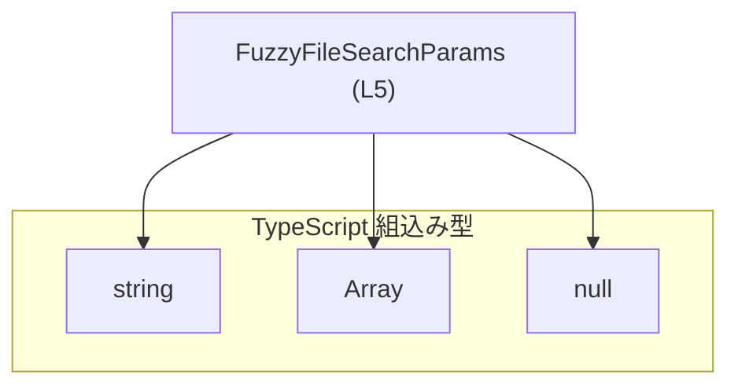
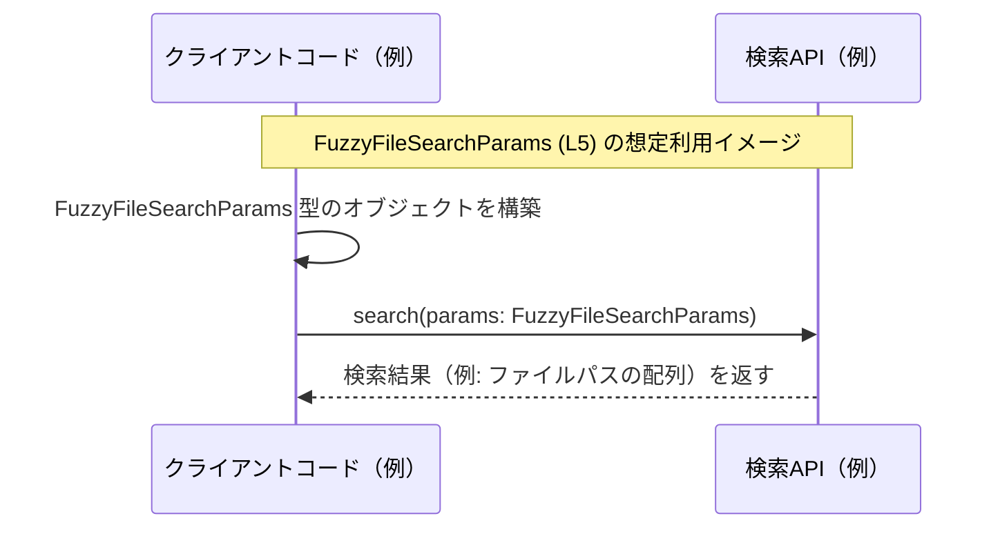

# app-server-protocol/schema/typescript/FuzzyFileSearchParams.ts コード解説

## 0. ざっくり一言

`FuzzyFileSearchParams` は、あいまい検索（fuzzy search）でファイルを検索する際のパラメータをまとめた **型エイリアス** です（型名・フィールド名からの解釈）。  
このファイルは `ts-rs` によって自動生成されており、手動で編集しないことがコメントから分かります（`FuzzyFileSearchParams.ts:L1-3`）。

---

## 1. このモジュールの役割

### 1.1 概要

- このモジュールは、TypeScript 側で使用する **`FuzzyFileSearchParams` 型**を提供します（`FuzzyFileSearchParams.ts:L5-5`）。
- 型は以下 3 つのフィールドを持つオブジェクトを表現します（`query`, `roots`, `cancellationToken`）。
- コメントから、このファイルは `ts-rs` により生成された **スキーマ定義**であることが分かります（`FuzzyFileSearchParams.ts:L1-3`）。

### 1.2 アーキテクチャ内での位置づけ

このファイル自身は他モジュールを `import` しておらず、**TypeScript の組込み型だけに依存する定義ファイル**です（`FuzzyFileSearchParams.ts:L5-5`）。

依存関係（本チャンクから分かる範囲）を Mermaid 図で示します。



- `FuzzyFileSearchParams` は、`string`, `Array<string>`, `string | null` によって構成されたオブジェクト型です（`FuzzyFileSearchParams.ts:L5-5`）。
- どのモジュールからこの型が利用されているかは、このチャンクのコードからは分かりません。

### 1.3 設計上のポイント

コードから読み取れる特徴は次のとおりです。

- **自動生成コード**  
  - ファイル先頭のコメントにより、`ts-rs` による自動生成であり、手動編集禁止であることが明示されています（`FuzzyFileSearchParams.ts:L1-3`）。
- **単一の公開型のみを提供**  
  - ファイル内には `FuzzyFileSearchParams` 以外の型・関数は存在しません（`FuzzyFileSearchParams.ts:L5-5`）。
- **状態・ロジックを持たない**  
  - どのようなメソッドや処理もなく、純粋な型定義だけです。実行時ロジック・エラー処理・並行性制御は一切含みません（`FuzzyFileSearchParams.ts:L5-5`）。
- **必須プロパティ＋`null` 許可**  
  - 3 プロパティはすべて **必須**（`?` が付いていない）ですが、そのうち `cancellationToken` は `string | null` として「値は必須だが `null` を許容する」設計になっています（`FuzzyFileSearchParams.ts:L5-5`）。

---

## 2. 主要な機能一覧

このファイルは「機能」というより、**型による制約**を提供します。  
`FuzzyFileSearchParams` 型が表す意味（名前・フィールド名からの解釈）は次のとおりです（`FuzzyFileSearchParams.ts:L5-5`）。

- `query` : 検索文字列を表す `string`
- `roots` : 検索対象となる「ルートパス」や「ルートディレクトリ」らしき `Array<string>`
- `cancellationToken` : 検索処理を識別・キャンセルするためのトークンを表すと考えられる `string | null`  
  （用途は名前からの推測であり、このチャンクからは確定できません）

---

## 3. 公開 API と詳細解説

### 3.1 型一覧（構造体・列挙体など）

このファイルで公開されている主要な型は 1 つです。

| 名前 | 種別 | 役割 / 用途 | 定義位置 |
|------|------|------------|----------|
| `FuzzyFileSearchParams` | 型エイリアス（オブジェクトリテラル型） | あいまいファイル検索のパラメータをまとめたオブジェクトを表す（型名・フィールド名からの解釈） | `app-server-protocol/schema/typescript/FuzzyFileSearchParams.ts:L5-5` |

#### フィールド構成

`FuzzyFileSearchParams` の構造は次のとおりです（`FuzzyFileSearchParams.ts:L5-5`）。

```typescript
export type FuzzyFileSearchParams = {
    query: string;                      // 検索クエリ文字列
    roots: Array<string>;               // 検索対象ルートパスの配列
    cancellationToken: string | null;   // キャンセル用トークン（null 許可）
};
```

※ 上記のように改行していますが、元コードは 1 行で定義されています（`FuzzyFileSearchParams.ts:L5-5`）。

各フィールドの意味（解釈）と型安全性:

- `query: string`
  - 必須プロパティです。  
  - TypeScript の型システムにより、`number` など他の型を代入するとコンパイルエラーになります。
- `roots: Array<string>`
  - 必須プロパティで、**文字列の配列**です。`string[]` と同義です。
  - `string` 以外の要素を含む配列を代入するとコンパイルエラーになります。
- `cancellationToken: string | null`
  - 必須プロパティですが、値として `string` または `null` を許容します。
  - `undefined` は型に含まれていないため、strict モードでは `undefined` を代入するとコンパイルエラーになります。
  - 利用側では `null` チェックが必要になる設計です。

### 3.2 関数詳細（最大 7 件）

このファイルには **関数・メソッド・クラス定義は存在しません**（`export type` のみ; `FuzzyFileSearchParams.ts:L1-5`）。  
したがって、詳細説明すべき関数は 0 件です。

### 3.3 その他の関数

- 補助関数やラッパー関数も定義されていません（`FuzzyFileSearchParams.ts:L1-5`）。

---

## 4. データフロー

このチャンクには `FuzzyFileSearchParams` を実際に使っているコードは含まれていないため、**具体的な呼び出し元やデータフローは不明**です。  
ここでは、あくまで「想定される利用イメージ」として、TypeScript 側でパラメータオブジェクトを構築し、どこかの検索 API に渡す例を図示します。

> 注意: 以下の図・説明の「検索 API」などは仮のコンポーネント名であり、  
> このチャンクのコードから存在が確認できるものではありません。



要点（想定ベースの説明）:

- クライアント側コードが `query`, `roots`, `cancellationToken` を埋めた `FuzzyFileSearchParams` オブジェクトを作成する。
- そのオブジェクトを、何らかの検索関数／RPC／HTTP クライアントに渡す。
- 実際のプロトコル（REST, RPC, メッセージキューなど）や戻り値の型は、このチャンクからは分かりません。

---

## 5. 使い方（How to Use）

### 5.1 基本的な使用方法

`FuzzyFileSearchParams` は `export type` で公開されているため、TypeScript コードから通常の型として `import` できます（`FuzzyFileSearchParams.ts:L5-5`）。

以下は、**仮の検索関数**に渡す形での利用例です（検索関数自体はこのファイルには定義されていません）。

```typescript
// 型のみをインポートする例（実際のパスはプロジェクト構成に依存します）
import type { FuzzyFileSearchParams } from "./FuzzyFileSearchParams";

// 仮の検索関数。実際の定義はこのファイルには存在しません。
declare function searchFuzzyFiles(params: FuzzyFileSearchParams): Promise<string[]>;

async function example() {
    // FuzzyFileSearchParams 型のオブジェクトを構築する
    const params: FuzzyFileSearchParams = {
        query: "main",                               // 検索キーワード
        roots: ["/project/src", "/project/tests"],   // 検索対象となるルートディレクトリ
        cancellationToken: null,                     // 今回はキャンセル機能を使わない
    };

    // 型安全に検索 API に渡せる
    const results = await searchFuzzyFiles(params);
    console.log(results);
}
```

この例から分かる TypeScript 特有の安全性:

- `query` を `42` のような数値にするとコンパイルエラーになります。
- `roots` を `"project/src"` のような単なる文字列にすると、`Array<string>` ではないためコンパイルエラーになります。
- `cancellationToken` を省略すると、必須プロパティの不足としてエラーになります。

### 5.2 よくある使用パターン（例）

`cancellationToken` の有無で使い分けるパターンが考えられます（用途は名前からの推測です）。

```typescript
import type { FuzzyFileSearchParams } from "./FuzzyFileSearchParams";

// キャンセル機能を使わない呼び出し例
const paramsWithoutCancel: FuzzyFileSearchParams = {
    query: "config",
    roots: ["/repo"],
    cancellationToken: null,         // null を明示
};

// 何らかのトークン ID を用いた呼び出し例
const paramsWithCancel: FuzzyFileSearchParams = {
    query: "config",
    roots: ["/repo"],
    cancellationToken: "search-123", // 文字列トークンを指定
};
```

- TypeScript の型により、「トークンが `string` または `null` である」ことがコンパイル時に保証されます。
- 実際にどのような値が「有効なトークン」とみなされるかは、この型定義からは分かりません。

### 5.3 よくある間違い

型定義に反する形で値を構築すると、コンパイル時に検出されます。

```typescript
import type { FuzzyFileSearchParams } from "./FuzzyFileSearchParams";

// 間違い例 1: roots を単一の string にしてしまう
const wrong1: FuzzyFileSearchParams = {
    query: "main",
    // roots: "/project/src",        // ❌ Array<string> ではなく string なのでエラー
    roots: ["/project/src"],          // ✅ 正しくは配列
    cancellationToken: null,
};

// 間違い例 2: cancellationToken を省略してしまう
const wrong2: FuzzyFileSearchParams = {
    query: "main",
    roots: ["/project/src"],
    // cancellationToken: null,      // ❌ 必須プロパティなので省略するとエラー
};

// 間違い例 3: cancellationToken に undefined を入れてしまう
const wrong3: FuzzyFileSearchParams = {
    query: "main",
    roots: ["/project/src"],
    // cancellationToken: undefined, // ❌ 型は string | null なので undefined は許容されない
    cancellationToken: null,          // ✅ null は許容される
};
```

TypeScript コンパイラの型チェックにより、上記の誤りは実行前（コンパイル時）に検出され、ランタイムエラーを減らすことができます。

### 5.4 使用上の注意点（まとめ）

- **手動編集禁止**  
  - ファイル先頭のコメントで「GENERATED CODE」「Do not edit manually」と明示されています（`FuzzyFileSearchParams.ts:L1-3`）。  
    型を変更する必要がある場合は、このファイルではなく **生成元（おそらく Rust 側の型定義）** を修正し、`ts-rs` で再生成する必要があります。  
    生成元の場所はこのチャンクからは分かりません。
- **`null` の扱い**  
  - `cancellationToken` は `null` を許容するため、利用側では `null` チェックを行う前提で設計されていると考えられます。
- **ランタイムの型安全性**  
  - TypeScript の型はコンパイル時のみ有効であり、ランタイムで自動的なバリデーションは行われません。  
    外部から JSON を受け取ってこの型に「合わせたい」場合は、別途ランタイムの検証処理が必要です。
- **並行性・キャンセル制御**  
  - この型自体にはキャンセル処理や並行性制御のロジックは含まれません。`cancellationToken` をどのように使うかは呼び出し側の実装に依存します。

---

## 6. 変更の仕方（How to Modify）

### 6.1 新しい機能を追加する場合

このファイルは自動生成されるため、**直接編集するのは推奨されません**（`FuzzyFileSearchParams.ts:L1-3`）。

一般的な手順（コードから推測できる範囲）:

1. `FuzzyFileSearchParams` にフィールドを追加したい場合（例: `maxResults: number` など）  
   - 生成元（おそらく Rust の構造体＋`ts-rs` 属性）に新しいフィールドを追加します。  
   - その後 `ts-rs` によって TypeScript スキーマを再生成します。
2. 追加したフィールドを利用するコード（検索 API やクライアントコード）に対しても、合わせて変更を行います。

> 生成元のファイルパスや具体的な再生成手順は、このチャンクには現れません。

### 6.2 既存の機能を変更する場合

- **フィールド名の変更・削除**
  - `query`, `roots`, `cancellationToken` の名前や存在を変えると、これらを参照しているすべての TypeScript コードがコンパイルエラーになります。
  - プロトコルの一部として使われている場合、サーバー / クライアント間の互換性にも影響します。
- **フィールド型の変更**
  - たとえば `roots` を `string` に変更したり、`cancellationToken` から `null` を外すといった変更は、利用側のコードの修正が必要です。
- **変更時の注意点**
  - 変更は生成元側（Rust 側など）で行い、`ts-rs` 再生成後に TypeScript 側のコンパイルエラーを確認しながら影響範囲を修正するのが自然です。
  - このファイル単体から、どのコードがこの型を使っているかは分からないため、IDE の参照検索などを利用して影響箇所を確認する必要があります。

---

## 7. 関連ファイル

このチャンクには `import` 文などの情報がないため、**直接の関連ファイルは特定できません**（`FuzzyFileSearchParams.ts:L1-5`）。

このファイルから分かる範囲の情報をまとめると、次のとおりです。

| パス | 役割 / 関係 |
|------|------------|
| （不明） | コメントに記載された `ts-rs` の生成元（おそらく Rust 側の型定義）。このファイルはその出力物と考えられますが、具体的なファイルパスはこのチャンクには現れません。 |

---

## コンポーネントインベントリーまとめ（このチャンク）

最後に、このチャンクに現れる型・関数の一覧と定義位置を整理します。

### 型

| 名前 | 種別 | 定義位置 | 備考 |
|------|------|----------|------|
| `FuzzyFileSearchParams` | 型エイリアス（オブジェクトリテラル型） | `app-server-protocol/schema/typescript/FuzzyFileSearchParams.ts:L5-5` | 自動生成。`query`, `roots`, `cancellationToken` を持つ |

### 関数 / クラス

- このチャンクには関数・クラス・メソッド定義は存在しません（`FuzzyFileSearchParams.ts:L1-5`）。

---

## Bugs / Security / Contracts / Edge Cases（このファイルから読み取れる範囲）

- **Bugs（バグ）**
  - 実行時処理が存在しないため、このファイル単体から読み取れるロジック上のバグはありません。
- **Security（セキュリティ）**
  - `query` や `roots` にユーザー入力をそのまま渡す場合、サーバー側で入力検証・パス検証などが必要になる可能性がありますが、これはこの型の外側の問題であり、このファイルからは具体的な脆弱性は読み取れません。
- **Contracts（契約）**
  - 3 プロパティはいずれも必須であり、型は `string`, `Array<string>`, `string | null` であることがコンパイル時に保証される、というのがこの型の「契約」といえます（`FuzzyFileSearchParams.ts:L5-5`）。
- **Edge Cases（エッジケース）**
  - 型としては以下のような値も許容されます:
    - `query` が空文字 `""`
    - `roots` が空配列 `[]`
    - `cancellationToken` が `null`
  - これらの値をどう扱うか（例: 空クエリを許すかどうか）は、このファイルでは定義されていません。扱いは利用側の実装に依存します。
