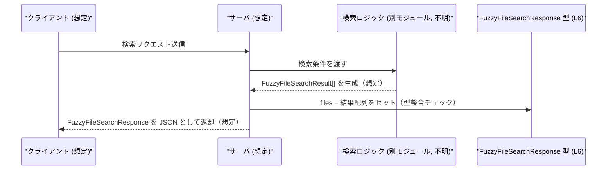

# app-server-protocol/schema/typescript/FuzzyFileSearchResponse.ts

## 0. ざっくり一言

`FuzzyFileSearchResponse` という、ファイル検索結果（と推測される）をまとめて返すレスポンス用の TypeScript 型エイリアスを 1 つ定義した、自動生成ファイルです（FuzzyFileSearchResponse.ts:L1-3, L6-6）。

---

## 1. このモジュールの役割

### 1.1 概要

- このモジュールは、`FuzzyFileSearchResponse` 型を通じて、`files` プロパティに `FuzzyFileSearchResult` の配列を格納するオブジェクトの構造を定義します（FuzzyFileSearchResponse.ts:L4-4, L6-6）。
- コメントから、このファイルは Rust 側の型定義から `ts-rs` によって自動生成されており、手動編集しないことが前提になっています（FuzzyFileSearchResponse.ts:L1-3）。

型名から、このレスポンスが「ファジーなファイル検索」の応答を表すと想定されますが、その用途は名前とファイルパスからの推測であり、コード自体には明示されていません。

### 1.2 アーキテクチャ内での位置づけ

このファイルから読み取れる依存関係は次の 1 点のみです。

- `FuzzyFileSearchResponse` は、配列要素の型として `FuzzyFileSearchResult` に依存します（FuzzyFileSearchResponse.ts:L4-4, L6-6）。
- `FuzzyFileSearchResponse` をどのモジュールが利用しているかは、このチャンクには現れません。

依存関係を Mermaid で表すと次のようになります。


### 1.3 設計上のポイント

コードから読み取れる設計上の特徴は次のとおりです。

- **自動生成コード**  
  - 先頭コメントで「生成コードであり、手動編集禁止」であることが明示されています（FuzzyFileSearchResponse.ts:L1-3）。
- **型定義のみでロジックを持たない**  
  - import と `export type` だけで構成され、関数・クラス・実行時処理は一切ありません（FuzzyFileSearchResponse.ts:L4-6）。
- **シンプルなレスポンス構造**  
  - レスポンスは `files` プロパティ 1 つに集約されており、その型は `Array<FuzzyFileSearchResult>`（`FuzzyFileSearchResult[]` と等価）です（FuzzyFileSearchResponse.ts:L6-6）。
- **型安全な依存だけを取り込む**  
  - `import type` 構文を用いることで、コンパイル後の JavaScript には依存が出力されない「型専用インポート」になっています（FuzzyFileSearchResponse.ts:L4-4）。  
    これにより、実行時の循環依存や不要な依存が増えないようになっています。

---

## 2. 主要な機能一覧（コンポーネントインベントリー）

### 2.1 コンポーネント一覧

このファイルに含まれる型・依存の一覧です。

| 種別         | 名前                       | 役割 / 用途                                                | 定義/参照コード抜粋 | 根拠行 |
|--------------|----------------------------|------------------------------------------------------------|----------------------|--------|
| 型インポート | `FuzzyFileSearchResult`    | `files` 配列の各要素の型。別ファイル側で定義される型。    | `import type { FuzzyFileSearchResult } from "./FuzzyFileSearchResult";` | FuzzyFileSearchResponse.ts:L4-4 |
| 型エイリアス | `FuzzyFileSearchResponse`  | `files: Array<FuzzyFileSearchResult>` を持つレスポンス型。 | `export type FuzzyFileSearchResponse = { files: Array<FuzzyFileSearchResult>, };` | FuzzyFileSearchResponse.ts:L6-6 |

### 2.2 提供される主な機能（意味的な役割）

- `FuzzyFileSearchResponse` 型:  
  - `files` プロパティに `FuzzyFileSearchResult` の配列を保持するオブジェクトの型を定義します（FuzzyFileSearchResponse.ts:L6-6）。
  - 空配列・複数要素の配列など、配列であればどのような長さでも許容されることが型から読み取れます（要素数の制約は型には表現されていません）。

---

## 3. 公開 API と詳細解説

### 3.1 型一覧（構造体・列挙体など）

公開されている主要な型は 1 つです。

| 名前                      | 種別      | 役割 / 用途                                                                                 | 主なフィールド | 根拠行 |
|---------------------------|-----------|---------------------------------------------------------------------------------------------|----------------|--------|
| `FuzzyFileSearchResponse` | 型エイリアス | `files: Array<FuzzyFileSearchResult>` を持つレスポンスオブジェクトの構造を表現する。 | `files`        | FuzzyFileSearchResponse.ts:L6-6 |

#### `FuzzyFileSearchResponse`

**概要**

- `files` プロパティに `FuzzyFileSearchResult` の配列を持つオブジェクトの型です（FuzzyFileSearchResponse.ts:L6-6）。
- TypeScript の型システム上の定義であり、実行時には存在しません（任意の `FuzzyFileSearchResponse` 型の値は、コンパイル後は単なるプレーンオブジェクトになります）。

**フィールド**

| フィールド名 | 型                            | 説明 |
|-------------|-------------------------------|------|
| `files`     | `Array<FuzzyFileSearchResult>` | 検索結果（と推測される）を要素とする配列。要素の詳細は `FuzzyFileSearchResult` 型に委ねられます（FuzzyFileSearchResponse.ts:L4-4, L6-6）。 |

**契約（型として読み取れること）**

- `files` プロパティは **必須** です（オプショナル記号 `?` が付いていないため）（FuzzyFileSearchResponse.ts:L6-6）。
- `files` プロパティの型には `null` や `undefined` は含まれていません（ユニオン型でこれらが含まれていないため）（FuzzyFileSearchResponse.ts:L6-6）。
- `files` は配列であり、0 個以上の `FuzzyFileSearchResult` 要素を持ちます。要素数の上下限は型としては定義されていません（FuzzyFileSearchResponse.ts:L6-6）。

**Errors / Panics / セキュリティ**

- この型自体は実行時コードを持たないため、このファイル単体で実行時エラーやパニック、直接的なセキュリティ上の問題を引き起こすことはありません。
- ただし、外部から受け取った JSON などに対して単純に `as FuzzyFileSearchResponse` と型アサーションを行うと、実際のデータ構造と型が一致しない場合に **実行時エラーがコンパイル時には検出されない** 可能性があります（これは TypeScript の一般的な注意点です）。

**Edge cases（エッジケース）**

- `files` が空配列 `[]` の場合も、この型では有効な値として扱われます（FuzzyFileSearchResponse.ts:L6-6）。
- `files` に `null` や `undefined` を含む配列、あるいは `FuzzyFileSearchResult` 以外の値を含む配列は、この型には合致しません（FuzzyFileSearchResponse.ts:L4-4, L6-6）。
- `files` プロパティそのものが存在しないオブジェクトは、この型とは別物です。TypeScript コンパイラはそのようなオブジェクトに `FuzzyFileSearchResponse` 型を付けるとエラーを報告します。

**使用上の注意点**

- このファイルは自動生成であり、「手動で編集しない」ことがコメントで示されています（FuzzyFileSearchResponse.ts:L1-3）。型を変えたい場合は生成元（Rust 側など）を変更し、再生成する必要があると考えられます（コメントからの推測）。
- 実行時にデータを検証する処理は含まれていないため、外部入力に対しては別途バリデーションを行わないと、型と実際の値が乖離する可能性があります。

### 3.2 関数詳細

- このファイルには関数定義（`function`、メソッド、アロー関数など）は存在しません（FuzzyFileSearchResponse.ts:L1-6）。
- したがって、詳細解説すべき公開関数はありません。

### 3.3 その他の関数

- 該当なし。

---

## 4. データフロー

このファイル自体には実行時処理はありませんが、型名と構造から推測できる典型的なデータフローを示します。  
※以下は **利用シナリオの例であり、このチャンクから直接読み取れる呼び出し関係ではありません**。

1. 検索処理が `FuzzyFileSearchResult` の配列を生成する（別モジュール）。
2. その配列を `files` プロパティに格納し、`FuzzyFileSearchResponse` 型のオブジェクトとして返す／送信する。
3. クライアント側は `FuzzyFileSearchResponse` 型として受け取り、`files` をたどって各結果を処理する。



この図は、`files: Array<FuzzyFileSearchResult>` という構造（FuzzyFileSearchResponse.ts:L6-6）から想像されるデータの流れを表現したものです。

---

## 5. 使い方（How to Use）

### 5.1 基本的な使用方法

#### 例1: サーバ側でレスポンスを組み立てる

`FuzzyFileSearchResult` の配列から `FuzzyFileSearchResponse` を作成する例です。

```typescript
// FuzzyFileSearchResponse 型と FuzzyFileSearchResult 型をインポートする
import type { FuzzyFileSearchResponse } from "./FuzzyFileSearchResponse";     // 本ファイル
import type { FuzzyFileSearchResult } from "./FuzzyFileSearchResult";         // 要素型（別ファイル）

// 検索結果の配列からレスポンス型を組み立てる関数
function createFuzzyFileSearchResponse(
    results: FuzzyFileSearchResult[],   // 検索結果の配列
): FuzzyFileSearchResponse {            // 戻り値は FuzzyFileSearchResponse 型
    return {
        files: results,                 // files プロパティにそのまま配列を詰める
    };
}
```

この例では、`results` が `FuzzyFileSearchResult[]` である限り、`FuzzyFileSearchResponse` との型整合性が保証されます（FuzzyFileSearchResponse.ts:L6-6）。

#### 例2: クライアント側でレスポンスを扱う

`FuzzyFileSearchResponse` を引数に受け取り、`files` を順に処理する例です。

```typescript
import type { FuzzyFileSearchResponse } from "./FuzzyFileSearchResponse";   // 本ファイル
import type { FuzzyFileSearchResult } from "./FuzzyFileSearchResult";       // 要素型

// レスポンスを処理する関数
function handleSearchResponse(response: FuzzyFileSearchResponse): void {
    // files は常に存在し、配列であることが型で保証されている
    for (const fileResult of response.files) {
        const result: FuzzyFileSearchResult = fileResult;  // 要素は FuzzyFileSearchResult 型として扱える

        // ここで result の内容を使った処理を行う
        // (FuzzyFileSearchResult の具体的なプロパティはこのチャンクには現れません)
    }
}
```

### 5.2 よくある使用パターン

#### パターン1: HTTP クライアントでの取得（想定例）

外部 API から JSON を取得し、`FuzzyFileSearchResponse` として扱う場合のパターンです。  
実データの検証が必要である点に注意が必要です。

```typescript
import type { FuzzyFileSearchResponse } from "./FuzzyFileSearchResponse";

// FuzzyFileSearchResponse を返す Promise 型の関数（想定例）
async function fetchFuzzyFileSearchResponse(url: string): Promise<FuzzyFileSearchResponse> {
    const res = await fetch(url);                             // HTTP リクエストを投げる
    const json = await res.json();                            // JSON を取得する

    // 簡略化のために型アサーションを利用（実運用ではバリデーションを推奨）
    const data = json as FuzzyFileSearchResponse;             // コンパイル時のみ型チェック

    return data;
}
```

このように `Promise<FuzzyFileSearchResponse>` を返す関数を定義しておくと、呼び出し側で `response.files` を安全に扱いやすくなります（コンパイル時の型保証という意味で）。

### 5.3 よくある間違い

#### 間違い例1: `files` を配列ではなく単一オブジェクトにしてしまう

```typescript
import type { FuzzyFileSearchResponse } from "./FuzzyFileSearchResponse";
import type { FuzzyFileSearchResult } from "./FuzzyFileSearchResult";

declare const singleResult: FuzzyFileSearchResult;

// 間違い例: files を配列ではなく単一の結果にしている
const wrongResponse: FuzzyFileSearchResponse = {
    // TypeScript 的にはコンパイルエラーになる
    // @ts-expect-error - files は FuzzyFileSearchResult[] である必要がある
    files: singleResult,
};
```

#### 正しい例

```typescript
import type { FuzzyFileSearchResponse } from "./FuzzyFileSearchResponse";
import type { FuzzyFileSearchResult } from "./FuzzyFileSearchResult";

declare const singleResult: FuzzyFileSearchResult;

// 正しい例: files に配列として設定する
const correctResponse: FuzzyFileSearchResponse = {
    files: [singleResult],    // 配列にして渡すことで型が一致する
};
```

#### 間違い例2: `files` プロパティを省略する

```typescript
import type { FuzzyFileSearchResponse } from "./FuzzyFileSearchResponse";

// 間違い例: 必須プロパティ files が存在しない
const invalidResponse: FuzzyFileSearchResponse = {
    // @ts-expect-error - files プロパティが不足している
};
```

`files` はオプショナルではないため、省略すると TypeScript コンパイラがエラーを報告します（FuzzyFileSearchResponse.ts:L6-6）。

### 5.4 使用上の注意点（まとめ）

- `files` プロパティは **必須** であり、`FuzzyFileSearchResult` の配列でなければなりません（FuzzyFileSearchResponse.ts:L6-6）。
- この型定義は **自動生成** されるため、直接編集すると生成元との不整合が生じる可能性があります（FuzzyFileSearchResponse.ts:L1-3）。
- TypeScript の型はコンパイル時のチェックにのみ影響し、実行時に自動でデータを検証しません。外部入力に対しては、必要に応じてランタイムバリデーションを行う必要があります。
- 並行性やスレッド安全性は、このファイルが定義するのが「不変の型構造」のみであるため、直接的には関係しません。

---

## 6. 変更の仕方（How to Modify）

### 6.1 新しい機能を追加する場合

このファイルは次のコメントにより「手動で編集しない」ことが明示されています（FuzzyFileSearchResponse.ts:L1-3）。

```ts
// GENERATED CODE! DO NOT MODIFY BY HAND!

// This file was generated by [ts-rs](https://github.com/Aleph-Alpha/ts-rs). Do not edit this file manually.
```

そのため、`FuzzyFileSearchResponse` にフィールドを追加する等の変更を行いたい場合の一般的な流れは次のようになります（コメントと `ts-rs` の記述からの推測です）。

1. 生成元になっている Rust 側の型（構造体など）を変更する。
2. `ts-rs` を用いて TypeScript スキーマを再生成する。
3. このファイルは再生成によって自動的に更新される。

このチャンクには、実際の生成コマンドや Rust 側の型定義は現れません。

### 6.2 既存の機能を変更する場合

- `files` の型を変更したい場合も、同様に生成元（Rust 側）を変更し再生成するのが前提と考えられます（FuzzyFileSearchResponse.ts:L1-3）。
- `FuzzyFileSearchResponse` の構造を変更すると、これを利用しているすべての TypeScript コードに影響が及びます。変更後は型エラーを解消するために呼び出し側の修正が必要です。
- 特に、`files` をオプショナルにする、型を変えるなどの変更は API 契約の破壊的変更になりやすいため、利用箇所の洗い出しが重要です。このチャンクからは利用箇所は分からないため、プロジェクト全体の検索などで確認することになります。

---

## 7. 関連ファイル

このモジュールと密接に関係するファイル・コンポーネントは、コードから次のように読み取れます。

| パス / 識別子                     | 役割 / 関係 |
|----------------------------------|------------|
| `./FuzzyFileSearchResult`        | `FuzzyFileSearchResponse.files` の要素型としてインポートされる型。実際の定義は別ファイル（通常は `FuzzyFileSearchResult.ts`）にあり、このチャンクには現れません（FuzzyFileSearchResponse.ts:L4-4）。 |
| Rust 側の生成元型（パス不明）    | コメントによると、`ts-rs` により本ファイルを生成する元になった Rust の型定義が存在すると考えられますが、このチャンクからパスや具体的な型名は分かりません（FuzzyFileSearchResponse.ts:L1-3）。 |
| テストコード                     | このチャンクにはテストファイルやテストケースは現れません。テストが存在するかどうかは不明です。 |

このファイル自体は非常に小さく、`FuzzyFileSearchResponse` の構造定義に専念しているため、理解や変更の際には主に `FuzzyFileSearchResult` と生成元の Rust 型定義を合わせて確認することが重要になります。
