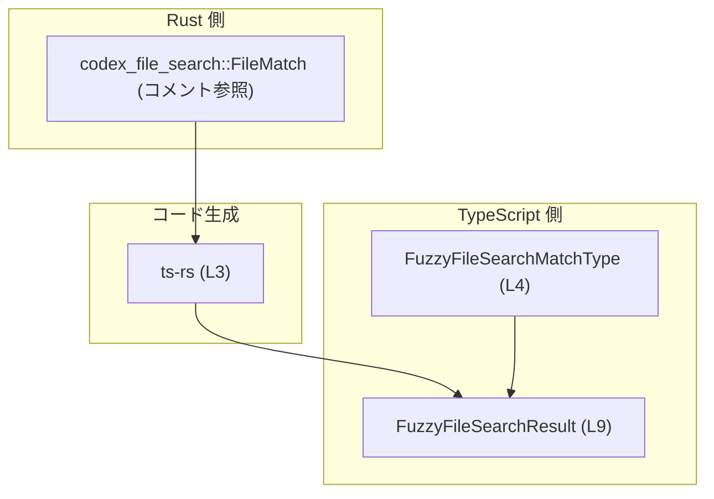
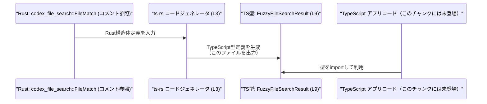

# app-server-protocol/schema/typescript/FuzzyFileSearchResult.ts コード解説

## 0. ざっくり一言

`FuzzyFileSearchResult` は、ファイルのあいまい検索結果 1 件分を表現する TypeScript の型エイリアスです。Rust 側の `codex_file_search::FileMatch` のスーパーセットとして ts-rs により自動生成されています。  
（`FuzzyFileSearchResult.ts:L1-3, L6-9`）

---

## 1. このモジュールの役割

### 1.1 概要

- このモジュールは、あいまいファイル検索結果の構造を TypeScript で表現するための **データ型定義** を提供します。  
  （`FuzzyFileSearchResult.ts:L6-9`）
- Rust の `codex_file_search::FileMatch` 構造体のスーパーセットとして設計されており、Rust↔TypeScript 間で同じ構造のデータを安全にやり取りする役割を持ちます（コメントと ts-rs 生成コメントからの解釈）。  
  （`FuzzyFileSearchResult.ts:L3, L7`）

### 1.2 アーキテクチャ内での位置づけ

- この型は ts-rs により Rust から自動生成された **境界層（バインディング）** の一部です。  
  （`FuzzyFileSearchResult.ts:L1-3`）
- `FuzzyFileSearchResult` は、別ファイルで定義されている `FuzzyFileSearchMatchType` に依存します。  
  （`FuzzyFileSearchResult.ts:L4, L9`）
- 実際の検索処理ロジックはこのファイルには含まれず、ここでは結果の「形」だけが定義されています。  
  （`FuzzyFileSearchResult.ts:L9`）

主要な依存関係を示す図です（定義行を併記しています）。



### 1.3 設計上のポイント

- **自動生成コード**  
  - ファイル先頭で「GENERATED CODE」「Do not edit this file manually」と明記されており、手動編集を前提としていません。  
    （`FuzzyFileSearchResult.ts:L1-3`）
- **純粋なデータ型**  
  - 関数やクラスは存在せず、`export type` によるオブジェクト型エイリアスのみが公開 API です。  
    （`FuzzyFileSearchResult.ts:L9`）
- **外部型との依存**  
  - `match_type` フィールドは別モジュールの `FuzzyFileSearchMatchType` 型を利用し、マッチの種類を表現します（詳細はこのチャンクには現れません）。  
    （`FuzzyFileSearchResult.ts:L4, L9`）
- **null 許容フィールド**  
  - `indices` フィールドは `Array<number> | null` で宣言されており、「インデックス情報が存在しない」ことを `null` で表現できる設計になっています。  
    （`FuzzyFileSearchResult.ts:L9`）

---

## 2. 主要な機能一覧

このファイルは関数を持たないため、「機能」はすべて **データ構造としての表現能力** になります。

- ファイル検索結果のメタ情報を保持するオブジェクト型の定義  
  - ルートディレクトリ `root` と相対パス `path` の保持（`FuzzyFileSearchResult.ts:L9`）
  - マッチ種別 `match_type` の保持（`FuzzyFileSearchResult.ts:L9`）
  - ファイル名 `file_name` とスコア `score` の保持（`FuzzyFileSearchResult.ts:L9`）
  - マッチ位置などを表すと推測される数値配列 `indices`（`null` 許容）（`FuzzyFileSearchResult.ts:L9`）

---

## 3. 公開 API と詳細解説

### 3.1 型一覧（構造体・列挙体など）

本チャンクに現れる型のインベントリーです。

| 名前 | 種別 | 定義 / 利用行 | 役割 / 用途 |
|------|------|---------------|------------|
| `FuzzyFileSearchResult` | 型エイリアス（オブジェクト型） | 定義: `FuzzyFileSearchResult.ts:L9` | あいまいファイル検索結果 1 件分の情報を表現するデータ構造 |
| `FuzzyFileSearchMatchType` | 型（詳細不明） | import & 利用: `FuzzyFileSearchResult.ts:L4, L9` | 検索結果のマッチ種別を表現する型。別ファイル `./FuzzyFileSearchMatchType` で定義されており、このファイルから参照のみされます |

#### `FuzzyFileSearchResult` のフィールド一覧

`export type FuzzyFileSearchResult = { ... }` で定義されています。  
（`FuzzyFileSearchResult.ts:L9`）

| フィールド名 | 型 | 必須/任意 | 説明（コードから読み取れる範囲） |
|--------------|----|-----------|----------------------------------|
| `root` | `string` | 必須 | 検索対象プロジェクトなどのルートパスを表す文字列と解釈できます（命名からの推測。型は文字列であることのみ確定）。 |
| `path` | `string` | 必須 | `root` からのパスを表す文字列と解釈できます。 |
| `match_type` | `FuzzyFileSearchMatchType` | 必須 | マッチの種類を表す型。具体的なバリエーションはこのチャンクには現れません。 |
| `file_name` | `string` | 必須 | 対象ファイル名を表す文字列。 |
| `score` | `number` | 必須 | マッチの評価スコアを表す数値。スコアの範囲や意味はコードからは不明です。 |
| `indices` | `Array<number> \| null` | 必須（ただし値は配列または `null`） | 数値の配列または `null`。インデックス情報（例: マッチ位置）と解釈できますが、具体的な意味はコードからは不明です。 |

※ フィールドの意味についての説明で「〜と解釈できます」とある部分は、命名から妥当と考えられる範囲の推測であり、コードから厳密には断定できません。

### 3.2 関数詳細（最大 7 件）

このファイルには関数定義が存在しません。  
（`FuzzyFileSearchResult.ts:L1-9` 全体を通して `function` / `=>` による関数は定義されていません）

そのため、このセクションで詳述すべき公開関数 API はありません。

### 3.3 その他の関数

- 該当なし（関数・メソッドは一切定義されていません）。  
  （`FuzzyFileSearchResult.ts:L1-9`）

---

## 4. データフロー

このファイル自体には実行時処理はありませんが、コメントと型構造から見える **型レベル／コード生成レベルのフロー** を整理します。

### 4.1 型定義の生成フロー（設計上のデータフロー）

コメントに明示されている ts-rs を踏まえた、Rust → TypeScript の型同期フローを図示します。  
（`FuzzyFileSearchResult.ts:L1-3, L7`）



- Rust 側の構造体 `FileMatch` が ts-rs によって解析されます（コメントに `Superset of codex_file_search::FileMatch` と記載）。  
  （`FuzzyFileSearchResult.ts:L7`）
- ts-rs がその情報をもとに、この TypeScript ファイルを生成します。  
  （`FuzzyFileSearchResult.ts:L1-3`）
- TypeScript 側アプリケーションは、この型を `import` して検索結果データの型安全な入出力に利用すると考えられます（利用コードはこのチャンクには現れません。一般的な利用イメージとしての説明です）。

---

## 5. 使い方（How to Use）

### 5.1 基本的な使用方法

`FuzzyFileSearchResult` を受け取って内容を処理する、典型的な TypeScript コード例です。  
（この例は本チャンクには登場しませんが、この型をどのように扱うかの参考例です）

```typescript
// 検索結果型を import する
import type { FuzzyFileSearchResult } from "./FuzzyFileSearchResult"; // 実際のパスはプロジェクト構成に依存

// 検索結果のリストを表示する関数
function printSearchResults(results: FuzzyFileSearchResult[]): void {
    for (const r of results) {
        // ルート + パスから論理的なフルパスを組み立てる例
        const fullPath = `${r.root}/${r.path}`;  // root と path は string 型（L9）
        console.log(`[score=${r.score}] ${fullPath}`); // score は number 型（L9）

        // indices が null の場合を考慮してからアクセスする
        if (r.indices !== null) {                 // indices: Array<number> | null（L9）
            console.log("indices:", r.indices.join(", "));
        }
    }
}
```

この例では:

- コンパイル時に、`r.score` や `r.file_name` などのプロパティ使用に対して IDE 補完と型チェックが効きます。
- `indices` が `null` の可能性を型で表現しているため、`!== null` のチェックを忘れると TypeScript コンパイラが警告／エラーを出す設定にできます。

### 5.2 よくある使用パターン

1. **検索結果を返す関数の戻り値として使う**

```typescript
import type { FuzzyFileSearchResult } from "./FuzzyFileSearchResult";

async function searchFiles(query: string): Promise<FuzzyFileSearchResult[]> {
    // 実際にはバックエンド呼び出しなどを行う想定の例
    const response = await fetch(`/api/search?q=${encodeURIComponent(query)}`);
    const data = await response.json();

    // data が FuzzyFileSearchResult[] であると宣言すると、
    // 以降の処理でフィールド名の打ち間違いなどをコンパイル時に検出できます。
    return data as FuzzyFileSearchResult[];
}
```

1. **コンポーネント間のインターフェースとして使う**

```typescript
import type { FuzzyFileSearchResult } from "./FuzzyFileSearchResult";

interface SearchResultViewProps {
    result: FuzzyFileSearchResult; // Reactなどの props に利用
}
```

### 5.3 よくある間違い

この型から推測される、起こりやすい誤用例とその修正例です。

#### 1. `indices` が `null` の可能性を無視する

```typescript
// 誤りの例: null チェックを行わずに配列メソッドを呼び出す
function printIndicesWrong(result: FuzzyFileSearchResult) {
    console.log(result.indices.join(", ")); // indices が null の場合に実行時エラー
}

// 正しい例: null チェックを行ってから使用する
function printIndicesCorrect(result: FuzzyFileSearchResult) {
    if (result.indices !== null) {
        console.log(result.indices.join(", "));
    } else {
        console.log("indices: (none)");
    }
}
```

#### 2. 自動生成ファイルを直接編集してしまう

```typescript
// 誤りの例（イメージ）: FuzzyFileSearchResult.ts に手作業でフィールド追加
// export type FuzzyFileSearchResult = { newField: string; ... };

// 正しい対応:
// - Rust 側の元定義（codex_file_search::FileMatch のスーパーセット元）を変更
// - ts-rs のコード生成を再実行して、このファイルを再生成する
```

### 5.4 使用上の注意点（まとめ）

- **手動で編集しない**  
  - ファイル先頭のコメントにある通り、`GENERATED CODE` であり、手動編集は想定されていません。変更は Rust 側の元定義や ts-rs 設定で行う必要があります。  
    （`FuzzyFileSearchResult.ts:L1-3`）
- **`indices` の null 取り扱い**  
  - `indices` は `Array<number> | null` であり、常に配列とは限りません。使用時には null チェックを行う設計にする必要があります。  
    （`FuzzyFileSearchResult.ts:L9`）
- **型レベルの安全性のみ**  
  - このファイルには実行時のバリデーションや変換処理は含まれません。外部入力からデータを受け取る場合には、別途ランタイムのバリデーションが必要です（このチャンクにはそのコードは現れません）。
- **並行性・エラー処理**  
  - TypeScript の型定義のみであり、非同期処理やロックなどの並行性に関する要素は含まれません。エラー処理も、利用側の関数／メソッドで実装する必要があります。

---

## 6. 変更の仕方（How to Modify）

### 6.1 新しい機能を追加する場合

このファイルは ts-rs による自動生成であり、「機能追加」は基本的に **Rust 側の型定義を変更してから再生成する** ことになります。  
（`FuzzyFileSearchResult.ts:L1-3`）

一般的な手順は次のようになります（Rust 側の具体的なファイルパスはこのチャンクには現れません）。

1. Rust の `codex_file_search::FileMatch` あるいはそのスーパーセット側の構造体にフィールドを追加・変更する。  
   （`Superset of codex_file_search::FileMatch` コメントが存在することからの推測。`FuzzyFileSearchResult.ts:L7`）
2. ts-rs を再実行し、TypeScript 型定義を再生成する。  
   （`FuzzyFileSearchResult.ts:L3`）
3. 生成された `FuzzyFileSearchResult` の変更内容に応じて、TypeScript 側でこの型を利用している箇所を更新する（フィールド名の変更、null 許容の変更など）。

### 6.2 既存の機能を変更する場合

- **影響範囲の確認**  
  - `FuzzyFileSearchResult` を利用している TypeScript ファイル（import 文を検索）を確認し、どのフィールドがどのように使われているかを把握します。
- **契約（前提条件・意味）の維持**  
  - `score` の範囲や意味、`indices` が null を許容する契約などを変更する場合、Rust 側・TypeScript 側の両方のロジックで一貫性を保つ必要があります。  
    （`FuzzyFileSearchResult.ts:L9`の型構造から読み取れる前提）
- **テストの更新**  
  - このチャンクにはテストコードは存在しませんが、実プロジェクトでは、検索結果に依存するテストを更新することが望ましいです（場所は不明）。

---

## 7. 関連ファイル

このモジュールと直接または論理的に関連するファイル／定義です。

| パス / 定義名 | 役割 / 関係 |
|---------------|------------|
| `./FuzzyFileSearchMatchType` | `import type { FuzzyFileSearchMatchType } from "./FuzzyFileSearchMatchType";` により参照されている型定義ファイルです。`match_type` フィールドの型を提供します。`FuzzyFileSearchResult.ts:L4, L9` |
| `codex_file_search::FileMatch`（Rust 側定義。具体的なファイルパスはこのチャンクには現れません） | コメントで「Superset of [`codex_file_search::FileMatch`]」と記載されており、この Rust 構造体を基にしたスーパーセットとして `FuzzyFileSearchResult` が生成されていることが示されています。`FuzzyFileSearchResult.ts:L7` |
| `ts-rs`（生成ツール） | ファイル冒頭コメントでこのファイルが ts-rs によって生成されたと明記されています。型定義の変更は、通常 ts-rs の入力である Rust 側の定義に対して行います。`FuzzyFileSearchResult.ts:L1-3` |

---

### まとめ（安全性・エッジケース・バグ／セキュリティ観点）

- このファイルには実行時コードがないため、直接のバグやセキュリティホールは存在しませんが、  
  - `indices` の null 取り扱いを誤ると実行時エラーが発生しうる  
  - 外部入力を `FuzzyFileSearchResult` とみなす場合、ランタイムバリデーションがないと型と異なる形のデータが紛れ込む可能性がある  
  といった点に注意が必要です。  
  （`FuzzyFileSearchResult.ts:L9`）
