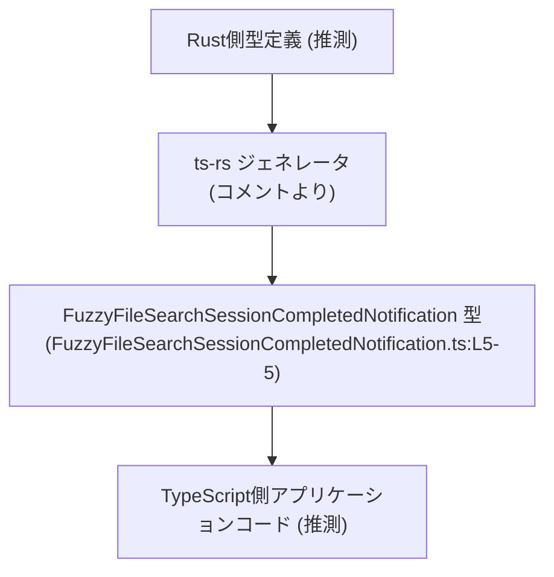
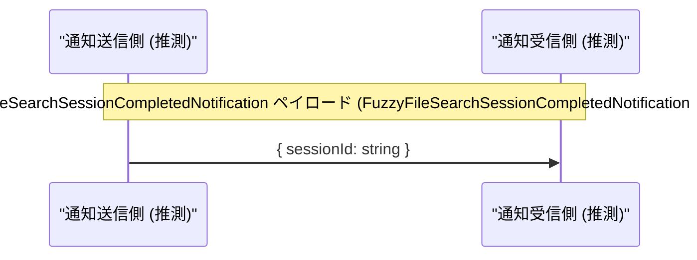

# app-server-protocol/schema/typescript/FuzzyFileSearchSessionCompletedNotification.ts

## 0. ざっくり一言

- `FuzzyFileSearchSessionCompletedNotification` という通知メッセージの **型定義（スキーマ）** を 1 つだけ公開する TypeScript ファイルです（`FuzzyFileSearchSessionCompletedNotification.ts:L5-5`）。
- Rust 側から `ts-rs` によって自動生成されており、手動編集しないことがコメントで明示されています（`FuzzyFileSearchSessionCompletedNotification.ts:L1-3`）。

---

## 1. このモジュールの役割

### 1.1 概要

- このモジュールは、`FuzzyFileSearchSessionCompletedNotification` という **通知オブジェクトの形** を TypeScript の型として定義します（`FuzzyFileSearchSessionCompletedNotification.ts:L5-5`）。
- オブジェクトは `sessionId: string` という単一のプロパティを持つことが要求されます（`FuzzyFileSearchSessionCompletedNotification.ts:L5-5`）。
- コメントから、この型は `ts-rs` によって Rust 側の型定義から自動生成されたものであり、手動変更は想定されていません（`FuzzyFileSearchSessionCompletedNotification.ts:L1-3`）。

### 1.2 アーキテクチャ内での位置づけ

コメントとディレクトリ構成（`app-server-protocol/schema/typescript`）から、この型は「アプリケーションサーバーのプロトコルを TypeScript で表現するスキーマ群」の一部であることが推測できます。ただし、**具体的な呼び出し元や利用箇所はこのチャンクには現れません**。

推測ベースでの関係イメージは次の通りです（実際のファイル名・モジュール名は不明です）:



- `RustType` と `TsApp` は **このチャンクには現れない** ため、あくまで推測的なノードです。
- `TsSchema` ノードのみが、このファイルで確認できる実体です。

### 1.3 設計上のポイント

コードから読み取れる特徴は次の通りです。

- **自動生成コード**  
  - 冒頭コメントで「GENERATED CODE」「Do not edit manually」と明示されています（`FuzzyFileSearchSessionCompletedNotification.ts:L1-3`）。
  - 設計上の変更は生成元（Rust 側）で行う前提です。
- **責務の限定**  
  - 実行時ロジックや関数は一切持たず、純粋な型エイリアスだけを提供します（`FuzzyFileSearchSessionCompletedNotification.ts:L5-5`）。
- **静的型安全性**  
  - TypeScript の型システムにより、`sessionId` プロパティが必須で `string` 型であることがコンパイル時に保証されます（`FuzzyFileSearchSessionCompletedNotification.ts:L5-5`）。
- **エラーハンドリング / 並行性**  
  - このモジュール自体には実行時処理がないため、エラーハンドリングや並行性に関するロジックは含まれていません。

---

## 2. 主要な機能一覧

このファイルが提供する主な要素は 1 つだけです。

- `FuzzyFileSearchSessionCompletedNotification`:  
  `sessionId: string` を持つ通知オブジェクトの TypeScript 型定義（`FuzzyFileSearchSessionCompletedNotification.ts:L5-5`）

---

## 3. 公開 API と詳細解説

### 3.1 型一覧（構造体・列挙体など）

| 名前 | 種別 | フィールド概要 | 役割 / 用途 | 定義位置 |
|------|------|----------------|-------------|----------|
| `FuzzyFileSearchSessionCompletedNotification` | 型エイリアス（オブジェクト型） | `sessionId: string`（必須） | 「ファジーなファイル検索セッションの完了」を表す通知メッセージ（と解釈できる）オブジェクトの形を表す。型チェック用のスキーマとして利用される。| `FuzzyFileSearchSessionCompletedNotification.ts:L5-5` |

補足:

- フィールド `sessionId` は `string` 型であり、オプショナルではないため、型レベルでは `undefined` や `null` は許容されません（`FuzzyFileSearchSessionCompletedNotification.ts:L5-5`）。

### 3.2 関数詳細（最大 7 件）

- **このファイルには関数やメソッドは定義されていません**（`FuzzyFileSearchSessionCompletedNotification.ts:L1-5`）。
- そのため、実行時のコアロジック・エラーハンドリング・並行処理といった振る舞いは、このファイル単体からは存在しません。

### 3.3 その他の関数

- 同様に、ヘルパー関数やラッパー関数も一切定義されていません（`FuzzyFileSearchSessionCompletedNotification.ts:L1-5`）。

---

## 4. データフロー

このファイルには関数呼び出しや I/O は含まれていませんが、型名とディレクトリ名から「通知メッセージのペイロード」として使われる典型的な流れを **推測ベース** で示します。



説明:

- この図は、`FuzzyFileSearchSessionCompletedNotification` 型のオブジェクトがどのように送受信されるかの**イメージ**です。
- 実際にどのモジュールが `Producer` / `Consumer` に相当するかは、**このチャンクには現れません**。

---

## 5. 使い方（How to Use）

### 5.1 基本的な使用方法

この型は、通知オブジェクトの形を静的に保証するために利用できます。以下は典型的な利用イメージです。

```typescript
// FuzzyFileSearchSessionCompletedNotification 型をインポートする
import type { FuzzyFileSearchSessionCompletedNotification } from "./FuzzyFileSearchSessionCompletedNotification";

// 通知を受け取って処理する関数の例
function handleNotification(
    notification: FuzzyFileSearchSessionCompletedNotification, // 型によって sessionId が必須で string とわかる
): void {
    // 型安全: notification.sessionId は string として扱える
    console.log("Session completed:", notification.sessionId);
}
```

この例で分かるポイント:

- `notification.sessionId` にアクセスするとき、TypeScript が `string` 型であることを保証するため、IDE 補完やリファクタリングが安全に行えます（`FuzzyFileSearchSessionCompletedNotification.ts:L5-5` に基づく）。

### 5.2 よくある使用パターン

1. **通知受信時のパラメータ型として利用**

```typescript
function onMessageReceived(raw: unknown) {
    // 実際にはここで runtime のバリデーションが必要になる（型定義だけでは足りない）
    const notification = raw as FuzzyFileSearchSessionCompletedNotification; // 型アサーション
    
    // コンパイル時には sessionId が必須な string だとみなされる
    console.log(notification.sessionId);
}
```

1. **送信前のオブジェクト整形に利用**

```typescript
function buildNotification(sessionId: string): FuzzyFileSearchSessionCompletedNotification {
    return { sessionId }; // 型により、他の不要なプロパティを付けないようにできる
}
```

### 5.3 よくある間違い（想定されるもの）

型定義だけでは **実行時の形までは保証しない** ため、JSON からのパース等で誤用される可能性があります。

```typescript
// 間違い例: runtime での形を確認せずに利用する
function wrong(raw: any) {
    const notification: FuzzyFileSearchSessionCompletedNotification = raw;
    // raw が { sessionId: 123 } のように string でなかった場合、
    // コンパイルは通るが runtime で意図しない状態になる可能性がある
    console.log(notification.sessionId.toUpperCase()); // 実行時エラーの可能性
}

// よい例: runtime チェックを挟む
function isNotification(
    value: unknown,
): value is FuzzyFileSearchSessionCompletedNotification {
    return (
        typeof value === "object" &&
        value !== null &&
        // 型情報からフィールド名 "sessionId" と string 型をチェック
        typeof (value as any).sessionId === "string"
    );
}

function safe(raw: unknown) {
    if (isNotification(raw)) {
        console.log(raw.sessionId.toUpperCase());
    } else {
        console.warn("Invalid notification payload", raw);
    }
}
```

### 5.4 使用上の注意点（まとめ）

- **前提条件**
  - 型エイリアスだけでは実行時の形を保証しないため、外部データ（JSON, WebSocket メッセージなど）に対しては別途 runtime バリデーションが必要です。
- **禁止事項 / 注意**
  - ファイル先頭コメントにある通り、**この TypeScript ファイルを直接編集しない**ことが前提です（`FuzzyFileSearchSessionCompletedNotification.ts:L1-3`）。生成元（Rust 側）を変更し、`ts-rs` による再生成が必要になります。
- **TypeScript 特有の安全性**
  - コンパイル時には `sessionId` の存在と `string` 型が強制されるため、IDE 補完・型チェックにより多くのバグを防げます（`FuzzyFileSearchSessionCompletedNotification.ts:L5-5`）。

---

## 6. 変更の仕方（How to Modify）

### 6.1 新しい機能を追加する場合

このファイルは `ts-rs` によって生成されているため（`FuzzyFileSearchSessionCompletedNotification.ts:L1-3`）、**直接編集は推奨されません**。新しいフィールドを追加したい場合の一般的な流れは次の通りです（推測ベース）:

1. **生成元の Rust 型定義を変更**  
   - Rust 側の `struct` や `enum` にフィールドを追加・変更する（生成元のファイルパスはこのチャンクには現れません）。
2. **`ts-rs` を再実行**  
   - ビルドスクリプトやコマンドを通じて TypeScript ファイルを再生成する。
3. **TypeScript 側の利用コードを更新**  
   - 追加フィールドを使う箇所の型エラーを解消しつつ、新機能を反映する。

### 6.2 既存の機能を変更する場合

- `sessionId` の型を `string` 以外に変更したい、名前を変えたい場合も、同様に **生成元 Rust 型の変更 → 再生成** という手順が必要です（`FuzzyFileSearchSessionCompletedNotification.ts:L1-3, L5-5`）。
- 変更時に確認すべき契約:
  - `sessionId` が「必須」であることを前提にしている呼び出し側コードが存在する可能性があります。
  - `sessionId` の意味（セッションの一意識別子など）は、このチャンクからは分かりませんが、他コードでロジック的に依存している可能性があります。

---

## 7. 関連ファイル

このチャンクには具体的な関連ファイル名は現れませんが、コメントと配置から、次のような関連コンポーネントが存在すると考えられます（ファイルパスは不明であり、推測であることに注意してください）。

| パス / 名前 | 役割 / 関係 |
|------------|------------|
| Rust 側の生成元型（パス不明） | `ts-rs` により本 TypeScript 型の元となる Rust 型定義。`sessionId` などのフィールド構造を決定する。※このチャンクには現れません。 |
| `ts-rs` ビルドスクリプト / 設定（パス不明） | Rust 型から TypeScript 型を生成する設定。ファイル先頭コメントにより存在が示唆されます（`FuzzyFileSearchSessionCompletedNotification.ts:L1-3`）。 |
| TypeScript 側の通知処理コード（パス不明） | `FuzzyFileSearchSessionCompletedNotification` 型をインポートして利用するコード群。通知の送受信処理を担当するはずですが、このチャンクには現れません。 |

---

### Bugs / Security / Contracts / Edge Cases / Tests / Performance について

- **Bugs**:  
  - 型定義のみであり、実行時ロジックがないため、このファイル単体に起因するランタイムバグは想定しにくいです。
  - ただし、「型は string だが実際の JSON は number だった」といった **型と実データの乖離** は、runtime 側のバリデーション不足として発生し得ます。
- **Security**:  
  - この型自体はセキュリティ機構を持ちませんが、外部からの入力をこの型にキャストする場合、**検証なしの型アサーション** は意図しないデータの受け入れにつながる可能性があります。
- **Contracts（契約）**:  
  - 契約として、「通知オブジェクトには必ず `sessionId: string` が存在する」という前提が暗黙に置かれます（`FuzzyFileSearchSessionCompletedNotification.ts:L5-5`）。
- **Edge Cases**:  
  - 型レベルでは `""`（空文字）も許容されます。空文字を許すかどうかはビジネスロジック側で判断する必要があります。
  - `null` や `undefined` は型上許容されませんが、runtime データとしては入り得るため、バリデーションが必要です。
- **Tests**:  
  - このファイル内にはテストコードは存在しません（`FuzzyFileSearchSessionCompletedNotification.ts:L1-5`）。
- **Performance / Scalability**:  
  - 純粋な型定義であり、パフォーマンスやスケーラビリティへの直接的な影響はありません。

このファイルは、アプリケーション全体の中では「通知データ構造を型安全に表現するための最小限のスキーマ」と位置づけられると整理できます。
