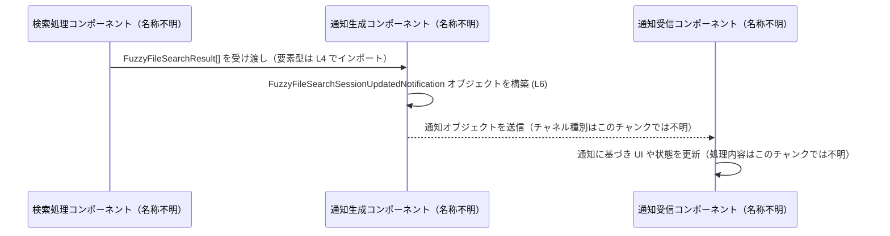

# app-server-protocol/schema/typescript/FuzzyFileSearchSessionUpdatedNotification.ts

## 0. ざっくり一言

ファジー（あいまい）ファイル検索セッションの「更新通知」のペイロード構造を、TypeScript の型として定義した**自動生成スキーマファイル**です（`FuzzyFileSearchSessionUpdatedNotification.ts:L1-3, L6`）。

---

## 1. このモジュールの役割

### 1.1 概要

- このモジュールは、**ファジーファイル検索セッションの状態更新通知**を表現するための型  
  `FuzzyFileSearchSessionUpdatedNotification` を 1 つ提供します（`FuzzyFileSearchSessionUpdatedNotification.ts:L6`）。
- 通知には
  - セッションを識別する `sessionId: string`
  - 実行された検索クエリ `query: string`
  - 検索結果一覧 `files: Array<FuzzyFileSearchResult>`
  が含まれます（`FuzzyFileSearchSessionUpdatedNotification.ts:L6`）。

### 1.2 アーキテクチャ内での位置づけ

このファイルは「app-server-protocol/schema/typescript」というパス名から、プロトコル/スキーマ層の一部であることが示唆されますが、**実際の利用箇所（送信側・受信側）はこのチャンクには現れません**。

少なくとも、次の依存関係はコードから読み取れます。

- 本ファイルの型 `FuzzyFileSearchSessionUpdatedNotification` が、
- 同一ディレクトリの `./FuzzyFileSearchResult` からインポートされる  
  型 `FuzzyFileSearchResult` に依存している（`FuzzyFileSearchSessionUpdatedNotification.ts:L4, L6`）。

```mermaid
graph LR
  subgraph "app-server-protocol/schema/typescript (L1-6)"
    FileFFSSUN["FuzzyFileSearchSessionUpdatedNotification.ts (L1-6)"]
    TypeFFSSUN["FuzzyFileSearchSessionUpdatedNotification 型 (L6)"]
  end

  subgraph "別ファイル（このチャンクには定義なし）"
    TypeFFSR["FuzzyFileSearchResult 型<br/>from \"./FuzzyFileSearchResult\" (L4)"]
  end

  FileFFSSUN --> TypeFFSSUN
  TypeFFSSUN --> TypeFFSR
```

### 1.3 設計上のポイント

- **自動生成コードであることが明示**  
  - `// GENERATED CODE! DO NOT MODIFY BY HAND!`（`L1`）  
  - `ts-rs` による生成ファイルであり、手動編集禁止と書かれています（`L3`）。
- **型定義のみで、実行時ロジックを持たない**
  - ファイル内には `export type` による型エイリアス定義のみがあり（`L6`）、関数やクラス、値の定義はありません。
  - したがって、このモジュールは**コンパイル時の型チェック専用**であり、実行時の挙動や副作用を持ちません。
- **`import type` による純粋な型依存**
  - `import type { FuzzyFileSearchResult } from "./FuzzyFileSearchResult";`（`L4`）により、ランタイムでは削除される「型のみのインポート」として定義されています。
  - これにより、バンドル時や実行時に不要な依存を発生させない設計になっています。
- **状態・並行性**
  - 型定義だけで**状態を保持しない**ため、このモジュール単体には並行性やスレッド安全性に関する問題は存在しません。
  - 並行性上の注意は、この型を利用するロジック側に委ねられます（このチャンクには現れません）。

---

## 2. 主要な機能一覧

このモジュールが提供する機能は 1 つに集約されています。

- `FuzzyFileSearchSessionUpdatedNotification` 型:  
  ファジーファイル検索セッションの更新通知ペイロード（セッションID、検索クエリ、検索結果一覧）の構造を表現する。

---

## 3. 公開 API と詳細解説

### 3.1 型一覧（構造体・列挙体など）

#### コンポーネントインベントリー

| 名前 | 種別 | 役割 / 用途 | 根拠 |
|------|------|-------------|------|
| `FuzzyFileSearchSessionUpdatedNotification` | 型エイリアス（オブジェクト型） | ファジーファイル検索セッションの更新通知ペイロードを表す | `FuzzyFileSearchSessionUpdatedNotification.ts:L6` |
| `FuzzyFileSearchResult` | 型（外部からの型インポート） | `files` 配列の要素型として使用される検索結果1件の表現。構造はこのチャンクには現れません。 | `FuzzyFileSearchSessionUpdatedNotification.ts:L4, L6` |

#### `FuzzyFileSearchSessionUpdatedNotification` のフィールド詳細

`export type FuzzyFileSearchSessionUpdatedNotification = { ... };`（`L6`）から読み取れるフィールド構造を整理します。

| フィールド名 | 型 | 必須/任意 | 説明 | 根拠 |
|-------------|----|-----------|------|------|
| `sessionId` | `string` | 必須 | 検索セッションを識別するIDを表すと解釈できます（用途は命名からの推測であり、コードからは厳密な意味は分かりません）。 | `FuzzyFileSearchSessionUpdatedNotification.ts:L6` |
| `query` | `string` | 必須 | 実行された検索クエリ文字列を表すと解釈できます（同上、命名からの推測）。 | `FuzzyFileSearchSessionUpdatedNotification.ts:L6` |
| `files` | `Array<FuzzyFileSearchResult>` | 必須 | 検索結果の一覧。各要素は別ファイルで定義された `FuzzyFileSearchResult` 型です。空配列も許容されます。 | `FuzzyFileSearchSessionUpdatedNotification.ts:L6` |

- 「必須」としている根拠は、`?`（オプショナル）や `| undefined` が付与されていないためです（`L6`）。
- `null` や `undefined` は型に含まれていないため、**型システム上は許容されません**。

### 3.2 関数詳細（最大 7 件）

このモジュールには**関数・メソッド定義が存在しません**。

- ファイル全体を見ても `function` キーワードやアロー関数（`() =>`）などは登場せず、  
  `import type` と `export type` のみで構成されています（`FuzzyFileSearchSessionUpdatedNotification.ts:L1-6`）。
- したがって、関数詳細テンプレートに沿って説明すべき対象はありません。

### 3.3 その他の関数

- 補助関数やラッパー関数も **一切定義されていません**（`FuzzyFileSearchSessionUpdatedNotification.ts:L1-6`）。

---

## 4. データフロー

このファイル自体にはロジックがないため、**処理フローは現れていません**。  
ここでは、この型を用いた**想定的な利用シナリオの一例**として、データフローを示します。  
（以下はあくまで一般的な使い方の例であり、実際の実装がこの通りであるとは限りません。）



要点:

- **入力データ**: `FuzzyFileSearchResult` 型の配列（`L4`参照）。
- **通知生成**: その配列と `sessionId`, `query` をまとめて  
  `FuzzyFileSearchSessionUpdatedNotification` 型のオブジェクトとして構築（`L6`）。
- **送信/受信**: どのようなプロトコル（WebSocket, HTTP, IPC など）で送信されるかはこのファイルからは分かりません。

---

## 5. 使い方（How to Use）

### 5.1 基本的な使用方法

`FuzzyFileSearchSessionUpdatedNotification` 型の値を生成し、JSON にして送信する例です。  
`FuzzyFileSearchResult` の具体的なフィールドはこのチャンクには現れないため、コメントで示しています。

```typescript
import type { FuzzyFileSearchSessionUpdatedNotification } from "./FuzzyFileSearchSessionUpdatedNotification"; // 通知ペイロードの型をインポート（L6）
import type { FuzzyFileSearchResult } from "./FuzzyFileSearchResult";                                       // 検索結果1件を表す型をインポート（L4）

// 検索結果の配列を用意する（実際のフィールド構造は FuzzyFileSearchResult 側の定義に依存する）
const files: FuzzyFileSearchResult[] = []; // ここでは空配列として初期化

// 通知ペイロードのオブジェクトを作成する
const notification: FuzzyFileSearchSessionUpdatedNotification = {
  sessionId: "session-1234", // セッションID（string 型、必須）
  query: "main.ts",          // 検索クエリ（string 型、必須）
  files,                     // 検索結果一覧（Array<FuzzyFileSearchResult> 型、必須）
};

// JSON 文字列にシリアライズして送信するなどの処理に利用できる
const payload = JSON.stringify(notification); // ランタイムでは通常のオブジェクトとして扱われる
```

TypeScript 特有のポイント:

- `FuzzyFileSearchSessionUpdatedNotification` によって、**IDE 補完**や**コンパイル時型チェック**が働きます。
- ただし、`JSON.stringify` やネットワーク越しのデータは**実行時には型情報を持たない**ため、  
  受信側でのバリデーションは別途必要になります（後述）。

### 5.2 よくある使用パターン

#### パターン1: 受信した JSON の型付け（型ガード利用）

ネットワーク等から受信した JSON を `FuzzyFileSearchSessionUpdatedNotification` として扱う簡易例です。  
TypeScript では、`JSON.parse` の結果は `any`/`unknown` になるため、自前でチェックする必要があります。

```typescript
import type { FuzzyFileSearchSessionUpdatedNotification } from "./FuzzyFileSearchSessionUpdatedNotification"; // 型定義をインポート

// JSON 文字列を受信したと仮定する
const raw: string = receiveJsonStringFromSomewhere(); // 実際の受信処理はこのコードでは未定義

// JSON.parse の戻り値は実行時には型不明なので unknown として受け取るのが安全
const parsed: unknown = JSON.parse(raw);

// 簡易な型ガード関数（完全な検証ではなく最小限の例）
function isFuzzyFileSearchSessionUpdatedNotification(
  value: unknown,
): value is FuzzyFileSearchSessionUpdatedNotification {
  if (typeof value !== "object" || value === null) return false;

  const v = value as any;
  return (
    typeof v.sessionId === "string" &&
    typeof v.query === "string" &&
    Array.isArray(v.files)
  );
}

// 型ガードで検証してから安全に扱う
if (!isFuzzyFileSearchSessionUpdatedNotification(parsed)) {
  throw new Error("無効な FuzzyFileSearchSessionUpdatedNotification です");
}

const notification: FuzzyFileSearchSessionUpdatedNotification = parsed;
// ここから先は notification.sessionId / notification.query / notification.files に型安全にアクセスできる
```

ポイント:

- `unknown` 型を経由し、**型ガード**でチェックしてから具体的な型として扱うことで、  
  型安全性を高めています（`any` 直接使用より安全）。
- このファイルは型定義のみのため、**実行時の検証ロジックは利用側で実装する必要があります**。

### 5.3 よくある間違い

#### 例1: `files` を省略してしまう

```typescript
import type { FuzzyFileSearchSessionUpdatedNotification } from "./FuzzyFileSearchSessionUpdatedNotification";

// 間違い例: files フィールドを省略している
const badNotification: FuzzyFileSearchSessionUpdatedNotification = {
  // @ts-expect-error files が必須フィールドのためコンパイルエラーになる
  sessionId: "session-1",
  query: "hello",
};

// 正しい例: files を空配列でもよいので必ず指定する
const okNotification: FuzzyFileSearchSessionUpdatedNotification = {
  sessionId: "session-1",
  query: "hello",
  files: [], // 検索結果がなければ空配列を指定
};
```

- 型定義上、`files` は `Array<FuzzyFileSearchResult>` 型で**必須**です（`L6`）。  
  省略するとコンパイルエラーになります。

#### 例2: 実行時に不正な形のオブジェクトを信頼してしまう

```typescript
// 注意: これは良くない例
const obj = JSON.parse(raw);

// as での型アサーションだけに頼ると、実行時に形が違ってもコンパイラは検出できない
const unsafeNotification = obj as FuzzyFileSearchSessionUpdatedNotification;

// unsafeNotification.files が配列でないなどのケースでは、後続処理でランタイムエラーになる可能性がある
```

- TypeScript の型は**コンパイル時のみ**有効であり、`as` による型アサーションは  
  実行時の形状チェックを行わない点に注意が必要です。

### 5.4 使用上の注意点（まとめ）

- **必須フィールドの指定**
  - `sessionId`, `query`, `files` はすべて必須です（`L6`）。省略するとコンパイルエラーになります。
- **`files` の扱い**
  - 空配列は許容されます。検索結果が0件の場合は `files: []` とするのが素直な表現です。
- **実行時のバリデーション**
  - この型は**コンパイル時の型チェックのみ**提供します。  
    外部から受信したデータには、型ガードやスキーマバリデータ（Zod など）による検証が推奨されます。
- **並行性・スレッド安全性**
  - 型定義そのものは状態を持たず、どのスレッド・コンテキストから参照しても問題ありません。
  - ただし、同じ `sessionId` に対して複数の通知が同時に来る場合の扱いなどは、利用側の実装に依存します（このチャンクからは不明）。
- **自動生成ファイルであること**
  - `L1-3` のコメントにある通り、「手で編集しない」ことが前提です。  
    直接編集すると、再生成時に上書きされる・Rust 側定義と不整合になる、といった問題が起こりえます。

---

## 6. 変更の仕方（How to Modify）

### 6.1 新しい機能を追加する場合

このファイルは `ts-rs` により自動生成されており、コメントで**手動変更禁止**が明記されています（`L1-3`）。  
したがって、新しいフィールドの追加などを行う場合、一般的には次の方針になります。

1. **元定義（Rust 側など）の変更**
   - `ts-rs` は通常、Rust の構造体や型から TypeScript の型を生成します（ツール一般の仕様）。
   - 新しい通知内容を追加したい場合は、**この TypeScript ファイルではなく、生成元の型定義**を変更する必要があります。  
     （生成元のファイル場所はこのチャンクには現れません。）

2. **自動生成の再実行**
   - 元定義を変更後、`ts-rs` のコード生成を再実行し、本ファイルを含むスキーマ一式を再生成します。

3. **利用側コードの更新**
   - 新しく追加したフィールドを利用するコード（送信側・受信側）の更新が必要になります。  
     利用箇所はこのチャンクには現れないため、検索などで確認する必要があります。

### 6.2 既存の機能を変更する場合

既存フィールドの型や名前を変更する場合も、同様に**生成元の型定義を変更する**のが前提になります。

変更時の注意点:

- **互換性の破壊**
  - `sessionId` や `query` の型を `string` 以外に変えたり、`files` をオプショナルにするなどの変更は、  
    既存の送信側・受信側のコードを壊す可能性があります。
- **プロトコルの両端の同期**
  - 「app-server-protocol」というパス名から、サーバーとクライアント間のプロトコルであることが想定されますが、  
    実際の構成はこのチャンクでは分かりません。  
    いずれにせよ、**プロトコルの両端で同じスキーマ定義を共有していること**が前提となります。
- **テスト**
  - このチャンクにはテストコードは現れません。  
    変更後は、通知を送受信するエンドツーエンドのテストなどでスキーマの整合性を確認する必要があります。

---

## 7. 関連ファイル

このモジュールと密接に関係するファイルは、コードから次の 1 つだけ確認できます。

| パス / モジュール指定 | 役割 / 関係 |
|-----------------------|------------|
| `"./FuzzyFileSearchResult"` | `FuzzyFileSearchResult` 型をエクスポートするモジュールです（`import type { FuzzyFileSearchResult } from "./FuzzyFileSearchResult";` `L4`）。本ファイルの `files: Array<FuzzyFileSearchResult>` フィールドの要素型として使用されます（`L6`）。構造はこのチャンクには現れません。 |

このほか、`ts-rs` の生成元となる Rust 側の型定義ファイルが存在すると考えられますが、**このチャンクには現れず、パスや名称も不明**です。
