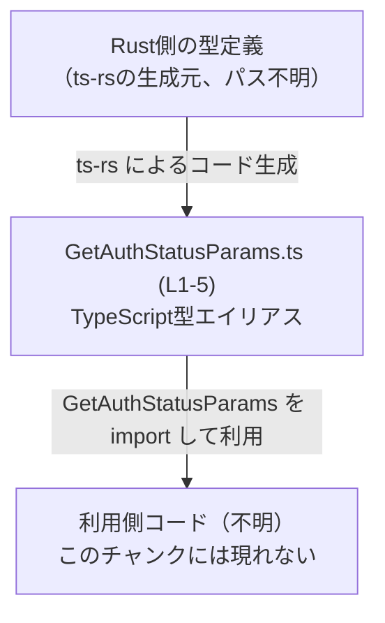
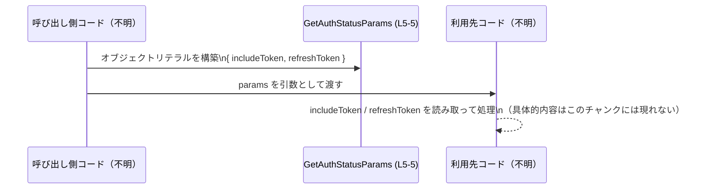

# app-server-protocol\schema\typescript\GetAuthStatusParams.ts

## 0. ざっくり一言

`GetAuthStatusParams` という 2 つのフラグを持つオブジェクト型を、TypeScript の `type` エイリアスとして 1 つだけ公開する、自動生成ファイルです（用途は名前から認証状態取得用パラメータと想定されますが、コードからは断定できません）。  
根拠: 自動生成コメントと型定義がこの 1 つだけであること（`GetAuthStatusParams.ts:L1-5`）。

---

## 1. このモジュールの役割

### 1.1 概要

- このファイルは `GetAuthStatusParams` という **公開型エイリアス** を 1 つ定義します（`export type`）。  
  根拠: `export type GetAuthStatusParams = ...`（`GetAuthStatusParams.ts:L5-5`）。
- 型は `includeToken` と `refreshToken` という 2 つのプロパティを持つオブジェクトで、どちらも `boolean | null` 型です（真偽値か `null` のいずれか）。  
  根拠: `{ includeToken: boolean | null, refreshToken: boolean | null, }`（`GetAuthStatusParams.ts:L5-5`）。
- ファイル先頭に自動生成コメントがあり、`ts-rs` によって生成されたコードであり、手動編集禁止であることが明示されています。  
  根拠: `GENERATED CODE! DO NOT MODIFY BY HAND!` と `This file was generated by [ts-rs]...`（`GetAuthStatusParams.ts:L1-3`）。

### 1.2 アーキテクチャ内での位置づけ

- パス `app-server-protocol\schema\typescript` から、このファイルは「アプリケーションサーバープロトコルの TypeScript スキーマ定義群」の一部と解釈できますが、具体的な利用箇所はこのチャンクには現れません。
- コメントから、Rust 側の型定義を `ts-rs` で TypeScript に変換した成果物であることが分かります（`GetAuthStatusParams.ts:L1-3`）。
- このファイル自身は他のモジュールを `import` しておらず、**依存は 0** です。一方で、他ファイルから `GetAuthStatusParams` が `import` されて利用されることが想定されますが、利用元は不明です。

この関係を簡単な Mermaid 図で表すと次のようになります。



### 1.3 設計上のポイント

- **自動生成であること**  
  - 先頭コメントで「手で編集しないこと」が明示されており、Rust 側の定義がソース・オブ・トゥルースになっていると解釈できます（`GetAuthStatusParams.ts:L1-3`）。
- **純粋な型定義のみ**  
  - 実行時ロジック（関数やクラス）は一切なく、型チェック専用のファイルです（`GetAuthStatusParams.ts:L5-5`）。
- **null 許容のブール値**  
  - 両プロパティとも `boolean | null` であり、`true / false / null` の 3 値を区別できます。プロパティ自体は必須で、`undefined` は許容されません（型から読み取れる仕様、`GetAuthStatusParams.ts:L5-5`）。
- **エラーハンドリング・並行性**  
  - 関数や実行時コードが存在しないため、このファイル単体ではエラーハンドリングや並行性に関するロジックはありません。

---

## 2. 主要な機能一覧

このファイルが提供する「機能」は、型定義 1 つに集約されています。

- `GetAuthStatusParams` 型の定義:  
  2 つのフラグ `includeToken` / `refreshToken`（`boolean | null`）から成るオブジェクト型を提供します（`GetAuthStatusParams.ts:L5-5`）。

---

## 3. 公開 API と詳細解説

### 3.1 型一覧（構造体・列挙体など）

#### コンポーネントインベントリー

| 名前 | 種別 | 役割 / 用途（コードから分かる範囲） | 定義位置 |
|------|------|--------------------------------------|----------|
| `GetAuthStatusParams` | 型エイリアス (`type`) | 2 つのプロパティ `includeToken` / `refreshToken` を持つ、`boolean \| null` 型のオブジェクトを表す。名前からは「何らかの Auth ステータス取得処理のパラメータ」と想定されるが、用途はこのチャンクからは断定できない。 | `GetAuthStatusParams.ts:L5-5` |

##### フィールド詳細

| フィールド名 | 型 | 説明（コードから分かる範囲） | 定義位置 |
|-------------|----|------------------------------|----------|
| `includeToken` | `boolean \| null` | 真偽値または `null`。`true` / `false` / `null` の 3 値を取り得る。必須プロパティであり `undefined` は型的に許可されない。意味は命名からのみ推測可能で、このチャンクからは断定できない。 | `GetAuthStatusParams.ts:L5-5` |
| `refreshToken` | `boolean \| null` | `includeToken` と同じく、真偽値または `null` の 3 値ブール。プロパティ自体は必須。具体的用途は命名からの推測に留まる。 | `GetAuthStatusParams.ts:L5-5` |

### 3.2 関数詳細（最大 7 件）

このファイルには関数・メソッドは定義されていません。  
根拠: `export type` 以外の宣言が存在しない（`GetAuthStatusParams.ts:L1-5`）。

### 3.3 その他の関数

同上。このチャンクには補助関数やラッパー関数も現れません。

---

## 4. データフロー

このファイル単体には実行時処理がないため、**実装としてのデータフローは存在しません**。  
ここでは、この型が一般的にどのように流れることが想定されるかを、あくまで「利用例レベル」の概念図として示します。

- 呼び出し側コードが `GetAuthStatusParams` 型のオブジェクトを構築する。
- それを何らかの関数・API に引数として渡す。
- 利用先で `includeToken`・`refreshToken` の値に応じて振る舞いが変化する（実際の処理はこのチャンクには現れません）。



この図は、型の使われ方の典型例を表すものであり、実際のプロジェクト内での具体的フローはこのチャンクからは分かりません。

---

## 5. 使い方（How to Use）

このセクションのコードは **利用例** であり、実際のリポジトリ内のコードではありません。

### 5.1 基本的な使用方法

`GetAuthStatusParams` 型のオブジェクトを作成し、関数の引数として使う例です。

```typescript
// 型定義ファイルから型をインポートする例（パスはプロジェクト構成に応じて調整が必要）
import type { GetAuthStatusParams } from "./GetAuthStatusParams"; // このパスは例です

// 何らかの認証状態取得処理を行う関数の例
// 実際にどのような関数が存在するかは、このチャンクからは分かりません。
async function getAuthStatus(params: GetAuthStatusParams): Promise<void> {
    // params.includeToken と params.refreshToken は boolean | null 型
    if (params.includeToken === true) {
        // true のときにだけトークンを含める処理を行う、というような使い方が想定されます
    }

    if (params.refreshToken === true) {
        // true のときにだけトークンのリフレッシュ処理を行う、など
    }

    // null / false の扱いは利用側の設計次第です
}

// 呼び出し側での利用例
const params: GetAuthStatusParams = {
    includeToken: true,   // トークンを含めたい場合の例
    refreshToken: null,   // リフレッシュは指定なし、というような意味づけが可能
};

getAuthStatus(params).catch(console.error);
```

ポイント:

- プロパティは **必須** なので、`includeToken` と `refreshToken` をオブジェクトに必ず含める必要があります（`GetAuthStatusParams.ts:L5-5`）。
- 値は `boolean` か `null` に制限されており、`string` や `number` を入れるとコンパイルエラーになります。

### 5.2 よくある使用パターン

`boolean | null` という型から、次のような使い分けが考えられます（設計例であり、実際の意味はこのチャンクからは分かりません）。

```typescript
const alwaysInclude: GetAuthStatusParams = {
    includeToken: true,   // 常に含める
    refreshToken: false,  // リフレッシュは行わない
};

const maybeRefresh: GetAuthStatusParams = {
    includeToken: false,  // トークンは含めない
    refreshToken: true,   // 必ずリフレッシュする
};

const noPreference: GetAuthStatusParams = {
    includeToken: null,   // 特に指定しない（デフォルトの挙動に任せるなど）
    refreshToken: null,
};
```

TypeScript の静的型チェックにより、`includeToken` / `refreshToken` に `undefined` や他の型を入れようとするとエラーになります。

### 5.3 よくある間違い

#### 1. プロパティ自体を省略してしまう

```typescript
// 間違い例: 必須プロパティを省略している
const badParams: GetAuthStatusParams = {
    // includeToken: ...,  // 無い
    // refreshToken: ..., // 無い
    // → コンパイルエラーになる
};
```

- 型定義では `includeToken`・`refreshToken` に `?`（オプショナル）は付いていません（`GetAuthStatusParams.ts:L5-5`）。
- そのため、オブジェクトリテラルを作るときは **必ず両方のプロパティを指定する必要があります**。

#### 2. `undefined` を代入してしまう

```typescript
// 間違い例: boolean | null に undefined を代入している
const badParams2: GetAuthStatusParams = {
    includeToken: undefined, // 型: boolean | null には代入できない
    refreshToken: false,
};
```

- `boolean | null` には `undefined` は含まれないため、コンパイルエラーになります。

#### 3. `if (params.includeToken)` の挙動を誤解する

```typescript
function example(params: GetAuthStatusParams) {
    // これは true のときだけでなく、false / null のときはすべて「偽」として扱われます
    if (params.includeToken) {
        // includeToken === true のときだけ実行される
    }
}
```

- `null` は JavaScript では「偽」として扱われるため、`true` と `false/null` をまとめて扱いたいのか、`null` を別扱いしたいのかを意識する必要があります。

### 5.4 使用上の注意点（まとめ）

- **プロパティは必須**  
  - `includeToken` / `refreshToken` の両方を必ず設定する必要があります（`GetAuthStatusParams.ts:L5-5`）。
- **値は `boolean` か `null` のみ**  
  - `undefined` や他の型を代入するとコンパイルエラーになります。
- **3 値ブールとして扱う前提**  
  - `true` / `false` / `null` の 3 状態をどう解釈するかは利用側の契約になります。設計・実装時にチーム内で意味を明確にしておくことが重要です。
- **ランタイム安全性**  
  - この型はコンパイル時の型チェックを提供しますが、実際には JSON 等からパースした値が型に合わない可能性があります。その場合はランタイム側で検証（バリデーション）を行う必要があります。
- **並行性**  
  - このファイルは型定義のみであり、並行処理・スレッドセーフティなどの懸念は直接はありません。

---

## 6. 変更の仕方（How to Modify）

### 6.1 新しい機能を追加する場合

ここでの「新しい機能」とは、例えば `GetAuthStatusParams` に新しいプロパティを追加するような変更を指します。

1. **直接編集しない**  
   - ファイル先頭のコメントに「GENERATED CODE! DO NOT MODIFY BY HAND!」とあり、手動編集禁止です（`GetAuthStatusParams.ts:L1-3`）。
2. **Rust 側の型定義を変更する**  
   - `ts-rs` による生成元となる Rust の型（構造体など）に新しいフィールドを追加します（生成元のファイルパスはこのチャンクには現れません）。
3. **コード生成を再実行する**  
   - プロジェクトのビルドや専用スクリプトを通じて `ts-rs` を再実行し、この TypeScript ファイルを再生成します。
4. **利用箇所を更新する**  
   - 新しいプロパティを利用するコード側で、コンパイルエラーを解消しつつ、必要なロジックを追加します。

### 6.2 既存の機能を変更する場合

既存プロパティの型や名前を変える場合も、基本的な手順は同じです。

- **型や名前の変更は Rust 側で行う**  
  - 例えば `boolean | null` を `boolean` のみや `boolean | undefined` に変えたい場合、生成元となる Rust の型定義を修正し、`ts-rs` による生成をやり直します。
- **影響範囲の確認**  
  - `GetAuthStatusParams` を利用している TypeScript コードでコンパイルエラーが発生するので、それを手掛かりに影響範囲を確認します。
- **契約の変更に注意**  
  - 3 値ブールから 2 値ブールに変更するなどの「意味的な変更」は、API の契約破壊になりうるため、呼び出し側との合意が必要です。

---

## 7. 関連ファイル

このチャンクから直接パスが分かるのはこのファイル自身のみですが、コメントやパス構造から、概ね次のような関連が推測できます（推測であることを明示します）。

| パス | 役割 / 関係 |
|------|------------|
| `app-server-protocol\schema\typescript\GetAuthStatusParams.ts` | 本解説対象ファイル。`GetAuthStatusParams` 型エイリアスを定義する自動生成 TypeScript スキーマ（`GetAuthStatusParams.ts:L1-5`）。 |
| （不明: ts-rs による生成元 Rust ファイル） | コメントから、この TypeScript 型の元となる Rust 側の型定義が存在すると考えられますが、具体的なパスや型名はこのチャンクには現れません（`GetAuthStatusParams.ts:L1-3`）。 |
| `app-server-protocol\schema\typescript\*.ts`（推測） | 同じディレクトリ配下に、他のエンドポイントやスキーマに対応する TypeScript 型が並んでいる可能性がありますが、このチャンクからは実在を確認できません。 |

このファイル単体にはテストコードやユーティリティは含まれず、あくまでスキーマ定義のみが記述されています。
