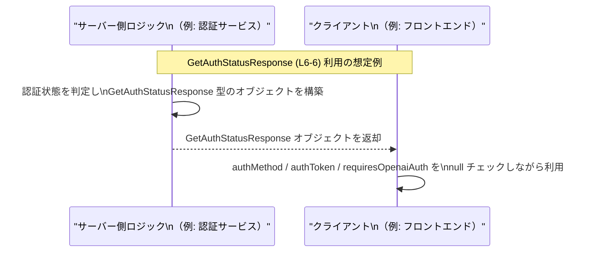

# app-server-protocol/schema/typescript/GetAuthStatusResponse.ts コード解説

## 0. ざっくり一言

- 認証状態に関する 3 つの情報（認証方式・トークン・追加認証の要否）を 1 つのオブジェクトとして表現する **TypeScript の型定義**です（GetAuthStatusResponse.ts:L6-6）。

---

## 1. このモジュールの役割

### 1.1 概要

- このモジュールは、`GetAuthStatusResponse` という型エイリアスをエクスポートし、認証状態レスポンスの形（プロパティ名と型）を定義します（GetAuthStatusResponse.ts:L6-6）。
- ファイル先頭のコメントから、このファイルは Rust 側から `ts-rs` によって自動生成されており、手動で編集しないことが前提になっています（GetAuthStatusResponse.ts:L1-3）。

### 1.2 アーキテクチャ内での位置づけ

- `GetAuthStatusResponse` 型は、`AuthMode` 型に依存しています（GetAuthStatusResponse.ts:L4, L6）。
- 実行時のコードは含まれず、**型情報のみ**を提供するモジュールです。したがって、実行パスや並行処理の起点にはならず、他のモジュールからインポートされて使用される立場になります（GetAuthStatusResponse.ts:L4-6）。

依存関係のイメージは以下のとおりです。


### 1.3 設計上のポイント

- **自動生成ファイル**  
  - `// GENERATED CODE! DO NOT MODIFY BY HAND!` と明記されており、元となる定義（Rust 側）からの自動生成結果であることがわかります（GetAuthStatusResponse.ts:L1-3）。
- **型専用の import**  
  - `import type { AuthMode } from "./AuthMode";` により、コンパイル時の型情報だけを参照し、バンドル後の実行コードには影響を与えない構成になっています（GetAuthStatusResponse.ts:L4）。
- **全プロパティが「必須かつ null 許容」**  
  - 3 フィールドはいずれも `T | null` で定義されており、プロパティ自体は必ず存在しますが、値として「存在しない状態」を `null` で表現できるようになっています（GetAuthStatusResponse.ts:L6）。
- **ロジック無し・状態無し**  
  - 関数やクラスは一切定義されておらず、純粋なデータ形状の定義だけを提供します（GetAuthStatusResponse.ts:L1-6）。

---

## 2. 主要な機能一覧

このファイルが提供する機能は、型レベルのものに限られます。

- `GetAuthStatusResponse` 型定義: 認証状態レスポンスのプロパティ構造を表現する（GetAuthStatusResponse.ts:L6）。
- `AuthMode` 型の再利用: 認証方式を表す既存の型 `AuthMode` を参照し、値のバリエーションや意味を外部の型に委譲している（GetAuthStatusResponse.ts:L4, L6）。

---

## 3. 公開 API と詳細解説

### 3.1 型一覧（構造体・列挙体など）

#### ファイル内で定義される型

| 名前                    | 種別         | 役割 / 用途                                             | 定義位置                         |
|-------------------------|--------------|----------------------------------------------------------|----------------------------------|
| `GetAuthStatusResponse` | 型エイリアス | 認証状態レスポンスの 3 つのフィールドをまとめたオブジェクト型 | GetAuthStatusResponse.ts:L6-6   |

#### 依存する外部の型

| 名前      | 種別（推測レベル） | 由来 / 関係                                                   | 使用箇所                         |
|-----------|--------------------|----------------------------------------------------------------|----------------------------------|
| `AuthMode`| 型（詳細不明）     | 相対パス `"./AuthMode"` から `import type` される型（実体はこのチャンクには現れない） | GetAuthStatusResponse.ts:L4, L6 |

> `AuthMode` が enum か型エイリアスかなどの詳細は、このチャンクからは分かりません。

#### `GetAuthStatusResponse` のフィールド構造

`GetAuthStatusResponse` は 3 つのプロパティを持つオブジェクト型として定義されています（GetAuthStatusResponse.ts:L6）。

```typescript
export type GetAuthStatusResponse = {
    authMethod: AuthMode | null,
    authToken: string | null,
    requiresOpenaiAuth: boolean | null,
};
```

各フィールドの概要は次のとおりです（型の意味は TypeScript の言語仕様に基づく事実です）。

| フィールド名            | 型                    | 説明（型から読み取れる事実）                                                                                     |
|-------------------------|-----------------------|--------------------------------------------------------------------------------------------------------------------|
| `authMethod`            | `AuthMode \| null`    | 認証方式を表す `AuthMode` 型、もしくは「値が存在しない」ことを表す `null`。`null` 許容により未設定状態も表現可能です。 |
| `authToken`             | `string \| null`      | 認証関連のトークン文字列、もしくはトークンが存在しないことを表す `null`。                                         |
| `requiresOpenaiAuth`   | `boolean \| null`     | 真偽値（`true`/`false`）または「真偽値が決まっていない状態」を表す `null`。                                       |

- 3 フィールドともにオプショナル（`prop?: ...`）ではなく、**必ずプロパティが存在する型**になっています。このため、オブジェクトを受け取る側はプロパティの存在チェックよりも、`null` かどうかのチェックを行うことになります（GetAuthStatusResponse.ts:L6）。

**契約とエッジケース（型レベル）**

この型から読み取れる契約・エッジケースは次のとおりです。

- **プロパティの存在**  
  - 3 つのプロパティはすべて必須のため、`{}` のような完全に空のオブジェクトは `GetAuthStatusResponse` としては型不一致になります（GetAuthStatusResponse.ts:L6）。
- **値がすべて `null` のケース**  
  - `authMethod`, `authToken`, `requiresOpenaiAuth` のすべてが `null` であるオブジェクトも、型としては許容されます（GetAuthStatusResponse.ts:L6）。
- **部分的に `null` のケース**  
  - 任意の組み合わせで、あるフィールドだけ `null`、他は非 `null` といった状態が表現可能です（GetAuthStatusResponse.ts:L6）。
- **null チェックの必要性**  
  - 利用側は、3 つのフィールドについて値を利用する前に `null` を考慮した分岐を書く必要があります（型が `T | null` のため）。

**セキュリティ上の注意点（型名からの注意喚起）**

- `authToken: string | null` というフィールド名から、このプロパティには認証用トークンなどの秘匿すべき値が格納される可能性がありますが、実際に何を格納しているかはこのチャンクからは分かりません（GetAuthStatusResponse.ts:L6）。
- 一般的には、トークン文字列をログ出力やブラウザの長期保存領域にそのまま保存することはリスクとなるため、利用側実装での扱いに注意が必要です。

### 3.2 関数詳細（最大 7 件）

- このファイルには関数・メソッドは一切定義されていません（GetAuthStatusResponse.ts:L1-6）。
- したがって、エラー発生条件・パニック条件・アルゴリズムのフローなど、実行ロジックに関する情報はこのチャンクからは得られません。

### 3.3 その他の関数

- 補助関数やラッパー関数も存在せず、一覧に挙げるべき関数はありません（GetAuthStatusResponse.ts:L1-6）。

---

## 4. データフロー

このファイル自体には関数や実行ロジックが含まれないため、「どのモジュールからどのように呼ばれるか」という具体的な呼び出しフローは、このチャンクだけからは分かりません。

ここでは、**型名とファイルパスから推測される典型的な利用シナリオ**として、`GetAuthStatusResponse` を API レスポンスとして使う場合の抽象的なデータフローの例を示します。実際の実装がこのとおりになっているかは、このチャンクからは断定できません。



要点（推測ベースの一般的な使われ方）:

- サーバー側ロジックで `GetAuthStatusResponse` 型に沿ったオブジェクトが生成される。
- クライアント側でこの型を用いてレスポンスを受け取り、`null` を考慮した分岐で UI や処理を制御する。
- このシナリオは型名と配置パスからの推測であり、実際の呼び出し元・呼び出し先はこのチャンクには現れません。

---

## 5. 使い方（How to Use）

### 5.1 基本的な使用方法

`GetAuthStatusResponse` を受け取って処理する関数の例です。  
`null` 許容型であることを意識した分岐を行う点がポイントです。

```typescript
// GetAuthStatusResponse 型をインポートする                             // 型定義を利用するために import する
import type { GetAuthStatusResponse } from "./GetAuthStatusResponse";   // 実行時コードには影響しない type import

// 認証状態レスポンスを処理する関数                                     // 認証状態の情報を受け取り、ログや UI 更新に使う
function handleAuthStatus(response: GetAuthStatusResponse) {            // 引数に GetAuthStatusResponse 型を指定

    // 認証方式とトークンが両方とも存在する場合の処理                  // authMethod, authToken は null 許容なので null チェックが必要
    if (response.authMethod !== null && response.authToken !== null) {  // null でない場合のみ値を安全に扱える
        console.log("ログイン済みです");                               // ここでは単純にログ出力
        // response.authMethod と response.authToken を安全に使用可能   // IDE はここで AuthMode / string と認識する
    } else {
        console.log("未ログインまたは情報不足です");                   // 認証情報が揃っていないケース
    }

    // requiresOpenaiAuth が true の場合の処理                          // boolean | null 型なので、true/false と null を区別する
    if (response.requiresOpenaiAuth === true) {                         // true と厳密比較していることがポイント
        console.log("追加の OpenAI 認証が必要です");                   // 真の場合の処理
    } else if (response.requiresOpenaiAuth === false) {                 // false の場合
        console.log("追加の OpenAI 認証は不要です");                   // 偽の場合の処理
    } else {                                                            // null または値が不明な場合
        console.log("追加認証の要否は不明です");                        // null が示す「不明・未決定」を扱う例
    }
}
```

この例では、コンパイル時に `GetAuthStatusResponse` に沿った形のオブジェクトであることが保証され、各フィールドに対する `null` チェックが IDE によって補助されます。

### 5.2 よくある使用パターン

1. **関数の戻り値として使用する**

```typescript
import type { GetAuthStatusResponse } from "./GetAuthStatusResponse";   // 型をインポート

// 認証状態を取得する関数の戻り値として利用                            // 実装詳細は省略
async function getAuthStatus(): Promise<GetAuthStatusResponse> {        // Promise の中身の型に指定
    // ... サーバーから取得する、あるいは計算する ...                   // 実際の取得処理は別途
    return {
        authMethod: null,                                               // 例: まだログインしていない
        authToken: null,
        requiresOpenaiAuth: null,
    };
}
```

1. **状態管理（state）の型として使用する**

```typescript
import type { GetAuthStatusResponse } from "./GetAuthStatusResponse";   // 状態の型として利用

// 例: React のコンポーネント内でステート型に使う                      // フレームワークはあくまで一例
type AuthState = GetAuthStatusResponse;                                 // alias をそのまま state の型に流用
```

どちらのパターンでも、**null を含む可能性があるフィールドである**ことを忘れずに扱うことが重要です。

### 5.3 よくある間違い

1. **`null` チェックをせずに値を使用してしまう**

```typescript
// 誤りの例：null チェックをせずに使用している
function wrongUsage(res: GetAuthStatusResponse) {
    // コンパイラ設定によってはエラーにならない可能性もあるが、危険な書き方
    console.log(res.authToken.toUpperCase()); // authToken が null の場合、実行時エラーになる
}
```

正しい例:

```typescript
// 正しい例：null チェックを行う
function correctUsage(res: GetAuthStatusResponse) {
    if (res.authToken !== null) {                                       // null でないことを確認
        console.log(res.authToken.toUpperCase());                       // string として安全に扱える
    }
}
```

1. **生成ファイルを直接編集してしまう**

- 先頭コメントに「DO NOT MODIFY BY HAND!」と明記されているにもかかわらず直接編集すると、再生成のタイミングで上書きされ、変更が失われます（GetAuthStatusResponse.ts:L1-3）。

### 5.4 使用上の注意点（まとめ）

- `authMethod`, `authToken`, `requiresOpenaiAuth` の 3 フィールドは **必ず存在するが `null` の可能性がある**ため、利用側では毎回 `null` を考慮した分岐を書く必要があります（GetAuthStatusResponse.ts:L6）。
- `authToken` は機密情報を含む可能性があるため、ログ出力やエラー画面などにそのまま表示しないことが望ましいです（名前からの一般的な注意であり、このチャンクからは値の具体的な内容は分かりません）。
- ファイルは自動生成されるため、構造を変更したい場合は **元となる定義（Rust 側など）を変更して再生成**する必要があります（GetAuthStatusResponse.ts:L1-3）。
- `import type` によるインポートであるため、ビルド設定やツールチェーンが TypeScript の type-only import を正しく扱える前提があります（GetAuthStatusResponse.ts:L4）。

---

## 6. 変更の仕方（How to Modify）

### 6.1 新しい機能を追加する場合

このファイルは `ts-rs` による自動生成であり、直接編集しないことが明記されています（GetAuthStatusResponse.ts:L1-3）。新しいフィールドを追加する場合の一般的な手順は次のとおりです（実際の Rust 側の構成はこのチャンクからは不明です）。

1. **元の定義を探す**  
   - コメントにあるとおり、`ts-rs` が生成元となっているため、通常は Rust 側の構造体や enum が存在します（GetAuthStatusResponse.ts:L1-3）。
2. **元定義にフィールドを追加する**  
   - Rust 側の対応する型に、新しいフィールドを追加し、`ts-rs` の derive 属性などで TypeScript への出力対象にします。
3. **コード生成を再実行する**  
   - `ts-rs` のコード生成処理を実行し、この TypeScript ファイルを再生成します。
4. **利用側コードを更新する**  
   - 新しいフィールドに対する `null` チェックや利用ロジックを、フロントエンドなどの利用側で追加します。

### 6.2 既存の機能を変更する場合

既存フィールド名や型を変更したい場合も、基本的には上記と同様に**生成元の定義を修正**する必要があります。

変更時に注意すべき点:

- **型変更の影響範囲**  
  - `authMethod`, `authToken`, `requiresOpenaiAuth` のいずれかの型を変えると、それを利用しているすべての TypeScript コードにコンパイルエラーが発生する可能性があります（GetAuthStatusResponse.ts:L6）。
- **null 許容のポリシー**  
  - `T | null` から `T` あるいは `T | undefined` に変更すると、エッジケースの扱いが変わるため、利用側の `null`/`undefined` チェックロジックを見直す必要があります。
- **自動生成との競合**  
  - このファイルを手で編集しても、再生成で上書きされるため、変更は必ず生成元で行う必要があります（GetAuthStatusResponse.ts:L1-3）。

---

## 7. 関連ファイル

このモジュールと直接の関係があるファイル・モジュールは、`import type` の参照先のみがコードから分かります。

| パス / モジュール      | 役割 / 関係                                                                                  |
|------------------------|---------------------------------------------------------------------------------------------|
| `./AuthMode`           | `AuthMode` 型を提供するモジュール。`GetAuthStatusResponse.authMethod` の型として使用される（GetAuthStatusResponse.ts:L4, L6）。中身はこのチャンクには現れないため詳細不明。 |

- テストコードやその他の関連ユーティリティについては、このチャンクには情報がなく、不明です。
- `GetAuthStatusResponse` をどの API エンドポイントやサービスが利用しているかについても、このファイル単体からは特定できません。

---

### まとめ（安全性・エッジケース・性能など）

- **安全性 / セキュリティ**  
  - 機密情報と思われる `authToken` の扱いには注意が必要ですが、具体的な利用箇所はこのチャンクには現れません（GetAuthStatusResponse.ts:L6）。
- **エッジケース**  
  - 3 プロパティがすべて `null` のケース、部分的に `null` のケースを想定して呼び出し側で分岐を書く必要があります（GetAuthStatusResponse.ts:L6）。
- **テスト**  
  - このファイル単体にはロジックがなく、型定義のみのため、テストは通常この型を利用する上位レイヤー（API ハンドラなど）で行われると考えられますが、このチャンクにはテストの情報はありません。
- **性能 / スケーラビリティ**  
  - 実行時コードがなく、型定義だけであるため、性能への直接的な影響はほぼありません（GetAuthStatusResponse.ts:L1-6）。
- **観測性（ログなど）**  
  - 型自体はログ出力を行いませんが、この型を利用する実装で `authToken` をログに書き出す際には、情報漏洩のリスクに留意する必要があります。
