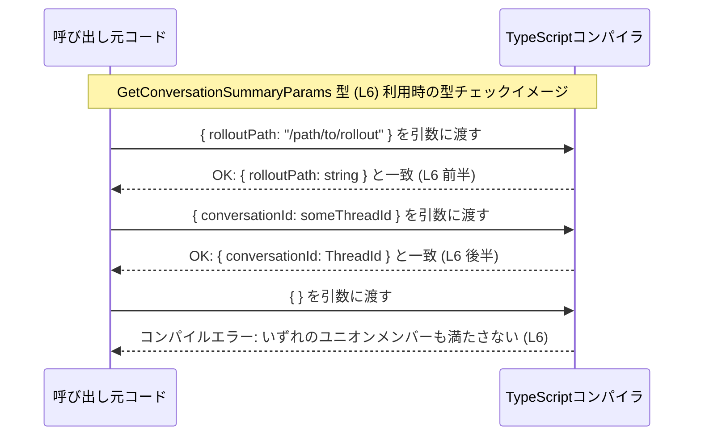

# app-server-protocol/schema/typescript/GetConversationSummaryParams.ts

## 0. ざっくり一言

`GetConversationSummaryParams` という **パラメータ用の型エイリアス**を定義する、ts-rs により自動生成された TypeScript ファイルです（`GetConversationSummaryParams.ts:L1-3, L6`）。  
この型は、`rolloutPath` か `conversationId` のいずれかを含むオブジェクトであることを静的に表現します（`GetConversationSummaryParams.ts:L6`）。

---

## 1. このモジュールの役割

### 1.1 概要

- このモジュールは、型 `GetConversationSummaryParams` を提供します（`GetConversationSummaryParams.ts:L6`）。
- コメントから、このファイルは Rust 側から `ts-rs` によって自動生成されることが分かります（`GetConversationSummaryParams.ts:L1-3`）。
- 型定義の内容から、「会話の要約を取得する処理」に渡されるパラメータを表す型と解釈できますが、この用途は **型名からの推測であり、コード上での明示はありません**（`GetConversationSummaryParams.ts:L6`）。

### 1.2 アーキテクチャ内での位置づけ

- このファイルは、型 `ThreadId` を `import type` で参照しています（`GetConversationSummaryParams.ts:L4`）。
  - `import type` であるため、**実行時には import が消え、依存は型レベルに限定される** TypeScript 構文です。
- このチャンクには `GetConversationSummaryParams` を利用するコードは含まれていないため、**どのモジュールから呼び出されるかは不明**です。

依存関係のイメージを、Mermaid の依存グラフで示します。


この図は、「`GetConversationSummaryParams` が `ThreadId` 型に依存している」ことのみを表します。  
`ThreadId` がどのような型か、どこで使われるかは **このチャンクからは分かりません**。

### 1.3 設計上のポイント

コードから読み取れる設計上の特徴は次のとおりです。

- **自動生成ファイルであることが明示されている**  
  - 「手動で編集しない」という方針がコメントで書かれています（`GetConversationSummaryParams.ts:L1-3`）。
- **型レベルのみの依存**  
  - `import type` によって、`ThreadId` への依存はコンパイル時のみです（`GetConversationSummaryParams.ts:L4`）。
- **オブジェクト型のユニオンで「どちらか一方」を表現**  
  - `{ rolloutPath: string }`  
  - `{ conversationId: ThreadId }`  
  を `|` で結合したユニオン型として `GetConversationSummaryParams` が定義されています（`GetConversationSummaryParams.ts:L6`）。
- **実行時ロジックや状態は持たない**  
  - 関数・クラス・変数の定義はなく、純粋に型エイリアスのみです（`GetConversationSummaryParams.ts:L6`）。

---

## 2. 主要な機能一覧

このモジュールが提供する「機能」はすべて型レベルのものです。

- `GetConversationSummaryParams` 型定義:  
  `rolloutPath`（文字列）**または** `conversationId`（`ThreadId` 型）のいずれかを持つパラメータオブジェクトを表現するユニオン型（`GetConversationSummaryParams.ts:L6`）。

---

## 3. 公開 API と詳細解説

### 3.1 型一覧（構造体・列挙体など）

このチャンクに現れる型・型エイリアスの一覧です。

| 名前 | 種別 | 役割 / 用途 | 定義位置 | 関連要素 |
|------|------|-------------|----------|----------|
| `GetConversationSummaryParams` | 型エイリアス（ユニオン型） | `rolloutPath` か `conversationId` のどちらかを指定するパラメータ型。会話要約取得のパラメータであると解釈できるが、用途は型名からの推測にとどまる。 | `GetConversationSummaryParams.ts:L6` | ユニオンの一方に `ThreadId` を使用（`GetConversationSummaryParams.ts:L4, L6`） |
| `ThreadId` | 型（詳細不明） | 会話スレッドなどの ID を表す型名と解釈できるが、このチャンクには定義はなく、構造は不明。`GetConversationSummaryParams` 内で使用される。 | 定義はこのチャンクには出現しない。参照は `GetConversationSummaryParams.ts:L4, L6` | 別モジュール `./ThreadId` から `import type` される（型専用インポート） |

#### `GetConversationSummaryParams` の構造

`GetConversationSummaryParams` は次の 2 パターンのどちらかに一致するオブジェクト型のユニオンです（`GetConversationSummaryParams.ts:L6`）。

1. `{ rolloutPath: string }`
2. `{ conversationId: ThreadId }`

TypeScript の構造的型付けにより、**これらのいずれかの形を満たすオブジェクトならば、追加プロパティがあっても型的には許容されます**（一般的な TypeScript のルール）。

### 3.2 関数詳細（このファイルには関数なし）

このファイルには関数・メソッド・クラス定義は存在しません（`GetConversationSummaryParams.ts:L1-6`）。  
したがって、「関数詳細」の対象はありません。

### 3.3 その他の関数

補助関数やラッパー関数も定義されていません。

---

## 4. データフロー

このファイル自体には実行時の処理は含まれていませんが、`GetConversationSummaryParams` 型が **どのように型チェックに関与するか**を、TypeScript の一般的な挙動のイメージとして示します。

> 注意: 以下の図と例は **TypeScript の一般的な利用イメージ**であり、  
> このリポジトリ内の具体的な呼び出しコードはこのチャンクには存在しません。



ここで表現しているポイントは次のとおりです（すべて `GetConversationSummaryParams.ts:L6` に由来します）。

- 少なくとも `rolloutPath` か `conversationId` のどちらかは必須であり、両方とも欠けていると型チェックに失敗する。
- `conversationId` の型は `ThreadId` 型に制約される（`GetConversationSummaryParams.ts:L4, L6`）。

---

## 5. 使い方（How to Use）

このセクションのコード例は **解説用の仮想コード**であり、このリポジトリ内に実際に存在する関数ではありません。

### 5.1 基本的な使用方法

`GetConversationSummaryParams` 型を引数に取る関数の例です。

```typescript
// この関数定義はドキュメント用の例であり、実際のコードには存在しません。
import type { GetConversationSummaryParams } from "./GetConversationSummaryParams"; // L6 の型を利用

// パラメータを受け取る仮想的な関数
function handleGetConversationSummary(params: GetConversationSummaryParams) {
    if ("rolloutPath" in params) {
        // params は { rolloutPath: string } パターンとして扱える
        console.log("rolloutPath:", params.rolloutPath);
    } else {
        // 上の条件が偽なら { conversationId: ThreadId } パターンとみなせる
        console.log("conversationId:", params.conversationId);
    }
}
```

この例が示す点:

- 引数 `params` の型は `GetConversationSummaryParams`（`GetConversationSummaryParams.ts:L6`）。
- プロパティ存在チェック（`"rolloutPath" in params`）によってユニオンを **型ガード**し、安全にプロパティへアクセスできます。

### 5.2 よくある使用パターン

#### パターン 1: `rolloutPath` で指定する

```typescript
const paramsByRolloutPath: GetConversationSummaryParams = {
    rolloutPath: "/experiment/feature-x", // string 型 (L6)
    // 他の追加プロパティを付けることも型的には可能
};
```

- `paramsByRolloutPath` はユニオンの前半 `{ rolloutPath: string }` に一致します（`GetConversationSummaryParams.ts:L6`）。

#### パターン 2: `conversationId` で指定する

```typescript
import type { ThreadId } from "./ThreadId"; // L4

declare const someThreadId: ThreadId;       // ThreadId の中身はこのチャンクからは不明

const paramsByConversationId: GetConversationSummaryParams = {
    conversationId: someThreadId,          // ThreadId 型 (L6)
};
```

- `paramsByConversationId` はユニオンの後半 `{ conversationId: ThreadId }` に一致します（`GetConversationSummaryParams.ts:L6`）。

### 5.3 よくある間違い

#### 間違い例: ユニオンの片側だけを決め打ちしてアクセスする

```typescript
function wrongUsage(params: GetConversationSummaryParams) {
    // コンパイルエラー:
    // プロパティ 'rolloutPath' は型 '{ conversationId: ThreadId; }' に存在しない可能性あり
    console.log(params.rolloutPath);
}
```

#### 正しい例: 型ガードでどちらのパターンかを判定する

```typescript
function correctUsage(params: GetConversationSummaryParams) {
    if ("rolloutPath" in params) {
        console.log(params.rolloutPath); // { rolloutPath: string } パターン
    } else {
        console.log(params.conversationId); // { conversationId: ThreadId } パターン
    }
}
```

ポイント:

- ユニオン型では、**両方のパターンを考慮した分岐を用意する必要がある**という TypeScript の型安全性の性質を示しています（`GetConversationSummaryParams.ts:L6` に由来）。

### 5.4 使用上の注意点（まとめ）

- **前提条件**
  - `GetConversationSummaryParams` で表現できるオブジェクトは、最低でも `rolloutPath: string` か `conversationId: ThreadId` のどちらかを必ず含みます（`GetConversationSummaryParams.ts:L6`）。
- **型ガードの必要性**
  - 関数内で `params.rolloutPath` や `params.conversationId` を直接使う場合、`in` 演算子などでユニオンのどちらのバリエーションかを判定することが安全です。
- **追加プロパティ**
  - TypeScript の構造的型付けの仕様上、これら必須プロパティに加えて追加プロパティを持つオブジェクトも型的には許容されます（一般的な TypeScript のルール）。
- **実行時バリデーションは別途必要**
  - このモジュールは型定義のみのため、実行時に不正なオブジェクトが渡されないことは保証しません。実行時チェックが必要であれば呼び出し側で行う前提になります。

---

## 6. 変更の仕方（How to Modify）

### 6.1 新しい機能を追加する場合

このファイルは `ts-rs` により自動生成されています（`GetConversationSummaryParams.ts:L1-3`）。  
**直接このファイルを編集すると、次回の自動生成時に上書きされるため、実質的な変更手段にはなりません。**

機能追加の一般的な流れは次のようになります（コード外の運用レベルの話です）。

1. Rust 側など、`ts-rs` の生成元となる型定義を修正する。
2. `ts-rs` のコード生成コマンドを再実行し、`GetConversationSummaryParams.ts` を再生成する。
3. 必要に応じて、この型を利用する TypeScript コード側（別ファイル）を更新する。

例として、「`userId` による指定パターン」を追加したい場合、生成元の Rust 型に 3 つ目のバリエーションを追加し、再生成する形になります（ただし、生成元がこのチャンクに存在しないため、具体的な変更箇所は不明です）。

### 6.2 既存の機能を変更する場合

`GetConversationSummaryParams` の形を変える場合の注意点:

- **影響範囲**
  - この型を引数やプロパティに採用しているすべての TypeScript コードに影響します。  
    どこで使われているかは、このチャンクからは分かりませんが、エディタの「参照検索」などで確認する必要があります。
- **契約（前提条件）の変更**
  - 例えば `rolloutPath` の型を `string` から別の型に変えると（`GetConversationSummaryParams.ts:L6`）、それを前提にしているコードすべての型チェック結果が変わります。
  - ユニオンの片側を削除すると、そのパターンで渡していた呼び出し側はすべてコンパイルエラーになります。
- **自動生成への追従**
  - 直接このファイルを書き換えるのではなく、生成元の型定義を変え、再生成する方が長期的には安全です（`GetConversationSummaryParams.ts:L1-3` に「手動編集禁止」とあるため）。

---

## 7. 関連ファイル

このモジュールと直接関係があるファイル・モジュールは次のとおりです。

| パス / モジュール名 | 役割 / 関係 |
|---------------------|------------|
| `./ThreadId` | `ThreadId` 型を定義するモジュール。`GetConversationSummaryParams` の `conversationId` プロパティの型として参照されます（`GetConversationSummaryParams.ts:L4, L6`）。実際のファイルパスや型の中身は、このチャンクからは分かりません。 |
| （生成元の Rust ファイル） | コメントより、`ts-rs` によってこの TypeScript ファイルが生成されていることが分かります（`GetConversationSummaryParams.ts:L1-3`）。具体的な Rust 側のファイル名・型名はこのチャンクには現れません。 |

このファイル自体は型定義のみであり、テストコード・ユーティリティ関数・ログ出力などは含まれていません（`GetConversationSummaryParams.ts:L1-6`）。
