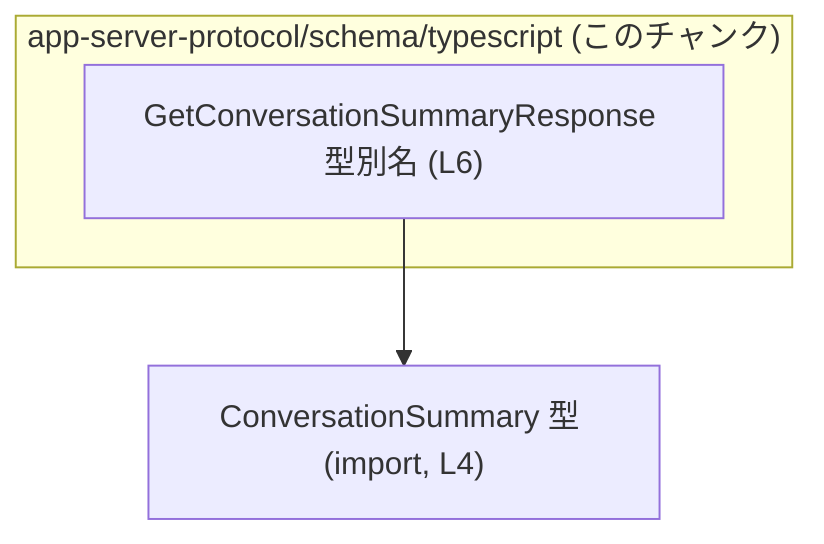
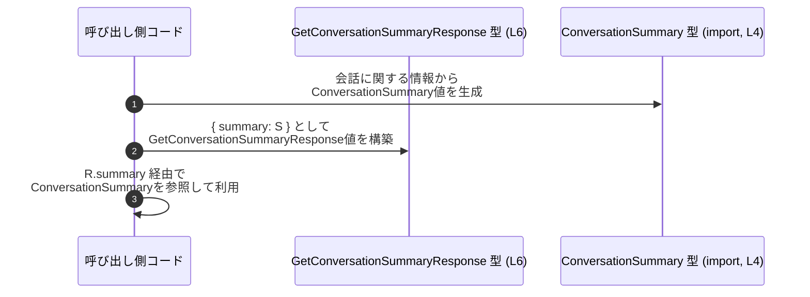

# app-server-protocol/schema/typescript/GetConversationSummaryResponse.ts コード解説

## 0. ざっくり一言

`GetConversationSummaryResponse` 型は、`ConversationSummary` 型の値を `summary` プロパティとして 1 つだけ含むレスポンス構造を表す TypeScript の型定義です（`GetConversationSummaryResponse.ts:L4-6`）。

---

## 1. このモジュールの役割

### 1.1 概要

- このモジュールは、`ConversationSummary` 型を 1 つラップしたオブジェクト型 `GetConversationSummaryResponse` を公開します（`GetConversationSummaryResponse.ts:L4-6`）。
- コメントから、このファイルは `ts-rs` ツールにより自動生成されており、手動編集しないことが前提になっています（`GetConversationSummaryResponse.ts:L1-3`）。

> 型名に `Response` が含まれることから、API などで「会話サマリーを取得する」処理のレスポンスを表現するための型と解釈できますが、この用途自体は命名に基づく推測であり、コードから厳密に確認できるものではありません。

### 1.2 アーキテクチャ内での位置づけ

このモジュールは、`ConversationSummary` 型に依存する単純なスキーマ定義です。

- 依存関係:
  - `GetConversationSummaryResponse` は `ConversationSummary` 型を `import type` によって参照しています（`GetConversationSummaryResponse.ts:L4`）。
  - 他のモジュールからの参照や利用箇所は、このチャンクには現れません。



この図は、「`GetConversationSummaryResponse` が `ConversationSummary` に型依存している」という、このチャンクから分かる最小限の依存関係だけを示しています。

### 1.3 設計上のポイント

- **自動生成コード**  
  - 先頭コメントに `GENERATED CODE! DO NOT MODIFY BY HAND!` と明記されています（`GetConversationSummaryResponse.ts:L1`）。
  - `ts-rs` により生成されたファイルであり、手動編集禁止とあります（`GetConversationSummaryResponse.ts:L3`）。
- **型エイリアスによるシンプルな構造**  
  - `export type GetConversationSummaryResponse = { summary: ConversationSummary, };` という 1 プロパティのみのオブジェクト型です（`GetConversationSummaryResponse.ts:L6`）。
- **状態やロジックを持たない**  
  - 関数・クラス・メソッドなどは一切定義されておらず、実行時ロジックも内部状態も持ちません（全行）。
- **TypeScript の型安全性の利用**  
  - `summary` プロパティの型を `ConversationSummary` に固定することで、他の任意の型を誤って代入することをコンパイル時に防ぎます（`GetConversationSummaryResponse.ts:L4, L6`）。
- **エラー処理・並行性**  
  - 実行時エラー処理や並行性制御に関するロジックは含まれておらず、この型はあくまでデータ構造を記述するためのものです（全行）。

---

## 2. 主要な機能一覧

このファイルに実装されている「機能」は、構造の記述に限定されます。

- `GetConversationSummaryResponse` 型: `summary` プロパティに `ConversationSummary` 型の値を 1 つ保持するレスポンス構造を表現する型エイリアスです（`GetConversationSummaryResponse.ts:L4-6`）。

---

## 3. 公開 API と詳細解説

### 3.1 型一覧（構造体・列挙体など）

このチャンクに現れる主要な型・コンポーネントのインベントリーです。

| 名前 | 種別 | 役割 / 用途 | 定義 / 利用箇所（根拠） |
|------|------|------------|-------------------------|
| `ConversationSummary` | 型（他ファイルで定義、ここでは `import type`） | `summary` プロパティの型として利用される会話サマリーの構造を表す型と解釈できます（用途自体は命名に基づく推測）。 | `GetConversationSummaryResponse.ts:L4` |
| `GetConversationSummaryResponse` | 型エイリアス（オブジェクト型） | `summary: ConversationSummary` という 1 フィールドを持つレスポンスの構造を表す型。外部へ `export` されています。 | `GetConversationSummaryResponse.ts:L6` |

`GetConversationSummaryResponse` の構造は次のとおりです（`GetConversationSummaryResponse.ts:L6`）。

```typescript
export type GetConversationSummaryResponse = {
    summary: ConversationSummary,
};
```

### 3.2 関数詳細（最大 7 件）

このファイルには関数・メソッドは定義されていません（全行）。

そのため、「関数詳細」テンプレートに沿って詳説すべき対象はありません。

### 3.3 その他の関数

- このファイルには補助関数やラッパー関数も定義されていません（全行）。

---

## 4. データフロー

### 4.1 このモジュール単体で分かるデータフロー

本ファイルには実行時処理（関数・メソッド・クラスなど）が存在しないため、「どのコードから呼び出されて、どこへ返されるか」といった実行時データフローは、このチャンクからは分かりません。

このチャンクから確実に言えるのは次の点だけです。

- `GetConversationSummaryResponse` 型のインスタンスは、少なくとも `summary` というキーを持ち、その値は `ConversationSummary` 型でなければならない（`GetConversationSummaryResponse.ts:L4, L6`）。
- したがって、*型が正しく守られている限り*、「レスポンス」オブジェクト内部では `summary` プロパティを通じて `ConversationSummary` 型の値が読み書きされる、というデータの流れが生じます。

### 4.2 一般的な利用イメージ（仮想的なシーケンス図）

以下は、この型を利用した「典型的な」データフローのイメージを示す**仮想的な例**です。  
実際にプロジェクト内でこのような呼び出しが行われているかどうかは、このチャンクからは分かりません。



この図が表しているのは、「`GetConversationSummaryResponse` は、`ConversationSummary` を 1 つ包んでやり取りするための入れ物として振る舞う」という、TypeScript 型レベルでの典型的な使われ方です。

---

## 5. 使い方（How to Use）

このセクションのコードは、**本ファイルには存在しない仮想的な使用例**です。  
TypeScript で `GetConversationSummaryResponse` 型をどのように安全に扱えるかを示します。

### 5.1 基本的な使用方法

`ConversationSummary` 型の値を用意し、それを `summary` プロパティに設定して `GetConversationSummaryResponse` を構築する例です。

```typescript
// GetConversationSummaryResponse 型と ConversationSummary 型をインポートする
import type { GetConversationSummaryResponse } from "./GetConversationSummaryResponse"; // このファイル
import type { ConversationSummary } from "./ConversationSummary";                       // L4 の import 先

// どこか別の場所で ConversationSummary 型の値を得ていると仮定する
declare const summary: ConversationSummary; // 実際の構造は ConversationSummary.ts 側に定義されている

// GetConversationSummaryResponse 型の値を構築する
const response: GetConversationSummaryResponse = {
    summary, // summary プロパティに ConversationSummary 型の値をセット
};

// 利用する側は、response.summary 経由で ConversationSummary にアクセスできる
console.log(response.summary); // 型はコンパイル時に ConversationSummary として扱われる
```

この例から分かるポイント:

- `response` オブジェクトには `summary` プロパティが必須であり、省略するとコンパイルエラーになります。
- `summary` には `ConversationSummary` 型以外の値を代入するとコンパイルエラーになります。
- これらの制約により、実行時に「意図しない構造のレスポンスが紛れ込む」ことをある程度防げます。

### 5.2 よくある使用パターン

#### パターン1: 関数の戻り値として利用する

`ConversationSummary` を引数に受け取り、`GetConversationSummaryResponse` を返す関数の例です。

```typescript
import type { GetConversationSummaryResponse } from "./GetConversationSummaryResponse";
import type { ConversationSummary } from "./ConversationSummary";

// 会話サマリーをレスポンス型にラップして返す関数
function wrapSummary(
    summary: ConversationSummary, // 呼び出し側から ConversationSummary を受け取る
): GetConversationSummaryResponse {
    return { summary };           // フィールド名と変数名が同じなので省略記法で代入
}
```

このように関数の戻り値として型を固定することで、呼び出し側は「この関数は必ず `summary` フィールドを持つレスポンス構造を返す」と静的に期待できます。

### 5.3 よくある間違い

この型に関して起こりうる典型的な型エラーを例示します。

```typescript
import type { GetConversationSummaryResponse } from "./GetConversationSummaryResponse";

// 間違い例1: summary プロパティを省略している
const invalidResponse1: GetConversationSummaryResponse = {
    // summary プロパティがない → コンパイルエラー
};

// 間違い例2: summary の型が ConversationSummary ではない
const invalidResponse2: GetConversationSummaryResponse = {
    summary: "not a ConversationSummary", // string は ConversationSummary ではない → コンパイルエラー
};
```

正しい例:

```typescript
import type { GetConversationSummaryResponse } from "./GetConversationSummaryResponse";
import type { ConversationSummary } from "./ConversationSummary";

// 正しい例: summary に ConversationSummary 型の値を必ずセットする
declare const summary: ConversationSummary;

const validResponse: GetConversationSummaryResponse = {
    summary,
};
```

### 5.4 使用上の注意点（まとめ）

- **summary プロパティは必須**  
  - `GetConversationSummaryResponse` 型では、`summary` はオプショナル（`?`）ではなく必須プロパティです（`GetConversationSummaryResponse.ts:L6`）。
- **summary の型は ConversationSummary に限定**  
  - `summary` に `ConversationSummary` 以外の型を代入するとコンパイルエラーになります（`GetConversationSummaryResponse.ts:L4, L6`）。
- **エラー情報は含まれない**  
  - この型にはエラーコードやメッセージを表すプロパティは定義されていません（`GetConversationSummaryResponse.ts:L6`）。  
    エラー処理が必要な場合は、別の型や構造で表現する必要があります。
- **並行性・スレッド安全性**  
  - TypeScript の型定義であり、実行時の状態を持たないため、この型自体に並行性やスレッド安全性に関する問題はありません。  
    実際の並行処理の安全性は、この型を使うランタイム（Node.js など）のコード側に依存します。
- **直接編集しない**  
  - コメントに「GENERATED CODE! DO NOT MODIFY BY HAND!」とあるため、このファイルを直接編集すると自動生成プロセスとの不整合が発生する可能性があります（`GetConversationSummaryResponse.ts:L1-3`）。

---

## 6. 変更の仕方（How to Modify）

### 6.1 新しい機能を追加する場合

このファイルは `ts-rs` により自動生成されているため、**このファイルを直接編集して新しいフィールドを追加するべきではありません**（`GetConversationSummaryResponse.ts:L1-3`）。

一般的な方針は次のとおりです（このプロジェクト固有の手順は、このチャンクからは分かりません）。

1. **元になっている Rust 側の型定義を確認・修正する**  
   - `ts-rs` は一般に「Rust の型定義から TypeScript の型定義を生成するツール」として知られています。  
   - `GetConversationSummaryResponse` に対応する Rust の構造体や型（例: `struct GetConversationSummaryResponse { summary: ConversationSummary }` のようなもの）がどこかに存在している可能性がありますが、その場所はこのチャンクには現れません。
2. **ts-rs のコード生成プロセスを再実行する**  
   - Rust 側を変更した後、ts-rs のビルド／スクリプトを再実行することで、この TypeScript ファイルが再生成されることが一般的です。
3. **生成された型を利用するコードを更新する**  
   - 新しいフィールドを追加した場合は、そのフィールドを参照・設定する TypeScript コードも別途更新する必要があります。

### 6.2 既存の機能を変更する場合

`summary` プロパティの名前や型を変更したい場合も、同様に**Rust 側と ts-rs の設定を変更するのが基本**と考えられます（`GetConversationSummaryResponse.ts:L1-3`）。

変更時の注意点:

- **影響範囲の確認**  
  - `GetConversationSummaryResponse` 型を参照しているすべての TypeScript コードへの影響が生じます。  
  - このチャンクには参照箇所が現れないため、検索などで利用箇所を確認する必要があります。
- **契約（前提条件）の維持**  
  - 呼び出し側が「`summary` が必ず存在する」と期待している場合、プロパティ名の変更やオプショナル化は破壊的変更になります。
- **型の意味の変更に注意**  
  - 例えば `summary` の型を別の型に変えると、現在 `ConversationSummary` として依存している多くの処理に影響します。

---

## 7. 関連ファイル

このチャンクから直接参照されているファイルは次のとおりです。

| パス | 役割 / 関係 |
|------|------------|
| `./ConversationSummary` | `ConversationSummary` 型を定義している TypeScript モジュールです。このファイルでは `summary` プロパティの型として `import type` によって参照されています（`GetConversationSummaryResponse.ts:L4`）。 |

その他の関連ファイル（Rust 側の定義や ts-rs の設定ファイルなど）は、このチャンクには現れず、パスや内容は不明です。
