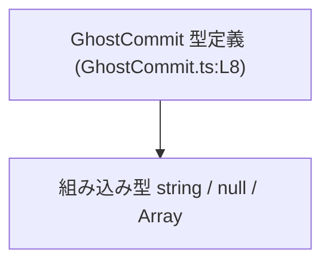
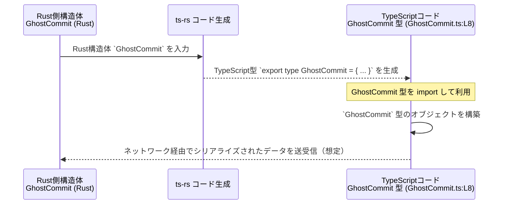

# `app-server-protocol\schema\typescript\GhostCommit.ts` コード解説

## 0. ざっくり一言

`GhostCommit.ts` は、「リポジトリ状態から作られたゴーストコミット」の情報を表現する **TypeScript の型定義（`GhostCommit`）だけを提供する自動生成ファイル**です（`GhostCommit.ts:L1-3,8`）。  
アプリケーションコードはこの型を使って、ゴーストコミットに関するデータを型安全に扱います。

---

## 1. このモジュールの役割

### 1.1 概要

- このモジュールは、リポジトリ状態から生成される「ゴーストコミット」の詳細情報を表現するための **データ構造のスキーマ**を提供します（コメントより、`GhostCommit.ts:L5-7`）。
- 実装コード（関数・メソッド）は一切含まず、**型エイリアス `GhostCommit` のみをエクスポート**します（`GhostCommit.ts:L8`）。
- 先頭コメントから、このファイルは `ts-rs` によって **Rust 側の構造体から自動生成**されており、**手動編集してはいけない契約**になっています（`GhostCommit.ts:L1-3`）。

### 1.2 アーキテクチャ内での位置づけ

このチャンクから分かる事実は以下の通りです。

- ファイルパスに `app-server-protocol\schema\typescript` が含まれているため、**アプリケーションサーバーのプロトコル層で用いるスキーマ定義の一部**と位置づけられます（ディレクトリ名からの解釈）。
- このチャンクには **他のモジュールとの import/export 関係は一切現れていません**。  
  したがって、どのモジュールが `GhostCommit` を利用しているかは、このチャンクだけからは分かりません。

GhostCommit 型と基礎型との関係を簡単な依存関係図で表すと次のようになります。



- `GhostCommit` は TypeScript の組み込み型 `string`, `null`, `Array<string>` を用いて定義されていることだけが、このチャンクから分かります（`GhostCommit.ts:L8`）。
- `GhostCommit` を **どのモジュールが import するか**は、このチャンクには現れません（不明）。

### 1.3 設計上のポイント（読み取れる範囲）

- **自動生成 & 手動編集禁止**  
  - 1 行目と 3 行目のコメントで、「このファイルは `ts-rs` による自動生成であり手動で編集してはいけない」と明示されています（`GhostCommit.ts:L1-3`）。
- **単一の公開 API**  
  - 公開されているのは `export type GhostCommit = ...` という **1 つの型エイリアスのみ**です（`GhostCommit.ts:L8`）。
- **プリミティブ型＋配列のみで構成**  
  - フィールドはすべて `string`, `string | null`, `Array<string>` の組み合わせで、ネストしたオブジェクトやクラスはありません（`GhostCommit.ts:L8`）。
- **親コミットの有無を `null` で表現**  
  - `parent` フィールドの型が `string | null` であり、「親コミットが存在しないケース」を型レベルで表現しています（`GhostCommit.ts:L8`）。
- **安全性・エラー・並行性について**  
  - このファイルは **型定義だけ**であり、実行時の処理・I/O・スレッド・非同期処理等は一切含みません（`GhostCommit.ts:L5-8`）。  
    そのため、このモジュール単体からは **実行時エラー・例外・並行性の問題は発生しません**。  
    提供されるのは **コンパイル時の型安全性**のみです。

---

## 2. 主要な機能一覧（コンポーネントインベントリー）

このチャンクに含まれるコンポーネントは 1 つです。

- `GhostCommit` 型エイリアス: ゴーストコミットに関するメタデータを表すオブジェクト型（`GhostCommit.ts:L8`）

---

## 3. 公開 API と詳細解説

### 3.1 型一覧（構造体・列挙体など）

#### 型インベントリー

| 名前          | 種別                           | 役割 / 用途                                                                 | 定義位置                  |
|---------------|--------------------------------|-------------------------------------------------------------------------------|---------------------------|
| `GhostCommit` | 型エイリアス（オブジェクト型） | ゴーストコミットの ID / 親コミット / 既存の未追跡ファイル・ディレクトリ一覧を表す | `GhostCommit.ts:L5-7,8`   |

> コメント `Details of a ghost commit created from a repository state.`（`GhostCommit.ts:L5-7`）から、  
> この型はリポジトリ状態から作られる「ゴーストコミット」の詳細を表すためのデータ構造と解釈できます。

#### `GhostCommit` のフィールド

`GhostCommit` は次のフィールドを持つオブジェクト型です（`GhostCommit.ts:L8`）。

| フィールド名                       | 型                    | 説明（コードから分かる範囲）                         | 定義位置          |
|------------------------------------|-----------------------|------------------------------------------------------|-------------------|
| `id`                               | `string`              | ゴーストコミットを識別する文字列 ID（文字列であることのみ確定） | `GhostCommit.ts:L8` |
| `parent`                           | `string \| null`      | 親コミットを表す文字列 ID または親がないことを表す `null` | `GhostCommit.ts:L8` |
| `preexisting_untracked_files`      | `Array<string>`       | 既に存在していた未追跡ファイルのパスまたは名前の一覧（文字列配列であることのみ確定） | `GhostCommit.ts:L8` |
| `preexisting_untracked_dirs`       | `Array<string>`       | 既に存在していた未追跡ディレクトリのパスまたは名前の一覧（文字列配列） | `GhostCommit.ts:L8` |

※ 各フィールドが具体的にどのような形式の文字列（例: ハッシュ値・パス・UUID）を取るかは、このチャンクだけからは分かりません。

**型システム上の性質（TypeScript 固有）**

- `id` は必須の `string` フィールドです。`undefined` や `null` を代入しようとするとコンパイルエラーになります。
- `parent` は `string | null` の **ユニオン型**です。  
  - 親がある場合は文字列（ID など）  
  - 親がない場合は `null`  
  を取ることができます。
- `preexisting_untracked_files` / `preexisting_untracked_dirs` はどちらも **文字列の配列**であり、`null` ではなく **空配列で「該当なし」**を表す設計になっていると読み取れます（型が `Array<string>` 固定のため、`null` は許容されない）。

### 3.2 関数詳細

このファイルには **関数・メソッド・クラスコンストラクタは一切定義されていません**（`GhostCommit.ts:L1-8`）。  
したがって、詳細な関数ドキュメント（引数・戻り値・アルゴリズムなど）は該当しません。

### 3.3 その他の関数

同上の理由により、補助関数・ラッパー関数も存在しません（このチャンクには現れません）。

---

## 4. データフロー

このファイル自体は型定義のみであり、実行時の処理フローは含みません。  
ここでは、**ts-rs を使った一般的な Rust ↔ TypeScript 間のデータフローのイメージ**を示します。  
※以下は ts-rs の一般的な利用パターンに基づく説明であり、実際にこのリポジトリでそうなっているかは、このチャンクからは断定できません。



このチャンクから直接分かること:

- `GhostCommit` 型定義が **ts-rs による自動生成**である（`GhostCommit.ts:L1-3`）。
- `GhostCommit` 型自体は **実行時ロジックを持たず、型付け情報のみを提供**する（`GhostCommit.ts:L8`）。

このチャンクからは分からないこと（不明）:

- `GhostCommit` の値が実際に **どの API 経由で送信/受信されるか**（HTTP, WebSocket 等）。
- どのファイルが `GhostCommit` を import しているか。
- 送受信時のシリアライザ／デシリアライザの具象実装。

---

## 5. 使い方（How to Use）

### 5.1 基本的な使用方法

`GhostCommit` 型は、TypeScript コード側で **データの形を表す型注釈として使う**ことが想定されます。

```typescript
// GhostCommit 型を型として import する（パスはプロジェクト構成に応じて調整が必要）
// このチャンクには import 例は現れませんが、一般的には相対パスで import します。
import type { GhostCommit } from "./GhostCommit";

// ゴーストコミットの値を構築する
const ghostCommit: GhostCommit = {
    id: "abc123",                              // string 型
    parent: null,                              // 親がない場合は null
    preexisting_untracked_files: [],           // 未追跡ファイルがない場合は空配列
    preexisting_untracked_dirs: ["tmp/cache"], // 既存の未追跡ディレクトリ一覧
};

// ghostCommit は GhostCommit 型として扱われる
console.log(ghostCommit.id);                   // 型推論により string と認識される
```

ポイント:

- TypeScript の型システムにより、**フィールドの欠落や型違いがコンパイル時に検出**されます。
- 型はコンパイル後に消えるため、**実行時の値検証は別途実装が必要**です（このチャンクには含まれません）。

### 5.2 よくある使用パターン

1. **関数の引数として受け取る**

```typescript
import type { GhostCommit } from "./GhostCommit";

// GhostCommit を受け取り、何らかの処理を行う関数
function handleGhostCommit(commit: GhostCommit): void {
    // commit.id は string として扱える
    console.log("Ghost commit id:", commit.id);

    // parent が null かどうかで分岐
    if (commit.parent === null) {
        console.log("Root ghost commit");
    } else {
        console.log("Parent commit:", commit.parent);
    }

    // 未追跡ファイル／ディレクトリの一覧をループ処理
    for (const file of commit.preexisting_untracked_files) {
        console.log("Untracked file:", file);
    }
}
```

1. **非同期処理の戻り値として利用する**

```typescript
import type { GhostCommit } from "./GhostCommit";

// サーバーからゴーストコミット情報を取得する関数の例（実際の I/O はこのチャンクには現れません）
async function fetchGhostCommit(): Promise<GhostCommit> {
    const res = await fetch("/api/ghost-commit");      // 実際のエンドポイント名は不明
    const json = await res.json();

    // ここで json を GhostCommit として扱う
    // コンパイラレベルでは GhostCommit 型だが、実行時の検証は別途必要
    return json as GhostCommit;
}
```

### 5.3 よくある間違いと正しい例（想定されるもの）

#### 例1: `parent` に `undefined` を入れてしまう

```typescript
import type { GhostCommit } from "./GhostCommit";

// 間違い例: parent に undefined を設定している
const badCommit: GhostCommit = {
    id: "abc123",
    // parent: undefined, // コンパイルエラー: 型 'undefined' は 'string | null' に割り当てられない
    parent: null,          // 正しい: 親がない場合は null
    preexisting_untracked_files: [],
    preexisting_untracked_dirs: [],
};
```

#### 例2: 配列フィールドを省略してしまう

```typescript
import type { GhostCommit } from "./GhostCommit";

// 間違い例: 必須フィールドを省略
/*
const badCommit2: GhostCommit = {
    id: "abc123",
    parent: null,
    // preexisting_untracked_files がない → コンパイルエラー
    // preexisting_untracked_dirs がない → コンパイルエラー
};
*/

// 正しい例: 必須フィールドは空配列でもよいので必ず指定する
const goodCommit: GhostCommit = {
    id: "abc123",
    parent: null,
    preexisting_untracked_files: [],
    preexisting_untracked_dirs: [],
};
```

### 5.4 使用上の注意点（まとめ）

- **自動生成ファイルのため、直接編集しない**  
  - `// GENERATED CODE! DO NOT MODIFY BY HAND!`（`GhostCommit.ts:L1-3`）と明示されており、  
    変更が必要な場合は **元となる Rust 側の構造体定義を変更し、ts-rs で再生成する**必要があります。  
    手動編集すると、再生成時に上書きされる可能性があります。
- **実行時バリデーションは別途必要**  
  - この型はコンパイル時のチェックのみを提供します。  
    受信した JSON を `GhostCommit` として `as` でキャストする場合、**実行時に形が異なっていてもコンパイラは検出できません**。  
    必要に応じて実行時のスキーマ検証を実装する必要があります（このチャンクには現れません）。
- **セキュリティ面**  
  - 本ファイルは型定義のみであり、入力値のサニタイズや検証は行いません。  
    `id` やファイル／ディレクトリ名をどのように利用するかによっては、別の層で適切な検証・エスケープが必要になります。
- **並行性・スレッドセーフティ**  
  - TypeScript の型定義であり、内部状態やミューテーションロジックを持たないため、  
    この型自体に起因する並行性問題はありません。

---

## 6. 変更の仕方（How to Modify）

### 6.1 新しいフィールド・機能を追加する場合

このファイルは自動生成であるため、**直接編集しない**ことが前提です（`GhostCommit.ts:L1-3`）。

新しいフィールドを追加したい場合の一般的な流れ（ts-rs の通常利用に基づく説明）:

1. **Rust 側の元定義を変更する**  
   - Rust プロジェクト内の `GhostCommit` 構造体（正確なパスはこのチャンクには現れません）に、新しいフィールドを追加する。
2. **ts-rs によるコード生成を再実行する**  
   - プロジェクトで用意されているビルドスクリプト／コマンドを実行し、`GhostCommit.ts` を再生成する。  
     具体的なコマンドはこのチャンクからは不明です。
3. **TypeScript 側の利用コードを更新する**  
   - 追加されたフィールドに対して、TypeScript コード側で値を設定する・参照するなどの対応を行う。

### 6.2 既存のフィールド仕様を変更する場合

例: フィールド名の変更、型の変更など。

- **変更の入口**: Rust 側の構造体定義  
  - このファイルを直接変更すると再生成で上書きされるため、元の Rust 定義を変更する必要があります。
- **影響範囲の確認**  
  - `GhostCommit` 型を import している TypeScript ファイル群が影響を受けます。  
    このチャンクから import 元は分かりませんが、IDE の参照検索等で確認する必要があります。
- **契約（前提条件）の維持**  
  - 例えば `parent` を `string | null` から `string` のみに変えると、「親なし」という状態を表現する方法が変わるため、  
    呼び出し側が `null` を前提にしている箇所をすべて確認して修正する必要があります。

---

## 7. 関連ファイル

このチャンクには他ファイルへの参照は現れていませんが、コメントやパス名から関係が想定されるものを列挙します（ただしパスは不明なものが多く、あくまで一般的な ts-rs 利用パターンに基づくものです）。

| パス / 名前                                           | 役割 / 関係                                             |
|-------------------------------------------------------|----------------------------------------------------------|
| Rust 側の `GhostCommit` 構造体定義（パス不明）       | 本 TypeScript 型のオリジナルとなる Rust のデータ構造（ts-rs がここから生成するとコメントに記載, `GhostCommit.ts:L1-3`） |
| ts-rs コード生成用ビルドスクリプト（パス不明）      | `GhostCommit.ts` を含む TypeScript スキーマを自動生成する処理。具体的なファイル名・コマンドはこのチャンクには現れません。 |

このチャンクにはテストコードやユーティリティ関数は一切現れないため、`GhostCommit` に対するテストがどのように行われているか（あるいは行われていないか）は不明です。
