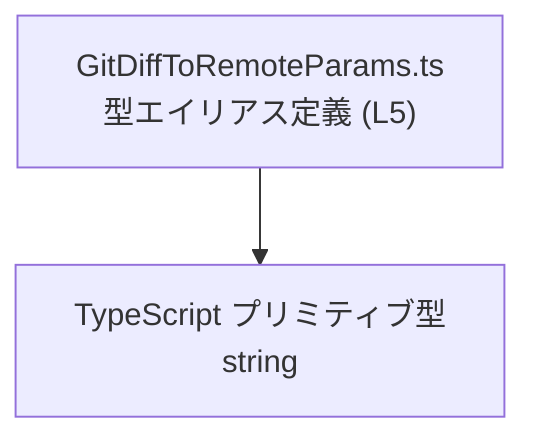
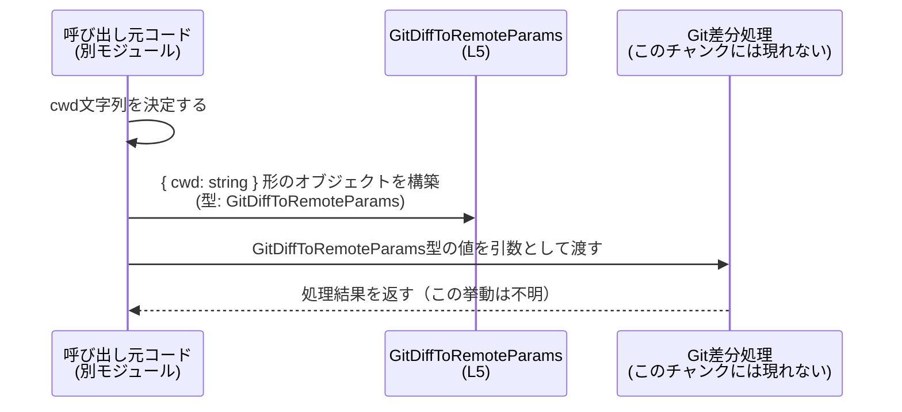

# app-server-protocol/schema/typescript/GitDiffToRemoteParams.ts

---

## 0. ざっくり一言

`GitDiffToRemoteParams` という型エイリアスを公開し、`cwd` という文字列プロパティを持つオブジェクト形状を表現する、自動生成された TypeScript スキーマファイルです（根拠: `GitDiffToRemoteParams.ts:L1-3`, `GitDiffToRemoteParams.ts:L5-5`）。

---

## 1. このモジュールの役割

### 1.1 概要

- このモジュールは、`cwd` フィールドを持つパラメータオブジェクトの **型定義** を提供します（根拠: `GitDiffToRemoteParams.ts:L5-5`）。
- 上部コメントから、このファイルは `ts-rs` によって生成されたものであり、手動編集しないことが明示されています（根拠: `GitDiffToRemoteParams.ts:L1-3`）。

型名からは「Git の diff を取得する何らかの処理に渡すパラメータ」である可能性が推測されますが、用途についてコードからは断定できません。

### 1.2 アーキテクチャ内での位置づけ

このファイル単体では、他モジュールの `import` / `export` がなく、依存関係は TypeScript の組み込み型 `string` のみです（根拠: `GitDiffToRemoteParams.ts:L5-5`）。



- 他のどのモジュールからこの型が利用されているかは、このチャンクには現れていません（不明）。

### 1.3 設計上のポイント

- **自動生成コード**  
  - 冒頭コメントに「GENERATED CODE! DO NOT MODIFY BY HAND!」および `ts-rs` による生成であることが記載されています（根拠: `GitDiffToRemoteParams.ts:L1-3`）。
- **単純なデータコンテナの型**  
  - 単一プロパティ `cwd: string` を持つオブジェクトの型エイリアスのみが定義されています（根拠: `GitDiffToRemoteParams.ts:L5-5`）。
- **状態やロジックを持たない**  
  - 関数・クラス・メソッド・実行ロジックは一切なく、純粋な型情報のみです（根拠: このファイルに他の宣言が存在しないこと）。

---

## 2. 主要な機能一覧

このモジュールが提供する機能は 1 つです。

- `GitDiffToRemoteParams` 型: `cwd` プロパティを持つパラメータオブジェクトの形を表現する（根拠: `GitDiffToRemoteParams.ts:L5-5`）

---

## 3. 公開 API と詳細解説

### 3.1 型一覧（構造体・列挙体など）

#### コンポーネントインベントリー

| 名前                    | 種別         | フィールド              | 役割 / 用途（コードから分かる範囲）                                                                 | 定義位置                         |
|-------------------------|--------------|-------------------------|------------------------------------------------------------------------------------------------------|----------------------------------|
| `GitDiffToRemoteParams` | 型エイリアス | `cwd: string`（必須）   | `cwd` プロパティを必須とするオブジェクトの型。呼び出し側に `cwd` を文字列として渡すことをコンパイル時に保証する。 | `GitDiffToRemoteParams.ts:L5-5` |

- プロパティ名 `cwd` からは、一般的な略語として「current working directory（カレントディレクトリ）」を表す意図が推測されますが、型定義上は単なる `string` であり、パス形式かどうかは制約されていません（型システム上は任意の文字列が許容されます）。

### 3.2 関数詳細

このファイルには、関数・メソッド・クラスコンストラクタなどの実行ロジックは定義されていません（根拠: `GitDiffToRemoteParams.ts:L1-5` にそれらの宣言が存在しないこと）。

したがって、詳細テンプレートで解説すべき「公開関数」はありません。

### 3.3 その他の関数

- なし（このチャンクには関数定義が現れません）。

---

## 4. データフロー

このモジュール自身はロジックを持たず、データ構造（型）だけを定義します。  
典型的には、他のコードが `GitDiffToRemoteParams` 型を使ってオブジェクトを構築し、そのオブジェクトを別の処理（このチャンク外）へ渡す、という流れが想定されます。

※ 下図の「Git差分処理」は、このファイルには定義されていない「利用側の処理」を抽象的に表したものです。



- `GitDiffToRemoteParams` がどの関数・メソッドに渡されるかは、このファイルからは特定できませんが、少なくとも「`cwd` を持つオブジェクト」という契約を型システムで明示する役割を持っています（根拠: `GitDiffToRemoteParams.ts:L5-5`）。

---

## 5. 使い方（How to Use）

### 5.1 基本的な使用方法

以下は、この型を利用する際の典型的なコード例です（利用側コードはこのリポジトリには含まれていない想定例です）。

```typescript
// 型をインポートする
// パスは実際のプロジェクト構成に合わせて調整が必要です。
import type { GitDiffToRemoteParams } from "./GitDiffToRemoteParams";

// GitDiffToRemoteParams 型に従ったオブジェクトを作成する
const params: GitDiffToRemoteParams = {
    cwd: "/path/to/repository",  // string 型。必須プロパティ
};

// 例: 別モジュールの関数に渡す（この関数は仮の例です）
async function runSomeOperation(p: GitDiffToRemoteParams) {
    // p.cwd を使って何らかの処理を行う
}
```

ポイント:

- TypeScript の型エイリアスなので、**コンパイル時** に `cwd` プロパティの存在と型（string）がチェックされます。
- 実行時に追加のバリデーションは行われません。この型だけでは、`cwd` が空文字列や無効なパスであることは検出できません。

### 5.2 よくある使用パターン

1. **現在の作業ディレクトリをそのまま渡す例（Node.js 環境の想定）**

```typescript
import type { GitDiffToRemoteParams } from "./GitDiffToRemoteParams";

const params: GitDiffToRemoteParams = {
    cwd: process.cwd(),  // Node.js のカレントディレクトリを利用
};
```

1. **設定やユーザー入力から組み立てる例**

```typescript
import type { GitDiffToRemoteParams } from "./GitDiffToRemoteParams";

function makeParamsFromConfig(configCwd: string): GitDiffToRemoteParams {
    return { cwd: configCwd };   // string であればよい
}
```

これらはいずれも、**静的型チェック** によって `cwd` が文字列であることだけが保証されます。

### 5.3 よくある間違い

TypeScript の型チェック観点で起こりそうな誤り例と修正例です。

```typescript
import type { GitDiffToRemoteParams } from "./GitDiffToRemoteParams";

// 間違い例1: 必須プロパティ cwd を指定していない
const bad1: GitDiffToRemoteParams = {
    // エラー: プロパティ 'cwd' が型に必須
};

// 間違い例2: cwd の型が string ではない
const bad2: GitDiffToRemoteParams = {
    cwd: 123,  // エラー: number を string には代入できない
};

// 正しい例
const ok: GitDiffToRemoteParams = {
    cwd: "/path/to/repo",  // string 型であれば OK
};
```

### 5.4 使用上の注意点（まとめ）

- **前提条件 / 契約**
  - `GitDiffToRemoteParams` 型の値は、必ず `cwd` プロパティ（string 型）を持つ必要があります（根拠: `GitDiffToRemoteParams.ts:L5-5`）。
- **エッジケース**
  - 型としては空文字列 `""` や任意の文字列を許容します。空や不正パスを禁止したい場合は、**別途ランタイムバリデーション** を行う必要があります（この型にはそのロジックは含まれません）。
- **安全性 / エラー**
  - この型自体は例外やエラーを発生させるコードを含みません。
  - セキュリティ的には、`cwd` にユーザー入力をそのまま利用する場合、利用側のファイルシステム操作などでパストラバーサル等を防ぐチェックが必要になる可能性がありますが、それはあくまで利用側の責務です。
- **並行性**
  - 型定義のみであり、スレッド/イベントループなどの並行実行に関する副作用はありません。

---

## 6. 変更の仕方（How to Modify）

### 6.1 新しい機能を追加する場合

上部コメントにある通り、このファイルは自動生成されており、**手で直接編集すべきではない** とされています（根拠: `GitDiffToRemoteParams.ts:L1-3`）。

新しいフィールドを追加したい場合の一般的な方針:

1. この型を生成している **元の定義**（おそらく Rust 側や別のスキーマ定義）を探す。  
   - このチャンクからは、その場所や形式は特定できません。
2. 元の定義に新しいフィールドを追加・変更する。
3. `ts-rs` などの生成ツールを再実行し、`GitDiffToRemoteParams.ts` を再生成する。

このファイルを直接編集すると、次回の自動生成で上書きされる可能性が高い点に注意が必要です。

### 6.2 既存の機能を変更する場合

- **`cwd` の型を変更したい場合**  
  - 直接 `cwd: string` を書き換えるのではなく、元定義側で型を変更し、再生成するのが前提と考えられます（ただし、元定義の位置はこのチャンクからは不明）。
- **契約変更の注意点**
  - `cwd` の型や必須/任意性を変えると、この型を利用している全ての呼び出し側コードに影響します。
  - 変更後は、呼び出し側での型エラーや想定外の挙動がないか確認する必要があります（テストコードの位置はこのチャンクには現れません）。

---

## 7. 関連ファイル

このチャンクから直接読み取れる関連ファイル情報はありませんが、このモジュールと関係しうるものを「不明」で表現します。

| パス | 役割 / 関係 |
|------|------------|
| （不明） | `GitDiffToRemoteParams` を実際に使用する呼び出し側コード（関数やクラス）は、このチャンクには現れません。 |
| （不明） | この型を生成している元定義（おそらく `ts-rs` による入力となる定義）は、このチャンクには現れません。 |

---

### 補足: TypeScript 言語特有の観点

- **型エイリアスとしての性質**  
  - `export type GitDiffToRemoteParams = { cwd: string, };` は、特定のオブジェクト構造に名前を付けて再利用しやすくする TypeScript の機能です（根拠: `GitDiffToRemoteParams.ts:L5-5`）。
- **型安全性**  
  - `cwd` が必ず string であることをコンパイル時に保証する一方で、実行時のパス検証は行わない、という分離がなされています。
- **エラー/並行性**  
  - このファイル単体には実行コードがなく、例外発生や並行実行に関する処理は一切存在しません。
