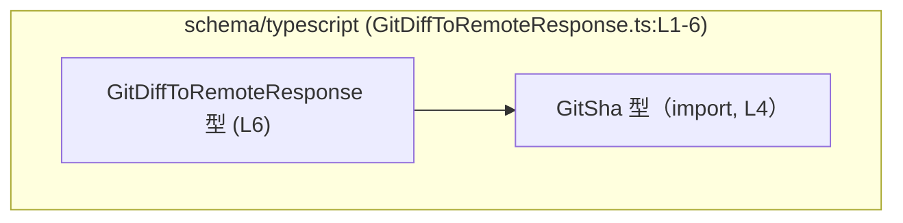
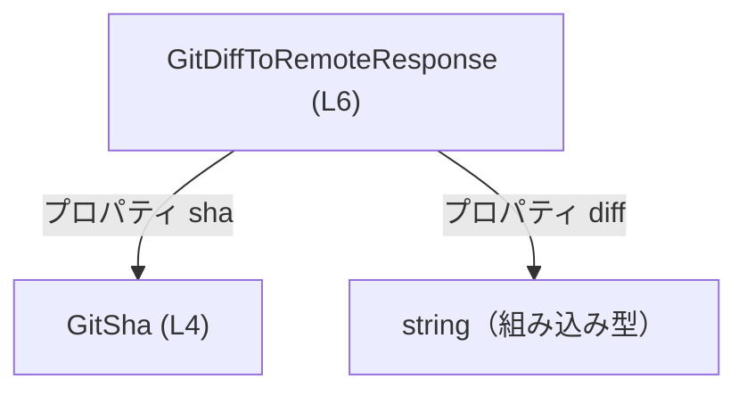
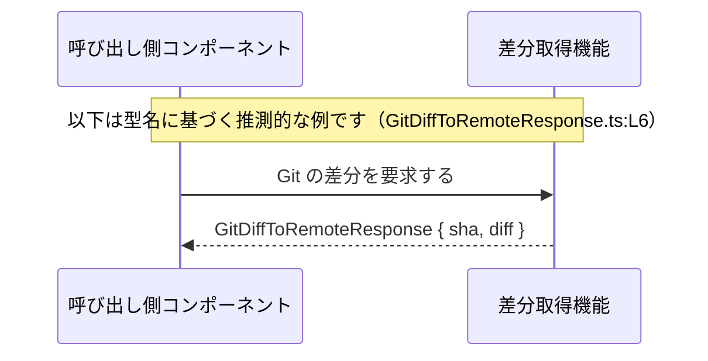

# app-server-protocol/schema/typescript/GitDiffToRemoteResponse.ts

## 0. ざっくり一言

`GitDiffToRemoteResponse` は、`sha` と `diff` という 2 つのプロパティからなるオブジェクト型を定義する、自動生成された TypeScript の型エイリアスです（GitDiffToRemoteResponse.ts:L1-3,6）。  
型名からは、何らかの「Git の差分情報」を返すレスポンスの形を表す型と想定されますが、用途はこのチャンクからは確定できません（GitDiffToRemoteResponse.ts:L6）。

---

## 1. このモジュールの役割

### 1.1 概要

- このモジュールは **`GitDiffToRemoteResponse` という TypeScript 型エイリアス**を定義します（GitDiffToRemoteResponse.ts:L6）。
- 型は `{ sha: GitSha, diff: string }` というオブジェクト構造を持ち、`sha` プロパティに別ファイルで定義された `GitSha` 型を利用します（GitDiffToRemoteResponse.ts:L4,6）。
- ファイル先頭のコメントから、この型定義は `ts-rs` というツールで自動生成されており、手作業で編集すべきではないことが分かります（GitDiffToRemoteResponse.ts:L1-3）。

### 1.2 アーキテクチャ内での位置づけ

このファイルの中だけから確実に分かる依存関係は、**`GitDiffToRemoteResponse` 型が `GitSha` 型に依存している**という点だけです（GitDiffToRemoteResponse.ts:L4,6）。



- `GitDiffToRemoteResponse` は `import type { GitSha } from "./GitSha";` により `GitSha` を型として取り込みます（GitDiffToRemoteResponse.ts:L4）。
- それ以外のモジュール（この型をどこから呼び出しているか等）は、このチャンクには現れません。

### 1.3 設計上のポイント

- **自動生成コード**  
  - 冒頭コメントに `GENERATED CODE! DO NOT MODIFY BY HAND!` とあり（GitDiffToRemoteResponse.ts:L1）、手動編集禁止であることが明示されています。
  - `This file was generated by [ts-rs](...)` とあるため、何らかのスキーマから自動生成されていることだけが分かります（GitDiffToRemoteResponse.ts:L3）。生成元の詳細（どの言語・どのファイルか）はこのチャンクにはありません。
- **型専用の import**  
  - `import type { GitSha } from "./GitSha";` により、`GitSha` はコンパイル時の型チェック専用であり、生成される JavaScript からは取り除かれる形式の import になっています（GitDiffToRemoteResponse.ts:L4）。
- **単純なオブジェクト型エイリアス**  
  - `export type GitDiffToRemoteResponse = { sha: GitSha, diff: string, };` という、プロパティ 2 つだけのシンプルな構造になっています（GitDiffToRemoteResponse.ts:L6）。
- **状態・ロジックを持たない**  
  - クラスや関数はなく、純粋に型情報だけを提供します（GitDiffToRemoteResponse.ts:L1-6）。  
    したがって、このファイル単体にはエラーハンドリングや並行性に関するロジックは存在しません。

---

## 2. 主要な機能一覧（コンポーネントインベントリー）

このファイルが提供する「機能」は、型定義 1 つです。

- `GitDiffToRemoteResponse` 型:  
  - `sha`（`GitSha` 型）と `diff`（`string` 型）からなるオブジェクトの構造を表します（GitDiffToRemoteResponse.ts:L4,6）。

コンポーネント一覧（型・インポート）の表です。

| 名前                      | 種別           | 役割 / 用途                                                                                                          | 根拠                                   |
|---------------------------|----------------|-----------------------------------------------------------------------------------------------------------------------|----------------------------------------|
| `GitDiffToRemoteResponse` | 型エイリアス   | `sha: GitSha` と `diff: string` を持つオブジェクトの構造を表す公開型。API レスポンスなどで利用されることが想定されるが、用途はこのチャンクからは確定できない。 | GitDiffToRemoteResponse.ts:L6          |
| `GitSha`                  | 型（他ファイル） | `sha` プロパティの型として利用される。具体的な中身や制約は `./GitSha` 側に定義されており、このチャンクには現れない。                                   | GitDiffToRemoteResponse.ts:L4,6        |

---

## 3. 公開 API と詳細解説

### 3.1 型一覧（構造体・列挙体など）

`GitDiffToRemoteResponse` 型の詳細です。

| 名前                      | 種別         | フィールド              | 説明                                                                                 | 根拠                         |
|---------------------------|--------------|-------------------------|--------------------------------------------------------------------------------------|------------------------------|
| `GitDiffToRemoteResponse` | 型エイリアス | `sha: GitSha`          | 何らかの Git の識別情報（コミット SHA 等）を表す型 `GitSha` を持つプロパティ。中身の仕様はこのチャンクでは不明。 | GitDiffToRemoteResponse.ts:L4,6 |
|                           |              | `diff: string`         | 差分内容を文字列として格納すると想定されるプロパティ。フォーマットやサイズ制約はこのチャンクでは不明。         | GitDiffToRemoteResponse.ts:L6  |

> 用途に関する記述（「Git の識別情報」「差分内容」など）は型名とプロパティ名からの推測であり、コード断片だけでは仕様としては確定できません。

### 3.2 関数詳細

このファイルには関数・メソッドは定義されていません（GitDiffToRemoteResponse.ts:L1-6）。

そのため、関数詳細テンプレートに従って説明すべき対象はありません。

### 3.3 その他の関数

- なし（ユーティリティ関数やラッパー関数も存在しません）（GitDiffToRemoteResponse.ts:L1-6）。

---

## 4. データフロー

### 4.1 型レベルのデータ構造

`GitDiffToRemoteResponse` は、**`sha` と `diff` という 2 つの値を 1 つのオブジェクトにまとめるための型**です（GitDiffToRemoteResponse.ts:L6）。  
型同士の「内訳」を表す簡単な図は以下のとおりです。



- 実際の値の生成・変換は、このファイルの外側で行われます。
- このファイルでは **あくまで「こういう形のオブジェクトであるべき」という型情報だけ** を提供しています。

### 4.2 推測的な利用シーケンス図（参考）

以下は、**型名から推測される典型的な利用パターンの一例**です。  
実際にこう使われているかどうかは、このチャンクからは分かりません。



- 型 `GitDiffToRemoteResponse` 自体は、このようなシーケンスの中で **「戻り値の形を保証するための型注釈」** として使われると考えられますが、これは推測にとどまります。

---

## 5. 使い方（How to Use）

### 5.1 基本的な使用方法

この型を他の TypeScript ファイルから利用する最も基本的な例です。  
同一ディレクトリからの型専用 import は、このファイル内の `GitSha` の import 形式（GitDiffToRemoteResponse.ts:L4）を参考にしています。

```typescript
// GitDiffToRemoteResponse 型を型専用 import する
import type { GitDiffToRemoteResponse } from "./GitDiffToRemoteResponse";  // パスはこのファイル相対の例

// 受け取ったレスポンスを処理する関数の例
function handleDiffResponse(resp: GitDiffToRemoteResponse) {               // resp の形が型チェックされる
    console.log("SHA:", resp.sha);                                         // resp.sha は GitSha 型
    console.log("Diff:", resp.diff);                                       // resp.diff は string 型
}
```

- `import type` を用いることで、コンパイル後の JavaScript からはこの import が除去され、**実行時コストを増やさずに型チェックだけを行う**ことができます（GitDiffToRemoteResponse.ts:L4 と同じパターン）。
- TypeScript の型システムにより、`handleDiffResponse` に渡すオブジェクトは **少なくとも `sha` と `diff` を持っている必要がある**ことがコンパイル時に検査されます。

### 5.2 よくある使用パターン

#### 5.2.1 関数の戻り値として利用する

```typescript
import type { GitDiffToRemoteResponse } from "./GitDiffToRemoteResponse";

// 差分を取得する関数の戻り値に使う例（実装はダミー）
async function fetchGitDiff(): Promise<GitDiffToRemoteResponse> {
    // 実際にはネットワーク等から取得する想定のダミー値
    const response: GitDiffToRemoteResponse = {
        sha: "dummy-sha" as any,     // GitSha の実体はこのチャンクからは分からないため、ここでは any を仮置き
        diff: "dummy diff text",     // diff は string であればよい
    };
    return response;
}
```

- `Promise<GitDiffToRemoteResponse>` とすることで、呼び出し側は `await fetchGitDiff()` の戻り値が必ず `sha` と `diff` を持つことを前提としてコードを書けます。
- 実際の `GitSha` の型定義がどうなっているかは `./GitSha` で決められており、このチャンクからは把握できません（GitDiffToRemoteResponse.ts:L4）。

#### 5.2.2 JSON をパースした結果に型注釈を付ける

```typescript
import type { GitDiffToRemoteResponse } from "./GitDiffToRemoteResponse";

// すでに JSON.parse などでパースされたオブジェクトを型付けする例
function parseDiff(json: unknown): GitDiffToRemoteResponse {
    // 実際にはここでバリデーションを行うべきだが、この例では型アサーションのみ
    return json as GitDiffToRemoteResponse;  // コンパイル時にのみ型として扱われる
}
```

- **重要**: 型注釈や型アサーションはあくまでコンパイル時のチェックであり、実行時に JSON の構造が本当に `GitDiffToRemoteResponse` を満たしているかどうかは自動では検証されません。
- 実運用では、プロパティの存在チェックや型チェックを行うランタイムバリデーションを組み合わせる必要があります。

### 5.3 よくある間違い

#### 5.3.1 必須プロパティの欠落

```typescript
import type { GitDiffToRemoteResponse } from "./GitDiffToRemoteResponse";

// 間違い例: 必須フィールドが不足している
const invalidResp: GitDiffToRemoteResponse = {
    diff: "only diff",            // sha が欠けているためコンパイルエラーになる
    // sha: ... が無い
};

// 正しい例: すべての必須フィールドを指定
const validResp: GitDiffToRemoteResponse = {
    sha: "some-sha" as any,       // 実際の GitSha 型の値に合わせる必要がある
    diff: "diff text",
};
```

- `GitDiffToRemoteResponse` は `sha` と `diff` の両方を必須プロパティとして要求するため（GitDiffToRemoteResponse.ts:L6）、どちらか一方でも欠けると TypeScript のコンパイルエラーになります。

#### 5.3.2 プロパティ名の綴り間違い

```typescript
import type { GitDiffToRemoteResponse } from "./GitDiffToRemoteResponse";

// 間違い例: プロパティ名の綴りを間違えている
const typoResp: GitDiffToRemoteResponse = {
    sha: "some-sha" as any,
    dif: "text",                 // "diff" ではなく "dif" になっている → コンパイルエラー
};

// 正しい例
const correctResp: GitDiffToRemoteResponse = {
    sha: "some-sha" as any,
    diff: "text",
};
```

- TypeScript の型システムはプロパティ名もチェックするため、綴りのミスによるバグを **コンパイル時に検出** できます。

### 5.4 使用上の注意点（まとめ）

- **ランタイム検証は行われない**  
  - この型はコンパイル時の静的型チェック専用です。JSON など外部入力が本当にこの形を満たしているかどうかは、別途ランタイムで検証する必要があります。
- **`diff` のサイズやフォーマット制約は不明**  
  - `diff: string` という情報だけでは、文字列長やフォーマット（パッチ形式など）の制約は分かりません（GitDiffToRemoteResponse.ts:L6）。大量の差分テキストを扱う場合、メモリ使用量に注意が必要です。
- **`GitSha` の仕様は別ファイルに依存**  
  - `sha` の形式（長さ・許容文字など）は `GitSha` の定義に依存しており、このチャンクだけでは分かりません（GitDiffToRemoteResponse.ts:L4）。利用時には `./GitSha` の定義を確認する必要があります。
- **並行性・エラーハンドリングは別のレイヤーで扱う**  
  - このファイルには関数や状態がなく、並行処理やエラー処理のロジックは存在しません（GitDiffToRemoteResponse.ts:L1-6）。それらはこの型を使う側のコードで設計する必要があります。

---

## 6. 変更の仕方（How to Modify）

### 6.1 新しい機能（プロパティなど）を追加する場合

- このファイルはコメントで **手動編集禁止** と明記されています（`GENERATED CODE! DO NOT MODIFY BY HAND!`）（GitDiffToRemoteResponse.ts:L1,3）。
- したがって、直接このファイルにプロパティを追加・変更するのではなく、**生成元**（何らかのスキーマや定義）を変更し、`ts-rs` による再生成を行う設計になっていると考えられますが、生成元がどこにあるかはこのチャンクには現れません（GitDiffToRemoteResponse.ts:L3）。
- 一般的な手順（このファイルから直接は読み取れないため、あくまで方針レベル）は次のようになります:
  1. `GitDiffToRemoteResponse` に相当する元の定義（スキーマ・型）を探す。
  2. そこに新しいフィールドを追加する。
  3. `ts-rs` によるコード生成を再実行し、このファイルを更新する。

### 6.2 既存の機能を変更する場合（プロパティ名・型の変更など）

- **直接編集は避ける**  
  - 上記と同じく自動生成ファイルであるため、直接 `sha` や `diff` の名前・型を変更すると、次回の自動生成で上書きされます（GitDiffToRemoteResponse.ts:L1-3）。
- **影響範囲の確認ポイント**
  - `GitDiffToRemoteResponse` を参照しているすべての箇所（他ファイル）で、コンパイルエラーが発生しないか確認する必要があります。どのファイルが参照しているかは、このチャンクからは分かりません。
  - `GitSha` 型の定義を変更する場合は、`./GitSha` を参照している他の型にも影響する可能性があります（GitDiffToRemoteResponse.ts:L4）。
- **契約（前提条件）の維持**
  - 現状、この型は `sha` と `diff` の 2 プロパティを必須とする契約を暗黙に持っています（GitDiffToRemoteResponse.ts:L6）。
  - プロパティを削除したりオプションにしたりする場合、呼び出し側の前提を壊さないかどうかを慎重に確認する必要があります。

---

## 7. 関連ファイル

このチャンクから確実に分かる関連ファイルは 1 つだけです。

| パス         | 役割 / 関係                                                                 |
|--------------|------------------------------------------------------------------------------|
| `./GitSha`   | `GitDiffToRemoteResponse` の `sha` プロパティの型 `GitSha` を定義するファイル（と推測される）。実際の内容はこのチャンクには現れません（GitDiffToRemoteResponse.ts:L4）。 |

> `./GitSha` の具体的な実装内容（型の中身・バリデーション有無など）は、このチャンクの情報だけでは分かりません。必要に応じて該当ファイルを参照する必要があります。

---

## Bugs / Security / Contracts / Edge Cases / Tests / パフォーマンス まとめ

- **Bugs（バグ要因）**
  - このファイル自体にはロジックがなく、型定義のみのため、実行時バグは含まれていません。
  - ただし、**実際のデータが型通りであると仮定してしまい、ランタイム検証を省略すると、想定外の構造のデータが混入しても気づけない** 可能性があります。
- **Security（セキュリティ）**
  - `diff` が任意の文字列であることから（GitDiffToRemoteResponse.ts:L6）、表示先での XSS などを防ぐためには、呼び出し側でエスケープやサニタイズを行う必要があります。これはこの型ではなく利用側の責務です。
- **Contracts（契約）**
  - コンパイル時の契約: オブジェクトは `sha: GitSha` と `diff: string` を必ず持つ（GitDiffToRemoteResponse.ts:L6）。
  - 実行時の契約について（`sha` のフォーマットなど）は、このチャンクからは不明です。
- **Edge Cases（エッジケース）**
  - `diff` が空文字列 `""` であるケース: この型レベルでは禁止されていません（GitDiffToRemoteResponse.ts:L6）。意味的に許容するかどうかは利用側の仕様次第です。
  - `sha` が `GitSha` としては不正な値（null、空文字など）であるケース: `GitSha` の定義が不明なため、このチャンクからは判断できません（GitDiffToRemoteResponse.ts:L4）。
- **Tests（テスト）**
  - このファイル内にテストコードは存在しません（GitDiffToRemoteResponse.ts:L1-6）。
  - 型の整合性は、コンパイル時のチェックと、生成元のスキーマのテストに依存すると考えられますが、生成元はこのチャンクからは不明です。
- **Performance / Scalability（パフォーマンス / スケーラビリティ）**
  - 型定義のみであり、**このファイル自体は実行時パフォーマンスに影響を与えません**。
  - ただし、`diff` に非常に大きな文字列を格納する設計の場合、メモリ消費やネットワーク帯域に影響する可能性があり、それはこの型を使うプロトコル設計全体の問題になります。
