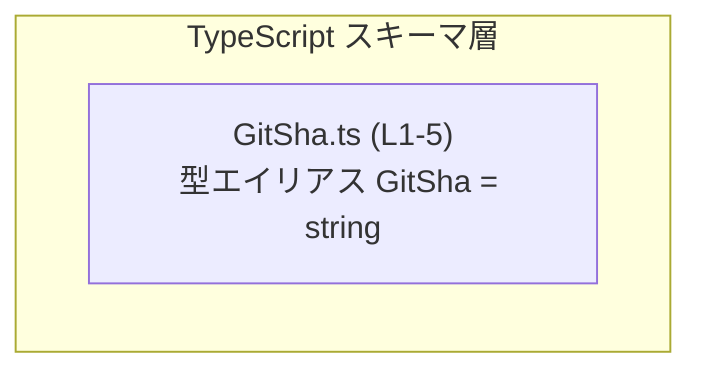
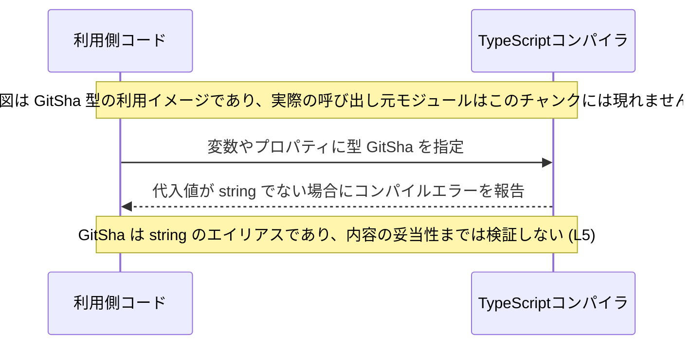

# app-server-protocol\schema\typescript\GitSha.ts

## 0. ざっくり一言

Git の SHA 値を表すためと思われる TypeScript の型エイリアス `GitSha` を、`string` の別名として定義している自動生成ファイルです。  
実行時ロジックは一切なく、型レベルの情報だけを提供します。`app-server-protocol\schema\typescript\GitSha.ts:L1-5`

---

## 1. このモジュールの役割

### 1.1 概要

- このモジュールは、自動生成された TypeScript 型定義ファイルです。`app-server-protocol\schema\typescript\GitSha.ts:L1-3`
- `GitSha` という型名で `string` 型のエイリアス（別名）を公開します。`app-server-protocol\schema\typescript\GitSha.ts:L5-5`
- 型名から、Git の SHA（コミットハッシュ）文字列を表現する用途が想定されますが、文字列内容の制約はコード上には記述されていません。`app-server-protocol\schema\typescript\GitSha.ts:L5-5`

### 1.2 アーキテクチャ内での位置づけ

- このファイルには `import` / `require` が存在せず、他の TypeScript モジュールへの依存はこのチャンクには現れません。`app-server-protocol\schema\typescript\GitSha.ts:L1-5`
- 外部から `GitSha` 型を import して使用されることを前提とした、**スキーマ定義レイヤ**の一部と解釈できます。

依存関係（このチャンクで分かる範囲）を簡略図で示します。



この図は「このファイル単体で完結している型定義」であることだけを表し、どのモジュールが利用しているかはこのチャンクからは分かりません。

### 1.3 設計上のポイント

- **自動生成ファイル**  
  - 先頭コメントに「GENERATED CODE」「Do not edit this file manually」とあり、`ts-rs` による自動生成であることが明示されています。  
    `app-server-protocol\schema\typescript\GitSha.ts:L1-3`
- **責務の単一性**  
  - ひとつの型エイリアス `GitSha` のみを公開し、その他の関数・クラス・値は定義していません。`app-server-protocol\schema\typescript\GitSha.ts:L5-5`
- **実行時処理を持たない**  
  - すべてが型定義であり、JavaScript にトランスパイルされてもランタイムの振る舞いは追加されません。
- **エラーハンドリング・並行性**  
  - 関数や状態を持たないため、エラーハンドリングや並行性（スレッド安全性）に関する挙動はこのファイルには存在しません。

---

## 2. 主要な機能一覧

このファイルが提供する機能は 1 つだけです。

- `GitSha` 型定義: `GitSha` を `string` の型エイリアスとして公開することにより、「Git の SHA 値らしい文字列」であることを型名で表現する。`app-server-protocol\schema\typescript\GitSha.ts:L5-5`

---

## 3. 公開 API と詳細解説

### 3.1 型一覧（構造体・列挙体など）

このチャンクに現れる型コンポーネントのインベントリーです。

| 名前     | 種別           | 役割 / 用途（コードから読み取れる範囲）                                                                                           | 定義箇所 |
|----------|----------------|-------------------------------------------------------------------------------------------------------------------------------------|----------|
| `GitSha` | 型エイリアス   | `string` の別名。型名から、Git の SHA 値を表す用途が想定されるが、内容の形式は制約されておらず任意の文字列が許容される。 | `app-server-protocol\schema\typescript\GitSha.ts:L5-5` |

このファイルにはインターフェース・クラス・列挙体・関数は定義されていません。`app-server-protocol\schema\typescript\GitSha.ts:L1-5`

### 3.2 `GitSha` 型エイリアスの詳細

#### 定義

```typescript
export type GitSha = string;
```

`app-server-protocol\schema\typescript\GitSha.ts:L5-5`

**概要**

- `GitSha` は TypeScript の **型エイリアス**（`type`）であり、実体は `string` です。
- コンパイル時の型チェックにおいては `GitSha` は `string` と同一視され、追加の構造や検証ロジックは一切ありません。
- 名前によって「Git の SHA 値として扱う文字列」であることを文書化する役割を果たします。

**実体（型システム上の意味）**

- 実際には次の 2 つは同じ型です。

```typescript
type GitSha = string; // 本ファイルの定義
type JustString = string;

// どちらの変数にも string を代入できる
const a: GitSha = "abc";
const b: JustString = "abc";
```

**型安全性とエラー**

- **型レベルの安全性**  
  - `GitSha` は `string` の別名なので、「文字列かどうか」というチェックにのみ関与します。
  - 数値やオブジェクトなど、`string` 以外を代入するとコンパイルエラーになります。
- **フォーマット検証はしない**  
  - SHA1/SHA256 など特定の長さや 16 進文字列であることは **型としては保証されません**。
  - そのため、SHA としての妥当性が必要な場合は、別途ランタイムで検証する必要があります。
- **実行時エラー**  
  - この型エイリアス自身は実行時には存在しないため、`GitSha` が直接原因となるランタイムエラーは発生しません。

**並行性（Concurrency）**

- 型レベルの定義のみであり、共有状態やミューテーションを持たないため、並行性・スレッド安全性に関する懸念はありません。

**Edge cases（エッジケース）**

`GitSha` は内容を制約しない `string` であるため、次のような値もコンパイル上は許容されます。

- 空文字列 `""`
- SHA らしくない文字列 `"not-a-sha"`
- 長さが極端に短い／長い文字列
- 大文字・小文字混在の文字列

これらが許容されるかどうかは「Git の SHA としてどう扱うか」というアプリケーション側の仕様に依存し、このファイルからは判断できません。

**Bugs / Security 観点**

- `GitSha` だけでは「正しい SHA 文字列であること」は保証されません。
  - もし他の部分のコードが「`GitSha` なので必ず正しい SHA だ」と仮定してしまうと、予期しない文字列が通ってしまう潜在的なバグやセキュリティ上の抜け穴になり得ます。
- SHA の正当性が安全性に関わる場合（例: コード署名、検証用ハッシュなど）は、**別途バリデーション関数**で検証する前提で設計する必要があります。
  - そのような検証ロジックは、このチャンクには現れていません。（不明）

**使用上の注意点**

- **フォーマット検証を別途行うこと**  
  - Git の SHA としての形式（長さ 40 の 16 進文字列など）を保証したい場合は、ランタイムでの検証処理を組み合わせることが前提になります。
- **`string` とほぼ同一であることを理解する**  
  - 型エイリアスであり、新しい「ブランド付き型」やラッパー型ではありません。
  - そのため、関数引数などで `string` と `GitSha` を区別したい場合は、別の仕組み（ブランド型パターンなど）が必要です。
- **自動生成ファイルであること**  
  - コメントに “GENERATED CODE! DO NOT MODIFY BY HAND!” とある通り、手動での変更は意図されていません。`app-server-protocol\schema\typescript\GitSha.ts:L1-3`
  - 仕様変更が必要な場合は、`ts-rs` 側の生成元定義を変更して再生成することが想定されます（生成元の場所や構造はこのチャンクからは分かりません）。

### 3.3 その他の関数

- このファイルには関数・メソッド・補助的なユーティリティは定義されていません。`app-server-protocol\schema\typescript\GitSha.ts:L1-5`

---

## 4. データフロー

このファイルには実行時の処理ロジックがなく、データの変換や I/O は行われません。  
ここでは「GitSha 型を **利用する場合の一般的な型チェックの流れ**」を概念図として示します。



要点:

- 型 `GitSha` は **コンパイル時のみ**使われます。`app-server-protocol\schema\typescript\GitSha.ts:L5-5`
- 実行時には `string` として扱われるため、ランタイムのデータフローは通常の文字列と同一です。
- 「SHA として妥当な文字列かどうか」の判断は、このファイル外のコードに委ねられています。

---

## 5. 使い方（How to Use）

### 5.1 基本的な使用方法

`GitSha` 型を用いて、Git のコミット情報に意味のある型名を付ける例です。  
インポートパスはプロジェクト構成によって異なり、このチャンクからは厳密には分からないため、ここでは仮のパスを用いています。

```typescript
// 仮のインポート例（実際のパスはプロジェクトの構成に依存し、このチャンクからは分かりません）
import type { GitSha } from "./GitSha";   // GitSha 型を型としてインポートする

// Git のコミット情報を表すインターフェース
interface Commit {                         // Commit というインターフェースを定義
    id: GitSha;                           // コミット ID として GitSha 型を使用（実体は string）
    message: string;                      // コミットメッセージ
}

// 正しい使い方: 文字列を代入する
const commit: Commit = {                  // Commit 型のオブジェクトを作成
    id: "a1b2c3d4e5f6a1b2c3d4e5f6a1b2c3d4e5f6a1b2",  // Git の SHA 文字列を想定
    message: "Initial commit",            // メッセージを指定
};
```

- TypeScript の型推論上は `id` は `GitSha` ですが、実行時には単なる文字列です。
- IDE 上では、`id` の型として `GitSha` が表示されるため、「何の文字列か」が分かりやすくなります。

### 5.2 よくある使用パターン

1. **関数の引数として使う**

```typescript
import type { GitSha } from "./GitSha";

// Git の SHA を受け取って何らかの処理を行う関数
function fetchCommit(sha: GitSha) {             // sha 引数に GitSha 型を指定
    // 実装例: API 呼び出しなど（ここでは省略）
    console.log(`Fetching commit ${sha}`);      // ランタイムでは string として扱われる
}
```

1. **ドメインオブジェクトの ID として使う**

```typescript
import type { GitSha } from "./GitSha";

interface RepositoryRevision {
    repositoryName: string;   // リポジトリ名
    revision: GitSha;         // リビジョンの識別子として GitSha 型を使用
}
```

### 5.3 よくある間違い

**1. GitSha が SHA の正当性まで保証すると誤解する**

```typescript
import type { GitSha } from "./GitSha";

// 間違いになり得る前提: 「GitSha だから必ず valid な SHA のはず」
function useSha(sha: GitSha) {
    // SHA としての妥当性チェックを行わずに信頼してしまう
    // 実際には "not-a-sha" など任意の文字列も GitSha として通ってしまう
}
```

**対比: 正しい前提**

```typescript
function useShaSafely(sha: GitSha) {
    if (!/^[0-9a-f]{40}$/i.test(sha)) {   // 例: SHA1 の形式チェック
        throw new Error("Invalid SHA format");
    }
    // ここから先では SHA として扱ってよい
}
```

> 注: 上記の検証ロジックはあくまで例であり、このチャンクには存在しません。

**2. `number` などを誤って代入する**

```typescript
import type { GitSha } from "./GitSha";

const sha: GitSha = 123 as any;   // コンパイル時に any を経由するとチェックをすり抜ける可能性がある（非推奨）
```

- `any` を介すると型チェックが効かなくなるため、`any` の多用は避けた方が安全です。
- この型は `unknown` と違い、使用時に追加の型チェックを要求するものではありません。

### 5.4 使用上の注意点（まとめ）

- `GitSha` は **`string` の別名に過ぎない** ため、SHA としての妥当性チェックは別途必要です。
- ファイル先頭コメントにより、**手動での編集は禁止されている** ことが明示されています。`app-server-protocol\schema\typescript\GitSha.ts:L1-3`
- `any` を経由すると型チェックが効きづらくなるので、`GitSha` のような意味付きの文字列型と併用する場合は `any` の利用を最小限に留めるのが安全です。
- 並行性やパフォーマンスに特別な注意は不要で、普通の文字列と同様に扱えます。

---

## 6. 変更の仕方（How to Modify）

### 6.1 新しい機能を追加する場合

- コメントにより、このファイルは `ts-rs` によって生成されることと、手動編集禁止であることが明示されています。`app-server-protocol\schema\typescript\GitSha.ts:L1-3`
- そのため、新しい型や機能を追加したい場合は、**このファイル自体ではなく、`ts-rs` 側の生成元定義を変更し、再生成する** ことが想定されます。
  - 生成元がどのファイルか、どの言語で書かれているかまでは、このチャンクからは分かりません。（不明）

### 6.2 既存の機能を変更する場合

- 例: `GitSha` を `string` ではなくより厳密な型（ブランド型など）に変えたい場合
  - 直接 `export type GitSha = string;` を書き換えるのではなく、やはり生成元定義を変更する必要があります。`app-server-protocol\schema\typescript\GitSha.ts:L1-3`
- 変更時の注意点:
  - `GitSha` は公開 API であり、この型を利用しているすべての箇所に影響が及ぶ可能性があります（利用箇所はこのチャンクからは分かりません）。
  - 返り値や引数の意味が「単なる string」から変わる場合は、呼び出し側コードの修正とテストの見直しが必要です。
- このファイル内にはテストコードや使用箇所への参照は存在せず、影響範囲の特定はこのチャンクだけではできません。（不明）

---

## 7. 関連ファイル

このチャンクから直接分かる関連ファイルはありませんが、コメントから次のような関係が推測されます。

| パス / コンポーネント           | 役割 / 関係 |
|---------------------------------|------------|
| （不明：ts-rs の生成元定義）   | コメントにより、このファイルは ts-rs によって自動生成されていることが示されており、元となるスキーマ定義（おそらく別言語の型定義）が存在しますが、その場所や構造はこのチャンクには現れません。`app-server-protocol\schema\typescript\GitSha.ts:L1-3` |

- このファイル自体は単一の型エイリアス定義のみを含むため、テストコードや補助ユーティリティなどとの直接の関係も、このチャンクには現れません。

---

### まとめ（安全性・エッジケース・テスト・パフォーマンス観点）

- **安全性 / セキュリティ**:  
  - 型としては「文字列であること」しか保証しないため、SHA の妥当性に依存するロジックでは別途検証が必要です。
- **Contracts / Edge Cases**:  
  - 空文字・不正フォーマットなども `GitSha` として許容されます（型レベルでは）。使用側で契約（前提条件）を定義する必要があります。
- **Tests**:  
  - このチャンクにはテストは含まれていません。`GitSha` を前提とする処理については、別途ユニットテストで妥当な／不正な SHA の扱いを検証することが前提になります。
- **Performance / Scalability**:  
  - ランタイムでは単なる文字列扱いのため、特別なパフォーマンス上の懸念はありません。
- **Observability**:  
  - ログやメトリクスへの出力は、この型自体では規定しません。SHA をログに出力するかどうかは使用側の設計に依存します。
