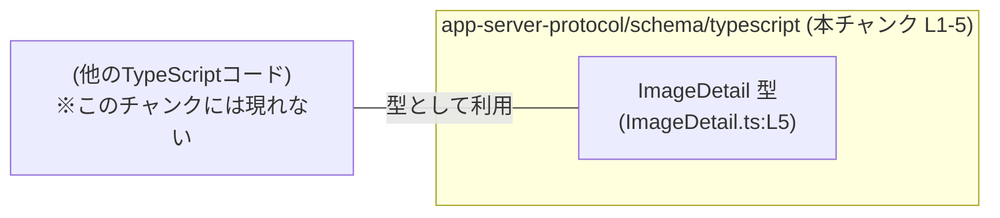
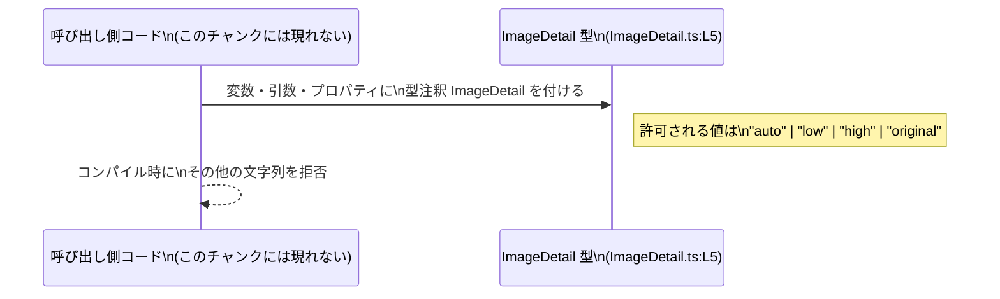

# app-server-protocol/schema/typescript/ImageDetail.ts

## 0. ざっくり一言

このファイルは、TypeScript 側で **`ImageDetail` という文字列リテラル・ユニオン型**を定義し、「`auto` / `low` / `high` / `original` の4種類の文字列だけを許可する型」を提供する生成コードです（ImageDetail.ts:L1-5）。

---

## 1. このモジュールの役割

### 1.1 概要

- このモジュールは、TypeScript で **`ImageDetail` 型**を定義し、コード中で使われる文字列値を `"auto" | "low" | "high" | "original"` のいずれかに制約する役割を持ちます（ImageDetail.ts:L5）。
- 先頭コメントから、このファイルは **`ts-rs` による自動生成コード**であり、手動で編集しないことが明示されています（ImageDetail.ts:L1-3）。

> 命名と値の内容から、画像の「詳細度」や「品質レベル」の指定に使われる型と解釈できますが、その用途はこのチャンク単体からは断定できません。

### 1.2 アーキテクチャ内での位置づけ

- ディレクトリ `schema/typescript` と、`ts-rs` で生成されていること（ImageDetail.ts:L3）から、**サーバー側のスキーマ定義（おそらく Rust）から TypeScript 型を生成した一部**と分かります。
- このファイル自身は **他モジュールを import しておらず**、外部に `ImageDetail` 型を export するだけの、**依存先を持たない型定義モジュール**です（ImageDetail.ts:L5）。

このチャンクに基づく依存関係のイメージ図は次のとおりです。



- `ClientCode` は、このチャンクには登場しません。`ImageDetail` を利用するであろう外部コードを抽象的に示したものです。

### 1.3 設計上のポイント

コードから読み取れる設計上の特徴は次のとおりです。

- **生成コードであることが明示されている**  
  - 「GENERATED CODE」「Do not edit this file manually」とコメントされています（ImageDetail.ts:L1-3）。
  - このため、設計変更は生成元（Rust 側の型など）で行う前提です。このファイルを直接編集すると、再生成時に上書きされます。

- **文字列リテラル・ユニオン型による表現**  
  - `export type ImageDetail = "auto" | "low" | "high" | "original";` という **文字列リテラルのユニオン型**で定義されています（ImageDetail.ts:L5）。
  - これにより **型レベルで許可される値が4種類に限定**され、TypeScript のコンパイル時に不正な文字列が検出されます。

- **状態やロジックを持たない純粋な型定義**  
  - クラスや関数、変数定義などは存在せず、**ランタイムの状態や処理ロジックは一切持っていません**（ImageDetail.ts:L1-5）。
  - エラーハンドリングや並行性制御も、このファイル単体では関与しません。

- **TypeScript の型安全性向上が主目的**  
  - JavaScript のように「ただの `string`」ではなく、**特定の候補のみを許す型**にすることで、IDE 補完や型チェックの恩恵を受けやすくなっています（ImageDetail.ts:L5）。

---

## 2. 主要な機能一覧

このモジュールは型定義のみを提供しており、関数やクラスはありません。主要な提供要素は次の1つです。

- **`ImageDetail` 型**: `"auto" | "low" | "high" | "original"` のいずれかを表す文字列リテラル・ユニオン型です（ImageDetail.ts:L5）。命名から、画像の詳細度や品質設定などを表す用途が想定されますが、具体的な意味づけはこのチャンクには現れません。

---

## 3. 公開 API と詳細解説

### 3.1 型一覧（構造体・列挙体など）

| 名前         | 種別                         | 役割 / 用途（解釈）                                                                                         | 定義箇所                | 許可される値                                |
|--------------|------------------------------|-------------------------------------------------------------------------------------------------------------|-------------------------|---------------------------------------------|
| `ImageDetail` | 型エイリアス（文字列リテラル・ユニオン） | `"auto"`, `"low"`, `"high"`, `"original"` の4種類の文字列だけを許可する型。画像詳細度や品質レベルの指定を表現していると解釈できます。 | ImageDetail.ts:L5 | `"auto"`, `"low"`, `"high"`, `"original"` |

> 備考: 「役割 / 用途」の説明は、型名と文字列内容からの解釈であり、厳密な仕様はこのチャンク単体からは分かりません。

### 3.2 関数詳細（最大 7 件）

このファイルには **関数定義が一切存在しません**（ImageDetail.ts:L1-5）。  
したがって、詳細解説対象の関数はありません。

### 3.3 その他の関数

同様に、ヘルパー関数やラッパー関数も定義されていません（ImageDetail.ts:L1-5）。

---

## 4. データフロー

このファイルは **型定義のみ**であり、実行時の処理フローは持ちません。ただし、型としての `ImageDetail` が、他コード内でどのようにデータの流れを制約するかを概念的に示すことはできます。

### 4.1 概念的なデータフロー

`ImageDetail` 型を利用する典型的な場面を、概念的なシーケンス図で表します。



- 実際のデータ（文字列値 `"auto"` など）は **`Caller` 側のコードで生成**されます。
- `ImageDetail` 型は **コンパイル時にのみ影響**し、実行時にはただの `string` として扱われる点が TypeScript 特有の挙動です。
- このチャンクには、`Caller` に相当する具体的なモジュール名・関数名は現れません。

---

## 5. 使い方（How to Use）

### 5.1 基本的な使用方法

`ImageDetail` 型をインポートして使う、最も単純な例です。  
パスは利用プロジェクトの構成に依存するため、ここでは相対パスを例示します。

```typescript
// ImageDetail 型をインポートする                          // 型定義ファイルから ImageDetail を読み込む
import type { ImageDetail } from "./ImageDetail";         // 実際のパスはビルド環境に依存（例示）

// ImageDetail を引数に取る関数を定義する                  // detail は ImageDetail 型として制約される
function setImageDetail(detail: ImageDetail) {            // detail: "auto" | "low" | "high" | "original"
    console.log("detail =", detail);                      // 実行時には通常の string として扱われる
}

// 許可される値の例                                          // 4種類の文字列はコンパイル時に許可される
setImageDetail("auto");
setImageDetail("low");
setImageDetail("high");
setImageDetail("original");

// 許可されない値（コンパイルエラーの例）                    // "medium" は ImageDetail に含まれないため型エラー
// setImageDetail("medium");
```

- `"medium"` のような文字列は、**コンパイル時にエラー**になり、実行まで到達しません。
- 実行時に型チェックは行われないため、JavaScript や JSON からの入力に対しては別途ランタイムチェックが必要です（このファイルでは提供されません）。

### 5.2 よくある使用パターン

#### 5.2.1 オブジェクトのプロパティとして利用

`ImageDetail` を設定オブジェクトなどのプロパティに使う例です。

```typescript
import type { ImageDetail } from "./ImageDetail"; // ImageDetail 型を利用する

// 画像設定を表す型を定義する                               // detail プロパティに ImageDetail 型を使用
type ImageConfig = {
    id: string;                                          // 画像ID
    detail: ImageDetail;                                 // 画像詳細度（auto/low/high/original のいずれか）
};

// 設定オブジェクトを作成する                               // detail に "high" を指定
const config: ImageConfig = {
    id: "img_123",
    detail: "high",                                      // 許可される値
};

// 間違いの例（コンパイルエラー）                            // "max" は ImageDetail に含まれない
// const badConfig: ImageConfig = {
//     id: "img_456",
//     detail: "max",                                     // 型エラー
// };
```

#### 5.2.2 関数の戻り値として利用

```typescript
import type { ImageDetail } from "./ImageDetail"; // ImageDetail 型を利用する

// ImageDetail を返す関数を定義する                         // detail の決定ロジックは任意
function decideDetail(isMobile: boolean): ImageDetail {
    // モバイルなら low、それ以外なら auto を返す例        // 返り値は ImageDetail 型
    return isMobile ? "low" : "auto";
}

const d1 = decideDetail(true);                           // d1 の型は ImageDetail
const d2 = decideDetail(false);                          // d2 も ImageDetail
```

### 5.3 よくある間違い

この型を使う上で起こりやすい誤りと、その修正例です。

```typescript
import type { ImageDetail } from "./ImageDetail";

// 間違い例: 単なる string 型で受けてしまう                 // 型制約が効かない
function setDetailWrong(detail: string) {                // detail: string （何でも入ってしまう）
    // ...
}

// 正しい例: ImageDetail 型を使う                           // 許可される文字列に限定される
function setDetailCorrect(detail: ImageDetail) {         // detail: "auto" | "low" | "high" | "original"
    // ...
}

// 間違い例: any や as キャストで型を回避する                // 型安全性を失う
const raw: any = "unknown";                              // any にすると何でも代入できる
// const unsafe: ImageDetail = raw;                      // コンパイル上は通るが、実行時には不正値の可能性

// 正しい例: 値の妥当性を事前にチェックする                  // ランタイムチェックで安全性を高める
function toImageDetail(value: string): ImageDetail | undefined {
    if (value === "auto" || value === "low" || value === "high" || value === "original") {
        return value as ImageDetail;                     // ここでのキャストは条件で担保されている
    }
    return undefined;                                    // 不正な値は undefined で扱う
}
```

- `string` や `any` を使うと、`ImageDetail` の型制約の恩恵が失われます。
- `as ImageDetail` のような **無条件キャストは安全でない**ため、事前チェックと組み合わせる必要があります。

### 5.4 使用上の注意点（まとめ）

- **手動編集禁止**  
  - コメントで「GENERATED CODE」「Do not edit this file manually」と明記されています（ImageDetail.ts:L1-3）。  
    設計変更は生成元で行う必要があります。

- **許可される値は4種類のみ**  
  - `"auto" | "low" | "high" | "original"` 以外の文字列は **コンパイルエラー**になります（ImageDetail.ts:L5）。
  - `null` や `undefined` も含まれていないため、`ImageDetail` 型の変数にそれらを代入しようとすると型エラーとなります。

- **ランタイムのバリデーションは行われない**  
  - TypeScript の型はコンパイル時だけ有効です。  
    JSON などの外部入力に対しては、別途実行時のチェックが必要です（このファイルには含まれません）。

- **並行性・エラーハンドリングへの関与はない**  
  - このモジュールは型定義のみで、Promise や非同期処理、例外処理には関与しません（ImageDetail.ts:L1-5）。

- **セキュリティ面**  
  - この型自体はロジックを持たず直接攻撃ベクトルにはなりにくい一方、  
    ランタイムチェックを省略して型だけに頼ると、実際の入力が不正でも通ってしまう可能性があります。

---

## 6. 変更の仕方（How to Modify）

### 6.1 新しい機能を追加する場合

このファイルは `ts-rs` による生成コードであり（ImageDetail.ts:L3）、直接変更しない前提です。

- **新しい詳細レベル文字列を追加したい場合**  
  - 例: `"medium"` を追加したい場合、
    - 通常は **生成元（Rust 側の型定義など）に `"medium"` 相当の値を追加**し、
    - その後 `ts-rs` によるコード生成を再実行して、このファイルを再生成します。
  - 生成元の具体的な場所や型名は、このチャンクからは分かりません（不明）。

- このファイルを直接書き換えても、次の生成時に上書きされる可能性が高い点に注意が必要です。

### 6.2 既存の機能を変更する場合

`ImageDetail` 型の既存値を変更・削除したい場合の注意点です。

- **影響範囲**  
  - `ImageDetail` 型を利用しているすべての TypeScript コード（関数引数、戻り値、オブジェクトのプロパティなど）が影響を受けます。
  - ただし、このチャンクには利用箇所が現れていないため、具体的なファイル名や関数名は不明です。

- **変更時の契約（前提条件）**  
  - `ImageDetail` 型の契約は「4つの文字列以外を許容しない」ことです（ImageDetail.ts:L5）。
  - 文字列を削除した場合、その値を使用していた呼び出し側はコンパイルエラーになります。
  - 文字列を変更（`"high"` → `"hi_quality"` など）した場合も同様です。

- **テスト・確認**  
  - 生成元を変更したら、TypeScript 側では少なくともコンパイルを実行し、`ImageDetail` を使う箇所でエラーが出ていないか確認する必要があります。
  - ランタイムテスト（API の入出力など）がある場合は、それらも併せて確認することが望ましいですが、このチャンクにはテストコードは現れていません。

---

## 7. 関連ファイル

このチャンクから分かる関連情報は限定的です。

| パス / 名前 | 役割 / 関係 |
|------------|------------|
| Rust 側の ts-rs 生成元（パス不明） | コメントにあるように、この TypeScript 型は `ts-rs` により生成されています（ImageDetail.ts:L3）。生成元となる Rust の型（構造体・列挙体など）が存在するはずですが、このチャンクにはパスや名前は現れていません。 |
| `app-server-protocol/schema/typescript` 内の他の `.ts` ファイル | 同じ生成プロセスで作られた、他のスキーマ型定義ファイルと考えられますが、具体的なファイル名・内容はこのチャンクには現れません。 |

---

### コンポーネントインベントリー（まとめ）

最後に、このチャンクに現れる定義要素の一覧と根拠行をまとめます。

| 種別   | 名前         | 説明                                                                                      | 定義 / 根拠 |
|--------|--------------|-------------------------------------------------------------------------------------------|-------------|
| 型     | `ImageDetail` | `"auto" | "low" | "high" | "original"` の4つの文字列リテラルからなるユニオン型。生成コードとして export される。 | ImageDetail.ts:L5 |
| コメント | 生成コード警告 | 「GENERATED CODE」「Do not modify by hand」「Do not edit this file manually」など、手動編集禁止を示すコメント。 | ImageDetail.ts:L1-3 |

このファイルには関数・クラス・変数定義は存在せず（ImageDetail.ts:L1-5）、公開 API は `ImageDetail` 型のみです。
