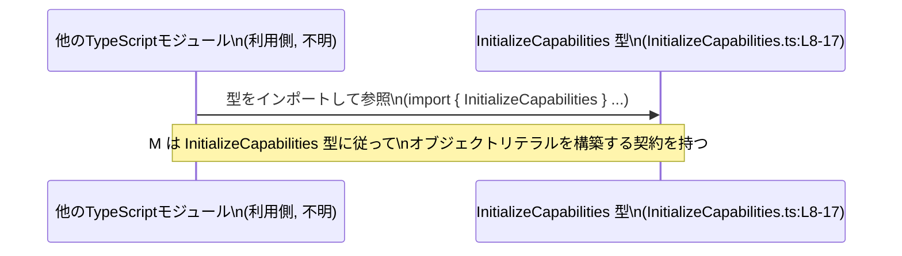

# app-server-protocol/schema/typescript/InitializeCapabilities.ts

## 0. ざっくり一言

`InitializeCapabilities` 型は、プロトコルの初期化処理（initialize）時にクライアント側が宣言する「サーバーに対する能力・希望設定」を表現する TypeScript の型定義です（InitializeCapabilities.ts:L5-8）。

---

## 1. このモジュールの役割

### 1.1 概要

- このファイルは、`InitializeCapabilities` という型エイリアス（type alias）を 1 つ公開します（InitializeCapabilities.ts:L8）。
- 型の目的は、「initialize フェーズでクライアントが宣言する capabilities（機能／挙動の希望）」を構造化して表現することです（InitializeCapabilities.ts:L5-7）。
- 具体的には、実験的 API を受け取るかどうかのフラグと、抑止したい通知メソッドの一覧を保持します（InitializeCapabilities.ts:L9-17）。

### 1.2 アーキテクチャ内での位置づけ

コメントから、このファイルは Rust から TypeScript 型を生成する `ts-rs` によって自動生成されていることが分かります（InitializeCapabilities.ts:L1-3）。Rust 側のスキーマと TypeScript 側のスキーマを同期させるための一部であると解釈できます。

```mermaid
graph TD
    subgraph Rust側スキーマ（推定）
        R["Rust 型定義\n(不明, このチャンクには現れない)"]
    end

    G["ts-rs コードジェネレータ\n(コメントより)\n(InitializeCapabilities.ts:L1-3)"]
    T["InitializeCapabilities 型\n(InitializeCapabilities.ts:L8-17)"]

    R --> G
    G --> T
```

- 実際にどのモジュールが `InitializeCapabilities` をインポートしているかは、このチャンクには現れません。
- ただし `export type` で公開されているため、他ファイルからこの型をインポートして利用する前提になっています（InitializeCapabilities.ts:L8）。

### 1.3 設計上のポイント

コードから読み取れる設計上の特徴は次のとおりです。

- **自動生成コードであることの明示**  
  - 冒頭で「GENERATED CODE」「Do not edit manually」と明示されています（InitializeCapabilities.ts:L1-3）。
  - 手動での変更ではなく、元となる定義（Rust 側）を編集する運用が想定されています。

- **責務の明確な分離**  
  - このファイルは「データ構造の定義」のみに責務を持ち、処理ロジックや関数は含まれていません（InitializeCapabilities.ts:L8-17）。

- **型安全性**  
  - `experimentalApi` は必須の `boolean` として定義され、必ず `true`/`false` を明示する契約になっています（InitializeCapabilities.ts:L9-12）。
  - `optOutNotificationMethods` は **オプショナル** (`?`) かつ `Array<string> | null` というユニオン型で、値の有無・null を表現できるようになっています（InitializeCapabilities.ts:L13-17）。

- **エラーハンドリング／並行性**  
  - 実行時ロジックがなく、型定義のみのため、このファイル単体ではエラー処理や並行処理は扱いません。
  - 型レベルで「扱うべきケース（必須・任意・null 可能）」を表現することで、コンパイル時に不整合を検出する設計です。

---

## 2. 主要な機能一覧

このファイルは「機能」というより「データ構造」を提供しますが、公開 API 観点で整理すると次の 1 点です。

- `InitializeCapabilities` 型:  
  initialize 時にクライアントが宣言する capability 情報を表すオブジェクト型（InitializeCapabilities.ts:L5-7, L8-17）

  - `experimentalApi: boolean`  
    実験的な API メソッドやフィールドの受信に opt-in するかどうかを示すフラグ（InitializeCapabilities.ts:L9-12）。
  - `optOutNotificationMethods?: Array<string> | null`  
    この接続ではサーバーから送ってほしくない通知メソッド名の完全修飾名リスト（例: `thread/started`）（InitializeCapabilities.ts:L13-17）。

---

## 3. 公開 API と詳細解説

### 3.1 型一覧（構造体・列挙体など）

| 名前                     | 種別        | 役割 / 用途                                                                                             | 定義位置                           |
|--------------------------|-------------|----------------------------------------------------------------------------------------------------------|------------------------------------|
| `InitializeCapabilities` | 型エイリアス | initialize 時にクライアントが宣言する capability 情報を持つオブジェクト型                               | InitializeCapabilities.ts:L8-17    |

**`InitializeCapabilities` のフィールド**

| フィールド名                 | 型                             | 必須/任意         | 説明                                                                 | 定義位置                               |
|-----------------------------|--------------------------------|-------------------|------------------------------------------------------------------------|----------------------------------------|
| `experimentalApi`           | `boolean`                      | 必須              | 実験的 API メソッドとフィールドの受信に opt-in するかどうかを示す     | InitializeCapabilities.ts:L9-12        |
| `optOutNotificationMethods` | `Array<string> \| null`（+暗黙の `undefined`） | オプショナル (`?`) | この接続では抑止したい通知メソッド名の完全名リスト。`null`/未指定も許容 | InitializeCapabilities.ts:L13-17       |

> 補足: `optOutNotificationMethods?: Array<string> \| null` という宣言のため、TypeScript の型チェック上は  
> `Array<string> \| null \| undefined` の 3 通りを取りうる点が重要です。

### 3.2 関数詳細（最大 7 件）

このファイルには関数・メソッドが定義されていません（InitializeCapabilities.ts:L1-17）。  
そのため、この節で解説すべき対象はありません。

### 3.3 その他の関数

同様に、このファイルには補助関数やラッパー関数も存在しません（InitializeCapabilities.ts:L1-17）。

---

## 4. データフロー

このファイル単体には処理ロジックがないため、**実行時のフローは定義されていません**。  
ここでは、「他モジュールからこの型がどのように利用されるか」という観点の最小限のデータフローを示します。



- 実際にどのモジュールが `InitializeCapabilities` をインポートしているか、またどのような機能（RPC など）で使われるかは、このチャンクには現れません。
- ただし `export` されていることから、少なくとも 1 箇所以上でこの型に準拠した値がやり取りされる設計になっています（InitializeCapabilities.ts:L8）。

---

## 5. 使い方（How to Use）

### 5.1 基本的な使用方法

ここでは、この型をインポートしてオブジェクトを構築する典型例を示します。  
（関数名などは例示であり、このリポジトリ内に実在するとは限りません。）

```typescript
// 他ファイルから InitializeCapabilities をインポートする例
import type { InitializeCapabilities } from "./schema/typescript/InitializeCapabilities"; // 実際の相対パスは環境に依存

// クライアントの initialize 時に送る capabilities を組み立てる例
const capabilities: InitializeCapabilities = {
    experimentalApi: true,                         // 実験的 API を受信したい場合は true
    optOutNotificationMethods: [                  // 抑止したい通知メソッド名を完全名で列挙
        "thread/started",
        "thread/exited",
    ],
};

// 例: 何らかの initialize リクエスト構築処理に渡す
sendInitializeRequest({
    capabilities,
});
```

- `experimentalApi` は必須なので、省略すると TypeScript のコンパイルエラーになります（InitializeCapabilities.ts:L9-12）。
- `optOutNotificationMethods` は任意なので、指定しない場合はプロパティを省略できます（InitializeCapabilities.ts:L13-17）。

### 5.2 よくある使用パターン

1. **実験的 API を利用しない場合**

```typescript
const capabilities: InitializeCapabilities = {
    experimentalApi: false,           // 実験的 API を無効にする
    // optOutNotificationMethods は省略可能
};
```

1. **通知抑止リストを後から追加する場合**

```typescript
let capabilities: InitializeCapabilities = {
    experimentalApi: true,
};

// 後から optOutNotificationMethods を設定する
capabilities = {
    ...capabilities,
    optOutNotificationMethods: ["thread/started"],
};
```

1. **`optOutNotificationMethods` が `null`/`undefined` の場合を安全に扱う**

```typescript
function isNotificationEnabled(
    capabilities: InitializeCapabilities,
    method: string,
): boolean {
    // ?. により undefined と null 両方で安全に短絡評価できる
    const suppressed = capabilities.optOutNotificationMethods?.includes(method) ?? false;
    return !suppressed;
}
```

- `optOutNotificationMethods` は `undefined`（プロパティ未定義）にも `null` にもなり得るため、`?.` や `??` を使うと安全に扱えます（InitializeCapabilities.ts:L13-17）。

### 5.3 よくある間違い

**間違い例: `optOutNotificationMethods` を常に配列と仮定する**

```typescript
function incorrect(capabilities: InitializeCapabilities) {
    // コンパイルは通る可能性があるが、実行時にエラーになりうる例
    for (const method of capabilities.optOutNotificationMethods) {
        // ...
    }
    // optOutNotificationMethods が undefined または null の場合、
    // 実行時に TypeError: Cannot read properties of undefined/null が発生する
}
```

**正しい例: null/undefined を考慮する**

```typescript
function correct(capabilities: InitializeCapabilities) {
    const methods = capabilities.optOutNotificationMethods ?? [];
    for (const method of methods) {
        // ...
    }
}
```

- `?: Array<string> \| null` という宣言のため、`undefined` / `null` の両方を考慮したガードが必要になります（InitializeCapabilities.ts:L13-17）。

### 5.4 使用上の注意点（まとめ）

- **前提条件**
  - `experimentalApi` は必須であり、値を省略できません（InitializeCapabilities.ts:L9-12）。
  - `optOutNotificationMethods` を使用するコードは、`undefined` と `null` を考慮した分岐を行う必要があります（InitializeCapabilities.ts:L13-17）。

- **禁止事項 / 運用上の注意**
  - ファイル冒頭にある通り、このファイルは自動生成されるため、「直接編集しない」ことが前提です（InitializeCapabilities.ts:L1-3）。
    - 仕様変更が必要な場合は、元となる Rust 側の定義やコードジェネレータの設定を変更する運用が想定されます。

- **安全性（型レベル）**
  - TypeScript の静的型チェックにより、`experimentalApi` を設定し忘れたり、`optOutNotificationMethods` に文字列以外を入れることはコンパイル時に検出されます（InitializeCapabilities.ts:L8-17）。
  - ただし、実行時には JSON などから逆シリアライズされるケースも想定されるため、ランタイム側でのバリデーションの有無は別途確認が必要です。この点については、このチャンクからは分かりません。

- **並行性**
  - この型は純粋なデータ構造であり、ミューテーションや共有状態を含まないため、単体では並行性やスレッド安全性の問題は発生しません。

- **セキュリティ**
  - このファイル自体は型定義のみであり、外部入力の処理や権限チェックは行いません。
  - どの通知メソッドを抑止できるかは、プロトコル全体の設計に依存し、このチャンクからは判断できません。

---

## 6. 変更の仕方（How to Modify）

### 6.1 新しい機能を追加する場合

このファイルは `ts-rs` により自動生成されているため、**直接編集は前提としていません**（InitializeCapabilities.ts:L1-3）。  
機能追加を行う場合の一般的な流れは次のようになります（ただし、Rust 側の実際の構成はこのチャンクには現れません）。

1. Rust 側の元となる型定義に、必要なフィールドを追加する。  
   （例: `supportsFoo: bool` など。ファイルや型名は不明です。）
2. `ts-rs` を用いたコード生成プロセスを再実行し、`InitializeCapabilities.ts` を再生成する。
3. TypeScript 側の利用コードで、新しいフィールドを参照するように更新する。

このファイルを直接編集すると、次回の自動生成で上書きされる可能性があります。

### 6.2 既存の機能を変更する場合

- **影響範囲の確認**
  - `InitializeCapabilities` をインポートしているすべてのモジュールに影響するため、利用箇所の確認が必要です。
  - 利用箇所の情報はこのチャンクには現れないため、プロジェクト全体の参照検索などが必要です。

- **契約上の注意点**
  - `experimentalApi` を任意に変更したり削除すると、プロトコルの互換性に影響する可能性があります（InitializeCapabilities.ts:L9-12）。
  - `optOutNotificationMethods` の null/undefined の意味を変更すると、既存コードの挙動が変わる可能性があります（InitializeCapabilities.ts:L13-17）。

- **テスト**
  - このチャンクにはテストコードは含まれていません（InitializeCapabilities.ts:L1-17）。
  - プロトコルレベルの互換性テストやシリアライズ/デシリアライズのテストが存在する場合、それらを更新・確認する必要があります（テストファイルの有無はこのチャンクからは不明です）。

---

## 7. 関連ファイル

このチャンクには他ファイルへの参照はコメント以外に現れませんが、推定される関連は次のとおりです。

| パス / コンポーネント              | 役割 / 関係                                                                                 |
|------------------------------------|--------------------------------------------------------------------------------------------|
| Rust 側の対応する型定義（不明）    | `ts-rs` により本 TypeScript 型に変換される元のデータ構造。パスや型名はこのチャンクからは分かりません。 |
| コードジェネレータ設定（不明）     | `ts-rs` の設定ファイルやビルドスクリプト。どこで実行されているかはこのチャンクには現れません。     |
| `InitializeCapabilities` を利用する TS ファイル群（不明） | initialize 処理の入出力スキーマとしてこの型を参照するモジュール。具体的なファイルは不明です。 |

> これ以上の依存関係（具体的なファイルパスやモジュール名）は、このチャンクには現れないため特定できません。
