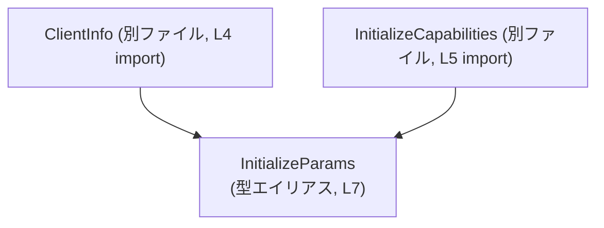
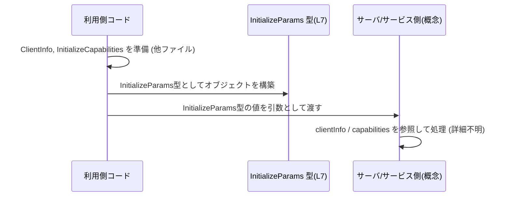

# app-server-protocol/schema/typescript/InitializeParams.ts

## 0. ざっくり一言

`InitializeParams` 型は、クライアント情報 (`ClientInfo`) と初期化時の機能情報 (`InitializeCapabilities | null`) をまとめて表現する **データコンテナ型** です（`InitializeParams.ts:L4-5, L7`）。  
このファイルは `ts-rs` によって自動生成されており、**手動で編集しない前提**になっています（`InitializeParams.ts:L1-3`）。

---

## 1. このモジュールの役割

### 1.1 概要

- このモジュールは、TypeScript 側で **初期化リクエストのパラメータを表現するための型** `InitializeParams` を提供します（`InitializeParams.ts:L7`）。
- `clientInfo` フィールドにクライアント情報を、`capabilities` フィールドに機能情報（ない場合は `null`）を保持する構造になっています（`InitializeParams.ts:L7`）。
- 型定義のみを含み、**実行時のロジック・関数・エラー処理は一切含まれていません**（`InitializeParams.ts:L4-7`）。

> 型名からは「何らかのプロトコル（例: LSP）の Initialize RPC のパラメータ」であることが想定されますが、このチャンクのコードだけではプロトコル名や詳細な用途は断定できません。

### 1.2 アーキテクチャ内での位置づけ

このファイルは、他モジュールで定義された `ClientInfo` と `InitializeCapabilities` に依存する **型定義モジュール** です。

- `ClientInfo` を型レベルで参照（`InitializeParams.ts:L4, L7`）
- `InitializeCapabilities` を型レベルで参照（`InitializeParams.ts:L5, L7`）

Mermaid 図で依存関係を示します（このチャンクのコード範囲: `InitializeParams.ts:L1-7`）:



`ClientInfo` と `InitializeCapabilities` の中身はこのチャンクには現れず、詳細は不明です（`InitializeParams.ts:L4-5`）。

### 1.3 設計上のポイント

コードから読み取れる特徴は次のとおりです。

- **自動生成コード**  
  - 冒頭コメントで `ts-rs` により生成されたコードであり、手動編集禁止であると明示されています（`InitializeParams.ts:L1-3`）。
- **型のみを提供し、状態やロジックを持たない**  
  - 関数・クラス・変数定義はなく、`export type` のみです（`InitializeParams.ts:L7`）。
- **nullable なフィールドを明示**  
  - `capabilities` が `InitializeCapabilities | null` となっており、「値がない」ケースを `null` で表現する契約になっています（`InitializeParams.ts:L7`）。
- **エラーハンドリング・並行性はこのモジュールの責務外**  
  - 実行時コードがないため、エラー処理や非同期・並行処理に関する方針はこのファイルからは読み取れません。

---

## 2. 主要な機能一覧（コンポーネントインベントリー）

このファイルに現れるコンポーネント（型・依存）を一覧にします。

| 名前 | 種別 | 定義元 | 役割 / 用途（このチャンクから読み取れる範囲） | 根拠 |
|------|------|--------|-----------------------------------------------|------|
| `InitializeParams` | 型エイリアス（オブジェクト型） | このファイル | `clientInfo` と `capabilities` をまとめたパラメータオブジェクト | `InitializeParams.ts:L7` |
| `clientInfo` | フィールド | `InitializeParams` | クライアント情報を表す `ClientInfo` 型の値 | `InitializeParams.ts:L7` |
| `capabilities` | フィールド | `InitializeParams` | 初期化時の機能情報。値がない場合は `null` を許容 | `InitializeParams.ts:L7` |
| `ClientInfo` | 型（詳細不明） | 別ファイル `"./ClientInfo"` | `clientInfo` の型。具体的な構造はこのチャンクには現れない | `InitializeParams.ts:L4, L7` |
| `InitializeCapabilities` | 型（詳細不明） | 別ファイル `"./InitializeCapabilities"` | `capabilities` の非 `null` 時の型。具体的な構造は不明 | `InitializeParams.ts:L5, L7` |

関数・クラス・列挙体などの定義はこのファイルには存在しません（`InitializeParams.ts:L4-7`）。

---

## 3. 公開 API と詳細解説

### 3.1 型一覧（構造体・列挙体など）

#### `InitializeParams`

`export type InitializeParams = { ... }` としてエクスポートされる TypeScript の型エイリアスです（`InitializeParams.ts:L7`）。

| フィールド名 | 型 | 必須/任意 | 説明（このチャンクから分かる範囲） | 根拠 |
|--------------|----|-----------|--------------------------------------|------|
| `clientInfo` | `ClientInfo` | 必須 | クライアントに関する情報を保持するフィールド | `InitializeParams.ts:L7` |
| `capabilities` | `InitializeCapabilities \| null` | 必須（ただし値として `null` 可） | クライアントの初期化能力情報。値がない場合は `null` | `InitializeParams.ts:L7` |

**型としての役割**

- 呼び出し元コードは、`InitializeParams` 型のオブジェクトを構築して他コンポーネントに渡すことが想定されます。
- `clientInfo` は常に `ClientInfo` 型である必要があり、`undefined` は許容されません（型注釈上、`undefined` は含まれていません。`InitializeParams.ts:L7`）。
- `capabilities` は `InitializeCapabilities` 型または `null` のどちらかで、そのどちらでもない値（例えば `undefined` や `number`）はコンパイル時に型エラーとなります。

> `ClientInfo` と `InitializeCapabilities` の詳細なフィールド構造や意味は、このチャンクには出てこないため不明です。

### 3.2 関数詳細

このファイルには **関数・メソッド・クラスメソッドの定義が存在しません**（`InitializeParams.ts:L4-7`）。  
そのため、「関数詳細」のテンプレートに従って説明できる対象はありません。

- エラー発生条件、panic、内部アルゴリズムなどは本ファイルからは読み取れません。
- TypeScript コンパイラによる **型チェックエラー** が唯一の「エラー」に近い要素です（型に合わないオブジェクトを代入した場合など）。

### 3.3 その他の関数

補助関数やラッパー関数も定義されていません（`InitializeParams.ts:L4-7`）。

---

## 4. データフロー

このファイル自体には実行時の処理フローはありませんが、`InitializeParams` 型の典型的な利用イメージとして、**オブジェクト生成 → 別コンポーネントへの受け渡し** というデータフローが想定されます。

> 以下の図は「型の使い方」の概念図であり、特定の関数名・モジュール名はコードからは確認できないため、抽象化しています。



- `ClientInfo` / `InitializeCapabilities` の具体的な生成方法や `S`（受け取る側）の正体は、このチャンクには現れません。
- データフロー上の注意点は、`capabilities` が `null` を取りうることで、受け側で **null チェックが必須** になる点です（`InitializeParams.ts:L7`）。

---

## 5. 使い方（How to Use）

### 5.1 基本的な使用方法

`InitializeParams` 型を利用する典型的なパターンは、「必要な型を import して、型に合致するオブジェクトを作る」使い方です。

```typescript
// InitializeParams, ClientInfo, InitializeCapabilities をインポートする例
import type { InitializeParams } from "./InitializeParams";          // 本ファイルの型
import type { ClientInfo } from "./ClientInfo";                      // L4で参照されている型
import type { InitializeCapabilities } from "./InitializeCapabilities"; // L5で参照されている型

// 何らかの方法で ClientInfo と InitializeCapabilities を用意する
const clientInfo: ClientInfo = {
    // ClientInfoの具体的な構造はこのチャンクからは不明のため省略
};

const capabilities: InitializeCapabilities = {
    // InitializeCapabilitiesの構造も不明のため省略
};

// InitializeParams型のオブジェクトを構築する
const params: InitializeParams = {
    clientInfo,                         // ClientInfo型で必須
    capabilities,                       // InitializeCapabilities型。nullではないケース
};

// 例: paramsを他の関数やRPCクライアントに渡す
// sendInitializeRequest(params);
```

このコードにより、`params` が `InitializeParams` の形に従っているかを TypeScript コンパイラがチェックします。

### 5.2 よくある使用パターン

1. **capabilities が存在しない（`null`）ケース**

```typescript
const clientInfo: ClientInfo = { /* ... */ };

const paramsWithoutCapabilities: InitializeParams = {
    clientInfo,                         // ClientInfoは必須
    capabilities: null,                 // 機能情報が不明・未設定なケース
};
```

- `capabilities` を省略すると型上はエラーになります（`InitializeParams` のフィールド定義に `?` がないため、省略は許可されません。`InitializeParams.ts:L7`）。
- 「値は必ず存在するが、その値として `null` も許容する」という設計になっています。

1. **型推論を利用したコード**

```typescript
function buildParams(
    clientInfo: ClientInfo,
    capabilities: InitializeCapabilities | null,
): InitializeParams {
    // 戻り値の型をInitializeParamsに指定することで、
    // オブジェクトリテラルが型に準拠しているかコンパイル時にチェックされる
    return { clientInfo, capabilities };
}
```

- `buildParams` の戻り値型を `InitializeParams` にした場合、フィールド名の誤記や型不一致がコンパイル時に検出されます。

### 5.3 よくある間違い

この型定義から推測される誤用パターンと、その修正例です。

```typescript
import type { InitializeParams } from "./InitializeParams";

// 間違い例: capabilities を省略している
const badParams1: InitializeParams = {
    clientInfo: {/* ... */},
    // capabilities フィールドがない → コンパイルエラー
};

// 間違い例: capabilities に undefined をセットしている
const badParams2: InitializeParams = {
    clientInfo: {/* ... */},
    capabilities: undefined,  // エラー: 型は InitializeCapabilities | null であり undefined は含まれない
};

// 正しい例: capabilities を必ず指定し、ない場合は null を明示
const goodParams: InitializeParams = {
    clientInfo: {/* ... */},
    capabilities: null,       // または InitializeCapabilities 型の値
};
```

また、受け取る側のコードでの典型的な誤り:

```typescript
function handle(params: InitializeParams) {
    // 間違い例: capabilities を non-null 前提で扱う
    // params.capabilities.someProp; // capabilities が null の可能性があり、実行時エラーの危険

    // 正しい例: null チェックを行う
    if (params.capabilities) {
        // ここでは InitializeCapabilities 型として安全にアクセスできる
        // params.capabilities.someProp;
    } else {
        // capabilities が未指定（null）のケースの処理
    }
}
```

### 5.4 使用上の注意点（まとめ）

- **generated ファイルを直接編集しない**  
  - 上部コメントに「DO NOT MODIFY BY HAND」と明記されています（`InitializeParams.ts:L1-3`）。変更が必要な場合は生成元（Rust 側の型定義など）を修正し、`ts-rs` による再生成が必要です。
- **`capabilities` の `null` 取り扱いに注意**  
  - 利用側コードでは `capabilities` が `null` でありうることを前提に設計する必要があります。null チェックを行わないと実行時エラー（`null` のプロパティ参照など）になりえます。
- **`undefined` は許容されない**  
  - 型定義上、`capabilities` は `InitializeCapabilities | null` であり、`undefined` は含まれていません（`InitializeParams.ts:L7`）。
- **並行性・スレッド安全性はこの型の関心外**  
  - このファイルは単なる型定義であり、非同期処理や共有状態を扱わないため、並行性に関する特別な注意は不要です。並行性の問題は、この型を利用する実行時コード側の設計に依存します。

---

## 6. 変更の仕方（How to Modify）

### 6.1 新しい機能を追加する場合

このファイルは `ts-rs` による自動生成コードであり、冒頭コメントで手動編集禁止とされています（`InitializeParams.ts:L1-3`）。

- フィールド追加・削除や型の変更などを行いたい場合:
  1. **生成元の Rust 側型定義**（`ts-rs` により TypeScript 定義が生成される元）を変更する必要があります。  
     - 具体的なファイルパス・型名はこのチャンクからは分かりません。
  2. `ts-rs` のコード生成プロセス（ビルドスクリプトや専用コマンドなど）を再実行し、この TypeScript ファイルを再生成します。
  3. 生成された `InitializeParams.ts` を手動で編集しないようにします。

このチャンクだけからは生成手順の詳細は分からないため、プロジェクトのビルドスクリプトや README を確認する必要があります。

### 6.2 既存の機能を変更する場合

例えば「`capabilities` をオプショナルにしたい（`?` を付けたい）」といった変更を行う場合も、**直接このファイルを書き換えるのは推奨されません**（`InitializeParams.ts:L1-3`）。

変更時に意識すべき点:

- **契約の変更**  
  - `capabilities` の必須性（現在は「必須フィールドだが値として `null` を許容」）を変更すると、利用側のコードでコンパイルエラーや実行時の前提崩れが発生します。利用側コードの洗い出しが必要です。
- **型の互換性**  
  - 既存コードが `InitializeParams` を使っている場合、フィールド名や型の変更は破壊的変更になりうるため、新旧の型を併存させるかどうかを検討する必要があります。
- **テスト**  
  - このファイルにはテストは含まれていませんが、プロジェクト全体として Initialize 相当の処理をテストするコードが存在する可能性があります。型定義を変えた場合はそれらのテストも更新が必要です。

---

## 7. 関連ファイル

このモジュールと直接的に関係するファイルはインポート文から次のように読み取れます。

| パス | 役割 / 関係 | 根拠 |
|------|-------------|------|
| `./ClientInfo` | `ClientInfo` 型を提供するモジュール。`InitializeParams.clientInfo` の型として参照される | `InitializeParams.ts:L4, L7` |
| `./InitializeCapabilities` | `InitializeCapabilities` 型を提供するモジュール。`InitializeParams.capabilities` の非 `null` 時の型として参照される | `InitializeParams.ts:L5, L7` |

これらのファイルの内容（フィールドや構造）はこのチャンクには現れないため、詳細な仕様は不明です。
